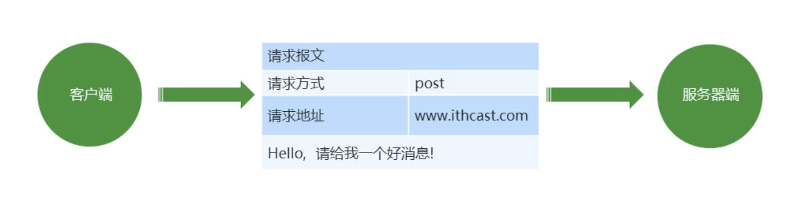

## AJAX ?

> [^AJAX]:Asynchronous JavaScript and XML，即**异步的 JavaScript 和 XML** ；
>
> 可以与服务器交换数据并更新部分网页的技术；
>
> `AJAX`不是新的编程语言，而是一种使用现有标准的新方法；


### Advantage

> 在**不重新加载整个页面**的情况下，可以**与服务器交换数据并更新部分网页内容**；


### ResponseData Format

> 服务器大多数情况下会以`JSON`对象作为响应数据的格式；
>
> 但是在 Http 的**请求与响应**过程中，数据都会转换成`String`字符串进行传输；
>
> ```javascript
> // 将字符串转换成 JSON 对象；
> JSON.parse()
> // 将 JSON 对象转换成字符串；
> JSON.stringify()
> ```


### Implementation Process

> `AJAX`技术要运行在网站环境中才能生效；


#### 创建 AJAX 对象

> ```javascript
> // 创建对象
> const xhr = new XMLHttpRequest();
> ```


#### 初始化

> ```javascript
> // 初始化，设置请求方法和请求地址（url）
> xhr.open('GET', 'http://127.0.0.1:8000/');
> ```


#### 发送请求

> ```javascript
> // 发送请求；
> xhr.send();
> ```


#### 获取响应数据

> ```javascript
> // 简写方式；
> xhr.onload = function(){
>   console.log(xhr.response);
> }
> 
> // 完整写法；
> xhr.onreadystatechange = function () {
>   // 判断数据的准备状态（服务器返回了所有的结果）
>   if (xhr.readyState === 4) {
>     // 判断响应状态码
>     if (xhr.status >= 200 && xhr.status < 300) {
>       // 处理响应数据；
>       console.log(xhr.status)
>       console.log(xhr.statusText)
>       console.log(xhr.getAllResponseHeaders())
>       console.log(xhr.response)
>       // 把请求的响应体放到DOM结构中
>       wrap.innerHTML = xhr.response;
>     }
>   }
> };
> ```

[^xhr.readystate]:`xhr`对象中的**请求状态码**属性，有5个值（[^0]，[^1]，[^2]，[^3]，[^4])；

> [^0]: 已经创建了 AJAX 对象，但还没有配置；
> [^1]:已经对 AJAX 对象进行了配置，但还没有发送请求；
> [^2]:请求已经发送；
> [^3]:接收到了服务器响应的**部分数据**；
> [^4]:响应数据已经**全部接受**完毕；

[^xhr.status]:响应状态码（200，404，403，401，500 ...）；
[^xhr.statusText]:响应状态字符串；
[^xhr.getAllResponseHeaders()]:获取响应数据中的所有响应头；
[^xhr.response]:响应体；


### Traditional Website

> 网速慢的情况下，页面加载时间长，用户只能等待；
>
> 表单提交后，如果有内容不正确，可能需要重新填写所有表单内容；
>
> 页面跳转，重新加载页面，造成资源浪费，增加等待时间；


## 请求参数传递

> 在请求页面和提交表单时，会向服务器传递参数；


### 请求报文

> 是在 http 请求和响应的过程中传递的[^数据块]；
>
> 

[^数据块]:包括要传递的数据和一些附加信息，都要遵守规定好的格式；


### 参数格式

> 用`xhr.setRequestHeader('Content-Type')`方法设置请求参数的格式；
>
> 一般网站中传递参数的格式都是**JSON**；


#### 查询字符串

> `application/x-www-form-urlencoded`；
>
> ```javascript
> const params = 'username=Kein&gender=Male&grade=A'
> ```


#### JSON 对象

> `application/json`；
>
> 告诉服务器当前请求参数的格式是 JSON ；
>
> ```javascript
> {
>     name: 'Kein',
>     gender: 'Male',
>     grade: 'A'
> }
> ```

[^Focus]:`GET`请求不能提交 JSON 格式的参数，只能传递查询字符串类型的；


### GET

> `GET`请求方式，在请求路径后面拼接[^查询字符串]；
>
> ```javascript
>xhr.open('GET','http://www.case.com?username=Kein&age=22');
> ```

[^查询字符串]:各个数据对之间用`&`隔开连接，数据名和值之间用`=`连接；


### POST

> `POST`请求在传递数据时，要**设置参数格式的类型**；
>
> 将**请求数据**通过 xhr.send() 方法传递给服务器；
>
> ```javascript
> // 设置请求参数格式的类型；
> xhr.setRequestHeader('Content-Type','application/x-www-form-urlencoded')
> // 发送请求；
> let parameter = '?username=Kein&age=22'
> xhr.send(parameter)
> ```


## 错误处理

> `AJAX`错误处理；
>
> 判断服务器响应的状态码`xhr.status`，然后分别进行处理；
>
> ```javascript
> // 服务器能收到请求，但响应结果不达预期；
> xhr.status === 400
> 
> // 服务器没有收到请求，可能是请求路径出错；
> xhr.status === 404
> 
> // 服务器能收到请求，但服务器端有错误，建议找后端程序员沟通；
> xhr.status === 500
> 
> // 网络离线中断；触发 onerror 事件；
> xhr.onerror = function(){
>     alert('网络中断，请检查网络连接情况')
> }
> ```


## 封装 AJAX

> `AJAX`函数封装，避免多次书写重复的代码，提高代码复用率；
>
> ```javascript
> function ajax(options) {
>   // 设置默认的配置项，防止用户没传导致错误；
>   let defaults = {
>     type: 'GET',
>     // 请求路径；
>     url: '',
>     data: {},
>     header: {},
>     success: function (data) {}
>   }
>   // 使用 potions 对象中的属性覆盖 defaults 对象中的属性；
>   // 使用户写的配置生效；
>   Object.assign(defaults, options);
>   // 创建 AJAX 对象；
>   const xhr = new XMLHttpRequest();
>   let parameter = '';
>   for (let item in defaults.data) {
>     parameter += item + '=' + defaults.data[item] + '&';
>   }
>   // 将拼接的查询字符串最后面的 & 去掉；
>   parameter = parameter.slice(0, parameter.length - 1);
>   // 配置 GET 请求方式；
>   if (defaults.type === 'GET') {
>     defaults.url = defaults.url + '?' + parameter;
>   }
>   // 配置 AJAX 对象；
>   xhr.open(defaults.type, defaults.url);
>   // 配置 POST 请求方式；
>   if (defaults.type === 'POST') {
>     let contentType = defaults.header['Content-Type'];
>     xhr.setRequestHeader('Content-Type', contentType);
>     // 判断请求数据的格式；
>     if (contentType === 'application/json') {
>       xhr.send(JSON.stringify(defaults.data))
>     } else {
>       xhr.send(parameter);
>     }
>   } else {
>     xhr.send()
>   }
>   // 发送请求；
>   xhr.onreadystatechange = function () {
>     if (xhr.readyState === 4) {
>       if (xhr.status >= 200 && xhr.status < 300) {
>         // 判断服务器响应的数据是否是 JSON 格式；
>         let responseContent = xhr.response;
>         // 根据响应头中的 Content-Type 属性判断响应数据类型；
>         let responseContentType = xhr.getResponseHeader('Content-Type');
>         if (responseContentType.match('application/json')) {
>           responseContent = JSON.parse(responseContent)
>         }
>         // 请求成功后调用处理函数；
>         defaults.success(responseContent)
>       }
>     }
>   }
> };
> 
> // 使用封装好的 AJAX 请求函数；
> ajax({
>     // 请求方式；
>     type: 'POST',
>     // 请求路径；
>     url: 'http://localhost:8000/case',
>     data: {
>       username: 'Kein',
>       gender: 'Male',
>       age: 22
>     },
>     header: {
>       'Content-Type': 'application/x-www-form-urlencoded',
>     },
>     success: function (data) {
>       console.log(' Message:' + data);
>     }
> });
> ```


## FormData

> `FormData`构造函数；
>
> 将 html 表单映射成**表单对象**，自动将表单对象中的数据拼接成**请求参数**的格式；
>
> 允许异步上传二进制文件，例如图片；
>
> **不能用于`GET`请求**；


### 实例方法

> 创建`formData`实例对象；
>
> ```javascript
> let form = document.getElementById('form')
> // 创建实例对象；
> let formData = new FormData(form)
> ```


#### .get()

> 获取表单实例对象中某个属性的值；
>
> ```javascript
> // 获取表单中 name = username 输入框的值；
> formData.get('username')
> ```


#### .set()

> 设置表单实例对象中某个属性的值；
>
> ```javascript
> // 用于表单数据的加工处理；
> formData.set('username','Kein')
> ```


#### .delete()

> 删除表单实例对象中某个属性的值；
>
> ```javascript
> formData.delete('password')


#### .append()

> 向表单实例对象中追加属性和值；
>
> ```javascript
> formData.append('gender','Male')
> ```


### Usage

> 此构造函数方法只能用于`POST`请求；


#### html 表单

> ```html
> <form id="form">
>   <input type="text" name="username"/>
>   <input type="password" name="password"/>
>   <input type="button" value="Submit"/>
> </form>
> ```


#### 创建对象

> ```javascript
> let form = document.getElementById('form')
> // 创建实例对象；
> let formData = new FormData(form)
> ```


#### 提交表单

> `POST`请求方式向服务器传递数据；
>
> ```javascript
> xhr.send(formData)
> ```


#### 服务器端

> 下载 FormData 实例对象的解析模块；
>
> ```shell
> npm install formidable --save
> ```
>
> ```javascript
> const express = require("express");
> // 加载 formidable 表单对象处理的第三方模块；
> const formidable = require("formidable");
> //2.创建应用对象
> const app = express();
> 
> app.post("/formdata", function (request, response) {
>   //设置响应头  设置允许跨域 (CROS 解决方法)
>   response.setHeader("Access-Control-Allow-Origin", "*");
>   response.setHeader("Access-Control-Allow-Headers", "*");
>   // 创建 formidable 表单解析对象；
>   const form = new formidable.IncomingForm();
>   // 解析客户端传递过来的 new FormData() 实例对象；
>   form.parse(request, (error, fields, files) => {
>     // fields 就是客户端提交的表单数据对象；
>     response.send(fields);
>   });
> });
> ```


### 二进制文件上传

> `FormData`构造函数允许异步上传**二进制文件**；

[^Focus]:`GET`请求不支持上传文件；


#### Html

> ```html
> <!-- 文件上传输入框 -->
> <input type="file" id="file">
> ```


#### JavaScript

> ```javascript
> // 获取上传文件；
> let formFile = document.getElementById('file').files[0]
> 
> // 将二进制文件追加到 formData 实例对象中；
> formData.append('file', formFile)
> ```


#### Service-Side

> ```javascript
> app.post('/upload',function(request,response){
>   // 创建 formidable 表单解析对象；
>   const form = new formidable.IncomingForm();
>   // 设置客户端上传的文件的储存路径；
>   form.uploadDir = path.join(__dirname, "/uploads");
>   // 保留上传文件的后缀名；
>   form.keepExtensions = true;
>   // 解析客户端传递过来的 new FormData() 实例对象；
>   form.parse(request, (error, fields, files) => {
>     response.send(fields,files.file.path);
>     //files.file.path 
>     // 获取上传文件的储存地址的绝对路径；
>   });
> })
> ```

[^fields]:客户端填写表单的数据对象；
[^files]:客户端上传的文件的信息对象；


### xhr.upload.progress

> 上传文件过程中触发进度函数；
>
> ```javascript
> xhr.upload.onprogress = function(ev){
>   // ev.loaded 属性，表示文件已经上传了多少；
>   console.log(ev.loaded)
>   // ev.total 属性，表示上传文件的总大小；
>   console.log(ev.total)
> }
> ```


## 同源政策

> `AJAX`收到[^**同源政策**]的限制，只能向同源的服务器发送请求；

[^同源政策]:为了保证用户信息的安全，防止恶意的网站窃取数据；


### 同源 ？

> 两个页面拥有**相同**的`协议、域名、端口号`，就是同源；


### Solution

> 解决`AJAX`同源限制的问题；


#### JSONP

> 是`json with padding`的缩写，它不属于`AJAX`请求，但可以模拟；


1. 将不同源请求的地址写在 <script> 标签的 src 属性中；

   > ```html
   > <script src='www.bilibili.com'></script>
   > ```

   

2. 服务器端必须响应一个**函数的调用**，函数参数就是要发送给客户端的数据；

   > ```javascript
   > const data = '{username: 'Kein',gender: 'Male',age: 22}'
   > 
   > // 向客户端响应函数的调用和数据；
   > response.send('fn(' + data + ')')
   > ```

   

3. 在客户端全局作用域下定义函数；

   > **客户端的函数和服务端返回的函数名称必须一样**；
   >
   > ```javascript
   > function fn(data){}
   > ```

   

4. 在函数内部对响应的数据进行处理；

   > ```javascript
   > function fn(data){
   >   console.log(data);
   > }
   > ```


#### CORS

> 全称`Cross-origin resource sharing`，即**跨域资源共享**；
>
> 允许浏览器向不同源服务器发送`AJAX`请求；
>
> ```javascript
> //设置响应头，设置允许跨域 (CORS 解决方法)；
> 
> // * 表示所有客户端都能访问；
> response.setHeader("Access-Control-Allow-Origin", "*")
> 
> // 允许客户端使用哪些请求方式；
> response.setHeader("Access-Control-Allow-Methods", "get,post")
> ```


#### 代理

> 使用前端框架在开发阶段会在本地开启一个代理服务器；
>
> 数据请求直接请求代理服务器，代理服务器会将请求转发到目标实际服务器；


## JQuery Ajax

> jquery 封装了发送 AJAX 请求的方法；


### $.ajax()

> `$.ajax()` 可以发送 GET 和 POST 请求；
>
> ```javascript
> $(function () {
>      $('#form').submit(function (event) {
>        // 阻止表单的默认提交行为；
>        event.preventDefault()
>        // 将表单内容拼接成查询字符串类型的参数；
>        let parameter = $('#form').serialize()
>        $.ajax({
>          // 请求类型；
>          type: 'get',
>          // 请求路径；
>          url: 'http://localhost:8000/jquery',
>          // 向服务器发送的请求参数；
>          data: parameter,
>          // 指定参数的格式；
>          contentType: 'application/x-www-form-urlencoded',
>          // 在请求发送之前调用 beforeSend 函数；
>          beforeSend: function () {
>            alert("请求即将发送")
>          },
>          // 请求成功后 success 函数被调用；
>          success: function (response) {
>            // response 为服务器返回的数据；
>            console.log(response)
>          },
>          // 请求失败才会调用 error 函数；
>          error: function (error) {
>            console.log(error)
>          }
>        })
>      })
> })
> ```


### $.get()

> 发送 GET 请求；
>
> ```javascript
> $.get('http://localhost:8000/jquery', parameter, function (response) {
>      console.log(response)
>    })
>    ```


### $.post()

> 发送 POST 请求；
>
> ```javascript
> $.post('http://localhost:8000/jquery', parameter, function (response) {
>      console.log(response)
>    })
>    ```

[^Hint]:`$.get()`和`$.post()`方法的第二个参数是传递的参数，可选填；


### 全局事件

> 只要页面中有 AJAX 请求被发送，就会触发对应的全局事件；
>
> 全局事件要绑定在`document`对象身上；


#### .ajaxStart()

> 请求开始发送时触发；
>
> ```javascript
> $(document).ajaxStart(function () {
>   console.log('Start')
> })
> ```
>


#### .ajaxComplete()

> 请求完成时触发；
>
> ```javascript
> $(document).ajaxComplete(function () {
>   console.log('Done')
> })
> ```


## NProgress.js

[NProgress.js Website](https://ricostacruz.com/nprogress/)

> 纳米级进度条，具有现实的涓流动画；
>
> 可以通过动画的方式告诉用户一些事情正在发生；


### Install

> ```shell
> npm install nprogress --save
> ```


### 加载

> 加载 CSS 文件；
>
> ```html
> <link rel="stylesheet" href="nprogress.css">
> ```
>
> 加载 JavaScript 文件；
>
> ```html
> <script src="nprogress.js"></script>
> ```


### Usage


#### NProgress.start()

> 动画开始；


#### NProgress.done()

> 动画结束；


## json-server

[json-server Website](https://github.com/typicode/json-server)

> 一款基于 Node.js 的服务器；
>
> 为前端开发人员提供一个高仿真的`RESTFul`后台服务（数据原型）；
>
> **解决前后端并行的问题**；
>
> 可以不借助后端完成对本地 .json 数据文件的**增删改查**；


### Install

> ```shell
> # 全局安装
> npm install json-server --global
> ```


### Usage

> 将模拟后端的数据存放在`mock.json`一个 json 文件中；
>
> ```json
> {
>   "posts": [
>     { "id": 1, "title": "json-server", "author": "typicode" },
>     { "id": 2, "title": "json-data", "author": "node" }
>   ],
>   "comments": [
>     { "id": 1, "body": "some comment", "postId": 1 }
>   ],
>   "profile": { "name": "typicode" }
> }
> ```
>
> 会生成三个请求路径；
>
> ```tex
> http://localhost:3000/posts/
> http://localhost:3000/comments/
> http://localhost:3000/profile/
> ```
>
> 开始监听运行；
>
> ```shell
> json-server --watch db.json
> ```
>
> 通过网络请求获取数据；
>
> ```js
> import axios from 'axios'
> 
> // get 获取数据
> axios.get('http://localhost:3000/posts').then((res) => {
>   console.log(res) // 为 mock.json 文件中 posts 属性对应的数据
> })
> 
> // get 请求携带参数
> axios.get('http://localhost:3000/posts?id=1').then((res) => {
>   console.log(res) // 获取 posts 中 id = 1 的数据
> })
> 
> // post 增加数据
> axios.post('http://localhost:3000/posts', {
>   title: 'add-data',
>   author: 'typora'
> })
> 
> // delete 删除数据
> axios.delete('http://localhost:3000/posts/2') // 删除 posts 中 id = 2 的数据；
> 
> // put 替换更新数据
> axios.put('http://localhost:3000/posts/1', {
>   title: 'json-data-adjust'
> }) // 会直接替换 id = 1 数据，缺少参数会导致数据信息缺少
> 
> // patch 补丁更新数据
> axios.put('http://localhost:3000/posts/1', {
>   title: 'json-data-adjust-patch'
> }) // 只会更新 id = 1 的数据中 title 字段的值
> ```
>
> 


## axios

> 对原生 Ajax 的封装；
>
> 一个基于 promise 的 Http 库，可以用在浏览器和 node.js 中；


### Features

> Make [XMLHttpRequests](https://developer.mozilla.org/en-US/docs/Web/API/XMLHttpRequest) from the browser;
>
> Make [http](http://nodejs.org/api/http.html) requests from node.js;
>
> Supports the [Promise](https://developer.mozilla.org/en-US/docs/Web/JavaScript/Reference/Global_Objects/Promise) API;
>
> Intercept request and response;
>
> Transform request and response data;
>
> Cancel requests;
>
> Automatic transforms for JSON data;
>
> Client side support for protecting against [XSRF](http://en.wikipedia.org/wiki/Cross-site_request_forgery)


### 加载

> Using npm
>
> ```shell
> npm install axios --save
> ```
>
> Using jsDelivr CDN
>
> ```html
> <script src="https://cdn.jsdelivr.net/npm/axios/dist/axios.min.js"></script>
> ```


### 请求方式

> Axios 支持 GET、POST、PUT、DELETE 请求；
>
> 请求结果返回的是 Promise 实例对象，调用`then(response)`方法获取响应结果；


#### GET

> ```javascript
> axios({
>     method: 'GET',
>     url: '/posts',
>     // 基础路径，最终会将 baseURL 和 url 拼接在一起；
>     baseURL: 'http://localhost:3000'
> }).then((response) => {console.log(response)})
>   ```


#### POST

> ```javascript
> axios({
>     method: 'POST',
>      url: 'http://localhost:3000/posts',
>      // 设置请求参数；
>      data: {
>        title: "Axios",
>        author: "XMLHttpRequest"
>      }
>   }).then((response) => {
>     console.log(response)
>   })
> ```


#### PUT

> [^Focus]:请求参数`data`至少是一个**空对象**，否则会出错；
>
> ```javascript
> // 更新数据；
> axios({
>  method: 'PUT',
>  url: 'http://localhost:3000/posts/4',
>  // 设置请求参数；
>  data: {
>     title: "Ajax",
>     author: "json-server"
>  }
> }).then((response) => {
>  console.log(response)
> })
> ```


#### PATCH

> 也是**更新数据**，但是`PATCH`是以类似打补丁的形势**局部更新数据**；


#### DELETE

> ```javascript
> // 删除数据；
> axios({
>     method: 'DELETE',
>     url: 'http://localhost:3000/posts/4',
> }).then((response) => {
>     console.log(response)
> })
> ```


### 默认配置

> Axios 中对重复配置项的统一设置；
>
> ```javascript
> // 设置统一的 baseURL 路径，全局有效；
> axios.defaults.baseURL = 'https://api.example.com'
> 
> // 设置统一的请求超时时间；
> axios.defaults.timeout = 2500
> 
> // 设置统一的请求方式；
> axios.defaults.method = 'GET'
> 
> // 设置统一的请求参数；
> axios.defaults.params = {username: 'Kein'}
> ```


### 创建实例对象

> 创建实例对象；
>
> ```javascript
> const item = axios.create({
>   // 通用配置；
> })
> ```
>
> 使用实例对象发送请求；
>
> ```javascript
> item({
>   // 请求配置；
> })
> ```
>
> ```javascript
> // 创建实例对象；
> const item = axios.create({
>     // 设置实例对象的通用配置；
>     baseURL: 'http://localhost:3000',
>     timeout: 3000
> })
> 
> // 发送请求；
> button.onclick = function () {
>     // 使用实例对象去发送请求；
>     item({
>        method: 'GET'
>        url: '/posts'
>     }).then((response) => {
>        console.log(response.data)
>     })
> }
> ```


### Interceptors

> Axios 中的**拦截器**；
>
> 可以在处理请求或响应之前拦截它们，然后进行处理；


#### 请求拦截器

> axios.Interceptors.request.use()
>
> ```javascript
> // 设置请求拦截器；
> axios.interceptors.request.use(function (config) {
>     console.log("请求拦截 成功")
>     return config;
>     // throw "error"
> }, function (error) {
>     console.log("请求拦截 失败")
>     return Promise.reject(error);
> });
> ```


#### 响应拦截器

> axios.Interceptors.response.use()
>
> ```javascript
> // 设置响应拦截器；
> axios.interceptors.response.use(function (response) {
>     console.log("响应拦截 成功")
>     // return response;
>     return response.data;
> }, function (error) {
>     console.log("响应拦截 失败")
>     return Promise.reject(error);
> });
> ```


### 取消请求

> ```javascript
> // 2、声明全局变量；
> let cancel = null
> 
> send.onclick = function () {
>     // 根据 cancel 的值来判断上一次的请求是否已经完成；
>     if (cancel !== null) {
>        // 取消上次一的请求；
>        cancel()
>     }
>     axios({
>        method: 'GET',
>        url: 'http://localhost:3000/posts',
>        // 1、添加取消请求的配置；
>        cancelToken: new axios.CancelToken(function (c) {
>          // 将参数 c 的值赋值给全局变量 cancel ；
>          cancel = c
>        })
>     }).then(response => {
>        console.log(response.data)
>        // 将 cancel 的值重新设置为 null ；
>        cancel = null
>     })
> }
> 
> // 绑定请求取消事件；
> down.onclick = function () {
>     cancel()
> }
> ```


### mockAxios

> ```javascript
> // 创建 Axios 构造函数；
> function Axios(config) {
>      // 初始化；
>      this.config = config
>      this.defaults = config
>      this.interceptors = {
>        request: new InterceptorsManager(),
>        response: new InterceptorsManager()
>      }
> }
> 
> // 拦截器管理器 InterceptorsManager 构造函数；
> function InterceptorsManager() {
>      this.handlers = [];
> }
> InterceptorsManager.prototype.use = function (success, failure) {
>      this.handlers.push({
>        success,
>        failure
>      })
> }
> 
> // 在 Axios 构造函数的原型对象上添加方法；
> Axios.prototype.request = function (config) {
>      // console.log("请求类型是：" + config.method)
>      // 发送请求；
> 
>      // 创建一个 Promise 实例对象；
>      let promise = Promise.resolve(config)
>      // 声明一个数组；
>      let chain = [dispatchRequest, undefined] // undefined 的作用是占位；
>      // 处理拦截器：将拦截器的回调放入 chain 数组的前面；
>      this.interceptors.request.handlers.forEach((value) => {
>        chain.unshift(value.success, value.failure)
>      })
>      this.interceptors.response.handlers.forEach((value) => {
>        chain.push(value.success, value.failure)
>      })
>      // 遍历；
>      if (chain.length) {
>        promise = promise.then(chain.shift(), chain.shift())
>      }
>      // 调用 then 方法指定回调；
>      let result = promise.then(chain[0], chain[1])
>      // 返回 promise 的结果；
>      return result
> }
> Axios.prototype.get = function (config) {
>      console.log("请求类型是：GET")
> }
> Axios.prototype.post = function (config) {
>      console.log("请求类型是：POST")
> }
> 
> // 声明函数；
> function createInstance(config) {
>      // 实例化一个对象；
>      let object = new Axios(config) // 此时 object 可以使用 Axios 原型链上的方法，是一个对象；
>      // 创建请求函数；
>      let instance = Axios.prototype.request.bind(object) // 此时 instance 被赋值了一个方法，是一个函数：instance(config) ；
>      // 将 Axios.prototype 原型对象上的方法添加给 instance 函数对象中；
>      Object.keys(Axios.prototype).forEach(attribute => {
>        instance[attribute] = Axios.prototype[attribute].bind(object)
>      })
>      // 给 instance 函数对象添加 defaults、interceptors 属性；
>      Object.keys(object).forEach(attribute => {
>        instance[attribute] = object[attribute]
>      })
>      return instance
> }
> 
> function dispatchRequest(config) {
>      // 调用 xhrAdapter 适配器方法发送 Ajax 请求；
>      return xhrAdapter(config).then((response) => {
>        // 对响应成功的结果进行处理；
>        return response
>      }, (reason) => {
>        // 对响应失败的结果进行处理；
>        throw reason
>      })
> }
> 
> function xhrAdapter(config) {
>      // 此方法必须返回一个 Promise 实例对象；
>      return new Promise((resolve, reject) => {
>        // 在此时真正发送 Ajax 请求；
>        let xhr = new XMLHttpRequest()
>        xhr.open(config.method, config.url)
>        xhr.send()
>        xhr.onreadystatechange = function () {
>          if (xhr.readyState === 4) {
>            if (xhr.status >= 200 && xhr.status < 300) {
>              // 请求成功的状态；
>              resolve({
>                // 配置对象；
>                config: config,
>                // 响应体内容；
>                data: xhr.response,
>                // 响应头；
>                headers: xhr.getAllResponseHeaders(),
>                // xhr 请求的对象；
>                request: xhr,
>                // 响应状态码；
>                status: xhr.status,
>                // 响应状态字符串；
>                statusText: xhr.statusText
>              })
>            } else {
>              // 请求失败的状态；
>              reject(new Error("请求失败！状态码为：" + xhr.status))
>            }
>          }
>        }
>        // 取消请求的处理；
>        if (config.cancelToken) {
>          // 对 cancelToken 对象身上的 promise 对象指定成功的回调；
>          config.cancelToken.promise.then((value) => {
>            xhr.abort()
>            reject(new Error("请求已被取消"))
>          })
>        }
>      })
> }
> 
> // 取消 Ajax 请求的构造函数；
> function CancelToken(executor) {
>      // 声明一个变量；
>      var resolvePromise;
>      // 为实例对象添加属性；
>      this.promise = new Promise((resolve) => {
>        // 将 resolve 的值赋值给 resolvePromise；
>        resolvePromise = resolve
>      })
>      executor(function () {
>        // 执行 resolvePromise 函数；
>        resolvePromise()
>      })
> }
> 
> let axios = createInstance()
> 
> // 拦截器；
> // 设置请求拦截器；
> axios.interceptors.request.use(function (config) {
>      console.log("请求拦截 成功")
>      return config;
>      // throw "error"
> }, function (error) {
>      console.log("请求拦截 失败")
>      return Promise.reject(error);
> });
> 
> // 设置响应拦截器；
> axios.interceptors.response.use(function (response) {
>      console.log("响应拦截 成功")
>      // return response;
>      return response.data;
> }, function (error) {
>      console.log("响应拦截 失败")
>      return Promise.reject(error);
> });
> 
> let cancel = null
> 
> send.onclick = finction(){
>      if(cancel !== null){
>        // 取消上一次的请求；
>        cancel()
>      }
>      axios({
>        method: 'GET',
>        url: 'http://localhost:3000/posts',
>        cancelToken: new CancelToken(function (c) {
>          cancel = c
>        })
>     }).then((response) => {
>        console.log(response)
>        cancel = null
>     })
> }
> ```


## fetch

> 基于`Promise`的机制，用于在浏览器中以编程方式发出Web请求，是浏览器提供的**原生 AJAX 接口**；
>
> 可以用于代替原生的`XHR(XMLHttpRequest)`；


#### 特点( Features )

* `Fetch`请求默认是不带 cookie 的，需要设置 `fetch(url, {credentials: 'include'})`；
* 服务器返回 400、500 错误码时并不会 reject，只有网络错误这些导致请求不能完成时，fetch 才会被 reject；


#### 使用( Use )

> ```js
> // await 返回的成功的 Promise 值，所以需要在 try...catch 来处理错误；
> try {
>     let response = await fetch(url);
>     let data = await response.json();
>     console.log(data);
> } catch(e) {
>     console.log("Oops, error", e);
> }
> // 注：这段代码如果想运行，外面需要包一个 async function
> ```
