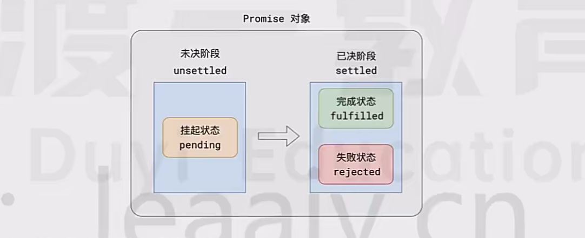
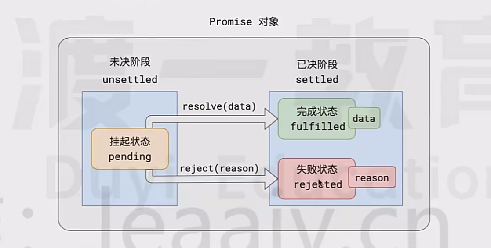
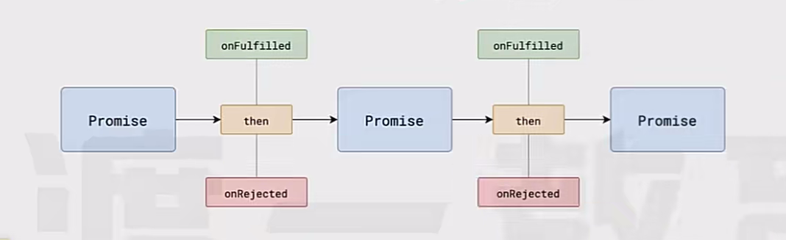
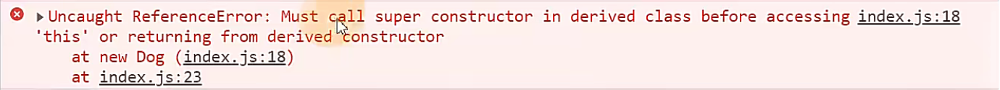
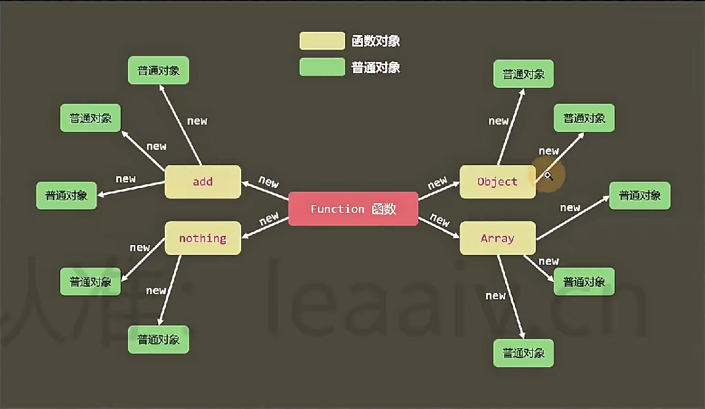
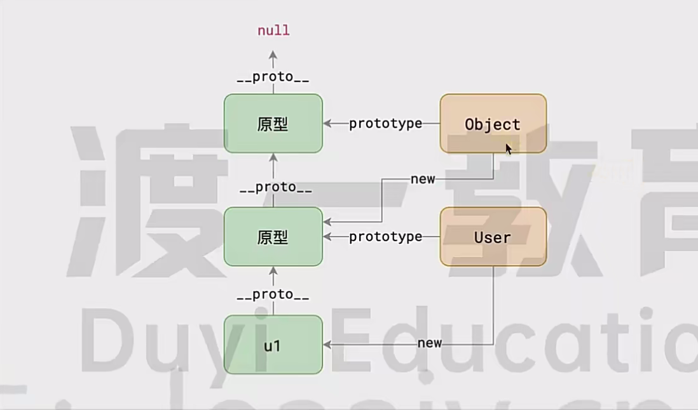
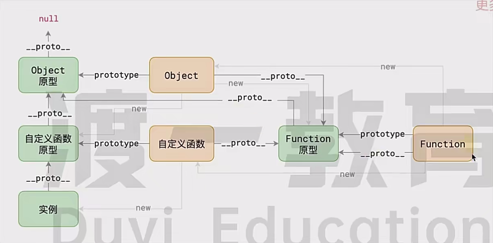
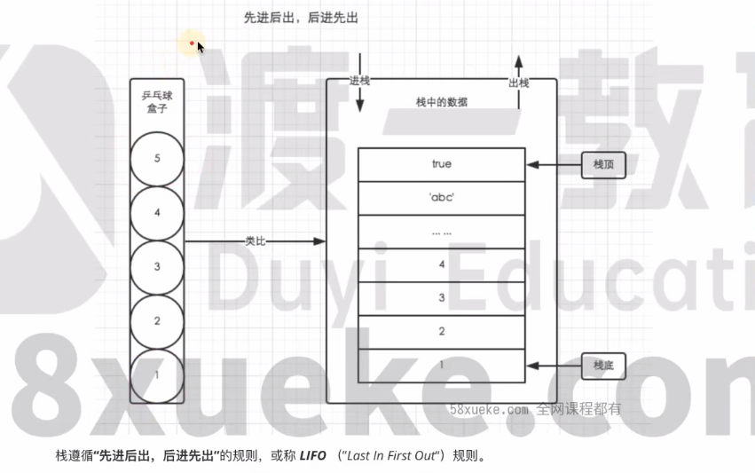

# 属性描述符`Object.defineProperty`😺

是一个普通对象，用于描述或修改对象属性的相关特性，Vue2中使用`Object.defineProperty`来做到数据的响应式

```js
const obj = {
  name: 'Kyle',
  gender: 'male',
  age: 25,
  interests: ['music', 'skiing']
}

// 1. 可以使用`Object.getOwnPropertyDescriptor(obj, property)`来获取对象上某个属性的属性描述符
// - value：属性的值
// - writable: 属性是否可以重新赋值
// - enumerable: 属性是否可枚举
// - configurable: 属性的属性描述符是否可配置
const description = Object.getOwnPropertyDescriptor(obj, 'age')
// description = { value: 25, writable: true, enumerable: true, configurable: true }


// 2. 可以使用`Object.defineProperty(obj, property, {})`来定义和设置对象上属性的描述符
Object.defineProperty(obj, 'age', {
  value: 26,
  writable: false, // 不可写
  enumerable: true, // 可枚举
  configurable: true, // 可配置
})
obj.age = 28 // obj.age = 26，age 属性被定义成不可修改，对属性值的赋值修改将不生效


// 3. `get`和`set`配置均为函数，则这个属性是存取器属性
// - 读取该属性时，会运行`get`方法
// - 给该属性赋值，则会运行`set`方法，该方法接收一个参数，作为属性的新值
// - 存取器属性最大的意义，在于可以控制属性的读取和赋值
let _a = obj.age
Object.defineProperty(obj, 'age', {
  configurable: false, // 不可更改描述符
  get() { // 读取器，读取属性时触发
    return _a
	},
  set(newVal) { // 设置器，设置属性时触发
    throw new Error('this is a read-only property')
  }
})
console.log(obj.age) // 25
obj.age = 28 // 报错 Error: this is a read-only property
```

> [!NOTE]
>
> 在`Object.defineProperty`的配置中，存取器属性`get/set`不能与`value`和`writable`同时书写，会报错


# 反射`Reflect`👌

`Reflect`是一个内置的js对象，它提供了一系列方法，可以让开发者通过调用这些方法，访问一些js的底层功能
使用`Reflect`可以实现诸如：属性的赋值与取值、调用普通函数、调用构造函数、判断属性是否存在与对象中等等功能

**`Reflect`并非一个构造函数，所以不能通过`new`对其进行调用**
**或者将`Reflect`对象作为一个函数来调用，`Reflect`的所有属性和方法都是静态的**

这些功能不是已经存在了吗？为什么还需要用Reflect实现一次？
有一个重要的理念，在es5就被提出：减少魔法、让代码更加纯粹
这种理念很大程度上是受到函数式编程的影响，ES6进一步贯彻了这种理念
它认为，对属性内存的控制、原型链的修改、函数的调用等等，这些都属于底层实现，属于一种魔法
因此，需要将它们提取出来，形成一个正常的API，并高度聚合到某个对象中
于是就造就了`Reflect`对象，因此你可以看到`Reflect`对象中有很多的API都可以使用过去的某种语法或其他API实现

```js
const obj = { name: 'Kyle', age: 25, gender: 'Male' }

// 1. 设置对象`target`中的属性`propertyKey`的值为`value`，等同于给对象的属性赋值，也可以新增属性
// - 语法：Reflect.set(target, propertyKey, value)
obj.age = 26 // 普通写法
Reflect.set(obj, 'age', 26)

// 2. 读取对象`target`中的属性`propertyKey`的值，等同于读取对象的属性
// - 语法：Reflect.get(target, propertyKey)
console.log(obj.name)
const name = Reflect.get(obj, 'name')

// 3. 返回对象自身的属性
// - 语法：Reflect.ownKeys(target)
Reflect.ownKeys(obj) // ['name', 'age', 'gender']

// 4. 调用一个指定的函数，并绑定`this`和参数列表，等同于函数调用
// - 语法：Reflect.apply(target, thisArgument, argumentsList)
function sum(a, b) {
  console.log(a + b)
}
// sum(2, 3)
Reflect.apply(sum, null, [2, 3])

// 5. 删除一个对象的属性，类似于`delete`操作符
// - 语法：Reflect.deleteProperty(target, propertyKey)
delete obj.gender
Reflect.deleteProperty(obj, 'gender')

// 6. 定义属性描述符，类似于`Object.defineProperty`，不同的是如果配置出问题，返回的`false`而不是报错
// - 语法：Reflect.defineProperty(target, propertyKey, PropertyDescriptor)
Reflect.defineProperty(obj, 'hobby', {
  value: 'Cycling',
  writable: true,
  enumerable: true,
  configurable: true
})

// 7. 用构造函数的方式创建一个对象
// - 语法：Reflect.construct(target, argumentsList)
function Test(a, b) {
  this.a = a
  this.b = b
}
// const t = new Test(2, 3)
const t = Reflect.construct(Test, [2, 3])

// 8. 判断一个对象是否拥有某个属性，类似于`in`操作符
// - 语法：const has = Reflect.has(target, propertyKey)
console.log('age' in obj)
const has = Reflect.has(obj, 'age')
```


# 代理`Proxy`✨

`Proxy`对象用于创建一个对象的代理，从而实现基本操作的拦截和自定义（如属性查找、赋值、枚举、函数调用等）
可以干涉底层实现并拦截，Vue3的响应式底层实现就用到了`Proxy`

**不可代理的对象**：像`args`、`eval`、`new.target`等特殊对象是无法被代理的

**基本语法：`const proxy = new Proxy(target, handler)`**

- `target`：要使用`Proxy`包装的目标对象（可以是任何类型的对象，包括原生数组，函数，甚至另一个代理）

- `handler`：一个通常以函数作为属性的对象，各属性中的函数分别定义了针对各种操作的拦截方法

  ```js
  /**
  * `handler`中的拦截方法和反射`Reflect`的API是一一对应的
  **/
  const handler = {
    // 拦截属性读取操作
    get(target, prop, receiver) { /* ... */ },
    // 拦截属性设置操作
    set(target, prop, value, receiver) { /* ... */ },
    // 拦截 in 操作符
    has(target, prop) { /* ... */ },
    // 拦截 delete 操作
    deleteProperty(target, prop) { /* ... */ },
    // 拦截 Object.getOwnPropertyNames()、Object.getOwnPropertySymbols()、Object.keys() 等操作
    ownKeys(target) { /* ... */ },
    // 拦截 Object.getOwnPropertyDescriptor() 操作
    getOwnPropertyDescriptor(target, prop) { /* ... */ },
    // 拦截 Object.defineProperty()、Object.defineProperties() 操作
    defineProperty(target, prop, descriptor) { /* ... */ },
    // 拦截 Object.preventExtensions() 操作
    preventExtensions(target) { /* ... */ },
    // 拦截 Object.isExtensible() 操作
    isExtensible(target) { /* ... */ },
    // 拦截 Object.setPrototypeOf() 操作
    setPrototypeOf(target, prototype) { /* ... */ },
    // 拦截函数调用操作
    apply(target, thisArg, args) { /* ... */ },
    // 拦截使用 new 操作符创建实例的过程
    construct(target, args, newTarget) { /* ... */ }
  }
  ```

基础示例：

```js
const handler = {
  /**
  * `Reflect API`和`Proxy`的拦截方法是一一对应的，借助它可以便捷地执行默认行为
  **/
  get(target, propertyKey, receiver) {
    if (Reflect.has(target, propertyKey)) {
      return Reflect.get(target, propertyKey, receiver)
    } else {
      return undefined
    }
  },
  set(target, propertyKey, value, receiver) {
    if (propertyKey === 'age') {
      // 针对age属性做一些赋值的前置性数据验证
      if (!Number.isInteger(value)) {
        throw new TypeError('The age is not an integer')
      }
      if (value > 150) {
        throw new Error('The age seems invalid')
      }
    }
    
    Reflect.set(target, propertyKey, value, receiver)
    return true // 设置属性成功，返回 true
  }
}

const proxy = new Proxy({}, handler)
proxy.name = 'Kyle' // 操作转发到目标
proxy.age = 200 // 赋值失败，抛出错误


// 函数调用监控
function sum(a, b) {
  return a + b
}
const sumProxy = new Proxy(sum, {
  apply(target, thisArg, args) {
    console.log(`Calling sum with args: ${...args}`)
    // 执行原始函数
    const result = Reflect.apply(target, thisArg, args)
    console.log(`Result: ${result}`)
    return result
  }
});

sumProxy(3, 4)
// 输出:
// Calling sum with args: 3,4
// Result: 7
```

注意问题：

1. 原型链与继承问题

   ```js
   class Parent {
     method() { /* ... */ }
   }
   const parent = new Parent()
   const parentProxy = new Proxy(parent, {})
   
   // ❌ 可能失效：
   parentProxy instanceof Parent // false（原型链被切断）
   
   // ✅ 解决方案：
   const handler = {
     getPrototypeOf(target) {
       return Reflect.getPrototypeOf(target)
     }
   }
   const parentProxy = new Proxy(parent, handler)
   ```

2. 私有字段

   ```js
   class User {
     #privateField = 'secret'
   }
   const user = new User()
   const userProxy = new Proxy(user, {})
   
   // ❌ 无法拦截：
   userProxy.#privateField // 直接报错（私有字段无法通过Proxy访问）
   ```


# 正则表达式`RegExp`

一种用于匹配和操作文本的强大工具，由一系列字符和特殊字符组成的模式，用于描述要匹配的文本模式


## 创建正则对象

```js
/** 1. 通过 RegExp 构造函数创建 **/
const rule = new RegExp(/^[GCDZTSPKXLY1-9]\d{1,4}$/, 'ig')

/** 2. 通过字面量创建 **/
const rule = /^[GCDZTSPKXLY1-9]\d{1,4}$/ig
```


## 标识

| 标识符 | 含义                                       |
| ------ | ------------------------------------------ |
| i      | 不区分大小写                               |
| g      | 全局匹配，如果不写此标识，则只会匹配第一个 |
| m      | 当行匹配                                   |


## 常用方法

### `rule.test`

```js
const rule = /^aa$/i
// 测试字符串是否满足规则
rule.test('a') // false
rule.test('aa') // true
```

### `str.replace`

```js
// reg 是正则对象， str 是字符串
// 将字符串中匹配规则的部分替换成替换值
str.replace(reg, '替换值')

// 将字符串中匹配正则的部分传入到回调函数的参数中，将函数的返回结果进行替换
str.replace(reg, (s) => {
  return '替换值'
})
```


## 常用规则

[正则表达式详见🔗](https://developer.mozilla.org/zh-CN/docs/Web/JavaScript/Guide/Regular_expressions)

| 字符匹配规则书写     | 含义                                                         |
| -------------------- | ------------------------------------------------------------ |
| 直接书写一个普通字符 | 匹配书写的字符                                               |
| `[字符规则]`         | 匹配`[]`中出现的所有字符规则                                 |
| `[^字符规则]`        | 匹配`[]`中没有出现的字符规则                                 |
| `.`                  | 匹配任意字符                                                 |
| `\d`                 | 匹配数字，等价于`[0-9]`                                      |
| `\D`                 | 匹配非数字                                                   |
| `\s`                 | 匹配空白字符，包括空格、回车、换行、制表符                   |
| `\S`                 | 匹配所有非空白字符                                           |
| `\w`                 | 匹配单词字符，等价于`[A-Za-z0-9_]`                           |
| `\W`                 | 匹配非单词字符，等价于`[^A-Za-z0-9_]`                        |
| `^`                  | 匹配字符串开始，写在规则开始位置                             |
| `$`                  | 匹配字符串结束，写在规则结束位置                             |
| `\\`                 | 使用`\`进行对特殊字符的转义，例如：`\.`（匹配字符串的`.`）、`\/`（匹配`/`） |

多个规则可以连续书写，用以匹配多个字符，例如：

```js
// 匹配 1 个数字紧跟 1 个字母，例如 3c、2A、0y
const rule = /\d[a-zA-Z]/
```

若多个规则是或者的关系，使用`|`分割，例如：

```js
// 匹配以 1 个数字紧跟 1 个字母，或者 1 个字母紧跟 1 个数字，例如 3d、b2
const rule = /\d[a-zA-Z]|[a-zA-Z]\d/
```

规则的重复（量词）
一个或一段规则之后，可以紧跟一个量词，表示前面的规则出现的次数

```js
// 匹配 1 个字母，后面跟上连续的 3 个数字，{3} 是量词，应用的规则是 \d
const rule = /[a-zA-Z]\d{3}/

// {3} 是量词，应用的规则是 [a-zA-Z]\d
const rule = /([a-zA-Z]\d){3}/
```

| 量词    | 含义                            |
| ------- | ------------------------------- |
| `{n}`   | 出现 n 次                       |
| `{n,m}` | 出现 n 到 m 次                  |
| `{n,}`  | 至少出现 n 次                   |
| `*`     | 出现 0 次或多次，等价于`{0,}`   |
| `?`     | 出现 0 次或 1 次，等价于`{0,1}` |
| `+`     | 出现 1 次或多次，等价于`{1,}`   |


# 异常`Error`

异常并非坏事，它可以让开发人员及时发现错误、定位错误，甚至在某些时候，我们还需要故意的抛出异常
**每个异常都是一个对象，通过对应的构造函数创建**

| 异常类型         | 含义                                         |
| ---------------- | -------------------------------------------- |
| `SyntaxError`    | 语法错误                                     |
| `ReferenceError` | 引用错误，往往是使用了未定义的变量或函数     |
| `TypeError`      | 类型错误，往往是使用了一个对象中不存在的成员 |

如何捕获异常？

```js
try {
  // 可能会产生错误的代码块
  // ...
} catch(err) {
  // 当 try 中的代码出现异常后，会执行此处的代码，异常对象会传递给 err
  // ...
  console.log(err.message)
} finally {
  // 可省略不写，无论是否有异常，都会执行
}
```

如何手动抛出异常？

```js
throw 异常对象 // 代码运行到这，会终止继续运行，并抛出异常对象，效果和浏览器抛出的异常完全一样
// 例如
throw new ReferenceError('找不到对应的成员')
```


# 异步`Promise`🤏

## `Promise`规范

`Promise`是专门处理异步场景的规范，它的出现统一JS中的异步实现方案，通过链式调用让回调变得可控
它能有效的避免回调地狱的产生，使异步代码更加清晰、简洁、统一

`Promise A+`规范：是一个对象，且有一个`then`方法
这套规范最早诞生于前端社区，规范名称为`Promise A+`

所有的异步场景，都可以看作是一个异步任务，每个异步任务，在JS中应该表现为一个对象
该对象称之为`Promise`对象，也叫做任务对象


每个任务对象，都应该有**两个阶段、三个状态**



根据常理，它们之间存在以下逻辑：

1. 任务总是从未决阶段变到已决阶段，无法逆行
2. 任务总是从挂起状态变到完成或失败状态，无法逆行
3. 任务一旦完成或失败，状态就固定下来，永远无法改变

挂起-->完成，称之为`resolve`，挂起-->失败，称之为`reject`
任务完成时，可能有一个相关数据；任务失败时，可能有一个失败原因



可以针对任务进行后续处理
针对完成状态的后续处理称之为`onFulfilled`，针对失败的后续处理称之为`onRejected`


注意一下几点：

- `Promise`构造函数里的代码是同步执行的

  ```js
  const promise = new Promise((resolve, reject) => {
    console.log('同步执行') // 会马上输出
    resolve('成功')
  })
  ```

- **`Promise`中调用`resolve`或`reject`后，它们的回调函数才会被添加到微队列等待执行，是异步函数**

  ```js
  new Promise((resolve) => {
    console.log('同步代码')
    resolve() // 把成功回调加入微任务队列
  }).then(() => {
    console.log('异步回调') // 会在同步代码之后执行
  })
  console.log('后续同步代码')
  // 输出顺序：同步代码 → 后续同步代码 → 异步回调
  ```

- 若`.then`中返回非`Promise`对象，该`.then`返回的新`Promise`状态是`fulfilled`
  后续链式调用的`.then`会触发`onFulfilled`回调，并将前面返回的非`Promise`值作为参数传入这个回调

  ```js
  Promise.resolve(1)
  	.then((value) => {
  		return value + 1 // 返回非Promise值（2）
  	})
  	.then((result) => {
  		console.log(result) // 触发onFulfilled，输出 2
  	})
  ```


## 链式调用`.then`



- **`.then`方发必定会返回一个新的`Promise`，可理解为后续处理也是一个任务**

  ```js
  const p1 = new Promise((resolve, reject) => { resolve('end, true') })
  const p2 = p1.then(() => {
    console.log('p1 success')
    return 'p2 success'
  })
  p2.then((res) => {
  	console.log(res) // p2 success
  })
  setTimeout(() => {
    console.log(p2) // Promise { 'p2 success' }
  }, 1000)
  ```

- 新任务的状态取决于后续处理：

  1. 若新任务没有相关的后续处理，则新任务的状态和前任务一致，数据为前任务的数据

     ```js
     const p1 = new Promise((resolve, reject) => {
       reject(false)
     })
     const p2 = p1.then(() => {
       console.log('success')
     }) // 没有 p1 的错误处理，只有成功回调处理
     setTimeout(() => {
       console.log(p2) // Promise { <rejected> false }
     }, 1000)
     // p1 的状态为 rejected，而 p2 没有对 p1 进行 onRejected 的后续处理
     // 则 p2 状态和 p1 一致，也是 rejected，数据也是 false
     ```

  2. 若新任务的有相关的后续处理，但前任务状态还未执行确定，则新任务挂起，状态为`pending`

     ```js
     const p1 = new Promise((resolve, reject) => {
       setTimeout(() => {
         resolve('end, true')
       }, 2000)
     })
     const p2 = p1.then(() => {
       console.log('p1 success')
     })
     setTimeout(() => {
       console.log(p2) // Promise { <pending> }
     }, 1000)
     // p2 有对 p1 的 onFulfilled 的后续处理，但此时 p1 还没有 resolve 确定状态
     // 所以 p2 的状态为 pending
     ```

  3. 若新任务有相关后续处理并且前任务执行了，则根据后续处理的情况确定新任务的状态

     - 后续处理执行无错，新任务的状态为`fulfilled`，**数据为后续处理的返回值**

       ```js
       const p1 = new Promise((resolve, reject) => { reject(false) })
       const p2 = p1.catch(() => {
         return '捕获前任务错误'
       })
       setTimeout(() => {
         console.log(p2) // Promise { '捕获前任务错误' }
       }, 1000)
       // 即使 p1 的状态是 rejected，但是 p2 有针对的后续处理，且代码没有执行错误
       // 则 p2 的状态就是 fulfilled 数据为处理中的返回值，没有则是 undefined
       ```

     - 后续处理执行有错，新任务的状态为`rejected`，数据为异常对象

       ```js
       const p1 = new Promise((resolve, reject) => { resolve(true) })
       const p2 = p1.then(() => {
       	throw new Error('执行发生错误')
       })
       setTimeout(() => {
       	console.log(p2) // Promise { <rejected> Error: 执行发生错误 }
       }, 1000)
       // 即使 p1 为 fulfilled，且 p2 也有对应后续处理，但 p2 的处理中有执行错误
       // 则 p2 的状态会变成 rejected
       ```

     - 后续执行后返回的是一个任务对象，即`return new Promise`，则新任务的状态和数据与返回的该任务对象一致

       ```js
       // p1 状态为 fulfilled
       const p1 = new Promise((resolve, reject) => { resolve(true) })
       
       // Promise { <pending> }
       const p2 = p1.then(() => {
         return new Promise((resolve, reject) => {})
         // 返回的任务对象，但状态未确定，则 p2 的状态也和返回的任务对象一致
       })
       
       // Promise { true }
       const p2 = p1.then(() => {
         return new Promise((resolve, reject) => { resolve(true) })
         // 返回的任务对象状态是 fulfilled，则 p2 也保持一致，数据是 true
       })
       
       // Promise { <rejected> false }
       const p2 = p1.then(() => {
         return new Promise((resolve, reject) => { reject(false) })
         // 返回的任务对象状态是 rejected，则 p2 也保持一致，数据是 false
       })
       ```


## `Promise`的静态方法

| 方法                     | 含义                                                         |
| ------------------------ | ------------------------------------------------------------ |
| `Promise.resolve(data)`  | 直接返回一个状态为`fulfilled`的任务对象，相当于`new Promise((resolve) => resolve())` |
| `Promise.reject(reason)` | 直接返回一个状态为`rejected`的任务对象                       |
| `Promise.all([])`        | 返回一个任务对象，数组中**全部任务都成功**则为`fulfilled`，否则为`rejected` |
| `Promise.any([])`        | 返回一个任务对象，数组中**任意一个成功**就为`fulfilled`，否则为`rejected` |
| `Promise.allSettled([])` | 返回一个任务对象，数组中**全部任务状态已决定**则为`fulfilled`，**该任务不会失败** |
| `Promise.race([])`       | 返回一个任务对象，数组中**最先状态已决定**，状态于其一致     |


## `async/await`

ES7推出了两个关键字，可以使用同步的语法来书写异步代码

- `async`关键字用于修饰函数，被它修饰的函数一定返回一个全新的`Promise`
- `await`关键字表示等待某个`Promise`完成，它必须用于`async`标记的函数里
- 当前函数的执行上下文中，`await`后面的代码都会进入微队列等待执行

```js
/**
* async
* async 关键字用于修饰函数，被它修饰的函数，一定返回 Promise
**/
async function method() {
  return 1 // 返回 Promise 完成后的数据
  // return await 1
  // 没有配合 await 使用，代码不会放到微队列执行，直接同步运行
}
method() // Promise { 1 }

async function method() {
  return Promise.resolve(1) // 若返回的是 Promise，则 method 将与 Promise 状态和数据保持一致
}
method() // Promise { <pending> } Promise.resolve微队列执行，所以状态是 pending

async function method() {
  throw new Error('错误') // 若执行过程报错，则任务状态时 rejected
}
method() // Promise { <rejected> Error('错误') }


/**
* await
* await 关键字表示等待某个 Promise 完成，它必须用于 async 函数里
* await is only valid in async function
* 当前函数中，await 后面的代码都会进入微队列等待执行
**/
async function method() {
  const n = await Promise.resolve(1) // 或者 const n = await 1
  console.log(n) // n = 1
}
// 上面的函数等同于
function method() {
  return new Promise((resolve) => {
    Promise.resolve(1).then((n) => {
      console.log(n)
      resolve()
    })
  })
}
// await 后可以书写非 Promise 对象
async function method() {
  await 1 // 等同于 await Promise.resolve(1) ，会自动将非 Promise 数据包装成 Promise 对象
}
// 针对 rejected 进行任务处理，可以使用 try-catch 语法
async function method() {
  try {
    await Promise.reject('error')
  } catch(err) {
    console.log(err)
  }
}
```


## 手写`Promise`

```js
```


# 符号`Symbol`👌

是`ES6`中新增的一种**原始数据类型**，表示**独一无二的值**，类似于字符串`string`数据类型
**符号设计的初衷，是为了给对象设置私有属性，避免被外部访问**

- 没有字面量，只能用过`Symbol`创建

  ```js
  const symbol = Symbol() // Symbol()
  const s_1 = Symbol.for('abc')
  ```

- 使用`typeof`得到的类型是`symbol`

  ```js
  console.log(typeof Symbol('name')) // symbol
  ```

- **每次调用`Symbol`函数得到的符号永远不相等，无论符号名（符号的描述）是否相同**

  ```js
  const s_1 = Symbol('1')
  const s_2 = Symbol('1')
  console.log(s_1 === s_2) // false
  ```

- 符号可以作为对象的属性名存在，这种属性称之为符号属性

  ```js
  const name = Symbol('name')
  const info = {
    age: 26,
    [name]: 'Kyle' // 符号属性
  }
  console.log(info) // { age: 26, [Symbol(name)]: 'Kyle' }
  ```

- **符号属性是不能枚举的，因此`for-in`循环和`Object.keys`都无法读取到符号属性**

  ```js
  const info = {
  	age: 26,
  	[Symbol('name')]: 'Kyle',
  	gender: 'Male',
  }
  for (const key in info) {
    console.log(key)
  }
  console.log(Object.keys(info))
  // 结果都是 ['age', 'gender']
  
  // 尽管`Object.getOwnPropertyNames`可以得到无法枚举的属性，但也无法读取到符号属性
  Object.getOwnPropertyNames(info) // ['age', 'gender']
  ```

- `Object.getOwnPropertySymbols`方法可以获取对象中的符号属性，返回一个符号属性数组

  ```js
  const name = Symbol('name')
  const info = {
    age: 26,
    [name]: 'Kyle',
    gender: 'Male'
  }
  console.log(Object.getOwnPropertySymbols(info)) // [ Symbol(name) ]
  const n = Object.getOwnPropertySymbols(info)[0]
  console.log(n === name) // true
  ```

- **符号无法被隐式转换，因此不能被用于数学运算、字符串拼接或其他隐式转换的场景**
  但可以显式的转换为字符串，通过`String`构造函数进行转换即可
  `console.log`之所以可以输出符号，就是内部进行了显示转换

  ```js
  const name = Symbol('name')
  console.log(name + 1) // 报错：TypeError: Cannot convert a Symbol value to a number
  
  // 显式转换
  const string_name = String(name)
  console.log(string_name + ': Kyle') // Symbol(name): Kyle
  ```

**共享符号，使用`Symbol.for()`可以共享符号，只要符号名（描述）一样，两个符号就相等**

```js
const s_1 = Symbol.for('abc')
const s_2 = Symbol.for('abc')
console.log(s_1 === s_2) // true

const info = {
  [Symbol.for('name')]: 'Kyle',
  age: 26
}
console.log(info[Symbol.for('name')]) // Kyle
```

**知名符号，是一些具有特殊含义的共享符号，通过`Symbol`的静态属性得到**

```js
/**
 * Symbol.hasInstance
 * 该符号用于定义构造函数的静态成员，它将影响 instanceof 的底层判定
**/

function A() {}
const a = new A()
console.log(a instanceof A) // true
console.log(A[Symbol.hasInstance](a)) // true

Object.defineProperty(A, Symbol.hasInstance, {
	value: function (v) {
		return false
	}
})
console.log(a instanceof A) // false


/**
 * Symbol.isConcatSpreadable
 * 该知名符号会影响数组的concat方法
**/

/**
 * Symbol.toPrimitive
 * 该知名符号会影响类型转换的结果：valueOf --> toString
**/

/**
 * Symbol.toStringTag
 * 该知名符号会影响 Object.prototype.toString 的返回值
**/
const info = {
	name: 'Kyle',
	[Symbol.toStringTag]: 'Custom',
}
console.log(info.toString()) // '[object Custom]'，没有这个符号属性结果就是 '[object Object]'
```


# 大整数`BigInt`😯

`JavaScript`中新增的一种基本**类型数据**
用于表示任意精度的整数，解决了传统`Number`类型无法精确表示过大整数的问题

创建`BigInt`数据的两种方式

```js
// 1. 在整数后面添加 n 后缀
const bigNum = 1234567890123456789012345678901234567890n

// 2. 使用 BigInt() 构造函数
const bigNum = BigInt('1234567890123456789012345678901234567890')
const fromNumber = BigInt(123) // 将普通数字转换为 BigInt
```


# 迭代器`Iterator`🤔

什么是迭代？
从一个数据集合中按照一定的顺序，不断取出数据的过程

迭代和遍历的区别？
**迭代**：强调的是**依次取数据，并不保证取多少，也不保证把所有的数据取完**
**遍历**：强调的是要把整个数据**依次全部取出**

迭代器？
对迭代过程的封装，在不同的语言中有不同的表现形式，通常为对象


## 迭代器协议

一种设计模式，用于统一迭代过程，并规范了迭代器规格：

- 迭代器应该具有得到下一个数据的能力
- 迭代器应该具有判断是否还有后续数据的能力

**JS规定，如果一个对象具有`next`方法，并且该方法返回一个对象，则认为该对象是一个迭代器**

```js
// 该对象的格式如下：
const iterator = {
  // next方法，用于等到下一个数据
  next() {
    // 返回的对象包含`value`和`done`属性
    return {
      value: '', // 下一个数据的值
      done: '' // 布尔值，是否迭代完成
    }
  }
}
```

创建一个斐波那契数列的迭代器（迭代器创建函数）

```js
function createFibonacciIterator() {
  let a = 1 // 前值
	let b = 1 // 后值
	let whichOne = 1 // 第几个数
	return {
		next() {
			let value
			if (whichOne <= 2) {
				value = 1
			} else {
				value = a + b
			}
			const it = {
				value,
				done: false, // 永远不会迭代结束
			}
			a = b
			b = it.value
			whichOne++
			return it
		}
	}
}
const fibIterator = createFibonacciIterator()
console.log(fibIterator.next()) // { value: 1, done: false }
console.log(fibIterator.next()) // { value: 1, done: false }
console.log(fibIterator.next()) // { value: 2, done: false }
console.log(fibIterator.next()) // { value: 3, done: false }
```


## 可迭代对象协议

**ES6规定，如果一个对象具有知名符号属性`Symbol.iterator`，且属性值是一个迭代器创建函数，则该对象是可迭代的**

```js
// 可迭代对象
const iteratorObj = {
  [Symbol.iterator]() {
    return {
      next() {
        return {
          value: '',
          done: false
        }
      }
    }
  }
}

// 数组，就是一个可迭代对象
const arr = [1, 2, 3, 4]
const iterator = arr[Symbol.iterator]()
let curResult = iterator.next()
while(!curResult.done) {
  console.log(curResult.value)
  curResult = iterator.next()
}

// `for-of`循环：用于循环可迭代对象
for (item of iterator) {
  // iterator: 满足可迭代协议的可迭代对象
  // item: 每次迭代得到的数据
}

```

> [!NOTE]
>
> **因为普通对象没有名为`Symbol.iterator`的迭代器创建函数，所以不可以使用`for-of`循环遍历**

但是如果手动给普通对象增加一个名为`Symbol.iterator`的迭代器创建函数，则该对象也可被迭代，如下：

```js
const info = {
	name: 'Kyle',
	age: 26,
	gender: 'Male',
	hobby: ['cycling', 'cooking'],
	// 给对象增加一个迭代器创建函数，一个普通对象就变成了可迭代对象
	[Symbol.iterator]() {
		const keys = Object.keys(this)
		let index = 0
		return {
			next: () => {
				const it = {
					value: { propName: keys[index], propValue: this[keys[index]] },
					done: index >= keys.length - 1,
				}
				index++
				return it
			}
		}
	}
}

// 展开运算符`...`可以作用于可迭代对象，因此可以轻松的将可选代对象转换为数组
const arr = [...info]
/** arr 数组中元素的值，取决于`next`返回对象中`value`的值 */
// [
//   { propName: 'name', propValue: 'Kyle' },
//   { propName: 'age', propValue: 26 },
//   { propName: 'gender', propValue: 'Male' }
// ]

function test(a, b) {
	console.log(a, b)
}
test(...info) // { propName: 'name', propValue: 'Kyle' } { propName: 'age', propValue: 26 }
```


# 生成器`Generator`💪

生成器是一个通过构造函数`Generator`创建的对象，但非手动`new`创建而是内部使用
**生成器既是一个迭代器（有`next`方法），同时又是一个可迭代对象（有`Symbol.iterator`迭代器函数）**
所以，生成器就是迭代器，为了方便书写迭代器


## 如何创建生成器？

**必须使用生成器函数`Generator Function`得到**，且是唯一途径

```js
// 书写一个生成器函数：在函数名前加`*`号，这个函数就变成了生成器函数
function* method () {
  /** 生成器函数内部是为了给生成器的每次迭代提供数据 **/
}
// 使用生成器函数得到生成器对象（唯一途径）
const generator = method()
// 可以使用`next`方法，可以被`for-of`迭代
generator.next()
for (item of generator) {}
```


## `yield`

**`yield`关键字只能在生成器函数内部使用，表达产生一个迭代数据，会通过`next`方法返回**
**每次调用生成器的`next`方法，将导致生成器函数运行到下一个`yield`关键字的位置**

调用生成器函数只会得到一个生成器，而生成器函数内部的代码并不会运行，只有手动调用`.next()`方法才会

```js
function *method() {
  console.log('第一次运行')
  yield 1 // 产生一个迭代数据 1，会通过`next`方法返回
  console.log('第二次运行')
  yield 2
  console.log('第三次运行')
}
const generator = method() // 此时函数内的代码并没有运行

// 调用`next`方法让函数运行到下一个`yield`的位置
console.log(generator.next())
// 输出：
// 第一次运行
// { value: 1, done: false } <-- 该数据是由`nxet`方法返回的数据 -->

console.log(generator.next())
// 输出：
// 第二次运行
// { value: 2, done: false }
```

使用生成器函数书写斐波那契数列的迭代器：

```js
function* Fibonacci() {
	let a = 1
	let b = 1
	let whichOne = 1

	while (true) {
		if (whichOne <= 2) {
			yield 1
		} else {
			const res = a + b
			yield res
			a = b
			b = res
		}
		whichOne++
	}
}
const generator = Fibonacci()
console.log(generator.next()) // { value: 1, done: false }
```


## 注意点

1. 生成器函数可以有返回值，返回值出现在**第一次**`done`为`true`时的`value`属性中

   ```js
   function* method() {
   	console.log('第一次运行')
   	yield 1
   	console.log('第二次运行')
   	return 100
   }
   const n = method()
   console.log(n.next())
   // 第一次运行
   // { value: 1, done: false }
   console.log(n.next())
   // 第二次运行
   // { value: 100, done: true } <-- 函数执行完，`done`第一次为`true`，返回值就是`value`的值 -->
   console.log(n.next())
   // { value: undefined, done: true } <-- 后续再调用`next`方法则返回`undefined` -->
   ```

2. **调用生成器的`next`方法时，可以传递参数，该参数值会交给上一次迭代的`yield`表达式的返回值**
   **所以第一次调用`next`方法时传参没有任何意义**

   ```js
   function* method() {
     const a = yield 1
     console.log(a) // a = 20
     const b = yield 2
     console.log(b) // b = 30
     yield 3 + a + b
   }
   const g = method()
   console.log(g.next(10)) // { value: 1, done: false } <-- 第一次`next`传参没有意义 -->
   console.log(g.next(20)) // { value: 2, done: false }
   console.log(g.next(30)) // { value: 53, done: false }
   ```

3. 在生成器函数内部，可以调用其他生成器函数，但是要注意加上`*`号

   ```js
   function* m1() {
     yield 'a'
     yield 'b'
   }
   function* m2() {
     yield* m1() // 迭代其他生成器
     yield 1
     yield 2
     yield 3
   }
   const g = m2()
   // 此时调用`next`方法，输出顺序为：'a' -> 'b' -> 1 -> 2 -> 3
   // 会先将使用的其他的生成器迭代完成后，再继续迭代自己的
   ```


## 生成器的其他`API`

### `.return()`

调用该方法，可以提前结束生成器函数，从而提前让整个迭代过程结束，该方法返回值和`next`一样
`return`方法也可以传递参数，传值将在方法返回值对象的`value`中体现

```js
function* method() {
	yield 1
	yield 2
	yield 3
}
const generator = method()
console.log(generator.next()) // { value: 1, done: false }
console.log(generator.return(100)) // { value: 100, done: true } <-- `return`让迭代提前结束，done=true -->
console.log(generator.next()) // { value: undefined, done: true }
```

### `.throw()`

调用该方法，可以在生成器中产生一个错误

```js
const generator = method()
generator.next()
generator.throw(new Error('抛出错误'))
```


## 控制异步任务

```js
function* AsyncTask() {
	const url = yield
	const resp = yield fetch(url)
	yield resp.json()
}

const asyncTask = AsyncTask()
asyncTask.next()
const { value, done } = asyncTask.next('https://geo.datav.aliyun.com/areas_v3/bound/geojson?code=100000_full')
value.then((resp) => {
	const load = asyncTask.next(resp)
	load.value.then((data) => {
		console.log(data) // 得到异步接口的数据
	})
})
```


# `Object`

`Object`构造函数的静态方法


## `.freeze`

冻结对象，不允许添加、删除或修改任何属性，对象保持不变

```js
const obj = {
  name: 'Kyle',
  gender: 'male',
  age: 25,
  interests: ['music', 'skiing']
}
Object.freeze(obj) // freeze the object so that it cannot be changed.

obj.name = 'Lily' // not work
obj.age = 26 // not work

// 此处修改生效的原因：冻结的是interests这个属性的引用，而不是数组本身；因此，无法重新分配interests指向新的数组（如interests = [...]），但可以修改原数组的内容，比如pop()或push()操作
obj.interests.pop() // work
obj.interests[1] = 'football' // work

obj.interests = ['music', 'skiing', 'baseball'] // not work
console.log(obj) // { name: 'Kyle', gender: 'male', age: 25, interests: [ 'music', 'football' ] }
```

> [!NOTE]
>
> `Object.freeze`是浅冻结，只能冻结对象的第一层属性，而嵌套的对象或数组并不会被冻结


## `.seal`

封闭对象，不允许添加或删除属性，只允许修改现有属性的值

```js
const obj = {
  name: 'Kyle',
  gender: 'male',
  age: 25,
  interests: ['music', 'skiing']
}
Object.seal(obj)

obj.age = 26 // work
obj.interests.push('gaming') // work
obj.phone = '1234567890' // no work
delete obj.name // no work

// {
//   name: 'Kyle',
//   gender: 'male',
//   age: 26,
//   interests: [ 'music', 'skiing', 'gaming' ]
// }
```


## `.is`

可以判断两个值是否相同，功能与`===`基本一致
区别在于，使用`Object.is`中，`NaN === NaN`，`+0 !== -0`，而`===`的结果刚好相反

```js
Object.is(1, 2) // false
Object.is('1', 1) // false
Object.is(NaN, NaN) // true
Object.is(+0, -0) // false

NaN === NaN // false
+0 === -0 // true
```


## `.assign`

混合对象，用于将所有可枚举属性的值从一个或多个源对象分配到目标对象，返回目标对象
语法：`Object.assign(target, ...sources)`

```javascript
const target = { a: 1, b: 2 }
const source = { b: 4, c: 5 }
// 将 source 对象合并到 target 对象，会更改 target 的值，并返回 target
const newObj = Object.assign(target, source)

console.log(target) // { a: 1, b: 4, c: 5 }
console.log(target === newObj) // true
```


## `.setPrototypeOf`

设置某个对象的隐式原型

```js
const obj1 = { a: 1 }
const obj2 = { b: 2 }

console.log(obj1.__proto__ === obj2.__proto__) // true

// 设置 obj1 的隐式原型为 obj2
Object.setPrototypeOf(obj1, obj2)

console.log(obj1.__proto__) // { b: 2 }
console.log(obj2.__proto__) // Object
console.log(obj1.__proto__ === obj2.__proto__) // false
```


# `Array`


## `instance.slice`

数组切割，不影响原数据，返回一个新数组

```js
// 数组切割
const a = [0, 1, 2, 3]
const b = a.slice(0, 3) // b = [0, 1, 2]

// 通过Array.slice()方法将`伪数组`转化成真数组
const obj = {
  0: 'a',
  1: 'b',
  length: 2
}
const arr = Array.prototype.slice.call(obj) // arr = ['a', 'b']
```


## `.from`

可以将一个类数组或伪数组转换成一个真正的数组返回，不影响原数据

```js
const obj = {
  0: 'a',
  1: 'b',
  length: 2
}
const arr = Array.from(obj) // arr = ['a', 'b']
```


# 解构赋值

```js
/** 数组解构 **/
const arr = [1, 2, 3, 4]
// 取出每一项值
const [a, b, c, d] = arr
// 仅取出下标为1和2的值
const [, b, c] = arr
// 取出下标1和3的值
const [, b, , d] = arr
// 取出arr中前两个，放到变量a和b中，剩下的值放到一个新数组arr2中
const [a, b, ...arr2] = arr

/** 对象解构 **/
const obj = { a: 1, b: 2, c: 3 }
// 复制obj的所有值到一个新的对象，浅拷贝
const obj2 = { ...obj } // obj !== obj2
// 复制obj中除了属性a以外的值到一个新的对象
const { a, ...obj2 } = obj

/** 解构写法，等同于 **/
const info = { name: 'Kyle', gender: 'Male' }
let name, gender
name = info.anme
gender = info.gender
// 或
let name, gender
({ name, gender} = info)
```

从`null`或`undefined`上解构会报错失败


# 类型转换🙄


## 隐式转换

每个运算符都有自己期望的数据格式，例如：
`+  -  *  /`数学运算期望两边都是`number`类型，字符串拼接期望是`string`，条件判断是`boolean`
一旦数据不符合运算符的期望，JS就会对数据进行隐式的转换（自动转换）：将数据变成期望的格式后再进行运算
这种转换是临时的，并不会对原始数据造成影响

```js
// 利用`+`、`-`（一元运算符）将字符串转数字
let a = '001'
+a // a = 1
let b = '02'
-b // -2

// `+`的一边是字符串的情况下，则会进行字符串拼接
let str = '10'
let str_1 = '11'
let number = 12
0 + str // '010'
number + '' // '12'
str + str_1 // '1011'

// 布尔
if ("hello") {} // 字符串"hello"转为true
0 || "default" // "default"（0转为false）

// 比较
1 == "1" // true（字符串"1"转为数字1）只比较值
0 == false // true（false转为数字0）
```


## 显式转换

通过特定函数或运算符主动进行的类型转换，意图明确

```js
/* 转字符串 */
String(123) // "123"
(true).toString() // "true"


/* 转数字 */
Number('123') // 123，
// Number() 有非数字字符则为 NaN
Number('123ad') // NaN

// parseInt() 开头是数字即可转换成功，否则为 NaN
parseInt() // NaN
parseInt('') // NaN
parseInt('a33') // NaN
parseInt('123abc') // 123
parseFloat('12.34') // 12.34


/* 转布尔 */
// 除了 null | 0 | false | '' | undefined | NaN，其余数据转换都为真
Boolean(0) // false
Boolean('') // false
Boolean({}) // true
```


## 引用转基本类型

引用类型（如对象、数组、函数、日期等）转换为基本类型（字符串、数字、布尔值）时，会遵循特定的转换规则

1. 检查该对象是否有`[Symbol.toPrimitive]`方法，存在直接调用，**最高优先级**
   该方法**必须返回一个基本类型值**，否则引擎无法完成转换，会直接报错

   ```js
   const obj = {
     // hint 是被转换时的期待类型
     [Symbol.toPrimitive](hint) {
       if (hint === 'number') {
         // return ...
       }
       if (hint === 'string') {
         // return ...
       }
       if (hint === 'boolean') {
         // return ...
       }
     }
   }
   ```

   但注意：**普通对象本身没有这个方法，需要手动添加实现，自定义转换逻辑**

2. 若没有`[Symbol.toPrimitive]`方法，则根据转换时的`hint`的类型，选择优先使用`valueOf`还是`toString`
   即**转字符串先`toString()`，转数字先`valueOf()`**，`Date`对象是个例外，转换时会优先调用`toString`

   若得到基本类型数据，则结束直接返回，否则继续调用另外一个方法
   若最终还是没有得到基本类型，抛出错误

   ```js
   const obj = {
     valueOf() { return {} },
     toString() { return [] }
   }
   try {
     Number(obj)
   } catch (e) {
     console.log(e)
   }
   // 最终都没有得到基本类型数据，抛出错误
   // // TypeError: Cannot convert object to primitive value
   
   
   const obj = { a: 1 }
   String(obj) // "[object Object]"（先 toString()）
   Number(obj) // NaN（valueOf() 返回对象，再 toString() 得到字符串[object Object]，转数字失败）
   ```


## `valueOf & toString`

普通对象本身自带`valueOf()`和`toString()`方法，从`Object.prototype`继承而来的，所有对象都会默认拥有
**如果直接在对象本身上书写，则直接使用自身的方法并得到返回值**

`valueOf`方法的返回值，一般都是对象自身的引用，`Date | Number | String`对象中被重写，返回特定基本类型

```js
({a: 1}).valueOf() // { a: 1 }
([1, 2]).valueOf() // [1, 2]
([]).valueOf() // []
(function test() {}).valueOf() // ƒ test(){}
(new Map()).valueOf() // Map(0) {size: 0}
(new Set()).valueOf() // Set(0) {size: 0}

// Date 对象的 valueOf 方法被重写，得到时间戳
(new Date()).valueOf() // 1756958287094

// 使用 String | Number | Boolean 创建的包装对象，得到都是基本类型的自身值
const strObj = new String('hello')
strObj.valueOf() // 'hello'（基本类型字符串）
```

`toString`方法的返回值

```js
({a: 1}).toString() // '[object Object]'
(new Map()).toString() // '[object Map]'
(new Set()).toString() // '[object Set]'

// 数组的 toString 方法返回 元素拼接的字符串，类似于 .join(',')
([1, 2]).toString() // '1,2'
([]).toString() // ''
([1]).toString() // '1'
Object.prototype.toString.call([]) // '[object Array]'，绑定内部类型标签`[Class]` 属性

// 函数返回 源代码的字符串
(function test() {}).toString() // 'function test() {}'

// 日期对象返回 格林威治时间字符串
(new Date()).toString() // 'Thu Sep 04 2025 11:58:12 GMT+0800 (中国标准时间)'
```


# 运算符👀


## 表达式

表达式 = 操作符 + 操作数
**每个表达式都有一个运算结果，该结果叫做返回值，返回值的类型叫做返回类型**
**所有的表达式都可以当作数据使用**

```js
let a
console.log(a = 1) // 1
// `a = 1`，表达式的返回值就是赋值的结果，即 1
// 所以可以有连续赋值
let a, b, c
a = b = c = 1
console.log(console.log()) // undefined <-- 因为`console.log()`函数返回的就是undefined -->
```


## 布尔判定

所有需要判断真假的地方都会使用以下规则

| 数据                                                       | 判定结果 |
| ---------------------------------------------------------- | -------- |
| `false`、`null`、`undefined`、`0`、`NaN`、`''（空字符串）` | false    |
| 剩余其他所有数据                                           | true     |


## 算数运算符

用于执行基本的数学运算，`加+`、`减-`、`乘*`、`除/`、`取余%`、`幂运算**`、自增`++`、自减`--`

```js
1 / 0 === Infinity // true 
-1 / 0 === -Infinity // true

typeof Infinity // number
typeof(Infinity) // number
typeof NaN // number

// 判断是否是非数字，会先将字符串转数字类型
isNaN('44') // false
isNaN('a44') // true

// 判断数据是否是有限的
isFinite(Infinity) // false
isFinite(NaN) // false

10 % 3 // 1
10 % -3 // 1
-10 % 3 // -1
-10 % -3 // -1
/** 取余运算后结果的正负和被除数的正负相同 */

/*  幂运算，与 Math.pow() 效果一样  */
5**2 // 25
2**3 // 8
// 注意：指数运算符是右结合，而不是左结合，即多个指数运算符连用时先进行最右边的计算
2 ** 3 ** 2 // 2 ** 9 -> 512

// 除加号`+`之外的算数运算符，原始类型会转为数字类型（自动完成转换），然后再运算
// 对象类型会先转换为字符串类型，然后再将该字符串转换为数字类型
// 对象类型 --> '[object Object]' --> NaN
+{} // NaN
true + true // 2 <-- true -> 1, false -> 0 -->
true + false // 1
+'123' // 123
+'' // 0
+'Infinity' // Infinity，可以正确转换为无穷大
+NaN // NaN

+undefined // NaN，undefined --> NaN
+null // 0，null --> 0
// 因为
Number(undefined) // NaN
Number(null) // 0

// NaN虽然类型是number，但与任何数字运算结果都是NaN
NaN + 1 // NaN

// 加号`+`运算中，有如果有一边是字符串，则变成字符串拼接
 1 + '23' // '123'


/** 自增++、自减-- **/
let x = 0
x = x + 1 // 1
// 自增写法
x++
x--

x++ // 将变量自增1，表达式的值是自增之前的值
++x // 将变量自增1，表达式的值是自增之后的值

let x = 1
console.log(x++ + 1) // 2，先参与运算，完成后再自增
console.log(++x + 1) // 3，先自增，再参与运算
```


## 比较运算符

返回类型是布尔类型，算数运算符的优先级高于比较运算符

大小比较`>`、`<`、`<=`、`>=`

```js
// 两个字符串比较大小，比较的是字符串的字符编码，例如 ASCII 码或 Unicode 码
'A' > 'B' // false
'AC' > 'AB' // true

// 如果有一个不是字符串，且都是原始类型，则都转为数字类型再比较
'2' > 10 // false

// NaN 与任何数字比较，结果都是 false
NaN > -1 // false
'A' > 0 // false，先将'A'转为数字，得到 NaN
NaN < Infinity // false，Infinity 无穷大，也是数字

// 如果有一个是对象，将对象转为原始类型，再转数字比较
3 > {} // false，{} --> '[object Object]' --> NaN
```

相等比较`相等==`、`不等于!=`、`严格相等===`、`严格不相等!==`，实际开发中建议使用严格比较
**严格相等要求两端的数据和类型必须相等，只要类型不同就一定不相等**

```js
/** 同类型，直接比较两个数据本身是否相同（引用类型比较的是引用地址） **/
'abc' === 'abc' // true
// 非原始类型，比较内存空间地址是否相同
let a = {}
let b = {}
a == b // false
undefined === undefined // true
null === null // true
NaN === NaN // false，NaN 于任何数据比较都不相等


/** 不同类型比较（该情况下，使用`===`一定不相等） **/
1 == '1' // true
1 === '1' // false
1 === true // false

// 1. null 和 undefined 与任何原始类型值比较，都为不相等
null == undefined // true
null === undefined // false
null == 0 // false
undefined == 0 // false

// 2. NaN 与任何数据比较（包括自身），都是不相等
NaN == NaN // false
NaN == 0 // false

// 3. Infinity和-Infinity，只能自身和自身相等
Infinity === Infinity // true
Infinity == 1 // false

// 4. 不同类型下，有一个引用类型，则先转为原始类型后再比较
{} == '[object Object]' // true，因为对象转原始类型就是'[object Object]'
{} == '1' // false
[] == '' // true
```


## 逻辑运算符

`&&`与运算符

且，都真才为真，有一个为假就为假，判断到第一个假就会结束后面不运行，具有短路规则
表达式返回的是**最后一个判断的数据**，而不是布尔值

```js
// 短路规则：以下为例，假如第一个已经判定为false，则直接返回该值，后续的不会进行判定
let a = 1 && 2 // a = 2
let b = 0 && 3 // b = 0

if (example) console.log('1')
// 短路规则简化代码
example && console.log('1')

// 以下数据都判定为假，其他都为真
null undefined false NaN '' 0
```

`||`或运算符

全假才为假，有一个为真就为真，判断到第一个真就会结束后面的不运行，返回的是**最后一个判定的数据**，具有短路规则

```js
if (example) {
  n = example
} else {
  n = 1
}
// 简化代码
n = example || 1
```

`!`非运算符

一元运算符，将运算符后面的数据或表达式地`boolean`判定结果直接取反
一定返回`boolean`布尔类型

```js
!2 + 1 // 1（先运算非运算符）
!(2 + 1) // false
```


## 三元运算符

语法：`表达式1 ? 表达式2 : 表达式3`
对`表达式1`进行布尔`boolean`判定，为真返回`表达式2`的值，为假则返回`表达式3`的值

```js
let a = 4, b = 5
const res = a > b ? console.log('正确') : console.log('错误')
// 输出：'错误'
// res = undefined

let x = 1
x = x++ >= 1 ? x++ * x++ : ++x * ++x
console.log(x) // 6
// x = 1 >= 1 ? x++ * x++ : ++x * ++x (此时x = 2)
// x = x++ * x++ --> x = 2 * x++ (此时x = 3) --> x = 2 * 3 (此时x = 4) --> x = 6
```


## 位运算符

将一个**整数**的二进制格式进行运算
在JS中，对一个数据进行位运算，首先会将其转换成为一个整数，并以32位的二进制格式表示

```js
// 将数字 2.7 进行位运算（非数字则先转换为数字格式）
2.7 --> 2 --> 0000 0000 0000 0000 0000 0010
```

`&`与位运算，依次对每一位进行比较，都为`1`才为`1`， 否则为`0`

```js
1 & 2 // 0
// 0000 0000 0000 0000 0000 0001
// 0000 0000 0000 0000 0000 0010
// 结果：
// 0000 0000 0000 0000 0000 0000
```

`|`或位运算，只要有`1`就为`1`，否则才为`0`

```js
1 | 3 // 3
// 结果：
// 0000 0000 0000 0000 0000 0011
1 | 4 // 5
// 结果：
// 0000 0000 0000 0000 0000 0101
```

`~`非位运算，将该数字按位数取反

```js
// 取反的快速运算：-(整数) - 1
const c = ~1.2 // -2, 计算过程：~1 --> -1 - 1 --> -2
const b = ~~1.5 // 1, 计算过程：~(-1 - 1) --> ~(-2) --> 2 - 1 --> 1
~NaN // -1
```

`^`异位运算，依次比较每一位，不同则为`1`，相同则为`0`

```js
1 ^ 3 // 2
// 0000 0000 0000 0000 0000 0001
// 0000 0000 0000 0000 0000 0011
// 结果：
// 0000 0000 0000 0000 0000 0010
```


## 计算优先级

具体规则：

1. 从左到右依次查看，遇到括号才算括号里表达式的值
2. 如果遇到操作数，将数据的值直接取出
3. 相邻的两个运算符，如果左边的优先级`>=`右边的，则直接运行左边得到值；若左边`<`右边，则继续向后看

```js
let x = 1
let y = x + x * x / 2 // 1 + 1 * 1 / 2 --> 1 + 1 / 2 --> 1 + 0.5 
console.log(y) // 1.5

let x = 1
let n = x + x++ * ++x // 1 + 1 * 3
console.log(n) // 4

let x = 1
let t = x + x++ * (x = x + x++ * ++x) + x // 1 + 1 * (x = 2 + 2 * 4) + x --> 1 + 1 * 10 + 10
console.log(t) // 21
```


## `void`运算符

作用是执行一个表达式，然后不返回任何值，或者说返回`undefined`

```js
void 0 // undefined
void 13214 // undefined
void(1 + 1) === undefined // true
```


## `,`逗号运算符

依次运行表达式，返回最后一个表达式的值
逗号运算符的优先级比赋值运算符更低

```js
// 语法：表达式1, 表达式2
let x = 1
x = x++ * 2, ++x * 2, x++ + 2
console.log(x) // 4
```


# 数据传递

`JavaScript`中数据都是值传递，基本类型传递的是自身的值，而引用类型传递的是地址

- **函数内部的参数是新的局部变量，直接赋值修改它们不会影响外部的变量值**
- **在函数里只要给形参直接重新赋值，形参就会和外部的值脱离关联，不会影响外部的值**
- **如果在形参是引用类型数据的情况下，改变其中一个属性的值，则会通过引用传递改变外部的值**

```js
// 直接赋值修改形参，不影响外部值
let a = 1
let b = { n: 2 }
function exchange(a, b) {
  const temp = a
  a = b
  b = temp
}
exchange(a, b) // a = 1, b = { n: 2 }

// 修改某一个属性或下标索引的值，通过引用传递改变外部的值
let a = { n: 1 }
let b = [0, 3, a]
function change(a, b) {
  a.n++
  b[1]--
}
change(a, b) // a = { n: 2 }, b = [0, 2, { n: 2 }]
```


# 全局对象🤔

无论是浏览器环境，还是`node`环境，都会有一个全局对象
浏览器环境：`window`，NodeJs环境：`global`
全局对象的特点：

- 全局对象的属性可以直接被访问

  ```js
  global.a = 100
  console.log(a) // 100
  ```

- **给未声明的变量赋值，实际就是给全局对象的属性赋值**，不管是全局、函数或块级作用域，Don't do that

  ```js
  // 全局作用域
  a = 1
  // 函数作用域
  function test() {
    b = 100
  }
  // 块级作用域
  {
  	let c = 1000
  	d = 10000
  }
  
  test()
  console.log(a, b, d) // 1 100 10000
  ```

- 所有的全局变量、全局函数，都会附加到全局对象身上，称之为**全局污染**
  即在全局作用域下，使用`var`声明的变量和函数声明，会挂载到`window`对象上
  
  ```js
  var a = 100
  conso.log(window.a) // 100
  function test() { console.log('invoked') }
  window.test() // invoked
  ```


# 类`class`🤏

本质是一个函数，简单来说，类`class`就是构造函数的另一种写法（语法糖）

- 类的构造器必须使用`new`关键字调用
- 类在定义和初始化之前不可被读取使用，和`let`和`const`一样，声明不会被提升，存在暂时性死区
- 类的所有方法（非箭头函数）都是不可枚举的，内部处理会将方法放到原型对象上去
- 类的所有代码均在严格模式`use strict`下执行
- 类里面的所有方法都不需要加`function`前缀，多个函数方法之间不需要添加逗号分割

```js
// 创建一个类
class Animal {
  // 字段初始化器（ES7），实例属性
  legs = 4
  
  // 类的构造函数，用于传递参数，返回实例对象，通过`new`命令生成对象实例时，自动调用该方法
  // 如果没有定义，类的内部会自动帮我们创建一个`constructor`来执行
  constructor(type, name, age) {
    this.type = type
    this.name = name
    this.age = age
  }
  
  // 类方法，内部处理会将方法放置在 prototype 上
  sayHello() {
    console.log(`${this.name}（${this.type}）向你打招呼`)
  }
  
  // 用箭头函数书写的方法，则 this 固定为当前实例
  // 且该方法不会挂载到原型上，而是直接在实例中，可以被枚举
  eat = () => {
    console.log(this) // 固定指向 new Animal() 的实例
  }
}

// 创建一个实例
const dog = new Animal('犬类', '小白', 3)
dog.sayHello() // 小白（犬类）向你打招呼


// 类的表达式书写方式
const Animal = class {}
const dog = new Animal()
```


## 静态成员`static`

类的静态属性：不能通过实例或者原型来访问，只能通过类自身访问

类的静态方法：只能通过类自身调用，且函数中的`this`指向类，而不是实例

```ts
class Animal {
  constructor() {}
  static species = '哺乳动物'
}
// 或者
Animal.species = '哺乳动物'
```


## 继承`extends`

子类可以继承父类的实例属性和方法

```js
class Animal {
  constructor(name, age, legs) {
    // 限制 Animal 类不能直接只用 new 调用，需要被子类继承
    if (new.target === Animal) throw new Error('抽象类，不能直接实例化')
    
    this.name = name
    this.age = age
    this.legs = legs
  }
  sayHello() {
    console.log(`${this.name}向你打招呼`)
  }
}

class Cat extends Animal {
 constructor(name, age, legs) {
   // 手动调用父类的 constructor 构造函数
   super(name, age, legs)
   // 子类 Cat 自己的属性
   this.sound = '汪汪'
   this.type = '小猫'
  }
  
  sayHello() {
    super.sayHello() // 调用父类上的同名的方法，重用父类逻辑
    // Cat类自己的代码
    console.log(`我的种类是${this.type}`)
  }
}

const cat = new Cat('小黑', 2, 4)
cat.sayHello()
```

如果在子类中定义了`constructor`，则必须在`constructor`函数中执行`super()`手动调用父类的构造函数，否则会报错
如果子类没有`constructor`，则会有默认的构造器，该构造器的参数和父类一致，并会自动调用父类构造器




## `get/set`

`class`类中的`get`和`set`是两个特殊的方法，**其作用是对类属性的读取和赋值操作进行自定义**

注意点：

- **`getter/setter`的名称不能和实际存储属性的名称相同**，否则会溢出最大调用栈报错
- `setter`必须接受且只能接受一个参数（即要设置的值），而`getter`不能有参数
- 可以只实现`getter`，这样该属性就会变成只读属性
  但只实现`setter`是不允许的，否则在读取属性时会得到`undefined`
- ES6的`class`中的`getter/setter`其实是`Object.defineProperty()`的语法糖，二者功能相同

基本概念：

- `getter`：获取对象属性值的方法，使用`get`关键字定义对象的某个属性时，对应的`getter`方法就会被自动调用
- `setter`：设置对象属性值的方法，通过`set`关键字定义对象的某个属性赋值时，相应的`setter`方法会被触发

```js
/** 基本语法 **/
class MyClass {
  constructor() {
    this._property = 0
  }

  // 定义getter方法
  get property() {
    console.log('获取属性值')
    return this._property
  }
  // 定义setter方法
  set property(value) {
    console.log(`设置属性值为: ${value}`)
    if (value < 0) {
      this._property = 0 // 可以在setter里添加数据验证逻辑
    } else {
      this._property = value
    }
  }
}

// 使用示例
const obj = new MyClass()
console.log(obj.property) // 调用getter，输出: 获取属性值 0
obj.property = 10         // 调用setter，输出: 设置属性值为: 10
console.log(obj.property) // 调用getter，输出: 获取属性值 10
obj.property = -5         // 调用setter，输出: 设置属性值为: -5
console.log(obj.property) // 调用getter，输出: 获取属性值 0（经过了setter里的验证处理）
```

主要作用：

- **数据验证**：借助`setter`，能够在给属性赋值之前对数据进行检查，保证数据的有效性

- **计算属性**：可以根据其他属性动态地计算出属性值，无需将其存储为实体数据

  ```js
  class Rectangle {
    constructor(width, height) {
      this.width = width
      this.height = height
    }
    // 可以只实现 getter，这样该属性就会变成只读属性
    // 但只实现 setter 是不允许的，否则在读取属性时会得到 undefined
    // 面积属性是通过计算得到的，不需要单独存储
    get area() {
      return this.width * this.height
    }
  }
  const rect = new Rectangle(5, 10)
  console.log(rect.area) // 输出: 50
  ```

- **封装实现细节**：可以隐藏对象内部的实际属性，对外提供统一的访问接口

- **监听属性变化**：在`setter`中添加额外的逻辑，当属性值发生变化时执行相应操作

  ```js
  class Temperature {
    constructor() {
      this._celsius = 0
    }
    get celsius() {
      return this._celsius
    }
    set celsius(value) {
      this._celsius = value
      console.log(`温度已更新为 ${value}°C`)
    }
  
    get fahrenheit() {
      return (this._celsius * 9/5) + 32
    }
    set fahrenheit(value) {
      this._celsius = (value - 32) * 5/9
      console.log(`温度已更新为 ${this._celsius}°C`)
      // 其他操作
    }
  }
  const temp = new Temperature()
  temp.celsius = 25     // 输出: 温度已更新为 25°C
  console.log(temp.fahrenheit) // 输出: 77°F
  temp.fahrenheit = 32  // 输出: 温度已更新为 0°C
  console.log(temp.celsius)    // 输出: 0°C
  ```


# 函数`Function`👍


## 构造函数

建议使用大驼峰命名法，专门用于创建对象
使用`new`关键字调用构造函数，内部会自动创建一个对象，`this`指向该对象，并且会自动返回该对象，无需`return`
如构造函数中手动书写`return`返回值：值为原始类型，直接忽略；值为引用类型，使用返回值，且`__proto__`也会改变

**在JS语言中，本质上所有的对象都是通过`new`构造函数创建的**



那如何判断构造函数是否是通过`new`调用的？
在构造函数内部判断`new.target`对象，使用`new`调用，则指向构造函数本身；不使用则为`undefined`

```js
function Person() {
  if (new.target === Person) console.log('使用 new 调用')
  if (new.target === undefined) throw new Error('该函数没有使用 new 调用')
}
```


## 函数本质

**函数本质上就是一个特殊的对象，数据为引用类型**
**所有的函数，本质上也是通过`new Function`构造的，所以函数都具有`Function`构造器的实例成员**

```js
function sum (a, b) {
  return a + b
}
// 使用 Function 构造函数创建一个普通函数
const sum = new Function('a', 'b', 'return a + b')
// 使用.call
sum.call(window, 2, 3)
```

因为函数本质上就是对象，所以函数可以拥有自己的属性

```js
function hello() {}
hello.type = '构造函数' // 自定义属性
hello.prototype // 空对象 {}
hello.__proto__ === Function.prototype // true
```


## 包装对象

为了增强原始类型的功能，为布尔、字符串、数字分别创建了各自的构造函数：`Number`、`String`、`Boolean`

在语法上，将原始类型当作对象使用时（使用属性时）
会自动在该位置用对应的构造函数，临时创建对象来访问原始类型的属性和方法
这也是原始类型能使用`.`来使用属性的原因

```js
const a = 123.332
a.toFixed(2) // '123.33'，内部临时使用 new Number() 包装，结束后自动销毁
console.log(a) // 读取时，也会创建
// but
const b = new Number(123.332)
a === b // false，类型不一致
typeof b // 'object'
typeof a // 'number'
```

直接在原始类型上添加属性，访问为`undefined`

```js
a.name = '123'
console.log(a.name) // undefined
// 但在包装对象上可以，因为其类型是一个对象
b.name = '123'
console.log(b.name) // 123
```

怎么让原始类型也可以访问属性呢？在对应的构造函数的原型对象上添加即可

```js
Number.prototype.name = '123'
a.name // 123
```


## 执行栈

任何代码的执行都必须有一个执行环境，执行环境为代码的执行提供支持，执行环境是放到执行栈中的
**每个函数的调用，都需要创建一个函数的执行环境，函数调用结束，执行环境销毁**
执行栈有相对固定的大小，如果执行环境太多，执行栈无法容纳，会报错

所以无线递归会创建无限的函数执行环境导致超出执行栈而溢出产生报错
无限循环和无限递归又有不同，前者不会报错，也不对导致执行栈溢出，但会导致页面卡死

如果一个函数最后一条语句是调用函数，并且调用函数不是表达式的一部分，则该语句称为尾调用
如果尾调用是调用自身函数，则称为尾递归
某些语言或执行环境会对尾调用进行优化，它们会立即销毁当前函数，避免执行栈空间被占用
浏览器执行环境中，尾调用没有优化，但在node环境中有优化

```js
// 递归 阶乘
function factorial(n) {
  if (n === 1) return 1
  return n * factorial(n - 1)
}
// 尾递归优化
function factorialBetter(n, total) {
  if (n === 1) return total
  return factorialBetter(n - 1, n * total)
}
factorialBetter(5, 1)
```


## 函数二义性

即一个函数，既可以使用`new`调用，也可以不使用，导致语义和用途的不明确

```js
function Person(first, last) {
  // 过去的判断方式，有隐患，可以手动更改原型
  if (!(this instanceof Person)) throw new Error('该函数没有使用 new 调用')
  
  // ES6后可以使用 new.target 来判断
  if (new.target === undefined) throw new Error('该函数没有使用 new 调用')
  
  this.firstName = first
  this.lastName = last
  this.fullName = `${first} ${last}`
}
```


## 柯里化

固定某个函数的一些参数，得到该函数剩余参数的一个新函数，如果没有剩余参数，则调用
在函数式编程中，柯里化最重要的作用是把多参函数变为单参函数

```js
function calculate(a, b, c) {
  return (a + b) * c
}

function curry(func, ...fixedArgs) {
  console.log('被固定的参数：', fixedArgs)
  
  return function (...passArgs) {
    console.log('当前传递的参数：', passArgs)
    const totalArgs = [...fixedArgs, ...passArgs]
    console.log('所有的参数：', totalArgs)
    if (totalArgs.length >= func.length) {
      // 参数足够了
      return func(...totalArgs)
    } else {
      // 参数仍然不够，继续柯里化
      return curry(func, ...totalArgs)
    }
  }
}
const curriedCalculate = curry(calculate, 2)
console.log(curriedCalculate(3, 4)) // 20
```


## 立即执行函数`IIFE`

为了避免全局污染，在函数的函数作用域内声明变量，但为了避免更繁琐，就出现了**立即执行函数**
立即执行函数称之为`IIFE`，全称是`Immediately Invoked Function Expression`
**常用于强行改变和约束作用域**

```js
// 将函数声明用小括号`()`包括，函数就变为了函数表达式，然后立即调用这个表达式，即为 立即执行函数
// 又因为函数表达式的函数名称没有实际意义，所以可以省略函数名称（匿名函数）
var exposure = (function () {
  // console.log(this) // 全局对象
  const a = 1 // 处在函数作用域中，且没有返回暴露出去，所以不会污染全局
  const b = 2
  function sum(a, b) {
    return a + b
  }
  return {
    sum
  }
})()
console.log(exposure) // { sum: [Function: sum] }
// 因为 exposure 全局声明并接受了返回值，其他JS文件就可以访问到 exposure.sum 函数
// 但是 a 和 b 在函数作用域中，且没有返回，函数之外访问不到，极大地降低了全局污染

// 补充：全局环境下，函数表达式不会挂载在全局对象上
const fuc = function () {
  console.log('fuc call')
}
window.fuc // undefined
```


## 函数管道

将多个单参函数组合起来，形成一个新的函数，这些函数中，前一个函数的输出，是后一个函数的输入


# `this`指向

大部分时候，`this`的指向取决于函数的调用方式，需要代码执行时动态确定

- 如果直接调用函数（全局调用），`this`指向全局对象或`undefined（启用严格模式）`
- 如果使用`对象.方法`调用，`this`指向对象本身
- 如果是`DOM`事件的处理函数，`this`指向事件处理对象，即事件触发的`DOM`元素

特殊情况：

- 箭头函数`() => {}`没有`this`，使用的是箭头函数定义的语法环境中的`this`
- 使用`bind`、`apply`、`call`手动绑定`this`对象


# `call & bind & apply`😀

call方法的参数,应该是对象obj,如果参数为空或null、undefind,!则默认传参全局对象
如果call传参不是以上类型,则转化成对应的包装对象,然后传入方法

apply和call基本上一模一样，区别仅仅是后面参数的区别
call后面是参数列表，而apply后面是一个参数数组

bind用于将函数体内的this绑定到某个对象，然后返回一个新函数


# 严格模式`use strict`

严格模式是从`ES5`开始新增的一种方式，是采用具有限制性`JavasScript`变体的一种方式从而使代码隐式地脱离"马虎模式`sloppy`"

设立"严格模式"的目的，主要有以下几个：

- 消除`JavaScript`的语法歧义，减少错误
- 消除代码运行的一些不安全之处，保证代码运行的安全
- 某些语法被限制，使引擎能更好地优化代码，提升执行效率
- 为未来新版本的`JavasSript`做好铺垫

在"严格模式下"，同样的代码可能会有不一样的运行结果，一些在"正常模式"下可以运行的语句，在"严格模式"下也可能不能运行

```js
// 1. 给整个脚本文件开启严格模式，第一行书写
"use strict"

// 2. 给某个函数开启
function test() {
  "use strict"
  // ...
}
```

- 没有声明的变量不能使用，也不可重复声明变量
- 全局调用的函数内部的`this`不是全局对象，而是`undefined`
- 函数中相同的形参名会报错
- `eval()`将不会污染外部作用域


# 原型`prototype`🤏

**每个函数都会自动附带一个属性`prototype`**，这个属性的值是一个普通对象，称之为**原型对象**
默认情况下，`prototype`中有一个`constructor`属性，他是一个对象，指向该构造函数本身

```js
Object.prototype.constructor === Object // true
const obj = {}
obj.__proto__.constructor === Object // true
obj.__proto__.constructor.name // 'Object'
Array.__proto__ === Function.prototype // true
```


**原型`prototype`的作用是什么？**

因为JS要实现面向对象，原型是面向对象的手段之一
而面向对象的语言则必须做到：能判定一个实例的类型，在JS中，通过原型就可以某个对象从属于哪个类型
**简单来说，原型就是避免了对象类型的丢失**


## 隐式原型`__proto__`

所有对象都有一个特殊的属性`__proto__`，称之为**隐式原型**，它指向对象的构造函数的原型`prototype`

```js
p.__proto__ === Person.prototype // true
```

这一切有何意义？
**当访问实例的属性成员时，先找自身，如果不存在，则沿着原型链从隐式原型`__proto__`中寻找**
**这样一来，就可以将那些公共成员，放到函数的原型对象中，即可被创建的所有实例共享访问**

```js
// 使用构造函数创建一个对象
function Person(age, name) {
  this.name = name
}
// 将 sayHello 方法放在 Person 的原型对象上
// 则所有通过 new Person 产生的实例都可以通过隐式原型访问到 sayHello 方法
Person.prototype.sayHello = function () {
  console.log(`${this.name} say hello`)
}
const p = new Person(26, 'Kyle')
p.sayHello()
```


## 原型链

```js
Object.prototype.__proto__ // null, 比较特殊，固定指向 null
Function.prototype === Function.__proto__ // true， 比较特殊
// 函数也是一个特殊的对象，也可以有自己的属性
```





**更改构造函数的原型会对所有原型链上有该构造函数原型的对象产生影响**

```js
// 1. 利用原型链来判断数据的类型

// obj instanceof constructor 判断前者的原型链中，是否存在后者的原型
[1, 2] instanceof Array
// true，因为[1， 2].__proto__ === Array.prototype
[1, 2] instanceof Object
// true，因为 Array.prototype.__proto__ === Object.prototype，
// 所以 [1, 2].__proto__.__proto__ === Object.prototype
const obj = { a: 1 }
obj instanceof Object
// true，因为 obj.__proto__ === Object.prototype
obj instanceof Array
// false


// 2. 创建空原型的对象

// Object.create()，多用来创建一个没有隐式原型的干净的对象
const obj = Object.create(null)
// 则 obj.__proto__ === null，但是不要直接这样去写

// Object.setPrototypeOf(obj, proto)，设置对象的隐式原型对象
const a = {a: 1}
Object.setPrototypeOf(a, null)
// 则 a.__proto__ === null
```


# 执行上下文💪

当代码执行进入一个环境时，就会为该环境创建一个执行上下文，本质就是一块内存空间
环境分为：全局环境、函数环境

**全局执行上下文**：所有JS代码执行之前，都必须有该环境
**函数执行上下文**：调用执行函数，进入函数执行环境，对应生成函数执行时的执行上下文
**执行上下文栈**：`call stack`，所有执行上下文组成的内存空间，这个空间是有限的
**栈**：一种数据结构，先进后出，后进先出



**JavaScript始终执行的是栈顶的上下文**

执行上下文可存在多个，虽没有明确的数量限制，但如果超出分配的空间则会造成堆栈溢出（常见于递归死循环）

执行上下文的生命周期有两个阶段：

1. **创建阶段（进入执行上下文）**

   函数被调用时，进入函数环境，为其创建一个执行上下文，此时进入创建阶段

2. **执行阶段（代码执行）**

   执行函数中的代码时，此时执行上下文进入执行阶段

一个函数运行之前，会创建一块内存空间（函数执行上下文）
空间中包含有该函数执行所需要的数据，为该函数执行提供支持，函数调用结束，执行环境销毁

**执行上下文的包含的内容**：

- `this`，在执行之前，首先要先确定（即`this`是执行时才能确定）

- `VO`：`Variable Object`，记录了该环境中所有声明的参数、变量和函数
  **全局执行上下文中也可以叫做`GO(Global Object)`，正在执行中的上下文叫做`AO(Active Object)`**
  所说的函数声明和变量提升，就是放在了`VO`中
  在代码执行之前会确定执行的环境：

  1. 确定所有形参值以及特殊变量`arguments`
  2. 确定函数中通过`var`声明的变量，如果`VO`中没有该名称变量，先将值初始化为`undefined`（变量提升）
     如果`VO`中已存在该变量，则直接忽略啥也不变，等待代码开始执行后按表达式进行赋值
  3. 确定函数中声明的函数，将它们的值设置为指向函数对象，如果`VO`中已存在该名称，则直接覆盖前者

  ```js
  function A(a, b) {
    console.log(a, b) // 1, f(b)
    var b = 123 // b = 123
    function b() {} // 函数声明，提升
    
    var a = function() {}  // a = f(a)
    console.log(a, b) // f(a), 123
  }
  A(1, 2)
  // 输出：
  // 1 ƒb() 
  // ƒ() 123
  ```


# 作用域😎

作用域决定了代码区块中变量和其他资源的可见性和访问性
可以这样理解：作用域就是一个独立的内存空间，让变量不会外泄、暴露出去
也就是说**作用域最大的用处就是隔离变量，不同作用域下的同名变量也不会有冲突**

JS有三种作用域：**全局作用域、函数作用域、块级作用域**

- 内部的作用域能访问外部，反之不行，访问时从内向外依次查找
- **如果在函数内部访问了外部环境的变量，就会产生闭包现象**
- **内部作用域能访问的外部环境，取决于函数定义的位置（关联声明时的`VO环境`）， 和函数调用无关**
- **作用域内定义的变量（使用`var`声明）会提升到作用域顶部（执行上下文的`VO`），初始值为`undefined`**
- **函数声明也会被提升，初始值就是函数自身引用，所以函数可以先调用后声明**
- 函数表达式不会被提升，在声明赋值之前调用会报错
- 相同作用域内，`var`可以重复声明同一变量，后值覆盖前值，`let | const`不行，会报错
- 所有未定义直接赋值的变量自动声明为拥有全局作用域，挂载到全局对象上

```js
console.log(a, b, c) // 输出 undefined undefined [Function: c]
var a = 1
var b = function () {} // 函数表达式
function c() {}

// 相当于以下写法
var a
var b
function c() {}
console.log(a, b, c)
// a 和 b 被提升到作用域顶部，但并未赋值，所以输出 undefined，而不是报错
// c 是函数声明，同作用域下调用可以写在声明之前

a = 1
b = function () {}
// 赋值并不会一起被提升，只提升变量的定义
```


## 全局作用域

在全局作用域中声明的变量，能够在代码的任何地方被访问

```js
var globalVar = '我处于全局作用域'
function checkScope() {
  console.log(globalVar) // 可以访问全局变量
}
checkScope() // 输出: 我处于全局作用域
console.log(globalVar) // 同样可以在函数外部访问
```


## 函数作用域

函数作用域是指在函数内部声明的变量，只能在该函数内部被访问，函数外部无法访问

```js
function exampleFunction() {
  var functionVar = '我处于函数作用域'
  console.log(functionVar) // 能够在函数内部访问
}
exampleFunction() // 输出: 我处于函数作用域
console.log(functionVar) // 会报错，因为在函数外部无法访问函数内部变量
```


## 块级作用域

由`let`和`const`声明的变量所拥有块级作用域，`var`声明的不具备
块级作用域是指由 `{}` 包裹的代码区域，像`if`语句、`for`、`while`循环等
**代码执行时遇到花括号`{}`，会创建一个块级作用域，花括号结束，块级作用域销毁**

```js
{
  let blockVar = '我处于块级作用域'
  const constantVar = '我也是块级作用域'
  var globalVar = '我是全局变量'
  console.log(blockVar) // 可以在块内部访问
}
console.log(blockVar) // 会报错，在块外部无法访问
console.log(constantVar) // 同样会报错
console.log(globalVar) // 可以在外部访问
```

> [!IMPORTANT]
>
> 在块级作用域内使用`var`声明变量，外部依然可以访问
>
> **因为`var`并不具备块级作用域，它的作用域是函数作用域或者全局作用域**
> 即使在块级作用域里使用`var`声明，它的作用域依然是整个函数或者全局环境


## 作用域链🔗

**`VO`变量对象中包含一个额外的属性，该属性指向创建该`VO`的函数本身**

**每个函数在创建或声明时，会有一个隐藏属性`[[scope]]`，它指向声明该函数时所处的的`VO`环境**
即**一个函数所能访问的外部环境在创建或声明时就已经确定，和在哪、何时调用函数没有关系**

**当访问一个变量时，会先查找自身`VO`中是否存在，如果不存在，则依次查找`[[scope]]`属性**
这种沿着作用域链找东西的方式，就会产生闭包这一现象

```js
var a = 1
function A() {
  console.log(a)
}
function test() {
  var a = 5
  var B = A
  B()
}
test() // 输出：1
```

```js
var food = 'rice'
var eat = function () {
  console.log(`eat ${food}`)
}
(function() {
  var food = 'noodle'
  eat() // 输出：'eat rice'
  // eat 函数访问的VO环境在声明时就确定了，和什么时候执行、在哪执行无关
})
```


## 闭包`Closure`😆

闭包是一种现象，是指在定义函数时周围环境中的信息可以在函数中使用
即**调用执行函数时，只要在函数中使用了外部的数据，就形成了闭包现象**

而沿着作用域链查找变量和数据的方式，正是实现闭包的手段，通过闭包可以让外部访问到函数内部的局部变量

```js
function eat() {
  const food = 'noodle'
  const food_1 = 'rice'
  return function () {
    console.log(`我吃了${food}`)
  }
}
const m = eat()
// 此时闭包中有: { food: 'noodle' }，food_1没有被使用，被回收
m() // '我吃了noodle'

// 通过闭包可以让局部变量持续保存下来，不随着它的上下文环境一起销毁
// 根本原因是：局部变量通过返回的方式，让外部持有内部数据的访问性
// 导致自动垃圾回收机制GC无法回收自动销毁数据

m = null
// 将函数引用重置为 null ，则后续无法访问 eat 函数内部的数据，丢失了访问性
// 此时垃圾回收机制正常回收
```


# 垃圾回收&内存泄漏

程序的运行需要内存。只要程序提出要求,操作系统或者运行行时(runtime)就必须供给内存。
对于持续运行的服务进程(daemon),必须及时释放不再用到的内存。否则,内存占用越来越高,轻则影响系统性能,重则导致进程崩溃。
也就是说,不再用到的内存,如果没有及时释放,就叫做内存泄漏(memory leak)。

浏览器的Javascript具有自动垃圾回收机制(GC:Garbage Collecation),也就是说,执行环境会负责管理代码执
行过程中使用的内存。其原理是:垃圾收集器会定期(周期性)找出那些不在继续使用的变量,然后释放其内存。
但是这个过程不是实时的,因为其开销比较大并且GC时停止响应其他操作,所以垃圾回收器会按照固定的时间间隔周期性的执行。
不再使用的变量也就是生命周期结束的变量,当然只可能是局部变量,全局变量的生命周期直至浏览器卸载页面才会结束。
局部变量只在函数的执行过程中存在,而在这个过程程中会为局部变量在栈或堆上分配相应的空间,以存储它们的值
然后在函数中使用这些变量,直至函数结束,而闭包中由于内部函数的原因,外部函数并不能算是结束。


# 在循环中注册事件

```js
for (var i = 0; i < 3; i++) {
	setTimeout(() => {
		console.log(i)
	}, 1000)
}
/**
* 此时 输出的是 3 3 3
* 原因：
* 1. var 的变量提升 ：使用 var 声明的变量会存在函数级作用域，循环中的 i 其实是同一个变量
* 2. 闭包捕获延迟 ：所有 setTimeout 回调函数都共享同一个 i 的引用
* 3. 循环执行完毕 ：当回调执行时，循环早已结束，此时 i 的值已经是 3
**/

for (let i = 0; i < 3; i++) {
	setTimeout(() => {
		console.log(i)
	}, 1000)
}
/**
* 解决方案一： 使用 let
* 1. let 会在每次循环创建新的块级作用域
* 2. 每个 setTimeout 回调都会捕获当前循环的独立 i，即使延迟执行，也能保持正确的值
**/

for (var i = 0; i < 3; i++) {
  (function (currentI) {
    setTimeout(() => {
      console.log(currentI) // 输出 0, 1, 2
    }, 1000)
  })(i)
}
/**
* 解决方案二： 使用立即执行函数（IIFE）
* 1. 通过 (function(currentI){})(i) 在每次循环时创建新的函数作用域
* 2. 将循环变量 i 作为参数 currentI 传入，每次循环都会创建新的变量副本
* 3. 每个 setTimeout 回调都捕获独立的 currentI 变量
**/
```


# 箭头函数`() => {}`

- 不能使用`new`关键词调用，没有自己的`new.target`

- 没有原型，即没有`prototype`属性，但是有隐式原型`__proto__`

- 没有自己的`arguments`，使用时获取的外部函数的`arguments`

- 没有`this`

  ~~箭头函数的`this`永远指向函数定义位置的`this`，因为箭头函数会绑定`this`~~，这个说法是错误的
  **根本原因是箭头函数它没有`this`，函数里使用的`this`是外层的`this`**

```js
const p = {
  count: 0,
  test: function () {
    console.log(this.count)
  },
  test_1: () => {
    console.log(this === window)
  }
}

const d = p.test
d() // undefined 因为 d 的调用者是 全局对象

p.test_1() // true 因为 test_1 箭头函数，找外部 this 就是 全局对象或者`undefined`
```


# 剩余参数`...args`

ES6后不再建议使用`arguments`来获取参数列表，推荐使用`args`来获取未知数量的参数

- 一个函数，仅能出现一个剩余参数
- 如果有剩余参数，剩余参数必须是最后一个参数

```js
function method(a, b, ...args) {
  console.log(a, b, args)
}
method(1, 2, 3, 4, 5) // 1, 2, [3, 4, 5]
method(1, 2) // 1, 2, []
```


# 模板字符串

用**反引号**包裹内容

-  变量使用`${}`拼接

   ```js
   let name = 'Kyle'
   let out = `我的名字是：${name}` // 我的名字是：Kyle
   ```

- 内容中可以直接出现换行

  ```js
  const text =	`
  	这个是 ES6 的新语法，
  	很方便使用
  `
  ```

- 使用模板字符串标记：在模板字符串之前，可以加上标记
  标记是一个函数，返回的值则是最终模板字符串的值，参数如下：

  1. 参数一：被插值分割的字符串数组
  2. 后续参数：所有的插值

  ```js
  const name = 'Kyle', age = 26, gender = 'Male'
  // 标记写法
  const intro_label = TemplateLabel`我的名字是${name}年龄是${age}性别是${gender}`
  function TemplateLabel(parts, ...args) {
    console.log(parts) // ['我的名字是', '年龄是', '性别是', '']
    conso.log(args) // ['Kyle', 26, 'Male']
    return parts.reduce((prev, cur, index) => {
      if (index === parts.length - 1) {
        return prev + cur
      }
      return prev + cur + '：' + args[index]
    }, '')
  }
  console.log(intro_label) // 我的名字是：Kyle年龄是：26性别是：Male
  ```


# `ES Module`模块化

官方标准的JS模块化规范，支持`NodeJs`和浏览器环境，支持静态导入和动态导入
`ES Module`分为两种导出方式：具名导出（普通导出，可以导出多个）、默认导出（只能导出一个）
**一个模块可以同时存在两种导出方式，最终都会合并为一个模块对象导出**

> [!NOTE]
>
> - 静态导入必须写在代码顶端，不可放入代码块中
> - 静态导入的是常量，不可重新赋值
> - 静态导入的变量是符号绑定，存在引用传递，共用一块内存空间
> - 导入时，可以通过关键字`as`对导入的符号进行重命名
> - 可以使用`*`号导入所有的基本导出，形成一个导出对象

```js
// module.js
export const a = 1
export const b = 2
export function sum(a, b) {
  return a + b
}
export default {
  name: 'Kyle',
  age: 26
}

// 将变量的名称作为导出的名称，变量的值作为导出的值
const age = 26
const gender = 'Male'
export { age, gender } // 特殊语法
// 相当于:
// export const age = 26
// export const gender = 'Male'

/**
 * 导出的模块对象：
 * { a, b, sum, default, age, gender }
**/
```

```js
// 1. 仅导入 default
import info from './module.js'
// 2. 仅导入 a 和 b
import { a, b } from './module.js'
// 3. 同时导入 default、a、b
import info, { a, b } from './module.js'
// 4. 导入整个模块
import * as obj from './module.js'
// 5. 不导入任何东西，仅运行一次模块
import './module.js'
```

