## MiniProgram

> 小程序可以理解为 APP 程序中的子程序，小程序在主程序允许的规范下进行开发所需要的功能，需要**宿主环境**；
>
> 小程序中可以调用微信环境提供的各种 API，例如**地理定位、扫码、支付**；


## 宿主环境

> **宿主环境（host environment）**指的是程序运行所必须的依赖环境；
>
> **手机微信是小程序的宿主环境**；
>
> 小程序借助宿主环境提供的能力，可以完成许多普通网页无法完成的功能；
>
> 例如：微信扫码、微信支付、微信登录、地理定位、etc…
>
> 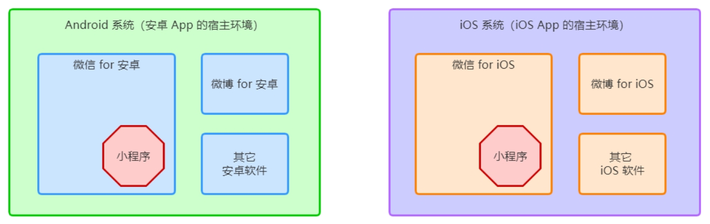


### 通信模型

> 小程序中通信的主体是**渲染层**和**逻辑层**；
>
> WXML 模板和 WXSS 样式工作在渲染层，JS 脚本工作在逻辑层；
>
> 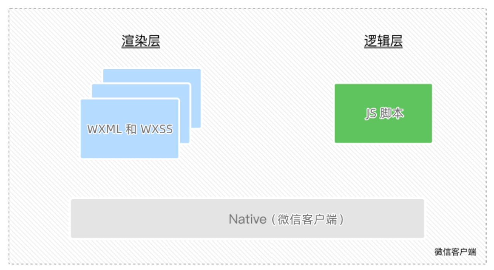
>
> 渲染层和逻辑层之间的通信，由微信客户端进行转发；
>
> 逻辑层和第三方服务器之间的通信，由微信客户端进行转发；
>
> 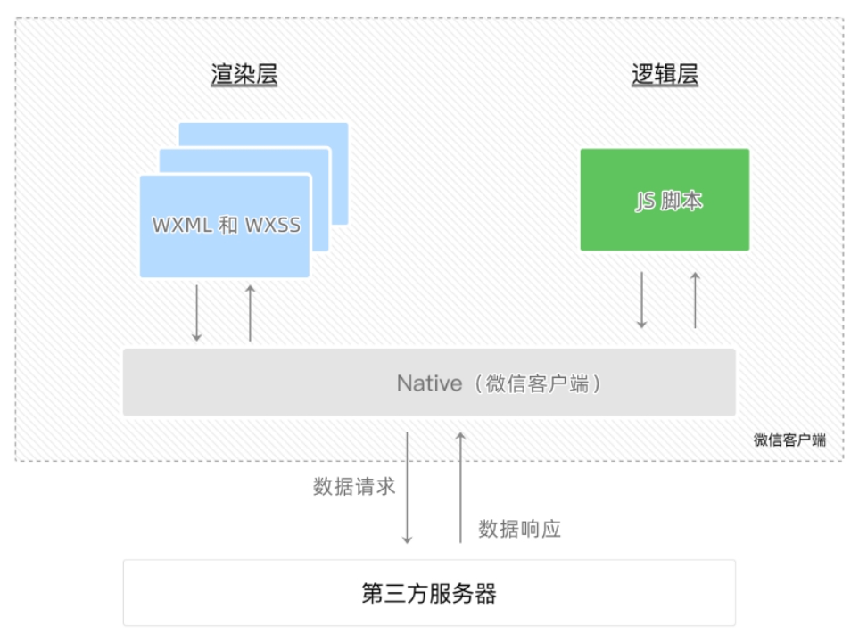


### 运行机制

> 小程序的运行机制；


#### 小程序启动

> 1. 把小程序的代码包下载到本地解析；
> 2. app.json 全局配置文件执行；
> 3. app.js 小程序入口文件，调用 App() 创建小程序实例；
> 4. 渲染小程序首页；
> 5. 小程序启动完成；


#### 页面渲染

> 1. 加载解析页面的 .json 配置文件；
> 2. 加载页面的 .wxml 模板和 .wxss 样式；
> 3. 执行页面的 .js 文件，调用 Page() 创建页面实例；
> 4. 页面渲染完成；


### 组件

> 小程序中的组件也是由宿主环境提供的，开发者可以基于组件快速搭建出漂亮的页面结构；
>
> 官方把小程序的组件分为了 9 大类：视图容器、基础内容、表单组件、导航组件、媒体组件、map 地图组件、canvas 画布组件、开放能力、无障碍访问；


#### 视图容器

> 展示内容的容器标签；


##### view

> 普通视图区域；
>
> 类似于 HTML 中的`<div>`，是一个块级元素；
>
> 常用来实现页面的布局效果；
>
> 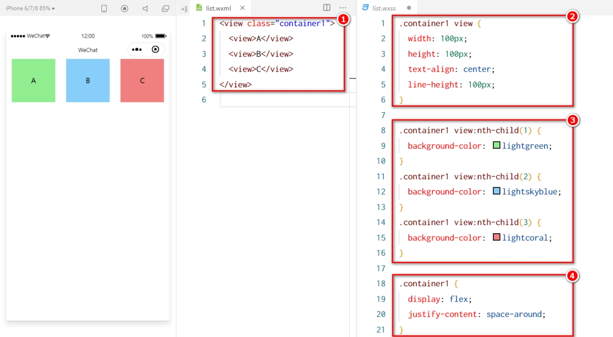


##### scroll-view

> **可滚动**的视图区域；
>
> 常用来实现滚动列表效果；
>
> 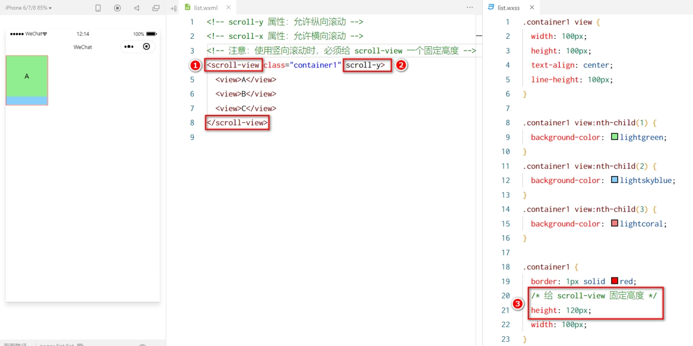


##### swiper

> **轮播图**容器组件和轮播图 item `<swiper-item>`组件；
>
> | 属性                   | 类型    | 默认值            | 说明                 |
> | ---------------------- | ------- | ----------------- | -------------------- |
> | indicator-dots         | boolean | false             | 是否显示面板指示点   |
> | indicator-color        | color   | rgba(0, 0, 0, .3) | 指示点颜色           |
> | indicator-active-color | color   | #000000           | 当前选中的指示点颜色 |
> | autoplay               | boolean | false             | 是否自动切换         |
> | interval               | number  | 5000              | 自动切换时间间隔     |
> | circular               | boolean | false             | 是否采用衔接滑动     |
>
> 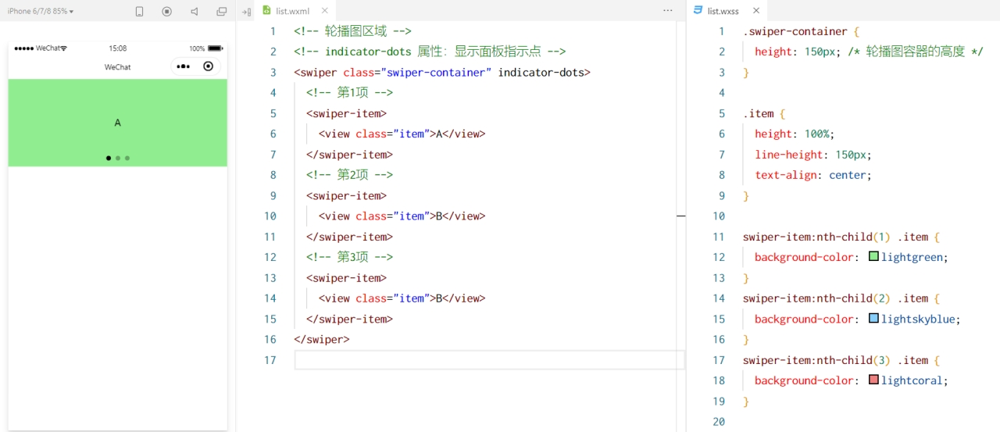


#### 基础内容

> 展示文字及内容的容器标签；


##### text

> 文本组件；
>
> 类似于 HTML 中的 span 标签，是一个行内元素；
>
> [^Focus]:通过 text 组件的 selectable 属性，实现长按选中文本内容的效果；
>
> 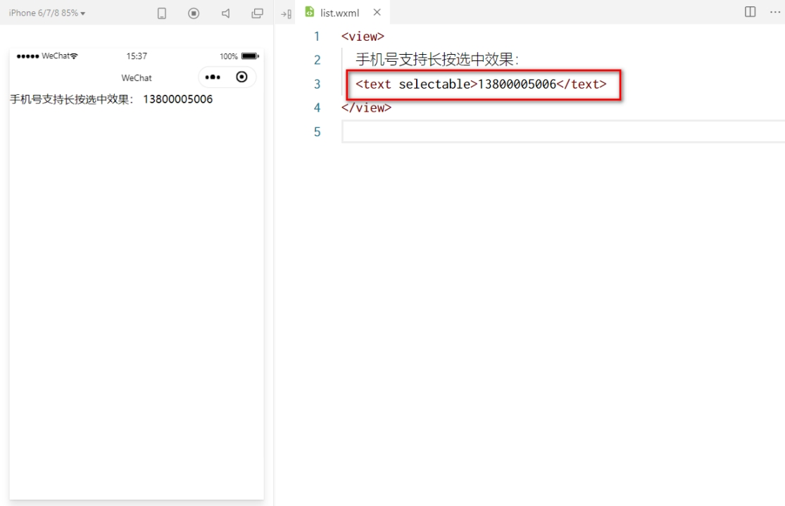


##### rich-text

> 富文本组件；
>
> 支持把 HTML 字符串渲染为 WXML 结构；
>
> [^Focus]:通过`<rich-text>`组件的`nodes`属性节点，把 HTML 字符串渲染为对应的 UI 结构；
>
> ```html
> <rich-text nodes="<h1 style='color: orange;font-size: 30px;text-align: center;'>富文本标签</h1>">
> </rich-text>
> ```
>
> 
>
> 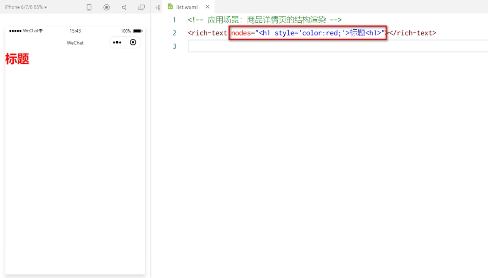


#### 其他组件

> 其它常用组件；


##### button

> 按钮组件；
>
> 功能比 HTML 中的 button 按钮丰富；
>
> 通过`type`属性可以给 button 设置不同的样式；
>
> 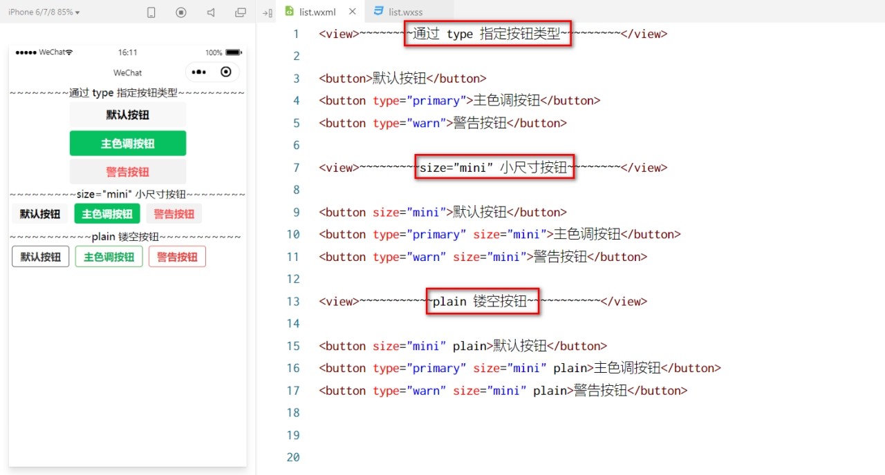


##### image

> 图片组件，类似于 HTML 中的``链接
>
> image 组件默认宽度约 300px、高度约 240px；
>
> [^Focus]:`<image>`组件的 mode 属性用来指定图片的**裁剪和缩放**模式；
>
> | mode 属性值 | 说明                                                         |
> | ----------- | ------------------------------------------------------------ |
> | scaleToFill | （默认值）不保持纵横比缩放图片，使图片的宽高完全拉伸至填满 image 元素 |
> | aspectFit   | 保持纵横比缩放图片，使图片的长边能完全显示出来，图片会完整地显示出来 |
> | aspectFill  | 保持纵横比缩放图片，只保证图片的短边能完全显示出来也就是说，另一个方向将会发生截取 |
> | widthFix    | 宽度不变，高度自动变化，保持原图宽高比不变                   |
> | heightFix   | 高度不变，宽度自动变化，保持原图宽高比不变                   |
>
> 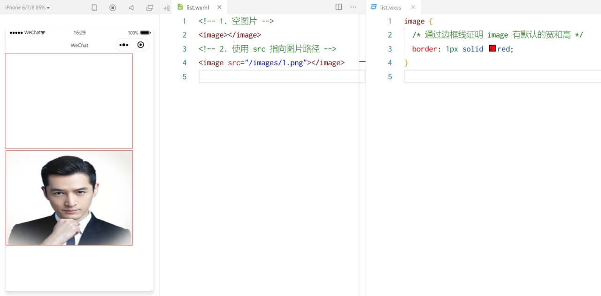


##### navigator

> 页面导航组件；
>
> 类似于 HTML 中的`<a>`链接


### API

> 小程序中的 API 是由宿主环境提供的；
>
> 通过这些丰富的小程序 API，开发者可以方便的调用微信提供的能力，例如：获取用户信息、本地存储、支付功能等；


#### 事件监听

> 以`on`开头，用来监听某些事件的触发；
>
> 举例：`wx.onWindowResize(callback)`监听窗口尺寸变化的事件；


#### 同步

> 以`Sync`结尾的 API 都是同步 API；
>
> 同步 API 的执行结果，可以通过函数返回值直接获取，如果执行出错会抛出异常；
>
> 举例：`wx.setStorageSync('key', 'value')`向本地存储中写入内容；


#### 异步

> 类似于 jQuery 中的`$.ajax(options)`函数，需要通过 success、fail、complete 接收调用的结果；
>
> 举例：`wx.request()`发起网络数据请求，通过 success 回调函数接收数据；


## 项目结构

> 创建**小程序**项目后文件夹中的内容结构；


### pages

> 用来存放所有小程序的页面；
>
> 类似于 Vue 项目中的`views`文件夹；


### utils

> 用来存放工具性质的模块；
>
> 例如：格式化时间的自定义模块；


### app.js

> 小程序项目的入口文件，通过调用`App()`函数来启动整个小程序；
>
> 类似于 Vue 项目中的`main.js`文件；
>
> ```js
> // app.js
> App({
>     onLaunch() {
>        // 展示本地存储能力
>        const logs = wx.getStorageSync('logs') || []
>        logs.unshift(Date.now())
>        wx.setStorageSync('logs', logs)
> 
>        // 登录
>        wx.login({
>          success: res => {
>            // 发送 res.code 到后台换取 openId, sessionKey, unionId
>          }
>        })
>     },
>     globalData: {
>        userInfo: null
>     }
> })
> ```


### app.json

> 小程序项目的功能性**全局配置文件**；
>
> 括了小程序的**所有页面路径、窗口外观、界面表现、底部 tabBar** 等；
>
> [^pages]:记录当前小程序所有页面的路径；
> [^window]:全局定义小程序所有页面的背景颜色、文字颜色等；
> [^style]:全局定义小程序组件所使用的**样式版本**；
> [^sitemapLocation]:用来指明`sitemap.json`文件在项目中文件中的位置；
> [^tabBar]:设置小程序底部的 tabBar 标签栏效果；
>
> ```json
> {
>   "pages":[
>     "pages/index/index",
>     "pages/logs/logs"
>   ],
>   "window":{
>     "backgroundTextStyle":"light",
>     "navigationBarBackgroundColor": "#fff",
>     "navigationBarTitleText": "Weixin",
>     "navigationBarTextStyle":"black",
>     "enablePullDownRefresh": true, // 启用下拉刷新功能，会作用于每个小程序页面
>     "backgroundColor": "#eeeeee", // 全局开启下拉刷新功能之后，窗口的背景颜色
>     "onReachBottomDistance": 50 // 设置上拉触底的距离，默认距离为50px，如果没有特殊需求，建议使用默认值即可
>   },
>   "style": "v2",
>   "sitemapLocation": "sitemap.json",
>   "tabBar": []
> }
> ```


#### window

> 全局定义小程序所有页面的背景颜色、文字颜色等的配置对象；
>
> 下图为小程序窗口的组成部分：
>
> 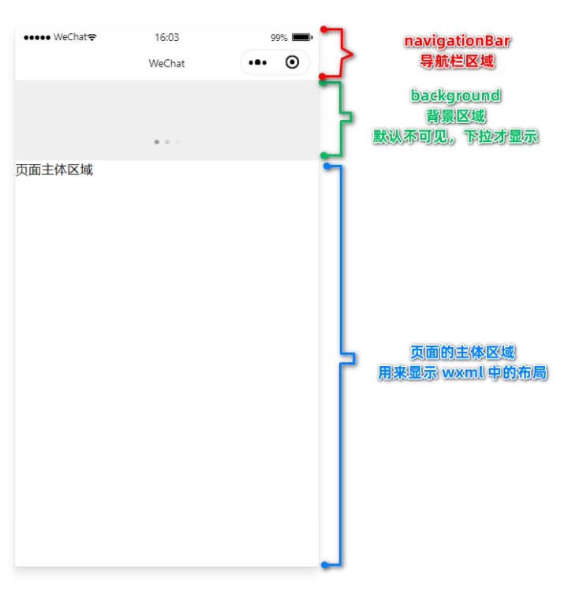
>
> window 节点常用的配置项：
>
> |            属性名            |   类型   | 默认值  |                      说明                       |
> | :--------------------------: | :------: | :-----: | :---------------------------------------------: |
> |    navigationBarTitleText    |  String  | 字符串  |               导航栏标题文字内容                |
> | navigationBarBackgroundColor | HexColor | #000000 |                 导航栏背景颜色                  |
> |    navigationBarTextStyle    |  String  |  white  |      导航栏标题颜色，仅支持 black / white       |
> |       backgroundColor        | HexColor | #ffffff |                  窗口的背景色                   |
> |     backgroundTextStyle      |  String  |  dark   |    下拉 loading 的样式，仅支持 dark / light     |
> |    enablePullDownRefresh     | Boolean  |  false  |              是否全局开启下拉刷新               |
> |    onReachBottomDistance     |  Number  |   50    | 页面上拉触底事件触发时距页面底部距离，单位为 px |


### app.wxss

> 小程序项目的**全局样式文件**；


### project.config.json

> 项目的运行配置文件；
>
> 记录小程序开发工具所做的个性化配置；
>
> [^setting]:与编译相关的配置项；
> [^projectname]:项目名称；
> [^appid]:创建小程序时保存的 AppID（开发者 ID）；
>
> ```json
> {
>     "description": "项目配置文件",
>     "packOptions": {
>        "ignore": [],
>        "include": []
>     },
>     "setting": {
>        "bundle": false,
>        "userConfirmedBundleSwitch": false,
>        "urlCheck": true,
>        "scopeDataCheck": false,
>        "coverView": true,
>        "es6": true,
>        "postcss": true,
>        "compileHotReLoad": false,
>        "lazyloadPlaceholderEnable": false,
>        "preloadBackgroundData": false,
>        "minified": true,
>        "autoAudits": false,
>        "newFeature": false,
>        "uglifyFileName": false,
>        "uploadWithSourceMap": true,
>        "useIsolateContext": true,
>        "nodeModules": false,
>        "enhance": true,
>        "useMultiFrameRuntime": true,
>        "useApiHook": true,
>        "useApiHostProcess": true,
>        "showShadowRootInWxmlPanel": true,
>        "packNpmManually": false,
>        "enableEngineNative": false,
>        "packNpmRelationList": [],
>        "minifyWXSS": true,
>        "showES6CompileOption": false,
>        "minifyWXML": true,
>        "babelSetting": {
>          "ignore": [],
>          "disablePlugins": [],
>          "outputPath": ""
>        }
>     },
>     "compileType": "miniprogram",
>     "libVersion": "2.19.4",
>     "appid": "wx3dbd83d0f1ce9473",
>     "projectname": "miniprogram-92",
>     "condition": {},
>     "editorSetting": {
>        "tabIndent": "insertSpaces",
>        "tabSize": 2
>     }
> }
> ```


### sitemap.json

> 配置其小程序页面是否允许微信索引，效果类似于 PC 网页的 SEO；
>
> 当允许索引时，微信会通过爬虫的形式，为小程序的页面内容建立索引；
>
> 当用户的搜索词条触发该索引时，小程序的页面将可能展示在搜索结果中；

[^Attention]:索引提示是默认开启的，如需关闭，可在小程序项目配置文件`project.config.json`的`setting`中配置`checkSiteMap`为`fals`；
[^更多信息]:https://developers.weixin.qq.com/miniprogram/dev/framework/sitemap.html


### project.private.config.json

> 项目私有配置文件；
>
> 此文件中的内容将覆盖`project.config.json`中的**相同字段**；
>
> 项目的改动优先同步到此文件中；

[^更多信息]:https://developers.weixin.qq.com/miniprogram/dev/devtools/projectconfig.html


## 页面结构

> 小程序官方建议把所有小程序的页面，都存放在`pages`目录中，以单独的文件夹存在；
>
> 每个页面由 4 个基本文件组成；
>
> ```js
> pages: {
>      home: {
>        home.js // 页面的脚本文件，存放页面的数据、事件处理函数等，类似于 Vue 项目中的 <script> 标签
>        home.json // 当前页面的配置文件，配置窗口的外观、表现等
>        home.wxml // 页面的模板结构文件，类似于 Vue 项目中的 <template> 标签
>        home.wxss // 当前页面的样式表文件，类似于 Vue 项目中的 <style> 标签
>      }
>      index: {
>        index.js
>        index.json
>        index.wxml
>        index.wxss
>      }
> }
> ```


### .js

> 页面中的`.js`文件是页面的入口文件，通过调用`Page()`函数来创建并运行页面；
>
> ```js
> Page({
>      data: {}, // 页面的初始数据
>      onLoad(options) {}, // 生命周期函数--监听页面加载
>      onReady() {}, // 生命周期函数--监听页面初次渲染完成
>      onShow() {}, // 生命周期函数--监听页面显示
>      onHide() {}, // 生命周期函数--监听页面隐藏
>      onUnload() {}, // 生命周期函数--监听页面卸载
>      onPullDownRefresh() {}, // 页面相关事件处理函数--监听用户下拉动作
>      onReachBottom() {}, // 页面上拉触底事件的处理函数
>      onShareAppMessage() {}, // 用户点击右上角分享
> })
> ```


### .json

> 当前页面的配置文件，小程序中的每一个页面，可以使用`.json`文件来对**本页面的窗口**外观进行配置；
>
> **页面中的配置项会覆盖`app.json`的`window`中相同的配置项**；
>
> ```json
> // 页面文件中的 json 文件 home.json
> // 只对 当前页面 生效
> {
>   "navigationBarBackgroundColor": "#fafafa", // 设置导航栏的背景色
>   "backgroundTextStyle": "dark", // 设置导航栏的标题颜色，仅支持 black / white
>   "navigationBarTitleText": "Training", // 设置页面导航栏的标题文字
>   "backgroundColor": "#aaaaaa", // 当前页面窗口的背景色
>   "enablePullDownRefresh": false, // 是否为当前页面开启 下拉刷新 的效果
>   "onReachBottomDistance": 50 // 页面 上拉触底 事件触发时距页面底部距离，单位为 px
> }
> ```
>
> ```json
> // 小程序中的 app.json 文件
> // 对 全部页面 生效
> {
>   "window": {
>     "backgroundTextStyle": "light",
>     "navigationBarBackgroundColor": "#fff",
>     "navigationBarTitleText": "Weixin",
>     "navigationBarTextStyle": "black"
>   }
> }
> ```

[^Tip]:当页面配置与全局配置冲突时，根据就近原则，最终的效果以**页面配置**为准；


### .wxml

> `wxml(WeiXin Markup Language)`是小程序框架设计的一套标签语言，用来构建小程序页面的结构；
>
> 其作用类似于网页开发中的 HTML；
>
> ```html
> <!-- 标签名称不同 -->
> HTML: <div>, <span>, , <a>
> WXML: <view>, <text>, <image>, <navigator>
> 
> <!-- 属性节点不同 -->
> HTML: <a href="#">超链接</a>
> WXML: <navigator url="/pages/home/home"></navigator>
> 
> <!-- 提供了类似于 Vue 中的模板语法 -->
> 数据绑定
> 列表渲染
> 条件渲染
> ```


### .wxss

> `wxss(WeiXin Style Sheets)`是一套**样式语言**，用于描述`wxml`的组件样式，类似于网页开发中的`css`；
>
> ```css
> /** 新增了 rpx 尺寸单位 **/
> css 中需要手动进行像素单位换算，例如 rem
> wxss 在底层支持新的尺寸单位 rpx，在不同大小的屏幕上小程序会自动进行换算
> 
> /** 新增了 @import 引入外部样式文件 **/
> @import 'app-wxa-auto-dark.wxss'
> 
> /** 提供了全局的样式和局部样式 **/
> 项目根目录中的 app.wxss 会作用于所有小程序页面
> 局部页面文件的 .wxss 样式仅对当前页面生效
> 
> /** wxss 仅支持部分 css 选择器 **/
> .class 和 #id
> element
> 并集选择器、后代选择器
> ::after 和 ::before 等伪类选择器
> ```


#### rpx

> `rpx( responsive pixel )`是微信小程序独有的，用来解决屏适配的尺寸单位；
>
> rpx 实现原理是将所有设备的屏幕，在宽度上等分为 750 份，即当前屏幕的总宽度为 750rpx；
>
> 在较小的设备上，1rpx 所代表的宽度较小；
>
> 在较大的设备上，1rpx 所代表的宽度较大；
>
> 在不同设备上运行时，自动把 rpx 的样式单位换算成对应的像素单位来渲染，从而实现屏幕适配；
>
> |     设备     | rpx 换算 px (屏幕宽度/750) | px 换算 rpx (750/屏幕宽度) |
> | :----------: | :------------------------: | :------------------------: |
> |   iPhone5    |       1rpx = 0.42px        |       1px = 2.34rpx        |
> |   iPhone6    |        1rpx = 0.5px        |         1px = 2rpx         |
> | iPhone6 Plus |       1rpx = 0.552px       |       1px = 1.81rpx        |

[^Tip]:开发微信小程序时，建议用 iPhone6 作为视觉稿的标准，换算单位时更方便；


#### @import

> 在小程序中，可以使用`@import`来引入外部样式文件；
>
> ```css
> /** outfile.wxss **/
> .title {
>   padding: 10px;
> }
> ```
>
> ```scss
> /** 引入外部样式 **/
> @import 'outfile.wxss';
> 
> /** 自身样式 **/
> .container {
>   height: 100%;
>   display: flex;
>   flex-direction: column;
>   align-items: center;
>   justify-content: space-between;
> }
> ```


#### 作用域

> 定义在`app.wxss`中的样式为**全局样式**，作用于每一个页面；
>
> 定义在页面的`.wxss`文件中定义的样式为**局部样式**，只作用于当前页面；

[^Tip]:当局部样式和全局样式冲突时，根据就近原则，局部样式会覆盖全局样式；
[^Tip]:当局部样式的权重大于或等于全局样式的权重时，才会覆盖全局的样式；


### 新增页面

> 只需要在`app.json`文件中的`pages`数组中新增页面的文件路径；
>
> 小程序开发者工具即可帮我们自动创建对应的页面文件；
>
> ```json
> {
>     "pages": [
>        "pages/index/index",
>        "pages/logs/logs",
>        "pages/home/home"
>     ]
> }
> ```


### 修改首页

> 只需要调整`app.json`文件中的`pages`数组中页面文件路径的前后顺序，即可修改项目的首页；
>
> **小程序会把顺序在第一的页面，当作项目首页进行渲染**；


## 生命周期( Lifecycle )

> 是指一个对象从**创建 --> 运行 --> 销毁**的整个阶段，强调的是一个时间段；
>
> 由小程序框架提供的**内置函数**，会伴随着生命周期，自动按次序执行；
>
> 在小程序中，生命周期分为两类：**应用生命周期**和**页面生命周期**；
>
> 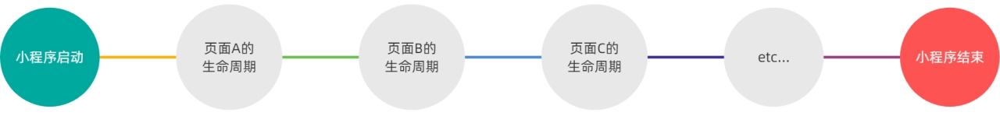
>
> 

[^Tip]:生命周期强调的是时间段，生命周期函数强调的是时间点；


### 应用生命周期

> 小程序从**启动 --> 运行 --> 销毁**的过程；
>
> 小程序的应用生命周期函数需要在`app.js`中进行声明；
>
> [^官方链接]:https://developers.weixin.qq.com/miniprogram/dev/reference/api/App.html#onLaunch-Object-object
>
> ```js
> App({
>   onLaunch() {
>     // 小程序初始化完成时触发，全局只触发一次，可以做一些初始化工作
>     // 参数也可以使用 wx.getLaunchOptionsSync 获取
>   },
>   onShow() {
>     // 小程序启动，或从后台进入前台显示时触发
>     // 也可以使用 wx.onAppShow 绑定监听
>   },
>   onHide() {
>     // 小程序从前台进入后台时触发；
>     // 也可以使用 wx.onAppHide 绑定监听
>   },
>   onError() {
>     // 小程序发生脚本错误或 API 调用报错时触发
>     // 也可以使用 wx.onError 绑定监听
>   },
>   onPageNotFound() {
>     // 小程序要打开的页面不存在时触发
>     // 也可以使用 wx.onPageNotFound 绑定监听
>   },
>   onThemeChange() {
>     // 系统切换主题时触发
>     // 也可以使用 wx.onThemeChange 绑定监听
>   },
>   onUnhandledRejection() {
>     // 小程序有未处理的 Promise 拒绝时触发
>     // 也可以使用 wx.onUnhandledRejection 绑定监听
>   }
> })
> ```

[^Tip]:**App() 必须在 `app.js` 中调用，必须调用且只能调用一次，不然会出现无法预期的后果**；


### 页面生命周期

> 页面的**加载 -> 渲染 -> 销毁**的过程；
>
> 小程序的**页面生命周期函数**需要在页面的`.js`文件中进行声明；
>
> ```js
> // 页面的 .js 文件
> Page({
>   // 生命周期函数--监听页面加载
>   onLoad(options) {
>     console.log(options)
>   },
>   onReady() {}, // 生命周期函数--监听页面初次渲染完成
>   onShow() {}, // 生命周期函数--监听页面显示
>   onHide() {}, // 生命周期函数--监听页面隐藏
>   onUnload() {}, // 生命周期函数--监听页面卸载
>   onPullDownRefresh() {}, // 页面相关事件处理函数--监听用户下拉动作
>   onReachBottom() {}, // 页面上拉触底事件的处理函数
>   onShareAppMessage() {} // 用户点击右上角分享
> })
> ```


## tabBar

> tabBar 是移动端应用常见的页面效果，用于实现多页面的快速切换，小程序中有底部、顶部的 tabBar；

[^Focus]:tabBar 中只能配置最少 2 个、最多 5 个 tab 页签；
[^Tip]:当渲染顶部 tabBar 时，不显示 icon，只显示文本；


### 配置项

> 书写位置：`app.json`文件，与`pages`对象同级；
>
> ```json
> {
>   "tabBar": {
>     "position": "bottom", // tabBar 的位置，仅支持 bottom/top， 默认是 bottom
>     "backgroundColor": "#fafafa", // tabBar 的背景色
>     "borderStyle": "white", // tabBar 上边框的颜色，仅支持 black/white
>     "color": "#202020", // tab 文字的默认（未选中）颜色
>     "selectedColor": "#fdb926", // tab 的文字选中时的颜色
>     // tab 页签的列表，最少 2 个、最多 5 个 tab，必填项，且不能为空
>     "list": [
>       {
>         "pagePath": "pages/home/home", // 页面路径，页面必须在 pages 中预先定义
>         "text": "Home", // tab 上显示的文字
>         "iconPath": "/images/tabBar/home_normal.png", // 未选中时的图标路径
>         "selectedIconPath": "/images/tabBar/home_active.png" // 选中时的图标路径
>       },
>       {
>         "pagePath": "pages/index/index",
>         "text": "Category",
>         "iconPath": "/images/tabBar/category_narmal.png",
>         "selectedIconPath": "/images/tabBar/category_active.png"
>       },
>       {
>         "pagePath": "pages/logs/logs",
>         "text": "Cart",
>         "iconPath": "/images/tabBar/cart_normal.png",
>         "selectedIconPath": "/images/tabBar/cart_active.png"
>       },
>       {
>         "pagePath": "pages/person/person",
>         "text": "Person",
>         "iconPath": "/images/tabBar/me_normal.png",
>         "selectedIconPath": "/images/tabBar/me_active.png"
>       }
>     ]
>   }
> }
> ```

[^Focus]:`pagePath`中填写的路径，不能以`/`开头；


## Mustache

> 小程序的数据为**单向数据流**，在`.js`文件中定义数据，在`.wxml`中使用数据；
>
> 借助`Mustache`语法在`.wxml`文件中使用变量和数据，使用**双括号**包裹数据；
>
> 语法： `{{ 数据名称 }}`
>
> ```js
> // 定义数据
> Page({
>      data: {
>        title: 'Mustache 语法',
>        imgUrl: '/imags/mustache_bind_data.png',
>        randomNumber: Math.random(),
>      }
> })
> ```
>
> ```html
> <!-- 使用数据 -->
> <view>{{ title }}</view>
> <view>
>      <image src='{{ imgUrl }}'></image>
> </view>
> <view>{{ randomNumber > 0.5 ? '大' : '小' }}</view>
> <view>100 之内的随机数{{ randomNumber * 100 }}</view>
> ```


## setData()

> 小程序中是**单向数据流**，需要调用`this.setData()`方法设置新的数据；
>
> ```js
> Page({
>   data: {
>     count: 5
>   },
>   // 生命周期函数 -- 页面初次渲染完成
>   onReady() {
>     this.setData({
>       count: this.data.count + 5
>     })
>   }
> })
> ```


## wxs 语言

> wxs（WeiXin Script）是小程序独有的一套脚本语言，结合 WXML 使用；
>
> 小程序中`wxs`的典型应用场景就是**过滤器**，配合 Mustache 语法进行使用；
>
> 但是，在 wxs 中定义的函数不能作为组件的事件回调函数，下图为错误的使用方法；
>
> 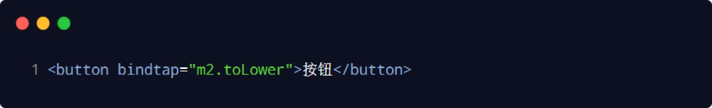


### 特点( Features )

> wxs 的语法类似于 JavaScript，但是 wxs 和 JavaScript 是完全不同的两种语言；


#### 数据类型

> number（数值类型）、string（字符串类型）、boolean（布尔类型）、object（对象类型）
>
> function（函数类型）、array（数组类型）、date（日期类型）、regexp（正则）


#### 语法

> **不支持** let、const、解构赋值、展开运算符、箭头函数、对象属性简写、etc...
>
> **支持** var 定义变量、普通 function 函数等类似于 ES5 的语法


#### 规范

> wxs 遵循`CommonJS`规范；
>
> `module`对象、`require()`函数、`module.exports`对象；


#### 隔离型

> wxs 不能调用 js 中定义的函数；
>
> **wxs 不能调用小程序提供的 API**；


#### 性能好

> 在 iOS 设备上，小程序内的 wxs 会比 JavaScript 代码快 2 ~ 20 倍；
>
> 在 android 设备上，二者的运行效率无差异；


### 书写语法( Grammar )

> 和`JavaScript`一样，同样可以有**内嵌**和**外链**两种方式；
>
> wxml 文件中的每个`<wxs>`标签，必须提供`module`属性，用来指定当前 wxs 的模块名称；


#### 内嵌

> wxs 代码可以编写在 wxml 文件中的`<wxs>`标签内，和 html 文件中的`<script>`标签一样；
>
> ```js
> Page({
>   data: {
>     name: 'kein'
>   }
> })
> ```
>
> ```html
> <view>原始值：{{ name }}</view> <!-- kein -->
> <view>过滤值：{{ person.toUpper(name) }}</view> <!-- KEIN -->
> 
> <!-- 内嵌 -->
> <wxs module="person">
>   // 将字母全部大写
>   var toUpper = function (value) {
>   	return value.toUpperCase()
>   }
>   module.exports = {
>   	toUpper: toUpper
>   }
> </wxs>
> ```


#### 外链

> wxs 代码还可以编写在以`.wxs`为后缀名的文件内；
>
> ```js
> Page({
>     data: {
>        number: 5.2
>     }
> })
> ```
>
> ```html
> <view>原始值：{{ number }}</view> <!-- 5.2 -->
> <!-- 调用 count 模块中的 multiple 方法 -->
> <view>过滤值：{{ count.multiple(number) }}</view> <!-- 52 -->
> 
> <!-- 外链 -->
> <wxs src="./persom.wxs" module="count"></wxs>
> ```
>
> ```js
> // .wxs 文件
> var multiple = function(value) {
>     return value * 10
> }
> 
> module.exports = {
>     multiple: multiple
> }
> ```

[^Focus]:`src`属性指定要引入的 .wxs 脚本文件的路径，**且必须是相对路径**；


## 组件( Components )

> 存在于项目根目录下的`components`文件夹中，文件结构和页面文件一样；


### 创建( Create )

> 1. 在项目的根目录中，鼠标右键，创建`components` 文件夹；
> 2. 在新建的 components 文件夹上，鼠标右键，点击**新建 Component**键入组件的名称之后回车；
> 3. 会自动生成组件对应的 4 个文件，后缀名分别为 .js、.json、.wxml、.wxss；


### 特性( Features )

> 虽然组件和页面的组成文件类似，但是还是有所区别的；
>
> 1. 组件的 .json 文件中需要声明`"component": true`；
>
> ```json
> {
>   "component": true, // 告诉小程序，这个文件是 组件文件
>   "usingComponents": {}
> }
> ```
>
> 2. 组件的 .js 文件中调用的是`Component()`函数；
>
> ```js
> Component({
>   // 组件的属性列表
>   properties: {},
>   // 组件的初始数据
>   data: {},
>   // 组件的方法列表
>   methods: {}
> })
> ```
>
> 3. **组件的方法需要定义到`methods`节点中**；
>
> ```js
> Component({
>   // 组件的方法列表
>   methods: {
>     // 事件回调函数
>     handlerClick() {},
>     // 非事件回调的自定义方法，建议用下划线 _ 开头
>     _showInfp() {}
>   }
> })
> ```


### 生命周期( Lifecircle )

> 组件的生命周期；
>
> ```js
> Component({
>     // 组件生命周期
>     lifetimes: {
>        // 组件实例刚刚被创建时执行（重要）
>        created() {
>          // 此时还不能调用 this.setData()
>          // 通常在此时给组件的 this 添加一些自定义的属性字段
>        },
>        // 在组件实例进入页面节点树时执行（重要）
>        attached() {
>          // 此时，this.data 已被初始化完毕
>          // 绝大多数初始化的工作可以在这个时机进行（例如发请求获取初始数据）
>        },
>        // 组件在视图层布局完成后执行
>        ready() {
>          console.log('ready')
>        },
>        // 在组件实例被移动到节点树另一个位置时执行
>        moved() {},
>        // 在组件实例被从页面节点树移除时执行（重要）
>        detached() {
>          // 退出一个页面时，会触发页面内每个组件的 detached 生命周期函数
>          // 此时适合做一些清理性质的工作
>        },
>        error() {} // 每当组件方法抛出错误时执行
>     },
>     // 组件所在页面的生命周期
>     pageLifetimes: {
>        show() {
>          // 页面被展示
>        },
>        hide() {
>          // 页面被隐藏
>        },
>        resize(size) {
>          // 页面尺寸变化
>        }
>     }
> })
> ```


### 属性( properties )

> 在小程序组件中，`properties`是组件的对外属性，**用来接收外界传递到组件中的数据**；
>
> ```html
> <!-- 在页面 .wxml 文件中给组件传递 属性 -->
> <MyComponent name="kein" age="{{ 22 }}"></MyComponent>
> ```
>
> ```js
> // MyComponent 组件的 .js 文件
> Component({
>   // 组件的属性对象，在这里声明组件接收的属性
>   properties: {
>     name: {
>       type: String, // 属性的数据类型
>       value: '', // 属性的默认值
>     },
>     age: {
>       type: Number,
>       value: 0
>     }
>   }
> })
> ```
>
> ```html
> <!-- // MyComponent 组件的 .wxml 文件 -->
> <text>{{ name }}</text>
> <text>{{ age }}</text>
> <button type="primary" bindtap="showProperties">showProperties</button>
> <button type="primary" bindtap="changeProperties">changeProperties</button>
> <!-- properties 的使用方法和 data 一样 -->
> ```
>
> 在小程序的组件中，`properties`属性和`data`数据的用法相同，它们都是**可读可写**的；
>
> `data`更倾向于存储组件的私有数据；
>
> `properties`更倾向于存储**外界传递**到组件中的数据；
>
> ```js
> Component({
>   methods: {
>     showProperties() {
>       console.log(this.properties) // {name: "Kein", age: 22}
>       console.log(this.data) // {name: "Kein", age: 22}
>       console.log(this.data === this.properties) // true
>     },
>     // 修改 properties 的数据，也可以使用 this.setData() 方法
>     changeProperties() {
>       this.setData({
>         age: this.properties.age + 1
>       })
>     }
>   }
> })
> // data 和 properties 在本质上是一样的
> ```


### 数据监听( observers )

> 用于监听和响应任何属性和数据字段的变化，从而执行特定的操作，类似于 vue 中的 watch 侦听器；
>
> ```js
> Component({
>   data: {
>     number_a: 10,
>     number_b: 5,
>     sum: 0,
>     color: {
>       r: 0,
>       g: 0,
>       b: 0
>     }
>   },
>   // 数据监听
>   observers: {
>     // 监听 number_a 和 number_b 值的变化
>     'number_a, number_b': function(new_a, new_b) {
>       // new_a 为 number_a 变化后的新值
>       // new_b 为 number_b 变化后的新值
>       console.log(new_a, new_b)
>       this.setData({
>         sum: new_a + new_b
>       })
>     },
>     // 监听 对象中属性 的变化
>     'color.r, color.g, color.b': function(r, g, b) {
>       console.log(r, g, b)
>       // 改变 color 对象中 r、g、b 属性时，会触发监听
>       // 直接给 color 对象赋值时，也会触发监听
>     },
>     // 使用通配符 ** 来监听对象中 所有属性 的变化
>     'color.**': function(new_color) {
>       console.log(new_color.r, new_color.g, new_color.b)
>     }
>   }
> })
> ```

[^Focus]:如果要在数据监听中使用`this`，则回调函数需要用`function`声明，不能写成了箭头函数；


### 纯数据字段( PureData )

> 指的是那些**不用于界面渲染的 data 字段**；
>
> 例如某些 data 中的字段既不会展示在界面上，也不会传递给其他组件，仅仅在当前组件内部使用；
>
> ```js
> Component({
>   options: {
>     // 定义纯数据字段的匹配模式：所有以 _ 开头的字段为纯数据字段
>     pureDataPattern: /^_/
>   },
>   data: {
>     fillColor: '0, 0, 0', // 不是
>     _pureCount: 255 // 纯数据字段
>   }
> })
> ```

[^Tip]:纯数据字段有助于提升页面更新的性能；


### 引用( Cite )

> 在其他页面或组件中，使用组件；
>
> 组件的引用方式分为**局部引用**和**全局引用**；


#### 全局引用

> 组件可以在每个小程序页面中使用；
>
> ```json
> // app.json 文件中全局 引用组件
> {
>   "usingComponents": {
>     "GlobalTable": "/components/table/table"
>   }
> }
> ```
>
> ```html
> <!-- 在 任何页面 都可以使用该组件 -->
> <GlobalTable></GlobalTable>
> ```


#### 局部引用

> 组件只能在当前被引用的页面内使用；
>
> ```json
> // 页面的 .json 文件
> {
>   "usingComponents": {
>     // "组件名": "组件文件路径"
>     "Table": "/components/table/table"
>   }
> }
> ```
>
> ```html
> <!-- 在页面的 .wxml 文件中书写 组件标签 -->
> <Table></Table>
> ```


### 样式隔离( Isolation )

> 默认情况下，**自定义组件的样式只对当前组件生效**，具有样式隔离效果；
>
> * app.wxss 中的全局样式对组件无效；
> * **只有 class 选择器会有样式隔离效果**，id 选择器、属性选择器、标签选择器不受样式隔离的影响；

[^Advice]:在组件和引用组件的页面中建议使用 class 选择器，不要使用 id、属性、标签选择器；

> 可以通过`styleIsolation`修改组件的样式隔离选项；
>
> 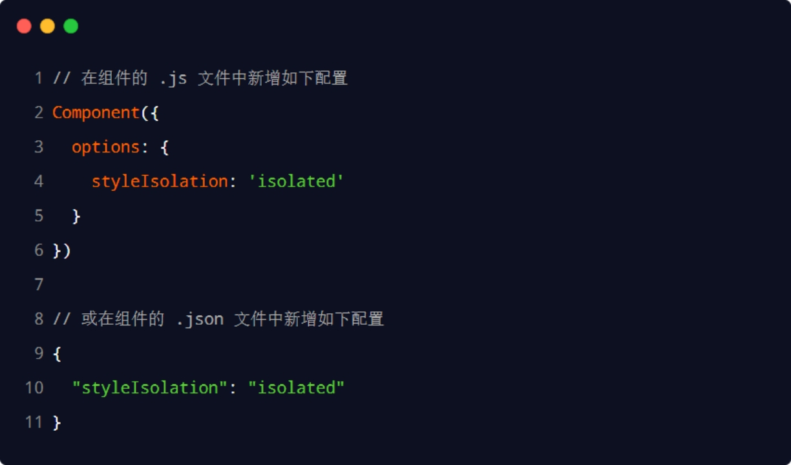

|    可选值    |                             描述                             |
| :----------: | :----------------------------------------------------------: |
|   isolated   | 启用样式隔离，在自定义组件内外，使用 class 指定的样式将不会相互影响 |
| apply-shared | 页面 wxss 样式将影响到组件，但组件 wxss 中的样式不会影响页面 |
|    shared    | 页面 wxss 样式将影响组件，组件 wxss 中的样式也会影响页面和其他设置了 apply-shared 或 shared 的组件 |


## 事件绑定( Event )

> **事件绑定**是渲染层到逻辑层的通讯方式；
>
> 通过事件可以将用户在渲染层产生的行为，反馈到逻辑层进行业务的处理；
>
> 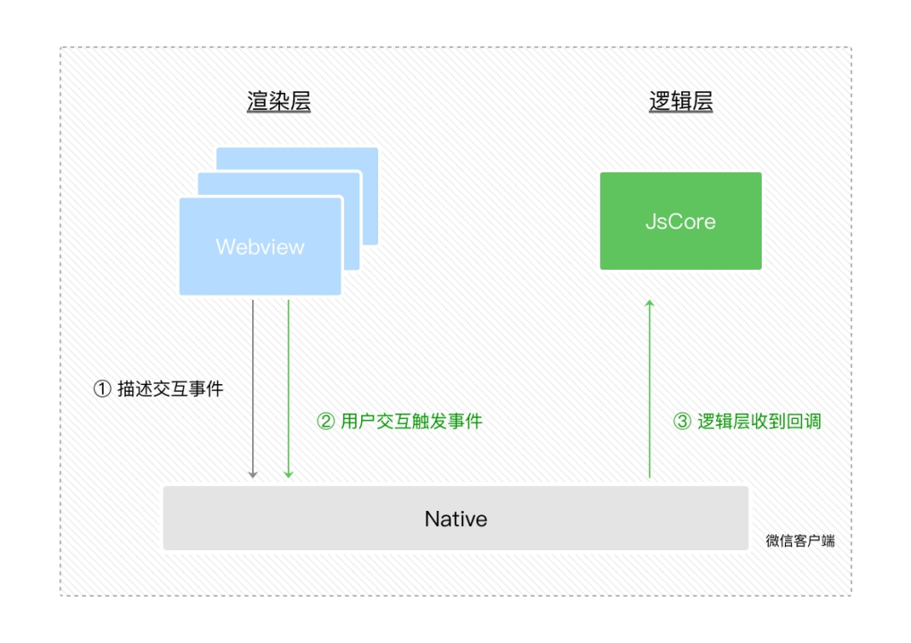


### 事件类型

> 小程序中常用的事件；
>
> |  类型  |         绑定方式          |                    事件描述                     |
> | :----: | :-----------------------: | :---------------------------------------------: |
> |  tap   |    bindtap 或 bind:tap    | 手指触摸后马上离开，类似于 HTML 中的 click 事件 |
> | input  |  bindinput 或 bind:input  |                文本框的输入事件                 |
> | change | bindchange 或 bind:change |                 状态改变时触发                  |


### 事件元对象

> 当事件回调触发的时候，会收到一个事件对象`event`；
>
> ```html
> <view bindtap="tapHandler">Tap</view>
> ```
>
> ```js
> Page({
>     // 屏幕点击事件回调函数
>     tapHandler(event) {
>        console.log(event) // 事件元对象 event
>     }
> })
> ```
>
> `event`对象中的属性：
>
> |      属性      |  类型   |                     说明                     |
> | :------------: | :-----: | :------------------------------------------: |
> |      type      | String  |                   事件类型                   |
> |   timeStamp    | Integer |       页面打开到触发事件所经过的毫秒数       |
> |   **target**   | Object  |        触发事件的组件的一些属性值集合        |
> | currentTarget  | Object  |           当前组件的一些属性值集合           |
> |   **detail**   | Object  |                  额外的信息                  |
> |    touches     |  Array  | 触摸事件，当前停留在屏幕中的触摸点信息的数组 |
> | changedTouches |  Array  |     触摸事件，当前变化的触摸点信息的数组     |
>
> `target`和`currentTarget`的区别；
>
> `target`是触发该事件的源头组件；
>
> `currentTarget`则是当前事件所绑定的组件；
>
> 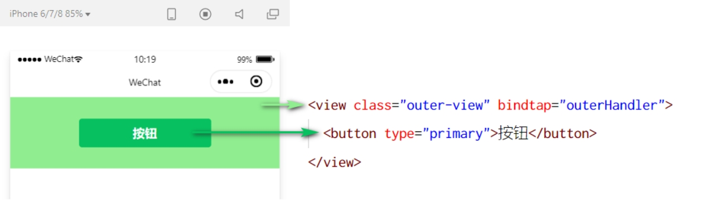
>
> 点击`<view>`内部的`<button>`时，点击事件以**冒泡**的方式向外扩散，触发外层`<view>` 的`bindtap`事件处理函数；
>
> 即`event.target`是`<button>`组件，`event.currentTarget`是`<view>`组件；


### 事件传参

> 小程序中的事件传参比较特殊，**不能在绑定事件的同时为事件处理函数传递参数**，以下为错误方式；
>
> 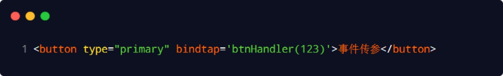
>
> 小程序会把`bindtap`的属性值，统一当作事件名称来处理，相当于要调用一个名称为`btnHandler(123)`的事件处理函数；
>
> ```html
> <!-- 传参方式 -->
> <view data-count='{{ 5 }}' bindtap="tapHandler">事件传参</view>
> <!-- count 为参数名称，5 为参数值 -->
> ```
>
> ```js
> // 在点击事件中获取 参数
> Page({
>      tapHandler(event) {
>        // dataset 是一个 对象，包含了所有通过 data- 传递过来的参数项
>        console.log(event.currentTarget.dataset)
>        // 在 dataset 对象中，可以获取具体参数的值
>        console.log(event.currentTarget.dataset.count)
>      }
> })
> ```
>
> 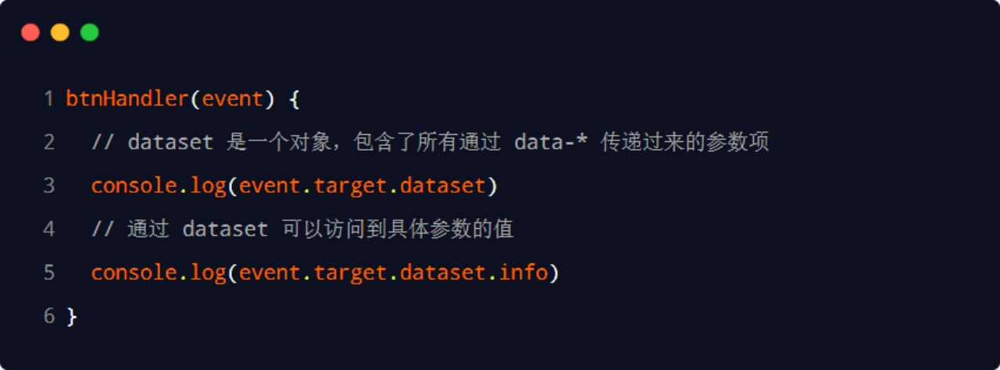


### bindinput

> 输入框的**输入**事件`bindinput`，可以为文本框绑定输入事件；
>
> ```html
> <!-- bindinput 绑定输入事件 -->
> <input bindinput="inputHandler" value="{{ message }}" type="text"/>
> ```
>
> ```js
> // 在页面的 .js 文件中定义事件处理函数
> Page({
>     data: {
>        message; '' // 输入框绑定的值
>     },
>     inputHandler(e) {
>        // e.detail.value 是变化后文本框最新的值
>        console.log(e.detail.value)
>        // 通过 this.setData() 方法设置新状态
>        this.setData({
>          message: e.detail.value
>        })
>     }
> })
> ```


## wx:if

> **条件渲染**
>
> ```html
> <!-- wx:if -->
> <view wx:if="{{ condition }}">条件渲染</view>
> 
> <!-- wx:if 和 wx:elif 配合使用 -->
> <view wx:if="{{ type === 'male' }}">male</view>
> <view wx:elif="{{ type === 'female' }}">female</view>
> <view wx:else>保密</view>
> 
> <!-- <block> 标签 -->
> <!-- <block> 只是一个包裹性质的容器，不会在页面中做任何渲染 -->
> <block wx:if='{{ true }}'>
>   <view>view_1</view>
>   <view>view_2</view>
> </block>
> 
> <!-- hidden -->
> <view hidden="{{ condition }}">条件为 true 时显示，条件为 false 时隐藏 </view>
> ```
>
> ```js
> Page({
>   data: {
>     condition: true,
>     type: 'male'
>   }
> })
> ```


### wx:if / hidden

> `wx:if`
>
> * 以动态创建和移除元素的方式，控制元素的展示与隐藏；
>
> * 控制条件复杂时，建议使用 wx:if 搭配 wx:elif、wx:else 进行展示与隐藏的切换；
>
> `hidden`
>
> * 以切换样式的方式`display: none/block`，控制元素的显示与隐藏；
> * 频繁切换时，建议使用 hidden；


## wx:for

> **循环渲染**，根据指定的数组数据，循环渲染重复的组件结构；
>
> ```html
> <view>
>   <view wx:for="{{infoList}}" wx:key="index">
>     <text>姓名：{{item.name}}</text>
>     <text>年龄：{{item.age}}</text>
>   </view>
> </view>
> <!-- 默认情况下，当前循环项的索引用 index 表示；当前循环项用 item 表示 -->
> ```
>
> ```js
> Page({
>   data: {
>     infoList: [
>       {
>         name: 'Kein',
>         age: 24
>       },
>       {
>         name: 'lovelyKein',
>         age: 23
>       }
>     ]
>   }
> })
> ```
>
> 自定义**索引**和**遍历项**的变量名称；
>
> 使用`wx:for-index`可以指定当前循环项的索引的变量名城；
>
> 使用`wx:for-item`可以指定遍历项的变量名称；
>
> 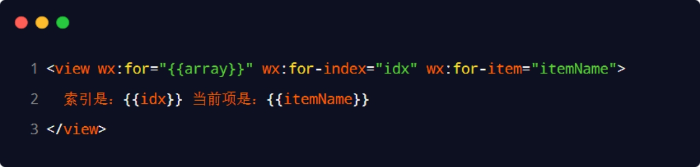


### wx:key

> 类似于 Vue 列表渲染中的 key；
>
> 小程序在实现列表渲染时，建议为渲染出来的列表项指定**唯一且稳定**的 key 值，从而提高渲染的效率；
>
> ```html
> <view wx:for="{{infoList}}" wx:key="name">
>   <text>姓名：{{item.name}}</text>
>   <text>年龄：{{item.age}}</text>
> </view>
> ```

[^Focus]:小程序中的`wx:key`值，不是类似 Vue 中具体的值，而是一个**属性键名**，`name`则为遍历项中的 name 属性；


## 网络请求

> 在小程序中发起网络数据请求；
>
> 由于小程序的宿主环境不是浏览器，而是微信客户端，所以小程序中不存在跨域的问题；


### 限制

> 出于安全性方面的考虑，小程序官方对数据接口的请求做出了如下两个限制：
>
> * 只能请求 HTTPS 类型的接口；
> * 必须将接口的域名添加到信任列表中；
>
> 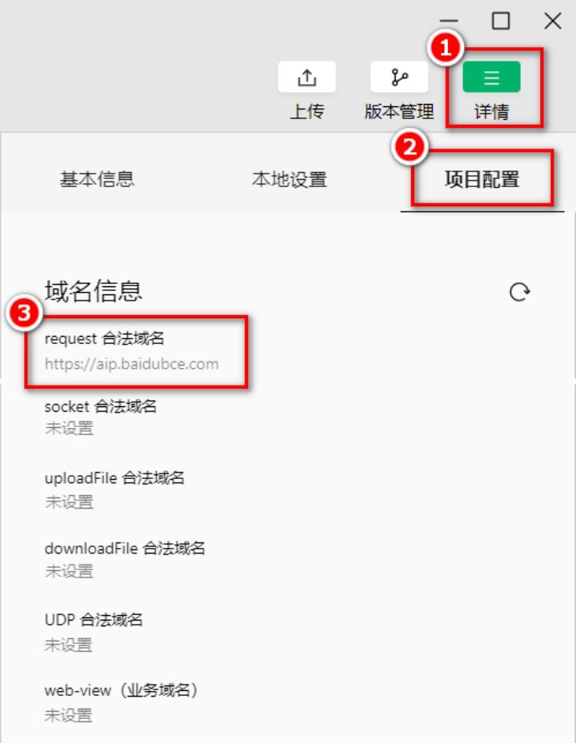


### 配置合法域名

> 登录微信小程序管理后台 --> 开发 --> 开发设置 --> 服务器域名 --> 修改 request 合法域名；
>
> 注意事项：
>
> * 域名只支持 https 协议；
> * 域名不能使用 IP 地址或 localhost；
> * 域名必须经过 ICP 备案；
> * 服务器域名一个月内最多可申请 5 次修改；


### 跳过域名校验

> 在微信开发者工具中，临时开启开发环境不校验请求域名、TLS 版本及 HTTPS 证书选项，跳过 request 合法域名的校验；
>
> 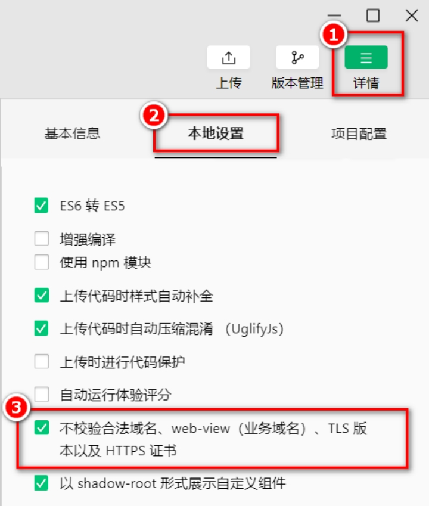

[^Focus]:跳过 request 合法域名校验的选项，**仅限在 开发 与 调试阶段 使用**；


### GET

> 调用微信小程序提供的`wx.request()`方法，可以发起 GET 数据请求；
>
> ```js
> Page({
>   // 生命周期函数 -- 页面开始加载
>   onLoad(options) {
>     // 在页面加载的时候，发送请求获取数据
>     this.requestData()
>   },
>   requestData() {
>     // get 请求
>     wx.request({
>       url: 'https://www.escook.cn/api/get', // 服务器接口地址，基于 https 协议
>       method: 'GET', // 请求方式
>       timeout: 60000, // 超时时间，单位为毫秒
>       // 请求参数(string/object/ArrayBuffer)
>       data: {
>         name: 'zs',
>         age: 22
>       },
>       // 接口调用成功的回调函数
>       success: (res) => {
>         console.log(res)
>       },
>       // 接口调用失败的回调函数
>       fail: (error) => { console.log(error) },
>       // 接口调用结束的回调函数（调用成功、失败都会执行）
>       complete: () => {}
>     })
>   }
> })
> ```


### POST

> 调用微信小程序提供的`wx.request()`方法，可以发起 POST 数据请求；
>
> ```js
> // post 请求
> wx.request({
>     url: 'https://www.escook.cn/api/post',
>     method: 'POST',
>     data: {
>        name: 'ls',
>        gender: '男'
>     },
>     // 接口调用成功的回调函数
>     success: (res) => {
>        console.log(res)
>     }
> })
> ```


### API Promise 化

> 通过额外的配置，将官方提供的、基于回调函数的异步 API，升级改造为基于 Promise 的异步 API；
>
> 从而提高代码的可读性、维护性，避免回调地狱的问题；
>
> ```shell
> # 使用 npm 安装依赖包
> npm install miniprogram-api-promise --save
> ```
>
> ```js
> // app.js 文件
> 
> import { promisifyAll } from 'miniprogram-api-promise' // 引入依赖
> const wxPromise = wx.promise = {}
> promisifyAll(wx, wxPromise) // 实现 API 的 Promise 化
> 
> App({
>   onLaunch() {}
> })
> ```
>
> [^Focus]:npm 包不能直接使用，需要在`工具 --> 构建 npm`，构建小程序中的依赖包；
>
> ```js
> // 1. .then 方法使用
> getInfo() {
>   wx.promise.request({
>     url: 'https://www.escook.cn/api/get',
>     method: 'GET',
>     data: {
>       name: 'zs',
>       age: 22
>     },
>   }).then((res) => {
>     console.log(res.data)
>   }, (error) => {
>     console.log(error)
>   })
> }
> 
> // 2. async await 方法使用
> getInfo() {
>   const { statusCode, data } = await wx.promise.request({
>     url: 'https://www.escook.cn/api/post',
>     method: 'POST',
>     data: {
>       name: 'ls',
>       gender: '男'
>     },
>   })
>   console.log(statusCode, data)
> }
> 
> // 3. 不借助第三方包，封装成 Promise 方式
> requestPromise(params) {
>   const { url, method } = params
>   return new Promise((resolve, reject) => {
>     wx.request({
>       url,
>       method,
>       data: params.data || {},
>       success: (res) => {
>         resolve(res)
>       },
>       fail: (error) => {
>         reject(error)
>       }
>     })
>   })
> }
> getInfo() {
>   requestPromise({
>     url: 'https://www.escook.cn/api/get',
>     method: 'GET'
>   }).then((res) => {
>     console.log(res.data)
>   }, (error) => {
>     console.log(error)
>   })
> }
> ```


## 页面导航

> 页面导航指的是**页面之间的相互跳转**；


### 声明式

> 通过`<navigator />`组件完成路由的跳转；

|  组件属性   |  类型  |     默认值      |                             说明                             |
| :---------: | :----: | :-------------: | :----------------------------------------------------------: |
|   target    | string |      self       | self（自身）/miniProgram（其他），在哪个目标上发生跳转，默认当前小程序 |
|     url     | string |                 |             当前小程序内的跳转链接，须以`/`开头              |
|  open-type  | string |    navigate     | 跳转方式(navigate/redirect/switchTab/reLaunch/navigateBack/exit) |
|    delta    | number |        1        |     当`open-type`为`navigateBack`时有效，表示回退的层数      |
|   app-id    | string |                 | 当`target="miniProgram"`且`open-type="navigate"`时有效，要打开的小程序 AppId |
|    path     | string |                 | 当`target="miniProgram"`且`open-type="navigate"`时有效，打开的页面路径，为空打开首页 |
| hover-class | string | navigator-hover | 指定点击时的样式类，当`hover-class="none"`时，没有点击态效果 |


#### open-type = `switchTab`

> 在使用`<navigator>`组件跳转到已经配置为 tabBar 切换的页面时，`open-type`属性的值要设为`switchTab`；
>
> ```html
> <navigator open-type="switchTab" url="/pages/index/index">跳转页面</navigator>
> ```


#### open-type = `navigate`

> 普通的非 tabBar 页面的路由跳转；
>
> ```html
> <navigator open-type="navigate" url="/pages/normal/normal">跳转页面</navigator>
> ```

[^Focus]:在导航到非 tabBar 页面时，`open-type="navigate"` 属性可以省略不写；


#### open-type = `navigateBack`

> 要后退到上一页面或多级页面；
>
> 需要指定`open-type = 'navigateBack'`属性和`delta`属性；
>
> ```html
> <!-- 表示路由向后退 2 步 -->
> <navigator open-type="navigateBack" delta="2">后退 2 页</navigator>
> ```


### 编程式

> 调用小程序的`API`进行路由和页面的跳转；


#### 参数说明

[^url]:需要跳转的应用的页面路径（代码包路径）；
[^events]:页面间通信接口，用于监听被打开页面发送到当前页面的数据；
[^success]:接口调用成功的回调函数；
[^fail]:接口调用失败的回调函数；
[^complete]:接口调用结束的回调函数（调用成功、失败都会执行）；
[^delta]:返回的页面数，如果 delta 大于现有页面数，则返回到首页；


#### wx.switchTab()

> 跳转到 tabBar 页面，**并关闭其他所有非 tabBar 页面**；
>
> `url`参数需要是在 app.json 的 tabBar 字段定义的页面，且路径后不能带参数；
>
> 接受参数`[url/success/fail/complete]`；
>
> ```html
> <button bindtap="switchTabTo" type="primary">wx.switchTab</button>
> ```
>
> ```js
> Page({
>   // wx.switchTab()
>   switchTabTo() {
>     wx.switchTab({
>       url: '/pages/person/person', // 页面路径，需要加'/'
>       success: () => {}, // 成功回调
>       fail: () => {},// 失败回调
>       complete: () => {} // 接口调用结束的回调
>     })
>   }
> })
> ```


#### wx.navigateTo()

> 保留当前页面，跳转到应用内的某个页面，但是不能跳到 tabBar 页面；
>
> `url`是跳转到的非 tabBar 页面的路径，路径后可以带参数；
>
> 接受参数`[url/events/success/fail/complete]`
>
> ```html
> <button bindtap="navigateTo" type="primary">wx.navigateTo</button>
> ```
>
> ```js
> Page({
>   // wx.navigateTo()
>   navigateTo() {
>     wx.navigateTo({
>       // url: '/pages/other/other', // 不带参数的路径
>       url: '/pages/other/other?id=10&name=Kein', // 传递 查询参数
>       success: () => {},
>       fail: () => {},
>       complete: () => {}
>     })
>   }
> })
> // 传递的参数可以在被打开的页面的 onLoad 生命周期函数的 options 参数中收到
> ```


#### wx.navigateBack()

> 关闭当前页面，返回上一页面或多级页面，通过`delta`参数指定；
>
> 接受参数`[delta/success/fail/complete]`
>
> ```html
> <button bindtap="navigateBack" type="primary">wx.navigateBack</button>
> ```
>
> ```js
> Page({
>   // wx.navigateBack()
>   navigateBack() {
>     wx.navigateBack({
>       delta: 1, // 向后退 1 页
>       success: () => {},
>       fail: () => {},
>       complete: () => {}
>     })
>   }
> })
> ```


### 路由传参

> 在页面路由跳转的同时传递参数；
>
> 参数形式类似于**查询字符串**；


#### 声明式

> 参数与路径之间使用`?`分隔；
>
> 参数键与参数值用`=`相连；
>
> 不同参数用`&`分隔；
>
> ```html
> <navigator open-type="navigate" url="/pages/other/other?name=Kein&age=23">声明式路由传参</navigator>
> ```

[^Focus]:`open-type="switchTab"`打开  tabBar 页面时，不能携带参数；


#### 编程式

> 使用`wx.navigateTo`方法跳转页面时，在`url`路径后面拼接参数；
>
> ```html
> <button bindtap="navigateTo" type="primary">传递参数</button>
> ```
>
> ```js
> Page({
>     navigateTo() {
>        wx.navigateTo({
>          url: '/pages/other/other?id=10&name=Kein', // // 传递参数
>          success: () => {},
>          fail: () => {},
>          complete: () => {}
>        })
>     }
> })
> ```


### 接收参数

> 可以在页面文件的`.js`文件的`onLoad`生命周期函数中获取；
>
> ```js
> Page({
>     // 在 onLoad 勾子函数中接受传递的参数
>     onLoad(options) {
>        // options 参数就是路由导航传递过来的参数对象
>        console.log(options) // {id: "10", name: "Kein"}
>     }
> })
> ```


## 页面事件


### 下拉刷新

> 通过手指在屏幕上的下拉滑动操作，从而重新加载页面数据的行为；


#### 开启

> ```json
> // 1. 在 app.json 文件中全局开启
> {
>   "window": {
>     "enablePullDownRefresh": true
>   }
> }
> 
> // 2. 在页面的 .json 文件中局部开启
> {
>   "enablePullDownRefresh": true
> }
> ```

[^Tip]:在实际开发中，推荐使用第 2 种方式，为需要的页面单独开启下拉刷新的效果；


#### 配置样式

> 配置下拉刷新窗口的样式，同样可以**全局或者局部**开启配置样式；
>
> ```json
> "backgroundColor": "#eeeeee" // 背景颜色，仅支持16 进制的颜色值
> "backgroundTextStyle": "light" // loading 样式，仅支持 dark 和 light
> ```


#### 监听事件

> 在页面的`.js`文件中使用`onPullDownRefresh()`函数监听**当前页面**的下拉刷新事件；
>
> ```js
> Page({
>   // 页面数据
>   data: {
>     count: 10
>   },
>   // 监听用户下拉动作
>   onPullDownRefresh() {
>     this.setData({
>       count: 5
>     })
>     // 下拉事件的效果会间隔几秒后再消失，可以通过 API 手动关闭
>     wx.stopPullDownRefresh()
>   }
> })
> ```

[^Tip]:使用`wx.startPullDownRefresh()`方法与用户手动下拉刷新效果一致；


### 上拉触底

> 通过手指在屏幕上的**上拉滑动操作**，从而加载更多数据的行为；


#### 配置距离

> 上拉触底距离指的是触发上拉触底事件时，**滚动条距离页面底部的距离**，同样可以**全局或者局部**开启配置距离；
>
> 小程序默认的触底距离是 50px；
>
> ```json
> "onReachBottomDistance": 50 // 触底距离，单位是 px
> ```


#### 监听事件

> 在页面的`.js`文件中使用`onReachBottom()`函数监听**当前页面**的上拉触底事件；
>
> ```js
> Page({
>     // 页面上拉触底事件的处理函数
>     onReachBottom() {
>        console.log('触发了下拉触底事件')
>     }
> })
> ```

[^Tip]:实际开发中，一般会添加一个**节流阀**，在`onReachBottom`中判断其值，防止重复多次的触发触底事件；


## 插槽( slot )

> 在自定义组件的 wxml 结构中，可以提供一个`<slot>`节点（插槽），用于承载组件使用者提供的 wxml 结构；
>
> 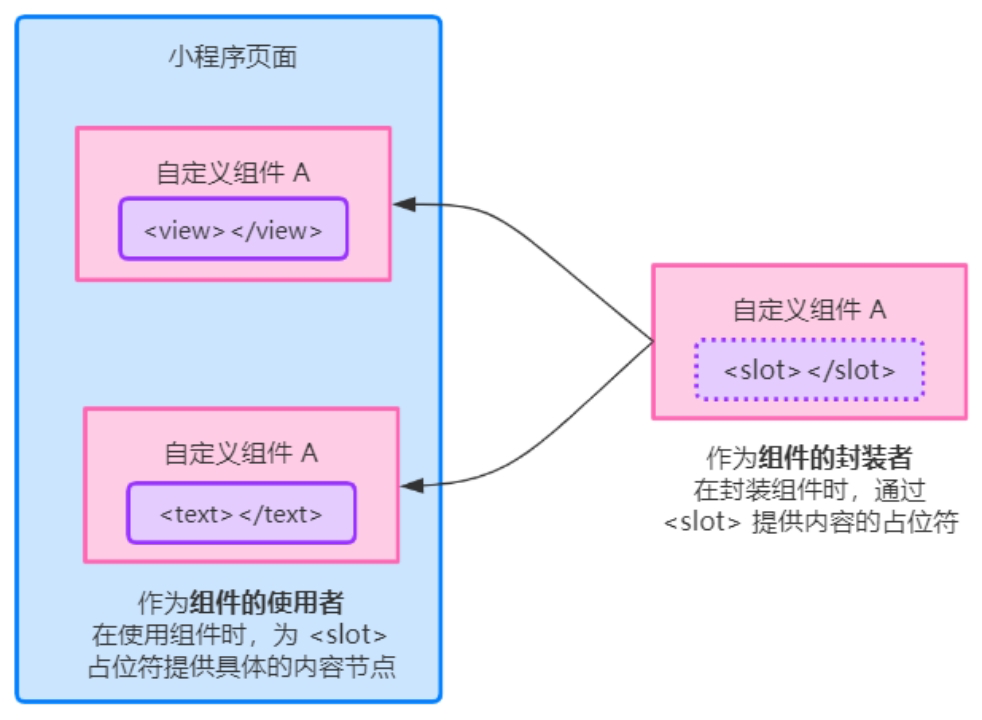


### 单个插槽

> 在小程序中，默认每个自定义组件中只允许使用一个`<slot>`进行占位；
>
> ```html
> <!-- <MyComponent> 自定义组件 -->
> <view>
>   <!-- 对于不确定的内容，可以使用 <slot> 标签占位，具体内容由组件的使用者决定 -->
>   <slot></slot>
> </view>
> ```
>
> ```html
> <!-- 自定义组件的 使用者 -->
> <MyComponent>
>   <!-- 组件标签内的内容将会被展现在自定义组件中 <slot> 标签的位置 -->
>   <view>插入到 slot 插槽的内容</view>
> </MyComponent>
> ```


### 多个插槽

> 需要使用多个 slot 插槽时，可以在组件的 .js 文件中，通过配置`multipleSlots`字段开启；
>
> ```js
> // 自定义组件的 .js 文件
> Component({
>     options: {
>        multipleSlots: true // 开启多个插槽的支持
>     }
> })
> ```
>
> ```html
> <!-- <MyComponent> 自定义组件 -->
> <view>
>     <!-- 给 slot 组件指定对应的 name 属性 -->
>     <slot name="befor"></slot>
>     <view> ... </view>
>     <slot name="after"></slot>
> </view>
> ```
>
> ```html
> <!-- 自定义组件的 使用者 -->
> <MyComponent>
>     <view slot="befor">插入到 name="befor" 的slot 插槽的位置</view>
>     <view slot="after">插入到 name="after" 的slot 插槽的位置</view>
> </MyComponent>
> ```


## 共享( behaviors )

> `behaviors`是小程序中，用于实现组件间代码共享的特性，类似于 Vue 中的 mixins；

[^参考文档]:https://developers.weixin.qq.com/miniprogram/dev/framework/custom-component/behaviors.html


### 工作方式

> 每个 behavior 可以包含一组**属性、数据、生命周期函数和方法**；
>
> 组件引用它时，它的属性、数据和方法会被合并到组件中；
>
> 每个组件可以引用多个 behavior，behavior 也可以引用其它 behavior；


### 创建( Create )

> 通过`Behavior()`方法即可创建一个共享的 behavior 实例对象；
>
> ```js
> // /behaviors/my-behavior.js
> 
> // 引入其他 behavior
> const otherBehavior = require('/behaviors/other-behavior.js')
> 
> module.exports = Behavior({
>   behaviors: [otherBehavior], // 共享中可以引入其他共享
>   // 共享的 属性
>   properties: {
>     myBehaviorProperty: {
>       type: String,
>       value: ''
>     }
>   },
>   // 共享的 数据
>   data: {
>     myBehaviorData: {}
>   },
>   // 共享的 生命周期
>   lifetimes: {
>     attached: function(){},
>   },
>   methods: {
>     // 共享的 方法
>     myBehaviorMethod(){}
>   }
> })
> ```


### 导入使用

> 在组件中，使用`require()`方法导入需要的 behavior，挂载后即可访问 behavior 中的数据或方法；
>
> ```js
> // 在组件中使用 require() 导入
> const myBehavior = require('/behaviors/my-behavior.js')
> 
> Component({
>   behaviors: [myBehavior],
>   // 组件的其他节点...
> })
> ```


## 数据通信

> 不同组件和页面之间传递参数数据的方式；


### 自定义事件( Custom Event )

> 事件绑定用于**实现子向父传值，可以传递任何类型的数据**，类似于 Vue 中 的 $on 和 $emit；
>
> 语法：`this.triggerEvent('自定义事件名称', { /* 参数对象 */ })`；
>
> ```html
> <!-- 父组件 .wxml 中，写入 自定义事件名称 和 对应的事件回调 -->
> <MyComponent bind:custom="customEventHandler"></MyComponent>
> <!-- bind 的另一种写法 -->
> <MyComponent bindcustom="customEventHandler"></MyComponent>
> ```
>
> [^custom]:自定义事件名称，自行命名；
> [^customEventHandler]:触发该自定义事件的回调函数，自行命名；
>
> ```js
> // 父组件的 .js 文件中，声明 回调函数
> Page({
>   // custom 的自定义事件回调
>   customEventHandler(e) {
>     console.log(e)
>     console.log(e.detail) // 可以在 e.detail 中拿到传递的事件参数
>   }
> })
> ```
>
> ```html
> <!-- 子组件 .wxml 中，点击按钮发送 触发自定事件  -->
> <button type="primary" bindtap="trigger">自定义事件</button>
> ```
>
> ```js
> Component({
>   methods: {
>     // 点击按钮触发 自定义事件 ，向父组件传递参数
>     trigger() {
>       this.triggerEvent('custom', {
>         name: 'Kein',
>         gender: 'Male',
>         age: 23
>       })
>     }
>   }
> })
> ```


### 组件实例( Instance )

> 在父组件里调用`this.selectComponent("id或class选择器")`，获取**子组件的实例对象**；
>
> 从而直接访问子组件的任意数据和方法；
>
> ```html
> <MyComponent id="child"></MyComponent>
> ```
>
> ```js
> // MyComponent 组件的 .js
> Component({
>     data: {
>        count: 5
>     }
> })
> ```
>
> ```js
> // 父组件 .js
> Page({
>     onReady() {
>        const table = this.selectComponent('#child') // 通过 元素选择器 获取子组件实例
>        // 使用 table 上的 setData() 方法，改变 count 的值
>        table.setData({
>          count: table.data.count + 10
>        })
>        console.log(table.data.count) // count = 15
>     }
> })
> ```
>
> 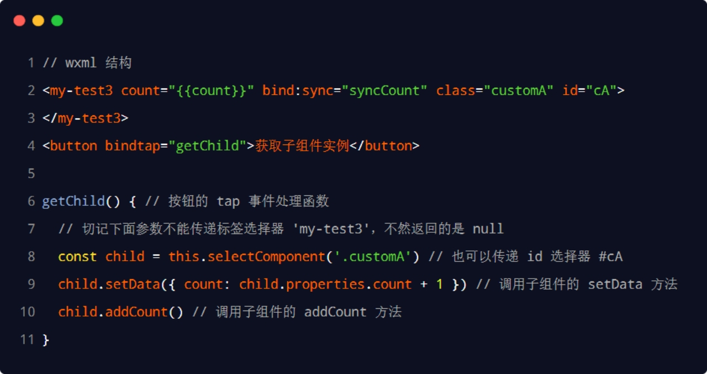


### 全局数据共享( Mobx )

> 全局数据共享`状态管理`是为了**解决组件之间数据共享**的问题；
>
> ```shell
> # 在小程序中，可使用 mobx-miniprogram 配合 mobx-miniprogram-bindings 实现全局数据共享
> # mobx-miniprogram 用来创建 Store 实例对象
> # mobx-miniprogram-bindings 用来把 Store 中的共享数据或方法，绑定到组件或页面中使用
> 
> npm install mobx-miniprogram mobx-miniprogram-bindings --save
> ```
>
> [^Focus]:新的 npm 依赖包安装完毕之后，要删除 miniprogram_npm 目录后，重新构建 npm 依赖；


#### 创建实例

> 创建 MobX 的 Store 实例；
>
> ```js
> // 项目/store/index.js
> 
> // 使用Mobx 创建可观测的 store 实例
> 
> import { observable, action, values } from 'mobx-miniprogram'
> 
> export const store = observable({
>   // 数据字段
>   num_a: 1,
>   num_b: 0,
> 
>   // 计算属性
>   get sum() {
>     console.log(this)
>     return this.num_a + this.num_b
>   },
> 
>   // action 操作，用来修改 store 中的数据
>   updateA: action(function(value) {
>     this.num_a += value
>   }),
>   updateB: action(function(value) {
>     this.num_b += value
>   })
> })
> ```

[^Focus]:action 里的方法不能写成箭头函数，要用`function`声明；


#### 绑定实例

> 将 store 中的成员绑定到页面或者组件中；


##### 绑定到页面中

> 将 store 中的成员绑定到页面中；
>
> ```js
> // 引入 store
> import { createStoreBindings } from 'mobx-miniprogram-bindings'
> import { store } from '../../store/index'
> 
> Page({
>     // 生命周期函数-页面加载
>     onLoad() {
>        this.storeBindings = createStoreBindings(this, {
>          store,
>          fields: ['num_a', 'num_b', 'sum'], // 指定要绑定的字段数据
>          actions: ['updateA', 'updateB'] // 指定要绑定的方法
>        })
>     },
>     // 生命周期函数-页面卸载
>     onUnload() {
>        this.storeBindings.destroyStoreBindings() // 页面卸载时，摧毁 store 的绑定
>     }
> })
> ```


##### 绑定到组件中

> 将 store 中的成员绑定到组件中；
>
> ```js
> // 引入 store
> import { storeBindingsBehavior } from 'mobx-miniprogram-bindings'
> import { store } from '../../store/index'
> 
> Component({
>   behaviors: [storeBindingsBehavior], // 在 共享 中绑定
>   storeBindings: {
>     store,
>     fields: {
>       // 以下 3 种绑定数据字段的方法都可以
>       num_a: () => store.num_a,
>       num_b: (store) => store.num_b,
>       sum: 'sum'
>     },
>     actions: {
>       updateA: 'updateA'
>     }
>   },
> })
> ```


#### 使用实例

> 在页面或者组件中使用 store 中的成员；


##### 页面中使用

> 在页面上使用 store 中的数据；
>
> ```html
> <!-- 页面的 .wxml 结构 -->
> <view>
>     <view>
>        <text>{{ num_a }}</text>
>        <button type="primary" data-numer="{{ 1 }}" bindtap="actionHandler">num_a + 1</button>
>     </view>
>     <view>
>        <text>{{ num_b }}</text>
>        <button type="primary" data-numer="{{ -1 }}" bindtap="actionHandler">num_a - 1</button>
>     </view>
>     <view>{{ sum }}</view>
> </view>
> ```
>
> ```js
> // 页面的 .js 中的回调函数
> Page({
>     // 在页面中使用 action 操作 store 中的数据，按钮的点击回调
>     actionHandler(e) {
>        const { currentTarget: {dataset: { numer }}} = e // 解构出 传递的参数
>        this.updateA(numer)
>     }
> })
> ```


##### 组件中使用

> 在组件上使用 store 中的数据；
>
> ```html
> <!-- 组件的 .wxml 结构 -->
> <view>
>   <view>
>     <text>{{ num_a }}</text>
>     <button type="primary" data-numer="{{ 1 }}" bindtap="actionHandler">num_a + 1</button>
>   </view>
>   <view>
>     <text>{{ num_b }}</text>
>     <button type="primary" data-numer="{{ -1 }}" bindtap="actionHandler">num_a - 1</button>
>   </view>
>   <view>{{ sum }}</view>
> </view>
> ```
>
> ```js
> // 组件的 .js 中的回调函数
> Component({
>   methods: {
>     actionHandler(e) {
>       const { currentTarget: {dataset: { numer }}} = e // 解构出 传递的参数
>       this.updateA(numer)
>     }
>   }
> })
> ```


## 分包

> 指把一个完整的小程序项目，按照需求划分为不同的子包；
>
> 在构建时打包成不同的分包，用户在使用时按需进行加载；
>
> 可以优化小程序首次启动的下载时间，在多团队共同开发时可以更好的解耦协作；
>
> 小程序项目中所有的页面和资源都被打包到了一起；
>
> 导致整个项目体积过大，影响小程序首次启动的下载时间；
>
> 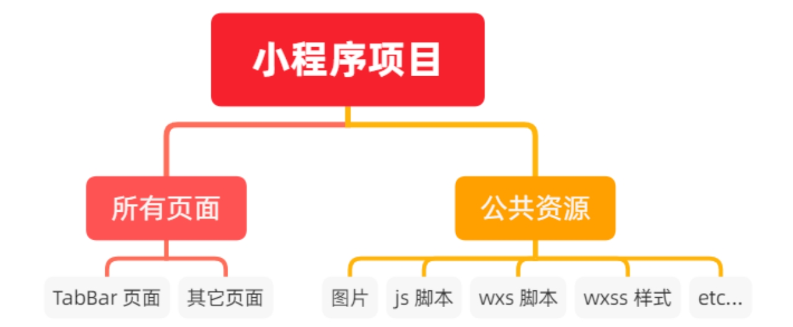


### 分包

> 分包后，小程序项目由 1 个主包 + 多个分包组成；
>
> **主包**：一般只包含项目的**启动页**面或 TabBar 页面、以及所有分包都需要用到的一些公共资源；
>
> **分包**：只包含和当前分包有关的页面和私有资源；
>
> 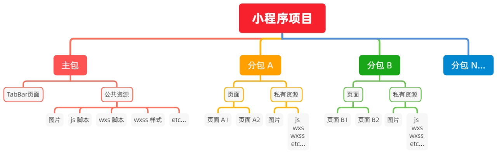


#### 加载规则

> 在小程序启动时，**默认会下载主包并启动主包内页面**，**tabBar 页面需要放到主包中**；
>
> 当用户进入分包内某个页面时，客户端会把对应分包下载下来，下载完成后再进行展示；
>
> 非 tabBar 页面可以按照功能的不同，划分为不同的分包之后，进行按需下载；


#### 体积限制

> 小程序分包的大小有以下两个限制：
>
> 1. 整个小程序所有包的大小不超过 16M（主包 + 所有分包）；
> 2. 单个分包/主包大小不能超过 2M；


#### 配置方法

> 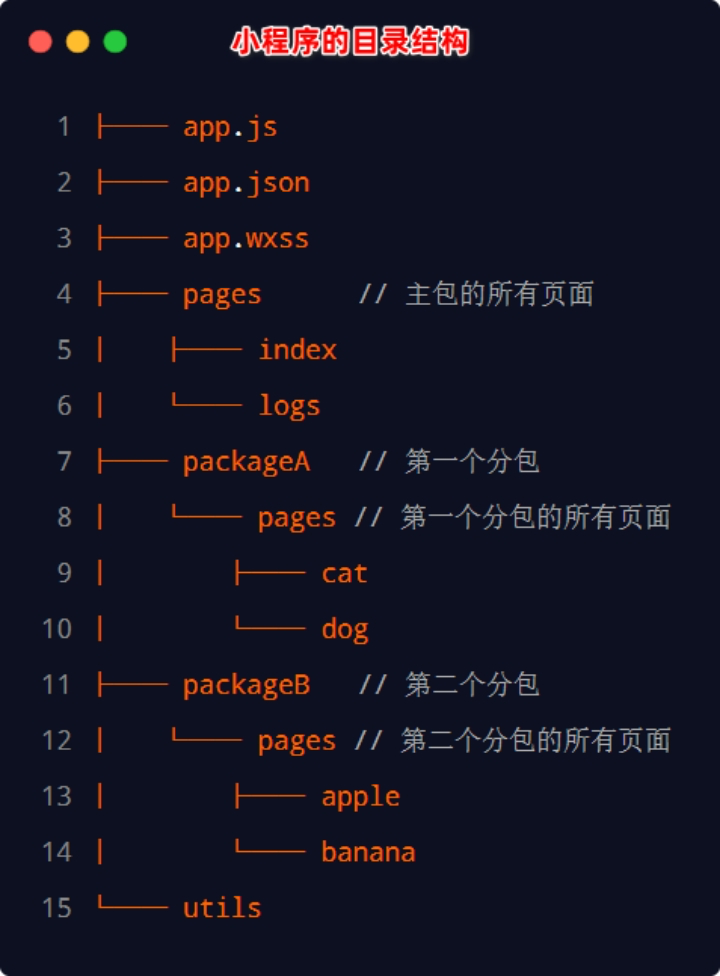
>
> 在小程序的 app.json 文件中声明`subpackages`字段，声明分包结构；
>
> 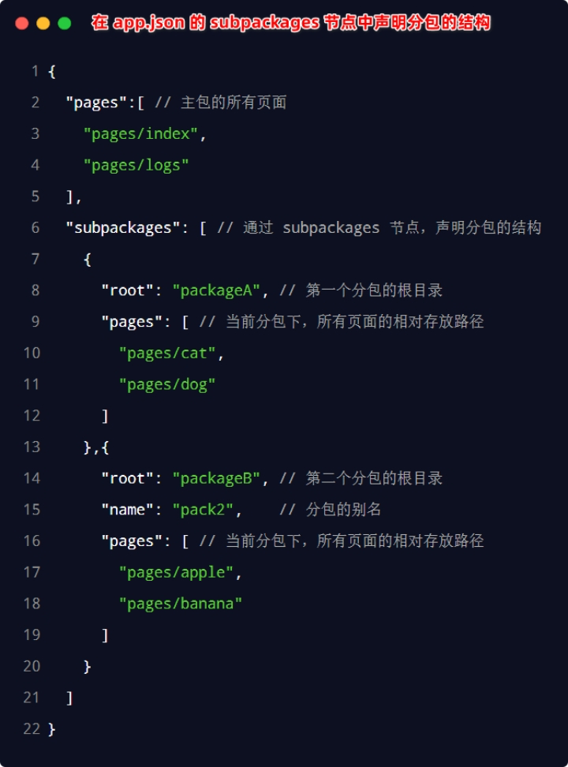


#### 打包原则

> 1. 小程序会按 app.json 文件中`subpackages`字段的配置进行分包，`subpackages`之外的目录将被打包到主包中；
> 2. 主包也可以有自己的 pages（即最外层的 pages 字段）；
> 3. tabBar 页面必须在主包内；
> 4. 分包之间不能互相嵌套；


#### 引用原则

> 1. 主包无法引用分包内的私有资源；
> 2. 分包之间不能相互引用私有资源；
> 3. 分包可以引用主包内的公共资源；


### 独立分包

> 独立分包本质上也是分包，只不过它比较特殊，**可以独立于主包和其他分包而单独运行**；
>
> 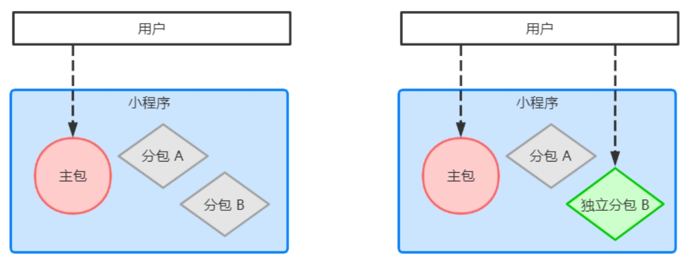


#### 区别

> 最主要的区别：**是否依赖于主包才能运行**；
>
> 普通分包必须依赖于主包才能运行；
>
> 独立分包可以在不下载主包的情况下，独立运行；


#### 应用场景

> 将某些具有一定**功能独立性的页面**配置到独立分包中；
>
> 独立分包不依赖主包即可运行，可以很大程度上提升分包页面的启动速度；

[^Tip]:一个小程序中可以有多个独立分包；


#### 配置方法

> 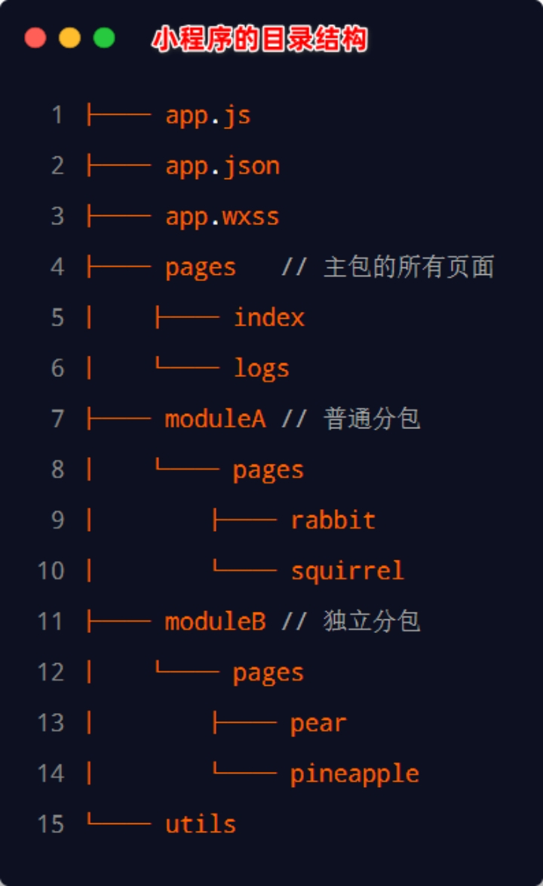
>
> 再普通分包的节点对象中，声明一个`independent`属性字段，并且值为`true`，则该分包为独立分包；
>
> 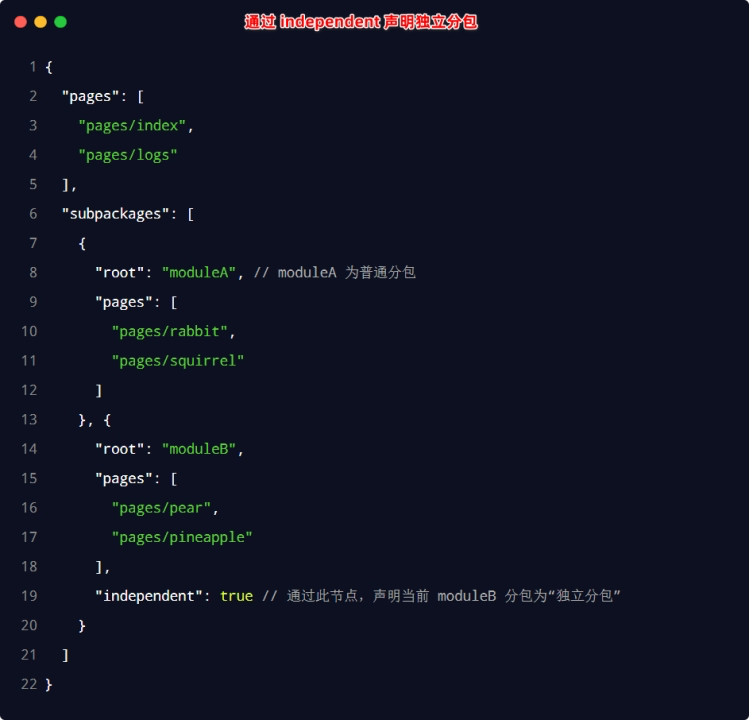


#### 引用原则

> **独立分包和普通分包以及主包之间，是相互隔绝的，不能相互引用彼此的资源**；
>
> 1. 主包无法引用独立分包内的私有资源；
> 2. 独立分包之间，不能相互引用私有资源；
> 3. 独立分包和普通分包之间，不能相互引用私有资源；
> 4. **独立分包不能引用主包内的公共资源**；


### 分包预下载

> 在进入小程序的某个页面时，由框架自动预下载可能需要的分包，从而提升进入后续分包页面时的启动速度；
>
> 预下载分包的行为，会在进入指定的页面时触发；
>
> 在 app.json 文件中，使用`preloadRule`节点定义分包的预下载规则；
>
> 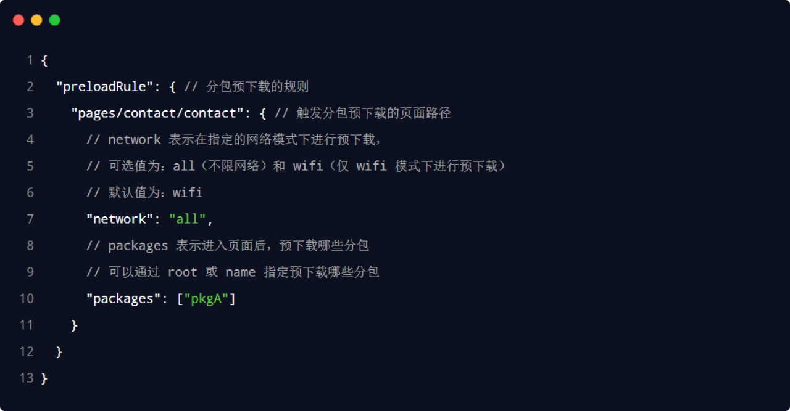

[^Focus]:同一个分包中的页面享有共同的预下载大小限额 2M；

