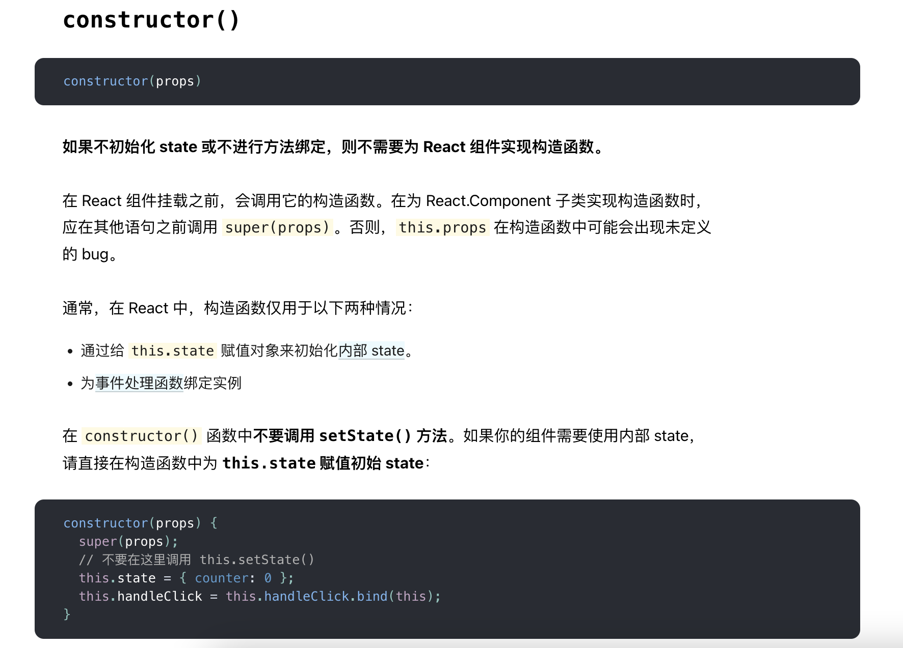
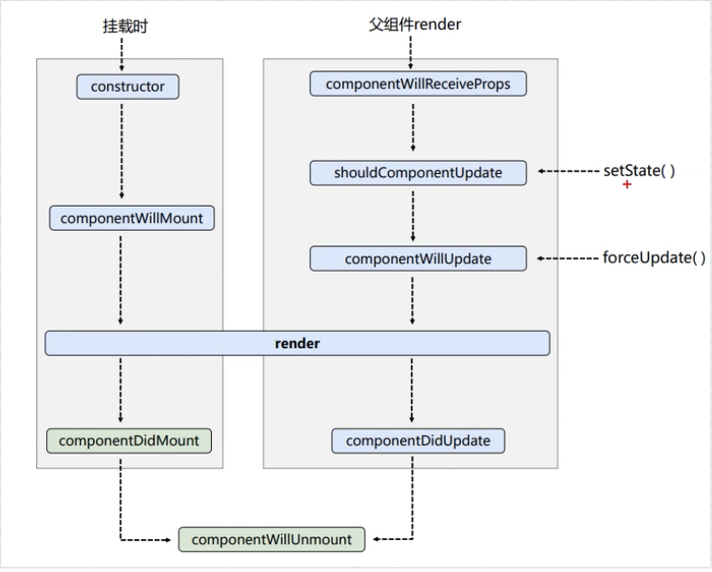
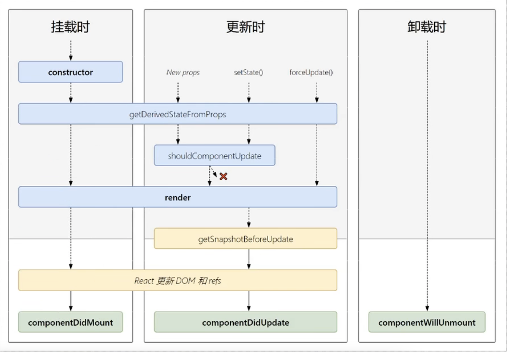
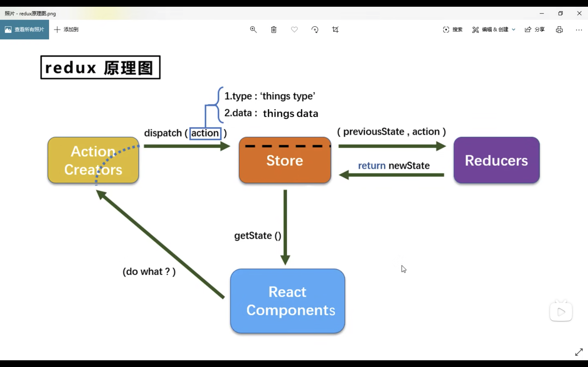
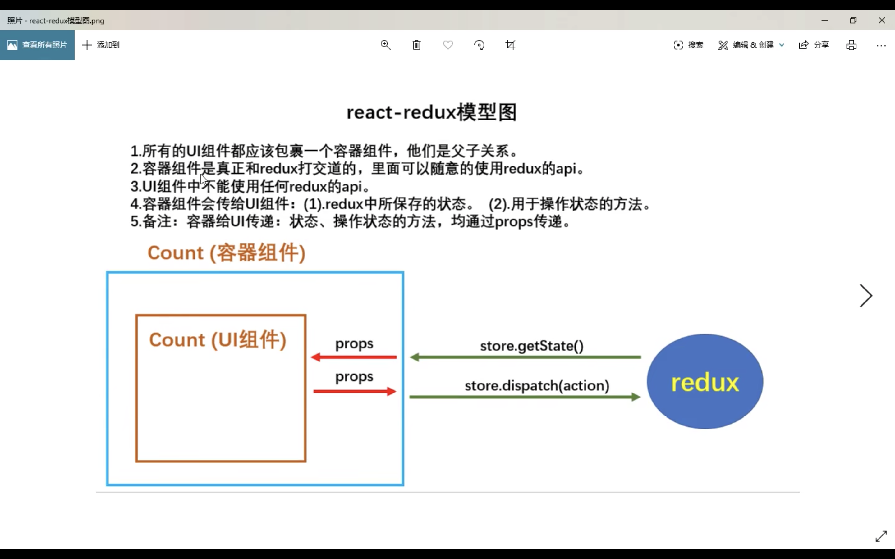

# React ?

[React Chinese Website](https://react.docschina.org)

用于构建**用户界面**的 JavaScript 库，将**数据**渲染为**HTML视图**的开源库，由 Facebook 开发

1. **组件化**开发，**声明式编码**，提高效率和复用率
2. 利用`React Native`可以进行移动端开发
3. `VDOM`+`Diffing`，尽量减少与真实 DOM 的交互


### 虚拟`DOM`

React 的优势就在于不会直接操作**真实 DOM**，性能更好

**虚拟 DOM**本质是一个**对象**

**虚拟 DOM**最终会被 React 转化成真实的 DOM，呈现在页面上

```jsx
// 虚拟 DOM
const vDom = <h1>Hello React</h1>；
console.log(vDom instanceof Obiect) // true
```


### JSX

> 全称`JavaScript XML`；
>
> 是 React 定义的一种类似 XML 的 JavaScript 扩展语法；
>
> 本质是`React.createElement()`的语法糖；
>
> 用来**简化创建虚拟 DOM **；


#### 语法( Grammar )

> 1. 定义虚拟 DOM 时，不需要加`""`引号；
>
> 2. 混入 JavaScript 语法要写在`{}`大括号中；
>
> 3. 样式的类名要用`className`，不能用`class`[^Reason]；
>
> 4. 标签内联样式要用`style={{ key: value }}`的形式；
>
> 5. 虚拟 DOM 只能有一个**根标签**；
>
> 6. 标签必须闭合；
>
> 7. 自定义标签；
>
> > 首字母小写，转为 html 标签元素，没有则报错；
> >
> > 首字母大写，寻找对应的**组件**，若没有定义，则报错；
>
> ```jsx
> const tagText = 'Hello JSX';
> const tagId = 'demo';
> // 创建虚拟 DOM；
> const vDom = (
>   <div>
>     <h2 className="title" id={tagId}>{tagText}</h2>
>     <p style={{color:'orange',fontSize:'16px'}}>Learning</p>
>     <input type="text"/>
>     <grade>A+</grade>
>   </div>
> )
> ```

[^Reason]: 避免和 ES6 中类`class`的关键词产生冲突，虚拟 DOM 实质上是对象；


## 组件( Component )

> ```html
> <body>
>     <!-- 准备好一个容器 -->
>     <div id="demo"></div>
> 
>     <!-- 引入 react 核心库 -->
>     <script src="../cdn-js/react.development.js"></script>
>     <!-- 引入 react-dom 支持操作 DOM -->
>     <script src="../cdn-js/react-dom.development.js"></script>
>     <!-- 引入 babel将 jsx 转换为 js -->
>     <script src="https://unpkg.com/@babel/standalone/babel.min.js"></script>
> 
>     <!-- type 为 babel，表示写的是 jsx 语法，并且让 babel 去编译解析 -->
>     <script type="text/babel">
>    // 使用 jsx 语法创建虚拟 DOM；
>    // 此处不需要加引号，因为是 jsx 语法；
>    const vDom = <h1>Hello React</h1>
>    // 渲染虚拟 DOM 到页面；
>    ReactDOM.render(vDom,document.getElementById('demo'))
>     </script>
> </body>
> ```
>
> 使用 React 提供的`createElement`方法创建**虚拟DOM**；
>
> ```html
> <!-- 不使用 jsx 创建虚拟 DOM -->
> <script type="text/javascript">
>     const vDom = React.createElement('h1', {
>        id: 'title'
>     }, 'Hello React')
>     ReactDOM.render(vDom, document.getElementById('demo'))
> </script>
> ```


### 类型

> 在 React 中有**函数组件**和**类式组件**；


#### 函数式( Function )

> 编译渲染流程
>
> 1. React 解析组件标签，找到`FunComponent`组件；
> 2. 发现是函数式组件，随即调用函数；
> 3. 将函数返回的 VDOM 转为 TDOM ，呈现在页面上；
>   
>   ```jsx
> // 创建函数式组件；
> function FunComponent() {
>   // this 是 undefined，因为 babel 编译后开启了严格模式；
>   // 全局下的 this 不指向 window，而是 undefined；
>   console.log(this);
>   return <h2>我是函数式组件</h2>
> }
> ReactDOM.render(
>   // 书写组件标签，首字母必须大写；
>   <FunComponent/>,
>   document.getElementById('demo')
> )
>   ```


#### 类式( Class )

> 编译渲染流程
>
> 1. React 解析组件标签，找到`ClassComponent`组件；
> 2. 发现是类式组件，随即使用 new 创建实例对象；
> 3. 通过实例找到原型对象上的 render 方法；
> 4. 将 render 方法返回的 VDOM 转为 TDOM ，呈现在页面上；
> ```jsx
> // 创建类式组件；
> class ClassComponent extends React.Component {
>   // render 在 ClassComponent 的原型对象上，供实例对象使用；
>   render(){
>     // render 中的 this 指向 ClassComponent 组件实例对象；
>     console.log(this);
>     return <h2>我是类式组件</h2>
>   }
> }
> ReactDOM.render(
>   // 书写组件标签，首字母必须大写；
>   <ClassComponent/>,
>   document.getElementById('demo')
> )


### 标签

> 组件标签可以**双标签**，也可以**单标签**；
>
> ```jsx
> // 单标签
> <MyComponent />
> 
> // 双标签
> <MyComponent>内容</MyComponent>
> 
> // 如果是双标签，组件标签之间的内容会被当作属性 props.children 传递给自组件
> ```


### 简写

> 利用类的赋值语句写法；
>
> ```jsx
> class Weather extends React.Component {
>      render() {
>        // 读取 state 中的属性；
>        const { isHot } = this.state;
>        return (
>          <h2 onClick={this.changeWeather}>今天的天气{isHot ? "炎热" : "寒冷"}</h2>
>        );
>      }
>      state = {
>        isHot: false
>      }
>      changeWeather = () => {
>        // 箭头函数，固定 this 的指向不会改变；
>        const isHot = this.state.isHot
>        this.setState({
>          isHot: !isHot
>        })
>      }
> }
> ReactDOM.render(<Weather />, document.getElementById("demo"));
> ```


### 卸载

> ```jsx
> // 创建类式组件；
> class ClassComponent extends React.Component {
>     // 卸载组件的方法
>     death = () => {
>        ReactDOM.unmountComponentAtNode(document.getElementById('demo'))
>     }
>     render(){
>        return <h2>我是类式组件</h2>
>     }
> }
> ReactDOM.render(<ClassComponent/>, document.getElementById('demo'))
> ```


### constructor

> 在 React 的类式组件中，constructor 可以不写，也可以写，区别在读取 props 的方式；
>
> 
>
> ```jsx
> class Weather extends React.Component {
>   constructor(props) {
>     super(props)
>     this.haveDemo = this.changeWeather.bind(this)
>     // 当需要在 constructor 中通过实例对象读取 props 属性
>     // 则需要给 constructor()、super() 传递 props ;
>     console.log(this.props)
>   }
>   render() {
>     return ()
>   }
> }
> ReactDOM.render(<Weather />, document.getElementById("demo"))
> ```

[^Focus]: `constructor`尽量不用写；


### 事件绑定( event )

> ```jsx
> class Weather extends React.Component {
>   constructor(props) {
>     super(props)
>     this.state = {
>       isHot: false,
>     }
>     // 改变 changeWeather() 的指向问题；
>     // 利用 bind 改变 this 指向 Weather ，生成一个新函数，复制给 this.haveDemo ；
>     this.haveDemo = this.changeWeather.bind(this)
>   }
>   render() {
>     // 读取 state 中的属性；
>     const { isHot } = this.state;
>     return (
>       <h2 onClick={this.haveDemo}>今天的天气{isHot ? "炎热" : "寒冷"}</h2>
>     );
>   }
>   changeWeather() {
>     // changeWeather() 方法在 Weather 的原型对象上，供实例对象使用；
>     // changeWeather() 此时被 <h2> 作为点击的回调函数直接调用，而不是被实例对象使用；
>     // 类中默认开启了局部的严格模式，所以此处 this 指向 undefined ；
>     console.log(this)
>     // 需要通过 setState 改变状态（state）中的数据；
>     // 且是一种合并更新，不是替换；
>     const isHot = this.state.isHot
>     this.setState({
>       isHot: !isHot
>     })
>   }
> }
> ReactDOM.render(<Weather />, document.getElementById("demo"));
> ```


## 数据( state )

> `state`是 React **组件实例对象**的 3 大核心属性之一；


### state

> 用来存储响应式数据；
>
> ```jsx
>class Weather extends React.Component {
>     constructor(props) {
>        super(props)
>        // state 是组件实例对象的 3 大核心属性之一；
>        // 初始化 state ；
>        this.state = {
>          isHot: false
>        }
>      }
>      render(){
>        // 读取 state 中的属性；
>        const {isHot} = this.state;
>        return <h2>今天的天气{isHot? '炎热':'寒冷'}</h2>
>      }
>    }
>    ReactDOM.render(<Weather/>, document.getElementById('demo'))
> ```

[^Focus]: `state`中的数据不能直接更改，需要通过 `this.setState`，否则视图不会更新；


### setState()

> React 中是单向数据流；
>
> 更新 state 中的数据，需要通过`this.setState()`方法去改变数据，才会引起页面的更新；

[^Focus]:state 数据的改变是**异步**的，获取最新数据可以在`setState`方法的第二个回调函数中获取；


#### 对象式

> `this.setState(stateObject, callback)`；
>
> [^stateObject]:为 state 中发生改变的属性的对象；
> [^callback]:**可选参数**，回调函数，在状态、页面更新完毕（`render()`调用后）才被执行；
>
> ```jsx
> this.setState({
>      isHot: true
> }, () => {
>      console.log(this.state.isHot) // true
> })
> 
> // 改变状态需要一个过程，如果需要实时获取状态的更新数据，在 setState() 传递第二个回调函数参数，获取最新状态；
> console.log(this.state.isHot) // false
> ```


#### 函数式

> `this.setState(updater, callback)`；
>
> [^updater]:为返回 发生改变的属性的对象 的函数，可以接收到 state、props ；
> [^callback]:**可选参数**，回调函数，在状态、页面更新完毕（`render()`调用后）才被执行；
>
> ```js
> this.setState((state, props) => {
>     return {
>        isHot: true,
>        count: state.count + 1
>     }
> }, () => {
>     console.log('callback')
> })
> ```

[^Focus]: 更新复杂`state`的时候必须传给它一个全新的对象，而不是复制了它引用地址再修改的对象；


## 属性( props )

> `props`是 React **组件实例对象**的 3 大核心属性之一；
>
> 给组件传递外界的数据，在组件标签中通过书写标签属性传递；
>
> ```jsx
>class Weather extends React.Component {
>  render(){
>     // 从 props 中解构属性
>        let {name, gender, age} = this.props
>        return (
>          <ul>
>            <li>{name}</li>
>            <li>{gender}</li>
>            <li>{age}</li>
>          </ul>
>        )
>     }
>    }
>    // 外界数据
> const person = {
>  name: 'LovelyKein',
>  gender: 'Male',
>     age: '22'
>    }
>    // 给组件 Weather 传递属性
> ReactDOM.render(<Weather name={person.name} gender={person.gender} age={person.age}/>,
>                 document.getElementById('demo'))
> 
>    // 批量传递属性
> // 要求：传递的属性名和组件中使用的属性名要一致！
> ReactDOM.render(<Weather {...person} />, document.getElementById('demo'))
> ```

[^Focus]:`props`属性是**只读**的，修改会报错，在内容渲染之后修改 props ，页面不会更新视图；


### 限制属性

> ```jsx
> class Person extends React.Component {
> render(){
>  // 从 props 中解构属性
>  let {name, gender, age} = this.props
>  return (
>    <ul>
>      <li>{name}</li>
>      <li>{gender}</li>
>      <li>{age}</li>
>    </ul>
>  )
> }
> // 对 props 进行 类型、必要性 的限制（类的 静态属性 写法）
> static propTypes = {
>  name: React.PropTypes.string.isRequired, // 字符串类型、必要性
>  gender: React.PropTypes.string, // 字符串类型
>  age: React.PropTypes.number // 数字类型
> }
> // 对 props 进行 默认值 的指定（类的 静态属性 写法）
> static defaultProps = {
>  gender: 'Male',
>  age: 22
> }
> }
> 
> const person = {
> name: 'LovelyKein',
> gender: 'Male',
> age: '22'
> }
> // 批量传递属性
> ReactDOM.render(<Person {...person} />, document.getElementById('demo'))
> ```

[^Focus]:15 版本为`React.PropTypes`，16 版本考虑性能原因，变为`PropTypes`，但要引入单独的 js 依赖文件；


### 函数组件使用 props

> 在 **函数式组件**中使用`props`属性；
>
> 函数接收的参数为父组件传递的 props 属性对象；
>
> ```jsx
> function Person(props) {
>   return(
>     <ul>
>       <li>姓名：{ props.name }</li>
>       <li>性别：{ props.gender }</li>
>       <li>年龄：{ props.age }</li>
>     </ul>
>   )
> }
> const person = {
>   name: 'LovelyKein',
>   gender: 'Male',
>   age: '22'
> }
> ReactDOM.render(<Person {...person} />, document.getElementById('demo'))
> ```


## 标签( ref )

> `ref`是 React **组件实例对象**的 3 大核心属性之一；
>
> 用来给元素加上标签，类似于原生 JavaScript 的`id`；

[^Focus]:不要过度使用 ref ；


### 字符串

> 字符串类型的`ref`标签；
>
> 可以通过`this.refs`来获取 HTML 元素；
>
> ```jsx
> class Button extends React.Component {
>   render(){
>     return (
>       <div>
>         <input ref="input" type="text" placeholder="输入" />
>         <button onClick={ this.clickButton }>点击展示输入框的文字</button>
>       </div>
>     )
>   }
>   // 类中的 赋值 写法
>   clickButton = () => {
>     // 从 this.refs 中解构出 input
>     const {input} = this.refs
>     alert(input.value)
>   }
> }
> ReactDOM.render(<Button/>, document.getElementById('demo'))
> ```

[^Focus]:字符串类型的`ref`存在降低效率的问题，在 17 版本后被遗弃；


### 回调函数

> 回调函数类型的`ref`标签；
>
> 可以通过`this`来获取 HTML 元素；
>
> ```jsx
> class Button extends React.Component {
>      // 回调函数类型的 ref 标签
>      render(){
>        return (
>          <div>
>            <input ref={ (node) => {this.input = node} } type="text" placeholder="输入" />
>            <button onClick={ this.clickButton }>点击展示输入框的文字</button>
>          </div>
>        )
>      }
>      clickButton = () => {
>        // 从 组件实例对象 中解构出 input 
>        const { input } = this
>        alert(input.value)
>      }
>      // 绑定式回调函数的 ref
>      saveInput = (node) => {
>        this.input = node
>      }
> }
> ReactDOM.render(<Button/>, document.getElementById('demo'))
> // 回调函数能接收到一个参数：是带有 ref 属性的当前的 HTML 元素节点；
> // React 在解析虚拟 DOM 时，调用 回调函数 ，将 值 赋值给 组件实例对象 上的一个自定义属性；
> 
> // 注意：
> // 1、 <input ref={ (node) => {this.input = node} } type="text" placeholder="输入" /> 内联回调函数
> // 组件初始化时，执行一次；状态变化导致组件更新时，执行两次；
> 
> // 2、 <input ref={ this.saveInput } type="text" placeholder="输入" /> 绑定回调函数
> // 组件初始化时，执行一次，之后不会再执行；
> ```


### React.createRef()

> 通过`React.createRef()`来创建 ref **标签容器**；
>
> ```jsx
> class Button extends React.Component {
>     // 通过 React.createRef() 来创建一个容器，用来存储被 ref 所标记的 HTML 元素节点
>     // 一个容器，只能储存一个元素节点
>     myInput = React.createRef()
>     render(){
>        return (
>          <div>
>            <input ref={ this.myInput } type="text" placeholder="输入" />
>            <button onClick={ this.clickButton }>点击展示输入框的文字</button>
>          </div>
>        )
>     }
>     clickButton = () => {
>        // 从 this.myInput 容器中获取 HTML 元素
>        console.log(this.myInput.current)
>     }
> }
> ReactDOM.render(<Button/>, document.getElementById('demo'))
> ```

[^Focus]:一个容器，只能储存一个元素节点；


## 事件( Event )

> 在 React 中绑定事件；


### on

> 通过`on`+`Click（事件触发类型）`来指定时间处理函数；
>
> **原因**：
>
> 1. React 使用的是自定义（合成）事件，而不是使用原生 JavaScript 的 DOM 事件，为了更好的兼容性；
> 2. React 的事件是通过**事件委托**方式处理的（委托给组件最外层的元素），为了更高效；
>
> ```jsx
> class Button extends React.Component {
>   // 通过 onClick 绑定事件
>   clickButton = () => {
>     alert(this.input.value)
>   }
>   render(){
>     return (
>       <div>
>         <input ref={ (node) => {this.input = node} } type="text" placeholder="输入" />
>         <button onClick={ this.clickButton }>点击展示输入框的文字</button>
>       </div>
>     )
>   }
> }
> ReactDOM.render(<Button/>, document.getElementById('demo'))
> ```

[^Focus]:**事件触发类型首字母要大写**，否则会和原生的事件产生冲突：原生 (onclick)，React (onClick)；


### event.target

> 可以通过`event.target`获取发生事件的 DOM 元素；
>
> ```jsx
> class Button extends React.Component {
>     // 通过 event 传递事件元对象
>     receiveTarget(event) {
>        alert(event.target.value)
>     }
>     render(){
>        return (
>          <div>
>            <input onBlur={this.receiveTarget} placeholder="失去焦点触发"></input>
>          </div>
>        )
>     }
> }
> ReactDOM.render(<Button/>, document.getElementById('demo'))
> ```


### 表单( Form )

> 给表单绑定 React 中的 state 状态数据；
>
> ```jsx
> class Login extends React.Component {
>      // 初始化状态 state
>      state = {
>        username: '',
>        password: ''
>      }
>      saveUsername = (e) => {
>        const usernameValue = e.target.value
>        // 通过 this.setState 更新 state 的数据
>        this.setState({
>          username: usernameValue
>        })
>        console.log(this.state.username)
>      }
>      savePassword = (e) => {
>        const passwordValue = e.target.value
>        // 通过 this.setState 更新 state 的数据
>        this.setState({
>          password: passwordValue
>        })
>        console.log(this.state.password)
>      }
>      // 表单提交的触发的回调函数
>      formSubmit = (e) => {
>        // 阻止标签的默认事件
>        e.preventDefault()
>        // 从 state 中解构出数据
>        const {username, password} = this.state
>        alert(`用户名：${username}，密码：${password}`)
>      }
>      render(){
>        return (
>          <form action="" onSubmit={this.formSubmit}>
>            { /* 给 用户名 输入框绑定 onChange 事件 */ }
>            用户名：<input type="text" name="username" onChange={this.saveUsername} />
>            { /* 给 密码 输入框绑定 onChange 事件 */ }
>            密码：<input type="password" name="password" onChange={this.savePassword} />
>            <button type="submit">提交</button>
>          </form>
>        )
>      }
> }
> ReactDOM.render(<Login/>, document.getElementById('demo'))
> ```
>
> 这样写，会导致每个表单元素都要有自己单独的回调函数，利用**高阶函数**简化；
>
> [^函数柯里化]:通过函数调用继续返回函数的方式，实现多次接受参数最后统一处理的函数编码形式；
>
> ```jsx
> class Login extends React.Component {
>     // 初始化状态 state
>     state = {
>        username: '',
>        password: ''
>     }
>     // 定义一个高阶函数 saveForm 来保存表单数据
>     saveForm = (type) => {
>        // 返回一个函数，这个函数会被当作返回值被 表单元素 触发使用
>        return (event) => {
>          this.setState({
>            // 注意：当读取的对象属性是一个变量的时候，要用 [] 包裹起来
>            [type]: event.target.value
>          })
>        }
>     }
>     render(){
>        return (
>          <form action="" onSubmit={this.formSubmit}>
>            用户名：<input type="text" name="username" onChange={this.saveForm('username')} />
>            密码：<input type="password" name="password" onChange={this.saveForm('password')} />
>            <button type="submit">提交</button>
>          </form>
>        )
>     }
> }
> ReactDOM.render(<Login/>, document.getElementById('demo'))
> ```
>
> 不使用**函数柯里化**同样可以实现简写；
>
> [^函数柯里化]:通过函数调用继续返回函数的方式，实现多次接受参数最后统一处理的函数编码形式；
>
> ```jsx
> class Login extends React.Component {
>      // 初始化状态 state
>      state = {
>        username: '',
>        password: ''
>      }
>      // 保存表单数据
>      saveForm = (type, event) => {
>        this.setState({
>          // 注意：当读取的对象属性是一个变量的时候，要用 [] 包裹起来
>          [type]: event.target.value
>        })
>      }
>      render(){
>        return (
>          <form action="" onSubmit={this.formSubmit}>
>            用户名：<input type="text" name="username" onChange={(event)=> {this.saveForm('username', event)}} />
>            密码：<input type="password" name="password" onChange={(event)=> {this.saveForm('password', event)}} />
>            <button type="submit">提交</button>
>          </form>
>        )
>      }
> }
> ReactDOM.render(<Login/>, document.getElementById('demo'))
> ```


## 生命周期( LifeCycle )

> 组件从创建到死亡会经历一些特定的阶段；
>
> React 组件中包含一系列**钩子函数（生命周期回调函数）**，会在特定的时刻调用；
>
> 


### 钩子函数

> ```jsx
> class Count extends React.Component {
>     // 初始化状态 state
>     state = {
>        count: 0
>     }
>     // 重要钩子，页面初始化渲染、更新渲染时调用；
>     render(){
>        return (
>          <div>
>            <h3>{this.state.count}</h3>
>            <button onClick={this.addCount}>点击 +1</button>
>            <button onClick={this.unMount}>卸载组件</button>
>          </div>
>        )
>     }
>     addCount = () => {
>        const { count } = this.state
>        this.setState({
>          count: count + 1
>        })
>     }
>     // 点击按钮卸载组件的回调函数
>     unMount = () => {
>        ReactDOM.unmountComponentAtNode(document.getElementById('demo'))
>     }
>     // 组件 将要挂载
>     componentWillMount() {
>        console.log('将要挂载')
>     }
>     // 重要钩子，组件 挂载完毕，一般在此时发送 ajax 请求；
>     componentDidMount() {
>        console.log('挂载完毕')
>     }
>     // 控制组件 是否更新 的 “阀门”
>     shouldComponentUpdate() {
>        console.log('是否可以更新')
>        // 需返回一个值， 为 true 时，组件才会往下运行更新，为 false 时不会更新，不书写该生命周期钩子时默认是 true
>        return true
>     }
>     // 组件 将要更新
>     componentWillUpdate() {
>        console.log('将要更新')
>     }
>     // 组件 更新完毕
>     componentDidUpdate() {
>        console.log('更新完毕')
>     }
>     // 重要钩子，组件 将要卸载，一般在此时清理定时器；
>     componentWillUnmount() {
>        console.log('将要卸载')
>     }
> }
> ReactDOM.render(<Count />, document.getElementById('demo'))
> ```


### forceUpdate

> 不受 `shouldComponentUpdate`**控制阀门**的影响，强制更新页面；
>
> ```jsx
> this.forceUpdate()
> // 会调用 componentWillUpdate 、 render 、 componentDidUpdate 三个生命周期函数
> ```


### 接收属性

> 组件**将要接受属性**时调用的生命周期函数；
>
> ```jsx
> class Son extends React.Component {
>     render() {
>        // 组件 将要接受传递的属性 时，只会在属性更新一次后执行，初始化时不会执行
>        componentWillReceiveProps(props) {
>          // 可以接受一个参数对象，保存了组件的所有属性
>          console.log(props)
>        }
>        // 接收 父组件传递的属性
>        return (
>          <div>
>            <h4>汽车品牌是：{this.props.carName}</h4>
>          </div>
>        )
>     }
> }
> class Father extends React.Component {
>     // 初始化状态 state
>     state = {
>        brand: '奔驰'
>     }
>     render(){
>        return (
>          <div>
>            <h3>父组件</h3>
>            <button onClick={this.changeCar}>更换车辆</button>
>            <h5>子组件</h5>
>            <Son carName={this.state.brand} />
>          </div>
>        )
>     }
>     changeCar = () => {
>        // 更新状态
>        this.setState({
>          brand: '法拉利'
>        })
>     }
> }
> ReactDOM.render(<Father />, document.getElementById('demo'))
> ```


### 新版周期

> 在 React 最新版中，丢弃了 `componentWillMount`、`componentWillReceiveProps`、`componentWillUpdate`；
>
> 因为这 3 个生命周期可能会在新版的**异步渲染**中出现错误；
>
> 如果一定要使用，加上`UNSAFE_`前缀；
>
> React 组件的生命周期可分成三个状态：
>
> * Mounting(挂载)：已插入真实 DOM；
> * Updating(更新)：正在被重新渲染；
> * Unmounting(卸载)：已移出真实 DOM；
>
> 
>
> ```jsx
> // 从属性中得到 派生状态；
> // 使用场景：任何时候 state 的值都来自于 props，本身的状态更新会失效；
> // 静态方法，只提供给 类 本身使用；
> // 谨慎使用，会造成代码冗余，难以维护；
> static getDerivedStateFromProps(props, state) {
>  console.log(props) // 来自外界传递的属性 props
>  console.log(state) // 组件本身的状态 state
>  // 需要返回一个状态对象，以提供给组件使用
>  return props
> }
> 
> 
> // 获取 在页面完成更新之前的快照（信息），再将数据传递给 componentDidUpdate 的第三个参数中；
> getSnapshotBeforeUpdate() {
>  // 需要返回一个 快照值，可以是任何信息；
>  return 'message'
> }
> ```


## Diffing 算法

> React 中的 diffing 算法，比较 虚拟DOM 树；
>
> [^Focus]:diffing 算法的最小比较单位是标签节点；


### key

> key 是**虚拟 DOM**对象的标识；
>
> 当 状态数据发生变化，React 会用**新数据**生成**新的 虚拟 DOM**；
>
> 接着进行**旧虚拟 DOM**与**新虚拟 DOM**的 `diff` 比较；
>
> key 值尽量使用**唯一且稳定**的值；


### 规则

> [^A]:新旧 **虚拟 DOM**中有 相同的 key；
>
> * 若虚拟 DOM 中的内容没变，则直接使用之前的**真实 DOM**；
>
> * 若内容发生改变，则生成新的真实 DOM，替换掉页面中之前的 真实 DOM；
>
> [^B]:新旧 **虚拟 DOM**中有 没有相同的 key；
>
> * 根据数据创建新的**真实 DOM**， 随后渲染到页面之中；


### 问题

> 用循环遍历中的 index 做为 key 值，可能会出现问题；
>
> * 若对数据进行**逆序增删**等破环顺序的操作：会产生没必要的真实 DOM 创建更新，降低效率；
> * 如果结构中含有输入类的 DOM， 会产生节点信息错乱的问题；


## 脚手架( cli )

> React 提供了一个用于创建 React 项目的脚手架库`create-react-app`；
>
> 整体技术架构为`react + webpack + es6 + eslint`；
>
> 使用脚手架的优势：提高效率，模块化、组件化、工程化；


### 创建

> ```shell
> # 全局安装脚手架库
> npm install create-react-app --global
> # 进入项目存放文件目录，使用命令行创建项目
> create-react-app project-name
> ```


### 结构

> 脚手架会创建一个项目的工程目录；


#### public/index.html

> ```html
> <!DOCTYPE html>
> <html lang="en">
>     <head>
>        <meta charset="utf-8" />
>        <!-- %PUBLIC_URL% 代表 public 文件夹的路径 -->
>        <link rel="icon" href="%PUBLIC_URL%/favicon.ico" />
>        <!-- 开启理想视口，用于做移动端网页适配 -->
>        <meta name="viewport" content="width=device-width, initial-scale=1" />
>        <!-- 用于配置浏览器页签+地址栏的背景色（仅支持安卓手机浏览器） -->
>        <meta name="theme-color" content="#000000" />
>        <!-- 网站的描述 -->
>        <meta name="description" content="Web site created using create-react-app" />
>        <!-- 指定网页添加到手机主屏幕后的图标（Apple手机生效） -->
>        <link rel="apple-touch-icon" href="%PUBLIC_URL%/logo192.png" />
>        <!-- 应用加壳的配置文件 -->
>        <link rel="manifest" href="%PUBLIC_URL%/manifest.json" />
>        <title>React App</title>
>     </head>
>     <body>
>        <noscript>You need to enable JavaScript to run this app.</noscript>
>        <div id="root"></div>
>     </body>
> </html>
> 
> ```


#### src/index.js

> ```jsx
> // 引入 react 核心库
> import React from 'react';
> // 引入 ReactDOM，用作页面元素渲染
> import ReactDOM from 'react-dom/client';
> // 引入 App 组件
> import App from './App';
> import reportWebVitals from './reportWebVitals';
> // 获取根元素
> const root = ReactDOM.createRoot(document.getElementById('root'));
> // 渲染 App 组件
> root.render(
>     // React.StrictMode 开启严格模式，会检查代码的语法是否规范
>     <React.StrictMode>
>        <App />
>     </React.StrictMode>
> );
> 
> reportWebVitals();
> 
> ```


### 组件

> 在 React 脚手架中定义一个最简单的组件；
>
> 在 src 目录下，新建 components 文件夹，再在其下创建 Hello 文件夹，代表为 Hello 组件的文件夹；
>
> 在 Hello 组件下，创建组件的 逻辑操作jsx 和 样式css 文件；
>
> ```jsx
> // jsx 文件
> // 分别引入 核心库 和 ReactDOM
> import { Component } from "react";
> // 引入 组件样式文件
> import './hello.css'
> 
> // 组件内容
> export default class Hello extends Component {
>     render() {
>        return (
>          <h3 className="title">Hello React</h3>
>        )
>     }
> }
> 
> // 快速创建 jsx 文件基本结构
> // rcc 创建 类式组件 基本结构
> // rfc 创建 函数式组件 基本结构
> ```
>
> ```css
> /* 样式的 css 文件 */
> .title {
>     background-color: aquamarine;
>     height: 40px;
>     height: 100%;
>     color: #ffffff;
>     font-size: 20px;
>     line-height: 40px;
>     text-align: left;
>     padding-left: 20px;
>     box-sizing: border-box;
> }
> ```


### css 模块化

> 如果不模块化，会造成全局下相同类名的样式会被后面的覆盖掉；
>
> ```jsx
> // 1
> // 使用 less 或 scss 这种嵌套关系的样式，则不会产生冲突，因为父层级不一样；
> 
> 
> // 2
> // 模块化引入 样式文件
> // 1、模块化命名样式文件：加 .module
> // hello.module.css
> // 2、模块化引入样式文件
> // import hello from './hello.module.css'
> // 3、使用模块化类名
> // <h3 className={hello.title}>Hello React</h3>
> 
> 
> // 3
> // react.jss 第三方包  npm install react.jss
> 
> 
> // 4
> // styled-components
> ```


## 组件通信

> React 中是**单向数据流**，改变状态需要通过`this.setState()`；


### props

> 可以实现`父组件 <===> 子组件`组件的双向通信；
>
> ```shell
> # 在 React 脚手架中对 props 进行限制
> # 安装依赖
> npm install prop-types
> ```
>
> 在文件中引入依赖包；
>
> ```jsx
> import PropTypes from 'prop-types'
> ```
>
> 在组件中使用；
>
> [^Focus]:`proptypes`该属性提供给**类本身**使用，所以要加`static`前缀；
>
> ```jsx
> // 对接受的 props 属性进行类型、必要性的限制
> static propTypes = {
>   // 数据类型为 array 数组，且为必传项；
>   todoList: PropTypes.array.isRequired
> }
> 
> // 父 ==> 子：传递一个属性值；
> // 子 ==> 父： 传递一个回调函数，等待在子组件中使用；
> ```


### 发布订阅

> `PubSubJs`，适用于**任意组件间通信**；
>
> 一个用 JavaScript 编写的**基于主题**的 发布/订阅库；


#### 特点( Features )

* 无依赖；
* 同步解耦；
* ES3 兼容，能够在任何可以执行 JavaScript 的地方运行；
* AMD / CommonJS 模块支持；
* 不修改订阅者（jQuery 自定义事件修改订阅者）；
* 代码体积小，小于 1kb 的压缩；


#### 安装( Install )

> 引入模块包；
>
> ```javascript
> import PubSub from 'pubsub-js'
> 
> // 当为 CommonJS 模块标准时
> const PubSub = require('pubsub-js')
> ```


#### 使用( Use )

> ```javascript
> // 创建一个方法用来订阅主题；
> const subscriber = function (msg, data) {
>     console.log( msg, data )
> }
> // 订阅一个名为 TOPIC 的主题
> // token 为返回的令牌，以便能够取消订阅；
> const token = PubSub.subscribe('TOPIC', subscriber)
> 
> // 异步发布主题；
> PubSub.publish('TOPIC', 'hello world!')
> 
> // 同步发布主题，这在某些环境中更快，但是当一个主题触发新的主题时，会引起混乱，小心使用；
> PubSub.publishSync('TOPIC', 'hello world!')
> 
> // 根据 token 令牌取消一个具体的订阅
> PubSub.unsubscribe(token)
> 
> // 清除所有订阅
> PubSub.clearAllSubscriptions()
> ```


### Context

> 一种组件的通信方式，常用于`祖组件 ===> 后代组件`之间的通信；
>
> ```jsx
> import React, { Component } from "react";
> import './context.css'
> 
> // 创建 Context 对象
> const MyContext = React.createContext();
> const { Provider } = MyContext;
> 
> // 祖组件
> export default class Ancestor extends Component {
>     // 状态数据
>     state = {
>        person: {
>          name: "Kein",
>          gender: "Male",
>        },
>     };
> 
>     render() {
>        const { person } = this.state;
>        return (
>          <div className="Ancestor">
>            <h2>我是 Ancestor 组件</h2>
>            <span>名字：{person.name}</span>
>            <span>性别：{person.gender}</span>
>            {/* 用 Provider 标签包裹子组件，则后代组件都可以接收到 value 中的数据 */}
>            <Provider value={person}>
>              <Son person={person} />
>            </Provider>
>          </div>
>        );
>     }
> }
> 
> // 子组件
> class Son extends Component {
>     render() {
>        const { person } = this.props;
>        return (
>          <div className="Son">
>            <h2>我是 Son 组件</h2>
>            <span>名字：{person.name}</span>
>            <span>性别：{person.gender}</span>
>            <Descendant />
>          </div>
>        );
>     }
> }
> 
> // 后代组件
> class Descendant extends Component {
>     // 声明接收 Context
>     static contextType = MyContext;
> 
>     render() {
>        const { name, gender } = this.context;
>        return (
>          <div className="Descendant">
>            <h2>我是 Descendant 组件</h2>
>            <span>名字：{name}</span>
>            <span>性别：{gender}</span>
>          </div>
>        );
>     }
> }
> ```


## 代理( Proxy )

> 在 React 中发送 Ajax 网络请求；
>
> Ajax 网络请求存在**同源策略**，需要解决请求跨域的问题；


### package.json

> 在 package.json 文件中添加一个 `proxy` 选项，配置需要进行代理的目标服务器；
>
> ```json
>{
>   "proxy": :"http://localhost: 5000"
> }
>   
> // 优点：配置简单，前端的请求路径中不用加任何前缀；
> // 缺点：不能配置多个代理；
> // 特点：优先匹配前端资源，如果请求资源在前端中不存在，才会将请求转发给代理目标服务器
> ```

[^Tip]:如果请求的资源在前端存在，则不会转发到目标服务器，直接返回前端端口存在的资源；


### setupProxy.js

> 在 src 目录下新建`setupProxy.js`配置文件，在此文件中进行代理的配置；
>
> ```js
> // 在该文件中进行 网络请求 的 代理配置
> // 使用的模块规范是 CommonJs
> 
> // 此依赖包不用下载，react 脚手架中已经存在
> const { createProxyMiddleware } = require("http-proxy-middleware"); 
> 
> module.exports = function (app) {
>   app.use( // 可以传递多个参数，每一个参数都是一个 服务器代理
>     createProxyMiddleware("/proxyApi", { // 请求路径中有 /proxyApi 前缀，则触发该代理配置
>       target: "http://localhost:5000", // 请求转发的目标服务器
>       changeOrigin: true, // 控制是否改变 服务器收到的请求头中的 Host 值
>       pathRewrite: { "^/proxyApi": "" }, // 请求路径重写，因为 目标服务器中不存在 /proxyApi
>     }),
>     createProxyMiddleware("/proxyApi_2", { // 请求路径中有 /proxyApi_2 前缀，则触发该代理配置
>       target: "http://localhost:8800",
>       changeOrigin: true,
>       pathRewrite: { "^/proxyApi_2": "" },
>     })
>   );
> };
> ```


## Assist

> 在书写代码中需要注意的事项和小帮手；


### 单选框

> ```jsx
> // 单选框选中属性有两个 defaultChecked checked，类似的还有 defaultValue value
> 
> // 默认是否选中，只在第一次初始化时起作用，之后单选框的值发生也变化不会同步；
> <input type="radio" defaultChecked={true} />
> // 是否选中，需要搭配 onChange 值发生改变时的回调函数；
> <input type="radio" checked={true} onChange={this.handleChange} />
> ```


### 连续解构

> ```javascript
> const list = {
>     keys: {
>        left: 'A',
>        right: 'D'
>     },
>     mouse: {
>        clickLeft: 'mouse-left',
>        middle: 'mouse-middle',
>        clickRight: 'mouse-right'
>     }
> }
> 
> // 解构赋值
> const { keys } = list
> // 连续解构赋值
> const { keys:{ left } } = list // 'A'
> // 连续解构并且更改变量名 为 keyLeft
> const { keys:{ left:keyLeft } } = list // 'A'
> ```


## 路由( react-router )

> React 的一个插件库，专门用来实现`SPA`单页面应用；


### 原理

> React 的路由跳转原理是浏览器`BOM`对象的`history`属性；
>
> ```html
> <!DOCTYPE html>
> <html lang="en">
> 
>      <head>
>        <meta charset="UTF-8">
>        <meta http-equiv="X-UA-Compatible" content="IE=edge">
>        <meta name="viewport" content="width=device-width, initial-scale=1.0">
>        <script src="https://cdn.bootcss.com/history/4.7.2/history.js">
>        </script>
>        <title>Document</title>
>      </head>
> 
>      <body>
>        <div class="box">
>          <button class="btn" onclick="backUrl()">回退</button>
>          <button class="btn" onclick="forwardUrl()">前进</button>
>          <button class="btn" onclick="replaceUrl('/module')">替换路径</button>
>          <button class="btn" onclick="jumpToUrl('/login')">跳转路径</button>
>        </div>
>        <script>
>          let history = History.createBrowserHistory()
>          // 回退
>          function backUrl() {
>            history.goBack()
>          }
>          // 前进
>          function forwardUrl() {
>            history.goForward()
>          }
>          // 替换路径
>          function replaceUrl(path) {
>            history.replace(path)
>          }
>          // 跳转路径
>          function jumpToUrl(path) {
>            history.push(path)
>          }
> 
>          // 监听 history 中请求路径的变化
>          history.listen((location) => {
>            console.log('请求路径发生变化了', location)
>          })
>        </script>
>      </body>
> 
> </html>
> ```


### 安装

> react-router 有三个版本，`dom`、`native`、`anywhere`，此处下载的为`dom`版本；
>
> ```shell
> npm install react-router-dom
> # or
> yarn add react-router-dom
> ```


### 使用

> ```jsx
> import "./App.css";
> // 引入 react-router-dom
> import { Link, BrowserRouter, Route } from "react-router-dom";
> // 引入组件
> import Home from "./components/home/home";
> import About from "./components/about/about";
> 
> function App() {
>    return (
>        <div className="App">
>          <BrowserRouter>
>            {/* 编写路由链接：在 React 中，依靠 路由链接 实现组件之间的切换 */}
>            <div className="nav">
>              <Link className="link" to={"/home"}>Home</Link>
>              <Link className="link" to={"/about"}>About</Link>
>            </div>
>            <div className="display">
>              {/* 注册路由 */}
>              <Route path={"/home"} component={Home} />
>              <Route path={"/about"} component={About} />
>            </div>
>          </BrowserRouter>
>        </div>
>    );
> }
> 
> export default App;
> // 路由默认是 push 模式，会留下历史记录；
> // 开启 replace 模式，在 路由链接上书写 replace 属性；
> <Link replace className="link" to={"/home"}>Home</Link>
> ```

[^Focus]:相关联的`Link`和`Route`组件必须在相同的**路由链接`BrowserRouter`**中才会起作用；


### 点击高亮

> 实现点击哪个路由导航标签，就动态增加一个样式类名；
>
> <NavLink />
>
> ```jsx
> // 将 Link 更换成 NavLink
> <div className="nav">
>   <NavLink className="link" to={"/home"}>Home</NavLink>
>   <NavLink className="link" to={"/about"}>About</NavLink>
> </div>
> // NavLink 会默认给点击的 路由链接 增加一个 active 类名
> 
> // 如果想更换点击时的动态类名的名称
> // 在 路由链接 标签上 增加 activeClassName 属性
> <div className="nav">
>   <NavLink activeClassName="click" className="link" to={"/home"}>Home</NavLink>
>   <NavLink activeClassName="click" className="link" to={"/about"}>About</NavLink>
> </div>
> // 切换 路由链接 时， 会动态的增加 click 类名
> ```

[^important]:标签体内容是一个特殊的标签属性，可以由`this.props.children`来获取标签体内容；


### Switch

> 禁止 **路由链接`Route`**向下匹配，导致**一个路由链接展示多个组件内容**；
>
> ```jsx
> <BrowserRouter>
>      <div className="nav">
>        <NavLink activeClassName="click" className="link" to={"/home"}>Home</NavLink>
>        <NavLink activeClassName="click" className="link" to={"/about"}>About</NavLink>
>      </div>
>      <div className="display">
>        <Route path={"/home"} component={Home} />
>        {/* 该情况会导致 '/about' 路由链接下，同时显示 About、Home 组件的内容  */}
>        <Route path={"/about"} component={About} />
>        <Route path={"/about"} component={Home} />
>      </div>
> </BrowserRouter>
> ```
>
> 解决方法：引入`Switch`，将路由链接包裹，禁止一个路由链接匹配多个组件内容，提高代码性能和效率；
>
> ```jsx
> // 引入 Switch 依赖
> import { Switch } from "react-router-dom"
> ```
>
> ```jsx
> <BrowserRouter>
>      <div className="nav">
>        <NavLink activeClassName="click" className="link" to={"/home"}>Home</NavLink>
>        <NavLink activeClassName="click" className="link" to={"/about"}>About</NavLink>
>      </div>
>      <div className="display">
>        <Switch>
>          <Route path={"/home"} component={Home} />
>          <Route path={"/about"} component={About} />
>        </Switch>
>      </div>
> </BrowserRouter>
> ```


### 样式丢失

> 解决在类似`/admin/editor/`这样的多层级路由链接下刷新页面，外部引入的本地样式文件会样式丢失的问题；
>
> ```jsx
> // 方法一
> // 将 样式文件的引入地址 更换写成 绝对路径（文件在 public 下）
> './css/default.css' ==> '/css/default.css'
> 
> // 方法二
> // 将 BrowserRouter 更换成 HashRouter
> // 因为 # 号后面的路径都不会带给服务器；
> ```


### 匹配模式

> 在 React 的路由链接中有**模糊匹配**和**精准匹配**两个模式，默认是**模糊匹配**；
>
> ```jsx
> <BrowserRouter>
>     <div className="nav">
>        <NavLink activeClassName="click" className="link" to={"/home"}>Home</NavLink>
>        {/* 在模糊匹配下 '/about/metoo' 路径也会匹配到 About 组件 */}
>        <NavLink activeClassName="click" className="link" to={"/about/metoo"}>About</NavLink>
>     </div>
>     <div className="display">
>        <Switch>
>          <Route path={"/home"} component={Home} />
>          <Route path={"/about"} component={About} />
>        </Switch>
>     </div>
> </BrowserRouter>
> ```
>
> ```jsx
> // 开启精准匹配
> // 在 Route 路由组件上书写 exact 属性
> <Route exact path={"/about"} component={About} />
> ```

[^Focus]:**精准模式**要谨慎使用（**可能会导致无法匹配二级路由**），尽量在**模糊匹配**出现问题时再考虑使用；


### 重定向( Redirect )

> 当路由链接没有匹配的组件内容时使用；
>
> ```jsx
> // 引入 重定向内部组件 Redirect
> import { Redirect } from "react-router-dom";
> 
> <Route path={"/home"} component={Home} />
> <Route path={"/about"} component={About} />
> <Redirect to={'/home'} />
> // 当没有匹配的路由时，页面会重定向到 '/home' 路由地址
> ```


### 嵌套路由

> 在一个路由组件中还存在着嵌套的二级路由；
>
> ```jsx
> // 在 '/about' 组件内容中，存在这二级路由
> import React, { Component } from "react";
> 
> import { BrowserRouter, Switch, NavLink, Route, Redirect } from "react-router-dom";
> 
> import News from "./components/news/news";
> import Message from "./components/message/message";
> 
> // 引入样式文件
> import "./about.css";
> 
> export default class About extends Component {
>     render() {
>        return (
>          <div>
>            {/* 用 BrowserRouter 包裹 NavLink、Route 组件 */}
>            <BrowserRouter>
>              <div className="about-link">
>                <NavLink to={'/about/message'} className="link float">Message</NavLink>
>                <NavLink to={'/about/news'} className="link float">News</NavLink>
>              </div>
>              <div className="about-content">
>                <Switch>
>                  <Route path={'/about/message'} component={Message} />
>                  <Route path={'/about/news'} component={News} />
>                  <Redirect to={'/about/message'} />
>                </Switch>
>              </div>
>            </BrowserRouter>
>          </div>
>        )
>     }
> }
> // 路由的匹配按照注册路由的顺序，由外到里
> ```
>
> **二级路由 的 路由链接 一定要包含 一级路由 的 路由链接**；
> **因为 模糊匹配`/about/message`先会匹配到一级路由里的`/about`组件内容**；
> **再会匹配到`/about/message`的组件内容，实现二级路由的嵌套**；


### 路由传参

> 路由跳转的同时携带参数；


#### params

> 在**路由链接**中携带参数`40px`；
>
> ```jsx
> {/* 传递单个参数 */}
> <NavLink to={`/about/news/40px`} className="link float">News</NavLink>
> {/* 传递多个参数 */}
> <NavLink to={`/about/news/40px/3bf6c7`} className="link float">News</NavLink>
> ```
>
> 在**注册路由**时声明接收参数`size`；
>
> ```jsx
> {/* 声明接收单个参数 */}
> <Route path={'/about/news/:size'} component={News} />
> {/* 声明接收多个参数 */}
> <Route path={'/about/news/:size/:background'} component={News} />
> ```
>
> 在跳转的路由组件中接收传递的 params 参数；
>
> params 参数可以在`this.props.match.params`对象中获取；
>
> ```jsx
> export default class News extends Component {
>     render() {
>        const { size } = this.props.match.params;
>        return (
>          <div className="box-news" style={{ fontSize: size }}>
>            news
>          </div>
>        )
>     }
> }
> ```

[^Important]:params 参数需要声明接收参数；


#### search

> 相当于**网络请求**中的**查询字符串**，形如`?name=kein&age=22`；
>
> 无需声明接收参数；
>
> search 参数可以在`this.props.location.search`中获取，值为`String`类型的 urlencoded 字符串，需要解析；
>
> 通过 React 脚手架中内置的依赖包可以转为对象类型，**无需下载**；
>
> 在 NavLink 中传递 search 参数
>
> ```jsx
> export default class About extends Component {
>   state = {
>     linkParams: [
>       {
>         url: '/about/message',
>         style: {
>           backgroundColor: 'pink',
>           fontSize: '24px'
>         }
>       },
>       {
>         url: '/about/news',
>         style: {
>           backgroundColor: '#3bf6c7',
>           fontSize: '36px'
>         }
>       }
>     ]
>   }
>   render() {
>     const { linkParams } = this.state
>     return (
>       <div>
>         <BrowserRouter>
>           <div className="about-link">
>             {/* 传递 search 参数 */}
>             <NavLink to={`/about/message?size=${linkParams[0].style.fontSize}&color=${linkParams[0].style.backgroundColor}`} className="link float">Message</NavLink>
>             {/* 传递 params 参数 */}
>             <NavLink to={`/about/news/${linkParams[1].style.fontSize}`} className="link float">News</NavLink>
>           </div>
>           <div className="about-content">
>             <Switch>
>               <Route path={'/about/message'} component={Message} />
>               {/* 声明接收 params 参数 */}
>               <Route path={'/about/news/:size'} component={News} />
>               <Redirect to={'/about/message'} />
>             </Switch>
>           </div>
>         </BrowserRouter>
>       </div>
>     );
>   }
> }
> ```
>
> 使用依赖包转换参数；
>
> ```jsx
> // 引入 参数处理 依赖包；
> import qs from "qs";
> // Webpack 5 之前包名为 querystring，需这样引入 import qs from "querystring";
> 
> // 字符串转对象
> qs.parse()
> // 对象转字符串
> qs.stringify()
> ```
>
> 在 Message 组件中使用 search 参数；
>
> ```jsx
> export default class Message extends Component {
>   render() {
>     const { search } = this.props.location; // search = ?size=30px&color=pink
>     // 处理 search 参数最前面的 ? ，再转换成对象格式
>     const searchObj = qs.parse(search.slice(1)); // searchObj = {size: '30px', color: 'pink'}
>     return (
>       <div
>         className="box"
>         style={{ fontSize: searchObj.size, backgroundColor: searchObj.color }}
>         >
>         message
>       </div>
>     );
>   }
> }
> ```


#### state

> 特点：地址栏中看不到传递的 state 参数；
>
> ```javascript
> // 传递 state 参数
> {
>   pathname: '/about/news' // 跳转的路由路径地址，
>   // state 为传递的 state 参数
>   state: {
>     fontSize: '24px',
>     color: 'black'
>   }
> }
> ```
>
> 传递 state  参数的书写方式；
>
> ```jsx
> {/* 传递 state 参数 */}
> <NavLink to={{pathname: '/about/news', state: {fontSize: '24px', color: 'black'}}} className="link float">News</NavLink>
> ```
>
> 路由链接传递的 state 参数可以在`this.props.location.state`对象中获取；
>
> ```jsx
> export default class News extends Component {
>   render() {
>     const { state } = this.props.location;
>     return <div className="box-news" style={{fontSize: state.fontSize, backgroundColor: state.color}}>news</div>;
>   }
> }
> ```


### 编程式导航

> 不借助 NavLink 路由链接进行路由的跳转；
>
> 使用`this.props.history`对象上的方法；


#### push

> 使用 push 模式进行路由跳转；
>
> ```jsx
> // 参数
> fontSize = '30px'
> color = 'black'
> 
> // 传递 params 参数
> this.props.history.push(`/about/news/${fontSize}/${color}`)
> // 声明接收参数
> <Route path={'/about/news/:size/:color'} component={News} />
> 
>   // 传递 search 参数
>   this.props.history.push(`/about/news?size=${fontSize}&color=${color}`)
> 
> // 传递 state 参数
> this.props.history.push('/about/news', {
>      size: fontSize,
>      color: color
> })
> ```


#### replace

> 使用 replace 模式进行路由跳转；
>
> ```jsx
> // 参数
> fontSize = '30px'
> color = 'black'
> 
> // 传递 params 参数
> this.props.history.replace(`/about/news/${fontSize}/${color}`)
> // 声明接收参数
> <Route path={'/about/news/:size/:color'} component={News} />
> 
>   // 传递 search 参数
>   this.props.history.replace(`/about/news?size=${fontSize}&color=${color}`)
> 
> // 传递 state 参数
> this.props.history.replace('/about/news', {
>     size: fontSize,
>     color: color
> })
> ```


#### goBack

> 向后退一步；
>
> ```jsx
> this.props.history.goBack()
> ```


#### goForward

> 前进一步；
>
> ```jsx
> this.props.history.goForward()
> ```


#### go

> 前进或后退指定的步数；
>
> ```jsx
> // 前进两步；
> this.props.history.go(2)
> // 后退两步；
> this.props.history.go(-2)
> ```


### withRouter

> 只有**路由组件**才能使用`this.props.history`对象上的方法；
>
> 一般组件想要使用，需借助`withRouter`；
>
> ```jsx
> // 引入 函数；
> import { withRouter } from "react-router-dom";
> 
> // 组件
> class Home extends Component {
>     render() {
>        return (
>          <div>
>            <h3 className="title">Home</h3>
>          </div>
>        );
>     }
> }
> export default withRouter(Home)
> ```


### HashRouter

> 使用的是 URL 的哈希值；
>
> 路径中包含`#`，`#`号后面的内容不会带给服务器；
>
> 比`BrowserRouter` 兼容性要好；
>
> 使用`HashRouter`在页面刷新后，传递的state 参数会丢失；
>
> 可以用于解决一些路径错误的相关问题，例如**样式丢失**；


## 懒加载( lazyLoad )


### 原本写法

> ```jsx
> import React, { Component } from "react";
> // 引入 react-router-dom
> import { Link, BrowserRouter, Route } from "react-router-dom";
> // 引入组件
> import Home from "./components/home/home";
> import About from "./components/about/about";
> 
> function App() {
>   return (
>     <div className="App">
>       <BrowserRouter>
>         <div className="nav">
>           <Link className="link" to={"/home"}>Home</Link>
>           <Link className="link" to={"/about"}>About</Link>
>         </div>
>         <div className="display">
>           <Route path={"/home"} component={Home} />
>           <Route path={"/about"} component={About} />
>         </div>
>       </BrowserRouter>
>     </div>
>   );
> }
> 
> export default App;
> ```


### 懒加载写法

> ```jsx
> // 组件懒加载
> 
> // 引入 lazy、Suspense 方法
> import React, { Component, lazy, Suspense } from "react";
> 
> import { Link, BrowserRouter, Route } from "react-router-dom";
> 
> // 动态引入组件
> const About = lazy(() => import('./components/about/about'))
> const Home = lazy(() => import('./components/home/home'))
> 
> function App() {
>   return (
>     <div className="App">
>       <BrowserRouter>
>         <div className="nav">
>           <Link className="link" to={"/home"}>Home</Link>
>           <Link className="link" to={"/about"}>About</Link>
>         </div>
>         <div className="display">
>           {/* 通过 <Suspense> 指定在动态加载组件内容文件之前显示一个 自定义的 loading 界面 */}
>           <Suspense fallback={<h1>Loading...</h1>}>
>             <Route path={"/home"} component={Home} />
>             <Route path={"/about"} component={About} />
>           </Suspense>
>         </div>
>       </BrowserRouter>
>     </div>
>   );
> }
> 
> export default App;
> ```


## Redux

> Redux 是一个专门用于**状态管理**的 JavaScript 库（不是 React 插件库）；
>
> 它可以用在`React/Angular/Vue`等项目中，但基本与`React`配合使用；
>
> 作用：**集中管理`React`应用中多个`组件共享的状态`**；
>
> 原则：能不使用就不要使用；
>
> 


### 核心


#### action

> 动作对象，包含两个属性
>
> [^type]:标识属性，值为字符串，唯一且必要属性；
>[^data]:数据属性，值为**任意类型**，可选属性；
> 
> ```javascript
>{
>   type: 'ADD_STUDENT', // 动作标识
>   data: {
>      // 动作数据
>       name: 'kein',
>       age: 22,
>       gender: 'Male'
>     }
>    }
>    ```


#### reducer

> 用于初始化状态，改变状态，**纯函数**；
>
> 不仅可以进行加工状态，还可以进行初始化状态（未被初始化的状态值为`undefinded`）；
>
> `reducer`改变状态时，根据旧的 state 和 动作对象 action 产生**新的 state **；


#### store

> 将`state/action/reducer`联系在一起的对象；
>
> ```javascript
> // 如何得到 store
> import { createStore } from 'redux'
> import reducer from './reducers'
> 
> const store = createStore(reducer)
> export default store
> ```


### 使用

> src 目录下建立 redux 文件夹；
>
> ```tex
> - src
> -- redux
> --- store.js
> ---- countReducer.js
> ```
>
> store.js 文件；
>
> ```js
> // 该文件专门用于暴露一个 store 实例对象，整个应用只有一个 store 对象；
> 
> //引入 legacy_createStore（老版本的 creacteStore 已被弃用）；
> 
> // 专门用于创建 redux 中最核心的store对象；
> import { legacy_createStore as createStore } from "redux";
> 
> //引入为 Count 组件服务的reducer
> import countReducer from "./countReducer";
> 
> const store = createStore(countReducer);
> //暴露出去
> export default store;
> ```
>
> countReducer.js 文件；
>
> ```js
> // 该文件用于创建一个 为 Count 组件服务的 reducer；
> // 本质上是一个 纯函数，会有一个返回值
> 
> // 接收到两个参数
> // preState 之前的状态；
> // action 动作对象；
> export default function countReducer(preState, action) {
>   // 加判断，解决初始化时 preState 的值为 undefined
>   if (preState === undefined) {
>     preState = 0;
>   }
>   // 从 action 对象中解构出 type， data；
>   const { type, data } = action;
>   // 根据 type 动作表示来决定如何加工操作数据；
>   switch (type) {
>     case "increase": {
>       return preState + data;
>     }
>     case "decrease": {
>       return preState - data;
>     }
>     default: {
>       // 没有动作标识，表示初始化 state；
>       return preState;
>     }
>   }
> }
> ```
>
> Count.jsx 组件中使用；
>
> ```jsx
> import React, { Component } from "react";
> 
> // 引入 store
> import store from "../../../redux/store";
> 
> export default class Count extends Component {
>   // 增加
>   add = () => {
>     const { value } = this.selectValue;
>     // 调用 store 对象上的 dispatch() 方法发送一个动作对象
>     store.dispatch({
>       type: "increase",
>       data: Number(value),
>     });
>   };
>   // 减少
>   decrease = () => {
>     const { value } = this.selectValue;
>     store.dispatch({
>       type: "decrease",
>       data: Number(value),
>     });
>   };
>   // 和为奇数时再加
>   addByOddNumber = () => {
>     const { value } = this.selectValue;
>     const num = store.getState();
>     if (num % 2 !== 0) {
>       store.dispatch({
>         type: "increase",
>         data: Number(value),
>       });
>     }
>   };
>   render() {
>     return (
>       <div>
>         <select ref={(node) => (this.selectValue = node)}>
>           <option value={1}>1</option>
>           <option value={2}>2</option>
>           <option value={3}>3</option>
>         </select>
>         <button onClick={this.add}>Add</button>
>         <button onClick={this.decrease}>Decrease</button>
>         <button onClick={this.addByOddNumber}> When Odd Number Can Add</button>
>       </div>
>     );
>   }
> }
> ```
>
> 其他组件中获取 store；
>
> ```jsx
> // 分别引入 核心库 和 ReactDOM
> import React, { Component } from "react";
> // 引入 Hello 组件样式文件
> import "./home.css";
> 
> // 引入组件
> import Count from "./components/Count";
> 
> // 引入 store
> import store from "../../redux/store";
> 
> // 组件内容
> export default class Home extends Component {
>   unsubscribe = null
>   // 组件挂载
>   componentDidMount() {
>     // redux 中 store 的数据不是响应式的，发生变化并不会引起页面的更新；
>     // 使用 store 对象上的 subscribe() 方法来监听 store 中 的状态;
>     // 只要发生变化，就会触发 subscribe() 方法，再去更新状态
>     unsubscribe = store.subscribe(() => {
>       // 更新状态导致页面更新内容
>       this.setState({});
>     });
>   }
>   // 组件将要卸载
>   componentWillUnmount() {
>     // 取消订阅，防止多次更改数据产生的多从订阅，每次都取消之前的订阅
>     unsubscribe()
>   }
>   render() {
>     return (
>       <div>
>         <h3 className="title">Home</h3>
>         <br />
>         {/* 调用 store 对象上的 getState() 方法来获取状态数据 */}
>         <h3>Sum Number: {store.getState()}</h3>
>         <br />
>         <Count />
>       </div>
>     );
>   }
> }
> ```

[^Tip]:redux 中**取消订阅**是将`store.subscribe()`执行后的返回值作为函数去执行，则是取消当前订阅；


### 原理

> 模拟一个最简单的 redux；
>
> ```js
> // 将原本的
> const store = createStore(countReducer)
> // 更换成
> const store = createMyStore(countReducer)
> ```
>
> ```js
>  function createMyStore(reducer){
>    const callbackList = []
>    const state = reducer(undefined, {})
>    function subscribe(callback){
>      // 订阅，在数据发生改变时要执行的回调函数
>       callbackList.push(callback)
>    }
>    function dispatch(action){
>      state = reducer(state, action) // 使用 reducer 更改数据
>      // 数据发生改变时，遍历所有回调函数并执行
>       for(let item of callbackList){
>          item && item()
>       }
>    }
>    // 使用 getState 获取最新数据
>    function getState(){
>       return state
>    }
>    return {
>       subscribe,
>       dispatch,
>       getState
>    }
>  }
> ```


### 纯函数

> 一类特别的函数；
>
> 遵守以下约束：
>
> * 不会改变传递的参数的数据，对外界变量数据没有副作用影响；
> * 只要输入的（实参）是相同的，必定得倒相同的输出或返回值；
> * 不会产生任何副作用、不确定作用，例如（网络请求 ...）；
> * 不能在函数中使用`new Date().now()`或`Math.random()`等不纯的方法；
>
> 而 redux中的 reducer 必须是一个**纯函数**；

[^Important]: reducer 的返回值会有浅比较，数据**引用地址**相同的不会被更新，需要总是返回一个新的数据，不改变`preState`的数据；


### 合并 reducer

> 合并多个 reducer ，将不同类型的数据分开储存；
>
> ```js
> // cityReducer
> const cityReducer = (prevState = {cityName: "北京"}, action) => {
>   const newState = {...prevState}
>   switch (action.type) {
>     case "change-city":
>       newState.cityName = action.payload
>       return newState
>     default:
>       return prevState
>   }
> }
> 
> // statusReducer
> const statusReducer = (prevState = {show: true}, action) => {
>   const newState = {...prevState}
>   switch (action.type) {
>     case "hide-panel":
>       newState.show = false
>       return newState
>     case "show-panel":
>       newState.show = true
>       return newState
>     default:
>       return prevState
>   }
> }
> ```
>
> store.js
>
> ```js
> import { combineReducers, legacy_createStore as createStore } from 'redux'
> // 引入 reducers
> import cityReducer from './reducers/cityReducer'
> import statusReducer from './reducers/statusReducer'
> // 合并 reducer
> const reducer  = combineReducers({
>   cityReducer,
>   statusReducer
> })
> const store = createStore(reducer)
> ```


### Middleware

> redux 的中间件；
>
> 不使用中间件时，reducer 无法处理**异步**的情况；
>
> 在 action 和 reducer 中间架起一座桥梁来处理异步，这就是 middleware（中间件）；

> 中间件的由来与原理、机制；
>
> ```js
> export default function thunkMiddleware({ dispatch, getState }){
>   return next => action => 
>   	typeof action === 'function' ?
>     	action(dispatch, getState) :
>   		next(action)
> }
> // 中间件这个桥梁接受到的参数action，如果不是function则和过去一样直接执行next方法(下一步处理)，相当于中间件没有做任何事。如果action是function，则先执行action，action的处理结束之后，再在action的内部调用dispatch
> ```

[^Tip]:**异步 action 不是必须的，可以等待异步任务的结果再去分发同步 action**；


#### redux-thunk

> 使 store.dispatch() 可以接收一个回调函数作为参数；
>
> ```shell
> npm install redux-thunk --save
> ```
>
> ```js
> import thunk from 'redux-thunk'
> import { applyMiddleware } from "redux"
> const store = createStore(reducer, applyMiddleware(thunk))
> ```
>
> ```js
> store.dispatch(get_list())
> 
> export const get_list = () => {
>   return (dispatch) => {
>     axios({url: 'url', method: 'GET'}).then((res) => {
>       // 在 异步请求 结束获得数据后，再使用 dispatch 分发 action
>       dispatch({
>         type: 'set-list',
>         data: res.data.data
>       })
>     })
>   }
> }
> ```


#### redux-promise

> 使 store.dispatch() 可以接收是一个 **promise** 对象作为参数，promise 风格；
>
> ```shell
> npm install redux-promise --save
> ```
>
> ```js
> import promiseMiddleware from 'redux-promise'
> import { applyMiddleware } from "redux"
> // 可以应用多个中间件
> const store = createStore(reducer, applyMiddleware(thunk, promiseMiddleware))
> ```
>
> ```js
> export const get_list = async () => {
>   const list = await axios({url: 'url', method: 'GET'}).then((res) => {
>       // 在 异步请求 结束获得数据后，再使用 dispatch 分发 action
>       return {
>         type: 'set-list',
>         data: res.data.data
>       }
>   })
>   return list
> }
> ```


### react-redux

> 官方发布的 redux 库，只能在 react 框架里使用；
>
> ```shell
> # react-redux 需要依赖 redux 才有用
> npm install react-redux
> ```
>
> 


#### 概念

> [^UI 组件]:不使用任何 redux 的 api 或方法，只负责页面内容的呈现、交互；
> [^容器组件]:负责和 redux 通信，将结果传递给**UI 组件**；
>
> **容器组件**中的 store 是其**父组件**通过 props 属性传递的，不是在自身组件中引入的；


#### Provider

> react-redux 官方提供的优化、简写的方式；
>
> 避免在有很多**容器组件**时，需要手动多次的书写`store={store}`给**容器组件**传递 store ；

> Index.js
>
> ```jsx
> import React from "react";
> import ReactDOM from "react-dom/client";
> import "./index.css";
> import App from "./App";
> 
> // 引入 Provider 用来给 所有需要 store 的 容器组件 提供 store；
> import { Provider } from "react-redux";
> // 引入 store
> import store from "./redux/store";
> 
> const root = ReactDOM.createRoot(document.getElementById("root"));
> root.render(
>     <React.StrictMode>
>        <Provider store={store}>
>          <App />
>        </Provider>
>     </React.StrictMode>
> );
> ```
>
> App.js
>
> ```jsx
> // 不需要给 容器组件 书写 store={store} 属性来传递 store ，Provider 已经管理好了
> import "./App.css";
> // 引入组件
> import Count from "./page/Count/Count";
> import React, { Component } from "react";
> 
> export default class App extends Component {
>  render() {
>     return (
>          <div>
>            <Count />
>          </div>
>        );
>     }
>    }
>    ```


#### connect

> 作用是用**UI 组件**生成**容器组件**，将两种组件连接起来；
>
> ```jsx
> import React, { Component } from 'react'
> // 引入 connect 用于连接 UI 组件 与 redux
> import { connect } from "react-redux";
> 
> 
> /* UI 组件 */
> class CountUI extends Component {
>   // 增加
>   add = () => {
>     const { value } = this.selectValue;
>     this.props.increase(Number(value))
>   }
>   // 减少
>   decrease = () => {
>     const { value } = this.selectValue
>     this.props.decrease(Number(value))
>   }
>   render() {
>     const { sum, person } = this.props;
>     return (
>       <div>
>         <h3>sum: {sum} person: {person}</h3>
>         <select ref={(node) => (this.selectValue = node)}>
>           <option value={1}>1</option>
>           <option value={2}>2</option>
>           <option value={3}>3</option>
>         </select>
>         <button onClick={this.add}>Add</button>
>         <button onClick={this.decrease}>Decrease</button>
>       </div>
>     )
>   }
> }
> 
> 
> function increase(number) {
>   return {
>     type: "increase",
>     data: number,
>   }
> }
> function decrease(number) {
>   return {
>     type: "decrease",
>     data: number
>   }
> }
> // 使用 connect 连接 UI组件 和 redux
> // connent() 接收两个参数(redux中所保存的状态, 用于操作状态的方法)
> // mapStateToProps 和 mapDispatchToProps 都会通过 props 属性将 状态和方法传递给 UI组件；
> export default connect(
>   // mapStateToProps
>   (state) => {
>     return {
>       sum: state.count,
>       person: state.person,
>     }
>   },
>   // mapDispatchToProps
>   {
>     increase,
>     decrease
>   }
> )(CountUI)
> 
> // mapDispatchToProps 的函数写法
> function mapDispatchToProps(dispatch) {
>   return {
>     increase: (number) => {
>       dispatch({
>         type: "increase",
>         data: number
>       })
>     },
>     decrease: (number) => {
>       dispatch({
>         type: "decrease",
>         data: number
>       })
>     }
>   }
> }
> ```

[^Tip]:容器组件不需要写`store.subscribe()`监听方法，数据也会是实时更新的；


### HOC

> 高阶组件；
>
> `connect`是 HOC， 高阶组件；
>
> Provider组件，可以让容器组件拿到state ， 使用了context；
>
> ```jsx
> // 模拟 conent() 方法将状态通过 props 提供给子组件
> 
> // UI 组件
> function MyComponent(props) {
>   console.log(props)
>   return (
>     <div></div>
>   )
> }
> 
> // 容器组件
> function connect(mapState, mapDispatch) {
>   const state = mapState()
>   return (Component) => {
>     return (props) => {
>       return (
>         <div>
>           <Component {...props} {...state} {...mapDispatch} />
>         </div>
>       )
>     }
>   }
> }
> ```


### Redux DevTools

> redux 的开发辅助工具；
>
> 需要安装辅助库；
>
> ```shell
> npm install redux-devtools-extension
> ```
>
> 在 store.js 文件中引入；
>
> ```js
> import { composeWithDevTools } from 'redux-devtools-extension'
> 
> //使用
> const store = createStore(allReducer, composeWithDevTools);
> ```


## Hooks

> 钩子（Hooks）；
>
> React 16.8.0 版本新增加的特性/语法；
>
> **可以使得在函数组件中使用 state 以及其他的 React 特性**；


### useState

> `React.useState()`；
>
> 让**函数组件**也可以拥有 state 状态数据，并进行状态数据的读写操作，是**异步**进行的；
>
> 语法：`const [value, changeValue] = React.useState(initValue)`；
>
> [^value]:当前状态数据的值；
> [^changeValue]:更新状态数据的函数；
> [^initValue]:第一次初始化时在内部缓存的值；
>
> ```jsx
> import React from "react";
> 
> export default function useState() {
>      // 使用 useState() 钩子
>      const [count, setCount] = React.useState(0);
> 
>      // 点击 Add 的回调函数，直接赋值改变状态数据
>      function addCount() {
>        setCount(count + 1);
>      }
> 
>      // 通过 函数改变，接收原本的值，返回新的状态值
>      function addCountByFunction() {
>        setCount((value) => {
>          // newValue
>          return value + 1
>        });
>      }
>      return (
>        <div>
>          <h3>当前的 Count 值：{count}</h3>
>          <button onClick={addCount}>Add</button>
>        </div>
>      );
> }
> ```

[^Focus]:函数组件在每次渲染时都会形成**闭包**，拥有自己的 state 、props 和事件处理函数，每次渲染时会更新数据；


### useEffect

> `React.useEffect()`；
>
> 让**函数组件**也可以拥有**生命周期函数**；`componentDidMount`和`componentDidUpdate`；
>
> 语法：`React.useEffect(callback, params)`；
>
> [^callback]:回调函数，在 钩子 被触发时会被调用；
> [^params]:**可选参数**；
>
> > [^pramas = 'no pass']:不传递该参数，任何状态发生改变导致组件重新渲染时，都会触发回调；
> > [^params = '[\]']:不监测任何状态，只会在挂载完成时触发一次，相当于类式组件的`componentDidMount`；
> > [^params = '[name, count\]']:数组中写需要被监测的状态，被监测的状态发生改变时触发回调，类似于监听；
>
> ```jsx
> import React from "react";
> 
> export default function useEffect() {
>   const [count, setCount] = React.useState(0);
>   const [name, setName] = React.useState('Kein');
> 
>   function addCount() {
>     setCount(count + 1);
>   }
>   function changeName() {
>     setName('LovelyKein');
>   }
> 
>   // 使用 useEffect 钩子
>   React.useEffect(() => {
>     console.log('@')
>     // componentDidMount 时执行
> 
>     return () => {
>       // useEffect 可以拥有返回值
>       // return 的函数会在组件 将要被卸载时 被执行；
>     }
>   }, [name])
> 
>   return (
>     <div>
>       <h3>当前的 Count 值：{count}</h3>
>       <button onClick={addCount}>Add</button>
>       <h3>当前的 Name 值：{name}</h3>
>       <button onClick={changeName}>ChangeName</button>{" "}
>     </div>
>   );
> }
> ```


### useRef

> `React.useRef()`；
>
> 让**函数组件**也可以拥有 ref 标签；
>
> 语法：`const mayRef = React.useRef()`；
>
> [^mayRef]:保存的标签对象；
>
> ```react
> import React from "react";
> 
> export default function useRef() {
>   // 使用 useRef 钩子
>   const keyword = React.useRef();
> 
>   function showValue() {
>     console.log(keyword.current.value);
>   }
>   
>   // function tip() {
>   //   // 错误，使用 useRef 直接更新数据，不会引起页面的更新
>   //	 // 变更 .current 属性不会引发组件重新渲染
>   //   keyword.current = keyword.current + 1
>   // }
> 
>   return (
>     <div>
>       {/** 将 ref 绑定到目标标签上**/}
>       <input ref={keyword} placeholder="请输入文字" />
>       <button onClick={showValue}>Tip</button>
>     </div>
>   );
> }
> ```


### useMemo

> 减少**函数组件**重新渲染时不必要的数据计算，可以用来性能优化；
>
> 类似于 Vue 中的 computed 计算属性；
>
> ```tsx
> import { useState, useMemo } from "react";
> 
> export default function App() {
>   const [numA, setNumA] = useState(0);
>   const [numB, setNumB] = useState(2);
> 
>   // 根据 numA 和 numB 计算出一个 数据
>   const sum = useMemo(() => {
>     console.log('update')
>     return  numA + numB
>   }, [numA, numB])
>   // 如果此时 useMemo 的第二个参数只传递 numA， 则 sum 只会在 numA 更新时触发
> 
>   const addA = () => {
>     setNumA(numA + 1)
>   }
>   const addB = () => {
>     setNumB(numB + 1)
>   };
> 
>   return (
>     <div>
>       <p>numA: {numA} <button onClick={addA}>A+</button></p>
>       <p>numB: {numB} <button onClick={addB}>B+</button></p>
>       <br />
>       <p>sum: {sum}</p>
>     </div>
>   );
> }
> ```


### useImperativeHandle

> **作用**：可以让**父组件**使用**子组件**中定义的状态和函数；
>
> 结合`useRef`和`forwardRef`钩子一起使用；
>
> ```tsx
> import React, {
>   useImperativeHandle,
>   forwardRef,
>   useRef,
>   useState,
> } from "react";
> 
> // 类型
> interface childRef {
>   addNum: Function;
>   reduceNum: Function,
>   num: number
> }
> 
> // 父组件
> export default function Parent() {
>   // 在 父组件 中给 子组件 绑定 ref，传递到 useImperativeHandle 中
>   const childRef = useRef<childRef>()
> 
>   // 在父组件中使用子组件的数据和函数
>   const addByParent = () => {
>     // console.log(childRef.current)
>     childRef.current?.addNum()
>     // console.log(childRef.current?.num)
>   }
>   const reduceByParent = () => {
>     childRef.current?.reduceNum();
>   }
>   
>   return (
>     <div>
>       <button onClick={addByParent}>增加</button>
>       <button onClick={reduceByParent}>减少</button>
>       <Children ref={childRef} />
>     </div>
>   );
> }
> 
> // 子组件，需要使用 forwardRef 包裹
> const Children = forwardRef((props, ref) => {
>   const [num, setNum] = useState<number>(0);
> 
>   const addNum = (): void => {
>     setNum(num + 1)
>   }
> 
>   const reduceNum = (): void => {
>     setNum(num - 1)
>   }
> 
>   // 使用 useImperativeHandle 钩子，将 子组件 的数据和函数提供给 父组件 使用
>   // useImperativeHandle 第三个参数为 依赖列表，可选参数
>   useImperativeHandle(ref, (): childRef => ({
>     addNum,
>     reduceNum,
>     num
>   }), [num]);
> 
>   return (
>     <p>
>       Number: <span>{num}</span>
>     </p>
>   );
> });
> ```


### useContext

> 避免属性的逐层传递，实现`祖先组件 --> 后代组件`之间的组件通信；
>
> 在**函数类**组件中实现**类组件**的`static contextType`属性；
>
> ```tsx
> import React, { useContext, useState } from "react";
> 
> // 类型
> interface Person {
>   name: string;
>   gender: string;
>   age: number;
> }
> 
> // 创建 Context 对象
> const MyContext = React.createContext<Person>({
>   name: '',
>   gender: '',
>   age: 0
> })
> const { Provider } = MyContext
> 
> // 祖先组件
> export default function Ancestor() {
>   const [person, setPerson] = useState<Person>({
>     name: "Kein",
>     gender: 'Female',
>     age: 24
>   })
> 
>   const changeAge = () => {
>     setPerson((value) => {
>       // 通过数据解构来创建一个新的数据引用地址，再返回新的数据，才会引起 DOM 的更新
>       // 用于更新 对象 或 数组 的内的值
>       const newValue = {...value}
>       newValue.age ++
>       return newValue
>     })
>   }
> 
>   return (
>     <div>
>       <h2>Ancestor name: {person.name} gender: {person.gender} age: {person.age}</h2>
>       <button onClick={changeAge}>+</button>
>       <br />
>       {/* 在状态提供的根组件中用 Provider 将内容包裹，后代组件通过 useContext 使用数据 */}
>       <Provider value={person}>
>         <Son {...person} />
>       </Provider>
>     </div>
>   )
> }
> 
> // 子组件
> function Son(props: Person) {
>   // console.log(props)
>   const {name, gender, age} = props
>   return (
>     <div>
>       <h3>Son name: {name} gender: {gender} age: {age}</h3>
>       <br />
>       <Descendant />
>     </div>
>   )
> }
> 
> // 后代组件
> function Descendant() {
>   // 声明接收 祖先组件的状态数据， useContext 接收一个 context 对象作为参数
>   const {name, gender, age} = useContext(MyContext)
>   return (
>     <div>
>       <h3>
>         Descendant name: {name} gender: {gender} age: {age}
>       </h3>
>     </div>
>   );
> }
> ```


### useReducer

> [`useState`](https://zh-hans.reactjs.org/docs/hooks-reference.html#usestate) 的替代方案；
>
> 接收一个形如 `(state, action) => newState` 的 reducer 函数；
>
> 并返回当前的 state 以及与其配套的 `dispatch` 方法；
>
> ```tsx
> import { useReducer } from "react"
> 
> // reducer 函数
> // 第一个参数：数据之前的值和状态
> // 第二个参数：操作状态的行为信息
> function reducer(state: Info, action: Action) {
>   switch (action.type) {
>     case "increment":
>       return { count: state.count + 1 } // 返回一个新对象
>     case "decrement":
>       return { count: state.count - 1 };
>     case 'evaluation':
>       return { count: action.value ? action.value : 0 };
>     default:
>       throw new Error();
>   }
> }
> 
> // 类型
> interface Info {
>   count: number
> }
> interface Action {
>   type: string,
>   value?: number
> }
> 
> // 状态初始值
> const info = {
>   count: 0
> }
> 
> export default function Counter() {
>   // 使用 useReducer， 接收一个 reducer 函数，第二个参数为状态初始值
>   const [state, dispatch] = useReducer(reducer, info);
> 
>   // 直接赋值
>   const evaluation = () => {
>     dispatch({
>       type: "evaluation",
>       value: 10
>     });
>   }
> 
>   return (
>     <div>
>       Count: {state.count}
>       <button onClick={() => dispatch({ type: "decrement" })}>-</button>
>       <button onClick={() => dispatch({ type: "increment" })}>+</button>
>       <button onClick={evaluation}>Evaluation</button>
>     </div>
>   );
> }
> ```


### 自定义 Hook

> React 规定所有的 Hook 都要以`use`开头；
>
> `Hook`就是一个函数，可以支持传参、返回值，也可以没有返回值；
>
> 建议自定义的`Hooks`都放在`src/hooks`目录下，方便管理，使用时直接引入；


#### useTitle

> 自定义`Hook`：给网页设置标题；
>
> ```tsx
> import { useEffect } from 'react'
> 
> export default function useTitle(newTitle) {
>   const preTitle = document.title // 保存之前的标题
>   
>   // 生命周期
>   useEffect(() => {
>     document.title = newTitle // 组件挂载时执行
>     
>     return () => {
>       document.title = preTitle // 组件卸载时执行
>     }
>   })
> }


## Fragment

> React 中的内置组件，作用相当于 Vue 中的`<template>`标签；
>
> 在被编译的时候，会被去除该标签；
>
> [^Important]:该标签允许且只有一个标签属性`key`；
>
> ```jsx
> import "./App.css";
> 
> // 引入组件
> import UseState from './components/hooks/useState'
> 
> import React, { Component, Fragment } from "react";
> 
> export default class App extends Component {
>     render() {
>        return (
>          {/* Fragment 标签不会被渲染成 html 标签 */}
>          <Fragment>
>            <h1>Hooks</h1>
>            <br />
>            <UseState />
>          </Fragment>
>        )
>     }
> }
> ```
>
> 可以利用`<>`空标签达到同样的效果；
>
> ```jsx
> export default class App extends Component {
>     render() {
>        return (
>          {/* 空标签不会被编译渲染 */}
>          <>
>          <h1>Hooks</h1>
>          <br />
>          <UseState />
>          </>
>        )
>     }
> }
> ```


## 组件优化

> [^问题]:组件 Component 中的`shouldComponentUpdate()`生命周期函数总是返回 true；
> [^目的]:只有当组件的 state 或 props 数据发生改变时才重新`render()`；
>
> ```jsx
> // 方法一：重写 shouldComponentUpdate 声明周期函数；
> // 比较新旧 state 或 props 数据，如果有变化才返回 true， 没有则返回 false；
> 
> // 方法二：使用 PureComponent
> // PureComponent 重写了 shouldComponentUpdate()，只有 state 或 props 数据发生变化才返回 true；
> 
> // 注意：
> // PureComponent 只会对 state 和 props 数据进行 浅比较， 如果只是 数据对象 内部数据发生改变了，返回 false；
> // 不要直接修改 state 数据，而是要生成新数据， 和 react-redux 中的 reducer 纯函数类似；
> // 例如：
> // false
> this.setState({name: 'LovelyKein'})
> // true
> const stateObj = this.state
> stateObj.name = 'LovelyKein'
> this.setState(stateObj)
> 
> 
> // 使用方式
> import React, { PureComponent } from "react";
> 
> export default class Ancestor extends PureComponent {
>   render() {
>     return (
>       <div>{/* 组件内容 */}</div>
>     );
>   }
> }
> ```


## renderProps( slot )

> 类似于 Vue 中的**插槽`slot`**；
>
> 目的：动态决定组件中预留位置的内容是什么；
>
> ```jsx
> import React, { Component } from "react";
> import "./renderProps.css";
> 
> // 祖组件
> export default class Ancestor extends Component {
>      // 状态数据
>      state = {
>        person: {
>          name: "Kein",
>          gender: "Male",
>        },
>      };
> 
>      render() {
>        const { person } = this.state;
>        return (
>          <div className="Ancestor">
>            <h2>我是 Ancestor 组件</h2>
>            <span>名字：{person.name}</span>
>            <span>性别：{person.gender}</span>
>            <Son
>              person={person}
>              // 通过传递 render 属性，值为一个函数，返回一个组件标签
>              render={(person) => <Descendant person={person} />}
>              />
>          </div>
>        );
>      }
> }
> 
> // 子组件
> class Son extends Component {
>      render() {
>        const { person } = this.props;
>        return (
>          <div className="Son">
>            <h2>我是 Son 组件</h2>
>            <span>名字：{person.name}</span>
>            <span>性别：{person.gender}</span>
>            {/* 组件中预留的位置，动态确定内容 */}
>            {this.props.render(person)}
>          </div>
>        );
>      }
> }
> 
> // 后代组件
> class Descendant extends Component {
>      render() {
>        const { person } = this.props;
>        return (
>          <div className="Descendant">
>            <h2>我是 Descendant 组件</h2>
>            <span>名字：{person.name}</span>
>            <span>性别：{person.gender}</span>
>          </div>
>        );
>      }
> }
> ```
>
> 利用**标签体内容是一个特殊的属性，可以从`this.props.children`获取标签体内容**特性；
>
> ```jsx
> import React, { Component } from "react";
> import "./renderProps.css";
> 
> // 祖组件
> export default class Ancestor extends Component {
>     // 状态数据
>     state = {
>        person: {
>          name: "Kein",
>          gender: "Male",
>        },
>     };
> 
>     render() {
>        const { person } = this.state;
>        return (
>          <div className="Ancestor">
>            <h2>我是 Ancestor 组件</h2>
>            <span>名字：{person.name}</span>
>            <span>性别：{person.gender}</span>
>            <Son person={person}>
>              {/* 此时，传递不了 Son 组件的数据， 只能传递当前组件的数据，即 Ancestor 组件 */}
>              <Descendant person={person} />
>            </Son>
>          </div>
>        );
>     }
> }
> 
> // 子组件
> class Son extends Component {
>     render() {
>        const { person } = this.props;
>        // console.log(this.props.children)
>        return (
>          <div className="Son">
>            <h2>我是 Son 组件</h2>
>            <span>名字：{person.name}</span>
>            <span>性别：{person.gender}</span>
>            {/* this.props.children 可以获取标签体内容，此时标签体内容为一个组件标签 */}
>            {this.props.children}
>          </div>
>        );
>     }
> }
> 
> // 后代组件
> class Descendant extends Component {
>     render() {
>        const { person } = this.props;
>        return (
>          <div className="Descendant">
>            <h2>我是 Descendant 组件</h2>
>            <span>名字：{person.name}</span>
>            <span>性别：{person.gender}</span>
>          </div>
>        );
>     }
> }
> ```


## 错误边界( ErrorBoundary )

> 错误边界( Error Boundary )，用来捕获**后代组件**产生错误时，渲染出备用的内容，放置报错而导致页面崩溃；
>
> 只能捕获**后代组件产生的错误**，不能捕获自身获取其他组件产生的错误；
>
> `static getDerivedStateFromError`和`componentDidCatch`生命周期钩子配合使用；
>
> [^Important]:在**生产环境**中才有效果，**开发环境**中依然会页面报错；
>
> ```jsx
> import React, { Component } from "react";
> import "./errorBoundary.css";
> 
> // 祖组件
> export default class Parent extends Component {
>   // 状态数据
>   state = {
>     hasError: "", // 用于标识子组件是否产生错误
>   };
> 
>   // 当有 子组件 出现报错时，会触发该生命周期函数钩子，在 render() 之前触发
>   static getDerivedStateFromError(error) {
>     console.log(error);
>     // 返回新的 state 状态数据
>     return {
>       hasError: error,
>     };
>   }
> 
>   // 产生报错时会被触发
>   componentDidCatch(error, info) {
>     console.log(error, info);
>   }
> 
>   render() {
>     return (
>       <div className="Ancestor">
>         <h2>我是 Ancestor 组件</h2>
>         {/* 对 子组件 是否产生错误进行判断 */}
>         {this.state.hasError ? (
>           <h3>Children 组件产生报错，请检查</h3>
>         ) : (
>           <Children />
>         )}
>       </div>
>     );
>   }
> }
> 
> // 子组件
> class Children extends Component {
>   render() {
>     return (
>       <div className="Son">
>         <h2>我是 Son 组件</h2>
>         {/* <span>名字：{person.name}</span>
>         <span>性别：{person.gender}</span> */}
>       </div>
>     );
>   }
> }
> ```


## React Router 6.0


### Routes

> 用来代替之前版本的`<Switch>`标签的作用；
>
> [^Important]:在 6.0 版本中，必须用`<Routes>`标签包裹`<Route>`路由标签，不书写会报错；
>
> ```jsx
> // 引入内置标签
> import { Routes, Route } from 'react-router-dom'
> 
> // 使用 element
> export default function App() {
>     return (
>        // 当 url 发生变化时，<Routes> 会去寻找所有的 <Route> 元素去匹配最佳的组件呈现
>        <Routes>
>          {/* 6.0 版本用 element 属性代替了 component 属性，更改了书写方式 */}
>          <Route path={"/home"} element={<Home />} />
>          {/* caseSensitive 属性用来指定路由匹配时是否区分大小写，默认是 false */}
>          <Route caseSensitive path={"/about"} element={<About />} />
>        </Routes>
>     )
> }
> ```


### Navigate

> 只要`<Navigate>`组件被渲染，就会根据组件中的`to`属性去修改路由路径，切换视图；
>
> [^to]:路由切换的路径；
> [^replace]:路由的跳转模式（push 或者 replace），默认是 push 模式；
>
> ```jsx
> import React, { useState } from 'react'
> import { Navigate } from 'react-router-dom'
> 
> export default function Home() {
>   const [sum, seSum] = useState(1)
>   return(
>     <div>
>       <h2>Home 组件</h2>
>       {/* 根据 sum 的值来决定是否需要切换视图 */}
>       {sum === 1 ? <h4>sum 的值为{ sum }</h4> : <Navigate to='/about' replace={ false } />}
>       <button onClick={() => setSum(2)}>点击进行跳转</button>
>     </div>
>   )
> }
> ```


### Outlet

> 类似于 Vue 路由中的`<router-view>`组件；
>
> ```jsx
> // 引入
> import { Outlet } from 'react-router-dom'
> 
> export default function Home() {
>   return(
>     <div>
>       {/* 指定 路由组件 内容呈现的位置 */}
>       <Outlet />
>     </div>
>   )
> }
> ```


### useRoutes

> **路由表**，可以以数组包裹对象的形式，书写路由；
>
> ```jsx
> // 引入
> import { useRoutes, Navigate } from 'react-router-dom'
> 
> export default function Home() {
>   const routes = useRoutes([
>     {
>       path: '/home',
>       element: <Home />
>     },
>     {
>       path: '/about',
>       element: <About />,
>       // 使用 children 属性来书写 嵌套路由
>       children: [
>         {
>           // 非 一级路由 的 path 路径都不需要在前面加 '/'
>           // 书写 <NavLink> 路由链接时也不需要加 '/'
>           path: 'news',
>           element: <Message />
>         },
>         {
>           path: 'contact',
>           element: <Contact />
>         }
>       ]
>     },
>     {
>       path: '/',
>       element: <Navigate to='/home' />
>     }
>   ])
>   return (
>     // 用 路由表 代替 原本的 注册路由
>     // 如果路由中有 嵌套路由，需要和 <Outlet> 组件搭配使用来渲染其子路由
>     { routes }
>   )
>   // return (
>   // <Routes>
>   // <Route path={"/home"} element={<Home />} />
>   // <Route path={"/about"} element={<About />} />
>   // </Routes>
>   // )
> }
> ```


### useNavigate

> React-Router 6.0 版本中更方便的**编程式路由导航**方式；
>
> 用法：`navigate(route)`
>
> [^route]:是要跳转的路由链接地址；
> [^Important]:在 6.0 版本中，非路由组件也可以直接引入`navigate`组件并使用，不需要借助`withRouter`；
>
> ```jsx
> // 引入
> import { useNavigate } from 'react-router-dom'
> 
> export default function Home() {
>   const id = '001'
>   const title = 'React-Router'
> 
>   // 实例化导航
>   const navigate = useNavigate()
> 
>   // 点击触发路由跳转
>   function jumpRoute() {
>     navigate('/about') // 不带参数跳转
> 
>     // 带配置及参数跳转
>     navigate('/about', {
>       replace: false, // 路由跳转模式
>       state: { // 传递 state 参数，6.0 版本只支持传递 state 参数
>         id,
>         title
>       }
>     })
>     
>     // 前进
>     navigate(1)
>     
>     // 后退
>     navigate(-1)
>   }
> }
> ```


### useLocation

> 返回当前页面位置的**路由对象**，**可以用来获取路由参数**；
>
> ```tsx
> import { useLocation, matchRoutes } from 'react-router-dom'
> 
> export default function Login() {
>   const location = useLocation()
>   console.log(location)
>   /*
>   	location: { 
>   		hash: '', key: 'defaule', pathname: '/login', search: '', state: null
>   	}
>   */
>   return (
>     <div className='login'>Login</div>
>   )
> }
> ```
>
> 与`matchRoutes`匹配使用；
>
> 针对给定位置的一组路由去匹配，以查看哪些路由(如果有)匹配；
>
> 如果找到匹配，则返回一个`RouteMatch`对象数组；
>
> ```tsx
> const routes = matchRoutes(router, location.pathname)
> console.log(routes)
> ```


### useSearchParams

> 用来获取形似`/about?name=Kein&age=22&gender=Female`的**查询字符串参数**；
>
> 返回数据和`useState`一样返回一个数组，包含一个路径参数的对象，和改变路径参数的方法；
>
> ```tsx
> import { useSearchParams } from "react-router-dom"
> const [searchParams, setSearchParams] = useSearchParams()
> 
> // 获取参数
> const name = searchParams.get('name') // 获取 name 的键值
> 
> // 判断参数是否存在
> const exist = searchParams.has('id') // false
> 
> // 修改参数
> setSearchParams({"age": 24})


### useParams

> 用来获取获取形如`/:params`的路由参数的钩子；
>
> 返回值就是一个对象，key 是路由组件的占位符的名字；
>
> ```tsx
> import { useNavigate, useParams } from 'react-router-dom'
> 
> // const route = <Route path='/hello/:id'element={ <Hello /> } />
> useNavigate(`/hello/${10}`)
> 
> const params = useParams() // 返回一个对象，参数在其中
> // console.log(params.id)
> ```


### useMatch

> 返回给定路径上相对于当前位置路由的匹配数据；
>
> ```tsx
> import { useMatch } from 'react-router-dom'
> const match = useMatch()
> // console.log(match)
> ```


