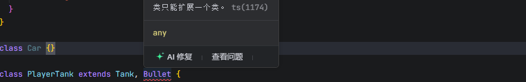

# `TypeScript`?

以`JavaScript`为基础构建的语言，是`JavaScript`的超集：**扩展了`JavaScript`语言，并添加了类型校验系统**
所以TS可以在任何支持JS的平台上执行，但TS不能直接执行，需要编译成JS

为什么需要`TypeScript`？

JS作为动态类型、弱类型的解释型语言，数据类型仅在运行时确定，这意味着很多类型错误只能在代码运行时暴露：

- 使用了不存在的变量、函数或成员
- 把一个不确定的类型当作一个确定的类型处理
- 在使用`null`或`undefined`的成员

TS通过**静态类型检查**强制在编译阶段检查类型匹配，在编写代码时发现问题，大幅减少线上Bug

- 静态类型检查，提前规避错误
- 增强代码可读性与可维护性
- 更好地支持复杂应用与工程化

```shell
# 安装
npm install typescript --global
```

使用TS库自带的`tsc`脚本，将TS文件编译成JS文件运行

```shell
# 编译指定ts文件
tsc filename.ts

# 监视ts文件，发生改动时自动编译成js文件
tsc filename.ts -w

# 非全局安装需要加`npx`前缀
npx tsc ./src/main.ts
```


# 配置文件`tsconfig.ts`

初始化`tsconfig.json`配置文件

```shell
tsc --init
```

使用了配置文件后，使用`tsc`进行编译时，不能跟上文件名，否则会忽略配置文件
`tsc`命令会直接将目录下的所有`.ts`后缀文件都编译

```json
{
  // 编译选项
  "compilerOptions": {
    "target": "es2016", // 编译目标代码的版本标准
    "module": "es2015", // 编译目标使用的模块化标准
    // 编译时需要包含的标准库类型定义文件`.d.ts`，会根据`target`配置自动设置
    "lib": []，
    // 指定编译文件存放的目录
    "outDir": "./dist",
    // 严格类型校验模式
    "strict": true,
    // 打包时移除注释
    "removeComments": true,
    // // 不自动在文件顶部添加 'use strict'
    "noImplicitUseStrict": false,
    // 编译错误时不生成输出文件
    "noEmitOnError": true,
    // 模块解析策略
    "moduleResolution": "node",
  },
  // 运行`tsc`脚本时哪些文件需要被编译
  "inclued": ["src/**/*"],
  // 排除编译
  "exclude": ["node_modules"],
  // inclued 和 exclude 可以不用显式配置，有默认值
}
```

使用`nodemon`和`ts-node`第三方库，自动监视ts文件的改动并编译成js文件
弥补`tsc`使用配置文件后，后面不能写文件名的缺陷
`ts-node`库可以直接在内存中执行`.ts`文件并运行输出结果，无需预编译

```json
{
  'scripts': {
    // 观测src目录下的.ts后缀的文件的变动，然后执行`ts-node src/index.ts`
    "dev": "nodemon --watch src -e ts --exec ts-node src/index.ts"
  }
}
```

> [!NOTE]
>
> `@types`是一个TS官方的类型库，其中包含了很多对JS代码的类型描述
> 例如`JQuery`是用js写的，没有类型检查，安装`@types/jquery`为库添加类型定义


# 类型约束

仅需要在【变量、函数的参数、函数的返回值】位置加上`:类型`即可约束
**类型定义后，不能再将数据赋值为不许可的类型的值**

ts在很多场景中可以完成类型推导

```ts
let phone: string = '13455348745'

function sum (a: number, b: number) {
  return a + b
}
```


# 基本类型

对数据的类型约束为某个特定的类型


## `string`

```typescript
// 字符串 类型

let str: string = '2'
// str = 2
// 此时赋值会报错，以为值的类型只能是`string`类型

// 如果不书写类型，TS会根据数据来进行推断
let str = 'Hello'
// 此时数据类型为`string`
```


## `number`

```typescript
// 数字 类型

// 声明一个变量，同时指定它的数据类型是`number`
// 数据类型设置为`number`后，在之后的使用过程中`a`的类型只能是`number`
let a: number
a = 10

// a = 'hello'
// 此时会报错，不能将`string`类型数据赋值给`number`数据类型
```


## `boolean`

```typescript
// 布尔 类型
let bool: boolean = true
// 函数的返回值类型为`boolean`
function compare (a: number, b: number): boolean {
  return a >= b
}
```


## `symbol`

```typescript
// 符号 类型
const symbol: symbol = Symbol('symbol')
typeof symbol // 'symbol'
```


## `null`

```typescript
// null 类型，表示对象或者属性是空值

let nul: null = null
```


## `undefined`

```typescript
// undefined 类型

let undef: undefined = undefined
```


> [!NOTE]
>
> 在非严格模式下，`null`和`undefined`是所有其他类型的子类型，它们可以赋值给他类型
>
> ```ts
> let st: string = undefined
> ```
>
> 实际开发中，建议开启严格类型检查
>
> ```json
> {
>   "compilerOptions": {
>     "strcit": true, // 严格模式
>     "noUncheckedIndexedAccess": true, // 严格的索引访问检查
>     "exactOptionalPropertyTypes": true, // 严格的可选属性类型检查
>     "strictNullChecks": true, // 严格的空值检查
>   }
> }
> ```


------


## `object `

```typescript
let obj: object = {name: 'Kein'}
let obj_1: object = [1, 2, 3] // 数组也属于对象类型

let objectData: { name: string, age: number }
// 表示对象中只有`name`和`age`两个属性，前者为`string`类型， 后者为`number`类型
// 少书写其中一个或多个属性，或者多写属性，类型检查时都会报错
objectData = {
  name: 'Kein',
  age: 22
}

// 属性后面加`?`号，表示该属性是可选的，可有可无，不书写也不会报错
let object_a: { name: string, grade?: string }
object_a = { name: 'Kein' }

// 表示该对象至少要有一个`name`属性，且为`string`类型值，其他属性的数据类型和个数都是未知的
// `propName`和`key`所可以代表键
let object_b: { name: string, [propName: string]: unknown }
object_b = { name: 'Kein', gender: 'Male', age: 23 }

// 不确定对象的属性的个数和名称时
// 索引签名参数类型必须是`string | number | symbol`或模板文本类型
let object_c: { [key: string]: string }
// 表示对象中每个值的类型都是`string`

// 错误例子
let obj1: object = 3
let obj2: object = "3"
let obj3: object = true
let obj4: object = null
let obj5: object = undefined
```

[^Tip]:大Object，代表所有原始类型、非原始类型都 可以赋给 Object，严格模式下不包括null，undefined{}空对象类型和大 Object 一样；


## `array`

```typescript
let arrayA: string[] // 表示字符串类型元素的数组
let arrayB: number[] // 表示数字类型元素的数组
let arrayC: {}[] // 表示对象类型元素的数组

let arrayD: Array<number> = [2, 3, 4] // 同样表示元素类型为数字的数组
```


## `function `

```typescript
// 表示函数的两个参数和返回值的类型都是`number`类型
const add = (a: number, b: number): number => {
  return a + b
}

// 使用 类型别名 定义类型，使得类型可以共用
type addFnType = (a: number, b:number) => number
let addFn: addFnType = function (num1, num2) {
  return num1 + num2
}

// 可选参数，表示该参数可传可不传，默认值变成`undefined`
// 可选参数必须出现在参数列表的末尾，不能在第一个
function log(msg?: string): void {}

// 参数默认值，有默认值的参数会自动变成可选参数
function addFn1(num1: number, num2: number = 1) {
  return num1 + num2
}

// 剩余参数
function sum(...nums: number[]): number {
  return nums.reduce((a, b) => a + b, 0)
}
sum(1, 2) // => 3
sum(1, 2, 3) // => 6

// 函数重载：在函数实现之前，对函数调用的多种情况进行声明
function combine(a: number, b: number): number // 定义情况一
function combine(a: string, b: string): string // 情况二
// 定义函数实现，必须出现在声明之后，中间不能有其他代码行
function combine(a: number | string, b: number | string): number | string {
  if (typeof a === 'number' && typeof b === 'number') {
    return a + b
  }
  if (typeof a === 'string' && typeof b === 'string') {
    return a + b
  }
  throw new Error('参数类型错误')
}
combine(2, 3)
combine('2', '3')
// combine('2', 3) // 报错

// 传递给目标函数的参数可以少，但不可以多
function callBack (value: unknown, index: number, arr: unknown[]): void {}
// 例如，`forEach`方法的回调函数目标签名提供的自变量为3个，但是可以少传递，但不可以多传递
[1, 2, 3].forEach(callBack)

// 要求返回必须返回，不要求返回则随意
```

> [!NOTE]
>
> 可选和`string | undefined`不等价
> `string | undefined`表示为这两个类型中的一种，而可选是这个属性或参数可有可无


## 元组

一个固定长度的数组，并且数组中每一项元素的类型确定

```ts
let tupleA: [string, string]
// 此时只允许该元组拥有 2 个元素，不能多也不能少，且类型都为`string`
tupleA = ['Kein', 'Kyle']
```


## 字面量

以一个确定的值表示类型，即表示除了字面量之外的其他值都会报错

```ts
// 约束变量可能出现的值
let gender: 'male' | 'female'
gender = 'male'
// `gender = '男'`会错误

// 约束`arr`永远都只能为一个空数组`[]`
let arr: [] = []
```


## `void`

通常用于约束函数的返回值，表示**该函数没有返回值或者返回值为`undefined`**

```ts
function fn(): void {
  // ...
  return undefined
  // 不写`return`语句或返回`undefined`都行
}

// 可以把`undefined`赋值给`void`类型的变量
let vd: void = undefined
let un: undefined = void 0


// 设置函数的参数类型和返回值类型
let fn: (x: number, y: number) => number
fn = (x, y) => {
  return x + y
}
```


## `any`

任意类型，是官方提供的一个选择性**绕过静态类型检测**的作弊方式

非常不建议使用，因为对`any`类型的数据，TS完全不进行类型检查

```typescript
// `any`会绕过类型检测，所以下面不会有问题提示
let an: any
an.toFixed(2)
an[0] = 'any'
```


## `unknown`

用来描述类型并不确定的变量，和`any`的区别就是`unknown`**会进行类型检测**

```typescript
let unk: unknown
let x = 1
let y = "2"
if (x) {
  unk = x
} else {
  unk = y
}

// 通过缩小类型可以通过类型检测
if (typeof unk === 'number') {
  unk.toFixed(2)
}
```

可以把任何类型的值赋值给`unknown`，但是`unknown`类型的值只能赋值给`any`或者`unknown`

```ts
// 将`number`类型的值赋给`unknown`类型的变量
let un: unknown = 100

let un_1: number = 100
let un_2: unknown = 10
un_1 = un_2 // 不能赋值，需要加上类型断言`un_1 = un_2 as number`
```


## `never`

通常用于约束函数的返回值，表示该函数永远不可能结束

```typescript
function throwErrFn(): never {
  throw new Error('出错了')
}

// 如果函数里是死循环，返回值类型默认是`void`
function deadLoop(): never {
  while(true) {
    // 死循环
  }
}

// never 是所有类型的子类型
```


# 枚举`enum`

枚举类型，作用在于定义逻辑字段和值相对应的集合，枚举的字段值可以是字符串或数字

- 数字枚举的值会自动自增
- 被数字枚举约束的变量，可以直接赋值为数字
- 数字枚举的编译结果和字符串枚举有差异

最佳实践：

- 尽量不要在一个枚举中既出现字符串字段，又出现数字字段
- 使用枚举时尽量使用枚举字段的名称，而不使用相对应的真实常量值

```typescript
`enum TypeName {
  字段1 = 值1,
   字段2 = 值2,
  ...
}`

// 一个默认从 0 开始递增的数字集合，称之为数字枚举
enum Gender {
  male = 0,
  female = 1,
  unknown // 默认为 2，因为上一个为 1，数字枚举的值自动自增
}
let enumA = {
  name: 'Kein',
  gender: Gender.male // 此时 gender = 0
}
```

**枚举会出现在编译后结果中，编译结果中表现为对象，所以枚举可以使用对象相关的方法和属性**

```ts
enum Gender {
  male = '男',
  female = '女'
}

console.log(Gender.male) // '男'
console.log(Gender.hasOwnProperty('male')) // true

function print() {
  const keys = Object.keys(Gender)
  keys.forEach(k => console.log(k))
}
print() // 'male' 'female'
```

位枚举实现，字段值的组合

```ts
enum Permission {
  read = 1, // 2^0 -> 0001
  write = 2, // 2^1 -> 0010
  create = 4, // 2^2 -> 0100
  delete = 8 // 2^3 -> 1000
}
// 进行位运算，将值转换成二进制后运算
const p = Permission.read | Permission.write // 0011
```


# 联合类型`T | T`

多个类型满足其中一个就好
可以把`|`类比为`JavaScript`中的逻辑或 `||`，只不过前者表示的是类型

```typescript
let age: number | string = 20
age = '23'

let name: string | undefined
```

但此时编辑器的类型提示会失效，因为无法确定是哪个类型，需要配合**类型保护**进行判断

```ts
// 当对某个变量进行类型判断之后，例如：
if ( typeof name === 'string') {
  // 在此判断语句内，`name`的类型确定为`string`
}
```


# 交叉类型`T & T`

需同时满足`t & t`前后两个类型的约束，类似于逻辑运算中的与运算`&`

```typescript
let zs: { name: string; age: number } & { height: number }
zs = {
  name: "张三",
  age: 20,
  height: 180
}
```


# 接口`interface`

接口`interface`是一种规范和约束，用于约束类、对象、函数的契约（标准）

和类型别名一样，不会出现在编译后的代码中

类型保护函数：通过调用该函数，会触发TS的类型保护，必须返回`boolean`类型的值

```ts
/* 1. 约束对象 */
interface User {
  name: string
  age: number
  sex: 'male' | 'female'
  email?: string, // 缺省属性，可有可无
  // sayHello: () => void
  // 另一种写法
  sayHello(): void
}

/* 2. 约束函数和参数即返回值 */
interface AddFn {
  (a: number, b: number): number
}
// 当大括号中没有具体属性字段时，大括号只是一个定界符，不是对象
const add: AddFn = (a, b) => a + b

/* 3. 约束数组 */
interface ArrayNumber {
  [key: number]: number
}
const arr: ArrayNumber = [1, 2, 3]

/* 4. 约束类class */
interface MyInterface {
  sayHello(): void
  walk(): void
  gender: "male" | "female"
}
// 约束`MyClass`类中必须包含接口`MyInterface`中的成员
class myClass implements MyInterface {
  gender: "male" | "female"
  constructor(public name: string, gender: "male" | "female") {
    this.gender = gender
  }
  sayHello() {
    console.log("Hello !")
  }
  walk() {
    console.log("walk !")
  }
}

```

> [!NOTE]
>
> 接口和类型别名的最大区别：接口可以被类实现，而类型名不可以


## 接口继承

接口继承，子接口可以继承父接口的所有属性和方法
但要注意，子接口不能覆写父接口中的相同成员为不同的类型

**如果继承的接口被继承的接口有相同的属性且类型不兼容，那么就会报错**

```typescript
interface User {
  name: string
  age: number
  sex: 'male' | 'female'
}
// 例如，父接口中定义了`name: string`，子接口中定义了`name: number`，这是不允许的
interface Student extends User {
  // 只读修饰符，只能在接口定义时或构造函数中赋值，不会出现在编译后的代码中
  readonly id: number
}
// 继承多个接口，实现多个接口的组合约束
interface Child extends User, Student {
  skills: string[]
}
```


## 接口合并

重复定义的接口会进行类型合并，**即重复定义的接口类型，它的类型会叠加联合**
一般用在扩展第三方库的接口类型

```typescript
interface PersonInfo {
  name: string
  age: number
}
interface PersonInfo {
  name: string
  height: number
  age: string
}
// 此时`PersonInfo`接口变成了
interface PersonInfo {
  name: string
  age: number | string
  height: number
}
```


# 索引器

索引器在JS中的叫法又叫：属性表达式
即不使用`.propName`来访问成员，而是使用`['propName']`来访问

在严格的检查下，可以实现为对象和类动态增加成员

```ts
const info = {
  name: '张三',
  age: 18,
  gender: 'male',
}
// 在默认情况下，使用索引器访问不存在的属性，也不会报错
// 针对索引器使用场景多数为需要动态确定属性名称的情况下，TS的校验规则没有那么严格
// 允许隐式的`any`的类型存在
info['sex']
```

如何避免这种情况

```json
{
  "compilerOptions": {
    "noImplicitAny": true // 不允许隐式的 any 类型
  }
}
```

如果想在后续程序执行中动态增加对象和类的属性，怎么做？

```ts
interface User {
  name: string
  age: number
  gender: "male" | "female"
  // 增加一个索引器，表示执行该接口的对象或类中
  // 除了必要的`name | age | gender`属性，其他任何键类型为`string`，类型为`unknown`
  [prop: string]: unknown
}
```


# 类型别名`type`

定义抽离出来的类型实现复用，格式: `type 别名名称 = 类型定义`

**类型别名重复定义会报错**

```ts
// 定义一个类型别名
type User = { name: string; age: number; gender: 'male' | 'female' }
const user: User = { name: 'Kyle', age: 25, gender: 'male' }
// 复用
function getUserList(): User[] {
  return [
    user,
    { name: 'Kein', age: 26, gender: 'female' }
  ]
}

// 约束函数
type AddFnType = {
  (a: number, b: number): number
} // // 当大括号中没有具体属性字段时，大括号只是一个定界符，不是对象
// 或者
type AddFnType = (a: number, b: number) => number
const add: AddFnType = (a, b) => a + b
```

类型别名通过交叉类型`&`实现接口的继承效果
但与接口继承不同的是，类型别名中相同成员的类型会被交叉类型`&`合并

```ts
type UserType = {
  name: string
  age: number
  sex: 'male' | 'female'
}
type StudentType = {
  id: number
}
// 表示`ChildType`类型必须同时满足`User、Student、Child`接口的约束
// 
type ChildType = UserType & StudentType & Child
```

某些情况下，接口`interface`接口和`type`类型别名没有太大区别

类型别名可以针对接口没法覆盖的场景，例如组合类型、交叉类型等

```typescript
// 1. 联合类型
type NumAndString = number | string
let age: NumAndString = 22
age ='23'

// 2. 交叉类型
type SectionType = { name: string; age: number } & {
 height: number;
 name: string;
}
let zs: SectionType = {
 name: "张三",
 age: 20,
 height: 180
}

// 3. 提取接口中属性的类型
interface PersonInfo {
 name: string;
 height: number;
}
type PersonHeight = PersonInfo["height"]
let altitude: PersonHeight = 8848
```


# 泛型`<T>`

**泛型的本质是【类型参数化】，即把类型作为参数传递给函数、类或接口**
允许在定义函数、类或接口时不预先指定具体的类型，而是在使用时再指定类型参数
让代码更加灵活、通用，同时还能保持类型安全

目的在于有效约束类型成员之间的关系，比如函数参数和返回值、类或者接口成员和方法之间的关系

```ts
// 使用泛型约束函数参数的类型
function find<T>(arr: T[], index: number): T {
  if (index >= 0 && index < arr.length) {
    return arr[index] as T
  }
  throw new Error(`Index ${index} is out of bounds`)
}
// 在使用函数时，才能确定数组元素的类型
const res = find<number>([1, 2, 3], 1) // 2
```

```ts
// 类型别名泛型
type Callback<T> = (item: T, index: number) => boolean
// 接口泛型
interface Callback<T> {
  (item: T, index: number): boolean
}

// `filter`函数接受一个泛型参数`T`
function filter<T> (arr: T[], callback: Callback<T>): T[] {
  const new_arr: T[] = []
  arr.forEach((item, index) => {
    if (callback(item, index)) {
      new_arr.push(item)
    }
  })
  return new_arr
}
const f = filter<number>([1, 2, 3, 4, 5], (i) => i % 2 === 0)
console.log(f) // [2, 4]
```


```ts
// 使用泛型约束类
class ArrayHelper<T> {
  arr: T[] = []
  constructor(arr: T[]) {
    this.arr = arr
  }
}
```


## 泛型约束

把泛型入参限定在一个相对更明确的集合内，以便对泛型的取值进行约束

```typescript
function nameToUpperCase<T>(obj: T): T {
  // 此时会报错：类型`T`上不存在属性`name`
  obj.name = obj.name.split(' ').map((s) => {
    const n = s[0]?.toUpperCase() + s.substring(1)
    return n
  }).join('')
  return obj
}
```


这种情况下，我们希望约束一下泛型可选的类型，比如至少是一个对象，并且含有`name`属性

```ts
interface HasName {
  name: string
}
// 通过`extends`继承，约束泛型入参至少满足`HasName`的特征
function nameToUpperCase<T extends HasName>(obj: T): T {
  // 函数体不变
}
```

所以，传递参数时也许满足必要特征

```ts
const kyle = { name: 'kyle', age: 25 }
const kyleUpper = nameToUpperCase(kyle)
// 如果缺少`name`属性，不满足入参约束，则会报错
```


## 多泛型

可以定义多个泛型参数，每个参数之间用`,`逗号隔开

```ts
function mixArray<T, U>(arr1: T[], arr2: U[]): (T | U)[] {
  return [...arr1, ...arr2]
}
const arr = mixArray([1, 2, 3], ['a', 'b', 'c'])
console.log(arr) // [1, 2, 3, 'a', 'b', 'c']
```


# 类型断言

是一种告诉编译器，我知道我在干什么，你不要给我报错的方法

```ts
// 1. 尖括号语法：<type>
let str: string = 'hello'
let strLen: number = (<string>str).length

// 2. as 语法：as type
let str2: string = 'hello'
let strLen2: number = (str2 as string).length

// 3. 非空断言：!
// 在数据之后加上感叹号`!`，告诉TS不用考虑该数据为空的情况，一定有值
const element: HTMLElement = document.getElementById('map')!
```


# 修饰符`readonly`

表示被修饰的数据只能在定义时或构造函数中赋值，不能在后续代码中修改

只读修饰符不会出现在编译后的代码中

```ts
// 1. 修饰变量-只读数组
let arr: readonly number[] = [1, 2, 3]
// 另一种写法
const arr2: ReadonlyArray<number> = [1, 2, 3]
// 只读数组的成员不能被修改，也不能被删除，但是可以被读取
console.log(arr[0])
// arr.push(4) // 报错，只读数组不能被修改

// 2. 修饰某个属性
interface Person {
  name: string
  age: number
  sex: 'male' | 'female'
  readonly id: number // 表示`id`字段只能在定义时赋值，后续不可更改
}
```


# 类`class`

```typescript
type Gender = 'male' | 'female'
class Person {
  /* 在TS中需要书写属性列表来明确类中的成员！ */
  name: string
  age: number
  gender: Gender
  hobbys: string[] = ['reading']
  /* 通过`?`问号表示为可选属性，需要时再赋值 */
  phone?: string // 或者: `phone: string | undefined`
  
  // `readonly`只读修饰符，表示这个属性只能在初始化时赋值，之后可读不可改
  readonly gender: Gender
  
  // `private`修饰符
  private cardId: string
  
  // 构造器函数
  constructor(name: string, age: number, gender: Gender) {
    this.name = name
    this.age = age
    this.gender = gender
  }
  
  // 定义方法
  sayHello() {
    console.log('Hello!My Name Is' + this.name)
  }
}

const people = new Person('Kyle', 25, 'male')
people.sayHello()
```

如果某个属性，通过构造函数的参数传递并且不做任何处里的赋值给该属性，可以进行简写

```ts
class Person {
  // 此时，不用书写属性列表声明`name`和`age`
  constructor(public name: string, public age: number) {}
}
```


## 修饰符

通过修饰符做到控制属性和方法的访问

`readonly`：只读修饰符，表示这个属性只能在初始化时赋值，之后可读不可改

`public`：默认的访问修饰符，公开的，所有的代码均可访问

`private`：私有的，只能在类中访问，外面不行

`protected`：只能在自身和继承的子类中访问，外面不行

`static`：静态属性修饰符，只可以通过类自身访问，实例无法使用

```typescript
// 类的单例模式
class Board {
  // 将类`Board`的构造函数私有化，不能通过`new`实例化，仅可在类中访问
  private constructor() {}
  
  private static _board: Board // 静态、隐私属性
  
  static createBoard() { // 静态方法，只能通过类`Board.createBoard`调用
    if (!this._board) {
      this._board = new Board()
    }
    return this._board
  }
}
const b1 = Board.createBoard()
const b2 = Board.createBoard()
console.log(b1 === b2) // true
```


## 类继承

子类成员不能改变父类成员的类型
无论是属性还是方法，子类都可以对父类的相应成员进行重写，但是需要保证类型的匹配
在继承关系中`this`的指向是动态的，调用方法时根据具体的调用者确定`this`指向

- **单根性**：每个类最多只能扩展继承一个父类

  

- **传递性**：如果A是B的父类，B是C的父类，则可以认为A也是C的父类

```ts
class Tank {
  position: { x: number; y: number } = { x: 0, y: 0 }
  speed: number = 10
  shoot() {
    console.log('Tank shoot')
  }
}

class PlayerTank extends Tank {
  constructor(x: number, y: number) {
    super() // 在子类中必须使用`super`调用父类的的构造器
    this.position.x = x
    this.position.y = y
  }
  // 子类中`shoot`的方法和父类中同名，我既想调用本身的，也想同时调用父类的，怎么办？
  // 使用`super`关键字，访问父类的方法
  shoot() {
    super.shoot()
    console.log('PlayerTank shoot')
  }
}
```


## 抽象类

在类的前增加`abstrsct`修饰符，抽象类不能直接用`new`实例化对象，只能被当作父类被继承
抽象类就像是一个模板，子类都需要基于这个模板之上去扩展自己的规则

```ts
// 抽象类不能被实例化，只能被继承
abstract class Animal {
  // 抽象属性：必须在子类中定义
  abstract readonly name: string
  // 抽象方法：只能定义在抽象类中，且子类必须对抽象类方法进行具体的实现
  abstract eat(): void

  // 抽象类的正常属性和方法
  legs?: number
  sleep() {
    console.log("睡")
  }
}
// let animal = new Animal() // 报错，抽象类不能直接实例化

// 继承抽象父类
class Dog extends Animal {
  // 子类必须实现父类中的抽象属性
  readonly name: string = 'Dog'
  
  // 子类必须实现父类中的抽象方法
  eat() {
    console.log('吃')
  }
}

let dog = new Dog()
dog.legs = 4
console.log(dog.legs) // 4
```


# 装饰器`Decorator`

在`TS/JS`中，装饰器是一种特殊的语法结构，本质上是一个**函数**，并且参与代码执行
**用于在不修改原有代码的前提下，动态地为类、方法、属性或参数添加额外功能**

装饰器的作用：为某些属性、类、参数、方法提供元数据信息
元数据`Meta Data`是描述数据的数据

当多个装饰器应用于同一个对象时：会按照**后加入先调用（从右到左，自下而上）**的顺序进行调用

```json
{
  // 需要在 tsconfig.json 配置
  "compilerOptions": {
    "experimentalDecorators": true,  // 启用装饰器
  }
}
```


## 类装饰器

作用于类声明，用于修改或扩展类的行为

**运行时间**：在类定义后直接运行

**装饰器参数**：

- `target`：类本身

**返回值**：

- `void`：仅运行函数
- `新的类`：会将新的类替换掉装饰目标

```ts
// 类的本质就是一个函数`Function`，但是这样约束太过广泛
// 我们希望它只能是一个类，使用`new (...args: unknown[]) => object`约束
function Decorator(target: new (...args: unknown[]) => object): void {
  console.log(target)
  // 添加静态属性
  target.version = '1.0.0'
  // 添加原型方法
  target.prototype.log = function() {
    console.log(`这是 ${target.name} 类的实例`)
  }
}

@Decorator // 类装饰器
class A {}
```


## 属性装饰器

作用于类的属性（实例属性或静态属性），用于定义属性的行为（如默认值、读写限制等）

**运行时间**：在属性定义后直接运行

**装饰器参数**：

- `target`：如果是静态`static`属性则为类本身；如果是实例属性则为类的原型对象`prototype`
- `propertyKey`：属性名

**返回值**：可选，返回一个属性描述符`{ value, writable, enumerable, configurable }`，用于定义属性行为

```ts
function prop(target: any, propertyKey: string) {
  console.log(target === B.prototype, propertyKey)
}
class B {
  @prop
  name: string = "Kyle"

  @prop
  static age: number = 18
}
```


## 方法装饰器

用于修改方法的行为（如添加日志、缓存、权限校验等）

**运行时间**：在方法定义后直接运行

**装饰器参数**：

- `target`：如果是静态`static`方法则为类本身；如果是实例方法则为类的原型对象`prototype`
- `propertyKey`：方法名
- `descriptor`：方法的属性描述符

**返回值**：可选，返回修改后的描述符替代原描述符

```ts
function MethodDecorator( target: any, propertyKey: string, descriptor: PropertyDescriptor) {
  console.log(target === C.prototype, propertyKey, descriptor)

  // 方法的属性描述符
  // value：方法的函数体
  // writable：是否可写
  // enumerable：是否可枚举
  // configurable：是否可配置
  descriptor.enumerable = false // 默认是 false，因为类的方法在原型对象上

  // 原方法
  const originalMethod = descriptor.value
  // 对方法进行修改
  descriptor.value = function (...args: any[]) {
    console.log('before')
    originalMethod.apply(this, args)
    console.log('after')
  }
  
  return descriptor
}

class C {
  @MethodDecorator
  say() {
    console.log('hello')
  }
}
new C().say()
```


## 参数装饰器

作用于方法的参数，用于记录参数信息（如参数验证、依赖注入等）

**运行时间**：在方法定义后直接运行

**装饰器参数**：

- `target`：如果是静态`static`方法则为类本身；如果是实例方法则为类的原型对象`prototype`
- `propertyKey`：方法名
- `parameterIndex`：参数在参数列表中的索引

```ts
function Param(target: any, propertyKey: string, parameterIndex: number) {
  console.log(target === D.prototype, propertyKey, parameterIndex) // true say 0
}

class D {
  say(@Param name: string) {
    console.log(name)
  }
}
new D().say('Kyle')
```


# 类型演算

指在没有明确指定类型的情况下，TS会根据上下文自动推断出类型


## `declare`

类型增强；

```html
<script>
var globalVar = 'globalVar变量'
var globalObj = { name: '', age: 20 }
function fn(str) {
 console.log('fn函数' + str)
}
</script>
```

如果上面几个变量和函数没有在全局做声明，会报类型错误，在我们在 types 文件夹中创建 common.d.ts 文件；

```typescript
declare var globalVar: string
type ObjType = { name: string; age: number }
declare var globalObj: ObjType
// 声明函数fn类型
declare function fn(s?: string): void
```


## `infer`

类型推断

```typescript
type ObjType<T> = T extends { name: infer N; age: infer A } ? [N, A] : [T]
let p: ObjType<{ name: string; age: number }> = ["张三", 1]
let p1: ObjType<{name: string}> = [{name: '张三'}]
```


## `keyof`

`keyof`类型运算符可以获取一个类、接口、类型别名的所有的成员名，返回一个联合类型`|`

```ts
class User {
  name: string = "Kyle"
  age: number = 25
}
type T = keyof User // 'name | 'age

function printUserKey(obj: User, key: T) {
  //key 的值如果不约束为 User 实例的字段联合类型，会报错具有隐式 any 类型
  console.log(obj[key])
}
```


## `in`

用来遍历枚举类型，该关键字往往和`keyof`联用，限制某个索引类型的取值范围

```ts
interface T1 {
  name: string
  age: number
  sex: boolean
}

// 遍历 T1 接口的所有属性，将属性值的类型赋值给新的属性
// 并将属性名添加 readonly 修饰符和 ? 可选修饰符
type ReadonlyT1 = {
  readonly [prop in keyof T1]?: T1[prop]
}
// 等价于
type T3 = {
  readonly name?: string
  readonly age?: number
  readonly sex?: boolean
}

// 配合上泛型，传入一个泛型参数，实现一个通用的 MyReadonly 工具类型
type MyReadonly<T> = {
  readonly [prop in keyof T]: T[prop]
}
```

> [!NOTE]
>
> `in`和`keyof`只能在类型别名定义中使用


## `typeof`

在类型上下文中推断一个变量或对象的类型

```ts
// 1. 推断变量的类型
const k = 'hello'
console.log(typeof k) // string

// 2. 反推出对象的类型作为新的类型
const person = {
  name: '张三',
  getName(name: string): void {
    console.log(name)
  }
}
console.log(typeof person) // { name: string; getName(name: string): void }

// 3. 当`typeof`作用于类的时候，得到的类型是该类本身的类型
// 类似于`new () => User`
class User {
  name: string = 'Kyle'
  age: number = 25
}
const A = User // 此时 A 的类型：`typeof User`
console.log(typeof User) // function
// 需要约束为类才可以使用`new`关键字调用
function createUser(clsss: typeof User): User {
  return new clsss()
}
```


## `TS`预设类型

```ts
interface T {
  name: string
  age: number
  sex: boolean
  email: string
}
interface U {
  name: string
  age: number
}
type None = undefined | null

// 将参数 T 的所有成员都设置为可选类型
type P = Partial<T>
// 将参数 T 的所有成员都设置为必选类型
type R = Required<T>
// 将参数 T 的所有成员都设置为只读类型
type O = Readonly<T>
// 从 T 中排除 U 的类型
type E = Exclude<T, U>
// 从 T 中提取 U 的类型
type X = Extract<T, U>
// 从T中排除 null 和 undefined 的类型
type N = NonNullable<T>

class C {
  name: string = "张三"
  age: number = 18
}
// 从 T 中提取实例类型
type I = InstanceType<typeof C>

// 获取函数的返回值类型
type Func = () => number
type F = ReturnType<Func> // number
```


# 声明文件

声明文件`Declaration files`是一种特殊的文件，用于为`JavaScript`代码提供类型信息
使`TypeScript`能够理解这些代码的类型结构，从而提供类型检查、自动补全和代码提示等功能

**声明文件的扩展名为`.d.ts`，它本身不包含具体的实现代码，只包含类型声明**

**声明文件的作用**：

- 为已有的`JavaScript`库提供类型信息，使其可以在`TypeScript`项目中被安全地使用，例如安装对应的`@types/`类型包

  ```shell
  npm install @types/lodash --save-dev
  ```

- 定义全局变量、函数、类等的类型，增强代码的可维护性和可读性

- 解决不同模块之间的类型依赖问题

**声明文件的查找规则**：

- 在同目录下的，与模块同名的`.d.ts`文件（用`TypeScript`代码书写的工程发布包之后的格式）

- 安装依赖`node_modules/@types`目录下的对应类型包

- `tsconfig.json`手动书写`typeRoots`配置，指定类型声明文件的位置

  ```json
  {
    "compilerOptions": {
      "typeRoots": [
        "./node_modules/@types",
        "./src/types"
      ]
    }
  }
  ```

**自动生成声明文件**：

使用`TypeScript`开发的工程，发布的是编译之后的`JavaScript`文件
如果发布的工程需要其他开发者使用，可以使用声明文件，来描述发布结果中的类型
配置`tsconfig.json`中的`declaration: true`即可

```json
{
  "compilerOptions": {
    "sourceMap": true, // 生成 source map 文件
    "declaration": true, // 编译后自动生成`.d.ts`类型声明文件
    "declarationMap": true, // 生成声明文件的 source map 文件
  }
}
```


## 全局声明

用于声明全局作用域中的变量、函数、类等

```ts
// global.d.ts
declare var VERSION: string

declare function greet(name: string): string
declare function setTimeout(handler: () => void, time_ms: number): number 
declare function clearTimeout(id: number): void

declare class Person {
  name: string;
  readonly age: number;
  constructor(name: string, age: number)
  sayHello(): void;
}

declare var test: {
  log(...args: any[]): void;
  error: (...args: any[]) => void;
  warn: (...args: any[]) => void;
  name: string;
}
```


## 模块声明

当导入一个没有类型声明的`JavaScript`模块时，可以通过声明文件为其补充类型

```ts
/* lodash 类型声明 */
declare module 'lodash' {
  // 声明具名导出
  export function chunk<T>(array: T[], size: number): T[][]
  export function map<T, U>(array: T[], iteratee: (item: T) => U): U[]

  // 其他 lodash 方法...

  // 声明默认导出
  export default {
    chunk,
    map
  }
}


/* jquery 类型声明 */
declare function $(n: string): any
declare namespace $ {
  function ajax():void
}
// `namespace`表示命名空间,可以将其认为是一个对象,命名空同中的内容必须通过命名空间访问成员
```

```ts
// 使用模块，则可以获得类型提示
import _ from 'lodash'

const newArr = _.chunk([1, 2, 3, 4, 5], 2)
console.log(newArr)
```


## `declare global`

用于在**模块作用域内**扩展全局类型或声明全局成员，突破模块的封装限制

当一个文件包含`import`或`export`语句时，`TypeScript`会将其视为**模块**（而非全局脚本）
在模块中直接声明全局类型会无效，此时就需要使用`declare global`来显式指定全局作用域

- **必须在模块中使用**：`declare global`只能在模块文件（包含 `import`/`export`）中使用，否则会报错
- **声明与实现分离**：`declare global`仅用于类型声明，不能包含具体实现，实现逻辑需要单独编写
- **避免全局污染**：过度使用`declare global`会导致全局类型混乱，建议只在必要时使用，并尽量将扩展限制在特定范围内
- **与全局声明文件的区别**：如果在非模块文件（无`import`/`export`）中声明全局类型，不需要`declare global`，直接声明即可

```ts
export {} // 使文件成为模块

declare global {
  interface Window {
    // 声明 window 上的自定义属性
    viewer_map: Map<string, { viewer: object }>
  }
}

// 扩展 Array 的自定义方法
declare global {
  interface Array<T> {
    // 为所有数组添加一个随机排序方法
    shuffle(): T[];
  }
}
// 实现这个方法（注意：这是在模块内实现，而非声明文件）
Array.prototype.shuffle = function<T>(this: T[]): T[] {
  const newArray = [...this]
  for (let i = newArray.length - 1; i > 0; i--) {
    const j = Math.floor(Math.random() * (i + 1))
    [newArray[i], newArray[j]] = [newArray[j], newArray[i]]
  }
  return newArray
}
// 使用
const numbers = [1, 2, 3, 4, 5]
numbers.shuffle()
```


## 声明合并

借助`interface`接口重复定义会进行类型合并联合，可以扩展已有的类型

```ts
declare module "express" {
  interface Request {
    user?: {
      id: string;
      name: string;
    };
  }
}
// express中的`request`对象可以有了`user`属性的类型，不会报错（前提保证数据中真的有改数据，否则运行会出错）
```

> [!NOTE]
>
> 如果是扩展方法函数，则需要另外书写函数的具体实现


## 三斜线指令

用于声明文件之间的依赖关系

```ts
// 以`///`三个斜线开头
/// <reference path="globals.d.ts" />
/// <reference types="node" />

// 这里可以使用 globals.d.ts 中声明的类型
// 也可以使用 node 模块的类型
```


# 第三方库


## `reflect-metadata`

一个用于在`TS/JS`中实现元数据反射`Metadata Reflection`的库
允许在类、方法、属性等声明上附加额外的元数据，并在运行时通过`Reflect API`读取这些元数据
是许多`TS`框架（如`NestJS`）实现依赖注入、装饰器功能的核心基础

```json
{
  // 需要在 tsconfig.json 配置
  "compilerOptions": {
    "experimentalDecorators": true,  // 启用装饰器
    "emitDecoratorMetadata": true    // 生成元数据（配合 reflect-metadata）
  }
}
```

```ts
import 'reflect-metadata' // 必须导入才能使用

class User {
  name: string
}
// 为类添加元数据
Reflect.defineMetadata('description', '用户数据模型', User)
// 为类的属性添加元数据
Reflect.defineMetadata('maxLength', 50, User.prototype, 'name')

// 读取类的元数据
const classMeta = Reflect.getMetadata('description', User)
console.log(classMeta) // '用户数据模型'
// 读取属性的元数据
const propMeta = Reflect.getMetadata('maxLength', User.prototype, 'name')
console.log(propMeta) // 50

// 检查元数据是否存在
const hasMeta = Reflect.hasMetadata('description', User)
console.log(hasMeta) // true

/* 与装饰器联用 */
// 定义装饰器工厂函数
function Role(role: string) {
  return function (target: any) {
    Reflect.defineMetadata('role', role, target) // 添加元数据
  }
}
function FieldDescription(desc: string) {
  return function (target: any, propertyKey: string) {
    Reflect.defineMetadata('fieldDesc', desc, target, propertyKey)
  }
}

@Role('admin') // 类装饰器
class AdminUser {
  @FieldDescription('管理员姓名') // 属性装饰器
  name: string
}
```


## `class-validator`

一个基于装饰器`Decorator`的`TS/JS`数据验证库，用于对类实例的属性进行验证

```ts
import 'reflect-metadata'
import { IsString, IsInt, Min, Max, IsEmail } from 'class-validator'

/** 1. 为属性添加验证规则 **/
class User {
  @IsString({ message: '姓名必须是字符串' })
  name: string
  
  @IsInt({ message: '年龄必须是整数' })
  @Min(18, { message: '年龄不能小于 18' })
  @Max(120, { message: '年龄不能大于 120' })
  age: number
  
  @IsEmail({}, { message: '请输入有效的邮箱' })
  email: string
}


/** 2. 执行验证 **/
import { validate, validateOrReject } from 'class-validator'
const user = new User()
user.name = 123 // 错误：不是字符串
user.age = 17 // 错误：小于 18
user.email = 'invalid-email' // 错误：邮箱格式无效

// 方式一：返回错误数组
validate(user).then(errors => {
  if (errors.length > 0) {
    console.log('验证失败：', errors)
  } else {
    console.log('验证成功')
  }
})
// 方式二：验证失败时抛出异常（适合 async/await）
async function checkUser() {
  try {
    await validateOrReject(user)
    console.log('验证成功')
  } catch (errors) {
    console.log('验证失败：', errors)
  }
}
```


## `class-transformer`

一个用于`TS/JS`的对象转换库，主要功能是在普通对象（如`JSON `数据）与类实例之间进行转换
同时支持数据类型转换、嵌套对象处理、属性映射等高级功能

```ts
/* 1. 创建一个类作为数据模型 */
class User {
  id: number
  name: string
  birthDate: Date
  isActive: boolean
}

/* 2. 将普通对象转换为类实例，自动处理类型转换 */
import { plainToInstance } from 'class-transformer'
const plainUser = {
  id: '123', // 字符串 -> 数字
  name: 'Alice',
  birthDate: '1990-01-01', // 字符串 -> Date 对象
  isActive: 'true' // 字符串 -> 布尔值
}
const userInstance = plainToInstance(User, plainUser)
```


## `typescript-eslint`


