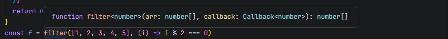
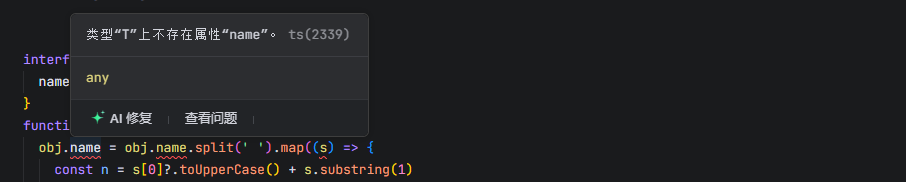
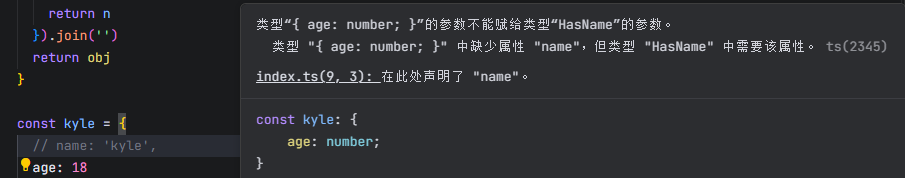
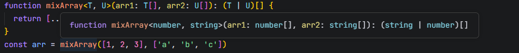

# `TypeScript`?

以`JavaScript`为基础构建的语言，是`JavaScript`的超集：**扩展了`JavaScript`语言，并添加了类型校验系统**
所以TS可以在任何支持JS的平台上执行，但TS不能直接执行，需要编译成JS

为什么需要`TypeScript`？

JS作为动态类型、弱类型的解释型语言，数据类型仅在运行时确定，这意味着很多类型错误只能在代码运行时暴露：

- 使用了不存在的变量、函数或成员
- 把一个不确定的类型当作一个确定的类型处理
- 在使用`null`或`undefined`的成员

TS通过**静态类型检查**强制在编译阶段检查类型匹配，在编写代码时发现问题，大幅减少线上Bug

- 静态类型检查，提前规避错误
- 增强代码可读性与可维护性
- 更好地支持复杂应用与工程化

```shell
# 安装
npm install typescript --global
```

使用TS库自带的`tsc`脚本，将TS文件编译成JS文件运行

```shell
# 编译指定ts文件
tsc filename.ts

# 监视ts文件，发生改动时自动编译成js文件
tsc filename.ts -w

# 非全局安装需要加`npx`前缀
npx tsc ./src/main.ts
```


# 配置文件`tsconfig.ts`

初始化`tsconfig.json`配置文件

```shell
tsc --init
```

使用了配置文件后，使用`tsc`进行编译时，不能跟上文件名，否则会忽略配置文件
`tsc`命令会直接将目录下的所有`.ts`后缀文件都编译

```json
{
  // 编译选项
  "compilerOptions": {
    "target": "es2016", // 编译目标代码的版本标准
    "module": "es2015", // 编译目标使用的模块化标准
    // 编译时需要包含的标准库类型定义文件`.d.ts`，会根据`target`配置自动设置
    "lib": []，
    // 指定编译文件存放的目录
    "outDir": "./dist",
    // 严格类型校验模式
    "strict": true,
    // 打包时移除注释
    "removeComments": true,
    // // 不自动在文件顶部添加 'use strict'
    "noImplicitUseStrict": false,
    // 编译错误时不生成输出文件
    "noEmitOnError": true,
    // 模块解析策略
    "moduleResolution": "node",
  },
  // 运行`tsc`脚本时哪些文件需要被编译
  "inclued": ["src/**/*"],
  // 排除编译
  "exclude": ["node_modules"],
  // inclued 和 exclude 可以不用显式配置，有默认值
}
```

使用`nodemon`和`ts-node`第三方库，自动监视ts文件的改动并编译成js文件
弥补`tsc`使用配置文件后，后面不能写文件名的缺陷
`ts-node`库可以直接在内存中执行`.ts`文件并运行输出结果，无需预编译

```json
{
  'scripts': {
    // 观测src目录下的.ts后缀的文件的变动，然后执行`ts-node src/index.ts`
    "dev": "nodemon --watch src -e ts --exec ts-node src/index.ts"
  }
}
```

> [!NOTE]
>
> `@types`是一个TS官方的类型库，其中包含了很多对JS代码的类型描述
> 例如`JQuery`是用js写的，没有类型检查，安装`@types/jquery`为库添加类型定义


# 类型约束

仅需要在【变量、函数的参数、函数的返回值】位置加上`:类型`即可约束
**类型定义后，不能再将数据赋值为不许可的类型的值**

ts在很多场景中可以完成类型推导

```ts
let phone: string = '13455348745'

function sum (a: number, b: number) {
  return a + b
}
```


# 基本类型

对数据的类型约束为某个特定的类型


## `string`

```typescript
// 字符串 类型

let str: string = '2'
// str = 2
// 此时赋值会报错，以为值的类型只能是`string`类型

// 如果不书写类型，TS会根据数据来进行推断
let str = 'Hello'
// 此时数据类型为`string`
```


## `number`

```typescript
// 数字 类型

// 声明一个变量，同时指定它的数据类型是`number`
// 数据类型设置为`number`后，在之后的使用过程中`a`的类型只能是`number`
let a: number
a = 10

// a = 'hello'
// 此时会报错，不能将`string`类型数据赋值给`number`数据类型
```


## `boolean`

```typescript
// 布尔 类型
let bool: boolean = true
// 函数的返回值类型为`boolean`
function compare (a: number, b: number): boolean {
  return a >= b
}
```


## `symbol`

```typescript
// 符号 类型
const symbol: symbol = Symbol('symbol')
typeof symbol // 'symbol'
```


## `null`

```typescript
// null 类型，表示对象或者属性是空值

let nul: null = null
```


## `undefined`

```typescript
// undefined 类型

let undef: undefined = undefined
```


> [!NOTE]
>
> 在非严格模式下，`null`和`undefined`是所有其他类型的子类型，它们可以赋值给他类型
>
> ```ts
> let st: string = undefined
> ```
>
> 实际开发中，建议开启严格类型检查
>
> ```json
> {
>   "compilerOptions": {
>     "strcit": true, // 严格模式
>     "noUncheckedIndexedAccess": true, // 严格的索引访问检查
>     "exactOptionalPropertyTypes": true, // 严格的可选属性类型检查
>     "strictNullChecks": true, // 严格的空值检查
>   }
> }
> ```


------


## `object `

```typescript
let obj: object = {name: 'Kein'}
let obj_1: object = [1, 2, 3] // 数组也属于对象类型

let objectData: { name: string, age: number }
// 表示对象中只有`name`和`age`两个属性，前者为`string`类型， 后者为`number`类型
// 少书写其中一个或多个属性，或者多写属性，类型检查时都会报错
objectData = {
  name: 'Kein',
  age: 22
}

// 属性后面加`?`号，表示该属性是可选的，可有可无，不书写也不会报错
let object_a: { name: string, grade?: string }
object_a = { name: 'Kein' }

// 表示该对象至少要有一个`name`属性，且为`string`类型值，其他属性的数据类型和个数都是未知的
// `propName`和`key`所可以代表键
let object_b: { name: string, [propName: string]: unknown }
object_b = { name: 'Kein', gender: 'Male', age: 23 }

// 不确定对象的属性的个数和名称时
// 索引签名参数类型必须是`string | number | symbol`或模板文本类型
let object_c: { [key: string]: string }
// 表示对象中每个值的类型都是`string`

// 错误例子
let obj1: object = 3
let obj2: object = "3"
let obj3: object = true
let obj4: object = null
let obj5: object = undefined
```

[^Tip]:大Object，代表所有原始类型、非原始类型都 可以赋给 Object，严格模式下不包括null，undefined{}空对象类型和大 Object 一样；


## `array`

```typescript
let arrayA: string[] // 表示字符串类型元素的数组
let arrayB: number[] // 表示数字类型元素的数组
let arrayC: {}[] // 表示对象类型元素的数组

let arrayD: Array<number> = [2, 3, 4] // 同样表示元素类型为数字的数组
```


## `function `

```typescript
// 表示函数的两个参数和返回值的类型都是`number`类型
const add = (a: number, b: number): number => {
  return a + b
}

// 使用 类型别名 定义类型，使得类型可以共用
type addFnType = (a: number, b:number) => number
let addFn: addFnType = function (num1, num2) {
  return num1 + num2
}

// 可选参数，表示该参数可传可不传，默认值变成`undefined`
// 可选参数必须出现在参数列表的末尾，不能在第一个
function log(msg?: string): void {}

// 参数默认值，有默认值的参数会自动变成可选参数
function addFn1(num1: number, num2: number = 1) {
  return num1 + num2
}

// 剩余参数
function sum(...nums: number[]): number {
  return nums.reduce((a, b) => a + b, 0)
}
sum(1, 2) // => 3
sum(1, 2, 3) // => 6

// 函数重载：在函数实现之前，对函数调用的多种情况进行声明
function combine(a: number, b: number): number // 定义情况一
function combine(a: string, b: string): string // 情况二
// 定义函数实现，必须出现在声明之后，中间不能有其他代码行
function combine(a: number | string, b: number | string): number | string {
  if (typeof a === 'number' && typeof b === 'number') {
    return a + b
  }
  if (typeof a === 'string' && typeof b === 'string') {
    return a + b
  }
  throw new Error('参数类型错误')
}
combine(2, 3)
combine('2', '3')
// combine('2', 3) // 报错

// 传递给目标函数的参数可以少，但不可以多
function callBack (value: unknown, index: number, arr: unknown[]): void {}
// 例如，`forEach`方法的回调函数目标签名提供的自变量为3个，但是可以少传递，但不可以多传递
[1, 2, 3].forEach(callBack)

// 要求返回必须返回，不要求返回则随意
```

> [!NOTE]
>
> 可选和`string | undefined`不等价
> `string | undefined`表示为这两个类型中的一种，而可选是这个属性或参数可有可无


## 元组

一个固定长度的数组，并且数组中每一项元素的类型确定

```ts
let tupleA: [string, string]
// 此时只允许该元组拥有 2 个元素，不能多也不能少，且类型都为`string`
tupleA = ['Kein', 'Kyle']
```


## 字面量

以一个确定的值表示类型，即表示除了字面量之外的其他值都会报错

```ts
// 约束变量可能出现的值
let gender: 'male' | 'female'
gender = 'male'
// `gender = '男'`会错误

// 约束`arr`永远都只能为一个空数组`[]`
let arr: [] = []
```


## `void`

通常用于约束函数的返回值，表示**该函数没有返回值或者返回值为`undefined`**

```ts
function fn(): void {
  // ...
  return undefined
  // 不写`return`语句或返回`undefined`都行
}

// 可以把`undefined`赋值给`void`类型的变量
let vd: void = undefined
let un: undefined = void 0


// 设置函数的参数类型和返回值类型
let fn: (x: number, y: number) => number
fn = (x, y) => {
  return x + y
}
```


## `any`

任意类型，是官方提供的一个选择性**绕过静态类型检测**的作弊方式

非常不建议使用，因为对`any`类型的数据，TS完全不进行类型检查

```typescript
// `any`会绕过类型检测，所以下面不会有问题提示
let an: any
an.toFixed(2)
an[0] = 'any'
```


## `unknown`

用来描述类型并不确定的变量，和`any`的区别就是`unknown`**会进行类型检测**

```typescript
let unk: unknown
let x = 1
let y = "2"
if (x) {
  unk = x
} else {
  unk = y
}

// 通过缩小类型可以通过类型检测
if (typeof unk === 'number') {
  unk.toFixed(2)
}
```

可以把任何类型的值赋值给`unknown`，但是`unknown`类型的值只能赋值给`any`或者`unknown`

```ts
// 将`number`类型的值赋给`unknown`类型的变量
let un: unknown = 100

let un_1: number = 100
let un_2: unknown = 10
un_1 = un_2 // 不能赋值，需要加上类型断言`un_1 = un_2 as number`
```


## `never`

通常用于约束函数的返回值，表示该函数永远不可能结束

```typescript
function throwErrFn(): never {
  throw new Error('出错了')
}

// 如果函数里是死循环，返回值类型默认是`void`
function deadLoop(): never {
  while(true) {
    // 死循环
  }
}

// never 是所有类型的子类型
```


# 枚举`enum`

枚举类型，作用在于定义逻辑字段和值相对应的集合，枚举的字段值可以是字符串或数字

- 数字枚举的值会自动自增
- 被数字枚举约束的变量，可以直接赋值为数字
- 数字枚举的编译结果和字符串枚举有差异

最佳实践：

- 尽量不要在一个枚举中既出现字符串字段，又出现数字字段
- 使用枚举时尽量使用枚举字段的名称，而不使用相对应的真实常量值

```typescript
`enum TypeName {
  字段1 = 值1,
   字段2 = 值2,
  ...
}`

// 一个默认从 0 开始递增的数字集合，称之为数字枚举
enum Gender {
  male = 0,
  female = 1,
  unknown // 默认为 2，因为上一个为 1，数字枚举的值自动自增
}
let enumA = {
  name: 'Kein',
  gender: Gender.male // 此时 gender = 0
}
```

**枚举会出现在编译后结果中，编译结果中表现为对象，所以枚举可以使用对象相关的方法和属性**

```ts
enum Gender {
  male = '男',
  female = '女'
}

console.log(Gender.male) // '男'
console.log(Gender.hasOwnProperty('male')) // true

function print() {
  const keys = Object.keys(Gender)
  keys.forEach(k => console.log(k))
}
print() // 'male' 'female'
```

位枚举实现，字段值的组合

```ts
enum Permission {
  read = 1, // 2^0 -> 0001
  write = 2, // 2^1 -> 0010
  create = 4, // 2^2 -> 0100
  delete = 8 // 2^3 -> 1000
}
// 进行位运算，将值转换成二进制后运算
const p = Permission.read | Permission.write // 0011
```


# 联合类型`T | T`

多个类型满足其中一个就行
可以把`|`类比为`JavaScript`中的逻辑或 `||`，只不过前者表示的是类型

```typescript
let age: number | string = 20
age = '23'

let name: string | undefined
```

但此时编辑器的类型提示会失效，因为无法确定是哪个类型，需要配合**类型保护**进行判断

```ts
// 当对某个变量进行类型判断之后，例如：
if ( typeof name === 'string') {
  // 在此判断语句内，`name`的类型确定为`string`
}
```


# 交叉类型`T & T`

需同时满足`t & t`前后两个类型的约束，类似于逻辑运算中的与运算`&`

```typescript
let zs: { name: string; age: number } & { height: number }
zs = {
  name: "张三",
  age: 20,
  height: 180
}
```


# 接口`interface`

通过 interface 接口来声明数据类型；

可以将内联类型抽离出来，从而实现类型可复用

```ts
// 接口的概念
// 接口是一种类型，一种规范，一种约束
// 用于约束类、对象、函数的契约(标准)
// 和类型别名一样，不会出现在编译后的代码中

interface User {
  name: string
  age: number
  sex: 'male' | 'female'
  email?: string,
  // sayHello: () => void
  // 另一种写法
  sayHello(): void
}

// 使用接口约束一个函数和函数的参数和返回值
interface AddFn {
  (a: number, b: number): number
}
// 类型别名写法
type AddFnType = {
  (a: number, b: number): number
}
// 当大括号中没有具体属性字段时，大括号只是一个定界符，不是对象
const add: AddFn = (a, b) => {
  return a + b
}


const user: User = {
  name: 'Kyle',
  age: 25,
  sex: 'male',
  email: 'kein@example.com',
  sayHello() {
    console.log(`hello, my name is ${this.name}`)
  },
}

// 接口的继承，子接口可以继承父接口的所有属性和方法
// 但要注意，子接口不能覆写父接口中的相同成员为不同的类型
// 例如，父接口中定义了`name: string`，子接口中定义了`name: number`，这是不允许的
interface Student extends User {
  // 只读修饰符，只能在接口定义时或构造函数中赋值，不会出现在编译后的代码中
  readonly id: number
}
// 继承多个接口，实现多个接口的组合约束
interface Child extends User, Student {
  skills: string[]
}


```

### 声明类型

使用接口定义变量和函数参数的类型；

```typescript
// 定义对象的类型
interface PersonInfo {
name: string; // 不是类似对象般用 , 隔开，而是 ;
age: number;
}
let zhangsan: PersonInfo = {
name: "张三",
age: 20
}

// 定义数组的类型
interface ArrayNumber {
[idx: number]: number;
}
let arr1: ArrayNumber = [1, 2, 3]

// 定义函数的类型
interface PersonFn {
(p: PersonInfo): void;
}
let Person1: PersonFn = (obj: PersonInfo): void => {
console.log(obj.name, obj.age);
}

// 定义 类Class 的成员及类型
interface myInterface {
// 接口中所有属性都不能有实际的值；
// 接口中的方法都是抽象方法；
name: string;
age: number;
sayHello(): void;
};

// 用接口去限制类的属性和方法
// 用来定义一个类的结构，指定一个类中应该包含哪些属性和方法
class myClass implements myInterface {
name: string; // 声明 this.name 的数据类型
age: number;
constructor(name: string, age: number) {
this.name = name;
this.age = age;
}
sayHello = () => {
console.log('Hello !');
}
}

// 缺省和只读特性
interface PersonInfo {
name?: string; // 缺省
readonly height: number; // 只读
}

// 不限制属性名和属性值
interface AnyObj { [propname: string]: unknown }
```

[^Tip]:很少使用接口类型来定义函数的类型，更多使用内联类型或类型别名配合箭头函数语法来定义函数类型；


### 继承接口

多个不同接口之间是可以实现继承的，会组合成一个新的接口；

但是如果继承的接口被继承的接口有相同的属性，并且类型不兼容，那么就会报错；

```typescript
interface NameInfo {
name: string;
}
interface AgeInfo {
age: number;
}
interface PersonInfo extends NameInfo, AgeInfo {
height: number;
}
let zs: PersonInfo = {
name: "张三",
age: 20,
height: 177
}
```


### 接口合并

多个相同名字的接口，会进行合并，得到一个新的接口；

**即：重复定义的接口类型，它的属性会叠加**；

这个接口的特性一般用在扩展第三方库的接口类型；

```typescript
interface PersonInfo {
name: string;
age: number;
}
interface PersonInfo {
name: string;
height: number;
}
let zs: PersonInfo = {
name: "张三",
age: 20,
height: 177
}
```


# 类型别名`type`

定义抽离出来的类型实现复用，格式: `type 别名名称 = 类型定义`

**类型别名重复定义会报错**

```ts
// 定义一个类型别名
type User = { name: string; age: number; gender: 'male' | 'female' }
const user: User = { name: 'Kyle', age: 25, gender: 'male' }
// 复用
function getUserList(): User[] {
  return [
    user,
    { name: 'Kein', age: 26, gender: 'female' }
  ]
}
```

类型别名通过交叉类型`&`实现接口的继承效果，但与接口继承不同的是，类型别名中相同成员的类型会被交叉类型`&`合并

```ts
type UserType = {
  name: string
  age: number
  sex: 'male' | 'female'
}
type StudentType = {
  id: number
}
// 表示`ChildType`类型必须同时满足`User、Student、Child`接口的约束
// 
type ChildType = UserType & StudentType & Child
```

某些情况下，接口`interface`接口和`type`类型别名没有太大区别

类型别名可以针对接口没法覆盖的场景，例如组合类型、交叉类型等

```typescript
// 1. 联合类型
type NumAndString = number | string
let age: NumAndString = 22
age ='23'

// 2. 交叉类型
type SectionType = { name: string; age: number } & {
 height: number;
 name: string;
}
let zs: SectionType = {
 name: "张三",
 age: 20,
 height: 180
}

// 3. 提取接口中属性的类型
interface PersonInfo {
 name: string;
 height: number;
}
type PersonHeight = PersonInfo["height"]
let altitude: PersonHeight = 8848
```


# 泛型`<T>`

**泛型的本质是【类型参数化】，即把类型作为参数传递给函数、类或接口**
允许在定义函数、类或接口时不预先指定具体的类型，而是在使用时再指定类型参数
让代码更加灵活、通用，同时还能保持类型安全

目的在于有效约束类型成员之间的关系，比如函数参数和返回值、类或者接口成员和方法之间的关系

```ts
// 使用泛型约束函数参数的类型
function find<T>(arr: T[], index: number): T {
  if (index >= 0 && index < arr.length) {
    return arr[index] as T
  }
  throw new Error(`Index ${index} is out of bounds`)
}
// 在使用函数时，才能确定数组元素的类型
const res = find<number>([1, 2, 3], 1) // 2
```

```ts
// 类型别名泛型
type Callback<T> = (item: T, index: number) => boolean
// 接口泛型
interface Callback<T> {
  (item: T, index: number): boolean
}

// `filter`函数接受一个泛型参数`T`
function filter<T> (arr: T[], callback: Callback<T>): T[] {
  const new_arr: T[] = []
  arr.forEach((item, index) => {
    if (callback(item, index)) {
      new_arr.push(item)
    }
  })
  return new_arr
}
const f = filter<number>([1, 2, 3, 4, 5], (i) => i % 2 === 0)
console.log(f) // [2, 4]
```



```ts
// 使用泛型约束类
class ArrayHelper<T> {
  arr: T[] = []
  constructor(arr: T[]) {
    this.arr = arr
  }
}
```


## 泛型约束

把泛型入参限定在一个相对更明确的集合内，以便对泛型的取值进行约束

```typescript
function nameToUpperCase<T>(obj: T): T {
  // 此时会报错：类型`T`上不存在属性`name`
  obj.name = obj.name.split(' ').map((s) => {
    const n = s[0]?.toUpperCase() + s.substring(1)
    return n
  }).join('')
  return obj
}
```



这种情况下，我们希望约束一下泛型可选的类型，比如至少是一个对象，并且含有`name`属性

```ts
interface HasName {
  name: string
}
// 通过`extends`继承，约束泛型入参至少满足`HasName`的特征
function nameToUpperCase<T extends HasName>(obj: T): T {
  // 函数体不变
}
```

所以，传递参数时也许满足必要特征

```ts
const kyle = { name: 'kyle', age: 25 }
const kyleUpper = nameToUpperCase(kyle)
// 如果缺少`name`属性，不满足入参约束，则会报错
```




## 多泛型

可以定义多个泛型参数，每个参数之间用`,`逗号隔开

```ts
function mixArray<T, U>(arr1: T[], arr2: U[]): (T | U)[] {
  return [...arr1, ...arr2]
}
const arr = mixArray([1, 2, 3], ['a', 'b', 'c'])
console.log(arr) // [1, 2, 3, 'a', 'b', 'c']
```




# 类型断言

是一种告诉编译器，我知道我在干什么，你不要给我报错的方法

```ts
/* 类型断言有两种写法 */

// 1. 尖括号语法：<type>
let str: string = 'hello'
let strLen: number = (<string>str).length

// 2. as 语法：as type
let str2: string = 'hello'
let strLen2: number = (str2 as string).length
```


# 修饰符`readonly`

表示被修饰的数据只能在定义时或构造函数中赋值，不能在后续代码中修改

只读修饰符不会出现在编译后的代码中

```ts
// 1. 修饰变量
let arr: readonly number[] = [1, 2, 3]
// 另一种写法
const arr2: ReadonlyArray<number> = [1, 2, 3]
// 只读数组的成员不能被修改，也不能被删除，但是可以被读取
console.log(arr[0])
// arr.push(4) // 报错，只读数组不能被修改

// 2. 修饰某个属性
interface Person {
  name: string
  age: number
  sex: 'male' | 'female'
  readonly id: number // 表示`id`字段只能在定义时赋值，后续不可更改
}
```


# 类`class`

```typescript
type Gender = 'male' | 'female'
class Person {
  /* 在TS中需要书写属性列表来明确类中的成员！ */
  name: string
  age: number
  gender: Gender
  hobbys: string[] = ['reading']
  /* 通过`?`问号表示为可选属性，需要时再赋值 */
  phone?: string // 或者: `phone: string | undefined`
  
  // `readonly`只读修饰符，表示这个属性只能在初始化时赋值，之后可读不可改
  readonly gender: Gender
  
  // `private`修饰符
  private cardId: string
  
  // 构造器函数
  constructor(name: string, age: number, gender: Gender) {
    this.name = name
    this.age = age
    this.gender = gender
  }
  
  // 定义方法
  sayHello() {
    console.log('Hello!My Name Is' + this.name)
  }
}

const people = new Person('Kyle', 25, 'male')
people.sayHello()
```

如果某个属性，通过构造函数的参数传递并且不做任何处里的赋值给该属性，可以进行简写

```ts
class Person {
  // 此时，不用书写属性列表声明`name`和`age`
  constructor(public name: string, public age: number) {}
}
```


## 修饰符

通过修饰符做到控制属性和方法的访问

`readonly`：只读修饰符，表示这个属性只能在初始化时赋值，之后可读不可改

`public`：默认的访问修饰符，公开的，所有的代码均可访问

`private`：私有的，只能在类中访问，外面不行

`static`：静态属性修饰符，只可以通过类本身访问，实例无法使用

[^protected]:基类、子类可以访问，类外部不可以访问；
```typescript
class Person {
public readonly name: string = '张三'; // 公共属性，且只读
protected age: number = 20;
private height: string = '180';
protected getPersonInfo():void {
 console.log(this.name, this.age, this.height); // 基类里面三个修饰符都可以访问
}
static title: string = "个人信息";
}

class Male extends Person {
public getInfo():void {
 console.log(this.name, this.age); // 子类只能访问 public、protected 修饰符的属性
}
}

let m = new Male()
console.log(m.name) // 类外部只能访问 public 修饰的属性
m.name = '李四' // name 属性使用只读修饰符，所以不能对name进行赋值修改操作
```


## 抽象类

在类的前增加`abstrsct`修饰符，抽象类不能直接用`new`实例化对象，只能被当作父类继承

```ts
// 抽象类不能被实例化，只能被继承
abstract class Animal {
  // 抽象属性，必须在子类中定义
  abstract sex: string
  // 抽象方法，必须在子类中实现
  // 抽象方法只能定义在抽象类中，且子类必须对抽象类方法进行具体的实现
  abstract eat(): void

  // 抽象类的正常属性和方法
  legs?: number
  sleep() {
    console.log("睡")
  }
}
// let animal = new Animal() // 报错，抽象类不能直接实例化

// 继承抽象父类
class Dog extends Animal {
  // 子类必须实现父类中的抽象方法
  eat() {
    console.log('吃')
  }
  // 子类必须实现父类中的抽象属性
  sex: string = 'male'
}

let dog = new Dog()
dog.legs = 4
console.log(dog.legs) // 4
```


# 类型工具( Tools )

使用一些特定的限定词，定义类型时更加灵活


### declare

类型增强；

```html
<script>
var globalVar = 'globalVar变量'
var globalObj = { name: '', age: 20 }
function fn(str) {
 console.log('fn函数' + str)
}
</script>
```

如果上面几个变量和函数没有在全局做声明，会报类型错误，在我们在 types 文件夹中创建 common.d.ts 文件；

```typescript
declare var globalVar: string
type ObjType = { name: string; age: number }
declare var globalObj: ObjType
// 声明函数fn类型
declare function fn(s?: string): void
```


### extends

类、接口、类型继承；

```typescript
type TypeFn<P> = P extends string | number ? P[] : P
let m: TypeFn<number> = [1, 2, 3]
let m1: TypeFn<string> = ['1', '2', '3']
let m2: TypeFn<boolean> = true
```


### infer

类型推断；

```typescript
type ObjType<T> = T extends { name: infer N; age: infer A } ? [N, A] : [T]
let p: ObjType<{ name: string; age: number }> = ["张三", 1]
let p1: ObjType<{name: string}> = [{name: '张三'}]
```


### keyof

提取对象属性名、索引名、索引签名的类型；

```typescript
interface NumAndStr {
name: string;
age: number;
[key: number]: string | number;
}
type TypeKey = keyof NumAndStr // number | 'name' | 'age'
let t:TypeKey = 'name'
```


### in

映射类型；

```typescript
type NumAndStr = number | string
type TargetType = {
[key in NumAndStr]: string | number;
}
let obj: TargetType = {
1: '123',
"name": 123
}
```

[^Focus]:`in`和`keyof`只能在**类型别名( type )**定义中使用；	


### typeof

在类型上下文中获取变量或者属性的类型；

```typescript
// 推断变量的类型
let strA = "2"
type KeyOfType = typeof strA // string
// 反推出对象的类型作为新的类型
let person = {
name: '张三',
getName(name: string):void {
 console.log(name)
}
}
type Person = typeof person
```


# 第三方库类型声明

在项目中使用第三方库，使用 TS 对其进行类型声明；


## jquery

```typescript
console.log($("#app"))
$.ajax()
// 此时没有在全局声明，会报错误
```

新建全局类型声明文件夹`types`，在文件夹中新建`jquery.d.ts`文件对 jquery 进行类型声明；

```typescript
declare function $(n: string):any
/* declare let $: object; 重复声明会报红 */
declare namespace $ {
function ajax():void;
}
```

namespace 的扩展；

```typescript
// 全局变量的声明文件主要有以下几种语法: declare var 声明全局变量
declare function // 声明全局方法
declare class // 声明全局类
declare enum // 声明全局枚举类型
declare namespace // 声明(含有某方法的)全局对象
// interface 和 type 声明全局类型
```


# 编译( Compile )

配置自定义编译 TS 文件；

项目根目录下创建 `tsconfig.json`  ts 编译器文件，将配置写在里面；


#### include

用来指定哪些 TS 文件在执行 `tsc` 命令时需要被编译；

```json
{
"include":[
 "./code/**/*.ts"
]
}
```

[^/**]: 表示当前目录下的任意文件夹；
[^/*]: 表示当前文件夹下的任意文件；


#### exclude

用来指定哪些 TS 文件不需要被编译；

```json
{
"exclude": [
 "./code/**/*"
]
}
```

[^/**]: 表示当前目录下的任意文件夹；
[^/*]: 表示当前文件夹下的任意文件；


#### compilerOptions

编译器选项；

```json
{
 "compilerOptions": {
    // target 属性，用来指定 TS 被编译后的 JS 版本，默认是编译成 ES3 ；
    "target": "ES5",
    // module 属性，指定按照哪种模块化标准规范；
    "module": "es2015",
    // lib 属性，指定项目中要使用的库，一般不写；
    "lib": [],
    // outDir 属性，指定编译后的 JS 文件所在的目录；
    "outDir": "./code/js",
    // outFile 属性，将所有全局作用域的 JS 文件合并到一个文件中，一般不写；
    "outFile": "./code/js/app.js",
    // allowJs 属性，是否编译目录里的 JS 文件，默认是 false ；
    "allowJs": false,
    // checkJs 属性，是否检查 JS 代码语法是否符合规范，默认是 false ；
    "checkJs": false,
    // removeComments 属性，是否移除掉代码注释；
    "removeComments": false,
    // noEmit 属性，是否生成编译后的 JS 文件；
    "noEmit": false,
    // noEmitOnError 属性，当有错误时，不生成编译后的 JS 文件；
    "noEmitOnError": true,
    // strict 属性，所有严格检查的总开关；
    "strict": true,
    // alwaysStrict 属性，是否在编译后的 JS 文件里使用严格模式；
    "alwaysStrict": false,
    // noImplicitAny 属性，指定不允许隐式的 : any 数据类型；
    "noImplicitAny": true,
    // noImplicitThis 属性，指定不允许不明确指向的 this ；
    "noImplicitThis": true,
    // strictNullChecks 属性，指定是否严格的检查空值；
    "strictNullChecks": true
 }
}
```

