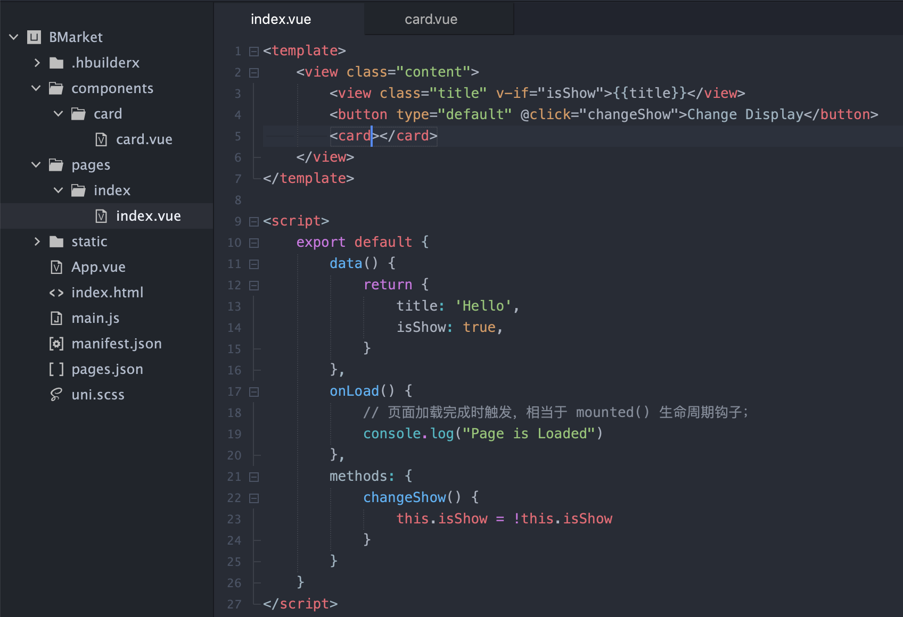

## Uni-App ?

> `Uni-App` 是一个使用`Vue`开发所有前端应用的框架；
>
> 开发者编写一套代码，可发布到iOS、Android、Web（响应式）；
>
> 以及各种小程序（微信/支付宝/百度/头条/飞书/QQ/快手/钉钉/淘宝）、快应用等多个平台；


#### 开始( Start )

> `uni-app`支持通过 HBuilder X、Vue-CLI 两种方式快速创建项目；
>
> ```shell
> # 使用 vue-cli创建 uni-app 小程序项目；
> vue create -p dcloudio/uni-preset-vue my-project
> ```


#### 结构( Structure )

> 以 HBuilder X 创建的项目为例的项目文件的基本结构；

|  目录或文件   |                     概述                     |
| :-----------: | :------------------------------------------: |
|  .hbuilderx   |            项目运行时存放临时文件            |
|     pages     |                 页面存放目录                 |
|    static     |               存放静态文件资源               |
|    App.vue    | 组件入口文件，相当于微信小程序的 app.js 文件 |
|  Index.html   |                页面 html 文件                |
|    main.js    |    应用入口文件，引入 Vue，注册 APP 组件     |
| manifest.json |                 项目配置文件                 |
|  pages.json   |                 页面配置文件                 |
|   uni.scss    |               项目通用样式文件               |

> 根据项目需求，需要创建其他的目录；

|    目录    |           概述           |
| :--------: | :----------------------: |
|   common   |     公用文件存放目录     |
| components |    自定义组件存放目录    |
|   store    |        Vuex 目录         |
| unpackage  | 项目编译后文件的存放目录 |


#### 单位( rpx )

> 在小程序中提出的尺寸单位，会根据设备尺寸的不同，自适应调整大小；
>
> 一般在 750px 的设备宽度在，`2rpx = 1px`；


## EasyCom

> 传统 Vue 组件，需要安装、引用、注册，三个步骤后才能使用组件；
>
> `easycom`将其精简为一步， 只要组件安装在项目的`components`目录下；
>
> 并符合`components/组件名称/组件名称.vue`目录结构，就可以不用引用、注册，直接在页面中使用；
>
> 


## API

> `uni-app`的 js API 由标准 ECMAScript 的 js API 和 uni 扩展 API 这两部分组成；
>
> 标准 ECMAScript js 仅是最基础的js；
>
> 浏览器基于它扩展了 window、document、navigator 等对象；
>
> 小程序也基于标准 js 扩展了各种 wx.xx、my.xx、swan.xx 的 API，NodeJs 也扩展了 fs 等模块；
>
> uni-app 基于 ECMAScript 扩展了`uni`对象，并且 API 命名与小程序保持兼容；


#### 路由跳转

> 页面、路由之间切换的 API ；


###### uni.navigateTo(Object)

> 保留当前页面，跳转到应用内的某个页面，使用`uni.navigateBack()`可以返回到原页面；
>
> ```javascript
> ```


## 条件编译

> 条件编译是用特殊的注释作为标记，在编译时根据这些特殊的**注释**，将注释里面的代码编译到不同平台；
>
> **写法：**以`#ifdef`或`#ifndef`加 `PLATFORM`开头，以`#endif`结尾；
>
> ```html
> <template>
>     <view class="content">
>        <view>没有限制，编译后所有平台都会有</view>
>        <!-- #ifdef H5 -->
>        <view>内容只会编译在 H5 平台</view>
>        <!-- #endif -->
>     
>        <!-- #ifndef APP-PLUS -->
>        <view>内容除了 App 平台之外，其他的都会编译</view>
>        <!-- #endif -->
>     </view>
> </template>
> ```


## 生命周期( LifeCycle )

> 小程序中在特定时间自动调用的函数；


#### 应用生命周期

> 整个小程序应用的生命周期，在`App.vue`中；
>
> ```javascript
> export default {
>   // 应用初始化启动完成执行，且全局只执行一次；
>   onLaunch: function() {
>     console.log('App Launch')
>   },
>   // 应用显示、从后台切换到前台时执行；
>   onShow: function() {
>     console.log('App Show')
>   },
>   // 应用隐藏、从前台切换到后台时执行；
>   onHide: function() {
>     console.log('App Hide')
>   }
> }
> ```


#### 页面生命周期

> 各个页面的生命周期函数；
>
> ```javascript
> export default {
>     data() {
>        return {
>          data: 'BMarket'
>        }
>     },
>     onLoad() {
>        // 页面加载时触发，相当于 Vue 中的 mounted() 生命周期钩子；
>     },
>     onReady() {
>        // 页面完成渲染时触发；
>     },
>     onShow() {
>        // 页面显示时触发；
>     },
>     onHide() {
>        // 页面隐藏时触发；
>     },
>     onUnload() {
>        // 页面卸载时触发；
>     },
>     methods: {
>        // 页面中使用的方法函数；
>     }
> }
> ```


#### 组件生命周期

> 自定义组件的生命周期；
>
> ```javascript
> ```
>

