# Vue?

是一套用于构建用户界面的渐进式`JavaScript`框架

[Vue2 官网]: https://v2.cn.vuejs.org/

Vue框架的特性，主要体现在 `数据驱动视图` 和 `双向数据绑定` 两个方面

- 数据驱动视图：Vue会监听数据的变化，然后自动重新渲染页面的结构

  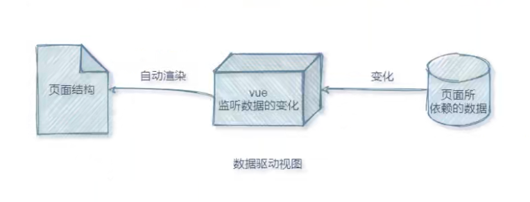

- 双向数据绑定：采集的数据发生变化， Vue会监听到，然后更新数据源，例如`v-model`指令


## `MVVM`

`MVVM` 是 Vue 实现 `数据驱动视图` 和 `双向数据绑定` 的核心原理
`MVVM` 指的是`Model`、`View`、`ViewModel`，可以将页面分成这三个部分

- `Model`：表示当前页面渲染时所依赖的数据源
- `View`：表示当前页面所渲染的 DOM 文档树结构
- `ViewModel`：表示 Vue 的实例，它是 MVVM 的核心

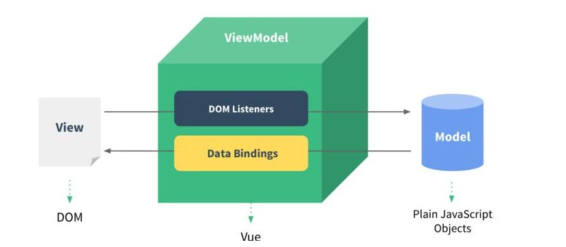

当数据源`Model`发生变化时，会被`ViewModel`监听到，再根据新的数据源更新页面结构`View`
当文档结构`DOM`的值发生变化时，也会被`ViewModel`监听到，再把新的数据值自动同步到数据源`Model`中


## 注入&挂载

Vue 会将`data`、`props`、`methods`里的成员，注入到实例身上，方便操作和使用

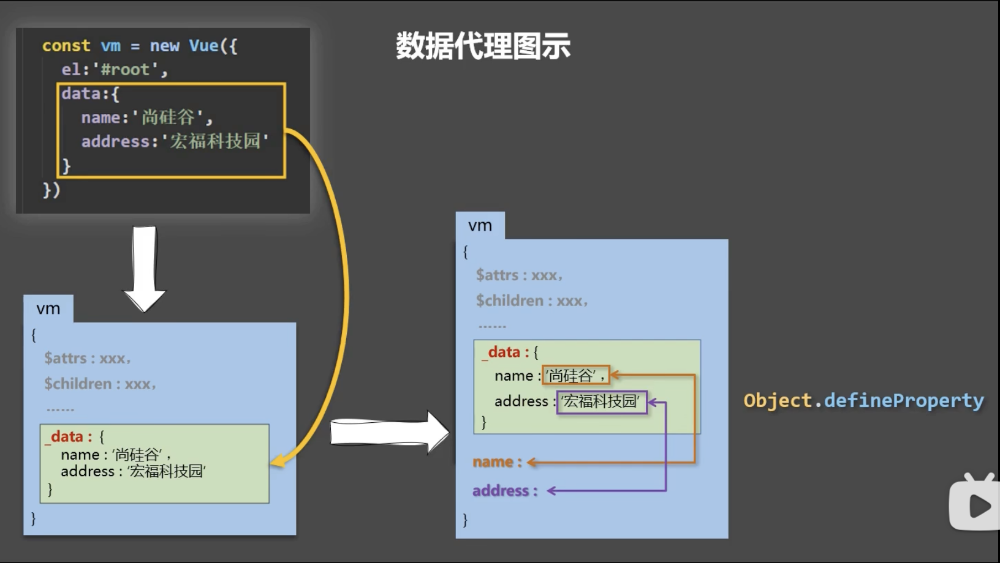

```javascript
// 1. 内部挂载
const vm = new Vue({
  el: '#app'
})

// 2. 外部挂载
new Vue({}).$mount('#app')
```


# 组件`component`

实现应用中**局部功能代码和资源**的集合和复用，简化项目编码，提高代码运行效率
组件是可复用的Vue实例对象

命名

```html
<!-- 连接符`kebab-case`写法 -->
<my-component />
<!-- 大驼峰写法，需要在 vue-cli 脚手架中才支持 -->
<MyComponent />
```

创建组件，组件中没有`el` 属性配置项

```javascript
// 创建一个 school 组件
const school = Vue.extend({
  // 使用 name 属性配置组件在开发者工具 vue-devtools 中呈现的名称
  name: 'School',
  // 配置组件中的 DOM 结构模版
  template: `
  <div>
  	<h3>{{schoolName}}</h3>
  	<h6>{{schoolAddress}}</h6>
  </div>`,
  // 组件中 data 属性必须要写成一个函数，把数据写在 return 对象里面；
  data() {
    return {
      schoolName: "Vue-School",
      schoolAddress: "BeiJing",
    }
  }
})
```

注册组件，根据需求分为**局部注册**和**全局注册**

- 局部注册
  ```js
  const vm = new Vue({
    el: "#app",
    data: { message: "Message" },
    // 在 vm 实例中局部注册 school 组件
    components: { school }
  })
  ```

- 全局注册
  ```js
  Vue.component('school', school)
  // 第一个参数时给组件命名
  // 第二个参数是组件的配置对象，告诉 Vue 要全局注册哪个组件
  
  // 异步组件注册示例
  Vue.component('async-example', function (resolve, reject) {
    setTimeout(function () {
      // 向 `resolve` 回调传递组件配置对象
      resolve({
        template: '<div>I am async!</div>'
      })
    }, 1000)
  })
  ```

使用组件，在`DOM`文档结构中写入组件标签，即组件的名称

```html
<div id="app">
  <h1>{{message}}</h1>
  <!-- 在页面结构中使用组件 -->
  <school></school>
  <!-- 或，如果组件没有内嵌内容，可以使用自闭合写法 -->
  <school />
</div>
```


## 组件嵌套

在一个组件中使用另外一个组件

```javascript
// 创建一个 student 组件
const student = Vue.extend({
  template: `
  <div>
		<h3>{{studentName}}</h3>
		<h6>{{studentAddress}}</h6>
  </div>
  `,
  data() {
    return {
      studentName: "Kein",
      studentAddress: "JiangXi"
    }
  }
})

// 创建一个 school 组件
const school = Vue.extend({
  // 配置组件中的 DOM 结构模版
  template: `
  <div>
  	<h3>{{schoolName}}</h3>
  	<h6>{{schoolAddress}}</h6>
  	<hr>
  	<!-- 在 school 组件模版中写入 student 组件标签，实现嵌套； -->
  	<student />
  </div>
  `,
  data() {
    return {
      schoolName: "Vue-School",
      schoolAddress: "BeiJing",
    }
  },
  // 在这里写入 components 属性，写入 student 组件，配置组件嵌套
  components: { student }
})

const vm = new Vue({
  el: "#app",
  template: `
  	<school />
  `,
  components: { school }
})
```


## 组件递归

常用于组件的自我内部注册，实现多重层级嵌套的解构

```html
<template>
	<ul>
    <li v-for="(item, index) in list" :key=index>
      <span v-if="!item.children.length">{{ item.name }}</span>
      <!-- 如果有子元素，则在模板中继续嵌套自身 -->
      <TreeNode v-else list-data="item.children" />
  	</li>
  </ul>
</template>
<script>
  export default {
    name: 'TreeNode', // 在递归组件中，必须要写 name 配置，否则模板中的组件会找不到导致报错
    props: {
      listData: {
        type: Array,
        default: () => []
      }
    },
    methods: {
      handleClick(item) {
        // 向父组件传递点击事件和数据
        this.$emit('click-node', item)
      }
    }
  }
</script>
```


## 异步组件

在代码层面，vue 组件的本质上是一个配置对象

```js
export default {
  data: () => {},
  props: {},
  methods: {},
  ...
}
```

但有的时候，要得到某个组件配置对象需要一个异步的加载过程，比如：

- 需要使用ajax获得某个数据之后才能加载该组件
- 为了合理的分包，组件配置对象需要通过`import()`动态加载

如果一个组件需要通过异步的方式得到组件配置对象，该组件可以把它做成一个异步组件

```js
/**
* 异步组件本质上是一个函数
* 该函数调用后返回一个 Promise，Promise 成功的结果是一个组件配置对象
**/
const AsyncComponent = () => import('./MyComp.vue')

// 注册组件
export default {
  // Vue 会调用该函数，并等待 Promise 完成，在这之前该组件位置什么也不渲染
  components: { AsyncComponent }
}
```

这里的异步组件工厂函数也可以返回一个如下格式的对象

```js
const AsyncComponent = () => ({
  // 需要加载的组件 (应该是一个 `Promise` 对象)
  component: import('./MyComponent.vue'),
  // 异步组件加载时使用的组件
  loading: LoadingComponent,
  // 加载失败时使用的组件
  error: ErrorComponent,
  // 展示加载时组件的延时时间。默认值是 200 (毫秒)
  delay: 200,
  // 如果提供了超时时间且组件加载也超时了，
  // 则使用加载失败时使用的组件。默认值是：`Infinity`
  timeout: 3000
})
```


## `VueComponent`

组件的本质是一个名为`VueComponent`的**构造函数**，是通过`Vue.extend()`方法生成的

```javascript
function VueComponent(options) { this._init(options) }
```

当在 DOM 结构中书写`<my-component />`组件标签时
Vue在解析模版的时候会创建组件`my-component`的实例对象vc
即Vue会执行`new VueComponent(options) `创建一个组件实例对象vc
组件中的`this`都指向`VueComponent`**构造函数**的实例对象vc
每次调用`Vue.extend()`都会返回一个全新的`VueComponent`构造函数

### 内置关系

```javascript
vm.__proto__ === VueComponent.prototype
VueComponent.prototype.__proto__ === Vue.prototype
```

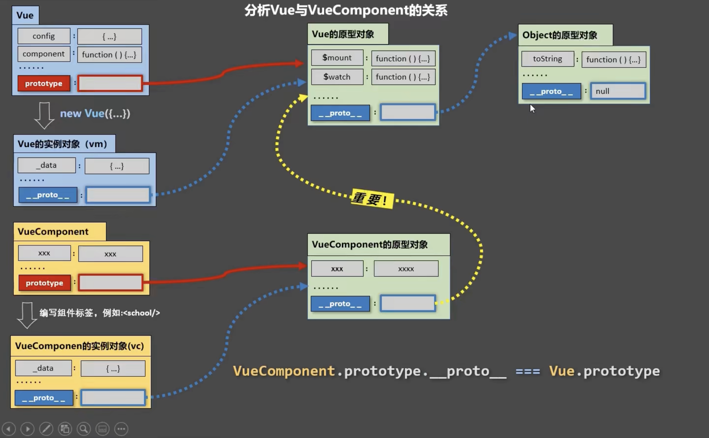

### Why ?

让组件的实例对象vm可以访问到`Vue`原型身上的属性和方法


# 全局`API`

## `Vue.set()`

向`data`中的响应式**对象**添加属性，具有实时响应的特性，会触发视图更新
`Vue.ser()`和`vm.$set()`是一样的效果
**不能向`data`添加属性，且不能设置`data`根目录下的属性**

```javascript
const vm = new Vue({
  data: {
    person: {
      name: "Kein",
      gender: 'Male'
    }
  }
})
// 给 person 对象中添加一个 age 属性
Vue.set(vm.person, 'age', 22)
// 另一种写法，在组建中的写法
vm.$set(vm.person, 'gender', 'A+')
```

> [!IMPORTANT]
>
> 在Vue2中直接用普通的对象属性赋值的方式添加的属性不具有响应式
> 因为`Object.defineProperty`无法监听新增属性、删除属性的操作，
> 在Vue3中的`Proxy`则不存在这个问题


## `Vue.delete()`

动态地删除响应式**对象**的属性，具有实时响应的特性，会触发视图更新

```javascript
Vue.delete(this.person, 'age')
// 实例上的 $delete()
this.$delete(this.person, 'age')
```


## `Vue.directive()`

全局定义**自定义指令**

```javascript
Vue.directive('enlarge', function(element, binding) {
  console.log(element)
  console.log(binding)
})
```


## `Vue.nextTick()`

在**下一次** DOM 更新结束后执行回调函数
将回调延迟到下次 DOM 更新循环之后执行
**使用场景：在改变数据后，要基于更新后的 DOM 进行操作**

```javascript
Vue.nextTick(callback())
// 实例和组件身上的 $nextTick() 生命周期
this.$nextTick(callback())
```


## `Vue.component()`

全局注册一个组件，任何地方都可以使用

```javascript
// 注册组件，传入一个扩展过的构造器
Vue.component('my-component', Vue.extend({ /* ... */ }))

// 注册组件，传入一个选项对象 (自动调用 Vue.extend)
Vue.component('my-component', { /* ... */ })

// 获取注册的组件 (始终返回构造器)
var MyComponent = Vue.component('my-component')
```


## `Vue.use()`

用于安装 Vue 的插件
**`Vue.use(plugin)`方法需要在调用 `new Vue()` 之前被调用**


## `Vue.mixin()`

`Vue.mixin()`全局注册一个混入，影响注册之后所有创建的每个 Vue 实例

```javascript
// 定义一个混入
const mixin = {
  // 生命周期函数
  mounted() {
    console.log("mixin 被使用了 !")
  }
}
// 全局注册一个混入
Vue.mixin(mixin)
```


# 指令`Directive`

指令`Directives`是 Vue 提供的模版语法，用于辅助渲染页面的基本结构

## `v-text`

`v-text`指令会覆盖掉标签原有的内容

```html
<body>
 <div id="app">
    <p v-text='name'></p>
    <p v-text='gender'>性别</p>
 </div>
 <script src="../vue.js"></script>
 <script>
    const vm = new Vue({
      el: '#app',
      data: {
        name: 'Kein',
        gender: 'Male'
      }
    })
 </script>
</body>
```


## `{{  }}`

**插值表达式（Mustache语法）**，只能用在元素的**内容节点**中，不能用在元素的**属性节点**中

```html
<body>
<div id="app">
  <p>{{ name }}</p>
  <p>性别：{{ gender }}</p>
</div>
<script src="../vue.js"></script>
<script>
  const vm = new Vue({
      el: '#app',
      data: {
        name: 'Kein',
        gender: 'Male',
        age: 22
      }
  })
</script>
</body>
```

支持`JavaScript`表达式

```html
<p>年龄：{{ age + 1 }}</p>
<!-- 三元运算： -->
{{ age? 22 : '年龄不详？' }}
<!-- 字符串拼接： -->
{{ name.split('').join(',') }}
```


## `v-html`

可以渲染带有 html 标签的字符串，相当于设置元素的`innerHTML`，会导致元素原本的内容失效
**直接在网站中使用`v-html`会有安全问题：容易导致`XSS （冒充用户之手）`攻击**

```html
<body>
 <div id="app">
    <!-- 将会在 <div> 标签里面生成一个 <h3> 标签； -->
    <div v-html='info'>
    </div>
 </div>
 <script src="../vue.js"></script>
 <script>
    const vm = new Vue({
      el: '#app',
      data: {
        info: '<h3 style = "color:#525960;"></h3>'
      }
    });
 </script>
</body>
```


## `v-bind:`

给元素的属性动态绑定属性值
单向绑定：`ViewModel` vm 实例对象中的数据传递给`View`视图

```html
<body>
 <div id="app">
    <form action="">
      <input type="text" v-bind:placeholder="hint">
      <!-- 简写： -->
      <input type="text" :placeholder="hint">
    </form>
  </div>
 </div>
<script src="../vue.js"></script>
<script>
  const vm = new Vue({
    el: '#app',
    data: {
      hint: '输入用户名'
    }
  })
</script>
</body>
```


## `v-on:`

为 DOM 元素绑定**事件监听**方法
语法格式：`<button v-on:click='functionName'>Click</button>`
简写形式：`<button @click='functionName'>Click</button>`

```html
<body>
<div id="app">
  <button v-on:click="addNumber">Click</button>
  <h3>{{ number }}</h3>
</div>
<script src="../vue.js"></script>
<script>
  const vm = new Vue({
      el: '#app',
      data: {
        number: 0
      },
      methods: {
        addNumber() {
          // Vue 构造函数里的 this 指向 vm 实例对象；
          this.number += 1;
        }
      }
  })
</script>
</body>
```

### `$event`

`$event`是Vue中的**事件对象**，相当于原生JavaScript函数中的 `event`

```html
<body>
 <div id="app">
    <button v-on:click="addNumber(1, $event)">Click</button>
    <h3>{{ number }}</h3>
 </div>
 <script src="../vue.js"></script>
 <script>
    const vm = new Vue({
      el: '#app',
      data: {
        number: 0
      },
      methods: {
        addNumber(n, e) {
          this.number += n;
          // $event 事件对象；
          console.log(e);
          if (this.number % 2 === 0) {
            e.target.style.backgroundColor = 'black';
          } else {
            e.target.style.backgroundColor = 'white';
          }
        }
      }
    })
 </script>
</body>
```

### 事件修饰符

| 事件修饰符 |                        功能                        |
| :--------: | :------------------------------------------------: |
|  .prevent  |   阻止默认行为，相当于 `event.preventDefault()`    |
|   .stop    | 阻止事件向上冒泡，相当于`event.stopPropagation()`  |
|  .capture  |                 为事件开启捕获模式                 |
|   .once    |           绑定此修饰符的事件只能触发一次           |
|   .self    | 只有在`event.target`是当前元素本身时才出发事件函数 |

```html
<body>
  <div id="app">
    <div @click="print">
      <!-- 阻止事件向上冒泡和标签的默认行为； -->
      <!-- 阻止点击 <a> 标签，<div> 标签也会触发事件函数; -->
      <a href="https://vuejs.org" @click.prevent.stop="print">阻止默认事件</a>
    </div>
  </div>
  <script src="../vue.js"></script>
  <script>
    const vm = new Vue({
      el: '#app',
      methods: {
        print() {
          console.log('Hello Vue !')
        }
      }
    })
  </script>
</body>
```

### 键盘修饰符

监听键盘触发的事件，相当于`event.key`或`event.keyCode`
用于获取具体的按键名，使事件函数只针对某个(或某几个)按键生效

| 按键修饰符 | 说明         |
| :--------- | :----------- |
| .enter     | 回车键       |
| .tab       | table 制表符 |
| .delete    | 删除键       |
| .esc       | 退出键       |
| .space     | 空格         |
| .up        | 上           |
| .down      | 下           |
| .left      | 左           |
| .right     | 右           |


## `v-model`

`v-model`双向数据绑定
在不操作 DOM 的情况下，快速获取`<form>`表单填写的数据，表单中的数据发生变化，会同步到 vm 实例中所对应的数据

修饰符，专为`v-model` 指令提供的修饰符，为了方便对表单的内容进行处理：

| 修饰符  | 作用                                           | 示例                           |
| :------ | :--------------------------------------------- | :----------------------------- |
| .number | 自动将表单的输入值转为`number`数据类型         | `<input v-model.number="age">` |
| .trim   | 自动过滤掉输入值的头尾空白符                   | `<input v-model.trim="name">`  |
| .lazy   | 在输入框失去焦点时才会同步 vm 对象实例中的数据 | `<input v-model.lazy="infor">` |

```html
<body>
  <div id="app">
    <form action="">
      <input type="text" v-model:value="username">
      <!-- 简写形式： -->
      <!-- <input type="text" v-model.trim="username"> -->
      <select v-model.lazy="city">
        <option value="1">上海</option>
        <option value="2">杭州</option>
        <option value="3">武汉</option>
      </select>
    </form>
  </div>
  <script src="../vue.js"></script>
  <script>
    const vm = new Vue({
      el: '#app',
      data: {
        username: 'Kein',
        city: 2
      }
    })
  </script>
</body>
```


## `v-if`

通过控制 DOM 元素是否存在来控制元素的显隐，有一个局部编译/卸载的过程
切换过程中合适地销毁和重建内部的事件监听和子组件
如果初始条件为假，则什么也不做，只有在条件第一次变为真时才开始局部编译

```html
<body>
  <div id="app">
    <button @click='switchFlag'>Switch</button>
    <p v-if="flag">这是 v-if 控制的元素</p>
    <!-- v-else-if 指令，须配合 v-if 指令一起使用，否侧不会被识别 -->
    <h5 v-if="grade === 'A'">优秀</h5>
    <h5 v-else-if="grade === 'B'">良好</h5>
    <h5 v-else-if="grade === 'C'">一般</h5>
    <h5 v-else="grade === 'D'">差劲</h5>
  </div>
  <script src="../vue.js"></script>
  <script>
    const vm = new Vue({
      el: '#app',
      data: {
        flag: false,
        grade: 'A'
      },
      methods: {
        switchFlag() {
          this.flag = !this.flag
        }
      }
    })
  </script>
</body>
```


## `v-show`

通过设置 DOM 元素的 display 样式，block 为显示，none 为隐藏，原理就是简单的基于css样式切换
任何条件下都会被编译，然后被缓存，且 DOM 元素时存在的

```html
<body>
<div id="app">
  <button @click='switchFlag'>Switch</button>
  <p v-show="flag">这是 v-show 控制的元素</p>
</div>
<script src="../vue.js"></script>
<script>
  const vm = new Vue({
      el: '#app',
      data: {
        flag: false
      },
      methods: {
        switchFlag() {
          this.flag = !this.flag;
        }
      }
  })
</script>
</body>
```


## `v-for`

循环渲染元素指令`v-for`
建议使用`v-for`循环渲染的时候，动态绑定一个`:key`属性，提升性能且防止列表状态紊乱
且`:key`的属性值尽量使用**稳定且唯一**的属性值

```html
<body>
 <div id="app">
    <ul>
      <!-- 循环生成 3 个 <li> 标签并填充对应内容； -->
      <li v-for="(person, index) in dataList" :key="person.id">
        <span>{{ person.name }}</span>
        <span>{{ person.age }}</span>
      </li>
    </ul>
 </div>
 <script src="../vue.js"></script>
 <script>
    const vm = new Vue({
      el: '#app',
      data: {
        dataList: [
          {id: 1,name: 'Kein',age: 23},
          {id: 2,name: 'ZouKai',age: 22},
          {id: 3,name: 'MuYi',age: 1}
        ]
      }
    })
 </script>
</body>
```

### `key`

`key`是Vue中的最重要的特殊属性，是虚拟 DOM 对象的标识
`key`可以干预 Vue 的`diff`算法
在同一层级的元素中，`key`属性值相同的会进行比对，不同的不会比对
建议使用`v-for`循环渲染的时候，动态绑定一个`:key`属性，提升性能且防止列表状态紊乱
且`:key`的属性值尽量使用**稳定且唯一**的

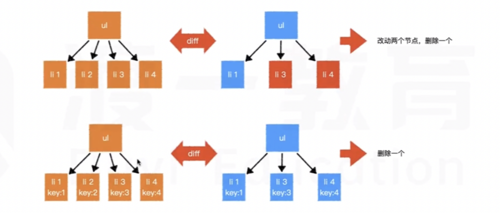

对比规则：

* 新旧虚拟 DOM 树的`key`值相同

  如果内容没变，则直接使用之前的真实 DOM 树
  内容变了，则生成新的真实 DOM 树，替换掉之前的

* 新旧虚拟 DOM 树的`key`值不同

  创建真实的 DOM 树，然后渲染到页面

> [!NOTE]
>
> 用`index`作为`key`值的问题：
> 若对数据进行**破坏顺序**的操作，会产生没必要的真实 DOM 树的更新，效率低


## `v-cloak`

解决加载JavaScript代码时产生的阻塞而导致页面有未渲染的模版

```html
<style>
  /* 属性选择器：选择所有带有 v-cloak 属性的标签 */
  [v-cloak]{
    display: none;
  }
</style>
<div>
  <!-- 给需要渲染依赖数据的标签加上 v-cloak 指令 -->
  <p v-cloak>{{ title }}</p>
</div>
```

等 Vue 脚本文件加载完毕，所管理的区域内的 v-cloak 都会被删除


## `v-once`

`v-once`所在节点在**初次动态渲染**后，就视为静态内容了
之后数据的改变不会引起该节点的更新，用于优化性能；

```html
<!-- 表示该元素只会被渲染一次，之后当作静态内容 -->
<div v-once>
  <h1>comment</h1>
  <p>{{msg}}</p>
</div>
```


## `v-pre`

跳过所在节点和它的子元素的编译过程，显示原始内容模版
**建议没有使用指令、插值语法的节点都加上，加快编译速度**

```html
<div>
  <!-- 此时 h2 标签不会被 Vue 处理，直接拿来用 -->
  <h2 v-pre>Hello Vue Framwork</h2>
</div>
```


## 自定义指令

语法：`directiveName(element, binding){}`
`element`：使用指令的真实 DOM 元素节点
`binding`：一个包含绑定信息的对象，描述了指令中提供的信息

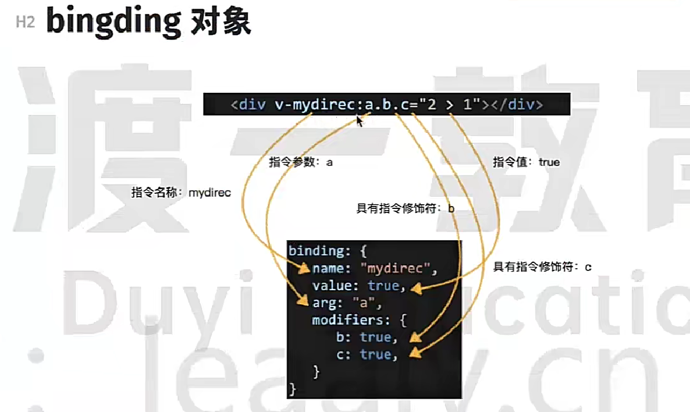

### 函数式

函数式的自定义指令什么时候调用？

- 未插入页面，指令与元素成功绑定时
- 指令所在的模版被重新解析时

```html
<body>
  <div id="app">
    <p>number 的值是：<span v-text="number" /></p>
    <p>(number + 1)的 10 倍是：<span v-enlarge="number + 1" /></p>
  </div>
  <script src="../vue.js"></script>
  <script>
    const vm = new Vue({
      el: "#app",
      data: {
        number: 2
      },
      // 自定义指令配置对象
      directives: {
        // 自定义一个 v-enlarge 指令；
        enlarge(element, binding) {
          console.log(element)
          console.log(binding)
          element.innerText = binding.value * 10
        },
      },
    })
  </script>
</body>
```

### 对象式

完整写法，可以控制在什么时候执行里面的哪个特定函数

```javascript
const vm = new Vue({
  el: '#app',
  data: { number: 2 },
  directives: {
    // 对象式自定义指令
    enlarge: {
      // 指令与元素成功绑定（一上来）调用
      bind(element, binding) {
        element.innerHTML = binding.value
      },
      // 指令所在元素被插入页面时调用
      inserted(element, binding) {
        element.parentElement.style.backgroundColor = '#fafafa'
      },
      // 指令所在的模版被重新解析时调用，虚拟节点更新时，即绑定的信息发生变化时调用
      update(element,binding) {
        element.innerHTML = binding.value
      }
    }
  }
})
```


# `ref`

Vue中的特殊属性，类似于`getElementById`方法，可以获取DOM元素
**写在html标签上，获取的是真实`DOM`元素，写在组件标签上，获取的是组件实例对象**

```html
<body>
 <div id="root">
   <h3 ref="title">Message</h3>
   <Message ref="component"></Message>
   <button @click="showDom">Click</button>
 </div>
 <script src="../vue.js"></script>
 <script>
   // 定义一个 Message 组件
   const Message = Vue.extend({
     name: "Message",
     data() {
       return {
         name: "Kein",
         gender: "Male",
         grade: "A+",
       }
     },
     template: `
     <div>
     	<h2>NAME: {{name}}</h2>
     	<h2>GENDER: {{gender}}</h2>
     	<h2>GRADE: {{grade}}</h2>
   	</div>
   	`
   })
   const vm = new Vue({
     el: "#root",
     methods: {
       showDom() {
         // 在原生 DOM 标签上，获取的是真实标签元素 <h3>Message</h3>
         console.log(this.$refs.title)
         // 在组件标签上，获取的是组件实例对象 vc 
         console.log(this.$refs.component)
       },
     },
     components: { Message }
   })
  </script>
</body>
```

> [!NOTE]
>
> 通过`ref`可以直接操作dom元素，甚至可能直接改动子组件，这些都不符合vue的设计理念
> 除非迫不得已，否则不要使用`ref`


# 生命周期

是 Vue 在关键时刻自动调用的一些特殊函数，又叫**生命周期回调函数**、**生命周期钩子**，其名称是固定的
所有生命周期钩子的 `this` 将自动绑定至 vm 实例对象
所以**不应该使用箭头函数来定义一个生命周期方法**


## `beforeCreate()`

在实例对象初始化之后，进行数据侦听和数据代理配置之前
此时 vm 实例对象中还没有`data`和`methods`

## `created()`

在 vm 实例对象被创建完成之后，挂载阶段还没开始

此时 Vue 开始解析模版，在内存中生成**虚拟`DOM`树**， el 属性还不可用

## `beforeMount()`

在 vm 实例对象被挂载到真实`DOM`文档结构之前

## `mounted()`

在 vm 实例对象被挂载到真实`DOM`树之后自动调用
页面上呈现的是经过 Vue 编译后的`DOM`元素
一般在此时，开启定时器、发送网络请求、订阅消息、绑定自定义事件......

## `beforeUpdate()`

在数据发生改变后，真实`DOM`文档内容被更新之前
此时数据还未与页面内容同步

## `updated()`

在数据更改导致的虚拟`DOM`重新渲染和更新完毕之后

## `activated()`

被`<keep-alive>`标签缓存的**路由组件**激活时自动调用

## `deactivated()`

`<keep-alive>`标签缓存的**路由组件**失效时调用

## `beforeDestroy()`

vm 实例对象销毁之前调用，此时，实例对象仍然完全可用
一般在此时，关闭定时器、取消订阅消息、解绑自定义事件等**收尾操作**

## `destroyed()`

在 vm 实例对象销毁之后
此时，对应 Vue 实例的所有指令都被解绑、事件监听器被移除、子实例也都被销毁

## `errorCaptured()`

在捕获一个来自子组件的错误时被调用，返回`false`以阻止该错误继续向上传播

```javascript
errorCaptured(err: Error, vm: Component, info: string) {
  return // boolean 数据类型
}
// 三个参数：错误对象、发生错误的组件实例、包含错误来源信息的字符串
```


# 组件配置项

## `data`

`data`是 vm 实例中的数据存放对象

### 对象式

```javascript
const vm = new Vue({
  data: {
    name: 'Kein'
  }
})
```

### 函数式

组件`component`中必须要用`函数式`写法

防止组件被多次使用时存在数据引用

```javascript
const vm = new Vue({
  data(){
    return {
      name: 'Kein'
    }
  }
})
```


## `props`

`props`可以是**数组**或**对象**

用于在`子组件`中接收来自`父组件`的数据

**组件通信方式**：`父组件 ==> 子组件`或`子组件 ==> 父组件（传递回调函数）`

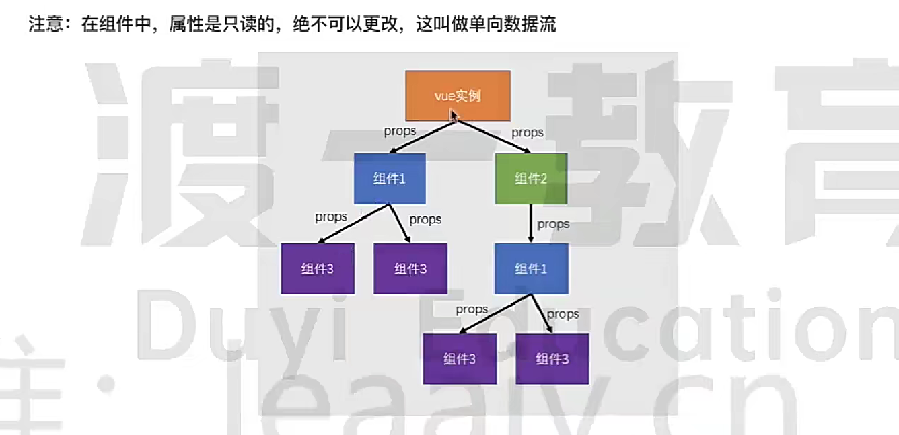

> [!IMPORTANT]
>
> `props`是只读的，进行修改会发出警告，可以在子组件`data`中定义一个中转属性数据

```html
<body>
  <div id="root">
    <!-- 给 Message 子组件中传递三个数据 -->
    <Message name="Kein" gender="Male" :age="22" />
  </div>
  <script src="../vue.js"></script>
  <script>
    // 定义一个 Message 组件
    const Message = Vue.extend({
      name: 'Message',
      data() {
        return {
          message: "Personal Message"
        }
      },
      /** 简单接收 **/
      // props: ["name", "gender", "age"],
      
      /** 接收的同时对数据进行类型的限制 **/
      // props: {
      //   name: String,
      //   gender: String,
      //   age: Number,
      // },
      
      /** 接收数据的同时，对数据类型、默认值、必要性进行限制 **/
      props: {
        name: {
          type: String,
          require: true,
          default: 'Kein'
        },
        gender: {
          type: String,
          require: true,
        },
        age: {
          type: Number,
          require: true,
        },
      },
      template: `
     	<div>
      	<h1>{{message}}</h1>
      	<hr>
      	<h2>{{name}}</h2>
      	<h2>{{gender}}</h2>
      	<h2>{{age + 1}}</h2>
     	</div>`
    })
    const vm = new Vue({
      el: "#root",
      components: { Message }
    })
  </script>
</body>
```


## `methods`

`methods`是 vm 实例中的方法的存放对象
所有被Vue管理的函数方法都不能写成箭头函数，会导致`this`指向有问题

```javascript
const vm = new Vue({
  methods: {
    print(){
      console.log('Hello Vue !')
    }
  }
})
```


##  `filters`

`filters `是 Vue 提供的功能，是一个对象，被 vm 实例所管理
一般用于**文本的格式化**，可以用在**插值表达式**或者**v-bind 动态属性绑定**中

```html
<!-- 在插值表达式中，调用 slice 过滤器，对 message 的值进行格式化； -->
<p>{{ message | slice }}</p>

<!-- 在 v-binf 动态属性绑定中，调用 format 过滤器，对 time 的值进行格式化； -->
<div v-bind:id="time | format"></div>
<!-- 所显示的值是过滤器函数返回的值，而不是原本的值； -->

<!-- 过滤器函数可以连续串联调用； -->
<p>{{ message | slice | format }}</p>
```

[^注意]:在 Vue3 中没有过滤器

### 过滤器函数

要定义在`filters`对象中，本质是函数，必须要用 return 返回一个值
**过滤器函数形参中的第一个值，永远都是所要进行格式化对象的值**
被添加在 JavaScript 表达式的尾部，用**管道符**`|`连接

```html
<body>
<div id="app">
  <p>{{ message | capital }}</p>
 </div>
  <script src="../vue.js"></script>
 <script>
    const vm = new Vue({
      el: '#app',
      data: {
        message: 'hello filters'
      },
      filters: {
        capital(value) {
          let change = value.toUpperCase();
          return change;
        }
      }
    });
  </script>
</body>
```

### 私有过滤器

在`filters`对象中定义的就是**私有过滤器**
只能在当前的 vm 实例中的 el 属性所控制的区域内使用

### 全局过滤器

在多个 vm 实例之间共享过滤器，则定义**全局过滤器**
在 Vue 构造函数上定义：`Vue.filter()`

```javascript
// 使用 Vue.filter() 定义全局过滤器
Vue.filter('capital', function (value) { 
  let change = value.toUpperCase()
  return change
})
```


## `watch`

数据监听
`watch `是 Vue 提供的功能，是一个对象，被 vm 实例所管理
`watch`可以监听数据的变化，然后作出特定的操作

```html
<body>
 <div id="app">
    <input type="text" v-model.lazy="username">
 </div>
 <script src="../vue.js"></script>
 <script>
    const vm = new Vue({
      el: '#app',
      data: {
        username: "Kein"
      },
      watch: {
        // 要监听哪个值，就用其作为函数名；
        // 新值在前，旧值在后；
        username(newValue, oldValue) {
          // 监听 username 值，当发生变化时，调用此监听器函数；
          console.log('username 的值发生变化了 ！');
          console.log('旧的值是：' + oldValue);
          console.log('新的值是：' + newValue);
        }
      }
   });
</script>
</body>
```

监听对象中的指定属性，而不是整个对象，监听器函数的名称要加一层单引号`''`

```javascript
// 监听对象中指定属性的值的变化，方法名要加一层单引号；
const vm = new Vue({
 el: '#app',
 data: {
    admin: {
      username: 'Kein'
    }
 },
 watch: {
    'admin.username'(newValue,oldValue){
      console.log('监听的是 admin 对象中的 username 属性的值；')
    }
 }
});
```

全局注册监听器，在 vm 对象实例上定义：`vm.$watch()`

```javascript
vm.$watch("admin", {
  handler(newValue, oldValue) {
    console.log("旧的值是:" + oldValue);
    console.log("新的值是:" + newValue);
  }
})
```

### immediate

函数形式的监听器只会在数据发生变化时才调用
将监听器写成对象形式，增加`immediate`属性，则初始化页面时就立即调用一次，默认值是 false 

```javascript
const vm = new Vue({
  el: '#app',
  data: {
    username: "Kein"
  },
  watch: {
    // 定义对象形式的监听器；
    username: {
      handler(newValue,oldValue){
        console.log('旧的值是：' + oldValue);
        console.log('新的值是：' + newValue);
      }
    },
    // 初始化页面时是就立即调用一次；
    immediate: true
  }
})
```

### deep

`deep`属性，可以让监听器深度监听目标对象中每个属性的变化
监听对象中的任何属性发生了变化，都会触发监听器，默认值是 false 

```javascript
const vm = new Vue({
  el: "#app",
  data: {
    admin: {
      username: "Kein",
    },
  },
  watch: {
    admin: {
      handler(newValue, oldValue) {
        console.log("旧的值是:" + oldValue);
        console.log("新的值是:" + newValue);
      },
      immediate: true,
      // deep 属性，可以让监听器深度监听目标对象中每个属性的变化；
      // 对象中的任何属性发生了变化，都会触发监听器；
      deep: true,
    }
  }
})
```


## `computed`

根据已有的属性进行计算得到的**属性**，可以被`{{  }}`和`methods`使用
计算属性是一个对象，被 vm 实例所管理
**`computed`会进行缓存，如果依赖项不变，则直接使用缓存，不会重新计算**
建议凡是根据已有数据计算得到新数据的无参函数，都写在`computed`中

### 函数式

```html
<body>
 <div id="app">
    R:<input v-model.number="r" /> 
    G:<input v-model.number="g" /> 
    B:<input v-model.number="b" />
    <!-- 使用计算属性 -->
    <div class="box" :style="{backgroundColor:rgb}" />
 </div>
 <script src="../vue.js"></script>
 <script>
    const vm = new Vue({
      el: "#app",
      data: {
        r:'',
        g:'',
        b:'',
      },
      computed: {
        // 计算属性定义的时候是方法或对象
        // 使用时直接当属性使用： this.rgb 
        rgb() {
          return `rgb(${this.r},${this.g},${this.b})`
        },
      },
    })
 </script>
</body>
```

### 对象式

```javascript
// 对象式（完整书写）
const vm = new Vue({
  computed: {
    rgb: {
      get() {
        // getter
        // 当 rgb 被读取时就会调用
        return `rgb(${this.r},${this.g},${this.b})`
      },
      set() {
        // setter
        // 可以省略不写，需要修改时添加
        // 当 rgb 被修改时才会调用
      }
    }
  }
})
```

### 实现原理

借助`Object.defineProperty()`提供的`get`和`set`方法
计算属性本质上是包含`getter`和`setter`的方法
当获取计算属性时，实际上是在调用计算属性的`getter`方法，vue会收集计算属性的依赖,并缓存计算属性的返回结果
只有当依赖变化后才会重新进行计算
计算属性通常是根据已有数据得到其他数据，并在得到数据的过程中不建议使用异步、当前时间、随机数等副作用操作
实际上，计算属性含义上也是一个数据，可以读取也可以赋值


## `render`

`render`函数的返回值是一个`VNode`**虚拟节点**，也就是要渲染的节点

```javascript
Vue({
  render: function(createElement) {
    return createElement('tagName')
  }
})

// 简写形式
Vue({
  render: (h) => h(App)
})
```


## `mixins`

`mixins` 属性接收一个混入对象的数组，用于把组件中可以共用的配置提取成一个混入对象；

### 定义混入

可以写在单独的文件中，然后导出；也可以写在同一文件里

```javascript
// 定义一个混入
const mixin = {
  // 生命周期函数
  mounted() {
    console.log("mixin 被使用了 !")
  }
}
```

### 使用混入

局部混入

```javascript
// 定义一个 School 组件；
const School = Vue.extend({
  name: "School",
  data() {
    return {
      name: "Vue School",
      address: "BeiJing",
    };
  },
  // 使用 mixins 混入属性配置局部使用混入；
  mixins: [mixin],
  template: `
	<div>
 	<h3>{{name}}</h3>
   <h3>{{address}}</h3>
 </div>
`,
});
```

全局混入

```javascript
// Vue.mixin() 方法注册一个全局可使用的混入；
Vue.mixin(mixin)
```


# 脚手架`@vue/cli `

`vue-cli`脚手架是 Vue 官方提供的标准化开发工具

## 使用

下载安装，全局安装`@vue/cli`脚手架工具

```shell
npm install @vue/cli --global
```

创建项目，`vue-cli`项目的目录下打开终端

```shell
# 项目名称中不能有大写字母
vue create projectname
```

启动项目

```shell
npm run serve
```


## 预编译

当vue-cli进行打包时，会直接把组件中的模板转换为`render`函数，这叫做**模板预编译**
这样做的好处在于：

1. 运行时就不再需要编译模板了，提高了运行效率
2. 打包结果中不再需要vue的编译代码，减少了打包体积

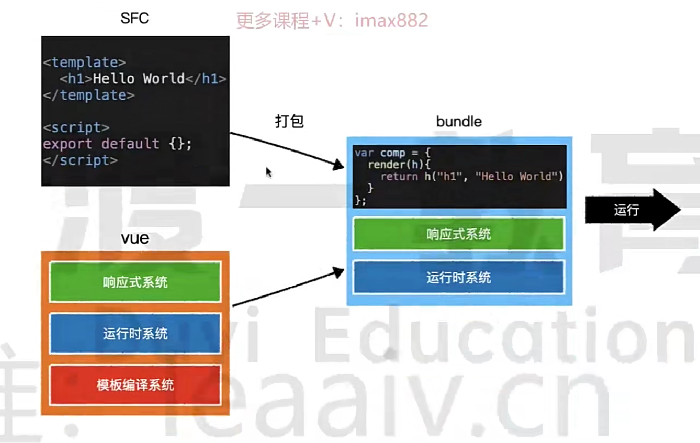


## `vue.config.js`

用来修改项目的一些默认配置，会与`webpack.config.js`的打包配置文件合并

```javascript
module.exports = {
  pages: {
    index: {
      // page 的入口
      entry: "src/index/main.js",
      // 模板来源
      template: "public/index.html",
      // 在 dist/index.html 的输出
      filename: "index.html",
    },
  },
  // 关闭 JavaScript 语法检查；
  lintOnSave: false,
  // 开启代理服务器；
  devServer: {
    // 设置要代理哪个服务器；
    proxy: 'http://localhost:3000'
  }
}
```

### 配置代理

配置代理服务器，解决开发时请求跨域的问题
在`vue.config.js`文件中配置`devServer.proxy`选项

- 单一代理

优先匹配前端资源，如果没有则将请求转发给目标服务器
**发送请求时将请求路径替换成本地运行的路径**

```javascript
url: "http://localhost:8080/data"
```

```javascript
module.exports = {
 devServer: {
    // 配置要代理的目标服务器；
    proxy: 'http://localhost:3000'
 }
}
```

- 多个代理

配置多个代理，可以控制哪些请求会通过代理服务器
**请求路径要加上代理前缀**

```javascript
url: "http://localhost:8080/api/data",
url: "http://localhost:8080/message/data",
```

```javascript
module.exports = {
 // 开启代理服务器；(方式二)
 devServer: {
    proxy: {
      // 为 /api 请求路径前缀开启代理；
      "/api": {
        // 目标服务器的基础路径；
        target: "http://localhost:3000",
        // 重写请求路径：因为目标服务器没有 /api 这个路径；
        pathRewrite: {
          "^/api": "",
        },
        // 用于支持 websocket ；
        ws: true,
        changeOrigin: true,
      },
      // 为 /message 请求路径前缀开启代理；
      "/message": {
        target: "http://localhost:5000",
        // 重写请求路径：因为目标服务器没有 /api 这个路径；
        pathRewrite: {
          "^/message": "",
        },
        // 用于支持 websocket ；
        ws: true,
        changeOrigin: true,
      },
    },
 }
}
```


## 局部样式`scoped`

`scoped`作用域样式
表示样式的选择器名称只在当前组件文件中有效，防止多个组件的样式冲突

```html
<!-- vue-cli 组件模版 -->
<template></template>
<script></script>
<style scoped></style>
```


## 打包优化

### 分析打包结果

由于`vue-cli`是利用`webpack`进行打包，我们仅需加入一个插件`webpack-bundle-analyzer`即可分析打包结果
```shell
npm install webpack-bundle-analyzer -D
```

```js
const BundleAnalyzerPlugin = require('webpack-bundle-analyzer').BundleAnalyzerPlugin

// vue.config.js
module.exports = {
  // 通过 configureWebpack 选项，可对 webpack 进行额外的配置
  // 该配置最终会和 vue-cli 的默认配置进行合并(webpack-merge)
  configureWebpack: {
    plugins: [
      new BundleAnalyzerPlugin()
    ]
  }
}
```

### 优化公共库打包体积

#### 使用`CDN`

`CDN`全称为`Content Delivery Network`，称之为**内容分发网络**
它的基本原理是：架设多台服务器，这些服务器定期从源站拿取资源保存本地
让不同地域的用户能够通过访问最近的服务器获得资源


首先，需要配置不需要进行打包的公共库

```js
// vue.config.js
module.exports = {
  configureWebpack: {
    externals: {
      vue: 'Vue',
      vuex: 'Vuex',
      'vue-router': 'VueRouter'
    }
  }
}
```

然后，在页面中手动引入对应的依赖

```html
<!DOCTYPE html>
<html lang="">
  <head>
    ...
  </head>
  <body>
    <!-- 在 `<%  %>` 中书写模板代码 -->
    <!-- 增加环境判断，在生产环境中才引入 cdn 链接 -->
    <% if(NODE_ENV === "production"){ %>
      <script src="https://cdn.bootcdn.net/ajax/libs/vue/2.6.12/vue.min.js"></script>
      <script src="https://cdn.bootcdn.net/ajax/libs/vuex/3.5.1/vuex.min.js"></script>
      <script src="https://cdn.bootcdn.net/ajax/libs/vue-router/3.4.7/vue-router.min.js"></script>
    <% } %>
  </body>
</html>
```

针对于向`vue-router`和`vuex`这样插件类型的库，则需要修改一下使用代码

```js
// cdn 引入的情况下，会存在一个全局变量 Vuex
// 如果有这个变量，则表示是用 cdn 方式引入，而不是 npm 依赖包引入
if (!window.Vuex) {
  Vue.use(Vuex)
}
```

#### 启用现代模式

为了兼容各种浏览器，`vue-cli`在内部使用了`@babel/present-env`对代码进行降级兼容
通过`.browserlistrc`文件里的配置来设置需要兼容的目标浏览器
但是对于那些使用现代浏览器的用户，它们也被迫使用了降级之后的代码
而降级后代码中包含了大量的`polyfill`导致增加了包的体积
因此，可以提供两种打包结果：

1. 降级后的包（大）：提供给旧浏览器用户使用
2. 未降级的包（小）：提供给现代浏览器用户使用

```shell
# 增加 --modern 开启现代模式的打包
vue-cli-service build --modern
```

### 页面分包优化

将一些不需要立即执行或显示的页面组件动态引入，则打包的时候会自动进行分包处理，而不是放在一个文件中
**使用`import()`动态引入组件，路由懒加载**

```js
// 动态引入组件
export default {
  name: 'Home',
  path: '/',
  component: () => import(/* webpackChunkName: "home" */'@/views/home/index.vue')
}
```

### 优化首屏响应

首页白屏会受到很多因素的影响
页面需要通过js构建，因此在js下载到本地之前，页面上什么也没有
一个非常简单有效的办法，即在页面中先渲染一个小的加载中效果，等到js下载到本地并运行后，即会自动替换

```html
<div id="app">
  <!-- 在容器中默认一个加载动画效果，等js加载完成后自动替换掉内容 -->
  
</div>
```


# 插槽`slot`

让父组件可以向子组件指定位置插入 html 结构
也是一种**组件通信的方式**：`父组件 <==> 子组件`

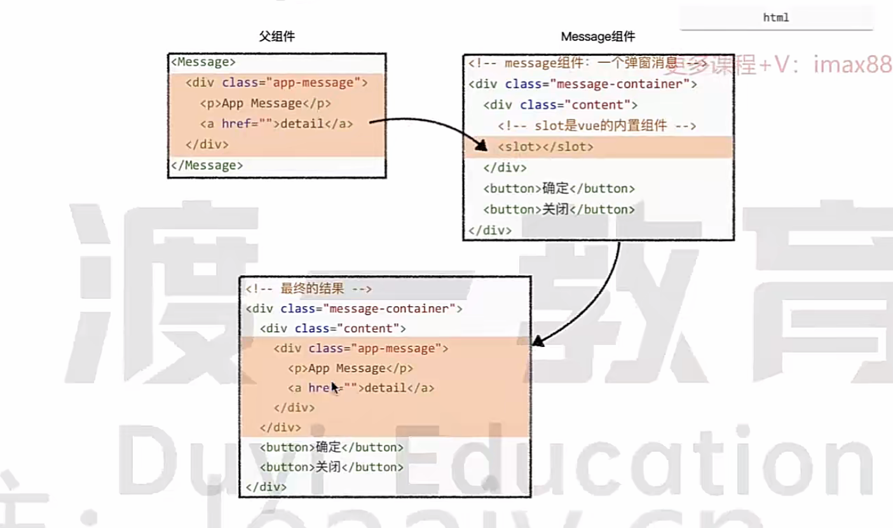


## 默认插槽

```html
<!-- 父组件 -->
<Category>
  
</Category>

<!-- 子组件 -->
<template>
  <div class="wrap">
    <!-- 定义一个 插槽，等待组件的使用者进行内容填充 -->
    <slot>
      默认值，当组件的使用者没有传递结构时，展现此内容
    </slot>
  </div>
</template>
```


## 具名插槽

如果某个组件中需要父元素传递多个区域的内容，也就意味着着需要提供多个插槽
为了避免冲突，就需要给不同的插槽赋予不同的名字：`<slot name="xxx">`

> [!NOTE]
>
> `v-slot:`指令可以用`#`号代替简写

```html
<!-- 父组件 -->
<Category>
  <!-- 根据插槽的名称分别指定填充的内容 -->
  
  <h3 slot="title">美食版块</h3>
  <!-- v-slot: 的简写形式 -->
  <template #link>
    <a href="#">a标签</a>
  </template>
</Category>

<!-- 子组件 -->
<template>
  <div class="wrap">
    <!-- 定义具名插槽，给 <slot> 标签添加 name 属性，定义插槽名称 -->
    <slot name="pic"> 默认值 </slot>
    <slot name="title"> 默认值 </slot>
    <slot name="link"> 默认值 </slot>
  </div>
</template>
```


## 作用域插槽

**通信方式**：`子组件 ==> 父组件`，父组件可以接收到子组件内部的数据
数据在组件自身，但根据数据生成的结构要组件的使用者决定
**作用域插槽要使用 <template> 标签包裹内容**

```vue
<!-- 父组件 -->
<Category>
  <!-- 用 scope 属性接受来自子组件的数据，保存为一个对象 -->
  <template #info="scope">
    <h3>{{ scope.title }}</h3>
    <ul>
      <li v-for="(item, index) in scope.list" :key="index">
        {{ item }}
      </li>
    </ul>
  </template>
  
  <!-- 简写形式 -->
  <template #btn="scope">
    <button>{{scope.title}}、{{scope.num}}</button>
  </template>
</Category>


<!-- 子组件 -->
<template>
  <div class="wrap">
    <!-- 将自身的数据传给父组件 -->
    <slot name="info" :list='list' :title='title'></slot>
    <slot name="btn" title="哈哈" :num="num"></slot>
  </div>
</template>

<script>
  export default {
    name: "Category",
    data() {
      return {
        list: ["Meat", "Vegetable", "Fruit"],
        title: 'Delicious',
        num: 20
      }
    }
  }
</script>
```


# 插件`Plugin`

**插件**用于增强 Vue 的功能，本质是一个**对象**，包含`install()`函数方法
`install()`函数接收的第一个参数是`Vue`**构造函数**

定义插件

```javascript
// 定义一个插件；
const plugin = {
  install(Vue) {
    console.log(Vue);
    // 在插件中全局定义一个过滤器
    Vue.filter("Capital", function (value) {
      let change = value.toUpperCase();
      return change;
    });
  },
}
```

使用`Vue.use()`方法

```javascript
// 使用一个插件
Vue.use(plugin)
```


# 实例方法

给**实例对象 vm** 和 **组件实例 vc **使用的方法或者属性


## `$forceUpdate()`

迫使 Vue 实例重新渲染；注意它仅仅影响**实例本身**和**插入插槽内容的子组件**，而不是所有子组件
触发 **beforeUpdate、updated** 生命周期

```javascript
// 作用
// 当在data中某个内容进行了改变、但是页面没有刷新、而控制台能进行打印证明数据确实改变了，此时就可以用来强制当前组件刷新
// 常见场景
// 在v-for循环或者某个操作中对data中的内容进行增加、修改、或者删除操作，data中的数据确实改变了，而且打印的内容也改   变了，但是页面却没有刷新达到理想效果
this.$forceUpdate()
```

## `$parent`

**只读**，**获取当前实例的父实例，如果当前实例有的话**

```javascript
this.$parent
```

## `$children`

**只读，获取当前实例的直接子组件，需要注意 `$children` 并不保证顺序，也不是响应式的；**

```js
this.$children
```

## `$emit()`

触发当前实例对象上的事件，一般用于**自定义事件**
语法： `vm.$emit('customEvent', ...any)`
**组件通信方式**：`子组件 ==> 父组件`

```html
<body>
  <div id="app">
    <h2>{{message}}</h2>
    <hr />
    <!-- 两种方法获取组件实例对象上的自定义事件 -->
    <School @get-name="getSchoolName" />
    <!-- 只触发一次 -->
    <!-- <School @get-name.once="getSchoolName"></School> -->
    <School ref="school" />
  </div>
  <script src="../node_modules/vue/dist/vue.js"></script>
  <script>
    // 定义 School 组件
    const School = Vue.extend({
      name: "School",
      template: `
        <div>
          <h3>{{name}}</h3>
          <h3>{{address}}</h3>
          <button @click="emitName">Click</button>
          <button @click="eventOff">Click</button>
        </div>
      `,
      data() {
        return {
          name: "Vue School",
          address: "BeiJing"
        }
      },
      methods: {
        emitName() {
          // 触发一个组件实例对象上的 get-name 自定义事件
          this.$emit("get-name", this.name)
        },
        eventOff() {
          // 解绑组件实例对象上的 get-name 自定义事件
          this.$off("get-name")
          // 解绑多个自定义事件
          // this.$off(["get-name", "get-address"])
          // 解绑所有自定义事件
          // this.$off()
        },
      },
    })
    
    const vm = new Vue({
      el: "#app",
      components: { School },
      data: {
        message: "School Message",
      },
      methods: {
        getSchoolName(name) {
          console.log("学校的名字是：" + name)
        },
      },
      mounted() {
        // 通过 ref 属性，获取组件实例对象 ==> 自定义事件
        this.$refs.school.$on("get-name", this.getSchoolName)
        // 只触发一次事件，箭头函数
        this.$refs.school.$once("get-name", (name) => {
          console.log("学校的名字是：" + name)
        })
      }
    })
  </script>
</body>
```

## `$listeners`

`$listeners`是一个实例属性，它**用于获取父组件传过来的所有事件函数**

```html
<!-- 父组件 -->
<Child @event_1="handleEvent_1" @event_2="handleEvent_2">
```

```js
<!-- 子组件 -->
this.$listeners = {
  event_1: handleEvent_1,
  event_2: handleEvent_2
}
```


# 全局事件总线

实现`任意组件之间通信`
首先使所有的 vm 和 vc 都能访问到这个实例对象，通过`$emit()`和`$on()`调用事件
在`Vue.prototype`上放置一个实例化对象，则所有的 vm 和 vc 都能访问到

```javascript
new Vue({
  el: "#app",
  // 利用 beforeCreate() 生命周期函数在初始化之前在 Vue.prototype 上放置一个实例化对象
  beforeCreate() {
    // 安装全局事件总线，将 vm 实例对象赋值给 $bus
    Vue.prototype.$bus = this
  }
})

// 其他组件中发送事件
this.$bus.$emit('passEvent', 'abc')

this.$bus.$on('passEvent', (data) => {
  console.log(data) // abc
})
```


# 数据仓库`Vuex`

一种组件间的通信方式：`任意组件之间通信`，实现**多组件之间数据共享**
**`vuex`存储的数据是非持久的，刷新网页后会被重置**

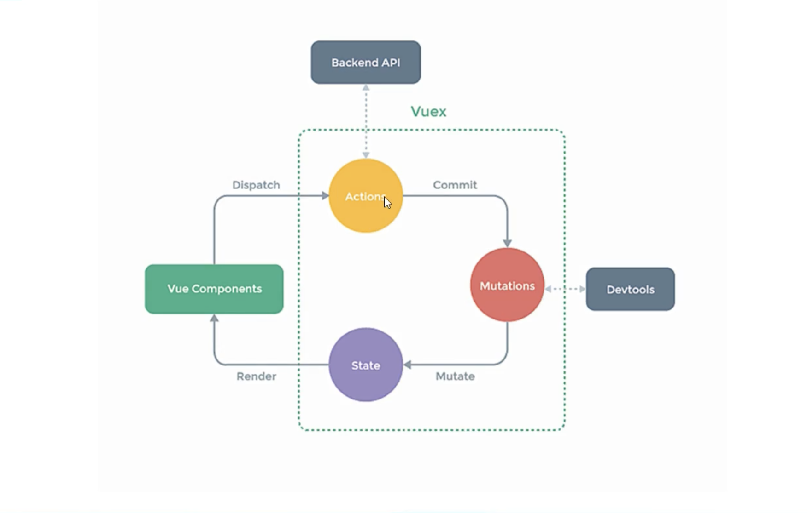


## 使用

下载依赖

```shell
npm install vuex --save
```

创建 Vuex 中最为核心的`store`，配置`src/store/index.js`文件

```javascript
import Vue from "vue"
import Vuex from "vuex"
// 使用 Vuex 插件
Vue.use(Vuex)

// 创建 actions，用于组件中的动作，逻辑业务写在 actions 对象里
const actions = {
  // 如果在 vuex 中需要执行异步操作，写在 actions 中
  asyncAdd(context, value) {
    return new Promise((resolve, reject) => {
      setTimeout(() => {
        context.commit('ADD', value)
        resolve(true)
      }, 2000)
    })
  }
}
// 创建 mutations ，用于操作 state 中的数据
// 1. mutations 中不得出现异步操作或有副作用的操作（异步、随机...）
// 2. 提交 mutations 是数据改变的唯一途径
const mutations = {
  ADD(state, value) {
    state.sum += value
  },
}
// 创建 state ，用于存储共享的数据
const state = {
  // 配置 sum 数据
  sum: 0
}

// 创建并向外导出 store
export default new Vuex.Store({
  actions,
  mutations,
  state,
  strict: true // 开启严格模式，只允许通过 mutations 改变仓库数据地状态
})
```

在`main.js`使用引入仓库

```javascript
// 引入 store 
import store from './store/index'

// 在实例中书写 store 属性，所有组件都会有 $store 属性对象
new Vue({
  render: (h) => h(App),
  store
}).$mount("#app")
```

在组件中使用仓库中地数据

```javascript
export default {
  computed: {
    sum() {
      return this.$store.state.sum
    }
  },
  methods: {
    add() {
      // 没有业务逻辑，跳过 actions 直接与 mutationos 对话
      this.$store.commit('ADD', this.number)
    },
    // 异步操作，使用 actions 处理异步操作
    asyncAction() {
      this.$store.dispatch('asyncAdd', this.number).then(() => {
        console.log('增加成功')
      })
    }
  }
}
```

store 对象中的`getters`属性配置项，用于加工`state`中的数据，类似于计算属性

```javascript
// 准备 getters ，用于加工 state 中的共享数据
const getters = {
  multipleSum(state) {
    return state.sum * 2
  }
}
// 在模版中使用数据
this.$store.getters.multipleSum
```

## 辅助函数

### `mapState`

辅助便捷地从`$store.state`中读取数据

```javascript
// 从 vuex 中引入
import { mapState } from "vuex"

export default {
  computed: {
    // 常规写法
    sum() {
      return this.$store.state.sum
    },
    // 借助 mapState 生成计算属性，从 $store.state 中读取数据
    ...mapState({ sum: "sum" }), // 对象写法
    // ...mapState(["sum"]), // 数组写法：前提是属性名和值一致
  }
}
```

### `mapGetters`

从`$store.getters`中读取数据

```javascript
// 从 vuex 中引入
import { mapGetters } from "vuex"

export default {
  computed: {
    // 常规写法
    multipleSum() {
      return this.$store.getters.multipleSum
    },
    
    // 借助 mapGetters 生成计算属性，从 $store.getters 中读取数据
    ...mapGetters(['multipleSum']),// 数组写法
  }
}
```

### `mapActions`

自动调用 dispatch 联系 actions 

```javascript
// 从 vuex 中引入
import { mapActions } from "vuex"

export default {
  methods: {
    // 常规写法
    evenAdd(number) {
      this.$store.dispatch("evenAdd", this.number)
    },
    
    // 利用 mapActions 生成对应的方法，会自动调用 dispatch 联系 actions
    ...mapActions(["evenAdd", "waitAdd"]) // 数组写法
  }
  
  // 模版中使用，将数据传递进方法
  // evenAdd(number)
}
```

### `mapMutations`

调用 commit 联系 mutations

```javascript
// 从 vuex 中引入
import { mapMutations } from "vuex"

export default {
  methods: {
    // 常规写法
    add(number) {
      this.$store.commit("ADD", this.number)
    },
    
    // 利用 mapMutations 生成对应的方法，自动调用 commit 联系 mutations
    ...mapMutations({add: "ADD",subtract: "SUBTRACT"})
  }
  
  // 模版中使用，将数据传递进方法
  // add(number)
}
```

> [!NOTE]
>
> `mapActions`与`mapMutations`生成的方法需要手动传递参数数据，否则`value`的值就是`$event`事件对象

## 模块化

让代码更好维护，让多种数据分类更加明确，**模块化 + 命名空间**

```javascript
import Vue from 'vue'
import Vuex from "vuex"
Vue.use(Vuex)

// 创建 personStore
const personStore = {
  // 开启 命名空间
  namespaced: true,
  actions: {
    addName(context, value){}
  },
  mutations: {
    ADD_PERSON(state, value){}
  },
  state: {},
  getters: {
    firstName(){}
  }
}

// 创建 numberStore
const numberStore = {
  namespaced: true,
  actions: {},
  mutations: {
    INITSTATE(state, value) {
      state.pointsInfoState = value
    },
  },
  state: {
    pointsInfoState: false
  },
  getters: {}
}

// 导出 personStore、numberStore
export default new Vuex.Store({
  modules: {
    personStore,
    numberStore
  }
})
```

模块化读取`state`中的数据

```javascript
export default {
  computed: {
    // 常规方式
    // this.$store.state.numberStore.sum
    // 利用 mapState
    ...mapState('numberStore', ['sum']),
    
    // 获取 store 中值，并且可以设置该计算属性的值
    pointsInfoState: {
      get() {
        return this.$store.state.mapRoute.pointsInfoState
      },
      set(value) {
        // 将改变的值同步到仓库中
        this.$store.commit("mapRoute/INITSTATE", value)
      }
    }
  }
}
```

读取`getters`中的数据

```javascript
// 常规方式
this.$store.getters['personStore/firstName']
// 利用 mapGetters
...mapGetters('personStore', ['firstName'])
```

组件中调用`dispatch`

```javascript
// 常规方式
this.$store.dispatch('personStore/addName', person)
// 利用 mapActions
...mapActions('personStore', ['addName'])
```

组件中调用`commit`

```javascript
// 常规方式
this.$store.commit('personStore/ADD_PERSON', person)
// 利用 mapMutations
...mapMutations('personStore', ['ADD_PERSON'])
```


# 数据仓库`pinia`

Pinia 是 Vue3 的专属状态管理库，它允许你跨组件或页面共享状态，用来代替 vuex


## 创建实例

创建一个 pinia 实例 (store) 并将其传递给应用

```js
// vue 3.0
import { createApp } from 'vue'
import { createPinia } from 'pinia'
import App from './App.vue'

const pinia = createPinia()
const app = createApp(App)

app.use(pinia)
app.mount('#app')


// vue 2.0
import { createPinia, PiniaVuePlugin } from 'pinia'

Vue.use(PiniaVuePlugin)
const pinia = createPinia()

new Vue({
el: '#app',
// 其他配置...
// ...
// 请注意，同一个`pinia'实例
// 可以在同一个页面的多个 Vue 应用中使用。 
pinia,
})
```

## 定义 Store

Store (如 Pinia) 是一个保存状态和业务逻辑的实体，**它承载着全局状态**
它有点像一个永远存在的组件，每个组件都可以读取和写入它
它有**三个概念**，[state](https://pinia.vuejs.org/zh/core-concepts/state.html)、[getter](https://pinia.vuejs.org/zh/core-concepts/getters.html) 和 [action](https://pinia.vuejs.org/zh/core-concepts/actions.html)

```js
import { defineStore } from 'pinia'
import { ref, reactive, computed } from 'vue'

// option store
export const useUserStore = defineStore('user', {
// 为了完整类型推理，推荐使用箭头函数
state: () => ({
 userInfo: {
   name: 'Kein',
   age: 23,
   gender: 'Male',
 },
}),
getters: {
 username: (state) => {
   return state.userInfo.name || ''
 },
},
actions: {
 // 不能使用箭头函数定义 action，因为節头函数鄉定外部 this
 changeName(value) {
   this.userInfo.name = value
 },
},
})


// setup store
export const useMapStore = defineStore('map', () => {
// state
const zoom = ref(10)
const mapCenter = ref([115.23243, 28.25284])

// getters
const lng = computed(() => {
 return mapCenter.value[0]
})
const lat = computed(() => {
 return mapCenter.value[1]
})

// actions
const addZoom = () => {
 zoom.value++
}
function reduceZoom() {
 zoom.value--
}

return {
 zoom,
 mapCenter,
 lng,
 lat,
 addZoom,
 reduceZoom
}
})
```

## 使用

在其他页面或组件中使用数据

```vue
<script setup>
import { useMapStore } from './store/map' // userStore
import { useUserStore } from './store/user' // mapStore
import { storeToRefs } from 'pinia'
const mapStore = useMapStore()
const userStore = useUserStore()

// 这是有问题的，因为这样拿到的数据不是响应式的，是一次性的
// Pinia 其实就是把 state 数据都做了 reactive 处理了
// const { userInfo } = userStore

// 把解构出来的数据做 ref 响应式代理
const { userInfo } = storeToRefs(userStore)
console.log(userInfo.value)

const reduceZooom = () => {
mapStore.reduceZoom()
}

const changeName = () => {
const value = userStore.username === 'Kein' ? 'LoveKein' : 'Kein'
// 方式一：直接改变数据
// userStore.userInfo.name = value

// 方式二：使用 $patch 函数
// userStore.$patch(state => {
// 	state.userInfo.name = value
// })

// 方式三：使用最多的时候是使用封装到 actions 中的方法改变数据
userStore.changeName(value)
}
</script>

<template>
<div class="container">
 <h4>UserStore</h4>
 <h6>username: {{ userStore.username }}</h6>
 <h6>userInfo: {{ userInfo }}</h6>
 <br>
 <h4>mapStore</h4>
 <h6>lng: {{ mapStore.lng }}</h6>
 <h6>lat: {{ mapStore.lat }}</h6>
 <h6>zoom: {{ mapStore.zoom }}</h6>
</div>
</template>
```


# 路由`vue-router`

Vue 中的一个**插件库**，专门用来实现`SPA`，`Single Page Web Application`，单页面 Web 应用


## SPA

整个应用只有一个完整的页面
点击页面中的链接**不会刷新页面**，只会做页面的**局部更新**，数据通过 Ajax 请求获取

## 路由

一个**路由**就是一组映射关系

### 前端路由

当浏览器的路径改变时，展现对应的组件内容，利用 Ajax 技术实现

### 后端路由

服务器收到一个请求时，根据`请求路径`匹配对应的`处理函数`来返回响应数据

```javascript
// 例子：NodeJs 中的 http 模块和 express 模块
app.get('/user',function(request, response) {
  response.send('Message')
})
```

## 使用路由

安装插件

```shell
npm install vue-router --save
```

创建路由文件，并导出路由插件，配置`src/router/index.js`文件

```javascript
import Vue from 'vue'
// 引入 vue-router 插件
import VueRouter from "vue-router"
// 使用插件
Vue.use(VueRouter)

// 引入要进行路由切换展现的组件
import Kein from "../components/Kein.vue"
import Muyin from "../components/Muyin.vue"

// 创建并向外暴露路由器
export default new VueRouter({
  routes: [
    /** 创建路由规则 **/
    // path 属性，指定请求路径
    // component 属性，指定该路径下要展现的组件
    { path: "/kein", component: Kein },
    { path: "/muyin", component: Muyin },
    
    // 重定向路径，访问网址时，立即定向该路径
    { path: '*', redirect: '/kein' }
  ]
})
```

在`main.js`中导入插件，并配置`router`属性

```js
// 引入路由器文件
import router from "./router/index"

new Vue({
  render: (h) => h(App),
  // 配置 router 属性，开启路由器
  // 开启后，每个组件都会有自己的 $route 属性对象，保存组件本身的路由信息
  router
}).$mount("#app")
```

在模板`<template>`中书写路由组件，指定路由切换时影响的区域

- `<router-link>`

  实现页面内容的切换，模拟`<a/>`标签

  - `active-class`属性，指定激活该链接时的样式

  - `to`属性，指定要跳转的请求路径，与 router 文件中的 path 路径相对应

  - `replace`属性，控制路由跳转时浏览器操作历史记录的模式。默认是push

    `push`是往后追加历史记录，`replace`是替换当前记录
    
  - `exact-path`属性，精确匹配路径，只匹配路路径中`path`那一部分，忽略`query`和`hash`

- `<router-view>`

  指定切换的组件内容要展示在什么位置

```html
<ul class="switch">
  <li>
    <!-- vue-router 中通过 <router-link> 标签实现页面内容的切换 -->
    <router-link class="router" active-class="active" to="/kein">Kein</router-link>
  </li>
  <li>
    <router-link class="router" active-class="active" to="/muyin">Muyin</router-link>
  </li>
</ul>
<div class="right">
  <h4>What Do You Choose To Show</h4>
  <!-- 指定切换的组件内容要展示在什么位置 -->
  <router-view />
</div>
```

> [!NOTE]
>
> **整个应用只有一个 router ，通过`this.$router`访问**
> 切换的组件会在**挂载**与**销毁**之间切换

## 路由模式

路由模式决定了：路由从哪里获取和改变访问路径？
`vue-router`提供了3种路由模式

```javascript
const router = VueRouter({
  // mode: 'hash',
  mode: 'history',
  routes: []
})
```

### `hash`

默认的路由模式，路由从浏览器地址栏中的hash部分获取路径，改变路径也是码支变的hash部分，该模式兼容性最好
`hash`模式下，url 路径中会带有`#`号，`#`号和其后面的内容就是**`hash`值**
`hash`值不会包含在请求路径中，不会被发送给服务器

```js
'http://localhost:8081/#/blog' --> /blog
'http://localhost:8081/about#/blog' --> /blog
```

> [!NOTE]
>
> `hash`模式下的网址通过手机 App 分享，若 App 校验严格，可能标记不合法

### `history`

路由从浏览器地址栏的`location.pathname`中获取路径，改变路径经使用的H5的`history api`
该模式可以让地址栏最友好，但需要浏览器支持`history api`
url 路径显示正常，全部都是请求路径发送给服务器
前端路由项目开发完成打包上线时要与后端配合，解决刷新报错 404 的问题

```js
'http://localhost:8081/#/blog' --> /
'http://localhost:8081/about#/blog' --> /about
'http://localhost:8081/blog' --> /blog
```

下载服务端应用插件：`connect-history-api-fallback`

```shell
npm install connect-history-api-fallback --save
```

### `abstract`

路由从内存中获取路径，改变路径也只是改动内存中的值
这种中模式通常应用到非浏览器环境中

```js
'内存：/' --> /
'内存：/about' --> /about
'内存: /blog' --> /blog
```

## 路由嵌套

在切换的路由组件中，还有一层要进行切换的组件

```javascript
export default new VueRouter({
  routes: [
    // 一级路由
    {
      path: "/kein",
      component: Kein,
      
      // 嵌套的二级路由
      children: [
        {
          // 二级路由的 path 路径不需要加 /
          path: 'name',
          component: Name
        },
        {
          path: 'gender',
          component: Gender
        }
      ]
    },
    {
      path: "/muyin",
      component: Muyin,
    },
  ]
})
```

切换的二级路由的`to`路径

```html
<router-link to="/kein/name">Name</router-link>
```

## 命名路由

给路由配置`name`属性，在传参路径很长的情况下可以简写代码

```javascript
export default new VueRouter({
  routes: [
    {
      // 配置 name 属性
      name: 'info',
      path: '/info',
      component: Infon,
      children: [
        {
          name: 'title',
          path: 'title',
          component: Title
        }
      ]
    }
  ]
})
```

路由跳转：直接通过`name`值匹配，而不是`path`

```html
<template>
  <div>
    <router-link :to={ name: 'title' }>
      Message
    </router-link>
  </div>
</template>
```

## 路由元数据

定义路由时配置的`meta`属性对象，可以用来保存**各个路由组件独有的信息**

```javascript
export default new VueRouter({
  routes: [
    {
      path: "/kein",
      component: Kein,
      // 路由组件元信息
      meta: { isShow: true }
    },
    {
      path: "/muyin",
      component: Muyin,
      meta: { isShow: true }
    }
  ]
})
```

## 滚动行为

使用前端路由，当切换到**新路由**时，想要页面滚到**顶部**，或者是**保持原先的滚动位置**，就像重新加载页面那样
**这个功能只在支持`history.pushState`的浏览器中可用**

```javascript
const router = new VueRouter({
  // 路由规则
  routes: [],
  // 滚动行为
  scrollBehavior (to, from, savedPosition) {
    // return 期望滚动到哪个的位置
    // x: scrollLeft, y: scrollTop
    return { x: number, y: number }
  }
})
```

## 路由传参

用来实现同一个组件结构根据参数显示不同的内容

### query

在向目标路径跳转时用**查询字符串**的形式传递参数

```html
<template>
  <div>
    <!-- 字符串写法，不美观，代码太长 -->
    <router-link to=`/infon/title?id=${infoList.id}&title=${infoList.title}`>
      Message
    </router-link>
    
    <!-- 对象写法 -->
    <router-link :to={
      path: '/infon/title',
      query: {
        id: infoList.id,
        title: infoList.title
      }
     }>
      Message
    </router-link>
  </div>
</template>

<script>
  export default {
    name: 'Info',
    data(){
      return {
        infoList: [
          {id:01,title: 'Name'},
          {id:02,title: 'Gender'},
          {id:03,title: 'Age'}
        ]
      }
    }
  }
</script>
```

则其他所有组件都可以从`this.$route.query`中获取当前路由的数据

```html
<template>
  <div>
    <h2>{{ $route.query.id }}</h2>
    <h2>{{ $route.query.title }}</h2>
  </div>
</template>
```

### params

配置路由文件时，声明接受的是`params`参数

```javascript
export default new VueRouter({
  routes: [
    {
      path: '/info',
      component: Infon,
      children: [
        {
          name: 'title',
          // 使用占位符声明接受 params 参数
          path: 'title/:id/:title?',
          // 在参数占位符后面加 ？ 号，表示该参数可传可不传
          // 此处则表示 title 参数可有可无
          component: Title
        }
      ]
    }
  ]
})
```

跳转路径时传递传递参数

```html
<!-- 字符串写法 -->
<router-link to='/info/title/${infoList.id}/${infoList.title}'>
  Message
</router-link>

<!-- 对象写法，接受 params 参数时，对象写法要用 name 代替 path 属性 -->
<!-- 传递参数时，`||`上`undefined`，解决参数可传可不传或空字符串导致的的问题 -->
<router-link :to={
  name: 'title',
  params: {
    id: infoList.id,
    title: infoList.title || undefined
  }
}>
  Message
</router-link>
```

接收： 通过`this.$route.params`获取数据

```html
<template>
  <div>
    <h2>{{ $route.params.id }}</h2>
    <h2>{{ $route.params.title }}</h2>
  </div>
</template>
```

> [!NOTE]
>
> 对象写法接收`query`参数时，既可以用`name`，也可以用`path`来标识目标路由
> 对象写法接收`params`参数时，要用`name`代替`path`属性

### props

路由的`props`配置，让路由组件更方便的接受参数

```javascript
{
  name:'title',
  path: 'title/:id',
  component: Title,
  // 对象写法，对象的中的键值对会通过 props 传递给该组件
  // props: { title: 'Kein' }
  
  // 布尔值写法，将接收到的 params 参数通过 props 传递给该组件
  // props: true
  
  // 函数写法，return 的键值对通过 props 传递给该组件
  props($route) {
    return {
      id: $route.query.id,
      title: $route.query.title
    }
  }
}
```

组件中通过`props`属性方便接受

```javascript
export default {
  name: 'Title',
  props:['id','title']
}
```

## 监测路由

**`this.$route`路由信息对象**可以被`watch`监听数据的响应式
路由信息本质上也是`data`中的响应式数据

```javascript
export default {
  watch: {
    $route(newValue, oldValue) {
      console.log(newValue)
    }
  }
}
```

## 编程式路由

不利用`<router-link>`标签实现路由跳转，使用`this.$router`调用方法

```javascript
export default {
  methods: {
    click_push(){
      this.$router.push({
        // 写法和 <router-link> 标签 to 属性的写法一样
        path: '/info/title',
        query: {
          id:001,
          title: 'Kein'
        }
      })
    },
    click_replace(){
      this.$router.replace({
        name: 'title',
        params: {
          id:001,
          title: 'Kein'
        }
      })
    }
  }
}

// 前进
this.$router.forward()
// 后退
this.$router.back()
// 指定前进或后退的步数，1 就是前进一步，-1 就是后退一步
this.$router.go(stepNumber)
```

### Problem

编程式路由导航如果**多次点击执行**，会报错，因为`"vue-router": "^3.5.3"`引入了`Promise`构造函数

### Resolve

1. 传递成功、失败的回调函数

```javascript
click(){
  this.$router.push(
    {
      path: '/info/title',
      query: {
        id:001,
        title: 'Kein'
      }
    },
    // 传入成功与失败的回调函数
    () => {},
    () => {}
  )
}
```

2. 在`router/index`文件中，重写原型链上的`push`和`replace`方法

```javascript
// 先将原本的方法保存起来
const originPush = VueRouter.prototype.push
const originReplace = VueRouter.prototype.replace
// 重写 push 和 replace 方法
VueRouter.prototype.push = function (location, resolve, reject) {
  if (resolve && reject) {
    // 如果用户传递了成功与失败的回调函数，则直接使用
    originPush.call(this, location, resolve, reject)
  } else {
    // 如果没传递，则在 location 后手动加上
    originPush.call(
      this,
      // loaction ，路由导航路径
      location,
      () => {},
      () => {}
    )
  }
}
VueRouter.prototype.replace = function (location, resolve, reject) {
  if (resolve && reject) {
    originReplace.call(this, location, resolve, reject)
  } else {
    originReplace.call(
      this,
      location,
      () => {},
      () => {}
    )
  }
}
```

## 缓存路由组件

让不展示的路由组件依旧保持**挂载**，而不是被**销毁**
`include`属性中传入要保持挂载的**组件名**，多个组件名之间用`,`逗号隔开
如果不写`include`属性，则该展示位置的所有切换的路由组件都被缓存

```html
<keep-alive include="Info">
	<router-view />
</keep-alive>
```

## 路由守卫

对路由进行**权限控制**，可以做一些前置性的操作

### 全局守卫

全局前置守卫：`router.beforeEach()`
全局后置守卫： `router.afterEach()`
**只要发生路由的跳转**，就会触发守卫

```javascript
const router = VueRouter({
  routes: [
    {
      name:'title',
      path: '/title',
      component: Title,
      // isAuth 属性，判定路由跳转是否需要判定权限
      meta: { isAuth: true, title: '分类'}
    }
  ]
})

/** 全局前置守卫，每次路由切换之前、初始化时执行 **/
router.beforeEach((to, from, next) => {
  /**
  * to: 即将进入地路由对象
  * from: 之前地路由对象
  * next: 确认导航跳转地函数
  ** 不传参，直接进入 to 的路由对象
  ** 传参，跳转到参数中的路由对象
  **/
  // 判断当前路由跳转是否需要进行权限控制
  if(to.meta.isAuth) {
    // 自定义权限控制的具体规则
    if(localStorage.getItem('title') === 'Kein'){
      // 权限控制正确
      next()
    }else {
      // 权限控制错误
      alert("暂无权限 ！")
    }
  }else {
    // 不需要权限控制
    next()
  }
})

/** 全局后置守卫，每次路由切换之后、初始化时执行 **/
router.afterEach((to, form) => {
  if(to.meta.title) {
    // 根据路由 meta 对象中自定义的 title 属性的值，修改网页标题
    document.title = to.meta.title
  } else {
    document.title = 'Hello'
  }
})
```

### 独享守卫

指定某个路由才拥有的守卫，**独享守卫只有前置守卫**，写在路由配置文件的**路由配置对象**中

```javascript
{
  name: 'title',
  path: '/title',
  component: Title,
  meta: {isAuth: true,title: '分类'},
  boforeEnter: (to, from, next) => {
    // 写法与 全局前置守卫 一样，接受三个参数；
    if(to.meta.isAuth) {
      if(localStorage.getItem('title') === 'Kein') {
        next()
      } else {
        alert("暂无权限 ！")
      }
    } else {
      next()
    }
  }
}
```

### 组件守卫

写在**组件文件**内的路由守卫
**通过路由`进入`该组件时被调用：**`beforeRouteEnter()`
**通过路由`离开`该组件时被调用：**`beforeRouteLeave()`

```javascript
export default {
  name: 'Title',
  mounted() {
    // 通过路由进入该组件时被调用；
    beforeRouteEnter(to, from, next) => {
      // 路由守卫规则配置
    }
    // 通过路由离开该组件时被调用
    beforeRouteLeave(to, from, next) => {
      // 路由守卫规则配置
    }
  }
}
```


# 开发技巧


## 路径简写

在 Vue 的配置中，路径中的`@`符号代表`src`文件夹，可以用`@`符号代替书写
在**样式文件**中也可以使用`@`符号，但是前面要加`~`，例如`~@`

## 页面刷新

在 Vue 中刷新页面的方案

1. 通过`location.reload()`或者`$router.go(0)`，相当于按下`F5`键

```js
refreshPage() {
  this.$router.go(0)
  // window.location.reload()
}
// 缺点：会出现空白页面，体验感较差
```

2. 通过一个空白页面来过渡

```js
// 要刷新的页面
this.$router.replace('/blank?redirect=' + this.$route.path)

// 空白页面
this.$router.replace(this.$route.query.redirect)

// 缺点：浏览器地址栏会有一个切换的过程
```

3. 通过让`<router-view>`组件快速地销毁然后初始化

```vue
<template>
	<router-view v-if='isShow' />
</template>

<script>
  export default {
    data() {
      return {
        isShow: true // 通过变量控制组件的销毁和初始化
      }
    },
    methods: {
      refreshPage() {
        this.isShow = false
        setTimeout(() => {
          this.isShow = true
        }, 50)
      }
    }
  }
</script>
<!-- 推荐使用 -->
```

## 错误捕捉

统一处理捕捉组件发生错误时的信息

```js
// 在顶级组件 App 中书写
export default {
  errorCaptured(err, vm, info) {
    // err: 具体的错误信息
    // vm: 发生错误的组件
    // info: 错误信息，指出哪一个地方出现报错
    console.log("errorCaptured", err, vm, info)
  }
}
```

## 404页面

解决输入的路径无法正确匹配显示空白的问题

```js
/** 路由配置，在最后写上一个错误路由的匹配对象 **/
import NotFound from './NotFound.vue'
export default new VueRouter({
  routes: [
    '其他路由',
    {
      name: 'NotFound',
      path: '*', // 通配符匹配，之前所有路由都没匹配的都会被通配符匹配
      component: NotFound
    }
  ]
})

```

```html
<template>
  <div>
    404 页面
  </div>
</template>
<script>
  export default {
    name: 'NotFound'
  }
</script>
```

```js
// 在其他地方进行错误处理
this.$router.push('/404')
```


# `Vue3`

## 效率提升

vue3的效率提升主要体现在以下方面

### 静态提升

组件中没有绑定动态数据的节点和标签会被提升到`render`函数之外，只创建一次，而不是每次渲染都重新创建

- 静态节点只创建一次，节省内存
- 提升`VDOM`比较效率，静态节点在`diff`过程中直接跳过比较

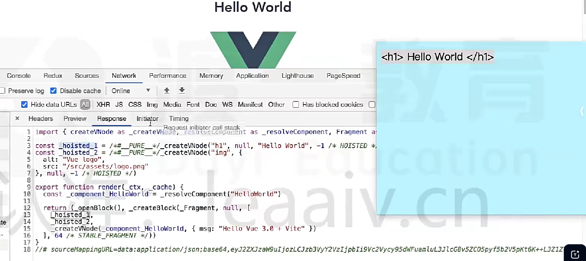

```html
<div>
  <h1>标题</h1>  <!-- 静态内容 -->
  <p>{{ message }}</p>  <!-- 动态内容 -->
</div>
```

```js
// vue2
function render() {
  // ...
  createVNode('h1', null, '标题')
}

// vue3
// 静态内容只创建一次（提升到渲染函数外部）
const _hoisted_1 = createVNode('h1', null, '标题')
// 渲染函数只处理动态部分
function render(ctx, cache) {
  return createVNode('div', null, [
    _hoisted_1,  // 复用静态节点
    createVNode("p", null, ctx.message) // 动态节点
  ])
}
```

没有被动态绑定的标签静态属性也会被提升

```html
<div class="user">
  {{ user.name }}
</div>
```

```js
const hoisted = { class: 'user' }
function render() {
  createVNode('div', hoisted, user.name)
}
```

### 预字符串化

当编译器遇到**大量连续的静态内容**，编译器会将html内容直接转换为js字符串字面量
在`render`直接使用，而非动态创建`VNode`

这样就可以减少大量的不必要的`VNode`生成，在`SSR`中效果尤为明显

```html
<div class="container">
  <h1>欢迎使用Vue3</h1>  <!-- 静态内容 -->
  <p>{{ message }}</p>    <!-- 动态内容 -->
</div>
```

```js
// 静态部分预编译为字符串，运行时直接使用
const _static_1 = '<div class="container"><h1>欢迎使用Vue3</h1>'

function render(ctx) {
  return _static_1 + '<p>' + ctx.message + '</p></div>'
}
```

### 缓存事件处理函数

编译器会自动缓存内联事件处理函数，避免每次`redner`时都创建新的函数实例

```html
<button @click="() => count++">点击</button>
```

```js
// 使用缓存数组存储事件处理函数
function render(ctx, cache) {
  return createVNode("button", {
    onClick: cache[0] || (cache[0] = () => ctx.count++)
  });
}
```

### `Block Tree`

将模板划分为多个区块（Block），每个区块都是一个独立的更新单元，区块树是由这些区块组成的层级结构
`Block Tree`通过标记动态节点，将更新范围精确到发生变化的区块，从而减少不必要的`DOM`操作

vue2在对比新旧树的时候，并不知道哪些节点是静态的哪些是动态的，因此只能一层一层比较
浪费了大部分时间在比对静态节点上

```html
<div>
  <p>静态内容</p>  <!-- 普通节点 -->
  <ChildComponent :msg="dynamicMsg" />  <!-- 动态组件，会被视为一个区块 -->
  <div :class="dynamicClass">动态内容</div>  <!-- 动态节点，会被视为一个区块 -->
</div>
```

### `PatchFlag`

补丁标记，编译器为动态节点添加的特殊标记，用于在运行时快速识别哪些属性或内容需要更新

传统虚拟DOM在更新时需要递归比较每个节点的所有属性，而`PatchFlag`让Vue只需检查标记的动态部分
大幅提高了比较效率

每个`PatchFlag`都对应一种特定的动态类型：

| 类型       | 描述                      |
| ---------- | ------------------------- |
| TEXT       | 文本内容动态变化          |
| CLASS      | class 绑定动态变化        |
| STYLE      | style 绑定动态变化        |
| PROPS      | 一个或多个 props 动态变化 |
| FULL_PROPS | 所有 props 都需要动态比较 |

```js
// 编译后的渲染函数可能会包含这样的标记
createVNode(
  'div',
  { class: 'container' },
  [
    createVNode('p', null, '静态文本'),
    createVNode('span', { class: patchFlag(1 /* CLASS */) }, currentValue)
  ]
)
// 这里的patchFlag(1)表示这个节点的 class 属性是动态的，更新时只需检查 class 是否变化
```


## 为什么去掉`Vue`构造函数？

- `Composition API`的设计需求
  通过组合式函数（如 `setup()`）替代了vue2的选项式API，组件逻辑被拆分为多个独立函数
- 更好的`TS`支持
  vue2的构造函数在类型推导上存在局限性，尤其是在处理复杂组件逻辑时
  vue3使用函数式API后，类型可以更自然地从函数参数和返回值中推导出来，提升了类型安全性
- `Tree-shaking`优化
  vue3的代码结构更适合`Tree-shaking`，未使用的功能可以在打包时被自动排除，减少包体积
- 更利于隔离应用
  如果一个页面有多个vue应用，在vue2中使用构造函数的静态方法会对所有应用都产生影响，不利于隔离
  而使用`createApp`函数接收一个根组件参数，并可以链式调用，互相不产生影响


## `setup`

vue3中一个新的配置项，是一个函数，`setup()`是所有`Composition API`**表演的舞台**

`setup()`优先于所有生命周期函数执行，且`setup()`中的`this `是`undefined`

```vue
<script>
 export default {
    name: "App",
    setup() {
      // 组件挂载
      onMounted(() => {
        console.log('onMounted')
      })
      // 数据，此处的数据不是响应式
      let title = "Vue 3.0";
      let course = "BiliBili";

      // 方法
      function sayHello() {
        alert(`在 ${ course }学习${ title }`);
      }
      
      // 返回的属性才可以在模板中使用
      return {
        title,
        course,
        sayHello
      }
    }
 }
</script>


<!-- setup 语法糖 -->
<script setup>
 // 在 <script> 标签中书写 setup 属性
 // 不需要 return 返回值
 import { reactive, ref } from "vue"
 const person = reactive({
    name: "Kyle",
    gender: "Male",
 })
 let number = ref(1)
 function changeNumber(type) {
    if (type == "add") {
      number.value++
    } else if (type == "subtract") {
      number.value--
    }
 }
</script>
```

`setup(props, context)`接受两个参数

- `props`：对象，包含父组件传递过来，且组件本身声明接受的属性
- `context`：上下文对象
  - `attrs`：包含父组件传递过来，但是没在``props``中声明的属性，相当于2版本中的`this.$attrs`
  - `slots`：收到的插槽的内容，相当于2版本的`this.$slots`
  - `emit`：用来分发自定义事件的函数，相当于`this.$emit`


## `ref()`

```javascript
// 导入
import { ref, reactive } from 'vue'

const obj = { name: 'Kyle', age: 26 }

const countRef = ref(0)
countRef.value++

// 如果传值是一个对象，则内部通过`reactive`函数进行代理
const objRef = ref(obj)
objRef.value.name
objRef.value.gender = 'Male'

// 如果传值已经是一个代理对象，则直接返回代理对象
const objReactive = reactive(obj)
const reRef = ref(objReactive)
reRef.value === objReactive // true
```


## `toRef()`

将响应式数据中的某个属性单独提供给外部使用，且数据是响应式的

```javascript
const person = reactive({
  name: 'Kein',
  gender: 'Male'
})
const myName = toRef(person,'name')
myName.value = 'Kyle' // 改变会同步到 person 对象中
console.log(person.name) // 'Kyle'
```


## `toRefs()`

与`toRef()`功能一致，但可以创建多个 ref 实例对象

```js
// toRefs() 与 reactive() 配合，解构变量，优化书写
const state = reactive({
  name: 'Kein',
  gender: 'Male'
})
const { name, gender } = toRefs(state)
name.value = 'Kyle'
gender.value
```


## `reactive()`

接受一个对象类型的参数，返回一个**代理对象(Proxy实例)**，不能代理基本类型数据

```js
export default {
  name: 'Message',
  setup() {
    // 定义对象类型的响应式数据
    const person = reactive({
      name:'Kein',
      age:22,
      gender: 'Male'
    })
    
    // 更改数据
    person.name = 'MuYin'
    person.gender = 'Female'
  }

```

模版中使用数据

```html
<h3>{{ person.name }}</h3>
<h3>{{ person.age }}</h3>
```


## `readonly()`

不希望数据被修改的情况，让一个响应式的数据变为**只读**，不可修改

```javascript
const private = readonly(person)

// shallowReadonly() 让响应式数据的最外层属性变成只读（浅只读）
const p = shallowReadonly(person)
```


## `computed()`

Vue3提供的计算属性

```js
import { computed } from 'vue'

const number = ref(1)
// 函数式
let multipleNumber = computed(() => {
  return number.value * 4
})

// 对象式，官方不建议这么用
const canSetNumber = computed({
  get: () => {
    return number.value*2
  },
  set: (value) => {
    number.value = Math.sin(value)
  }
})

// 读取数据时，根据函数内部的依赖是否有变化，来确定回调函数是否执行
multipleNumber.value

// 在模版中使用
// <p>{{ multipleNumber }}</p>
```


## `watchEffect(callback)`

`callback`回调函数初始化会立即执行一次（同步执行），然后收集回调函数中用到的响应式数据，数据发生变化后才会再次执行

```javascript
import { reactive, watchEffect, ref } from 'vue'

const state = reactive({ a: 1, b: 2 })
const count = ref(0)

const stop = watchEffect(() => {
  console.log(count.value, state.a)
})

count.value++ // 是回调中的响应式数据，发生变化，回调执行

state.b = 4 // 即使回调中有state，但是使用是的是属性a，属性b发生改变不会引起回调的执行

// 发生连续的改变，并不是每次都会触发回调执行
state.a++
state.a++
state.a++
state.a++
// 回调只会运行一次，此时 state.a = 5
// callback 回调是异步的，vue内部将他放在了微队列中执行，所以同步代码中会等数据改变完成后再运行一次

// 停止监听
stop()
```


## `watch()`

- `ref`的监听方式：因为`ref`创建的是一个包装对象，其值存储在`.value`中，监听时可以直接传入`ref`本身，会自动解包

  ```js
  const count = ref(0)
  watch(count, (newVal, oldVal) => {
    console.log('count changed:', newVal)
  })
  ```

- `reactive`的监听方式：监听时需要传入一个返回该对象属性的函数

  ```js
  const state = reactive({ count: 0 })
  watch(
    () => state.count, // 建议监听对象中的某个属性
    (newVal, oldVal) => {
      console.log('count:', oldVal)
      console.log('count changed:', newVal)
    },
    {
      // 监听对象属性时，deep 值默认为 false， 为了防止对象属性的嵌套，导致 深层监听
      deep: false, 
      immediate: true // 开启立即监听
    }
  )
  ```

  为什么要避免直接监听`reactive`代理的整个对象？
  因为会递归深层监听所有属性，对象中任何属性的更改都会触发回调，所以旧值与新值是同一个对象（引用值）

  ```js
  watch(state, (newState, oldState) => {
    // 此处newState === oldState，且任何嵌套属性变化都会触发
  }, {
    deep: false // 此处 deep 配置无效，强制开启深度监视
  })
  ```

  监听`reactive`中嵌套对象：

  ```js
  const state = reactive({
    user: {
      profile: {
        name: 'John',
        age: 30
      }
    }
  })
  // 只监听 state.user.profile 对象的 引用值 是否变化，改变其属性不触发回调
  watch(
    () => state.user.profile,
    (newProfile, oldProfile) => {
      console.log('profile changed')
    }
  )
  // 修改 name（嵌套属性）不会触发监听
  state.user.profile.name = 'Jane' // ❌ 不触发
  // 替换整个 profile 对象会触发监听
  state.user.profile = { name: 'Jane', age: 31 } // ✅ 触发
  ```

- 监听多个数据：用`[]`数组包裹要监听的数据
  ```js
  const count = ref(0)
  const state = reactive({ count: 0 })
  
  watch([count, () => state.count], (newValue, oldValue) => {
    consloe.log(newValue, oldValue)
  })
  ```

> [!NOTE]
>
> 无论是`watchEffect`还是`watch`，当依赖项有变化时，回调函数的执行都是异步的（微队列）
>
> 但是`watchEffect`第一次初始化运行是同步执行；`watch`配置`immediate = true`也会立即同步执行一次


## `toRaw()`

将一个`reactive()`生成的响应式对象转为普通对象，对其操作不会引起页面的更新

```javascript
const p = toRaw(person)

// markRaw()  
// 标记一个对象，使其永远不会再成为响应式对象；
const p = markRaw(person)
```


## `customRef()`

创建自定义的`ref `，并对其依赖项跟踪和更新触发进行显式控制
接收`track`和`trigger`函数作为参数，返回一个带有`get`和`set`的对象

实现快速输入防抖效果

```javascript
import { customRef } from 'vue'

function userRef(value, delay = 200) {
  let timeout
  return customRef((track, trigger) => {
    return {
      get() {
        // 通知 Vue 追踪 value 的变化
        track()
        return value
      },
      set(newValue) {
        // 防抖
        clearTimeout(timeout)
        timeout = setTimeout(() => {
          value = newValue
          // 通知 Vue 去重新解析模版
          trigger()
        }, delay)
      }
    }
  })
}

export default {
  setup() {
    return {
      text: userRef('hello')
    }
  }
}
```

```html
<input v-model="text" />
```


## `Provide & Inject`

实现`父组件 ==> 后代组件`之间通信；

无论组件层次结构有多深，**父组件**都可以作为其**所有子组件**的依赖提供者

父组件中`provide('数据名',数据值)`来提供数据；

```javascript
// 引入；
import {provide} from 'vue'

setup(){
  const car = reactive({
    brand: 'BWM',
    price: '36W'
  })
  // 调用 provide() 提供数据；
  provide('car',car)
}
```

所有子组件中都可以使用`inject()`接受使用数据

```javascript
// 引入；
import {inject} from 'vue'

setup(){
  const car = inject('car')
  return {car}
}
```


## `<teleport>`

`teleport`标签能让其包裹的 html 结构移动到指定的文档位置

```html
<!-- to 属性指定移动的目标位置，值是选择器：body、.box、#wrap... -->
<!-- 以下结构会被移动到目标位置结构下 -->
<teleport to="选择器">
 <div class='minimal'>
    <h3>Message</h3>
 </div>
</teleport>
```


## `router`

```javascript
// 引入组件式 API
import { createRouter, createWebHashHistory } from "vue-router"

// 引入路由组件
import Home from "@/pages/home/index.vue";

// 创建路由规则；
const routes = [
  {
    name: "home",
    path: "/",
    component: Home,
  }
];

// 创建路由实例；
const router = createRouter({
  history: createWebHashHistory(),
  routes,
});

// 导出实例；
export default router;


// 在 main.js 文件中；
import { createApp } from "vue";
import App from "./App.vue";
import router from "./router/index";

const app = createApp(App)
// 使用路由配置
app.use(router).mount("#app")
```


# `TypeScript & Vue`


## 路径别名

目前 ts 对`@`指向`src`目录的提示是不支持的，vite 默认也是不支持的，需要手动配置 @ 符号的指向；

```json
// tsconfig.json 文件
{
 "compilerOptions": {
    "baseUrl": "./",
    "paths": {
      "@/*": ["src/*"],
      "#/*": ["types/*"]
    }
 },
 "include": ["src/**/*.ts", "src/**/*.d.ts", "src/**/*.tsx", "src/**/*.vue"]
}
```

此时只是增加了 TS 文件中书写`@`路径别名的语法提示，vite 编译的时候依然不认识`@`会报错；

```typescript
// vite.config.ts 文件
import path from 'path';
export default defineConfig({
  plugins: [vue()],
  resolve: {
    alias: {
      "@": path.join(__dirname, 'src'),
      "#": path.join(__dirname, 'types')
    }
  }
})
```

[^Tip]:引入 path 报错，是因为缺少了 ts 的一些声明配置，安装`npm i -D @types/node`关于 node 库的 ts 类型声明；


## `$ref`类型

在 TS 中声明`this.$refs['xxx']`的类型；

```vue
<!-- 1. 元素类型是 html 元素 -->
<canvas ref="canvas" />
<script lang='ts'>
const canvas = this.$refs.canvas as HTMLCanvasElement
</script>

<!-- 2. 元素类型是 子组件 -->
<Three ref="three" />
<script lang='ts'>
import Three from '@/components/three/Three.vue'
const threeComponent = this.$refs.three as InstanceType<typeof Three>
</script>
```
