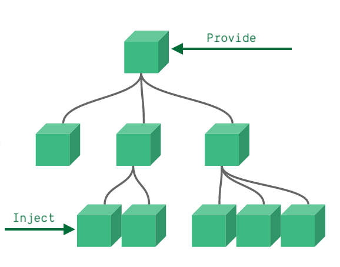

## Vue

> 是一套用于构建用户界面的渐进式`JavaScript`框架；

[^Website]:https://vuejs.org


#### 使用步骤

1. 导入 vue.js 的脚本文件；
2. 在页面中定义一个要被 vue 控制的 DOM 文档区域；
3. 创建 vm 实例对象；

> ```html
> <body>
>     <div id="app">
>        <h3>{{ title }}</h3>
>     </div>
>      <!-- 导入 vue.js 文件，在 window 全局中就有了 Vue 构造函数； -->
>      <script src="../vue.js"></script>
>      <script>
>        // 创建 vue 实例对象；
>        const vm = new Vue({
>          // el 属性，告诉 vm 实例对象要控制页面结构中的哪个区域；
>          el: '#app',
>          // data 属性，代表要渲染到页面中的数据；
>          data: {
>            title: 'Hello Vue'
>          }
>        })
>      </script>
>    </body>
>    ```


#### 特性

> Vue 框架的特性，主要体现在 `数据驱动视图` 和 `双向数据绑定` 两个方面；


###### 数据驱动视图

> Vue 会监听数据的变化，然后自动重新渲染页面的结构；
>
> 


###### 双向数据绑定

> 在不操作 `DOM` 的前提下，自动把表单 <form> 填写的内容同步到数据源；
>
> 在网页中，<form> 负责采集数据，AJAX 负责提交数据；
>
> 采集的数据发生变化， Vue 会监听到，然后更新数据源；


#### MVVM

> `MVVM` 是 Vue 实现 `数据驱动视图` 和 `双向数据绑定` 的核心原理；
>
> `MVVM` 指的是 [^Model]、[^View]、[^ViewModel] ，将每个 HTML 页面拆分成三个部分；
>
> 

[^Model]:表示当前页面渲染时所依赖的数据源；
[^View]:表示当前页面所渲染的 DOM 文档树结构；
[^ViewModel]:表示 Vue 的实例，它是 MVVM 的核心；


#### 工作原理

> 当数据源`Model`发生变化时，会被 ViewModel 监听到，再根据新的数据源更新页面结构`View`；
>
> 当 文档结构`DOM`发生变化时，也会被 ViewModel 监听到，再把新的数据值自动同步到数据源`Model`中；


## 数据代理

> [^数据代理]:通过一个对象代理对另外一个对象中属性的操作（读或写）；
>
> 通过 vm 实例对象去代理`_data`对象中属性的操作；
>
> 可以更方便的操作数据；
>
> 
>
> 通过 `Object.defineProperty()`将`_data`中的属性添加到 vm 实例对象上；
>
> 再为每个添加到 vm 实例对象中的属性，都指定一个`geter 和 seter`；
>
> 通过`geter 和 seter`去操作 data 中对应的属性；


## 数据监测

> Vue 会监测 data 对象中的所有的数据，用来实现实时渲染页面；


#### 对象数据

> Vue 中通过`Object.defineProperty()`实现**对象**中的数据的监测；


#### 数组数据

> 通过包裹数组的[^原生方法]实现数组中的数据的监测；
>
> 分两步：
>
> 1. 调用数组的[^原生方法]对数组中的的数据进行操作；
> 2. 重新解析模版，进而更新页面内容；

[^原生方法]:push()、pop()、shift()、unshift()、splice()、sort()、reverse()、slice()...


## Global API

> Vue 中提供的全局可用的方法；


#### Vue.set()

> 向`data`中的响应式**对象**添加属性，具有实时响应的特性，会触发视图更新；
>
> `Vue.ser()`和`vm.$set()`是一样的效果；
>
> 不能向 data 添加属性，且不能设置 data 根目录下的属性；
>
> ```javascript
> const vm = new Vue({
>      data: {
>        person: {
>          name: "Kein",
>          gender: 'Male'
>        }
>      }
> })
> // 给 person 对象中添加一个 age 属性；
> Vue.set(vm.person,'age',22)
> // 另一种写法；
> vm.$set(vm.person,'gender','A+')
> ```

[^注意]:直接用普通的赋值的方式添加的属性不具有响应式；


#### Vue.delete()

> 动态地删除响应式**对象**的属性，具有实时响应的特性，会触发视图更新；
>
> ```javascript
> Vue.delete(this.person,'age')
> 
> // 实例上的 $delete()；
> this.$delete(this.person,'age')
> ```


#### Vue.directive()

> 全局定义**自定义指令**；
>
> ```javascript
> Vue.directive('enlarge',function(element,binding){
>      console.log(element);
>      console.log(binding);
> });
> ```


#### Vue.nextTick()

> 在**下一次** DOM 更新结束后执行回调函数；
>
> 将回调延迟到下次 DOM 更新循环之后执行；
>
> ```javascript
> Vue.nextTick(callback())
> 
> // 实例和组件身上的 $nextTick() 生命周期；
> this.$nextTick(callback())
> ```

[^使用场景]:在改变数据后，要基于更新后的 DOM 进行操作；


#### Vue.component()

> 全局注册一个组件，任何地方都可以使用；
>
> ```javascript
> // 注册组件，传入一个扩展过的构造器
> Vue.component('my-component', Vue.extend({ /* ... */ }));
> 
> // 注册组件，传入一个选项对象 (自动调用 Vue.extend)
> Vue.component('my-component', { /* ... */ });
> 
> // 获取注册的组件 (始终返回构造器)
> var MyComponent = Vue.component('my-component');
> ```


#### Vue.use()

> 用于安装 Vue 的插件；
>
> **`Vue.use(plugin)`方法需要在调用 `new Vue()` 之前被调用**；


#### Vue.mixin()

> `Vue.mixin()`全局注册一个混入，影响注册之后所有创建的每个 Vue 实例；
>
> ```javascript
> // 定义一个混入；
> const mixin = {
>     // 生命周期函数；
>     mounted() {
>        console.log("mixin 被使用了 !");
>     },
> };
> 
> // 全局注册一个混入；
> Vue.mixin(mixin);
> ```


## 指令( Directive )

> 指令（Directives）是 Vue 提供的模版语法；
>
> 用于辅助渲染页面的基本结构；


#### v-text

> `v-text`指令会覆盖掉标签原有的内容；
>
> ```html
> <body>
>     <div id="app">
>        <p v-text='name'></p>
>        <p v-text='gender'>性别</p>
>     </div>
>     <script src="../vue.js"></script>
>     <script>
>        const vm = new Vue({
>          el: '#app',
>          data: {
>            name: 'Kein',
>            gender: 'Male'
>          }
>        })
>     </script>
> </body>
> ```


#### {{  }}

> **插值表达式（Mustache）**；
>
> 解决了`v-text`指令会覆盖掉标签的默认文本内容；
>
> 只能用在元素的**内容节点**中，不能用在元素的**属性节点**中
>
> ```html
> <body>
>   <div id="app">
>      <p>{{ name }}</p>
>      <p>性别：{{ gender }}</p>
>   </div>
>   <script src="../vue.js"></script>
>   <script>
>      const vm = new Vue({
>          el: '#app',
>          data: {
>            name: 'Kein',
>            gender: 'Male',
>            age: 22
>          }
>      })
>   </script>
> </body>
> ```
>
> 支持`JavaScript`表达式；
>
> ```html
>  <p>年龄：{{ age + 1 }}</p>
> <!-- 三元运算： -->
> {{ age? 22 : '年龄不详？' }}
> <!-- 字符串拼接： -->
> {{ name.split('').join(',') }}
> ```


#### v-html

> 可以渲染带有 html 标签的字符串，相当于设置元素的`innerHTML`；
>
> 会导致元素原本的内容失效；
>
> 直接在网站中使用`v-html`会有[^安全问题]
>
> ```html
> <body>
>     <div id="app">
>        <!-- 将会在 <div> 标签里面生成一个 <h3> 标签； -->
>        <div v-html='info'>
>        </div>
>     </div>
>     <script src="../vue.js"></script>
>     <script>
>        const vm = new Vue({
>          el: '#app',
>          data: {
>            info: '<h3 style = "color:#525960;"></h3>'
>          }
>        });
>     </script>
> </body>
> ```

[^安全问题]:容易导致 XSS （冒充用户之手）攻击


#### v-bind:

> 给元素的属性动态绑定属性值；
>
> 单向绑定：`ViewModel` vm 实例对象中的数据传递给`View`视图；
>
> ```html
> <body>
>     <div id="app">
>        <form action="">
>          <input type="text" v-bind:placeholder="hint">
>          <!-- 简写： -->
>          <input type="text" :placeholder="hint">
>        </form>
>      </div>
>     </div>
>   <script src="../vue.js"></script>
>   <script>
>      const vm = new Vue({
>        el: '#app',
>        data: {
>          hint: '输入用户名'
>        }
>      })
>   </script>
> </body>
> ```


#### v-on:

> 为 DOM 元素绑定**事件监听**方法；
>
> 语法格式：`<button v-on:click = 'functionName'>Click</button>`；
>
> 简写形式：`<button @click = 'functionName'>Click</button>`
>
> ```html
> <body>
>   <div id="app">
>      <button v-on:click="addNumber">Click</button>
>      <h3>{{ number }}</h3>
>   </div>
>   <script src="../vue.js"></script>
>   <script>
>      const vm = new Vue({
>          el: '#app',
>          data: {
>            number: 0
>          },
>          methods: {
>            addNumber() {
>              // Vue 构造函数里的 this 指向 vm 实例对象；
>              this.number += 1;
>            }
>          }
>      })
>   </script>
> </body>
> ```


###### $event

> `$event`是 Vue 中的**事件对象**；
>
> 相当于原生 JavaScript 函数中的 `e`；
>
> ```html
> <body>
>     <div id="app">
>        <button v-on:click="addNumber(1,$event)">Click</button>
>        <h3>{{ number }}</h3>
>     </div>
>     <script src="../vue.js"></script>
>     <script>
>        const vm = new Vue({
>          el: '#app',
>          data: {
>            number: 0
>          },
>          methods: {
>            addNumber(n, e) {
>              this.number += n;
>              // $event 事件对象；
>              console.log(e);
>              if (this.number % 2 === 0) {
>                e.target.style.backgroundColor = 'black';
>              } else {
>                e.target.style.backgroundColor = 'white';
>              }
>            }
>          }
>        })
>     </script>
> </body>
> ```


###### Event Modifier

> 事件修饰符；

| 事件修饰符 |                        功能                        |
| :--------: | :------------------------------------------------: |
|  .prevent  |   阻止默认行为，相当于 `event.preventDefault()`    |
|   .stop    | 阻止事件向上冒泡，相当于`event.stopPropagation()`  |
|  .capture  |                 为事件开启捕获模式                 |
|   .once    |           绑定此修饰符的事件只能触发一次           |
|   .self    | 只有在`event.target`是当前元素本身时才出发事件函数 |

> ```html
> <body>
>      <div id="app">
>        <div @click="print">
>          <!-- 阻止事件向上冒泡和标签的默认行为； -->
>          <!-- 阻止点击 <a> 标签，<div> 标签也会触发事件函数; -->
>          <a href="https://vuejs.org" @click.prevent.stop="print">阻止默认事件</a>
>        </div>
>      </div>
>      <script src="../vue.js"></script>
>      <script>
>        const vm = new Vue({
>          el: '#app',
>          methods: {
>            print() {
>              console.log('Hello Vue !')
>            }
>          }
>        })
>      </script>
> </body>
> ```


###### Keys Modifier

> **按键修饰符**，监听键盘触发的事件，相当于`event.key`或`event.keyCode`；
>
> 用于获取具体的按键名，使事件函数只针对某个(或某几个)按键生效；

| 按键修饰符 |     说明     |
| :--------: | :----------: |
|   .enter   |    回车键    |
|    .tab    | table 制表符 |
|  .delete   |    删除键    |
|    .esc    |    退出键    |
|   .space   |     空格     |
|    .up     |      上      |
|   .down    |      下      |
|   .left    |      左      |
|   .right   |      右      |


#### v-model

> `v-model`双向数据绑定；
>
> 在不操作 DOM 的情况下，快速获取`<form>`表单填写的数据；
>
> 表单中的数据发生变化，会同步到 vm 实例中所对应的数据；


###### Modifier

> 专为`v-model` 指令提供的修饰符；
>
> 为了方便对表单的内容进行处理；

| 修饰符  |                      作用                      |             示例             |
| :-----: | :--------------------------------------------: | :--------------------------: |
| .number |     自动将表单的输入值转为`number`数据类型     | <input v-model.number="age"> |
|  .trim  |          自动过滤掉输入值的头尾空白符          | <input v-model.trim="name">  |
|  .lazy  | 在输入框失去焦点时才会同步 vm 对象实例中的数据 | <input v-model.lazy="infor"> |

> ```html
> <body>
>      <div id="app">
>        <form action="">
>          <input type="text" v-model:value="username">
>          <!-- 简写形式： -->
>          <!-- <input type="text" v-model.trim="username"> -->
>          <select v-model.lazy="city">
>            <option value="1">上海</option>
>            <option value="2">杭州</option>
>            <option value="3">武汉</option>
>          </select>
>        </form>
>      </div>
>      <script src="../vue.js"></script>
>      <script>
>        const vm = new Vue({
>          el: '#app',
>          data: {
>            username: 'Kein',
>            city: 2
>          }
>        })
>      </script>
> </body>
> ```


#### v-if

> 通过控制 DOM 元素是否存在来控制元素的显隐；
>
> 有一个局部编译/卸载的过程；
>
> 切换过程中合适地销毁和重建内部的事件监听和子组件；
>
> 如果初始条件为假，则什么也不做；只有在条件第一次变为真时才开始局部编译；
>
> ```html
> <body>
>     <div id="app">
>        <button @click='switchFlag'>Switch</button>
>        <p v-if="flag">这是 v-if 控制的元素</p>
>        <!-- v-else-if 指令，须配合 v-if 指令一起使用，否侧不会被识别； -->
>        <h5 v-if="grade === 'A'">优秀</h5>
>        <h5 v-else-if="grade === 'B'">良好</h5>
>        <h5 v-else-if="grade === 'C'">一般</h5>
>        <h5 v-else="grade === 'D'">差劲</h5>
>     </div>
>     <script src="../vue.js"></script>
>     <script>
>        const vm = new Vue({
>          el: '#app',
>          data: {
>            flag: false,
>            grade: 'A'
>          },
>          methods: {
>            switchFlag() {
>              this.flag = !this.flag;
>            }
>          }
>        })
>     </script>
> </body>
> ```


#### v-show

> 通过设置 DOM 元素的 display 样式，block 为显示，none 为隐藏；
>
> 原理就是简单的基于css样式切换；
>
> 任何条件下都会被编译，然后被缓存，且 DOM 元素时存在的；
>
> ```html
> <body>
>   <div id="app">
>      <button @click='switchFlag'>Switch</button>
>      <p v-show="flag">这是 v-show 控制的元素</p>
>   </div>
>   <script src="../vue.js"></script>
>   <script>
>      const vm = new Vue({
>          el: '#app',
>          data: {
>            flag: false
>          },
>          methods: {
>            switchFlag() {
>              this.flag = !this.flag;
>            }
>          }
>      })
>   </script>
> </body>
> ```


#### v-for

> 循环渲染元素指令`v-for`；
>
> 建议使用`v-for`循环渲染的时候，动态绑定一个`:key`属性，提升性能且防止列表状态紊乱；
>
> 且`:key`的属性值尽量使用**稳定且唯一**的[^属性值]；
>
> [^属性值]:`number`或者`string` 数据类型;
>
> ```html
> <body>
>     <div id="app">
>        <ul>
>          <!-- 循环生成 3 个 <li> 标签并填充对应内容； -->
>          <li v-for="(person, index) in dataList" :key="person.id">
>            <span>{{ person.name }}</span>
>            <span>{{ person.age }}</span>
>          </li>
>        </ul>
>     </div>
>     <script src="../vue.js"></script>
>     <script>
>        const vm = new Vue({
>          el: '#app',
>          data: {
>            dataList: [
>              {id: 1,name: 'Kein',age: 23},
>              {id: 2,name: 'ZouKai',age: 22},
>              {id: 3,name: 'MuYi',age: 1}
>            ]
>          }
>        })
>     </script>
> </body>
> ```


###### key

> `key`是 Vue 中的最重要的特殊属性，是虚拟 DOM 对象的标识；
>
> `key`可以干预 Vue 的`diff`算法；
>
> 在同一层级的元素中，`key`属性值相同的会进行比对，不同的不会比对；
>
> 

* 对比规则

  * 新旧虚拟 DOM 树的`key`值相同；

    > 如果内容没变，则直接使用之前的真实 DOM 树；
    >
    > 内容变了，则生成新的真实 DOM 树，替换掉之前的；

    

  * 新旧虚拟 DOM 树的`key`值不同；

    > 创建真实的 DOM 树，然后渲染到页面；


* 用 index 作为`key`值的问题

  > 若对数据进行**破坏顺序**的操作，会产生没必要的真实 DOM 树的更新，效率低；


#### v-cloak

> 解决 Web 加载 JavaScript 代码时产生的阻塞而导致页面有未渲染的模版；
>
> ```html
> <style>
>   /* 属性选择器：选择所有带有 v-cloak 属性的标签； */
>   [v-cloak]{
>     display: none;
>   }
> </style>
> <div>
>   <!-- 给需要渲染依赖数据的标签加上 v-cloak 指令； -->
>   <p v-cloak>{{ title }}</p>
> </div>
> ```

[^Hint]:等 Vue 脚本文件加载完毕，所管理的区域内的 v-cloak 都会被删除；


#### v-once

> `v-once`所在节点在**初次动态渲染**后，就视为静态内容了；
>
> 之后数据的改变不会引起该节点的更新，用于优化性能；
>
> ```html
> <!-- 表示该元素只会被渲染一次，之后当作静态内容； -->
> <div v-once>
>     <h1>comment</h1>
>     <p>{{msg}}</p>
> </div>
> ```


#### v-pre

> 跳过所在节点和它的子元素的编译过程，显示原始内容模版；
>
> **建议没有使用指令、插值语法的节点都加上，加快编译速度**；
>
> ```html
> <div>
>   <!-- 此时 h2 标签不会被 Vue 处理，直接拿来用； -->
>   <h2 v-pre>Hello Vue Framwork</h2>
> </div>
> ```


#### custom Directive

> **自定义指令**；
>
> 语法：`directiveName(element,binding){}`；
>
> [^element]:使用指令的真实 DOM 元素节点；
> [^binding]:一个包含绑定信息的对象；


###### 函数式

> 精简写法；
>
> **函数式的自定义指令什么时候调用？**
>
> 1. 未插入页面，指令与元素成功绑定时；
> 2. 指令所在的模版被重新解析时；
>
> ```html
> <body>
>   <div id="app">
>     <p>number 的值是：<span v-text="number"></span></p>
>     <p>(number + 1)的 10 倍是：<span v-enlarge="number + 1"></span></p>
>   </div>
>   <script src="../vue.js"></script>
>   <script>
>     const vm = new Vue({
>       el: "#app",
>       data: {
>         number: 2,
>       },
>       // 自定义指令配置对象；
>       directives: {
>         // 自定义一个 v-enlarge 指令；
>         enlarge(element, binding) {
>           console.log(element);
>           console.log(binding);
>           element.innerText = binding.value * 10;
>         },
>       },
>     });
>   </script>
> </body>
> ```


###### 对象式

> 完整写法，可以控制在什么时候执行里面的哪个特定函数；
>
> ```javascript
> const vm = new Vue({
>     el: '#app',
>     data: {number: 2},
>     directives: {
>        // 对象式自定义指令；
>        enlarge: {
>          // 指令与元素成功绑定（一上来）调用；
>          bind(element,binding){
>            element.innerHTML = binding.value;
>          },
>          // 指令所在元素被插入页面时调用；
>          inserted(element,binding){
>            element.parentElement.style.backgroundColor = '#fafafa';
>          },
>          // 指令所在的模版被重新解析时调用；
>          update(element,binding){
>            element.innerHTML = binding.value;
>          }
>        }
>     }
> });
> ```


## 特殊属性

> Vue 中给 DOM 标签提供的特殊属性；


#### key

> `key`是 Vue 中的最重要的特殊属性，是虚拟 DOM 对象的标识；
>
> 在同一层级的元素中，`key`属性值相同的会进行比对，不同的不会比对；
>
> 建议使用`v-for`循环渲染的时候，动态绑定一个`:key`属性，提升性能且防止列表状态紊乱；
>
> 且`:key`的属性值尽量使用**稳定且唯一**的[^属性值]；
>
> 


###### 对比规则


* 新旧虚拟 DOM 树的`key`值相同；

  > 如果内容没变，则直接使用之前的真实 DOM 树；
  >
  > 内容变了，则生成新的真实 DOM 树，替换掉之前的；

  

* 新旧虚拟 DOM 树的`key`值不同；

  > 创建真实的 DOM 树，然后渲染到页面；


###### index

> 用 index 作为`key`值的可能会出现问题；
>
> 若对数据进行**破坏顺序**的操作，会产生没必要的真实 DOM 树的更新，效率低；


#### ref

> Vue 中的特殊属性；类似于`getElementById`方法，可以获取 DOM 元素；
>
> **写在 html 标签上，获取的是真实 DOM 元素**；
>
> **写在组件标签上，获取的是组件实例对象 vc **；
>
> ```html
> <body>
>     <div id="root">
>        <h3 ref="title">Message</h3>
>        <Message ref="component"></Message>
>        <button @click="showDom">Click</button>
>     </div>
>     <script src="../vue.js"></script>
>     <script>
>        // 定义一个 Message 组件；
>        const Message = Vue.extend({
>          name: "Message",
>          data() {
>            return {
>              name: "Kein",
>              gender: "Male",
>              grade: "A+",
>            };
>          },
>          template: `
>       	<div>
>         	<h2>NAME: {{name}}</h2>
>           <h2>GENDER: {{gender}}</h2>
>           <h2>GRADE: {{grade}}</h2>
>        </div>
>       `,
>        });
>        const vm = new Vue({
>          el: "#root",
>          methods: {
>            showDom() {
>              // 在原生 DOM 标签上，获取的是真实标签元素 <h3>Message</h3> ；
>              console.log(this.$refs.title);
>              // 在组件标签上，获取的是组件实例对象 vc ；
>              console.log(this.$refs.component);
>            },
>          },
>          components: {
>            Message,
>          },
>        });
>     </script>
> </body>
> ```


## 生命周期

[^生命周期]:是 Vue 在关键时刻自动调用的一些特殊函数；

> 又叫**生命周期回调函数**、**生命周期钩子**，其名称是固定的；
>
> 所有生命周期钩子的 `this` 将自动绑定至 vm 实例对象；
>
> 所以**不应该使用箭头函数来定义一个生命周期方法**；
>
> 


#### beforeCreate()

> 在实例对象初始化之后，进行数据侦听和数据代理配置之前；
>
> 此时 vm 实例对象中还没有 data 和 methods ；


#### created()

> 在 vm 实例对象被创建完成之后，挂载阶段还没开始；
>
> 此时 Vue 开始解析模版，在内存中生成**虚拟 DOM 树**， el 属性还不可用；


#### beforeMount()

> 在 vm 实例对象被挂载到真实 DOM 文档结构之前；


#### Mounted()

> 在 vm 实例对象被挂载到真实 DOM 树之后自动调用；
>
> 页面上呈现的是经过 Vue 编译后的 DOM ；

[^Hint]:一般在此时，开启定时器、发送网络请求、订阅消息、绑定自定义事件......


#### beforeUpdate()

> 在数据发生改变后，真实 DOM 文档内容被更新之前；
>
> 此时数据还未与页面内容同步；


#### updated()

> 在数据更改导致的虚拟 DOM 重新渲染和更新完毕之后;


#### activated()

> 被`<keep-alive>`标签缓存的**路由组件**激活时调用；


#### deactivated()

> `<keep-alive>`标签缓存的**路由组件**失效时调用；


#### beforeDestroy()

> vm 实例对象销毁之前调用；
>
> 此时，实例对象仍然完全可用；

[^Hint]:一般在此时，关闭定时器、取消订阅消息、解绑自定义事件等**收尾操作**；


#### destroyed()

> 在 vm 实例对象销毁之后；
>
> 此时，对应 Vue 实例的所有指令都被解绑、事件监听器被移除、子实例也都被销毁；


#### errorCaptured()

> 在捕获一个来自子组件的错误时被调用，返回 false 以阻止该错误继续向上传播；
>
> ```javascript
> errorCaptured(err: Error, vm: Component, info: string){
>   return // boolean 数据类型；
> }
> //三个参数：错误对象、发生错误的组件实例、包含错误来源信息的字符串；
> ```


## el

> `el`是 vm 实例对象中指定 Vue 控制区域的属性；
>
> `el`的值是一个选择器；


#### 内部挂载

> ```javascript
> const vm = new Vue({
>   el: '#app'
> });
> ```


#### 外部挂载

> ```javascript
> const vm = new Vue({
> });
> // 在外部挂载；
> vm.$mount('#app');
> ```


## data

> `data`是 vm 实例中的数据存放对象；


#### 对象式

> 正常写法；
>
> ```javascript
> const vm = new Vue({
>     data: {
>        name: 'Kein'
>     }
> });
> ```


#### 函数式

> 组件`component`中必须要用`函数式`写法；
>
> 防止组件被多次使用时存在数据引用；
>
> ```javascript
> const vm = new Vue({
>    data(){
>        return {
>          name: 'Kein'
>        };
>    }
> });
> ```


## props

> `props`可以是**数组**或**对象**；
>
> 用于在`子组件`中接收来自`父组件`的数据；
>
> **组件通信方式**：`父组件 ==> 子组件`或`子组件 ==> 父组件（传递回调函数）`；
>
> ```html
> <body>
>      <div id="root">
>        <!-- 给 Message 子组件中传递三个数据； -->
>        <Message name="Kein" gender="Male" :age="22"></Message>
>      </div>
>      <script src="../vue.js"></script>
>      <script>
>        // 定义一个 Message 组件；
>        const Message = Vue.extend({
>          name: "Message",
>          data() {
>            return {
>              message: "Personal Message",
>            };
>          },
>          // props: ["name", "gender", "age"],// 简单接收；
>          // props: {//   // 接收的同时对数据进行类型的限制；
>          //   name: String,
>          //   gender: String,
>          //   age: Number,
>          // },
>          props: {
>            // 接收数据的同时，对数据类型、默认值、必要性进行限制；
>            name: {
>              type: String,
>              require: true,
>              default: "Kein",
>            },
>            gender: {
>              type: String,
>              require: true,
>            },
>            age: {
>              type: Number,
>              require: true,
>            },
>          },
>          template: `
>      <div>
>        <h1>{{message}}</h1>
>        <hr>
>        <h2>{{name}}</h2>
>        <h2>{{gender}}</h2>
>        <h2>{{age + 1}}</h2>
>        </div>
>    `,
>        });
>        const vm = new Vue({
>          el: "#root",
>          components: {
>            Message,
>          },
>        })
>      </script>
> </body>
> ```

[^Focus]: `props`是只读的，进行修改会发出警告，可以在子组件`data	`中定义一个中转属性数据；


## methods

> `methods`是 vm 实例中的方法的存放对象；
>
> ```javascript
> const vm = new Vue({
>      methods: {
>        print(){
>          console.log('Hello Vue !')
>        }
>      }
> })
> ```

[^Focus]:所有被 Vue 管理的函数方法都不能写成箭头函数，反之则需要写成箭头函数；


##  filters

> `filters `是 Vue 提供的功能，是一个对象，被 vm 实例所管理；
>
> 一般用于**文本的格式化**；
>
> 可以用在**插值表达式**或者**v-bind 动态属性绑定**中；
>
> ```html
> <!-- 在插值表达式中，调用 slice 过滤器，对 message 的值进行格式化； -->
> <p>{{ message | slice }}</p>
> 
> <!-- 在 v-binf 动态属性绑定中，调用 format 过滤器，对 time 的值进行格式化； -->
> <div v-bind:id="time | format"></div>
> <!-- 所显示的值是过滤器函数返回的值，而不是原本的值； -->
> 
> <!-- 过滤器函数可以连续串联调用； -->
> <p>{{ message | slice | format }}</p>
> ```

[^注意]:在 Vue3 中没有过滤器；


#### 过滤器函数

> 要定义在`filters`对象中；
>
> 本质是函数，必须要用 return 返回一个值；
>
> **过滤器函数形参中的第一个值，永远都是所要进行格式化对象的值**；
>
> 被添加在 JavaScript 表达式的尾部，用**管道符**`|`连接；
>
> ```html
><body>
>   <div id="app">
>      <p>{{ message | capital }}</p>
>     </div>
>      <script src="../vue.js"></script>
>     <script>
>        const vm = new Vue({
>          el: '#app',
>          data: {
>            message: 'hello filters'
>          },
>          filters: {
>            capital(value) {
>              let change = value.toUpperCase();
>              return change;
>            }
>          }
>        });
>      </script>
>    </body>
>   ```


#### 私有过滤器

> 在`filters`对象中定义的就是**私有过滤器**；
>
> 只能在当前的 vm 实例中的 el 属性所控制的区域内使用；


#### 全局过滤器

> 在多个 vm 实例之间共享过滤器，则定义**全局过滤器**；
>
> 在 Vue 构造函数上定义：`Vue.filter()`；
>
> ```javascript
> // 使用 Vue.filter() 定义全局过滤器；
> Vue.filter('capital', function (value) { 
>      let change = value.toUpperCase();
>      return change;
> });
> ```


## watch 

> 数据监听；
>
> `watch `是 Vue 提供的功能，是一个对象，被 vm 实例所管理；
>
> `watch`可以监听数据的变化，然后作出特定的操作；
>
> ```html
> <body>
>     <div id="app">
>        <input type="text" v-model.lazy="username">
>     </div>
>     <script src="../vue.js"></script>
>     <script>
>        const vm = new Vue({
>          el: '#app',
>          data: {
>            username: "Kein"
>          },
>          watch: {
>            // 要监听哪个值，就用其作为函数名；
>            // 新值在前，旧值在后；
>            username(newValue, oldValue) {
>              // 监听 username 值，当发生变化时，调用此监听器函数；
>              console.log('username 的值发生变化了 ！');
>              console.log('旧的值是：' + oldValue);
>              console.log('新的值是：' + newValue);
>            }
>          }
>       });
>   </script>
> </body>
> ```
>
> 监听对象中的指定属性，而不是整个对象；
>
> 监听器函数的名称要加一层单引号`''`；
>
> ```javascript
> // 监听对象中指定属性的值的变化，方法名要加一层单引号；
> const vm = new Vue({
>     el: '#app',
>     data: {
>        admin: {
>          username: 'Kein'
>        }
>     },
>     watch: {
>        'admin.username'(newValue,oldValue){
>          console.log('监听的是 admin 对象中的 username 属性的值；')
>        }
>     }
> });
> ```
>
> 全局注册监听器；
>
> 在 vm 对象实例上定义：`vm.$watch()`；
>
> ```javascript
> vm.$watch("admin", {
>      handler(newValue, oldValue) {
>        console.log("旧的值是:" + oldValue);
>        console.log("新的值是:" + newValue);
>      }
> })
> ```


#### immediate

> 函数形式的监听器只会在数据发生变化时才调用；
>
> 将监听器写成对象形式，增加`immediate`属性，则初始化页面时就立即调用一次；
>
> 默认值是 false ；
>
> ```javascript
> const vm = new Vue({
>      el: '#app',
>      data: {
>        username: "Kein"
>      },
>      watch: {
>        // 定义对象形式的监听器；
>        username: {
>          handler(newValue,oldValue){
>            console.log('旧的值是：' + oldValue);
>            console.log('新的值是：' + newValue);
>          }
>        },
>        // 初始化页面时是就立即调用一次；
>        immediate: true
>      }
>    })
>    ```


#### deep

> `deep`属性，可以让监听器深度监听目标对象中每个属性的变化；
>
> 监听对象中的任何属性发生了变化，都会触发监听器；
>
> 默认值是 false ；
>
> ```javascript
> const vm = new Vue({
>      el: "#app",
>      data: {
>        admin: {
>          username: "Kein",
>        },
>      },
>      watch: {
>        admin: {
>          handler(newValue, oldValue) {
>            console.log("旧的值是:" + oldValue);
>            console.log("新的值是:" + newValue);
>          },
>          immediate: true,
>          // deep 属性，可以让监听器深度监听目标对象中每个属性的变化；
>          // 对象中的任何属性发生了变化，都会触发监听器；
>          deep: true,
>        }
>      }
>    })
>    ```


## computed

> 根据已有的属性进行计算得到的**属性**，可以被`{{  }}`和`methods`使用；
>
> 计算属性是一个对象，被 vm 实例所管理；
>
> **`computed`会进行缓存，如果依赖项不变，则直接使用缓存，不会重新计算**；


#### 函数式

> ```html
> <body>
>     <div id="app">
>        R:<input v-model.number="r" /> 
>        G:<input v-model.number="g" /> 
>        B:<input v-model.number="b" />
>        <!-- 使用计算属性； -->
>        <div class="box" :style="{backgroundColor:rgb}"></div>
>     </div>
>     <script src="../vue.js"></script>
>     <script>
>        const vm = new Vue({
>          el: "#app",
>          data: {
>            r:'',
>            g:'',
>            b:'',
>          },
>          computed: {
>            // 计算属性定义的时候是方法或对象；
>            // 使用时直接当属性使用： this.rgb ；
>            rgb() {
>              return `rgb(${this.r},${this.g},${this.b})`;
>            },
>          },
>        })
>     </script>
> </body>
> ```


#### 对象式

> ```javascript
> // 对象式
> const vm = new Vue({
>      computed: {
>        rgb: {
>          get(){
>            // 当 rgb 被读取时就会调用；
>            return `rgb(${this.r},${this.g},${this.b})`;
>          },
>          set(){
>            // 可以省略不写，需要修改时添加
>            // 当 rgb 被修改时才会调用
>          }
>        }
>      }
> })
> ```

[^建议]:建议凡是根据已有数据计算得到新数据的无参函数，都写在`computed`中；


#### 实现原理

> 借助`Object.defineProperty()`提供的`get`和`set`方法；	


## components

> `components`组件，实现应用中**局部功能代码和资源**的集合；
>
> 组件是可复用的 Vue 实例对象；
>
> ```javascript
> const vm = Vue({
>     el: '#app',
>     components: {
>        // 在 vm 实例对象中局部注册一个 MyComponent 组件；
>        // 只有在 el 属性控制范围内才有效；
>        MyComponent
>     }
> })

[^作用]:复用代码，简化项目编码，提高代码运行效率；


#### 组件分类


###### 单文件组件

> 一个文件中只包含 1 个组件；
>
> 一般都是使用单文件组件，条理清晰，功能明确，代码好维护；


######  非单文件组件

> 一个文件中包含多个组件，不常用；


#### 组件命名

> 连接符`kebab-case`写法；
>
> ```javascript
> components: {
>     my-component
> }
> ```
>
> 大驼峰`CamelCase`写法；
>
> ```javascript
> // 大驼峰写法需要在 vue-cli 脚手架中才支持；
> components: {
>     MyComponent
> }
> ```


#### 使用步骤

[^Hint]:例子为**非单文件组件**，`vue-cli`中使用**单文件组件**；


###### 创建组件

> 组件中没有`el` 属性配置项；
>
> ```javascript
> // 创建一个 school 组件；
> const school = Vue.extend({
>     // 使用 name 属性配置组件在开发者工具 vue-devtools 中呈现的名称；
>     name: 'School',
>     // 配置组件中的 DOM 结构模版；
>     template: `
>   	<div>
>   		<h3>{{schoolName}}</h3>
>       <h6>{{schoolAddress}}</h6>  
>     </div>
>     `,
>     // 组件中 data 属性必须要写成一个函数，把数据写在 return 对象里面；
>     data() {
>        return {
>          schoolName: "Vue-School",
>          schoolAddress: "BeiJing",
>        };
>     },
> });
> ```


###### 注册组件

> 根据需求分为**局部注册**和**全局注册**；

* 局部注册

  > ```javascript
  > const vm = new Vue({
  >   el: "#app",
  >   data: {
  >     message: "Message",
  >   },
  >   // 在 vm 实例中局部注册 school 组件；
  >   components: {
  >     school
  >   },
  > });
  > ```

  

* 全局注册

  > ```javascript
  > Vue.component('school',school);
  > // 第一个参数时给组件命名，string 数据类型；
  > // 第二个参数是组件的配置项，告诉 Vue 要全局注册哪个组件；
  > ```


###### 使用组件

> 在 DOM 文档结构中写入`组件标签`；
>
> ```html
> <div id="app">
>   <h1>{{message}}</h1>
>   <!-- 在页面结构中使用组件 -->
>   <school> </school>
> </div>
> ```


#### 组件嵌套

> 在一个组件中使用另外一个组件；
>
> ```javascript
> // 创建一个 student 组件；
> const student = Vue.extend({
>   template: `
>   	<div>
>     	<h3>{{studentName}}</h3>
>       <h6>{{studentAddress}}</h6>
>     </div>
>   `,
>   data() {
>     return {
>       studentName: "Kein",
>       studentAddress: "JiangXi",
>     };
>   },
> });
> 
> // 创建一个 school 组件；
> const school = Vue.extend({
>   // 配置组件中的 DOM 结构模版；
>   template: `
>   	<div>
>     	<h3>{{schoolName}}</h3>
>       <h6>{{schoolAddress}}</h6>
>       <hr>
>       <!-- 在 school 组件模版中写入 student 组件标签，实现嵌套； -->
>       <student></student>
>     </div>
>   `,
>   data() {
>     return {
>       schoolName: "Vue-School",
>       schoolAddress: "BeiJing",
>     };
>   },
>   // 在这里写入 components 属性，写入 student 组件，配置组件嵌套；
>   components: {
>     student,
>   },
> });
> 
> const vm = new Vue({
>   el: "#app",
>   template: `
>   	<school></school>
>   `,
>   components: {
>     school,
>   },
> });
> ```


#### VueComponent

> 组件的本质是一个名为`VueComponent`的**构造函数**，是通过`Vue.extend()`方法生成的；
>
> ```javascript
> function VueComponent(options) {
>     this._init(options);
> }
> ```

> 当在 DOM 结构中书写`<my-component></my-component>`组件标签时；
>
> Vue 在解析模版的时候会创建组件`my-component`的实例对象`vc`；
>
> 即 Vue 会执行`new VueComponent(options) `创建一个组件实例对象`vc`；

> 组件中的`this`都指向`VueComponent`**构造函数**的实例对象`vc`；

[^Focus]:每次调用`Vue.extend()`都会`return`返回一个全新的`VueComponent`构造函数；


#### 内置关系

> `VueComponent.prototype.__proto__ === Vue.prototype`
>
> ```javascript
> console.log(school.prototype.__proto__ === Vue.prototype);// true;
> ```
>
> 


###### Why ?

> 让组件的实例对象 `vc`可以访问到`Vue`原型身上的属性和方法；


## render

> `render`**渲染函数**和 `template` 配置属性一样都是创建 html 模板的；
>
> ```javascript
> Vue({
>   render: function(createElement){
>     return createElement('tagName');
>   }
> })
> // 简写形式；
> Vue({
>   render: (h) => h(App)
>   }
> })
> ```


#### return

> `render`渲染函数`return`的返回值是一个`VNode`虚拟节点；
>
> 也就是要渲染的节点；


#### createElement()

> `render`渲染函数所接收的参数，也是一个**函数**，可以接收三个参数；
>
> 返回值也是一个`VNode`虚拟节点；


## mixins

> `mixins` 属性接收一个混入对象的数组；
>
> 用于把组件中可以共用的配置提取成一个混入对象；


#### 定义混入

> 可以写在单独的文件中，然后导出；也可以写在同一文件里；
>
> ```javascript
> // 定义一个混入；
> const mixin = {
>      // 生命周期函数；
>      mounted() {
>        console.log("mixin 被使用了 !");
>      }
> };
> ```


#### 使用混入


###### 局部混入

> ```javascript
> // 定义一个 School 组件；
> const School = Vue.extend({
>      name: "School",
>      data() {
>        return {
>          name: "Vue School",
>          address: "BeiJing",
>        };
>      },
>      // 使用 mixins 混入属性配置局部使用混入；
>      mixins: [mixin],
>      template: `
>   	<div>
>     	<h3>{{name}}</h3>
>       <h3>{{address}}</h3>
>     </div>
>   `,
> });
> ```


###### 全局混入

> ```javascript
> // Vue.mixin() 方法注册一个全局可使用的混入；
> Vue.mixin(mixin)
> ```


## 脚手架( vue-cli )

> `vue-cli`脚手架是 Vue 官方提供的标准化开发工具；


#### 初始化


###### 下载安装

> 全局安装`@vue/cli`脚手架工具；
>
> ```shell
> npm install @vue/cli --global
> ```


###### 创建项目

> 在要创建`vue-cli	`项目的目录下打开终端；
>
> ```shell
> # 项目名称中不能有大写字母；
> vue create projectname
> ```


###### 启动项目

> ```shell
> npm run serve
> ```


#### vue.config.js

> `vue.config.js` 是一个可选的配置文件；
>
> 用来修改项目的一些默认配置，会与`webpack.config.js`的打包配置文件合并；
>
> ```javascript
> module.exports = {
>      pages: {
>        index: {
>          // page 的入口
>          entry: "src/index/main.js",
>          // 模板来源
>          template: "public/index.html",
>          // 在 dist/index.html 的输出
>          filename: "index.html",
>        },
>      },
>      // 关闭 JavaScript 语法检查；
>      lintOnSave: false,
>      // 开启代理服务器；
>      devServer: {
>        // 设置要代理哪个服务器；
>        proxy: 'http://localhost:3000'
>      }
> };
> ```


#### 配置代理

> 配置代理服务器，解决开发时请求跨域的问题；
>
> 在`vue.config.js`文件中配置`devServer.proxy`选项；


###### 单一代理

> 优先匹配前端资源，如果没有则将请求转发给目标服务器；
>
> **发送请求时将请求路径替换成本地运行的路径**；
>
> ```javascript
> url: "http://localhost:8080/data"
> ```
>
> ```javascript
> module.exports = {
>     devServer: {
>        // 配置要代理的目标服务器；
>        proxy: 'http://localhost:3000'
>     }
> }
> ```


###### 多个代理

> 配置多个代理，可以控制哪些请求会通过代理服务器；
>
> **请求路径要加上代理前缀**；
>
> ```javascript
> url: "http://localhost:8080/api/data",
> url: "http://localhost:8080/message/data",
> ```
>
> ```javascript
> module.exports = {
>     // 开启代理服务器；(方式二)
>     devServer: {
>        proxy: {
>          // 为 /api 请求路径前缀开启代理；
>          "/api": {
>            // 目标服务器的基础路径；
>            target: "http://localhost:3000",
>            // 重写请求路径：因为目标服务器没有 /api 这个路径；
>            pathRewrite: {
>              "^/api": "",
>            },
>            // 用于支持 websocket ；
>            ws: true,
>            changeOrigin: true,
>          },
>          // 为 /message 请求路径前缀开启代理；
>          "/message": {
>            target: "http://localhost:5000",
>            // 重写请求路径：因为目标服务器没有 /api 这个路径；
>            pathRewrite: {
>              "^/message": "",
>            },
>            // 用于支持 websocket ；
>            ws: true,
>            changeOrigin: true,
>          },
>        },
>     },
> }


#### scoped

> `scoped`作用域样式；
>
> 表示样式的选择器名称只在当前组件文件中有效，防止多个组件的样式冲突；
>
> ```vue
> <!-- vue-cli 组件模版 -->
> <template></template>
> <script></script>
> <style scoped></style>
> ```


## 插件( Plugin )

> **插件**用于增强 Vue 的功能，本质是一个**对象**，包含`install()`函数方法；
>
> `install()`函数接收的第一个参数是`Vue`**构造函数**；


#### 定义插件

> ```javascript
> // 定义一个插件；
> const plugin = {
>      install(Vue) {
>        console.log(Vue);
>        // 在插件中全局定义一个过滤器；
>        Vue.filter("Capital", function (value) {
>          let change = value.toUpperCase();
>          return change;
>        });
>      },
> }
> ```


#### 使用插件

> 使用`Vue.use()`方法；
>
> ```javascript
> // 使用一个插件；
> Vue.use(plugin);
> ```


## 实例用法

> 给**实例对象 vm** 和 **组件实例 vc **使用的方法 或者 属性；


#### 方法( Method )

> 给实例提供的方法；


###### $forceUpdate()

> 迫使 Vue 实例重新渲染；注意它仅仅影响**实例本身**和**插入插槽内容的子组件**，而不是所有子组件；
>
> 触发 **beforeUpdate、updated** 生命周期；
>
> ```javascript
> // 作用
> // 当在data中某个内容进行了改变、但是页面没有刷新、而控制台能进行打印证明数据确实改变了，此时就可以用来强制当前组件刷新
> // 常见场景
> // 在v-for循环或者某个操作中对data中的内容进行增加、修改、或者删除操作，data中的数据确实改变了，而且打印的内容也改   变了，但是页面却没有刷新达到理想效果
> this.$forceUpdate()
> ```


#### 属性( Property )

> 给实例提供的属性用法


###### $parent

> **只读**，**获取当前实例的父实例，如果当前实例有的话**；
>
> ```javascript
> this.$parent
> ```


###### $children

> **只读，获取当前实例的直接子组件，需要注意 `$children` 并不保证顺序，也不是响应式的；**
>
> ```js
> this.$children
> ```


## $emit()

> 触发当前实例对象上的事件，一般用于**自定义事件(Custom Event)** ；
>
> 语法： `vm.$emit('customEvent',...data)`；
>
> **组件通信方式**：`子组件 ==> 父组件`；

[^customEvent]:自定义在实例对象上的事件名；
[^...data]:要传递的数据；

> ```html
> <body>
>   <div id="app">
>      <h2>{{message}}</h2>
>      <hr />
>      <!-- 两种方法获取组件实例对象上的自定义事件 -->
>      <School @get-name="getSchoolName"></School>
>      <!-- 只触发一次； -->
>      <!-- <School @get-name.once="getSchoolName"></School> -->
>      <School ref="school"></School>
>   </div>
>   <script src="../node_modules/vue/dist/vue.js"></script>
>   <script>
>      // 定义 School 组件；
>      const School = Vue.extend({
>          name: "School",
>          template: `
>            <div>
>              <h3>{{name}}</h3>
>              <h3>{{address}}</h3>
>              <button @click="emitName">Click</button>
>              <button @click="eventOff">Click</button>
>            </div>
>          `,
>          data() {
>            return {
>              name: "Vue School",
>              address: "BeiJing",
>            }
>          },
>          methods: {
>            emitName() {
>              // 触发一个组件实例对象上的 get-name 自定义事件；
>              this.$emit("get-name", this.name);
>            },
>            eventOff() {
>              // 解绑组件实例对象上的 get-name 自定义事件；
>              this.$off("get-name");
>              // 解绑多个自定义事件；
>              // this.$off(["get-name", "get-address"]);
>              // 解绑所有自定义事件；
>              // this.$off();
>            },
>          },
>      });
> 
>      const vm = new Vue({
>          el: "#app",
>          components: {
>            School,
>          },
>          data: {
>            message: "School Message",
>          },
>          methods: {
>            getSchoolName(name) {
>              console.log("学校的名字是：" + name);
>            },
>          },
>          mounted() {
>            // 通过 ref 属性，获取组件实例对象 ==> 自定义事件；
>            this.$refs.school.$on("get-name", this.getSchoolName);
>            // 只触发一次事件，箭头函数；
>            this.$refs.school.$once("get-name", (name) => {
>              console.log("学校的名字是：" + name);
>            });
>          },
>      });
>   </script>
> </body>
> ```


## 全局事件总线

> 实现`任意组件之间通信`；
>
> 首先使所有的 vm 和 vc 都能访问到这个实例对象；
>
> 通过`$emit()`和`$on()`调用事件；；

[^原理]:在`Vue.prototype`上放置一个实例化对象，所有的 vm 和 vc 都能访问到；

> ```javascript
> new Vue({
>      el: "#app",
>      // 利用 beforeCreate() 生命周期函数在初始化之前在 Vue.prototype 上放置一个实例化对象；
>      beforeCreate() {
>        // 安装全局事件总线，将 vm 实例对象赋值给 $bus ；
>        Vue.prototype.$bus = this
>      },
> });
> ```

> ```html
> <body>
>      <div id="app">
>        <h2>{{message}}</h2>
>        <hr />
>        <School></School>
>        <hr>
>        <Student></Student>
>      </div>
>      <script src="../node_modules/vue/dist/vue.js"></script>
>      <script>
>        // 全局事件总线，首先使所有的 vm 和 vc 都能访问到这个实例对象；
> 
>        // 创建一个组件构造函数；
>        // const Demo = Vue.extend({});
>        // 手动 new Demo() 构造函数，创建实例对象；
>        // const demo = new Demo();
>        // 将实例对象放到 Vue 的原型对象 prototype 上，使所有的 vm 和 vc 都能访问到；
>        // Vue.prototype.$bus = demo;
> 
>        const School = Vue.extend({
>          name: "School",
>          template: `
>            <div>
>              <h3>{{name}}</h3>
>              <h3>{{address}}</h3>
>              <button @click="emitName">Click</button>
>        </div>
>           `,
>          data() {
>            return {
>              name: "Vue School",
>              address: "BeiJing",
>            }
>          },
>          methods: {
>            emitName() {
>              // 将 学校名字发送给 兄弟组件 Student ；
>              this.$bus.$emit("school-name", this.name);
>            }
>          },
>        });
> 
>        const Student = Vue.extend({
>          name: "Student",
>          template: `
>          	<div>
>           		<h3>{{name}}</h3>
>            	<h3>{{address}}</h3>
>        </div>
>           `,
>          data() {
>            return {
>              name: "Kein",
>              address: "JiangXi",
>            }
>          },
>          mounted() {
>            this.$bus.$on("school-name", (data) => {
>              console.log('我接收到了 School 组件的学校名称：' + data);
>            })
>          },
>          // 在组件实例销毁之前注销掉自定义的事件；
>          beforeDestroy() {
>            this.$bus.$off('school-name');
>          },
>        });
> 
>        new Vue({
>          el: "#app",
>          components: {
>            School,
>            Student
>          },
>          data: {
>            message: "School Message",
>          },
>          // 安装全局事件总线；
>          beforeCreate() {
>            Vue.prototype.$bus = this
>          },
>        });
>      </script>
> </body>
> ```


## vuex

> 一种组件间的通信方式：`任意组件之间通信`；
>
> 实现**多组件之间数据共享**；
>
> 

[^Focus]:`vuex`存储的数据是**非持久**的，刷新网页后会被重置；


#### Concept

> 专门在 Vue 中实现**集中式状态（数据）管理**的**插件**；
>
> 对多个组件的共享数据进行集中的管理；


#### 初始化

> 下载插件、配置文件`store`文件；


###### Install

> ```shell
> npm install vuex --save
> ```


###### store/index.js

> 创建 Vuex 中最为核心的`store`；
>
> 配置`src/store/index.js`文件；
>
> ```javascript
> // 该文件用于创建 Vuex 中最为核心的 store ；
> 
> // 引入 Vue ；
> import Vue from 'vue'
> // 引入 Vuex ；
> import Vuex from "vuex";
> // 使用 Vuex 插件；
> Vue.use(Vuex);
> 
> // 创建 actions ，用于组件中的动作；
> const actions = {};
> // 创建 mutations ，用于操作 state 中的数据；
> const mutations = {};
> // 创建 state ，用于存储共享的数据；
> const state = {};
> 
> // 创建并向外导出 store ；
> export default new Vuex.Store({
>      actions,
>      mutations,
>      state,
> });
> ```


###### Use

> ```javascript
> // 引入 store ；
> import store from './store/index'
> 
> // 在实例中书写 store 属性，所有组件都会有 $store 属性对象；
> new Vue({
>     render: (h) => h(App),
>     store
> }).$mount("#app");
> ```


#### 基本使用

> 组件中；
>
> ```javascript
> export default {
>      methods: {
>        add() {
>          // 没有业务逻辑，跳过 actions 直接与 mutationos 对话；
>          this.$store.commit('ADD',this.number)
>        },
>        evenAdd() {
>          // 有业务逻辑，需要先和 actions 对话；
>          this.$store.dispatch('evenAdd',this.number)
>        },
>      }
> }
> ```
>
> src/index.js 中；
>
> ```javascript
> // 该文件用于创建 Vuex 中最为核心的 store ；
> 
> // 引入 Vue ；
> import Vue from "vue";
> // 引入 Vuex ；
> import Vuex from "vuex";
> // 使用 Vuex 插件；
> Vue.use(Vuex);
> 
> // 创建 actions ，用于组件中的动作；
> const actions = {
>      // 逻辑业务写在 actions 对象里；
>      evenAdd(context, value) {
>        if (context.state.sum % 2 === 0) {
>          context.commit("EVENADD", value);
>        }
>      }
> }
> 
> // 创建 mutations ，用于操作 state 中的数据；
> const mutations = {
>      ADD(state, value) {
>        state.sum += value;
>      },
>      EVENADD(state, value) {
>        state.sum += value;
>      }
> };
> // 创建 state ，用于存储共享的数据；
> const state = {
>      // 配置 sum 数据；
>      sum: 0,
> };
> 
> // 创建并向外导出 store ；
> export default new Vuex.Store({
>      actions,
>      mutations,
>      state,
> });
> 
> // 在模版中使用数据；
> // $store.state.sum
> ```


#### getters

> store 对象中的`getters`属性配置项；
>
> 用于加工`state`中的共享数据；
>
> ```javascript
> // 准备 getters ，用于加工 state 中的共享数据；
> const getters = {
>      multipleSum(state) {
>        return state.sum * 2;
>      },
> };
> 
> // 在模版中使用数据；
> // $store.getters.multipleSum
> ```


#### 辅助函数

> vuex 中提供的方便书写代码的辅助函数；


###### mapState

> 从 $store.state 中读取数据；
>
> ```javascript
> // 从 vuex 中引入；
> import { mapState } from "vuex"
> 
> computed: {
>     // 常规写法；
>     sum() {
>        return this.$store.state.sum;
>     },
>   
>     // 借助 mapState 生成计算属性，从 $store.state 中读取数据；
>     ...mapState({sum: "sum"}),// 对象写法；
>     // ...mapState(["sum"]), // 数组写法：前提是属性名和值一致；
> }
> ```


###### mapGetters

> 从`$store.getters`中读取数据；
>
> ```javascript
> // 从 vuex 中引入；
> import { mapGetters } from "vuex"
> 
> computed: {
>   // 常规写法；
>   multipleSum() {
>     return this.$store.getters.multipleSum;
>   },
> 
>   // 借助 mapGetters 生成计算属性，从 $store.getters 中读取数据；
>   ...mapGetters(['multipleSum']),// 数组写法；
> }
> ```


###### mapActions

> 自动调用 dispatch 联系 actions ；
>
> ```javascript
> // 从 vuex 中引入；
> import { mapActions } from "vuex"
> 
> methods: {
>   // 常规写法；
>   evenAdd(number) {
>     // 有业务逻辑，需要先和 actions 对话；
>     this.$store.dispatch("evenAdd", this.number);
>   },
>   
>   // 利用 mapActions 生成对应的方法，会自动调用 dispatch 联系 actions ；
>   ...mapActions(["evenAdd", "waitAdd"])// 数组写法；
> }
>   
>   // 模版中使用，将数据传递进方法；
> // evenAdd(number)
> ```


###### mapMutations

> 自动调用 commit 联系 mutations ；
>
> ```javascript
> // 从 vuex 中引入；
> import { mapMutations } from "vuex"
> 
> methods: {
>   // 常规写法；
>   add(number) {
>     // 没有业务逻辑，跳过 actions 直接与 mutationos 对话；
>     this.$store.commit("ADD", this.number);
>   },
>   // subtract(number) {
>   //   this.$store.commit("SUBTRACT", this.number);
>   // },
> 
>   // 利用 mapMutations 生成对应的方法，自动调用 commit 联系 mutations ；
>   ...mapMutations({add: "ADD",subtract: "SUBTRACT"})// 对象写法；
> }
> 
> // 模版中使用，将数据传递进方法；
> // add(number)
> ```

[^Focus]:`mapActions`与`mapMutations`生成的方法需要手动传递参数数据，否则 value 的值就是 event 事件对象；


#### 模块化

> 让代码更好维护，让多种数据分类更加明确；
>
> 模块化 + 命名空间；


###### src/index.js

> 修改创建 store 的文件中的写法；
>
> ```javascript
> // 引入 Vue ；
> import Vue from 'vue'
> // 引入 Vuex ；
> import Vuex from "vuex";
> // 使用 Vuex 插件；
> Vue.use(Vuex);
> 
> // 创建 personStore ；
> const personStore = {
>      // 开启 命名空间；
>      namespaced: true,
>      actions: {
>        addName(context,value){}
>      },
>      mutations: {
>        ADD_PERSON(state,value){}
>      },
>      state: {},
>      getters: {
>        firstName(){}
>      }
> }
> 
> // 创建 numberStore ；
> const numberStore = {
>      // 开启 命名空间；
>      namespaced: true,
>      actions: {},
>      mutations: {},
>      state: {},
>      getters: {}
> }
> 
> // 导出 personStore、numberStore ；
> export default new Vuex.Store({
>      modules: {
>        personStore,
>        numberStore
>      }
> })
> ```


###### 使用数据

> 读取`state`中的数据；
>
> ```javascript
> // 常规方式；
> this.$store.state.numberStore.sum
> // 利用 mapState ；
>     ...mapState('numberStore',{sum:'sum'})
> 
> // 获取 store 中值，并且可以设置该计算属性的值
> pointsInfoState: {
>     get() {
>        return this.$store.state.mapRoute.pointsInfoState
>     },
>        set(value) {
>          // 将改变的值同步到仓库中
>          this.$store.commit("mapRoute/INITSTATE", value);
>        }
> }
> 
> // 仓库中中的 mutations
> mutations: {
>     // 初始化 驻停点是否显示 的状态
>     INITSTATE(state, value) {
>        state.pointsInfoState = value;
>     },
> }
> ```
>
> 读取`getters`中的数据；
>
> ```javascript
> // 常规方式；
> this.$store.getters['personStore/firstName']
> // 利用 mapGetters ；
> ...mapGetters('personStore',{getFirst: 'firstName'})
> ```
>
> 组件中调用`dispatch`；
>
> ```javascript
> // 常规方式；
> this.$store.dispatch('personStore/addName',person)
> // 利用 mapActions ；
> ...mapActions('personStore',['addName'])
> ```
>
> 组件中调用`commit`；
>
> ```javascript
> // 常规方式；
> this.$store.commit('personStore/ADD_PERSON',person)
> // 利用 mapMutations ；
> ...mapMutations('personStore',{addPerson:'ADD_PERSON'})
> ```


## vue-router

> Vue 中的一个**插件库**，专门用来实现[^SPA]；

[^SPA]:`Single Page Web Application`，单页面 Web 应用；


#### SPA

> Single Page Web Application
>
> 整个应用只有一个完整的页面；
>
> 点击页面中的链接**不会刷新页面**，只会做页面的**局部更新**；
>
> 数据通过 Ajax 请求获取；


#### 路由

> 一个**路由**就是一组映射关系；


###### 前端路由

> 当浏览器的路径改变时，展现对应的组件内容；
>
> 利用 Ajax 技术实现；


###### 后端路由

> 服务器收到一个请求时，根据`请求路径`匹配对应的`处理函数`来返回响应数据；
>
> ```javascript
> // 例子：NodeJs 中的 http 模块和 express 模块；
> app.get('/user',function(request,response){
>      response.send('Message')
> })
> ```


#### 初始化

> 下载插件，配置`roter`路由文件；


###### Install

> ```shell
> npm install vue-router --save
> ```


###### router/index.js

> 配置`src/router/index.js`文件；
>
> ```javascript
> // 该文件为专门用于创建整个 SPA 应用的路由器；
> import Vue from 'vue'
> // 引入 vue-router 插件；
> import VueRouter from "vue-router"
> // 使用插件
> Vue.use(VueRouter)
> 
> // 引入要进行路由切换展现的组件；
> import Kein from "../components/Kein.vue"
> import Muyin from "../components/Muyin.vue"
> 
> // 创建并向外暴露路由器；
> export default new VueRouter({
>      routes: [
>        // 创建路由规则；
>        // path 属性，指定请求路径；
>        // component 属性，指定该路径下要展现的组件；
>        {
>          path: "/kein",
>          component: Kein,
>        },
>        {
>          path: "/muyin",
>          component: Muyin,
>        },
>        // 重定向路径，访问网址时，立即定向该路径
>        {
>          path: '*',
>          redirect: '/kein'
>        }
>      ]
> })
> ```


###### Use

> ```javascript
> // 引入路由器文件；
> import router from "./router/index";
> 
> new Vue({
>     render: (h) => h(App),
>     // 配置 router 属性，开启路由器；
>     // 开启后，每个组件都会有自己的 $route 属性对象，保存组件本身的路由信息；
>     router,
>   }).$mount("#app")
>   ```

[^Focus]:整个应用只有一个 router ，通过`this.$router`访问；


#### 基本使用

> [^router-link]:`</router-link>`标签，实现页面内容的切换，模拟 <a/> 标签；
>
> > [^active-class]:`active-class`属性，指定激活该链接时的样式；
> > [^to]:`to`属性，指定要跳转的请求路径，与 router 文件中的 path 路径相对应；
>
> [^router-view]:`router-view`属性，指定切换的组件内容要展示在什么位置；
>
> ```html
> <ul class="switch">
>   <li>
>     <!-- vue-router 中通过 <router-link> 标签实现页面内容的切换； -->
>     <router-link class="router" active-class="active" to="/kein">Kein</router-link>
>   </li>
>   <li>
>     <router-link class="router" active-class="active" to="/muyin">Muyin</router-link>
>   </li>
> </ul>
> <div class="right">
>   <h4>What Do You Choose To Show</h4>
>   <!-- 指定切换的组件内容要展示在什么位置 -->
>   <router-view></router-view>
> </div>
> ```

[^Focus]:切换的路由组件文件，一般写在 pages 目录里，与一般的组件区分开来；
[^Hint]: 切换的组件会在**挂载**与**销毁**之间切换；


#### 嵌套路由

> 在切换的路由组件中，还有一层要进行切换的组件；
>
> ```javascript
> // router 路由器配置文件；
> 
> // 创建并向外暴露路由器；
> export default new VueRouter({
>      routes: [
>        // 一级路由；
>        {
>          path: "/kein",
>          component: Kein,
>          // 嵌套的二级路由；
>          children: [
>            {
>              // 二级路由的 path 路径不需要加 / ；
>              path: 'name',
>              component: Name
>            },
>            {
>              path: 'gender',
>              component: Gender
>            }
>          ]
>        },
>        {
>          path: "/muyin",
>          component: Muyin,
>        },
>      ],
> });
> ```
>
> 切换的二级路由的`to`路径；
>
> ```html
> <router-link to="/kein/name">Name</router-link>
> ```

[^Focus]:二级路由的 path 路径不需要加`/`；
[^Focus]:二级路由配置在**一级路由**的`children` 属性数组中；


#### 路由元信息

> 定义路由时配置的 `meta` 属性对象；
>
> 可以用来保存**各个路由组件独有的信息**；
>
> ```javascript
> export default new VueRouter({
>     routes: [
>        {
>          path: "/kein",
>          component: Kein,
>          // 路由组件元信息
>          meta: {
>            isShow: true
>          }
>        },
>        {
>          path: "/muyin",
>          component: Muyin,
>          meta: {
>            isShow: true
>          }
>        }
>     ]
> })
> ```


#### 滚动行为

> 使用前端路由，当切换到**新路由**时；
>
> 想要页面滚到**顶部**，或者是**保持原先的滚动位置**，就像重新加载页面那样；
>
> [^Focus]:**这个功能只在支持 `history.pushState` 的浏览器中可用**；
>
> ```javascript
> const router = new VueRouter({
>     // 路由规则
>     routes: ['...'],
>     // 滚动行为
>     scrollBehavior (to, from, savedPosition) {
>        // return 期望滚动到哪个的位置
>        // x: scrollLeft, y: scrollTop
>        return { x: number, y: number }
>     }
> })
> ```


#### 路由传参

> 一般由`父路由组件`向嵌套的`子路由组件`传递参数；
>
> 用来实现同一个组件结构根据参数显示不同的内容；


###### query

> 父路由组件中用**查询字符串**的形式传递参数；
>
> [^Focus]:对象写法接收 query 参数时，既可以用 name 属性，也可以用 path 属性；
>
> ```vue
> <template>
> 	<div>
>  <!-- 字符串写法，不美观，代码太长 -->
>  <router-link to=`/infon/title?id=${infoList.id}&title=${infoList.title}`>Message</router-link>
>  <!-- 对象写法 -->
>  <router-link :to={
>               	path: '/infon/title',
>               	query: {
>               		id: infoList.id,
>               		title: infoList.title
>               	}
>               }>Message</router-link>
> </div>
> </template>
> 
> <script>
> export default {
>  name: 'Ifon'
>  data(){
>    return {
>      infoList: [
>        {id:01,title: 'Name'},
>        {id:02,title: 'Gender'},
>        {id:03,title: 'Age'}
>      ]
>    }
>  }
> }
> </script>
> ```
>
> 子路由组件中从`this.$route.query`中获取传递的数据；
>
> ```vue
> <template>
> 	<div>
>  <h2>{{ $route.query.id }}</h2>
>  <h2>{{ $route.query.title }}</h2>
> </div>
> </template>
> 
> <script>
> export default {
>  name: 'Title'
> }
> </script>
> ```


###### params

> 配置路由文件时，声明接受的是`params`参数；
>
> [^Focus]:对象写法接收 params 参数时，要用 name 代替 path 属性；
> [^Hint]:在 params 参数占位符后面加`?`号，表示该参数可传可不传；
>
> ```javascript
> export default new VueRouter({
>   routes: [
>      {
>          path: '/info',
>          component: Infon,
>          children: [
>            {
>              name: 'title',
>              // 使用占位符声明接受 params 参数；
>              path: 'title/:id/:title?',
>              // 在参数占位符后面加 ？ 号，表示该参数可传可不传
>              component: Title
>            }
>          ]
>      }
>   ]
> })
> ```
>
> 父路由组件中传递参数；
>
> [^Focus]:传递参数时，`||`上`undefined`，解决**参数可传可不传**，或者是**空字符串**的问题；
>
> ```html
> // 字符串写法；
> <router-link to='/info/title/${infoList.id}/${infoList.title}'>
> Message
> </router-link>
> 
> // 对象写法，接受 params 参数时，对象写法要用 name 代替 path 属性；
> <router-link :to={
>           name: 'title',
>           params: {
>           	id: infoList.id,
>           	title: infoList.title || undefined
>           }
>           }>
> Message
> </router-link>
> ```
>
> 接收： 通过`this.$route.params`接受数据；
>
> ```vue
> <template>
> 	<div>
>  <h2>{{ $route.params.id }}</h2>
>  <h2>{{ $route.params.title }}</h2>
> </div>
> </template>
> ```


#### 命名路由

> 给路由配置`name`属性，在传参路径很长的情况下可以简写代码；
>
> ```javascript
> export default new VueRouter({
>     routes: [
>        {
>          // 配置 name 属性；
>          name: 'info',
>          path: '/info',
>          component: Infon,
>          children: [
>            {
>              // 配置 name 属性；
>              name: 'title',
>              path: 'title',
>              component: Title
>            }
>          ]
>        }
>     ]
> })
> ```
>
> 父路由组件中传参；
>
> ```vue
> <template>
> 	<div>
>     <!-- 对象写法 -->
>     <router-link :to={
>                  	name: 'title',
>                  	query: {
>                  		id: infoList.id,
>                  		title: infoList.title
>                  	}
>                  }>Message</router-link>
>   </div>
> </template>
> ```


#### props

> 路由的`props`配置，让路由组件更方便的接受参数；
>
> ```javascript
> {
>     name:'title',
>     path: 'title/:id',
>     component: Title,
>     // props 对象写法，对象的中的键值对会通过 props 传递给该组件；
>     // props: {title: 'Kein'}
>   
>     // props 布尔值写法，将接收到的 params 参数通过 props 传递给该组件；
>     // props: true
>   
>     // props 函数写法，return 的键值对通过 props 传递给该组件；
>     props($route){
>       return {
>          id: $route.query.id,
>          title: $route.query.title
>        }
>      }
>   }
> ```
> 
>组件中通过 props 属性方便接受；
> 
>```javascript
> export default {
>     name: 'Title',
>      props:['id','title']
>   }
> ```


#### watch

> **`this.$route`路由信息对象**可以被`watch`监听数据的响应式；
>
> 路由信息本质上也是`data`中的响应式数据；
>
> ```javascript
> export default {
>     watch: {
>        $route(newValue, oldValue){
>          console.log(newValue)
>        }
>     }
> }
> ```


#### Replace Model

> <router-link> 的`replace`属性；
>
> 控制路由跳转时浏览器操作历史记录的[^模式]，默认是`push`；
>
> ```html
> <!-- 开启后，则该路由跳转不能后退 -->
> <router-link replace>Click</router-link>
> ```

[^模式]:`push`是往后追加历史记录，`replace`是替换当前记录；


#### 编程式路由

> 不利用 <router-link> 标签实现路由跳转；
>
> 在`this.$router`获取方法；
>
> ```javascript
> export default {
>      methods: {
>        click_push(){
>          this.$router.push({
>            // 写法和 <router-link> 标签 to 属性的写法一样；
>            path: '/info/title',
>            query: {
>              id:001,
>              title: 'Kein'
>            }
>          })
>        },
>        click_replace(){
>          this.$router.replace({
>            name: 'title',
>            params: {
>              id:001,
>              title: 'Kein'
>            }
>          })
>        }
>      }
> }
> 
> // 前进；
> this.$router.forward()
> // 后退；
> this.$router.back()
> // 指定前进或后退的步数；
> this.$router.go(stepNumber)
> ```


###### Problem

> 编程式路由导航如果**多次点击执行**，会报错；
>
> 因为`"vue-router": "^3.5.3"`引入了`Promise`构造函数；


###### Resolve

> 1. 传递成功、失败的回调函数；
>
> ```javascript
> click(){
>   this.$router.push(
>     {
>       path: '/info/title',
>       query: {
>         id:001,
>         title: 'Kein'
>       }
>     },
>     // 传入成功与失败的回调函数
>     () => {},
>     () => {}
>   )
> }
> ```
>
> 2. 在`router/index`文件中，重写原型链上的`push`和`replace`方法；
>
> ```javascript
> // 先将原本的方法保存起来；
> const originPush = VueRouter.prototype.push;
> const originReplace = VueRouter.prototype.replace;
> // 重写 push ｜ replace 方法
> VueRouter.prototype.push = function (location, resolve, reject) {
>   if (resolve && reject) {
>     // 如果用户传递了成功与失败的回调函数，则直接使用
>     originPush.call(this, location, resolve, reject);
>   } else {
>     // 如果没传递，则在 location 后手动加上
>     originPush.call(
>       this,
>       // loaction ，路由导航路径
>       location,
>       () => {},
>       () => {}
>     );
>   }
> }
> VueRouter.prototype.replace = function (location, resolve, reject) {
>   if (resolve && reject) {
>     originReplace.call(this, location, resolve, reject);
>   } else {
>     originReplace.call(
>       this,
>       location,
>       () => {},
>       () => {}
>     );
>   }
> }
> ```


#### 缓存路由组件

> 让不展示的路由组件依旧保持**挂载**，而不是被**销毁**；
>
> `include`属性中传入要保持挂载的**组件名**；
>
> [^Focus]:如果不写 include 属性，则该展示位置的所有切换的路由组件都被缓存；
>
> ```html
> <keep-alive include="Info">
>   	<router-view></router-view>
> </keep-alive>
> ```


#### 路由守卫

> 对路由进行**权限控制**；


###### 全局守卫

> 在 router 配置文件中声明路由守卫；
>
> 全局前置守卫：`router.beforeEach()`；
>
> 全局后置守卫： `router.afterEach()`；
>
> **只要发生路由的跳转**，就会触发守卫；
>
> ```javascript
> const router = VueRouter({
>      routes: [
>        {
>          name:'title',
>          path: '/title',
>          component: Title,
>          // isAuth 属性，判定路由跳转是否需要判定权限；
>          meta: {isAuth: true,title: '分类'}
>        }
>      ]
> })
> 
> // 全局前置守卫，每次路由切换之前、初始化时执行；
> router.beforeEach((to,from,next) => {
>      // 判断当前路由跳转是否需要进行权限控制；
>      if(to.meta.isAuth){
>        // 自定义权限控制的具体规则；
>        if(localStorage.getItem('title') === 'Kein'){
>          // 权限控制正确；
>          next()
>        }else {
>          // 权限控制错误；
>          alert("暂无权限 ！")
>        }
>      }else {
>        // 不需要权限控制；
>        next()
>      }
> })
> 
> // 全局后置守卫，每次路由切换之后、初始化时执行；
> router.afterEach((to,form) => {
>      if(to.meta.title){
>        // 根据路由 meta 对象中自定义的 title 属性的值，修改网页标题；
>        document.title = to.meta.title
>      }else {
>        document.title = 'Hello'
>      }
> })
> ```


###### 独享守卫

> 指定某个路由才拥有的守卫，**独享守卫只有前置守卫**，写在 router 配置文件的**路由配置对象**中；
>
> 独享守卫：`boforeEnter`；
>
> ```javascript
> {
>      name: 'title',
>      path: '/title',
>      component: Title,
>      meta: {isAuth: true,title: '分类'},
>      boforeEnter: (to, from, next) => {
>        // 写法与 全局前置守卫 一样，接受三个参数；
>        if(to.meta.isAuth){
>          if(localStorage.getItem('title') === 'Kein'){
>            next()
>          }else {
>            alert("暂无权限 ！")
>          }
>        }else {
>          next()
>        }
>      }
> }
> ```


###### 组件守卫

> 写在**组件文件**内的路由守卫；
>
> **通过路由`进入`该组件时被调用**：`beforeRouteEnter()`；
>
> **通过路由`离开`该组件时被调用：**:`beforeRouteLeave()`；
>
> ```javascript
> export default {
>     name: 'Title',
>      data(){return {}},
>      mounted(){
>        // 通过路由进入该组件时被调用；
>        beforeRouteEnter(to,from, next) => {
>          // 路由守卫规则配置；
>        }
>    
>           // 通过路由离开该组件时被调用；
>        beforeRouteLeave(to,from, next) => {
>          // 路由守卫规则配置；
>        }
>      }
>    }
>   ```


#### 路由工作模式

> 分为两种：`hash`和`history`；
>
> ```javascript
> const router = VueRouter({
>     // mode: 'hash',
>     mode: 'history',
>     routes: []
> })
> ```


###### hash

> `hash`模式下，url 路径中会带有`#`号；
>
> `#`号和其后面的内容就是**`hash`值**；
>
> `hash`值不会包含在请求路径中，不会被发送给服务器；

[^Focus]:`hash`模式下的网址通过手机 App 分享，若 App 校验严格，可能标记不合法；


###### history

> url 路径显示正常，全部都是请求路径发送给服务器；
>
> 前端路由项目开发完成打包上线时要与后端配合，解决刷新报错 404 的问题；
>
> 下载服务端应用插件：`connect-history-api-fallback`；
>
> ```shell
> npm install connect-history-api-fallback --save
> ```

[^Hint]:`hsah`模式比`history`兼容性好，但路径中带`#`号，不美观；


## 插槽( slot )

> 让父组件可以向子组件指定位置插入 html 结构；
>
> 也是一种**组件通信的方式**：`父组件 <==> 子组件`；


#### 默认插槽

> ```vue
> // 父组件；
> <Category>
>   
> </Category>
> 
> // 子组件；
> <template>
>   <div class="wrap">
>      <!-- 定义一个 插槽 ，等待组件的使用者进行内容填充； -->
>      <slot>
>       默认值，当组件的使用者没有传递结构时，展现此内容；
>   	</slot>
>   </div>
> </template>
> ```


#### 具名插槽

> ```html
> // 父组件；
> <Category>
>   <!-- 根据插槽的名称分别指定填充的内容 -->
>   
>   <h3 slot="title">美食版块</h3>
>   <!-- 使用作用域插槽的简写形式 -->
>   <!-- <template v-slot:link> -->
>   <template #link>
>     <a href="#" >a标签</a>
>   </template>
> </Category>
> 
> // 子组件；
> <template>
>   <div class="wrap">
>     <!-- 定义具名插槽，给 <slot> 标签添加 name 属性，定义插槽名称 -->
>     <slot name="pic"> 默认值 </slot>
>     <slot name="title"> 默认值 </slot>
>     <slot name="link"> 默认值 </slot>
>   </div>
> </template>
> ```

[^Tip]:`v-slot:`指令可以用`#`号代替简写；


#### 作用域插槽

> **通信方式**：`父组件 <== 子组件`；
>
> **数据在组件自身，但根据数据生成的结构要组件的使用者决定**；
>
> **作用域插槽要使用 <template> 标签包裹内容**；
>
> ```html
> // 父组件；
> <Category>
>   <!-- 用 scope 属性接受来自子组件的数据，保存为一个对象 -->
>   <template v-slot:info="scope">
>     <h3>{{ scope.title }}</h3>
>     <ul>
>       <li v-for="(item, index) in scope.list" :key="index">
>         {{ item }}
>       </li>
>     </ul>
>   </template>
>   
>   <!-- 简写形式 -->
>   <template #btn="scope">
>     <button>按钮、{{scope.title}}、{{scope.mynum}}</button>
>   </template>
> </Category>
> 
> // 子组件；
> <template>
>   <div class="wrap">
>     <!-- 将自身的数据传给父组件 -->
>     <slot name="info" :list='list' :title='title'></slot>
>     <slot name="btn" title="哈哈" :mynum="num"></slot>
>   </div>
> </template>
> 
> <script>
>   export default {
>     name: "Category",
>     data() {
>       return {
>         list: ["Meat", "Vegetable", "Fruit"],
>         title: 'Delicious',
>         num: 20
>       };
>     },
>   };
> </script>
> ```


## pubsub-js

> 消息订阅与发布，一个**实现任意组件之间通信**的第三方模块；


#### 下载

> ```shell
> npm install pubsub-js --save
> ```


#### 加载

> ```javascript
> import PubSub from 'pubsub-js'
> ```


#### 使用

> ```javascript
> // 发布消息，发送数据；
> PubSub.publish('message-name',data)
> // 订阅消息，接收数据；
> const pubTitle = PubSub.subscribe('message-name',(messageName,data) => {
>   consloe.log(messageName);
>   console.log(data);
> })
> // 取消订阅；
> PubSub.unsubscribe(pubTitle)
> ```


## vue-resource

> Vue 中的一个**插件**库；
>
> 提供一个类似`axios`的方法去发送 Ajax 请求；

> 下载
>
> ```shell
> npm install vue-resource --save
> ```
>
> 引入
>
> ```javascript
> import vueResource from 'vue-resource'
> ```
>
> 使用：通过`Vue.use()`方法加载插件
>
> ```javascript
> Vue.use(vueResource)
> ```


## Assist Skill

> 在开发过程中提高效率的技巧；


### 路径简写

> 在 Vue 的配置中，路径中的`@`符号代表`src`文件夹，可以用`@`符号代替书写；

[^Focus]:在**样式文件**中也可以使用`@`符号，但是前面要加`~`，例如`~@`；


### 页面刷新

> 在 Vue 中刷新页面的方案；
>
> 1. 通过`location.reload()`或者`$router.go(0)`，相当于按下`F5`键；
>
> ```js
> refreshPage() {
>   this.$router.go(0)
>   // window.location.reload()
> }
> // 缺点：会出现空白页面，体验感较差
> ```
>
> 2. 通过一个空白页面来过渡；
>
> ```js
> // 要刷新的页面
> this.$router.replace('/blank?redirect=' + this.$route.path)
> 
> // 空白页面
> this.$router.replace(this.$route.query.redirect)
> 
> // 缺点：浏览器地址栏会有一个切换的过程
> ```
>
> 3. 通过让`<router-view>`组件快速地销毁然后初始化；
>
> ```vue
> <template>
> 	<router-view v-if='isShow' />
> </template>
> 
> <script>
>   export default {
>     data() {
>       return {
>         isShow: true // 通过变量控制组件的销毁和初始化
>       }
>     },
>     methods: {
>       refreshPage() {
>         this.isShow = false
>         setTimeout(() => {
>           this.isShow = true
>         }, 50)
>       }
>     }
>   }
> </script>
> <!-- 推荐使用 -->
> ```


### 错误捕捉

> 统一处理捕捉组件发生错误时的信息；
>
> ```js
> // 在顶级组件 App 中书写；
> export default {
>   errorCaptured(err, vm, info) {
>     // err: 具体的错误信息
>     // vm: 发生错误的组件
>     // info: 错误信息，指出哪一个地方出现报错
>     console.log("errorCaptured", err, vm, info)
>   }
> }
> ```


## Vue 3

> Vue.js 新版本；


### setup()

> vue3 中一个新的配置项，是一个函数；
>
> `setup()`是所有`Composition API`**表演的舞台**；
>
> 组件中所用到的**数据(data)**、**方法( methods )**等，均要配置在`setup()`中；
>
> `setup()`中的`this `是`undefined`；
>
> `setup()`比生命周期函数`beforeCreate()`先执行；
>
> ```vue
> <script>
>     export default {
>        name: "App",
>        // setup() 配置项;
>        setup() {
>          // 组件挂载
>          onMounted(() => {
>            console.log('onMounted')
>          })
>          // 数据，此处的数据不是响应式；
>          let title = "Vue 3.0";
>          let course = "BiliBili";
> 
>          // 方法；
>          function sayHello() {
>            alert(`在 ${ course }学习${ title }`);
>          }
> 
>          // 返回值；
>          return {
>            // 若返回一个对象，则对象属性在模版中可以直接使用；
>            // 形如 {{title}} ；
>            title,
>            course,
>            sayHello,
>          };
>        },
>     }
> </script>
> 
> 
> <!-- 另一种写法 -->
> <script setup>
>     // 在 <script> 标签中书写 setup 属性；
>     // 不需要 return 返回值；
>     import { reactive, ref } from "vue";
>     let person = reactive({
>        name: "LovelyKein",
>        gender: "Male",
>     });
>     let number = ref(1);
>     function changeNumber(type) {
>        if (type == "add") {
>          number.value++;
>        } else if (type == "subtract") {
>          number.value--;
>        }
>     }
> </script>
> ```


#### parameter

> `setup(props,context)`接受两个参数；


* props

  > 对象，包含**父组件传递过来，且组件本身声明接受的属性**；


* context

  > 上下文对象；

  

  * attrs

    > 对象，包含**父组件传递过来，但是没在`props`中声明的属性**；
    >
    > 相当于`this.$attrs`；

    

  * slots

    > 收到的插槽的内容；
    >
    > 相当于`this.$slots`；

    

  * emit

    > 用来分发自定义事件的函数；
    >
    > 相当于`this.$emit`；


### ref()

> 用来在 Vue3 中定义**响应式**的数据；
>
> **基本类型**实现响应的原理：`Object.defineProperty()`的`get`与`set`；


#### Import

> `ref()`方法需要从 vue 文件中引入；
>
> ```javascript
> import {ref} from 'vue'
> ```


#### Use

> 语法：`const xxx = ref(Value)`；
>
> 更改数据：`xxx.value = 'NewValue'`；
>
> 模版中使用数据：`{{ xxx }}`；


### toRef()

> 创建一个 ref 实例对象，其 value 值指向另一个对象中的某个属性；
>
> **将响应式数据中的某个属性单独提供给外部使用，且数据是响应式的**；
> 
> ```javascript
> setup(){
>    let person = reactive({
>        name: 'Kein',
>        gender: 'Male'
>      })
>      let myName = toRef(person,'name')
>      return{myName}
>    }
> ```


### toRefs()

> toRefs() 与 toRef() 功能一致，但可以创建多个 ref 实例对象；
>
> ```js
> // toRefs() 与 reactive() 配合，解构变量，优化书写；
> 
> let { name, gender, list, age, enRich } = toRefs(reactive({
>     name: 'Kein',
>     gender: 'Male',
>     list: [22, 23, 24, 25],
>     age: 22,
>     enRich: true
> }))
> ```


### reactive()

> 定义一个**对象或数组类型**的响应数据，基本类型不要用它；
>
> 基于 ES6 的`Proxy`实现数据的响应式；


#### Import

> `reactive()`函数需要从 vue 文件中引入；
>
> ```javascript
> import { reactive } from 'vue'
> ```


#### Use

> 语法：`const 代理对象 = reactive(源对象)`；
>
> 接受一个对象或数组类型的参数，返回一个**代理对象(Proxy的实例对象)**；
>
> ```javascript
> export default {
>      name: 'Message',
>      setup(){
>        // 定义对象类型的响应式数据；
>        const person = reactive({
>          name:'Kein',
>          age:22,
>          gender: 'Male',
>        })
>        }
> }
> ```
>
> 更改数据
>
> ```javascript
> person.name = 'MuYin'
> person.gender = 'Female'
> ```
>
> 模版中使用数据
>
> ```html
> <h3>{{ person.name }}</h3>
> <h3>{{ person.age }}</h3>
> ```


### Proxy/Reflect

> ES6 中的`Proxy`与`Reflect`是 Vue3 数据响应式的原理；
>
> `Proxy`：拦截代理对象的属性的变化；
>
> `Reflect`：将代理对象的属性的变化映射到源对象上；
>
> ```javascript
> const person = {
>      name: 'Kein',
>      age: 22,
>      gender: 'Male'
> }
> 
> // 使用 Proxy 去代理 person 对象；
> const p = new Proxy(person,{
>      // 读取 p 的属性时触发；
>      get(target,propName){
>        // 通过 Reflect 将对 p 的操作映射到 person 对象上；
>        // 实现数据响应；
>        return Reflect(target,propName)
>      },
>      // 修改、追加 p 的属性时触发；
>      set(target,propName,value){
>        Reflect.set(target,propName,value)
>      },
>      // 删除 p 的属性时触发；
>      deleteProperty(target,propName){
>        return Reflect.deleteProperty(target,propName)
>      }
> })
> ```

[^target]:要被代理的目标**源对象**，此处指 person ；
[^propName]:要进行操作的的**属性名**；
[^value]:修改属性值时的**新值**；


### computed()

> Vue3 中提供的计算属性；


#### Import

> ```javascript
> import { computed } from 'vue'
> ```


#### use

> ```javascript
> let number = ref(1);
> // 函数式；
> let multipleNumber = computed(() => {
>      return number.value * 4;
> })
> 
> // 对象式；
> let canSetNumber = computed({
>      get: () => {
>        return number.value*2;
>      },
>      set: (value) => {
>        number.value = Math.sin(value);
>      }
> })
> 
> // 在模版中使用
> // <p>{{ multipleNumber }}</p>
> ```


### watch()

> Vue3 中的数据监视函数；


#### Focus

> 监视`reactive()`定义的数据时，`oldValue`无法获取，且强制开启**深度监视**；
>
> 监视`reactive()`定义的数据中的某个属性时，默认`deep = false`，需要手动开启；


#### Import

> `watch()`函数需要从 vue 文件中引入；
>
> ```javascript
> import { watch } from 'vue'
> ```


#### Use

> ```javascript
> setup(){
>      let number = ref(0)
>      let cluster = ref('name')
>      const person = {
>        name: 'Kein',
>        age: 22,
>        gender: 'Male',
>        salary: '30K',
>        hobit: {
>          common: 'Music',
>          leisure: 'phone'
>        }
>      }
>   
>      // 1、监视 ref() 定义的数据；
>      watch(number,(newValue,oldValue) => {
>        consloe.log(newValue,oldValue)
>      },{immediate: true})
>   
>      // 2、监视多个 ref() 定义的数据；
>      watch([number,cluster],(newValue,oldValue) => {
>        consloe.log(newValue,oldValue)
>      },{deep: true})
>   
>      // 3、监视 reactive() 定义的数据；
>      watch(person,(newValue,oldValue) => {
>        // 此处 oldValue 无法获取；
>        consloe.log(newValue)
>      },{immediate: true,
>         // 此处 deep 配置无效，强制开启深度监视；
>         deep: false})
>   
>      // 4、监视 reactive() 定义的数据中的某个属性；
>      watch(() => person.hobit,(newValue,oldValue) => {
>        consloe.log(newValue,oldValue)
>      },{immediate: true,
>         // 此处 deep 配置有效；
>         deep: true})
>   
>      // 5、监视 reactive() 定义的数据中的多个属性；
>      watch([() => person.salary,() => person.hobit],(newValue,oldValue) => {
>        consloe.log(newValue,oldValue)
>      },{deep: true,immediate: true})
>   
>      // 返回数据；
>      return {number, cluster, person}
> }
> ```


### watchEffect()

> Vue3 中新增的监视函数；**需要引入**；
>
> **有立即监听效果，在页面刷新时就会监听**；
>
> **回调函数中用到了那些数据，就会智能地监视哪些数据**；
>
> ```javascript
> watchEffect(() => {
>   // watchEffect() 的回调函数中使用到的数据发生变化，就会触发回调；
>   let digital = number.value;
>   let myHobit = person.hobit;
> })
> ```


### shallowReactive()

> 需引入；
>
> 只处理对象数据中最外层属性的响应式，即**浅响应式**；


### shallowRef()

> 需引入；
>
> 只处理**基本类型**数据的响应式，不进行对象数据的响应式处理；


### readonly()

> 需引入；
>
> 不希望数据被修改的情况；
>
> 让一个响应式的数据变为**只读**，不可修改（深只读）；
>
> ```javascript
> const private = readonly(person)
> 
> // shallowReadonly() 让响应式数据的最外层属性变成只读（浅只读）；
> const p = shallowReadonly(person)
> ```


### toRaw()

> 需引入；
>
> 将一个`reactive()`生成的响应式对象转为**普通对象**；
>
> 对其操作不会引起页面的更新；
>
> ```javascript
> const p = toRaw(person)
> 
> // markRaw()  
> // 标记一个对象，使其永远不会再成为响应式对象；
> const p = markRaw(person)
> ```


### customRef()

> 创建自定义的 ref ，并对其依赖项跟踪和更新触发进行显式控制；
>
> 它需要一个工厂函数去接收`track`和`trigger`函数作为参数；
>
> 返回一个带有`get`和`set`的对象；
>
> ```html
> <input v-model="text" />
> ```
>
> 实现快速输入防抖效果；
>
> ```javascript
> // 引入 Composition APT ；
> import {customRef} from 'vue'
> 
> function userRef(value, delay = 200) {
>      let timeout
>      return customRef((track, trigger) => {
>        return {
>          get() {
>            // 通知 Vue 追踪 value 的变化；
>            track()
>            return value
>          },
>          set(newValue) {
>            // 每次设置新值的时候都先清除定时器；
>            clearTimeout(timeout)
>            // 延迟数据的更新显示；
>            timeout = setTimeout(() => {
>              value = newValue
>              // 通知 Vue 去重新解析模版；
>              trigger()
>            }, delay)
>          }
>        }
>      })
> }
> 
> export default {
>      setup() {
>        return {
>          text: userRef('hello')
>        }
>      }
> }
> ```


### Provide / Inject

> 需要引入；
>
> 实现`父组件 ==> 后代组件`之间通信；
>
> 无论组件层次结构有多深，**父组件**都可以作为其**所有子组件**的依赖提供者；
>
> 
>
> 父组件中`provide('数据名',数据值)`来提供数据；
>
> ```javascript
> // 引入；
> import {provide} from 'vue'
> 
> setup(){
>      const car = reactive({
>        brand: 'BWM',
>        price: '36W'
>      })
>      // 调用 provide() 提供数据；
>      provide('car',car)
> }
> ```
>
> 所有子组件中都可以使用`inject()`接受使用数据；
>
> ```javascript
> // 引入；
> import {inject} from 'vue'
> 
> setup(){
>      const car = inject('car')
>      return {car}
> }
> ```


### teleport

> `teleport`标签能让其包裹的 html 结构移动到指定的文档位置；
>
> ```html
> <!-- to 属性指定移动的目标位置，值是选择器：body、.box、#wrap... -->
> <!-- 以下结构会被移动到目标位置结构下 -->
> <teleport to="选择器">
>     <div class='minimal'>
>        <h3>Message</h3>
>     </div>
> </teleport>
> ```


### router

> 在 Vue3 中使用**路由**；
>
> ```javascript
> // 引入组件式 API ；
> import { createRouter, createWebHashHistory } from "vue-router";
> 
> // 引入路由组件
> import Home from "@/pages/home/index.vue";
> 
> // 创建路由规则；
> const routes = [
>      {
>        name: "home",
>        path: "/",
>        component: Home,
>      }
> ];
> 
> // 创建路由实例；
> const router = createRouter({
>      history: createWebHashHistory(),
>      routes,
> });
> 
> // 导出实例；
> export default router;
> 
> 
> // 在 main.js 文件中；
> import { createApp } from "vue";
> import App from "./App.vue";
> import router from "./router/index";
> 
> const app = createApp(App);
> // 使用路由配置；
> app.use(router);
> app.mount("#app");
> ```


## TypeScript

> 在 Vue3 中使用 TS 开发；


### 路径别名

> 目前 ts 对`@`指向`src`目录的提示是不支持的，vite 默认也是不支持的，需要手动配置 @ 符号的指向；
>
> ```json
> // tsconfig.json 文件
> {
>     "compilerOptions": {
>        "baseUrl": "./",
>        "paths": {
>          "@/*": ["src/*"],
>          "#/*": ["types/*"]
>        }
>     },
>     "include": ["src/**/*.ts", "src/**/*.d.ts", "src/**/*.tsx", "src/**/*.vue"]
> }
> ```
>
> 此时只是增加了 TS 文件中书写`@`路径别名的语法提示，vite 编译的时候依然不认识`@`会报错；
>
> ```typescript
> // vite.config.ts 文件
> import path from 'path';
> export default defineConfig({
>      plugins: [vue()],
>      resolve: {
>        alias: {
>          "@": path.join(__dirname, 'src'),
>          "#": path.join(__dirname, 'types')
>        }
>      }
> })
> ```

[^Tip]:引入 path 报错，是因为缺少了 ts 的一些声明配置，安装`npm i -D @types/node`关于 node 库的 ts 类型声明；


### $ref 类型

> 在 TS 中声明`this.$refs['xxx']`的类型；
>
> ```vue
> <!-- 1. 元素类型是 html 元素 -->
> <canvas ref="canvas" />
> <script lang='ts'>
>   const canvas = this.$refs.canvas as HTMLCanvasElement
> </script>
> 
> <!-- 2. 元素类型是 子组件 -->
> <Three ref="three" />
> <script lang='ts'>
>   import Three from '@/components/three/Three.vue'
>   const threeComponent = this.$refs.three as InstanceType<typeof Three>
> </script>
> ```
