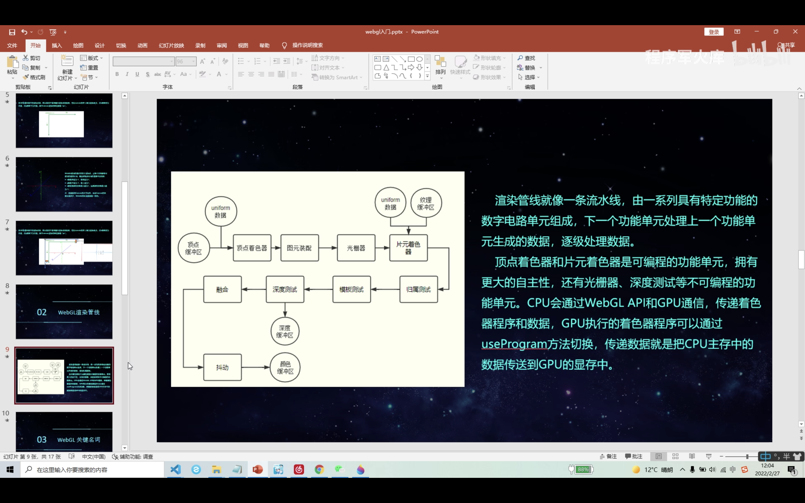
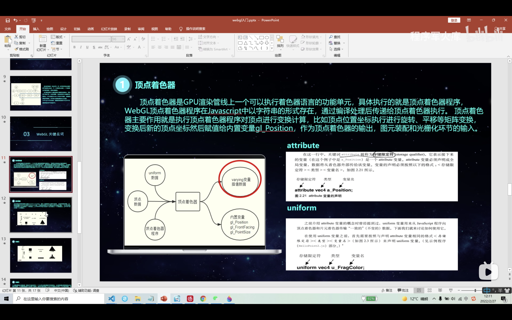
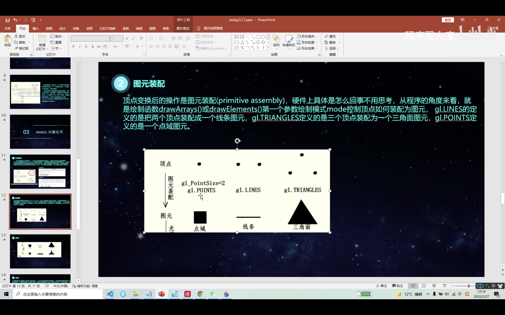
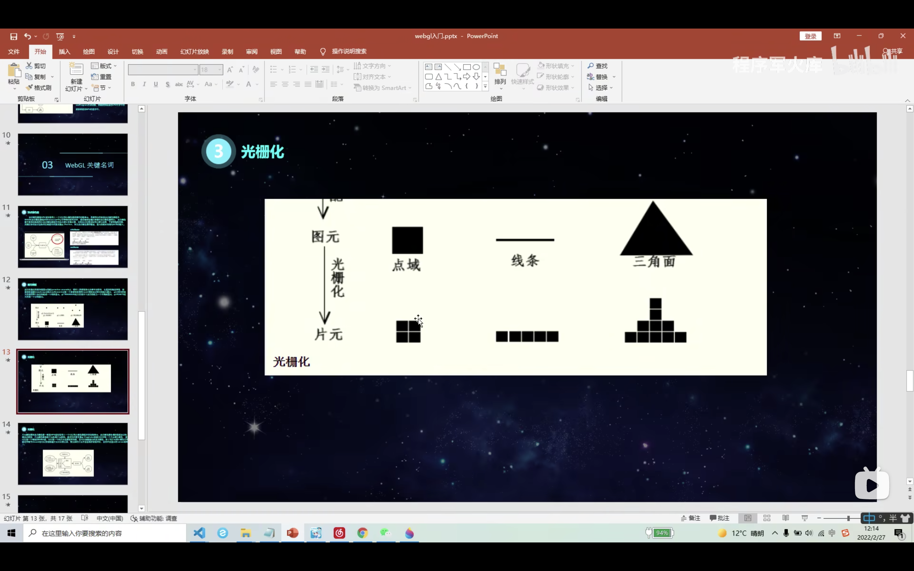
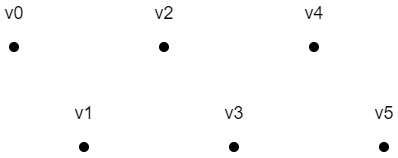
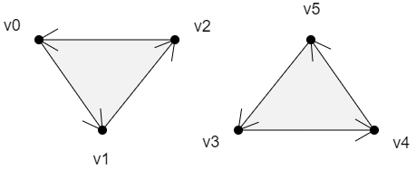
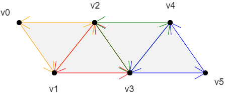

## WebGL?

> WebGL`Web Graphics Library`，是一种**3D 绘图协议**；
>
> 这种绘图技术标准允许把 JavaScript 和 OpenGL ES 2.0 结合在一起；
>
> 通过增加 OpenGL ES 2.0 的一个 JavaScript 绑定，WebGL 可以为 HTML5 Canvas 提供硬件 3D 加速渲染；
>
> 这样就可以借助系统显卡来在浏览器里更流畅地展示 3D 场景和模型；

| 2006    | 事件                                                         |
| :------ | :----------------------------------------------------------- |
| 2006    | WebGL 起源于 Mozilla 员工**弗拉基米尔·弗基西维奇**的一项 Canvas 3D 实验项目 |
| 2007    | 在 FireFox 和 Opera 浏览器中实现                             |
| 2009    | Kronos Group 联盟建立了 WebGL 的工作组，初始成员包括 Apple、Google、Mozilla、Opera 等 |
| 2011/03 | WebGL 1.0 规范发布                                           |
| 2017/01 | WebGL 2 规范发布，在 Firefox 5、Chrome 56、Opera 43 中被支持 |

> WebGL 与其他的三维开发相比的不足之处；
>
> **效果略差**：较于桌面端的 API ：Direct3D、OpenGL、UE、Unity；
>
> **开发成本**：熟悉并掌握一定的数据知识，尤其是线性代数；
>
> **硬件要求**：开发及部署系统硬件要求较好，尤其是 GPU；


## 坐标系( Coordinate )


### webgl

> webgl 使用的是**正交右手坐标系**，坐标原点在画布中心，坐标系的 y 轴方向是朝上的；
>
> 且 webgl 坐标轴的取值范围是 `[-1, 1]`；
>
> 


### canvas 2D

> 坐标系的原点在左上角，坐标系的 y 轴方向是朝下的；
>
> canvas 2d 坐标系以像素为单位；
>
> 


## 渲染管线( Render )

> 类似于一条流水线，由一系列具有特定功能的数字电路单元组成；
>
> **下一个功能单元处理上一个功能单元生成的数据，逐级处理数据**；
>
> 

> 顶点着色器；
>
> 在 Javascript 中以**字符串**的形式存在，通过编译处理后传递给顶点着色器执行；
>
> 变换后新的顶点坐标会赋值给内置变量`gl Position`；
>
> 并作为顶点着色器的输出，图元装配和光栅化环节的输入；
>
> 

> 片元着色器；
>
> 和**顶点着色器**一样是 GPU 渲染管线上一个可以执行着色器程序的功能单元；
>
> 通过关键字`discard`可以实现哪些片元可以被丢弃，被丢弃的片元不会出现在帧缓冲区，就不会显示在`canvas`画布上；

> 图元装配；
>
> 经过**顶点着色器**操作变换后的是**图元装配(primitive assembly)**；
>
> **控制该怎么去绘制图形、绘制什么样的图形**；
>
> `gl.LINES`是将两个顶点装配成一个**线条图元**；
>
> `gL.TRIANGLES`是将三个顶点装配为一个**三角面图元**；
>
> `gl.PQINTS`是一个**点域图元**；
>
> 

> 光栅化；
>
> 将**图元装配**处理后的图形，转换成**像素点**；
>
> 

> webgl 渲染引擎使用的是`GLSL ES` 语言去绘制 3D 图形，和`JavaScript` 语言不相同；
>
> 所以需要一个**程序对象( program )**，承载GLSL ES语言；
>
> 用来翻译GLSL ES语言和js语言，使两者可以相互通信；
> 
> ```html
> <!-- 在html中建立canvas 画布 -->
> <canvas id="canvas"></canvas>
> 
> <!-- 顶点着色器 -->
>   <script id="vertexShader" type="x-shader/x-vertex">
>    	void main(){
>    	//点位
>     gl_Position=vec4(0, 0, 0, 1);
>    //尺寸
>  gl_PointSize=50.0;
> }
> </script>
> <!-- 片元着色器 -->
> <script id="fragmentShader" type="x-shader/x-fragment">
> 	void main(){
> 		gl_FragColor=vec4(1, 1, 0, 1);
> 	}
> </script>
>   
>   <script type="module">
>   import { initShader } from "../jsm/Utils.js" // 引入 shader 初始化方法
>   
>   const canvas = document.querySelector("#canvas") // 获取canvas画布
> canvas.width = window.innerWidth // 设置宽高
>   canvas.height = window.innerHeight
>   
>   // 获取着色器文本
> const vsSource = document.querySelector("#vertexShader").innerText // 顶点着色器源
>   const fsSource = document.querySelector("#fragmentShader").innerText // 片元着色器源
> 
>   const webgl = canvas.getContext("webgl") // 获取 webgl 上下文
>   
>   // 初始化着色器
> // 功能：解析着色器文本，整合到程序对象里，关联webgl上下文对象，实现两种语言的相互通信
>   initShaders(webgl, vsSource, fsSource)
>   
> webgl.clearColor(0, 0, 0, 1) // 声明清空画布的颜色，存储在内存中
>   webgl.clear(gl.COLOR_BUFFER_BIT) // 使用内存中的颜色清空画布
>   
> // 绘制 点类型
> webgl.drawArrays(webgl.POINTS, 0, 1)
></script>
> ```
>
> `../jsm/Utils.js`路径中的**模块化**内容， 封装的用来**初始化着色器**的方法；
> 
>   ```js
>   function loadShader(webgl, type, source) {
>   const shader = webgl.createShader(type) // 根据着色类型，建立着色器对象
>   webgl.shaderSource(shader, source) // 将着色器源文件传入着色器对象中
>   webgl.compileShader(shader) // 编译着色器对象
>   return shader // 返回着色器对象
>   }
>   
> // 导出初始化 shader （着色器） 方法
> export function initShaders(webgl, vsSource, fsSource) {
> const program = webgl.createProgram() // 创建程序对象
> const vertexShader = loadShader(webgl, webgl.VERTEX_SHADER, vsSource) // 建立 顶点着色器对象
>   const fragmentShader = loadShader(webgl, webgl.FRAGMENT_SHADER, fsSource) // 建立 片元着色器对象
>   webgl.attachShader(program, vertexShader) // 把顶点着色对象装进程序对象中
>   webgl.attachShader(program, fragmentShader) // 把片元着色对象装进程序对象中
>   webgl.linkProgram(program) // 连接 webgl 上下文对象和程序对象
>   webgl.useProgram(program) // 使用启动程序对象
>   webgl.program = program // 将程序对象挂到上下文对象上
>   return true
>   }
>   ```


## 着色器 ( Shaders )

> 分为**`顶点着色器( Vertex shader )`**和**`片元着色器( Fragment shader )`**；
>
> 举个例子：两点决定一条直线
>
> **顶点着色器**里的顶点就是决定这一条直线的两个点；
>
> **片元着色器**里的片元就是把直线画到画布上后，这两个点之间构成直线的每个像素；
>
> WebGL 的着色器语言是`GLSL ES`语言；
>
> 是`GLSL( OpenGL Shading Language )`和`JS`语言的结合，运行在浏览器端的着色器语言；

> ```html
><!-- 顶点着色程序 -->
> <script id="vertexShader" type="x-shader/x-vertex">
>void main() {
> 	gl_Position = vec4(0.0, 0.0, 0.0, 1.0);
> 	gl_PointSize = 100.0;
> 	}
>   </script>
>   
>   <!-- 片元着色程序 -->
> <script id="fragmentShader" type="x-shader/x-fragment">
> void main() {
> 	gl_FragColor = vec4(1.0, 1.0, 0.0, 1.0);
> 	}
> </script>
>   ```

[^void main()]:着色器语言中的主体函数；
[^gl_Position]:顶点着色器，顶点的位置（固定名称）；
[^gl_PointSize]:顶点着色器，顶点的尺寸（固定名称）；
[^gl_FragColor]:片元着色器，片元的颜色（固定名称）；
[^vec4]:4 维矢量对象；


### VertexShader

> 顶点着色器；
>
> 是**GPU 渲染管线**上一个可以执行**着色器语言**的功能单元；
>
> 执行顶点着色器程序对顶点进行变换计算，比如顶点位置坐标执行旋转平移等矩阵变换；


#### attribute

> 被称为**存储限定符**，表示接下来的变量是一个`attribute`变量；
>
> **必须全局声明，且数据要从着色器外部传递给该变量**；
>
> ```glsl
> // 格式: <存储限定符> <类型> <变量名称>
> attribute vec4 a_Position;
> ```

[^Tip]: `attribute`只能在**顶点着色器**中使用；


#### uniform

> 用来从`JavaScript` 程序向`顶点着色器`和`片元着色器`传输**一致的（不变的）**的数据；
>
> 使用`uniform`变量之前，必须先声明变量；
>
> ```glsl
> // 格式: <存储限定符> <类型> <变量名称>
> uniform vec4 u_FragColor;
> ```

[^Tip]: `uniform`在**顶点着色器**和**片元着色器**中都可以使用；


### FragmentShader

> 片元着色器；
>
> 逐片元处理片元数据，通过给**内置变量**`gl_FragColor`赋值可以给每个片元进行着色；


## 同步绘图 ( Async )

> `webgl.drawArrays()`方法只可以进行**同步绘图**；

> 走完 js 主线程后，再次绘图时，就会从头再来；
>
> **异步执行**的`drawArrays()`方法会把画布上之前绘制的图像都刷掉；
>
> ```js
> const a_Position = gl.getAttribLocation(gl.program, "a_Position") // 获取属性
> gl.clearColor(0, 0, 0, 1); // 声明颜色
> gl.clear(gl.COLOR_BUFFER_BIT); // 刷底色
> 
> gl.vertexAttrib2f(a_Position, -0.3, 0); // 修改 attribute 变量
> gl.drawArrays(gl.POINTS, 0, 1); // 绘制 点类型
> gl.vertexAttrib2f(a_Position, 0.3, 0);
> gl.drawArrays(gl.POINTS, 0, 1);
> // 此时画布上同步绘制了两个点
> 
> // 异步绘制
> setTimeout(() => {
>   gl.vertexAttrib2f(a_Position, 0, 0)
>   gl.drawArrays(gl.POINTS, 0, 1)
> }, 1000)
> // 此时画布上只有异步绘制的一个点，之前的会被清除掉
> ```

> 用数组把一开始的那两个顶点存起来，在异步绘制后续的顶点的时候，把之前的两个顶点也一起画上；
>
> ```javascript
> const a_Position = gl.getAttribLocation(gl.program, "a_Position");
> gl.clearColor(0, 0, 0, 1);
> gl.clear(gl.COLOR_BUFFER_BIT);
> 
> // 渲染方法
> function render() {
>     gl.clear(gl.COLOR_BUFFER_BIT);
>     // 遍历 顶点数据 数组，有几组数据，就绘制几个图形
>     a_points.forEach(({ x, y }) => {
>        gl.vertexAttrib2f(a_Position, x, y);
>        gl.drawArrays(gl.POINTS, 0, 1);
>     });
> }
> 
> // 存储顶点数据的数组
> const a_points = [
>     { x: -0.3, y: 0 },
>     { x: 0.3, y: 0 },
> ]
> 
> render() // 调用渲染方法绘制图形，此时为 同步绘制
> 
> setTimeout(() => {
>      a_points.push({ x: 0, y: 0 }) // 增加 顶点数据
>      render() // 绘制渲染，此时为异步
> }, 1000);
> ```


## 绘图方式 ( Drawing Mode )

> 1. 建立着色器源文件
>
> ```html
> <!-- 顶点着色器源 -->
> <script id="vertexShader" type="x-shader/x-vertex">
> 	attribute vec4 a_Position;
> 	void main(){
> 		gl_Position = a_Position;
> 		gl_PointSize = 20.0;
> 	}
> </script>
> 
> <!-- 片元着色器源 -->
> <script id="fragmentShader" type="x-shader/x-fragment">
> 	void main(){
> 		gl_FragColor=vec4(1.0,1.0,0.0,1.0);
> 	}
> </script>
> ```
>
> 2. 获取 webgl 上下文
>
> ```js
> const canvas = document.getElementById('canvas');
> canvas.width = window.innerWidth;
> canvas.height = window.innerHeight;
> const webgl = canvas.getContext('webgl');
> ```
>
> 3. 初始化着色器
>
> ```js
> const vsSource = document.getElementById('vertexShader').innerText
> const fsSource = document.getElementById('fragmentShader').innerText
> initShaders(webgl, vsSource, fsSource)
> ```
>
> 4. 在 js 中建立保存顶点数据的向量数组
>
> ```js
> // 创建存储顶点数据的向量数组，两个浮点数构成一个顶点，分别代表 x、y 值
> const vertices = new Float32Array([
>   // x, y
>   0.0, 0.1, // 顶点-1
>   -0.1, -0.1, // 顶点-2
>   0.1, -0.1 // 顶点-3
> ])
> ```
>
> 5. 因为 js 与 GLSL ES 语言不相通，js 中的顶点数据 vertices ，着色器无法读取，即建议一个着色器和 js 都能进入的公共区
>
> ```js
> // createBuffer()
> const vertexBuffer = webgl.createBuffer() // 创建缓冲区对象
> ```
>
> 6. 此时缓冲区对象是独立存在的，只是一个空着的仓库，接下来让其和着色器建立连接
>
> 语法：`webgl.bindBuffer(target, buffer)`
>
> [^target]:要把**缓冲区对象**放在 webgl 系统中的位置；
> [^buffer]:要绑定的**缓冲区对象**；
>
> ```js
> // bindBuffer()
> webgl.bindBuffer(webgl.ARRAY_BUFFER, vertexBuffer) // 绑定缓冲区对象
> ```
>
> 7. 当缓冲区和着色器建立了绑定关系，就可以往这块空间写入数据了
>
> 语法：`webgl.bufferData(target, data, usage) `
>
> [^target]:要把**缓冲区对象**放在 webgl 系统中的位置；
> [^data]:缓冲区的**数据**；
> [^usage]:向缓冲区写入数据的方式，`webgl.STATIC_DRAW`是向缓冲区中一次性写入数据，着色器会绘制多次；
>
> ```js
> webgl.bufferData(webgl.ARRAY_BUFFER, vertices, webgl.STATIC_DRAW) // 往缓冲区对象中写入数据
> ```
>
> 8. 让着色器知道这个缓冲区仓库是给哪个变量，例子中是用于控制位置的 attribute 变量，可以提高绘图效率
>
> 语法：`webgl.vertexAttribPointer(local, size, type, normalized, stride, offset)`
>
> [^local]:指定要分配的 attribute 变量；
> [^size]:顶点分量的个数，例子中的 vertices 数组中，两个数据表示一个顶点，则值就为 2 ；
> [^type]:**数据类型**，比如`webgl.FLOAT`浮点类型；
> [^normalized]:是否将顶点数据归一；
> [^stride]:相邻两个顶点间的字节数，例子中写的是 0 ，则顶点之间是紧挨着的；
> [^offset]:从缓冲区数据的哪个位置开始存储变量，例子中写的是 0 ，则从头开始存储变量；
>
> ```js
> const a_Position = webgl.getAttribLocation(webgl.program, "a_Position") // 获取 attribute 变量
> // 将缓冲区对象分配给 attribute 变量
> webgl.vertexAttribPointer(a_Position, 2, webgl.FLOAT, false, 0, 0) // 修改 attribute 变量
> ```
>
> 9. 因为缓冲区里的顶点数据是数组，里面有多个顶点，要开启让着色器批量处理顶点数据的属性
>
> 语法：`webgl.enableVertexAttribArray(local)`
>
> [^local]:指定的 attribute 变量；
>
> ```js
> webgl.enableVertexAttribArray(a_Position) // 赋能-开启顶点数据的批处理功能
> ```
>
> 10. 清理画布
>
> ```js
> gl.clearColor(0.0, 0.0, 0.0, 1.0)
> gl.clear(gl.COLOR_BUFFER_BIT)
> ```
>
> 11. 开始绘图
>
> ```js
> gl.drawArrays(gl.POINTS, 0, 3) // 绘制 点类型
> ```
>


### webgl.drawArrays()

> 方法用于从向量数组中绘制图元；
>
> 语法：`webgl.drawArrays(mode, first, count)`；

[^mode]:**类型**，指定绘制图元的方式，可以为`POINTS`、`LINE_STRIP`、`LINE_LOOP`、`LINES`、`TRIANGLE_STRIP`、`TRIANGLE_FAN`、`TRIANGLES`
[^first]:指定从向量数组中的哪个点开始绘制；
[^count]:指定绘制需要使用到向量数组中的多少个点；


#### webgl.POINTS

> 绘制可视的点，绘制顺序是：v0 -> v1 -> v2 -> v3 -> v4 -> v5
>
> 


#### webgl.LINES

> 绘制两个顶点相连的线段，绘制顺序是：v0 -> v1，v2 -> v3，v4 -> v5
>
> 


#### webgl.LINE_STRIP

> 用顶点数据绘制出连续的线段， 绘制顺序是：v0 -> v1 -> v2 -> v3 -> v4 -> v5
>
> 


#### webgl.LINE_LOOP

> 绘制出连续且首位闭合的线条，绘制顺序是：v0 -> v1 -> v2 -> v3 -> v4 -> v5 -> v0
>
> 


#### webgl.TRIANGLES

> 绘制单独的三角形面，绘制顺序是：v0 -> v1 -> v2 ，v3 -> v4 -> v5
>
> 

[^Important]:webgl 可以绘制的面只有三角面，要绘制矩形面的话，只能用两个或多个三角形面去拼接


#### webgl.TRIANGLE_STRIP

> 绘制三角带
>
> ```tex
> 绘制顺序是：
> 
> v0 -> v1 -> v2
> 
> 以上一个三角形的第二条边+下一个点为基础，以和第二条边相反的方向绘制三角形
> v2 -> v1 -> v3
> 
> 以上一个三角形的第三条边+下一个点为基础，以和第二条边相反的方向绘制三角形
> v2 -> v3 -> v4
> 
> 以上一个三角形的第二条边+下一个点为基础，以和第二条边相反的方向绘制三角形
> v4 -> v3 -> v5
> 
> 
> 规律：
> 
> 第一个三角形：v0 -> v1 -> v2
> 
> 第偶数个三角形：以上一个三角形的第二条边+下一个点为基础，以和第二条边相反的方向绘制三角形
> 
> 第奇数个三角形：以上一个三角形的第三条边+下一个点为基础，以和第二条边相反的方向绘制三角形
> ```
>
> 


#### webgl.TRIANGLE_FAN

> 绘制三角扇
>
> ```tex
> 绘制顺序是：
> 
> v0 -> v1 -> v2
> 
> 以上一个三角形的第三条边+下一个点为基础，按照和第三条边相反的顺序，绘制三角形
> v0 -> v2 -> v3
> 
> 以上一个三角形的第三条边+下一个点为基础，按照和第三条边相反的顺序，绘制三角形
> v0 -> v3 -> v4
> 
> 以上一个三角形的第三条边+下一个点为基础，按照和第三条边相反的顺序，绘制三角形
> v0 -> v4 -> v5
> 
> 规律：
> 
> 所有三角形，都是从 v0 开始绘制
> ```
>
> 


## 程序交互 ( Communication )

> 通过在 JavaScript 程序中向**顶点着色器**和**片元着色器**传递变量参数；
>
> 动态控制位置、大小、图形、颜色...


### attribute

[^Tip]:`attribute`存储限定符只能在**顶点着色器**中使用；


#### 声明

> 在**顶点着色器**中声明`attribute`变量；
>
> ```html
> <script id="vertexShader" type="x-shader/x-vertex">
> 	attribute vec4 a_Position;
> 	attribute float a_PointSize;
> 
> 	void main(){
> 		gl_Position = a_Position;
> 		gl_PointSize = a_PointSize;
> 	}
> </script>
> ```
>
> [^attribute]:**存储限定符**，专门用于向外部导出与点位相关的对象的，类似于 es6 模板语法中 export；
> [^vec4]:**变量类型**，vec4 是四维矢量对象；
> [^float]:**变量类型**，float 是浮点类型；
> [^a_Position]:**变量名**，在 js 中会根据这个变量名导入变量，是一个指针，指向实际数据的存储位置；即在着色器外部改变了`a_Position`所指向的实际数据，那么在着色器中`a_Position`所对应的数据也会随之修改；


#### 获取

> 在 js 中获取 attribute 变量；
>
> 通过`webgl.getAttribLocation(shaderProgram, parameter)`；
>
> [^webgl]:webgl 的上下文对象；
> [^shaderProgram]:初始化着色器时，在上下文对象上挂载的 program 程序对象；
> [^parameter]:要获取的变量名称，着色器暴露出的变量名；
>
> ```js
> // 通知 program 程序对象去顶点着色器里找一个名称叫 a_Position 的 attribute 变量
> const a_Position = webgl.getAttribLocation(webgl.program, 'a_Position') // 位置
> 
> // 通知 program 程序对象去顶点着色器里找一个名称叫 a_PointSize 的 attribute 变量
> const a_Position = webgl.getAttribLocation(webgl.program, 'a_PointSize') // 大小
> ```


#### 修改

> 在 js 中修改 attribute 变量；
>
> 通过`webgl.vertexAttrib3f(parameter, value_0, value_1, value_2)`；
>
> [^vertexAttrib3f()]:在传递的参数中，`a_Position`是之前获取的着色器变量，后面的 3 个参数是顶点的 x、y、z 位置；
>
> ```js
> webgl.vertexAttrib3f(a_Position, 0.0, 0.5, 0.0) // 修改 位置
> 
> webgl.vertexAttrib1f(a_PointSize, 60.0) // 修改 大小
> ```
>
> `vertexAttrib3f()`的同族函数；
>
> ```js
> // 都可以改变 attribute 变量的值；
> // 例如 vertexAttrib1f() 方法自定一个矢量对象的 v0 值，v1、v2 则默认为0.0，v3默认为1.0，其数值类型为float 浮点型；
> 
> webgl.vertexAttrib1f(parameter, v0) 
> webgl.vertexAttrib2f(parameter, v0, v1)
> webgl.vertexAttrib3f(parameter, v0, v1, v2)
> webgl.vertexAttrib4f(parameter, v0, v1, v2, v3)
> ```


### uniform

[^Tip]: `uniform`存储限定符在**顶点着色器**和**片元着色器**中都可以使用；


#### 声明

> 在**片元着色器**中声明`uniform`变量；
>
> ```html
> <script id="fragmentShader" type="x-shader/x-fragment">
> 	precision mediump float;
> 	uniform vec4 u_FragColor;
> 	
> 	void main() {
> 		gl_FragColor = u_FragColor;
> 	}
> </script>
> ```
>
> [^Focus]: `precision mediump float`是对浮点数精度的定义，`mediump`是**中等精度**的意思，必须要写，否则画不出东西；


#### 获取

> 在 js 中获取 uniform 变量；
>
> 通过`webgl.getUniformLocation(shaderProgram, parameter)`；
>
> ```js
> // 通知 program 程序对象去顶点着色器里找一个名称叫 a_Position 的 attribute 变量
> const u_FragColor = webgl.getUniformLocation(webgl.program, 'u_FragColor') // 片元颜色
> ```


#### 修改

> 在 js 中修改 uniform 变量；
>
> 通过`webgl.uniform4f(parameter, value_0, value_1, value_2, value_3)`；
>
> 或者`webgl.uniform4fv(parameter, Float32Array)`；
>
> [^Float32Array]:	是一种 32 位的浮点型数组，它在浏览器中的运行效率要比普通的 Array 高很多；
>
> ```js
> webgl.uniform4f(u_FragColor, 1.0, 1.0, 0.0, 1.0) // 修改 片元颜色
> 
> // 使用 webgl.uniform4fv 写法
> const color = new Float32Array([1.0, 1.0, 0.0, 1.0]) // 创建 浮点 数组
> webgl.uniform4fv(u_FragColor, color)
> ```


## 案例 ( Case )


### 鼠标点击绘制圆点

> ```html
> <canvas id="canvas"></canvas>
> <!-- 顶点着色器 -->
> <script id="vertexShader" type="x-shader/x-vertex">
> 	attribute vec4 a_Position;
> 	attribute float a_PointSize;
>   void main(){
>   	gl_Position = a_Position;
>     gl_PointSize = a_PointSize;
>   }
> </script>
> <!-- 片元着色器 -->
> <script id="fragmentShader" type="x-shader/x-fragment">
> 	precision mediump float;
> 	uniform vec4 u_FragColor;
> 	void main(){
> 		// 计算距离，绘制圆形
> 		float dist = distance(gl_PointCoord,vec2(0.5,0.5)); 
> 		if (dist < 0.5){
> 			gl_FragColor = u_FragColor;
> 		}else{
> 			// 丢弃，不渲染该片元区域
> 			discard;
> 		}
> 	}
> </script>
> <script type="module">
>     import { initShaders } from "../jsm/Utils.js";
> 
>     const canvas = document.querySelector("#canvas");
>     canvas.width = window.innerWidth;
>     canvas.height = window.innerHeight;
> 
>     // 获取着色器文本
>     const vsSource = document.querySelector("#vertexShader").innerText;
>     const fsSource = document.querySelector("#fragmentShader").innerText;
> 
>     const gl = canvas.getContext("webgl");
> 
>     // 初始化着色器
>     initShaders(gl, vsSource, fsSource);
> 
>     // 设置变量
>     const a_Position = gl.getAttribLocation(gl.program, "a_Position");
>     const a_PointSize = gl.getAttribLocation(gl.program, "a_PointSize");
>     const u_FragColor = gl.getUniformLocation(gl.program, "u_FragColor");
> 
>     const a_points = [
>        { x: 0, y: 0, size: 10, color: { r: 1, g: 0, b: 0, a: 1 } },
>     ];
> 
>     // 声明颜色 rgba
>     gl.clearColor(0, 0, 0, 1);
>     // 刷底色
>     gl.clear(gl.COLOR_BUFFER_BIT);
> 
>     render(); // 渲染绘制
> 
>     // 鼠标点击事件
>     canvas.addEventListener("click", ({ clientX, clientY }) => {
>        // 解决 webgl 画布的坐标系差异问题
>        const { left, top, width, height } = canvas.getBoundingClientRect() // 获取 canvas 的边界信息
>        // 计算 点击位置距离 canvas 画布 左上角 的像素
>        const [cssXForCanvas, cssYForCanvas] = [clientX - left, clientY - top]
>        const [halfWidth, halfHeight] = [width / 2, height / 2];
>        // 最终赋值给 webgl 的坐标
>        const [x, y] = [
>          (cssXForCanvas - halfWidth) / halfWidth,
>          -(cssYForCanvas - halfHeight) / halfHeight,
>        ];
> 
>        const size = Math.random() * 20 + 5; // 随机大小
> 
>        const n = Math.random();
>        const color = { r: n, g: n, b: 1, a: 1 }; // 随机颜色
> 
>        a_points.push({ x, y, size, color }); // 添加数据
>        render();
>     })
> 
>     // 渲染方法
>     function render() {
>        gl.clear(gl.COLOR_BUFFER_BIT);
>        a_points.forEach(({ x, y, size, color: { r, g, b, a } }) => {
>          gl.vertexAttrib2f(a_Position, x, y);
>          gl.vertexAttrib1f(a_PointSize, size);
>          // gl.uniform4f(u_FragColor, r, g, b, a);
>          const arr = new Float32Array([r, g, b, a]);
>          gl.uniform4fv(u_FragColor, arr);
>          gl.drawArrays(gl.POINTS, 0, 1);
>        })
>     }
> </script>
> ```


## 数学公式 ( Math )


### 三角函数

> ```mathematica
> 正弦和角公式
> sin(α+β) = sinαcosβ + cosαsinβ
> 正弦差角公式
> sin(α-β) = sinαcosβ - cosαsinβ
> 
> 余弦和角公式
> cos(α+β) = cosαcosβ - sinαsinβ
> 余弦差角公式
> cos(α-β) = cosαcosβ + sinαsinβ
> ```


