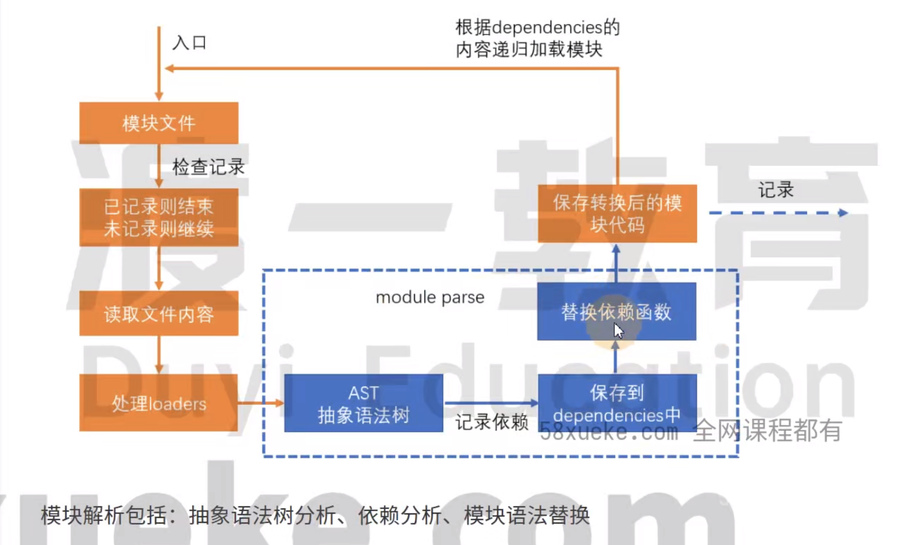
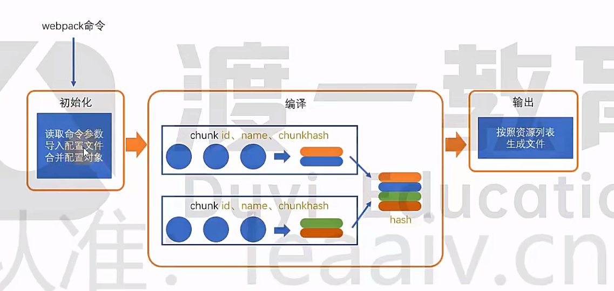
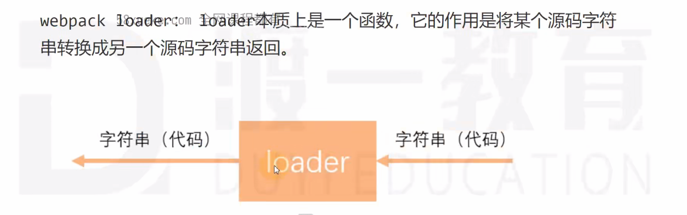
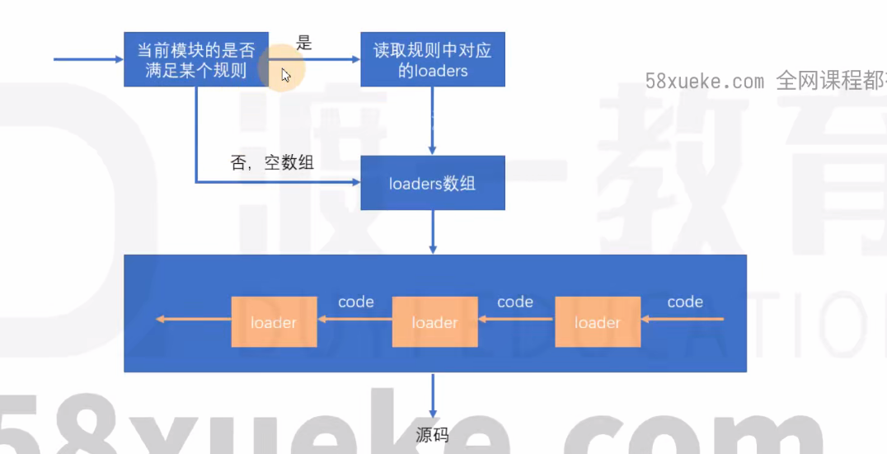
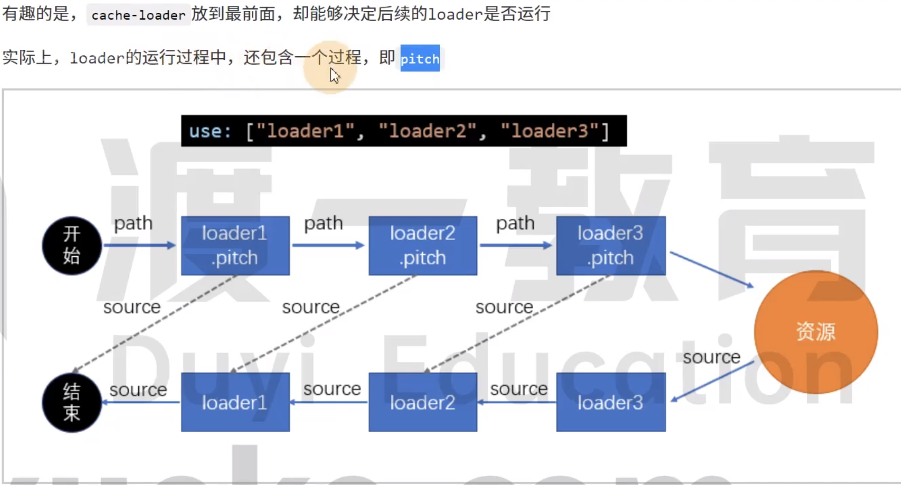
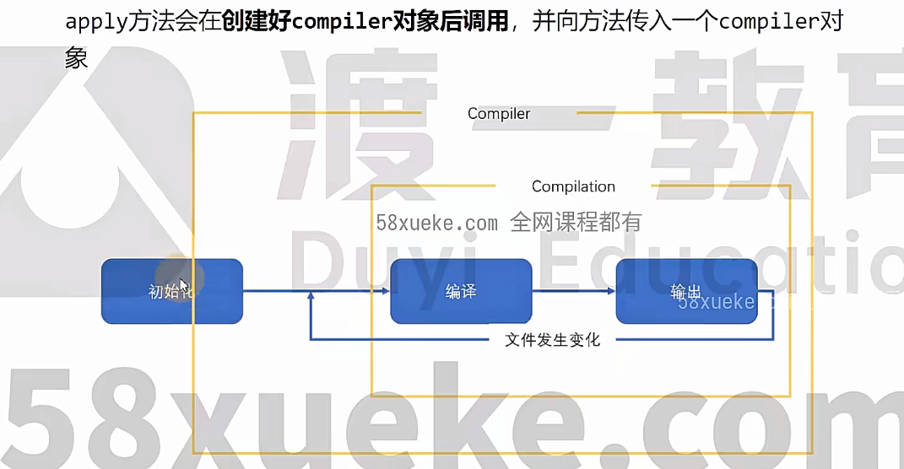

# `Webpack`?

`Webpack`是一种前端资源构建工具，一个静态模块打包器(module bundle)；

前端项目工程化的具体解决方案；

Webpack 的核心功能是**处理模块依赖并打包**，但它有一个基础限制：**默认只能识别和处理 JavaScript 与 JSON 文件**


#### 处理流程

Webpack 将前端的所有资源文件：`JavaScript`、`JSON`、`CSS`、`img`、`LESS` ...等做模块处理
根据模块间的依赖关系进行静态分析，打包生成对应的静态资源(bundle)；


#### 配置文件

在项目根目录下创建 `webpack.config.js` 文件；将配置信息写在此文件中


#### Initialize

下载 webpack 打包构建的模块；

```shell
npm install webpack webpack-cli --save-dev
# 下载内存构建打包模块
npm install webpack-dev-server --save-dev
```


# 配置文件运行时机

执行打包命令时是，`Node`会找到`webpack.config.js`配置文件（或自定义配置文件）在`Node`环境下运行
所以文件中必须是有效无报错的`CommonJS`规范代码

或者在`package.json`中设置`"type": "module"`，将默认模块化规范设置为`ES Module`规范
则在`webpack.config.js`文件使用`ES Module`规范书写代码，但不建议

但是被打包的项目代码文件，并不会在打包过程中主动运行
**仅在模块解析时被动执行导入副作用（如顶层console.log）**
`webpack`只是分析模块文件的导入导出语句
构建“模块依赖树”，但不会执行代码中的业务逻辑

这也是为什么需要eslint、babel等一些插件的原因


# `Source-Map`

源码地图，实际部署运行的代码是打包处理后的代码，对错误调试不友好
我们更希望看到编写的源码中错误，而不是打包合并后的

sourcemap应在开发环境中使用,作为一种调试手段
不应该在生产环境中使用,source map的文件一般较庆大
不仅会导致额外的网络传输,还容易暴露原始代码。即便要在生产环境中
使用sourcemap,用于调试真实的代码运行问题,也要做出一些处理规
避网络传输和代码暴露的问题。

webpack通过`devtool`配置源码地图


# 编译过程

初始化
此阶段,webpack会将CLI参数、配置文件、默认配置进行融合合,形成一个最终的配置对象。
对配置的处理过程是依托一个第三方库yargs完成的
目前,可以简单的理解为,初始化阶段主要用于产生一个最终的配置，为开始编译做准备

编译

1.创建chunk
Chunk块，是webpack在内部构建过程中的一个概念，表示通过某个入口找到的所有依赖的统称
可以理解为构建阶段的 “模块集合”

根据入口模块(默认为./src/index.js)创建一个chunk

每个chunk都有至少两个属性:
name:默认为main
id:唯一编号,开发环境和name相同,生产环境是一个数字,从9开始







涉及术语
1.module:模块,分割的代码单元,webpack中的模块可以是任何内容的
文件,不仅限于JS
2.chunk:webpack内部构建模块的块,一个chunk中包含多个模块,这些
模块是从入口模块通过依赖分析得来的

3. bundle
构建好模块后会生成chunk的资源清单,清单中的每一项
就是一个bundle,可以认为bundle就是最终生成的文件
是最终输出到磁盘的文件（可以理解为构建完成后生成的物理文件）
3. hash:最终的资源清单所有内容联合生成的hash值
5.chunkhash:chunk生成的资源清单内容联合生成的hash值
6.chunkname:chunk的名称,如果没有配置则使用main
7.id:通常指chunk的唯一编号,如果在开发环境下构建和chunkname相
同;如果是生产环境下构建,则使用一个从0开始的数字进行编号


# `AST`抽象语法树


# `compiler`


事件类型
这一部分使用的是Tapable API,这个小型的库是一个专门用于钩子函数监
听的库。
它提供了一些事件类型:
tap:注册一个同步的钩子函数,函数运行完毕则表示事件处理结束
tapAsync:z注册一个基于回调的异步的钩子函数,函数通过调用一个回调表示事件处理结束
tapPromise:注册一个基于Promise的异步的钩子函数,函数通过返回的Promise进入已决状态表示事件处理结束

处理函数
处理函数有一个事件参数compilation


# `loader-utils`


# `webpack-merge`


# 配置项


## `Entry`

入口`Entry`指示 Webpack 以哪个文件为入口起点开始打包;

分析构建内部依赖图

```js
module.export = {
  entry: {
    // 属性名：chunk 名称，属性值：入口模块文件
    main: './src/mian.js'
    test: './src/test.js'
  },
  
  // 单入口时也可以直接简写成路径字面量
  entry: './src/main.js',
  
  // 数组多启动模块，打包后依然是一个 chunk
  entry: ['./src/mian.js', './src/test.js']
}
```

在不手动或自动分割代码的默认情况下，一个`chunk`对应一个`bundle`

但在实际场景中，往往不是对应的关系：

- 例如`import()`动态导入语法，导入的模块单独分成一个`chunk`
- 使用优化手段`splitChunks`进行代码分割
- 公共依赖（如`lodash`）可能被提取为`vendor chunk`


## `output`

输出`Output`指示 Webpack 打包后的资源`bundle`要输出到哪里去，以及如何命名；

```js
module.exports = {
  output: {
    /* 打包后所有资源的输出路径，必须是一个绝对路径 */
    path: path.join(__firname, '/bundle'),
    
    /* 合并后的 bundle 文件名规则 */
    // 1. 单文件入口的静态写法
    filename: 'js/bundle.js',
    // 2. 多入口的动态写法
    // - [name]：对应了 entry 入口中配置的 chunk 名称
    // - [hash]：总资源列表的 hash
    // - [contenthash]：文件内容变化时哈希值变化，hash 可用于服务器的缓存控制
    // - [chunkhash]：每个 chunk 块的 hash 值
    // - [id]： chunk 块的 id 值
    filename: 'js/[name]-[chunkhash:10].js',
    
    // 非入口 chunk 文件打包后的文件名规则
    // 例如通过代码分割生成的 chunk（如路由懒加载、splitChunks 拆分的第三方库）
    chunkFilename: 'js/[name]-[chunkhash:10].chunk.js',
     
    /* 静态资源（如图片）的输出路径 */
    assetModuleFilename: 'assets/[hash][ext][query]',
    
    // 所有公共资源引入公共路径前缀
    publicPath: '/',
    
    // 单独打包的库向外暴露时的文件名称；结合 dll 使用
    library: '[name]_[hash]'
  }
}
```


## `loader`


**为什么需要`Loader`？**

`Webpack`的核心功能是**处理模块依赖并打包**，但默认只能识别和处理`JavaScript`与`JSON`文件
而实际开发中会用到大量非`JS`类型的文件（如`css/less/sass`、`TS`、`图片/媒体资源`、`Vue`组件等）
这些文件无法被`Webpack`直接解析为可处理的模块
因此需要一种 "中间转换工具"，将这些非`JS`文件转换为`Webpack`能理解的格式，这就是`loader`存在的必要性

**`Loader`是什么？**

loader 的本质是**一个遵循特定规范的 Node.js 模块**，它的核心是导出一个**转换函数**。

```js
// 一个简单的 Loader
function loader(source) {
  // source 为输入的文件内容（字符串或 Buffer 缓冲区数据）
  const result = source.toUpperCase()
  // 返回处理后的内容
  return result
}

module.exports = loader
```

```js
// 使用 loader 
module.exports = {
  module: {
    rules: [
      {
        test: /\.txt$/,
        use: './loaders/uppercase-loader' // 路径指向自定义 loader
      }
    ]
  }
}
```


函数的基本逻辑是：接收**源文件内容**作为参数，通过自定义逻辑处理后，返回**转换后的内容**（通常是 JavaScript 代码，或下一个 loader 可处理的内容）
简单来说，loader 就是**文件转换器**，负责将一种格式的文件转换为另一种格式




```js
module.exports = {
  module: {
    rules: [
      {
        test: /\.js$/, // 正则表达式，匹配 .js 文件
        use: [
          {
            loader: 'babel-loader',
            options: {}
          }
        ], // 处理该类型文件使用的 Loader
        
        /* 使用 include/exclude 限制规则的应用范围，优化 loader 的处理性能 */
        include: './src',
        exclude: 'node_modules'
      },
      
      /* 其他匹配规则 */
    ]
  }
}
```

**`Loader`的处理流程？**




使用方式

- [配置](https://doc.webpack-china.org/concepts/loaders/#configuration)（推荐）：在 `webpack.config.js` 文件中指定 `loader`；
- [内联](https://doc.webpack-china.org/concepts/loaders/#inline)：在每个 `import` 语句中显式指定 `loader`；
- [CLI](https://doc.webpack-china.org/concepts/loaders/#cli)：在 `shell` 命令中指定它们；


### 缓存`loader`

我们可以基于一种假设:如果某个文件内容不变,经过相同的loader解析后,解析后的结果也不变
于是,可以将loader的解析结果保存下来,让后续的解析直接使用保存的结果
`cache-loader`可以实现这样的功能

```js
rules: {
  test: /\.js$/,
  use: ['cache-loader', 'babel-loader']
}
```




### 多线程解析


## `plugins`

插件`Plugins`可以用于执行范围更广的任务；

插件的范围包括：从打包优化和压缩，一直到重新定义环境中的变量

```js
// 插件 plugin 的本质就是一个又 apply 方法的对象或类
module.exports = class MyPlugin {
  // 该方法在初始化是就会执行
  apply(compiler) {
    console.log('插件开始运行了！')
    
    // 注册事件
    compiler.hooks.事件名称.事件类型(name, function(compilation) {
      // 
    })
  }
}
```

```js
module.exports = {
  // 在 plugins 配置数组中使用插件
  plugins: [
    new MyPlugin()
  ]
}
```




## `mode`

模式`Mode`指示 Webpack 使用相应模式的配置；

|  配置选项   |            特点            |
| :---------: | :------------------------: |
| Development | 能让代码本地调试运行的环境 |
| Production  | 能让代码优化上线运行的环境 |


## `resolve`

解析模块配置；

```javascript
resolve: {
// 配置解析模块路径别名：可以简写路径，但是输入没有提示；
alias: {
 $css: path.join(__dirname,'/public/css'),
 // 告诉 webapck ，路径中的中的 @ 表示当前文件目录下的 src 文件夹，简写路径；
 '@': path.join(__dirname,'/src')
},
// 配置可以省略文件的后缀名；
extensions: [
 '.js',
 '.json',
 '.css',
],
// 告诉 webpack 解析模块去找哪个目录；
modules: [path.join(__dirname,'/node_modules'),'node_modules']
}
```


## `devServer`

用于开发环境中使用；

```javascript
devServer: {
  // 指定运行代码的目录，默认是打包后的文件目录；
  contentBase: path.join(__dirname,'/bundle'),
  // 监视 contentBase 目录下的所有文件，一旦文件发生变化就会重新打包；
  watchContentBase: true,
  // 忽视一些目录下的文件的变化；
  watchOptions: {
    ignored: /node_modules/
  },
  // 启动代码压缩；
  compress: true,
  // 端口号；
  port: 8000,
	// 域名；
	host: 'localhost',
	// 自动打开浏览器
	open: true,
	// 开启 HMR 热模块替换
	hot: true,
	// 不要显示启动服务器的日志信息；
	clientLogLevel: 'none',
	// 除了一些基本启动信息之外，其他的内容都不要显示；
	quiet: true,
	// 如果出错了，不要全屏显示错误信息；
	overlay: false,
	// 服务器代理，解决开发环境时的跨域问题；
	proxy: {
    '/api': {
      // 把请求转发给 target ;
      target: 'http://localhost:5000',
      // 路径重写；
      pathRewrite: {
        '^/api': ''
      }
    }
  }
}
```


## `optimization`

production 生产环境时的代码**优化配置**；

```javascript
optimization: {
  // 分裂文件代码；
  splitChunks: {
    chunks: 'all',
    minSize: 30*1024,
    maxSize: 0,
    minChunks: 1,
    maxAsyncRequests: 5,
  },
  // 将当前模块中所记录的其他模块的 hash 值单独打包成一个文件：runtime ；
  // 解决当修该文件 a 时导致文件 b 的 contenthash 值产生变化；
  runtimeChunk: {
    name: entrypoint => `runtime-${entrypoint.name}`
  },
  minimizer: [
    // 配置生产环境时的 js 和 css 的压缩方案；
    // npm install terser-webpack-plugin --save-dev
    new TerserWebpackPlugin({
      // 开启缓存；
      cache: true,
      // 开启多线程打包；
      parallel: true,
      // 启动 source-map 代码调试优化；
      sourceMap: true
    })
  ]
}
```


## `externals`

禁止一些依赖模块被打包，而是在 html 页面中用 src 引入；

```javascript
module.exports = {
externals: {
 // npm包名: 引入时的名称
 // 排除 three.js 依赖文件不进行打包，在 html 页面 CDN 引入
 three: "THREE",
 // 排除 jquery 不进行打包
 jquery: 'jQuery'
}
}
```


## `devtool`

配置 `source-map` 属性，便于代码调试；

```javascript
module.exports = {
 devtool: 'source-map'
}

// development 开发环境下：devtool: 'eval-source-map'
// 快速，精准定位到源代码具体的错误行；

// production 生产环境下：devtool: 'nosources-source-map'
// 或者不开启 source-map；
// 防止源代码泄露，提高网站的安全性；
```


# JS 语法检查

下载依赖的模块插件；

```shell
npm install eslint-loader eslint --save-dev
npm install eslint-config-airbnb-base eslint-plugin-import --save-dev
```

在`package.json`文件中配置`eslintConfig`选项；

```json
"eslintConfig": {
 "extends": "airbnb-base",
 "env": {
    // 支持浏览器端的全局变量，配合 PWA 一起使用；
    "browser": true
 }
}
```

在`module.rules`中配置规则；

```javascript
module: {
rules: [
  {
      // 设置检查规则：
      test: /\.js$/,
      // 注意：只检查自己写的源代码，第三方库是不用检查的；
      exclude: /node_modules/,
      loader: 'eslint-loader',
      options: {
        // 自动修复 eslint 的错误；
        fix: true
      }
  }
]
}
```


# JS 兼容性

下载依赖项；

```shell
npm install @babel/preset-env --save-dev
npm install babel-loader @babel/core --save-dev
npm install core-js --save-dev
```

在`module.rules`中配置规则；

```javascript
module: {
rules: [
 {
   // 按需加载兼容性处理：npm install core-js --save-dev
   test: /\.js$/,
   exclude: /node_modules/,
   loader: 'babel-loader',
   options: {
     presets: [
       [
         '@babel/preset-env',
         {
           // 按需加载；
           useBuiltIns: 'usage',
           // 指定 core-js 版本；
           corejs: {
             version: 3
           },
           // 指定兼容性做到哪个浏览器的版本；
           targets: {
             chrome: '60',
             firefox: '60',
             ie: '8',
             safari: '10',
             edge: '17'
           }
         }
       ]
     ]
   }
 }
]
}
```


# 代码压缩

1.为什么要进行代码压缩
减少代码体积;破坏代码的可读性,I提升破解成本;

2.什么时候要进行代码压缩
生产环境

3.使用什么压缩工具
UglifyJs是一个传统的代码压缩工具,已存在多年,曾经是前端应用的必备工具,但由于它不支持ES6语法,所以目前
的流行度已有所下降。

Terser 是一个新起的代码压缩工具,支持 ES6+语法,因此初皮很多构建工具内置使
用。 webpack 安装后会内置 Terser,当启用生产环境后即可用其进行代码压缩启用生产环境后即可用其进行代码压缩。

因此,我们选择Terser


# gzip


# 压缩 JS 和 HTML 文件


#### JS 文件压缩

更改环境模式；

```javascript
// production 生产环境自带 JS 文件压缩配置；
mode: 'production'
```


#### HTML 文件压缩

在`html-webpack-plugin`模块插件对象中配置`minify`属性；

```javascript
plugins: [
 new HtmlWebpackPlugin({
    template: path.join(__dirname, '/views/index.html'),
    filename: 'views/index.html',
    // 压缩 html 文件；
    minify: {
      // 移除空格；
      collapseWhitespace: true,
      // 移除注释；
      removeComments: true
    }
 })
]
```


# clean-webpack-plugin

在每次打包前自动删除之前打包生成的文件夹，再重新生成一个；

Install

```shell
npm install clean-webpack-plugin --save-dev
```

Use

```javascript
// 加载模块插件
const CleanWebpackPlugin = require('clean-webpack-plugin')
module.exports = {
plugins: [
    new CleanWebpackPlugin()
  ]
}
```


# copy-webpack-plugin

**禁止一些文件被打包，而是保持不变直接复制到打包文件里面**；

Install

```shell
npm install copy-webpack-plugin --save-dev
```

Use

```javascript
// 加载模块文件
const CopyPlugin = require("copy-webpack-plugin")
module.exports = {
plugins: [
 // 设置一些文件不需要被打包
 new CopyPlugin({
   patterns: [
     { from: path.join(__dirname, "./font"), to: "font" },
     { from: path.join(__dirname, "./sound"), to: "sound" },
     { from: path.join(__dirname, "./image"), to: "image" },
     { from: path.join(__dirname, "./static"), to: "static" },
   ]
 })
]
}
```


# 分包

什么是分包

将一个整体的代码,分布到不同的打包文件中


为什么要分包

减少公共代码，降低总体积，特别是一些大型的第三方库
充分利用浏览器

什么时候要分包

多个chunk引入了公共模块
公共模块体积较大或较少的变动


如何分包

手动分包
自动分包

# 性能优化

增加一些配置，提高打包速度和优化代码调试；

构建性能、代码执行性能、网络传输性能

构建性能
这里所说的构建性能,是指在开发阶段的构建性能,而不是生产环境的构建性能
优化的目标,是降低从打包开始,到代码效果呈现所经过的时间
构建性能会影响开发效率。构建性能越高,开发过程中日时间的浪费越少

运行性能
运行性能是指,JS代码在浏览器端的运行速度
它主要取决于我们如何书写高性能的代码
永远不要过早的关注于性能,因为你在开发的时候,无法完全预知最终的运行性能,过早的关注性能会极大的降低开发效率

传输性能
传输性能是指,打包后的JS代码传输到浏览器经过的时间
在优化传输性能时要考虑到:
1.总传输量:所有需要传输的JS文件的内容加起来,就是总传输量,重复代码越少,总传输量越少
2.文件数量:当访问页面时,需要传输的JS文件数量,文件数量越多,http请求越多,响应速度越慢
3.浏览器缓存:JS文件会被浏览器缓存,被缓存的文件不会再进行传输


## HMR

HMR：热模块替换（Hot Module Replacement）；

一个模块内容发生变化，只会重新打包这一个模块；

而不会再次打包所有模块，极大提升***打包构建速度***；

为样式（css、less）文件开启 HMR；

**前提**：样式文件是被 `style-loader`  模块加载的；

```javascript
// 在 devServer 本地服务配置对象中添加 hot 属性；
devServer: {
 hot: true
}
```

为 js 文件（非 entey 入口文件）开启 HMR；

```javascript
// 在 entry 入口文件中引入要执行 HMR 功能的其他 js 文件；
import otherJavaScript from './otherJavaScript.js';

// 在 entry 入口文件中写入：
if (module.hot) {
 // module.hot 为 true 时，则开启 HMR 功能；
 module.hot.accept('./otherJavaScript.js',function(){
    // accept() 方法会监听 otherJavaScript.js 文件的变化；
    // 一旦发生变化，则只再重新打包这一个模块；
    otherJavaScript();
 })
}
```

[^提示]:以上为**优化打包构建速度**；


## source-map

`source-map`是源代码到打包构建后代码的映射技术；

如果构建后代码出错了，会通过映射找到源代码的错误；

极大提升**代码调试速度**；

```javascript
// 在 module.exports 对象中添加 devtool 属性；
module.exports = {
 devtool: 'source-map'
}

// 开发环境：构建速度要快，调试要友好：
// devtool: 'eval-source-map';
// devtool: 'eval-cheap-module-source-map';

// 生产环境：源代码可能需要隐藏：
// devtool: 'nosources-source-map';
// devtool: 'hidden-source-map'
```

[^提示]:以上为**优化代码调试**；


## oneOf

不能有两个配置规则处理同一种类型的文件；

写在`oneOf`里的规则`loader`只会匹配使用一个；

```javascript
module.exports = {
 module: {
    rules: [
      // JS 语法检查；
      {
        test: /\.js$/,
        exclude: /node_modules/,
				// 优先执行；
				enforce: 'pre',
				loader: 'eslint-loader',
				options: {
          fix: true
        }
      }
    ],
    oneOf: [
      // 将 rules 数组里面的规则提取出来写在 oneOf 上；
      {
        // 其他规则；
      },
      {
        // 其他规则；
      }
    ]
 }
}
```


## babel 缓存

HMR 要配置在 devServer 本地服务中，对生产环境无效；

开启 babel 缓存，对 js 文件优化打包构建速度；

```javascript
module.exports = {
 module: {
    rules: [
      // JS 兼容性规则；
      {
        test: /\.js$/,
        exclude: /node_modules/,
        loader: 'babel-loader',
        option: {
          presets: [
            [
              '@babel/preset-env',
              {
                // 按需加载；
                useBuiltIns: 'usage',
                // 指定 core-js 版本；
                corejs: {
                  version: 3
                },
                // 指定兼容性做到哪个浏览器的版本；
                targets: {
                  chrome: '60',
									firefox: '60',
									ie: '8',
									safari: '10',
									edge: '17'
                }
              }
            ]
          ],
       // 开启 babel 缓存；
					// 第二次构建时生效，会读取之前的缓存；
					// 没有发生改动的 JS 文件不会被再次打包，而是读取之前的缓存；
          cacheDirectory: true
        }
      }
    ]
 	}
}
```

  

## 多线程打包

开启多线程打包，进程大概为 600ms ，进程通信也有时间；

[^注意]:一般文件多，项目大才会使用多线程打包；

下载模块

```shell
npm install thread-loader --save-dev
```

给 babel 缓存开启 js 文件多线程打包；

```javascript
module.exports = {
 module: {
    rules: [
      // JS 兼容性规则；
      {
        test: /\.js$/,
        exclude: /node_modules/,
        use: [
          // 开启多线程打包 loader ;
          'thread-loader',
          {
            loader: 'babel-loader',
            option: {
              presets: [
                [
                  '@babel/preset-env',
                  {
                    // 按需加载；
                    useBuiltIns: 'usage',
                    // 指定 core-js 版本；
                    corejs: {
                      version: 3
                    },
                    // 指定兼容性做到哪个浏览器的版本；
                    targets: {
                      chrome: '60',
                      firefox: '60',
                      ie: '8',
                      safari: '10',
                      edge: '17'
                    }
                  }
                ]
              ],
              // 开启 babel 缓存；
              // 第二次构建时生效，会读取之前的缓存；
              // 没有发生改动的 JS 文件不会被再次打包，而是读取之前的缓存；
              cacheDirectory: true
            }
          }
        ]
      }
    ]
 }
}
```


## externals

禁止一些依赖模块被打包；

```javascript
module.exports = {
 externals:{
    // npm包名: 引入时的名称
    jquery: 'jQuery'
 }
}
```

[^提示]:以上为**优化打包构建速度**；


## 懒加载

不全部加载文件代码，等需要的时候再去加载；

利用 ES6 的动态加载方法 `import()` 实现；

```javascript
// 例子：按钮点击后加载；
document.getElementById('button').onclick = function(){
// 懒加载；
import(/*webpackChunkName:
'fileName'*/'./file.js').then(()=>{
console.og('module loading now !');
})
}
```


## 预加载

在使用前预先加载好文件；

等其他资源加载完毕，浏览器性能空闲时，再去加载文件；

兼容性差；

```javascript
// webpackPrefetch: true
document.getElementById('button').onclick = function(){
// 预加载；
import(/*webpackChunkName: 'fileName', webpackPrefetch: true*/'./file.js').then(()=>{
 console.og('module loading now !');
})
}
```

[^注意]:正常的加载是并行加载，同一时间加载多个文件；


## 文件资源缓存

给文件重命名，加上 hash 值；

如果 hash 值一样，则会读取缓存，不会重新打包；

```javascript
filename: 'public/css/bundleStyle.[contenthash:6].css',
filename: 'public/js/bundle.[contenthash:6].js'
```

* [^hash]: 每次 Webpack 构建时都会生成一个唯一的 hash 值；

  **问题：**文件共用一个 hash 值，如果重新打包，会导致所有的缓存都失效；

  

* [^chunkhash]: 根据 chunk 生成的 hash 值，如果打包来源同一个 chunk ，则 hash 值一样；

  **问题：**js 和 css 文件的 hash 值还是一样，因为 css 被 入口 js 文件引入；

  

* [^contenthash]: 根据文件的内容生成的 hash 值；

  **优点：**不同文件的内容一定不一样，所以 hash 值也不一样；

  

## tree shaking

**作用：**去除无用的、未使用的代码；减少代码体积；

**前提：**处于 production 生产环境；使用 ES6 模块化引入文件；

**问题：**默认是所有文件都会进行 `tree shaking` ，可能会把 css、模块插件删掉；

```javascript
// 在 package.json 文件中配置 sideEffects 选项；

"sideEffects": [
 "*.css",
 "*.less"
]

// 这样就不会对配置的文件类型进行 tree shaking ；
```


## code split

把文件根据功能不同分成几部分；

```javascript
// (1)
// 多入口 entry 文件：
module.exports = {
entry: {
  index: path.join(__dirname,'/public/js/index.js'),
  main: path.join(__dirname,'/public/js/main.js')
},
output: {
  filename: 'public/js/[name].[contenthash:6].js',
  path: path.join(__dirname,'/bundle')
}
}


// (2)
// 自动将来自 node_modules 中的模块单独打包成一个 chunk 输出；
// 自动分析多入口文件中，有没有共同依赖项，有则单独打包成一个 chunk ；
module.exports = {
optimization: {
  splitChunks: {
      chunks: 'all'
  }
}
}


// (3)
// 利用 ES6 的动态引入方法 import() ；让文件运行时加载模块；
// 使加载的文件单独打包成一个 chunk ；
import(/*webpackChunkName: 'fileName'*/'./page.js').then(()=>{
console.log('code running success !');
}).catch(()=>{
console.log('code running erroe !')
})
```


# PWA

[^PWA]:渐进式网页应用(**Progressive Web App**)，一种理念；

使用多种技术来增强 Web App 的功能，可以让网站的体验变得更好，能够模拟一些原生功能；

离线时也可访问；


#### Webpack 中使用


###### 下载

```shell
npm install workbox-webpack-plugin --save-dev
```


###### 配置模块插件

```javascript
module.exports = {
 plugins: [
    // 配置模块插件；
    new WorkboxWebpackPlugin.GenerateSW({
      // 帮助 serviceWorker 快速启动；
      // 删除旧的 serviceWorker ；
      // 会生成一个 service-worker 配置文件；
      clientsClaim: true,
      skipWaiting: true
    })
 ]
}
```

[^注意]:`serviceWorker` 代码要运行在服务器上才会生效；


###### 注册 serviceworker

在入口文件 entry 中注册 serviceWorker ；

```javascript
// 处理兼容性问题；
if('serviceWorker' in navigator){
 window.addEventListener('load',function(){
    navigator.serviceWorker.register('/service-worker.js').then(()=>{
      console.log('serviceWorker success for register !');
 }).catch(()=>{
      console.log('serviceWorker failure !');
    })
 })
}
```


###### 增加全局变量

eslint 不认识 window、navigator 全局变量；

```json
// 在 package.json 文件中的 eslintConfig 选项中添加全局变量；
{
 "eslintConfig": {
    "extends": "airbnb-base",
    "env": {
      // 支持浏览器端的全局变量；
      "browser": true
    }
 }
}
```


# dll

node_modules 文件中的库，一般是打包成一个文件，效率低；

使用` dll`技术，对某些第三方库：jquery、react、vue 进行单独打包；


#### 创建 dll 配置文件

项目根目录下创建 `webpack.dll.js`  文件，单独打包的配置写在这个文件里；


#### webpack.dll.js

```javascript
const path = require('path');
const webpack = require('webpack');

module.exports = {
 entry: {
    // 要对哪些库进行单独打包；
     // jquery 表示单独打包后的文件名；
    // ['jquery'] 表示要打包的库是 jquery ；
    jquery: ['jquery']
  },
 output: {
   // 单独打包的文件都会输出到项目目录下的 dll 文件里
   path: path.join(__dirname, '/dll'),
   filename: '[name].js', // 打包好的文件名称规则
   library: '[name]_[hash]', // 打包的 bundle 向外暴露时的全局变量名
  },
 plugins: [
   // 生成一个 manifest.json 文件，保存了与单独打包的库的映射关系；
    new webpack.DllPlugin({
      name: '[name]_[hash]', // 与上面的 library 保持一致
      // 该映射文件的输出路径；
      path: path.join(__dirname, '/dll/manifest.json')
    })
  ],
 mode: 'production'
}
```


#### webpack.config.js

配置模块和插件，让 dll 生效；

```javascript
const path = require('path');
const webpack = require('webpack');
const AddAssetHtmlWebpackPlugin = require('add-asset-html-webpack-plugin');

module.exports = {
 plugins: [
    // 告诉 webpack 哪些库不参与打包，且使用时的名称也得按照 webpack.dll.js 的配置来；
    new webpack.DllReferencePlugin({
      manifest: path.join(__dirname,'/dll/manifest.json')
    }),
    // 使库被单独打包出去后，会在 html 文件中自动引用该资源库；
    new AddAssetHtmlWebpackPlugin({
      filepath: path.join(__dirname,'/dll/jquery.js')
    })
 ],
 mode: 'production'
};
```
