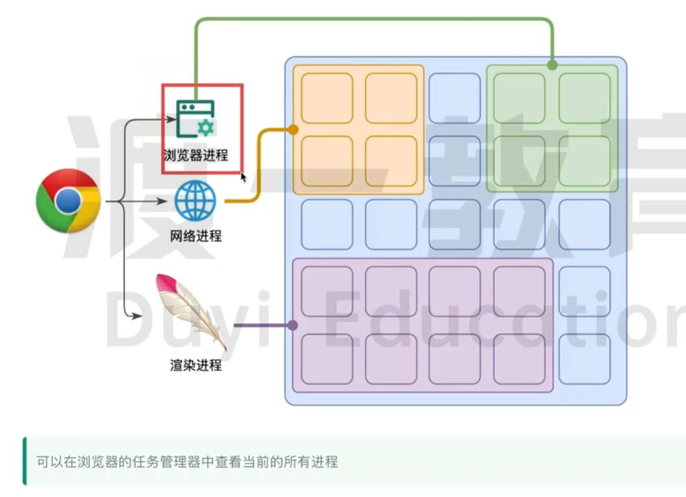
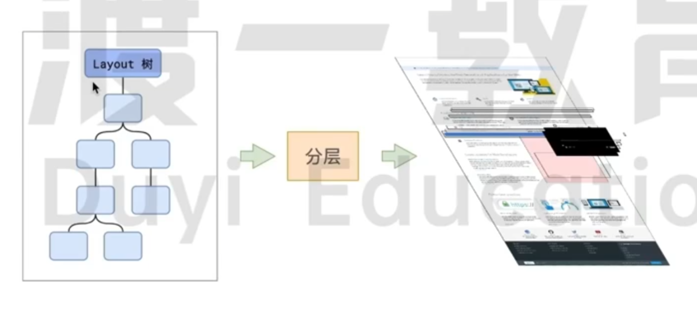
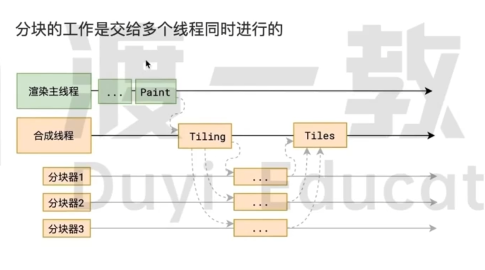
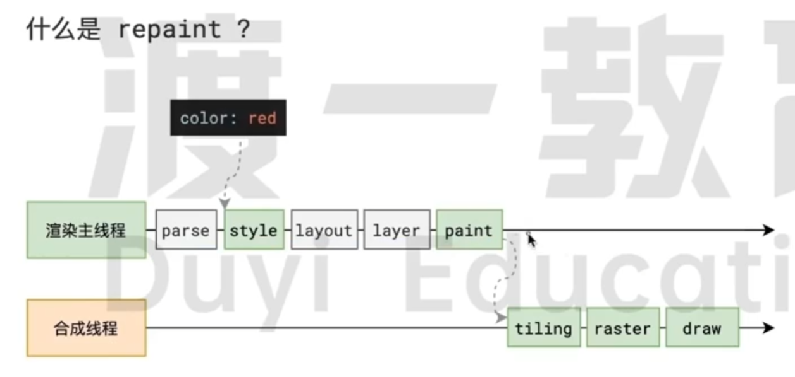
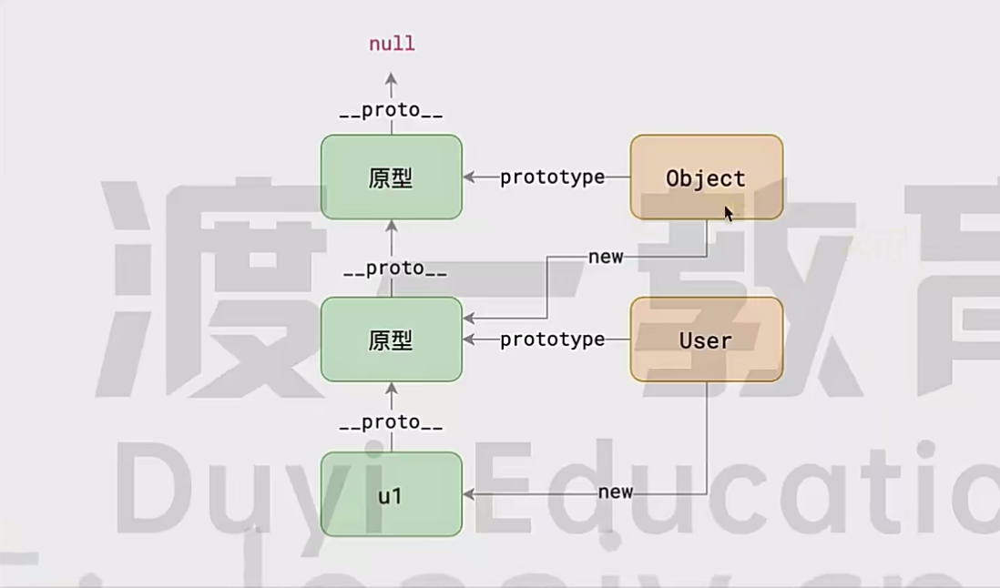
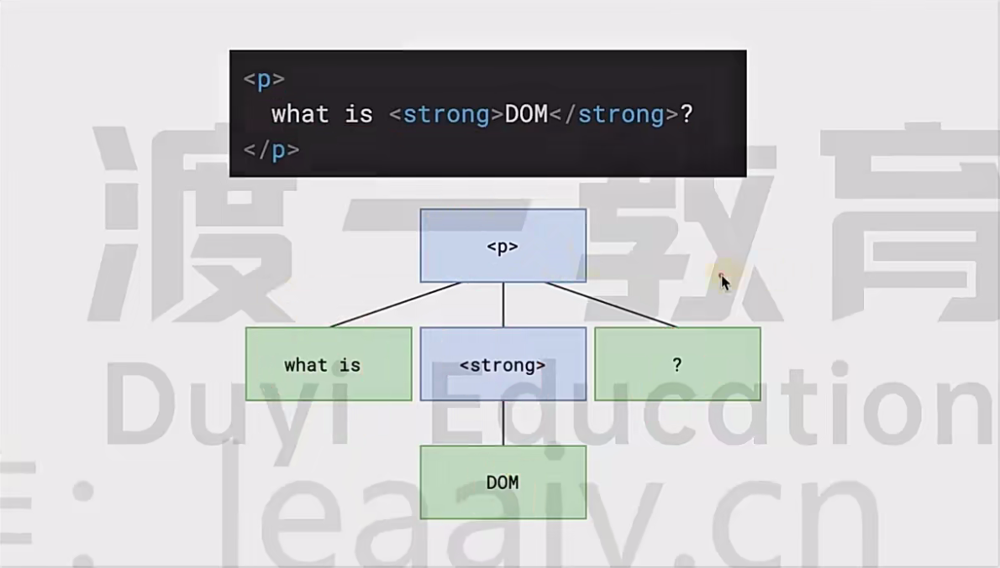
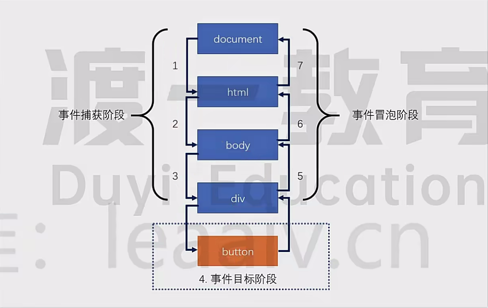
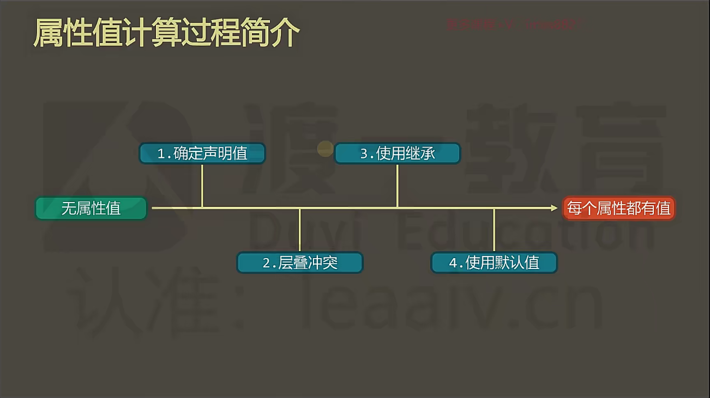

# 事件循环`EventLoop`


## 浏览器进程模型

### 何为进程？


程序运行需要有它自己专属的内存空间，可以把这块内存空间简单的理解为进程
每个应用至少有一个进程，进程之间相互独立，即使要通信，也需要双方同意

### 何为线程？


有了进程后，就可以运行程序的代码了，运行代码的「人」称之为「线程」
**一个进程至少有一个线程**，所以在进程开启后会自动创建一个个线程来运行代码，该线程称之为**主线程**
如果程序需要同时执行多块代码，主线程就会启动更多的线和程来执行代码
一个进程中可以包含多个线程

### 浏览器有哪些进程和线程?

浏览器是一个多进程多线程的应用程序
为了避免相互影响,为了减少连环崩溃的几率,当启动浏览器后,它会自动启动多个进程



浏览器最主要的进程有：

- 浏览器进程

  主要负责界面显示、用户交互、子进程管理等。浏览器进程内部会启动多个线程处理不同的任务

- 网络进程

  负责加载网络资源；网络进程内部会启动多个线程来处理不同的网络任务

- 渲染进程（主要）

  渲染进程启动后，会开启一个渲染主线程，主线程负责执行`HTML、CSS、JS`代码
  默认情况下，浏览器会为每个标签页开启一个新的渲染进程,以保证不同的标签页之间不相互影响


## 渲染主线程如何工作？

要处理大量的的任务,主线程遇到了一个前所未有的难题：如何调度任务?
渲染主线程想出了一个绝妙的主意来处理这个问题：排队


1. 在最开始的时候，渲染主线程会进入一个无限循环
2.  第一次循环会检查消息队列中是否存在任务；如果有，就取出第一个任务执行，执行完一个后进入下一次循环
   如果没有，则进入休眠状态
3. 其他所有线程 (包括其他进程的线程) 可以随时向消息队列添加任务
   新任务会加到消息队列的末尾，在添加新任务时
   如果主线程是休眠状态，则会将其唤醒以继续循环拿取任务

这样一来，就可以让每个任务有条不紊的、持续的进行下去了
整个过程，被称之为**事件循环 (消息循环)**


## 何为异步？

代码在执行过程中,会遇到一些无法立即处理的任务，比如：

- 计时完成后需要执行的任务 --`setTimeout、setinterval`
- 网络通信完成后需要执行的任务 --`XHR、Fetch`
- 用户操作后需要执行的任务 --`addEventListener`

如果让渲染主线程等待这些任务的时机达到，就会导致主线程长期处于「阻塞」的状态，从而导致浏览器「卡死」


渲染主线程承担着极其重要的工作，无论如何都不能阻塞！
因此，浏览器选择**异步**来解决这个问题


使用异步的方式，**渲染主线程永不阻塞**

```js
// 面试题：如何理解 JS 的异步？

参考答案：
JS 是一门单线程的语言，这是因为它运行在浏览器的渲染主线程中,而渲染主线程只有一个
而渲染主线程承担着诸多的工作，渲染页面、执行JS都在其中运行
如果使用同步的方式，就极有可能导致主线程产生阻塞，从而导致消息队列中的很多其他任务无法得到执行
这样一来,一方面会导致繁忙的主线程白白的消耗时间，另一方面导致页面无法及时更新,给用户造成卡死现象

所以浏览器采用异步的方式来避免，具体做法是当某些任务发生时,比如计时器、网络、事件监听,主线程将任务交给其他线程去处理
自身立即结束任务的执行，转而执行后续代码
当其他线程完成时，将事先传递的回调函数包装成任务，加入到 消息队列 的末尾排队，等待主线程调度执行
```


## 任务有优先级吗?

**任务没有优先级，在消息队列中先进先出**
**但消息队列是有优先级的**

```js
// 根据W3C的最新解释：
1. 每个任务都有一个任务类型，同一个类型的任务必须在一个队列，不同类型的任务可以分属于不同的队列
2. 在一次事件循环中，浏览器可以根据实际情况从不同的队列中取出任务执行
3. 浏览器必须准备好一个微队列，微队列中的任务优先所有其他任务执行
// https://html.spec.whatwg.org/multipage/webappapis.html#perform-a-microtask-checkpoint
```

在目前 Chrome 的实现中，至少包含了下面的队列：

- 延时队列：用于存放计时器到达后的回调任务，优先级【中】
- 交互队列：用于存放用户操作后产生的事件处理任务，优先级【高】
- 微队列：用户存放需要最快执行的任务，优先级【最高】

添加任务到微队列的主要方式主要是使用`Promise、MutationObserver`

```js
// 立即把一个函数添加到微队列
Promise.resolve().then(函数)
```

**单线程是异步产生的原因，事件循环是异步的实现方式**

> [!NOTE]
>
> 宏任务`macro task`：`setTimeout`、`setInterval`、`requestAnimationFrame`、事件处理函数
>
> 微任务`micro task`：`Promise`的`.then()`函数回调

> [!IMPORTANT]
>
> `Promise(() => { 代码 })`里的代码是同步执行的，`.then(callback)`的回调才是异步的，将`callback`放进微队列
>
> `resolve()`和`reject()`后面的代码依旧会运行，只是不会更改任务的状态和数据


# 浏览器如何渲染页面？

当浏览器的网络线程收到HTML文档后，会产生一个渲染任务，并将其传递给渲染主线程的消息队列
在事件循环机制的作用下，渲染主线程取出消息队列中的渲染任务，开启渲染流程


每个阶段都有明确的输入输出，上一个阶段的输出会成为下一个阶段的输入
这样，整个渲染流程就形成了一套组织严密的生产流水线


## 解析 HTML

解析过程中遇到CSS解析CSS
为了提高解析效率，浏览器在开始解析前会启动一个**预解析的线程**，率先下载HTML中的外部CSS文件和外部的JS文件
如果主线程解析到Link标签位置，此时外部的CSS文件还没有下载解析好，主线程不会等待，继续解析后续的HTML
这是因为下载和解析CSS的工作是在预解析线程中进行的，这就是CSS不会阻塞HTML解析的根本原因


如果主线程解析到script位置，会停止解析HTML，转而等待JS文件下载好，并将全局代码解析执行完成后，才能继续解析HTML
这是因为JS代码的执行过程可能会修改当前的DOM树，所以DOM树的生成必须暂停
这就是JS会阻塞HTML解析的根本原因


HTML解析完成后，会得到DOM树和CSSOM树，浏览器的默认样式、内部样式、外部样式、行内样式均会包含在CSSOM树中


## 样式计算

渲染主线程会遍历得到的DOM树，依次为树中的每个节点计算出它最终样式,称之为`ComputedStyle`
在这一过程中，很多预设值会变成绝对值，比如red会变成rgb(255,0,0)，相对单位会变成绝对单位，比如em会变成px
这一步完成后，会得到一棵带有样式的DOM树


## 布局

布局阶段会依次遍历DOM树的每一个节点，计算每个节点的几何信息；例如节点的宽高、相对包含块的位置
大部分时候，DOM树和布局树并非一一对应
比如`display: none`的节点没有几何信息，因此不会生成到布局树；又比如使用了伪元素选择器，虽然DOM树中不存在这些伪元素节点，但它们拥有几何信息，所以会生成到布局树中；还有匿名行盒、匿名块盒等等都会导致DOM树和布局树无法一一对应


## 分层

渲染主线程会使用一套复杂的策略对整个布局树中进行分层
分层的好处在于将来某一个层改变后，仅会对该层进行后续处理，从而提升效率
滚动条、堆叠上下文、transform、opacity等样式都会或多或少的影响分层结果，也可以通过`will-change`属性更大程度的影响分层结果




## 绘制指令

渲染主线程会为每个层单独产生绘制指令集，用于描述这一层的内容该如何画出来


完成绘制后，渲染主线程将每个图层的绘制信息提交给合成线程，剩余工作将由合成线程完成


## 分块

合成线程首先对每个图层进行分块，将其划分为更多的小区域，它会从线程池中拿取多个线程来完成分块工作
分块的工作是交给多个线程同时进行的




## 光栅化

分块完成后，进入光栅化阶段
合成线程会将块信息交给GPU进程,，以极高的速度完成光栅化
GPU进程会开启多个线程来完成光栅化，**并且优先处理靠近视口区域的块**
光栅化的结果，就是一块一块的位图


## 画

最后一个阶段就是画了
合成线程拿到每个层、每个块的位图后，生成一个个【指引(quad)】信息
指引会标识出每个位图应该画到屏幕的哪个位置，以及会考虑到旋转、缩放等变形
变形发生在合成线程，与渲染主线程无关，这就是transform效率高的本质原因
合成线程会把quad提交给GPU进程，由GPU进程产生系统调用，提交给GPU硬件，完成最终的屏幕成像


## 什么是 Reflow？

回流，页面重排布局
Reflow的本质就是重新计算layout树
当进行了会影响布局树的操作后，需要重新计算布局树，会引发layout布局重新计算
为了避免连续的多次操作导致布局树反复计算，浏览器会合并这些操作：
**reflow非常耗时，浏览器为了提升性能，对JS中连续导致reflow的代码，把reflow的时间点延迟到结束后进行**
**但在此过程中，如果遇到了获取尺寸和位置的代码，浏览器会迫不得已立即 reflow**
**所以改动属性造成的Reflow是异步完成的**
也同样因为如此，当JS获取布局属性时，就可能造成无法获取到最新的布局信息

```js
/** 进行哪些操作会导致 reflow 重排 **/
// 1. 获取元素的尺寸和位置
// 2. 直接或间接改变元素的尺寸和位置

// 浏览器在反复权衡下，最终决定获取属性立即Reflow
```


## 什么是 Repaint？

重绘，Repaint的本质就是重新根据分层信息重计算了绘制指令
当改动了可见样式后，就需要重新计算，会引发Repaint
**由于元素的布局信息也属于可见样式，所以Reflow一定会引起Repaint**
绘制Repaint的过程是靠GPU完成的，速度非常快
因此，**相对于导致Reflow的代码，仅会导致Repaint的代码效率会高出很多**




# 属性描述符&`Object.defineProperty`

用于定义或修改对象属性的特性
vue2中使用`Object.defineProperty`来做到数据的响应式

```js
const obj = {
  name: 'Kyle',
  gender: 'male',
  age: 25,
  interests: ['music', 'skiing']
}

// 可以使用`Object.getOwnPropertyDescriptor(obj, property)`来获取对象上某个属性的属性描述符
const description = Object.getOwnPropertyDescriptor(obj, 'age')
// description = { value: 25, writable: true, enumerable: true, configurable: true }


// value：属性的值
// writable: 属性是否可写
// enumerable: 属性是否可枚举修改
// configurable: 属性的属性描述符是否可配置


// 可以使用`Object.defineProperty(obj, property, {})`来定义和设置对象上属性的描述符
Object.defineProperty(obj, 'age', {
  value: 26,
  writable: false, // 不可写
  enumerable: true, // 可枚举
  configurable: true, // 可配置
})
// obj.age = 26


Object.defineProperty(obj, 'age', {
  writable: false
})
obj.age = 28
// obj.age = 26，age 属性被定义成不可修改，对属性值的赋值修改将不生效


// 更灵活的方式实现属性的只读
let _a = obj.age
Object.defineProperty(obj, 'age', {
  configurable: false, // 不可更改描述符
  get() { // 读取器，读取属性时触发
    return _a
	},
  set(newVal) { // 设置器，设置属性时触发
    throw new Error('this is a read-only property')
  }
})
console.log(obj.age) // 25
obj.age = 28 // 报错 Error: this is a read-only property
```


# 正则表达式`RegExp`

一种用于匹配和操作文本的强大工具，由一系列字符和特殊字符组成的模式，用于描述要匹配的文本模式


## 创建正则对象

```js
/** 1. 通过 RegExp 构造函数创建 **/
const rule = new RegExp(/^[GCDZTSPKXLY1-9]\d{1,4}$/, 'ig')

/** 2. 通过字面量创建 **/
const rule = /^[GCDZTSPKXLY1-9]\d{1,4}$/ig
```


## 标识

| 标识符 | 含义                                       |
| ------ | ------------------------------------------ |
| i      | 不区分大小写                               |
| g      | 全局匹配，如果不写此标识，则只会匹配第一个 |
| m      | 当行匹配                                   |


## 常用方法

### `rule.test`

```js
const rule = /^aa$/i
// 测试字符串是否满足规则
rule.test('a') // false
rule.test('aa') // true
```

### `str.replace`

```js
// reg 是正则对象， str 是字符串
// 将字符串中匹配规则的部分替换成替换值
str.replace(reg, '替换值')

// 将字符串中匹配正则的部分传入到回调函数的参数中，将函数的返回结果进行替换
str.replace(reg, (s) => {
  return '替换值'
})
```


## 常用规则

[正则表达式详见🔗](https://developer.mozilla.org/zh-CN/docs/Web/JavaScript/Guide/Regular_expressions)

| 字符匹配规则书写     | 含义                                                         |
| -------------------- | ------------------------------------------------------------ |
| 直接书写一个普通字符 | 匹配书写的字符                                               |
| `[字符规则]`         | 匹配`[]`中出现的所有字符规则                                 |
| `[^字符规则]`        | 匹配`[]`中没有出现的字符规则                                 |
| `.`                  | 匹配任意字符                                                 |
| `\d`                 | 匹配数字，等价于`[0-9]`                                      |
| `\D`                 | 匹配非数字                                                   |
| `\s`                 | 匹配空白字符，包括空格、回车、换行、制表符                   |
| `\S`                 | 匹配所有非空白字符                                           |
| `\w`                 | 匹配单词字符，等价于`[A-Za-z0-9_]`                           |
| `\W`                 | 匹配非单词字符，等价于`[^A-Za-z0-9_]`                        |
| `^`                  | 匹配字符串开始，写在规则开始位置                             |
| `$`                  | 匹配字符串结束，写在规则结束位置                             |
| `\\`                 | 使用`\`进行对特殊字符的转义，例如：`\.`（匹配字符串的`.`）、`\/`（匹配`/`） |

多个规则可以连续书写，用以匹配多个字符，例如：

```js
// 匹配 1 个数字紧跟 1 个字母，例如 3c、2A、0y
const rule = /\d[a-zA-Z]/
```

若多个规则是或者的关系，使用`|`分割，例如：

```js
// 匹配以 1 个数字紧跟 1 个字母，或者 1 个字母紧跟 1 个数字，例如 3d、b2
const rule = /\d[a-zA-Z]|[a-zA-Z]\d/
```

规则的重复（量词）
一个或一段规则之后，可以紧跟一个量词，表示前面的规则出现的次数

```js
// 匹配 1 个字母，后面跟上连续的 3 个数字，{3} 是量词，应用的规则是 \d
const rule = /[a-zA-Z]\d{3}/

// {3} 是量词，应用的规则是 [a-zA-Z]\d
const rule = /([a-zA-Z]\d){3}/
```

| 量词    | 含义                            |
| ------- | ------------------------------- |
| `{n}`   | 出现 n 次                       |
| `{n,m}` | 出现 n 到 m 次                  |
| `{n,}`  | 至少出现 n 次                   |
| `*`     | 出现 0 次或多次，等价于`{0,}`   |
| `?`     | 出现 0 次或 1 次，等价于`{0,1}` |
| `+`     | 出现 1 次或多次，等价于`{1,}`   |


# 异常`Error`

异常并非坏事，它可以让开发人员及时发现错误、定位错误，甚至在某些时候，我们还需要故意的抛出异常
**每个异常都是一个对象，通过对应的构造函数创建**

| 异常类型         | 含义                                         |
| ---------------- | -------------------------------------------- |
| `SyntaxError`    | 语法错误                                     |
| `ReferenceError` | 引用错误，往往是使用了未定义的变量或函数     |
| `TypeError`      | 类型错误，往往是使用了一个对象中不存在的成员 |

如何捕获异常？

```js
try {
  // 可能会产生错误的代码块
  // ...
} catch(err) {
  // 当 try 中的代码出现异常后，会执行此处的代码，异常对象会传递给 err
  // ...
  console.log(err.message)
} finally {
  // 可省略不写，无论是否有异常，都会执行
}
```

如何手动抛出异常？

```js
throw 异常对象 // 代码运行到这，会终止继续运行，并抛出异常对象，效果和浏览器抛出的异常完全一样

// 例如
throw new ReferenceError('找不到对应的成员')
```


# Promise

## Promise 规范

Promise属一套专门处理异步场景的规范
它能有效的避免回调地狱的产生，使异步代码更加清晰、简洁、统一
这套规范最早诞生于前端社区，规范名称为`Promise A+`

- 所有的异步场景，都可以看作是一个异步任务，每个异步任务，在JS中应该表现为一个对象
  该对象称之为Promise对象，也叫做任务对象

  

- 每个任务对象，都应该有**两个阶段、三个状态**

  

  根据常理，它们之间存在以下逻辑：

  1. 任务总是从未决阶段变到已决阶段，无法逆行
  2. 任务总是从挂起状态变到完成或失败状态，无法逆行
  3. 任务一旦完成或失败，状态就固定下来，永远无法改变

- 挂起-->完成，称之为`resolve`，挂起-->失败，称之为`reject`
  任务完成时，可能有一个相关数据；任务失败时，可能有一个失败原因

  

- 可以针对任务进行后续处理
  针对完成状态的后续处理称之为`onFulfilled`，针对失败的后续处理称之为`onRejected`

  


## 链式调用


- `.then`方发必定会返回一个新的`Promise`，可理解为**后续处理也是一个任务**

  ```js
  const p1 = new Promise((resolve, reject) => { resolve('end, true') })
  const p2 = p1.then(() => {
    console.log('p1 success')
  })
  setTimeout(() => {
    console.log(p2) // Promise { undefined }
  }, 1000)
  ```

- 新任务的状态取决于后续处理：

  1. 若新任务没有相关的后续处理，则新任务的状态和前任务一致，数据为前任务的数据

     ```js
     const p1 = new Promise((resolve, reject) => {
       reject(false)
     })
     const p2 = p1.then(() => {
       console.log('success')
     })
     setTimeout(() => {
       console.log(p2) // Promise { <rejected> false }
     }, 1000)
     // p1 的状态为 rejected，而 p2 没有对 p1 进行 onRejected 的后续处理
     // 则 p2 状态和 p1 一致，也是 rejected，数据也是 false
     ```

  2. 若新任务的有相关的后续处理，但前任务状态还未执行确定，则新任务挂起，状态为`pending`

     ```js
     const p1 = new Promise((resolve, reject) => {
       setTimeout(() => {
         resolve('end, true')
       }, 2000)
     })
     const p2 = p1.then(() => {
       console.log('p1 success')
     })
     setTimeout(() => {
       console.log(p2) // Promise { <pending> }
     }, 1000)
     // p2 有对 p1 的 onFulfilled 的后续处理，但此时 p1 还没有 resolve 确定状态
     // 所以 p2 的状态为 pending
     ```

  3. 若新任务有相关后续处理并且前任务执行了，则根据后续处理的情况确定新任务的状态

     - 后续处理执行无错，新任务的状态为`fulfilled`，**数据为后续处理的返回值**

       ```js
       const p1 = new Promise((resolve, reject) => { reject(false) })
       const p2 = p1.catch(() => {
         return '捕获前任务错误'
       })
       setTimeout(() => {
         console.log(p2) // Promise { '捕获前任务错误' }
       }, 1000)
       // 即使 p1 的状态是 rejected，但是 p2 有针对的后续处理，且代码没有执行错误
       // 则 p2 的状态就是 fulfilled 数据为处理中的返回值，没有则是 undefined
       ```

     - 后续处理执行有错，新任务的状态为`rejected`，数据为异常对象

       ```js
       const p1 = new Promise((resolve, reject) => { resolve(true) })
       const p2 = p1.then(() => {
       	throw new Error('执行发生错误')
       })
       setTimeout(() => {
       	console.log(p2) // Promise { <rejected> Error: 执行发生错误 }
       }, 1000)
       // 即使 p1 为 fulfilled，且 p2 也有对应后续处理，但 p2 的处理中有执行错误
       // 则 p2 的状态会变成 rejected
       ```

     - 后续执行后返回的是一个任务对象，即`return new Promise`，则新任务的状态和数据与返回的该任务对象一致

       ```js
       // p1 状态为 fulfilled
       const p1 = new Promise((resolve, reject) => { resolve(true) })
       
       // Promise { <pending> }
       const p2 = p1.then(() => {
         return new Promise((resolve, reject) => {})
         // 返回的任务对象，但状态未确定，则 p2 的状态也和返回的任务对象一致
       })
       
       // Promise { true }
       const p2 = p1.then(() => {
         return new Promise((resolve, reject) => { resolve(true) })
         // 返回的任务对象状态是 fulfilled，则 p2 也保持一致
       })
       
       // Promise { <rejected> false }
       const p2 = p1.then(() => {
         return new Promise((resolve, reject) => { reject(false) })
         // 返回的任务对象状态是 rejected，则 p2 也保持一致
       })
       ```


## Promise 的静态方法

| 方法                     | 含义                                                         |
| ------------------------ | ------------------------------------------------------------ |
| `Promise.resolve(data)`  | 直接返回一个状态为`fulfilled`的任务对象，相当于`new Promise((resolve) => resolve())` |
| `Promise.reject(reason)` | 直接返回一个状态为`rejected`的任务对象                       |
| `Promise.all([])`        | 返回一个任务对象，数组中**全部任务都成功**则为`fulfilled`，否则为`rejected` |
| `Promise.any([])`        | 返回一个任务对象，数组中**任意一个成功**就为`fulfilled`，否则为`rejected` |
| `Promise.allSettled([])` | 返回一个任务对象，数组中**全部任务状态已决定**则为`fulfilled`，**该任务不会失败** |
| `Promise.race([])`       | 返回一个任务对象，数组中**最先状态已决定**，状态于其一致     |

## `async/await`

ES7推出了两个关键字，可以使用同步的语法来书写异步代码

```js
/**
* async
* async 关键字用于修饰函数，被它修饰的函数，一定返回 Promise
**/
async function method() {
  return 1 // 返回 Promise 完成后的数据
  // return await 1
  // 没有配合 await 使用，代码不会放到微队列执行，直接同步运行
}
method() // Promise { 1 }

async function method() {
  return Promise.resolve(1) // 若返回的是 Promise，则 method 将与 Promise 状态和数据保持一致
}
method() // Promise { <pending> }

async function method() {
  throw new Error('错误') // 若执行过程报错，则任务状态时 rejected
}
method() // Promise { <rejected> Error('错误') }


/**
* await
* await 关键字表示等待某个 Promise 完成，它必须用于 async 函数里
* await is only valid in async function
* 当前函数中，await 后面的代码都会进入微队列等待执行
**/
async function method() {
  const n = await Promise.resolve(1) // 或者 const n = await 1
  console.log(n) // n = 1
}
// 上面的函数等同于
function method() {
  return new Promise((resolve) => {
    Promise.resolve(1).then((n) => {
      console.log(n)
      resolve()
    })
  })
}
// await 后可以书写非 Promise 对象
async function method() {
  await 1 // 等同于 await Promise.resolve(1) ，会自动将非 Promise 数据包装成 Promise 对象
}
// 针对 rejected 进行任务处理，可以使用 try-catch 语法
async function method() {
  try {
    await Promise.reject('error')
  } catch(err) {
    console.log(err)
  }
}
```


# `HTML`补充

## lorem

乱数假文，用于生成测试得乱序文本

```html
<!-- 语法：在模板中输入lorem，按回车键，自动生成 -->

<!-- 生成4个乱序文本词 -->
lorem4
Lorem ipsum dolor sit
<!-- 生成2行且每行5个乱序文本词 -->
lorem5*2
Lorem ipsum dolor sit amet.
Corrupti nobis animi doloribus eius.
```


## 文档片段

在需频繁地创建DOM元素添加到DOM树中情况下，使用`document.createDocumentFragment()`来避免多次操作DOM树

```js
function createLrcElements() {
  var frag = document.createDocumentFragment() // 创建文档片段
  for (vari = 0; i < Data.length; i++) {
    var li = document.createElement('li')
    li.textContent = Data[i].words
    frag.appendChild(li) // 此时文档片段还未挂载到DOM树上，不会影响DOM树
    // ul.appendChild(li) // 频繁地修改DOM树
  }
  ul.appendChild(frag)
}
```


## DOM 尺寸和位置


# `JavaScript`补充


## `Object`

### `.freeze`

冻结对象，不允许添加、删除或修改任何属性，对象保持不变

```js
const obj = {
  name: 'Kyle',
  gender: 'male',
  age: 25,
  interests: ['music', 'skiing']
}
Object.freeze(obj) // freeze the object so that it cannot be changed.

obj.name = 'Lily' // not work
obj.age = 26 // not work

// 此处修改生效的原因：冻结的是interests这个属性的引用，而不是数组本身；因此，无法重新分配interests指向新的数组（如interests = [...]），但可以修改原数组的内容，比如pop()或push()操作
obj.interests.pop() // work
obj.interests[1] = 'football' // work

obj.interests = ['music', 'skiing', 'baseball'] // not work
console.log(obj) // { name: 'Kyle', gender: 'male', age: 25, interests: [ 'music', 'football' ] }
```

[^注意]: `Object.freeze`是浅冻结，只能冻结对象的第一层属性，而嵌套的对象或数组并不会被冻结

### `.seal`

封闭对象，不允许添加或删除属性，只允许修改现有属性的值

```js
const obj = {
  name: 'Kyle',
  gender: 'male',
  age: 25,
  interests: ['music', 'skiing']
}
Object.seal(obj)

obj.age = 26 // work
obj.interests.push('gaming') // work
obj.phone = '1234567890' // no work
delete obj.name // no work

// {
//   name: 'Kyle',
//   gender: 'male',
//   age: 26,
//   interests: [ 'music', 'skiing', 'gaming' ]
// }
```

### `.is`

可以判断两个值是否相同，功能与`===`基本一致
区别在于，使用`Object.is`中，`NaN === NaN`，`+0 !== -0`，而`===`的结果刚好相反

```js
Object.is(1, 2) // false
Object.is('1', 1) // false
Object.is(NaN, NaN) // true
Object.is(+0, -0) // false

NaN === NaN // false
+0 === -0 // true
```

### `.assign`

混合对象，用于将所有可枚举属性的值从一个或多个源对象分配到目标对象，返回目标对象
语法：`Object.assign(target, ...sources)`

```javascript
const target = { a: 1, b: 2 }
const source = { b: 4, c: 5 }
// 将 source 对象合并到 target 对象，会更改 target 的值，并返回 target
const newObj = Object.assign(target, source)

console.log(target) // { a: 1, b: 4, c: 5 }
console.log(target === newObj) // true
```

### `.setPrototypeOf`

设置某个对象的隐式原型

```js
const obj1 = { a: 1 }
const obj2 = { b: 2 }

console.log(obj1.__proto__ === obj2.__proto__) // true

// 设置 obj1 的隐式原型为 obj2
Object.setPrototypeOf(obj1, obj2)

console.log(obj1.__proto__) // { b: 2 }
console.log(obj2.__proto__) // Object
console.log(obj1.__proto__ === obj2.__proto__) // false
```


## `Array`

### `.slice`

数组切割，不影响原数据，返回一个新数组

```js
// 数组切割
const a = [0, 1, 2, 3]
const b = a.slice(0, 3) // b = [0, 1, 2]

// 通过Array.slice()方法将`伪数组`转化成真数组
const obj = {
  0: 'a',
  1: 'b',
  length: 2
}
const arr = Array.prototype.slice.call(obj) // arr = ['a', 'b']
```

### `.from`

可以将一个类数组或伪数组转换成一个真正的数组返回，不影响原数据

```js
const obj = {
  0: 'a',
  1: 'b',
  length: 2
}
const arr = Array.from(obj) // arr = ['a', 'b']
```


## 解构

```js
/** 数组解构 **/
const arr = [1, 2, 3, 4]
// 取出每一项值
const [a, b, c, d] = arr
// 仅取出下标为1和2的值
const [, b, c] = arr
// 取出下标1和3的值
const [, b, , d] = arr
// 取出arr中前两个，放到变量a和b中，剩下的值放到一个新数组arr2中
const [a, b, ...arr2] = arr

/** 对象解构 **/
const obj = { a: 1, b: 2, c: 3 }
// 复制obj的所有值到一个新的对象
const obj2 = { ...obj } // obj !== obj2
// 复制obj中除了属性a以外的值到一个新的对象
const { a, ...obj2 } = obj
```


## 数据运算

### 隐式转换

每个运算符都有自己期望的数据格式，比如`+`、`-`、`*`、`/`期望两边都是`number`类型
一旦数据不符合运算符的期望，JS 就会对数据进行隐式的转换：将数据变成期望的格式后再进行运算
这种转换是临时的，并不会对原始数据造成影响

```js
// 利用`+`、`-`将字符串转数字
let a = '001'
+a // a = 1
let b = '02'
-b // -2

// `+`的一边是字符串的情况下，则会进行字符串拼接
let str = '10'
let str_1 = '11'
let number = 12
0 + str // '010'
number + '' // '12'
str + str_1 // '1011'

// `!`非转换为布尔值
let bol = '123'
!bol // false
!!bol // true
!'' // true，空字符串判定为 false，取反为 true

// 表达平方运算，可以代替Math.pow()
3 ** 2 // 9，即 Math.pow(3, 2)
2 ** 3 // 8
```

### 布尔判定

所有需要判断真假的地方都会使用以下规则

| 数据                                                         | 判定结果 |
| ------------------------------------------------------------ | -------- |
| false、null、undefined、0（数字）、NaN（非数字）、''（空字符串） | false    |
| 剩余其他所有数据                                             | true     |

### `&&`运算符

且，都真才为真，有一个为假就为假，具有短路规则
表达式返回的是**最后一个判断的数据**，而不是布尔值
判断到第一个假就会结束

```js
// 短路规则：以下为例，假如第一个已经判定为false，则直接返回该值，后续的不会进行判定
let a = 1 && 2 // a = 2
let b = 0 && 3 // b = 0

// 实际开发中，利用短路规则简化代码
if (example) {
  console.log('1')
}
// 简化
example && console.log('1')
```

### `||`运算符

或，全假才为假，有一真就为真，具有短路规则
返回的是**最后一个判定的数据**
判断到第一个真就会结束

```js
if (example) {
  n = example
} else {
  n = 1
}
// 简化代码
n = example || 1
```

### `~`位运算符

```js
const b = ~~1.5 // 1
const c = ~1.2 // -2
```


## 数据传递

JavaScript 中基本数据类型（如数字、字符串、布尔值、null、undefined）是按值传递的，而对象和数组是按引用传递
**函数内部的参数是新的局部变量，直接赋值修改它们不会影响外部的变量值**
**在函数里只要给形参直接重新赋值，形参就会和外部的值脱离关联，不会影响外部的值**
**但如果在形参是引用类型数据的情况下，改变其中一个属性的值，则会通过引用传递改变外部的值**

```js
// 直接赋值修改形参，不影响外部值
let a = 1
let b = { n: 2 }
function exchange(a, b) {
  const temp = a
  a = b
  b = temp
}
exchange(a, b) // a = 1, b = { n: 2 }

// 修改某一个属性或下标索引的值，通过引用传递改变外部的值
let a = { n: 1 }
let b = [0, 3, a]
function change(a, b) {
  a.n++
  b[1]--
}
change(a, b) // a = { n: 2 }, b = [0, 2, { n: 2 }]
```


## 作用域

js有三种作用域：全局作用域、函数作用域、块级作用域

- 内部的作用域能访问外部，反之不行，访问时从内向外依次查找
- 如果在函数内部的作用域中访问了外部，则会产生闭包
- **内部作用域能访问的外部环境，取决于函数定义的位置， 和函数调用无关**
- 作用域内定义的变量（使用`var`声明）、函数声明会提升到作用域顶部，**函数表达式不会被提升**，初始值为`undefined`

```js
console.log(a, b, c) // 输出 undefined undefined [Function: c]
var a = 1
var b = function () {} // 此写法为 函数表达式，并不是函数声明，不会被提升
function c() {}

// 相当于以下写法
var a
var b
function c() {} // 函数声明被提升
console.log(a, b, c) // a 和 b 被提升到作用域顶部，但并未赋值，所以输出 undefined，而不是报错
a = 1 // 赋值并不会一起被提升，只提升变量的定义
b = function () {}
```

### 全局作用域

在全局作用域中声明的变量，能够在代码的任何地方被访问

```js
var globalVar = '我处于全局作用域'
function checkScope() {
  console.log(globalVar) // 可以访问全局变量
}
checkScope() // 输出: 我处于全局作用域
console.log(globalVar) // 同样可以在函数外部访问
```

### 函数作用域

函数作用域是指在函数内部声明的变量，只能在该函数内部被访问，函数外部无法访问

```js
function exampleFunction() {
  var functionVar = '我处于函数作用域'
  console.log(functionVar) // 能够在函数内部访问
}
exampleFunction() // 输出: 我处于函数作用域
console.log(functionVar) // 会报错，因为在函数外部无法访问函数内部变量
```

### 块级作用域

由`let`和`const`声明的变量所拥有块级作用域，`var`声明的不具备
块级作用域是指由 `{}` 包裹的代码区域，像`if`语句、`for`、`while`循环等
**代码执行时遇到花括号`{}`，会创建一个块级作用域，花括号结束，块级作用域销毁**

```js
if (1 === 1) {
  let blockVar = '我处于块级作用域'
  const constantVar = '我也是块级作用域'
  var globalVar = '我是全局变量'
  console.log(blockVar) // 可以在块内部访问
}
console.log(blockVar) // 会报错，在块外部无法访问
console.log(constantVar) // 同样会报错
console.log(globalVar) // 可以在外部访问
```

> [!IMPORTANT]
>
> 在块级作用域内使用`var`声明变量，外部依然可以访问
>
> **因为`var`并不具备块级作用域，它的作用域是函数作用域或者全局作用域**
> 即使在块级作用域里使用`var`声明，它的作用域依然是整个函数或者全局环境


## 全局对象

无论是浏览器环境，还是 node 环境，都会有一个全局对象
浏览器环境：`window`，node 环境：`global`
全局对象的特点：

- 全局对象的属性可以直接被访问

  ```js
  global.a = 100
  console.log(a) // 100
  ```

- **给未声明的变量赋值，实际就是给全局对象的属性赋值**，不管是全局、函数或块级作用域，Don't do that

  ```js
  a = 1
  // 函数作用域
  function test() {
    b = 100
  }
  // 块级作用域
  {
  	let c = 1000
  	d = 10000
  }
  
  test()
  console.log(a, b, d) // 1 100 10000
  ```

- 所有的全局变量、全局函数，都会附加到全局对象身上，称之为**全局污染**

  ```js
  var a = 100
  conso.log(window.a) // 100
  ```

为了避免全局污染，在函数的函数作用域内声明变量，但为了避免更繁琐，就出现了**立即执行函数**
立即执行函数称之为`IIFE`，全称是`Immediately Invoked Function Expression`
**立即执行函数通常用于强行改变作用域**

```js
var exposure = (function () {
  // console.log(this) // 全局对象
  const a = 1 // 处在函数作用域中，且没有返回暴露出去，所以不会污染全局
  const b = 2
  function sum(a, b) {
    return a + b
  }
  return {
    sum
  }
})()
console.log(exposure) // { sum: [Function: sum] }
// 因为 exposure 全局声明并接受了返回值，其他JS文件就可以访问到 exposure.sum 函数
// 但是 a 和 b 在函数作用域中，且没有返回，函数之外访问不到，极大地降低了全局污染
```


## 构造函数

**在JS语言中，所有的对象都是通过`new`产生的**
在 ES6 之后使用`class`代替这中写法去创建一个实例对象
**函数也是一个特殊的对象**

```js
// 使用构造函数创建一个对象
function Person(age, name) {
  this.age = age
  this.name = name
  this.sayHello = function () {
    console.log(`${this.name} say hello`)
  }
}
const p = new Person(26, 'Kyle') // 使用 new 关键词，则代表用构造函数的方式调用函数
```


## 原型

每个函数都会自动附带一个属性`prototype`，这个属性的值是一个普通对象，称之为**原型对象**
通过`new`构造函数产生的对象称之为**实例**
由于在JS中所有的对象都是通过`new`构造函数产生的，因此，严格来说，**JS中的所有对象都称之为实例**


每个实例都有一个特殊的属性`__proto__`，称之为**隐式原型**，它指向实例的构造函数的原型
这一切有何意义？
**当访问实例的属性成员时，先找自身，如果不存在，则沿着原型链从隐式原型`__proto__`中寻找**
**这样一来，就可以将那些公共成员，放到函数的原型对象中，即可被创建的所有实例共享访问**

```js
// 使用构造函数创建一个对象
function Person(age, name) {
  this.age = age
  this.name = name
}
// 将 sayHello 方法放在 Person 的原型对象上
// 则所有通过 new Person 产生的实例都可以通过隐式原型访问到 sayHello 方法
Person.prototype.sayHello = function () {
  console.log(`${this.name} say hello`)
}
const p = new Person(26, 'Kyle')
p.sayHello()
```


## 原型链

```js
Object.prototype.__proto__ // null, 比较特殊，固定指向 null
Function.prototype === Function.__proto__ // true， 比较特殊
// 函数也是一个特殊的对象，也可以有自己的属性
```




**更改构造函数的原型会对所有原型链上有该构造函数的原型的对象产生影响**

```js
// 1. 利用原型链来判断数据的类型

// obj instanceof constructor 判断前者的原型链中，是否存在后者的原型
[1, 2] instanceof Array
// true，因为[1， 2].__proto__ === Array.prototype
[1, 2] instanceof Object
// true，因为 Array.prototype.__proto__ === Object.prototype，
// 所以 [1, 2].__proto__.__proto__ === Object.prototype
const obj = { a: 1 }
obj instanceof Object
// true，因为 obj.__proto__ === Object.prototype
obj instanceof Array
// false


// 2. 创建空原型的对象

// Object.create()，多用来创建一个没有隐式原型的干净的对象
const obj = Object.create(null)
// 则 obj.__proto__ === null，但是不要直接这样去写

// Object.setPrototypeOf(obj, proto)，设置对象的隐式原型对象
const a = {a: 1}
Object.setPrototypeOf(a, null)
// 则 a.__proto__ === null
```


## Web API

和标准库不同，`WebAPI`是浏览器提供的一套API，用于操作浏览器窗口和界面


### BOM

是`Browser Object Model`的缩写，简称浏览器对象模型
主要处理浏览器窗口`window`和框架`iframe`，描述了与浏览器进行交互的方法和接口，提供和浏览器相关的操作

```js
// 在浏览器环境中，则有一个 window 的全局对象
window.open() // 打开一个新的浏览器窗口，返回新窗口的 window 全局对象
window.close() // 关闭由 open 方法打开的浏览器窗口
setTimeout(callback, time) // 设置一个延时定时器，time[ms]后执行callback，返回计时器的 id
clearTimeout() // 根据 id 清除延时定时器
setInterval(callback, time) // 设置一个循环定时器，每隔time[ms]执行一次callback，返回计时器的 id
clearInterval() // 根据 id 清除循环定时器
alert() // 弹出提示框
confirm() // 确认框
... ...

// window.location
// 提供和地址栏相关的操作
location.href = 'www.baidu.com' // 可以读取当前地址栏地址，也可以赋值，则本窗口跳转到新地址
location.protocol // 获取或设置地址栏中的协议部分，如`http`或`https`
location.host // 获取或设置地址中的主机及端口号，如`localhost:3000`
location.port // 获取或设置地址中的端口号，如 `3000`
location.pathname // 获取或设置地址中的路径部分，如`www.bilibili.com/history`中的`/history`部分
location.hash // 获取或设置地址中的hash部分，如`http://localhost:18090/#/home`中的`#/home`部分
location.reload() // 重载刷新页面
... ...

// window.history
// 提供当前窗口历史记录相关的操作
history.back() // 后退
history.forward() // 前进
history.go(offset_number) // 根据相对于当前页面的偏移量，进入历史记录中指定页面
history.pushState() // 在历史记录中添加一条记录，页面不刷新
history.replaceState() // 替换当前的记录，页面不刷新
```

### DOM

`Document Object Model`，文档模型，提供和页面相关的操作，标准化组织是W3C
它是一个对象，对应着 html 中的节点和标签



```js
[document | dom].querySelector('.container') // 通过css选择器获取一个匹配的dom对象
[document | dom].querySelectorAll('.div') // 得到所有匹配的dom伪数组

// 更改 dom 结构
dom.remove() // 从dom树种移除自身
dom.removeChild(node) // 删除dom的子节点
dom.insertBefore(node) // 在dom的子节点中，添加一个新的子节点到另一个子节点之前
dom.appendChild(node) // 添加一个新的子节点在dom的子节点末尾

// 监听 dom 的事件
dom.onclick = function() {} // 点击事件
dom.oncontextmenu // 右键菜单显示前触发回调
dom.onmouseenter // 鼠标进入元素时触发（不冒泡）
dom.onmouseleave // 鼠标离开元素时触发（不冒泡）
dom.onmouseover // 鼠标进入元素时触发（冒泡）
dom.onmouseout // 鼠标离开元素时触发（不冒泡）
window.onwheel // 鼠标滚轮滚动时触发

// 键盘事件
window.keydown // 键盘按下时触发
window.keyup // 键盘抬起时触发
```

事件传播机制



事件委托

```js
// 获取父元素
const container = document.querySelector('.container')
// 直接将事件注册在父元素上，通过冒泡机制
container.onclick = function(e) {
  if (e.target.tagName === 'BUTTON') {
    console.log('click')
  }
}
// 1. 避免有大量子元素时，需要依次在子元素上注册事件，提升效率和性能
// 2. 避免动态的子元素添加进来时，需要再次为新的子元素注册事件
```


## 在循环中注册事件

```js
for (var i = 0; i < 3; i++) {
	setTimeout(() => {
		console.log(i)
	}, 1000)
}
/**
* 此时 输出的是 3 3 3
* 原因：
* 1. var 的变量提升 ：使用 var 声明的变量会存在函数级作用域，循环中的 i 其实是同一个变量
* 2. 闭包捕获延迟 ：所有 setTimeout 回调函数都共享同一个 i 的引用
* 3. 循环执行完毕 ：当回调执行时，循环早已结束，此时 i 的值已经是 3
**/

for (let i = 0; i < 3; i++) {
	setTimeout(() => {
		console.log(i)
	}, 1000)
}
/**
* 解决方案一： 使用 let
* 1. let 会在每次循环创建新的块级作用域
* 2. 每个 setTimeout 回调都会捕获当前循环的独立 i
* 3. 即使延迟执行，也能保持正确的值
**/

for (var i = 0; i < 3; i++) {
  (function (currentI) {
    setTimeout(() => {
      console.log(currentI) // 输出 0, 1, 2
    }, 1000)
  })(i)
}
/**
* 解决方案二： 使用立即执行函数（IIFE）
* 1. 通过 (function(currentI){})(i) 在每次循环时创建新的函数作用域
* 2. 将循环变量 i 作为参数 currentI 传入，每次循环都会创建新的变量副本
* 3. 每个 setTimeout 回调都捕获独立的 currentI 变量
**/
```


## 箭头函数`() => {}`

- 不能使用`new`关键词调用，没有自己的`new.target`

- 没有原型，即没有`prototype`属性，但是有隐式原型`__proto__`

- 没有自己的`arguments`，使用时获取的外部函数的`arguments`

- 没有`this`

  ~~箭头函数的`this`永远指向函数定义位置的`this`，因为箭头函数会绑定`this`~~，这个说法是错误的
  **根本原因是箭头函数它没有`this`，函数里使用的`this`是外层的`this`**

```js
const p = {
  count: 0,
  test: function () {
    console.log(this.count)
  },
  test_1: () => {
    console.log(this === window)
  }
}

const d = p.test
d() // undefined 因为 d 的调用者是 全局对象

p.test_1() // true 因为 test_1 箭头函数，找外部 this 就是 全局对象
```


## 剩余参数`...args`

ES6后不再建议使用`arguments`来获取参数列表，推荐使用`...args`来获取未知数量的参数

- 一个函数，仅能出现一个剩余参数
- 如果有剩余参数，剩余参数必须是最后一个参数

```js
function method(a, b, ...args) {
  console.log(a, b, args)
}
method(1, 2, 3, 4, 5) // 1, 2, [3, 4, 5]
method(1, 2) // 1, 2, []
```


## 函数二义性

```js
/** 函数的双重用途 **/
function Person(first, last) {
  this.firstName = first
  this.lastName = last
  this.fullName = `${first} ${last}`
}
const p1 = new Person('张', '三')
console.log(p1) // Person { firstName: '张', lastName: '三', fullName: '张 三' }

const p2 = Person('张', '三')
console.log(p2) // undefined
console.log(firstName) // '张'，此时的 firstName 已经被挂载到全局对象上去了

const p3 = Person.call(p1, '张', '三')
console.log(p3) // undefined
```

即一个函数，既可以使用`new`调用，也可以不使用，导致语义和用途的不明确

```js
function Person(first, last) {
  // 过去的判断方式
  if (!(this instanceof Person)) throw new Error('该函数没有使用 new 调用')
  
  // ES6后可以使用 new.target 来判断
  if (new.target === undefined) throw new Error('该函数没有使用 new 调用')
  
  this.firstName = first
  this.lastName = last
  this.fullName = `${first} ${last}`
}
```


## 模板字符串

用**反引号**包裹内容

-  变量使用`${}`拼接

   ```js
   let name = 'Kyle'
   let out = `我的名字是：${name}` // 我的名字是：Kyle
   ```

- 内容中可以直接出现换行

  ```js
  const text =	`
  	这个是 ES6 的新语法，
  	很方便使用
  `
  ```

- 使用模板字符串标记：在模板字符串之前，可以加上标记
  标记是一个函数，返回的值则是最终模板字符串的值，参数如下：

  1. 参数一：被插值分割的字符串数组
  2. 后续参数：所有的插值

  ```js
  const name = 'Kyle', age = 26, gender = 'Male'
  // 标记写法
  const intro_label = TemplateLabel`我的名字是${name}年龄是${age}性别是${gender}`
  function TemplateLabel(parts, ...args) {
    console.log(parts) // ['我的名字是', '年龄是', '性别是', '']
    conso.log(args) // ['Kyle', 26, 'Male']
    return parts.reduce((prev, cur, index) => {
      if (index === parts.length - 1) {
        return prev + cur
      }
      return prev + cur + '：' + args[index]
    }, '')
  }
  console.log(intro_label) // 我的名字是：Kyle年龄是：26性别是：Male
  ```


## `ES Module`模块化

官方标准的js模块化，支持`NodeJs`和浏览器环境，支持静态导入和动态导入
`ES Module`分为两种导出方式：具名导出（普通导出，可以导出多个）、默认导出（只能导出一个）
**一个模块可以同时存在两种导出方式，最终都会合并为一个模块对象导出**

> [!NOTE]
>
> - 静态导入必须写在代码顶端，不可放入代码块中
> - 静态导入的变量绑定是常量，不可更改
> - 导入时，可以通过关键字`as`对导入的符号进行重命名
> - 可以使用`*`号导入所有的基本导出,形成一个导出对象

```js
// module.js
export const a = 1
export const b = 2
export function sum(a, b) {
  return a + b
}
export default {
  name: 'Kyle',
  age: 26
}

// 将变量的名称作为导出的名称，变量的值作为导出的值
const age = 26
const gender = 'Male'
export { age, gender } // 特殊语法
// 相当于:
// export const age = 26
// export const gender = 'Male'

/**
 * 导出的模块对象：
 * { a, b, sum, default, age, gender }
**/
```

```js
// 导入模块

// 1. 仅导入 default
import info from './module.js'
// 2. 仅导入 a 和 b
import { a, b } from './module.js'
// 3. 同时导入 default、a、b
import info, { a, b } from './module.js'
// 4. 导入整个模块
import * as obj from './module.js'
// 5. 不导入任何东西，仅运行一次模块
import './module.js'
```


# `CSS`补充

## `label`标签

```html
<div class="container">
  <!-- 通过 id 相关联 -->
  <input type="radio" name="gender" id="male" value="male" />
  <label for="male">Male</label>

  <!-- 直接用 label 元素包裹，里面的元素则会自动关联 -->
  <label>
    <input type="radio" name="gender" id="female" value="female" />
    <span>Female</span>
  </label>
</div>
```


## `vertical-align`

在相邻的两个元素的`display`属性值为`inline`或者`inline-block`的前提下，如存在元素上下不对齐的情况
使用`vertical-align`属性来调整

```css
vertical-align: 4px;
```


## `border`和`outline`

`outline`不占用元素的盒尺寸，只有显示效果，但`border`会参与到盒尺寸的计算中


## 属性值计算过程

所有的HTML元素，任何一个元素必须要每一个CSS属性全部都要有值，浏览器才知道如何显示它
没有书写的属性值，并不代表这个元素没有这个CSS属性和值，浏览器有默认的值



浏览器调试工具中的`Computed`可以看到选中元素的**最终计算样式**

1. 确定声明值

   参考样式表中没有冲突的声明，作为CSS属性值，这一步有冲突重复声明的属性不会处理确定最终值

2. 层叠冲突

   对样式表中有冲突的声明使用层叠规则，确定CSS属性值

   - 比较重要性，用户书写样式大于浏览器默认样式
   - 比较特殊性，权重比较
   - 比较次序性，后面的会覆盖前面的样式

3. 使用继承

   对仍然没有值的属性，若可以继承，则继承复元素的值

4. 使用默认值

   对仍然没有值的属性，使用浏览器的默认值


## 伪类选择器

```css
/* 没有访问过的超链接 */
a: link {}
/* 已访问过的超链接 */
a: visited {}
: hover {}
/* 鼠标按下 */
: active {}
/* 聚焦的表单元素 */
: focus {}
/* 禁用的表单元素 */
: disabled {}
/* xaun'zhong */
: checked {}
: first-child {}
: last-child {}
/* 选中 an+b 个子元素，a、b是常量，n 的值从 0 开始递增*/
: nth-child(an+b) {}
```


## 元素隐藏显示

```css
/* dom 元素盒子也会消失 */
display: none;
/* 不可见，有 dom 元素，但是不能触发事件 */
visibility: visible;
/* 透明度为0，有 dom 元素，可被触发事件 */
opacity: 0;
```

