# 事件循环`EventLoop`


## 浏览器进程模型

何为进程？

程序运行需要有它自己专属的内存空间，可以把这块内存空间简单的理解为进程
每个应用至少有一个进程，进程之间相互独立，即使要通信，也需要双方同意

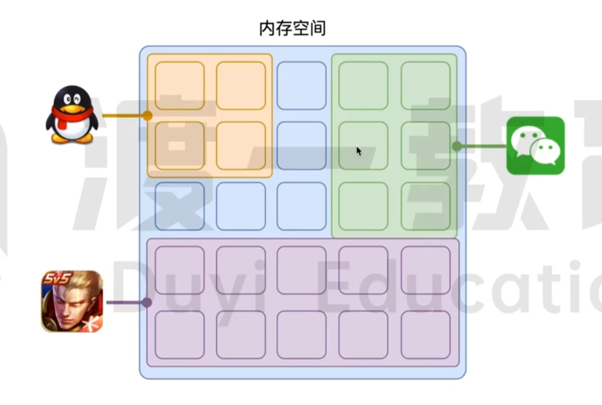

何为线程？

有了进程后，就可以运行程序的代码了，运行代码的「人」称之为「线程」，即运行程序的是线程
**一个进程至少有一个线程**，所以在进程开启后会自动创建一个个线程来运行代码，该线程称之为**主线程**
如果程序需要同时执行多块代码，主线程就会启动更多的线和程来执行代码

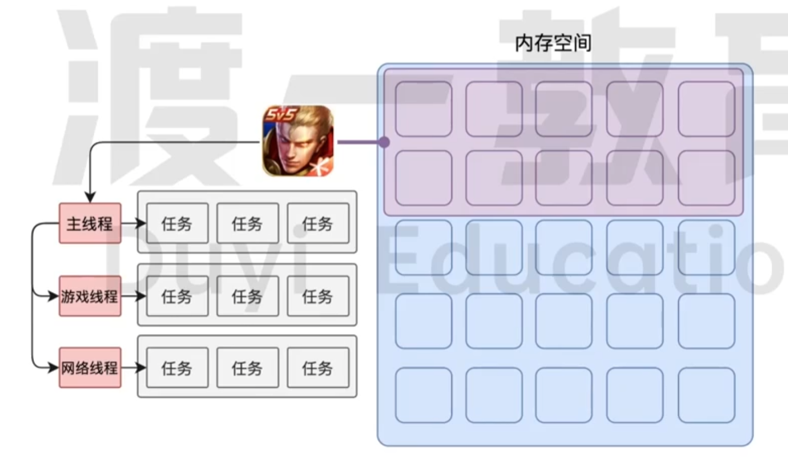


## 浏览器有哪些进程和线程？

浏览器是一个多进程多线程的应用程序
为了避免相互影响,为了减少连环崩溃的几率,当启动浏览器后,它会自动启动多个进程

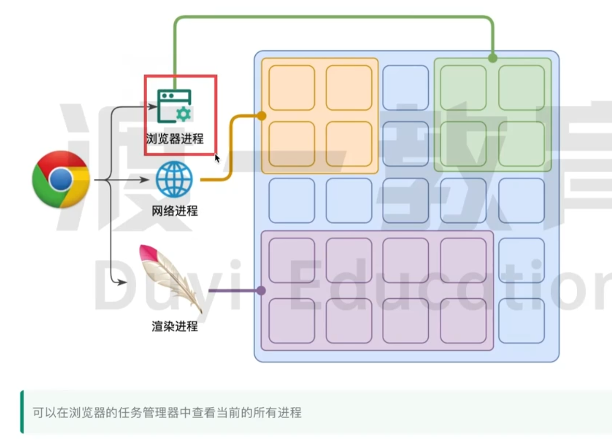

浏览器最主要的进程有：

- **浏览器进程**

  主要负责界面显示、用户交互、子进程管理等。浏览器进程内部会启动多个线程处理不同的任务

- **网络进程**

  负责加载网络资源；网络进程内部会启动多个线程来处理不同的网络任务

- **渲染进程（主要）**

  渲染进程启动后，会开启一个渲染主线程，主线程负责执行`HTML、CSS、JS`代码
  默认情况下，浏览器会为每个标签页开启一个新的渲染进程,以保证不同的标签页之间不相互影响


## 渲染主线程如何工作？

要处理大量的的任务,主线程遇到了一个前所未有的难题：如何调度任务?
渲染主线程想出了一个绝妙的主意来处理这个问题：排队

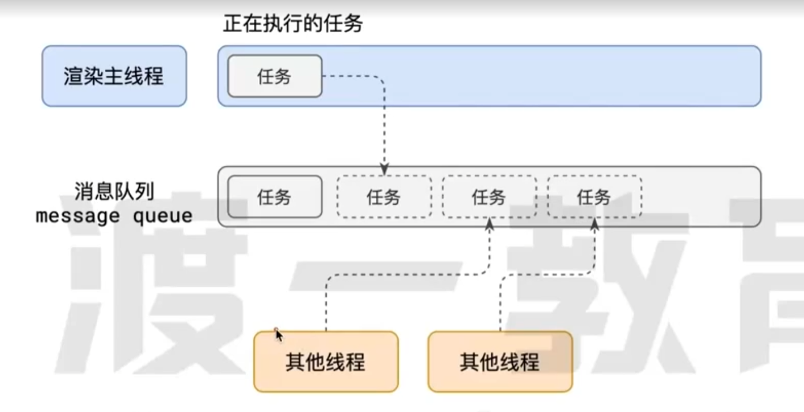

1. 在最开始的时候，渲染主线程会进入一个无限循环
2. 第一次循环会检查消息队列中是否存在任务；如果有，就取出第一个任务执行，执行完一个后进入下一次循环
   如果没有，则进入休眠状态
3. 其他所有线程 (包括其他进程的线程) 可以随时向消息队列添加任务
   新任务会加到消息队列的末尾，在添加新任务时
   如果主线程是休眠状态，则会将其唤醒以继续循环拿取任务

这样一来，就可以让每个任务有条不紊的、持续的进行下去了
整个过程，被称之为**事件循环 (消息循环)**


## 何为异步？

代码在执行过程中,会遇到一些无法立即处理的任务，比如：

- 计时完成后需要执行的任务 --`setTimeout、setinterval`
- 网络通信完成后需要执行的任务 --`XHR、Fetch`
- 用户操作后需要执行的任务 --`addEventListener`

如果让渲染主线程等待这些任务的时机达到，就会导致主线程长期处于「阻塞」的状态，从而导致浏览器「卡死」

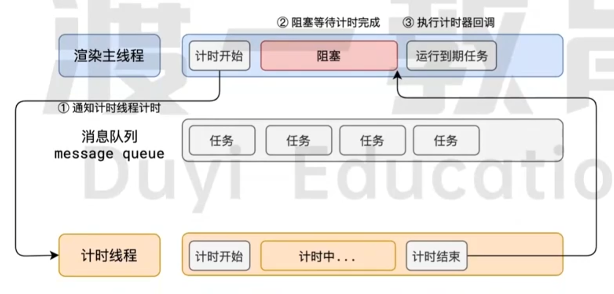

渲染主线程承担着极其重要的工作，无论如何都不能阻塞！
因此，浏览器选择**异步**来解决这个问题

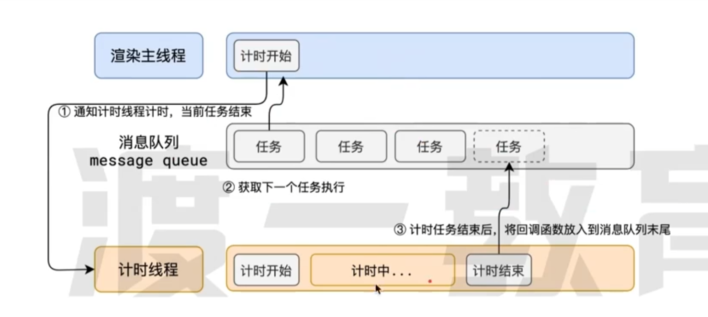

使用异步的方式，**渲染主线程永不阻塞**

```js
// 面试题：如何理解 JS 的异步？

参考答案：
JS 是一门单线程的语言，这是因为它运行在浏览器的渲染主线程中,而渲染主线程只有一个
而渲染主线程承担着诸多的工作，渲染页面、执行JS都在其中运行
如果使用同步的方式，就极有可能导致主线程产生阻塞，从而导致消息队列中的很多其他任务无法得到执行
这样一来，一方面会导致繁忙的主线程白白的消耗时间，另一方面导致页面无法及时更新,给用户造成卡死现象

所以浏览器采用异步的方式来避免，具体做法是当某些任务发生时,比如计时器、网络、事件监听,主线程将任务交给其他线程去处理
自身立即结束任务的执行，转而执行后续代码
当其他线程完成时，将事先传递的回调函数包装成任务，加入到 消息队列 的末尾排队，等待主线程调度执行
```


## 任务有优先级吗？

**任务没有优先级，在消息队列中先进先出，但消息队列是有优先级的**

```js
// 根据W3C的最新解释：
1. 每个任务都有一个任务类型，同一个类型的任务必须在一个队列，不同类型的任务可以分属于不同的队列
2. 在一次事件循环中，浏览器可以根据实际情况从不同的队列中取出任务执行
3. 浏览器必须准备好一个微队列，微队列中的任务优先所有其他任务执行
// https://html.spec.whatwg.org/multipage/webappapis.html#perform-a-microtask-checkpoint
```

在目前`Chrome`浏览器的实现中，至少包含了下面的队列：

- 延时队列：用于存放计时器到达后的回调任务，优先级【中】
- 交互队列：用于存放用户操作后产生的事件处理任务，优先级【高】
- 微队列：用户存放需要最快执行的任务，优先级【最高】

添加任务到微队列的主要方式主要是使用`Promise回调、MutationObserver`

**宏任务`macro task`**：`setTimeout`、`setInterval`、`requestAnimationFrame`、事件处理函数
**微任务`micro task`**：`Promise`的`.then()`和静态方法

```js
// 立即把一个函数添加到微队列等待执行
Promise.resolve().then(函数)
```

**单线程是异步产生的原因，事件循环是异步的实现方式**

> [!NOTE]
>
> `Promise(() => { 代码 })`里的代码是同步执行的
> `.then(callback)`的回调才是异步的，状态确定后将`callback`放进微队列等待执行
>
> `resolve()`和`reject()`后面的代码依旧会运行，只是不会更改任务的状态和数据


# 浏览器如何渲染页面？

当浏览器的网络线程收到HTML文档后，会产生一个渲染任务，并将其传递给渲染主线程的消息队列
在事件循环机制的作用下，渲染主线程取出消息队列中的渲染任务，开启渲染流程

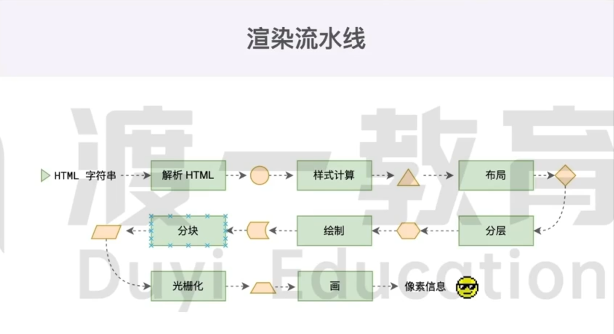

每个阶段都有明确的输入输出，上一个阶段的输出会成为下一个阶段的输入
这样，整个渲染流程就形成了一套组织严密的生产流水线


## 解析 HTML

解析过程中遇到CSS解析CSS
为了提高解析效率，浏览器在开始解析前会启动一个**预解析的线程**，率先下载HTML中的外部CSS文件和外部的JS文件
如果主线程解析到Link标签位置，此时外部的CSS文件还没有下载解析好，主线程不会等待，继续解析后续的HTML
这是因为下载和解析CSS的工作是在预解析线程中进行的，这就是CSS不会阻塞HTML解析的根本原因

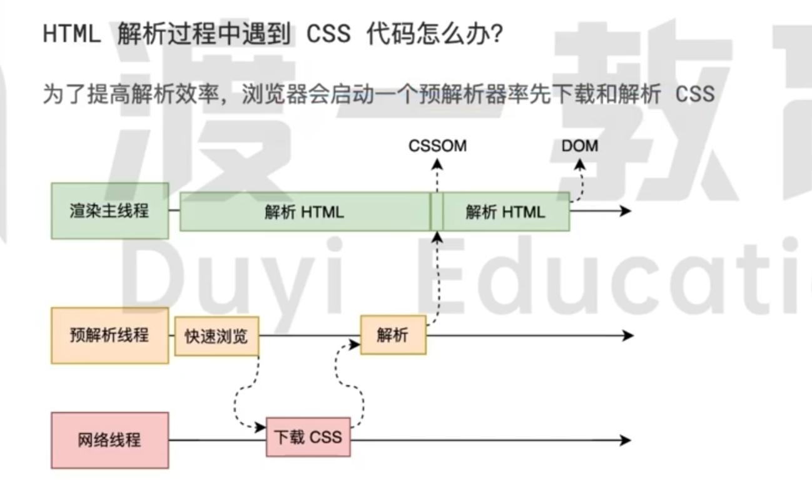

如果主线程解析到script位置，会停止解析HTML，转而等待JS文件下载好，并将全局代码解析执行完成后，才能继续解析HTML
这是因为JS代码的执行过程可能会修改当前的DOM树，所以DOM树的生成必须暂停
这就是JS会阻塞HTML解析的根本原因

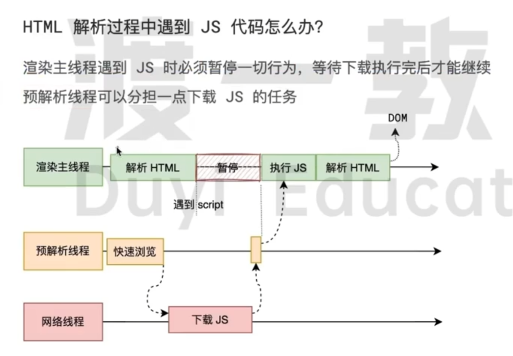

HTML解析完成后，会得到DOM树和CSSOM树，浏览器的默认样式、内部样式、外部样式、行内样式均会包含在CSSOM树中


## 样式计算

渲染主线程会遍历得到的DOM树，依次为树中的每个节点计算出它最终样式,称之为`ComputedStyle`
在这一过程中，很多预设值会变成绝对值，比如red会变成rgb(255,0,0)，相对单位会变成绝对单位，比如em会变成px
这一步完成后，会得到一棵带有样式的DOM树

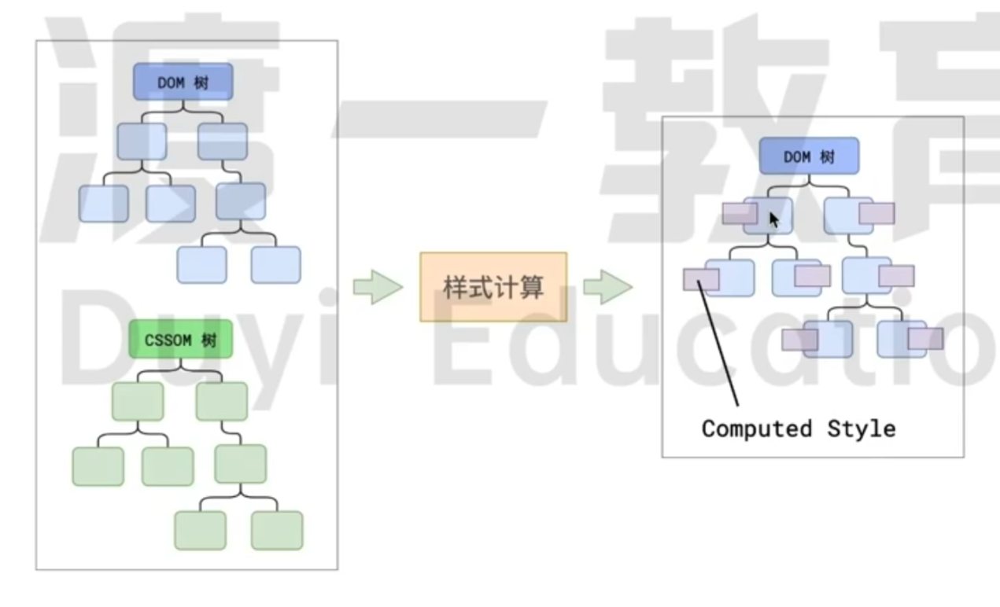


## 布局

布局阶段会依次遍历DOM树的每一个节点，计算每个节点的几何信息；例如节点的宽高、相对包含块的位置
大部分时候，DOM树和布局树并非一一对应
比如`display: none`的节点没有几何信息，因此不会生成到布局树；又比如使用了伪元素选择器，虽然DOM树中不存在这些伪元素节点，但它们拥有几何信息，所以会生成到布局树中；还有匿名行盒、匿名块盒等等都会导致DOM树和布局树无法一一对应


## 分层

渲染主线程会使用一套复杂的策略对整个布局树中进行分层
分层的好处在于将来某一个层改变后，仅会对该层进行后续处理，从而提升效率
滚动条、堆叠上下文、transform、opacity等样式都会或多或少的影响分层结果，也可以通过`will-change`属性更大程度的影响分层结果

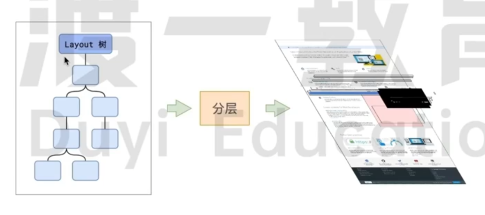


## 绘制指令

渲染主线程会为每个层单独产生绘制指令集，用于描述这一层的内容该如何画出来

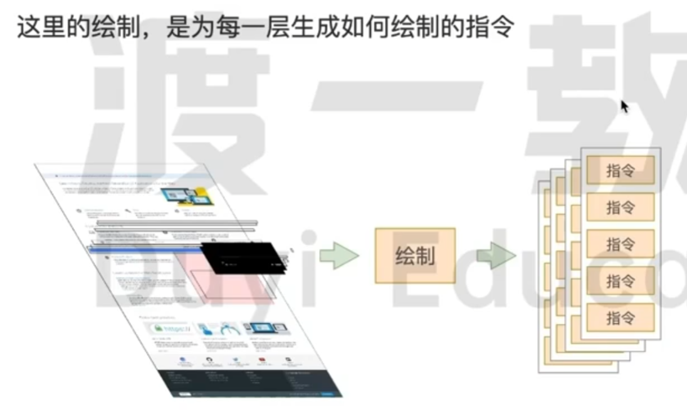

完成绘制后，渲染主线程将每个图层的绘制信息提交给合成线程，剩余工作将由合成线程完成

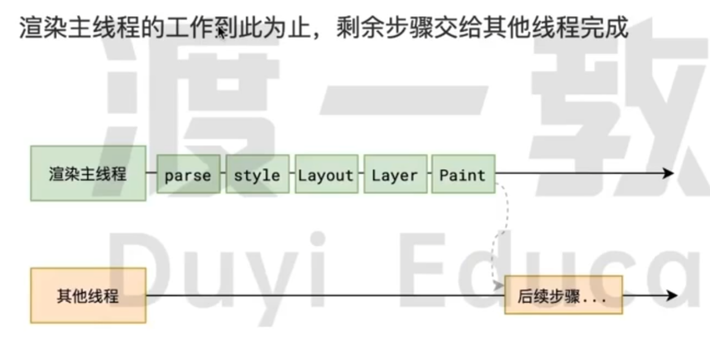


## 分块

合成线程首先对每个图层进行分块，将其划分为更多的小区域，它会从线程池中拿取多个线程来完成分块工作
分块的工作是交给多个线程同时进行的

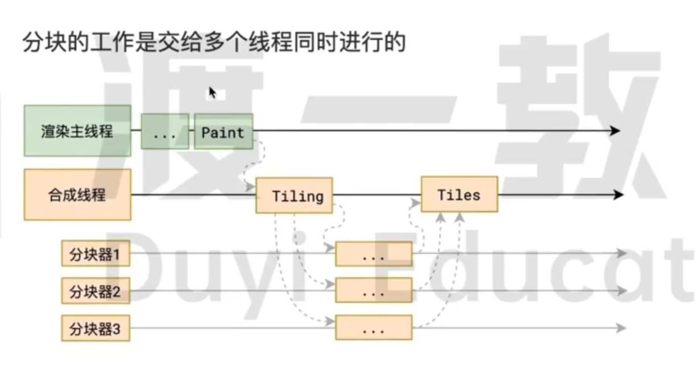


## 光栅化

分块完成后，进入光栅化阶段
合成线程会将块信息交给GPU进程,，以极高的速度完成光栅化
GPU进程会开启多个线程来完成光栅化，**并且优先处理靠近视口区域的块**
光栅化的结果，就是一块一块的位图

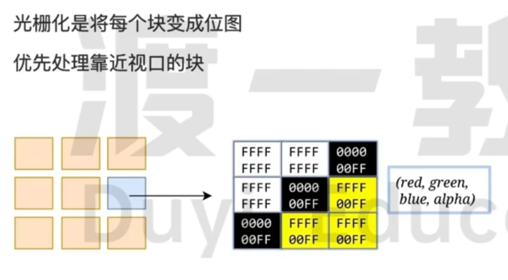

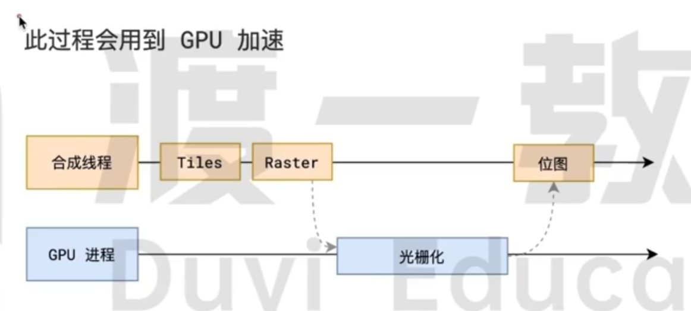


## 画

最后一个阶段就是画了
合成线程拿到每个层、每个块的位图后，生成一个个【指引(quad)】信息
指引会标识出每个位图应该画到屏幕的哪个位置，以及会考虑到旋转、缩放等变形
变形发生在合成线程，与渲染主线程无关，这就是transform效率高的本质原因
合成线程会把quad提交给GPU进程，由GPU进程产生系统调用，提交给GPU硬件，完成最终的屏幕成像


## `Reflow`?

回流，页面重排布局
`Reflow`的本质就是重新计算`layou`t树
当进行了会影响布局树的操作后，需要重新计算布局树，会引发`layout`布局重新计算
为了避免连续的多次操作导致布局树反复计算，浏览器会合并这些操作：
**`reflow`非常耗时，浏览器为了提升性能，对JS中连续导致`reflow`的代码，把`reflow`的时间点延迟到结束后进行**
**但在此过程中，如果遇到了获取尺寸和位置的代码，浏览器会迫不得已立即`reflow`**
**所以改动属性造成的`Reflow`是异步完成的**
也同样因为如此，当JS获取布局属性时，就可能造成无法获取到最新的布局信息

```js
/** 进行哪些操作会导致 reflow 重排 **/
// 1. 获取元素的尺寸和位置
// 2. 直接或间接改变元素的尺寸和位置

// 浏览器在反复权衡下，最终决定获取属性立即Reflow
```

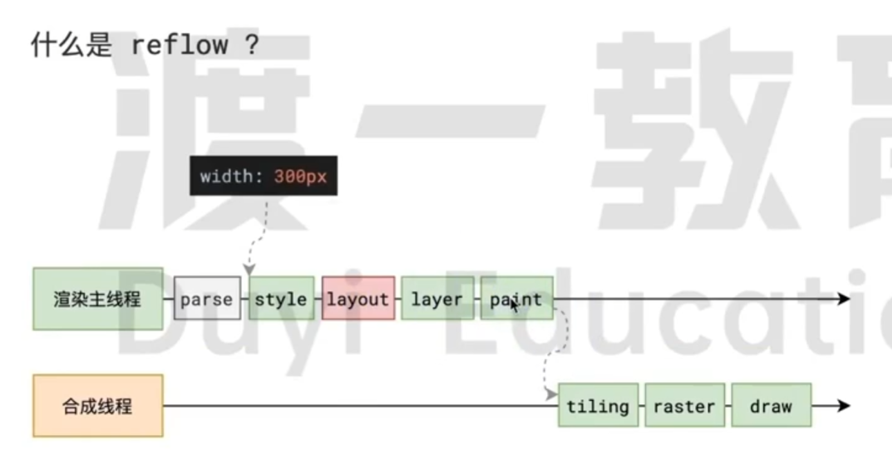


## `Repaint`?

重绘，`Repaint`的本质就是重新根据分层信息重计算了绘制指令
当改动了可见样式后，就需要重新计算，会引发`Repaint`
**由于元素的布局信息也属于可见样式，所以`Reflow`一定会引起`Repaint`**
绘制`Repaint`的过程是靠`GPU`完成的，速度非常快
因此，**相对于导致`Reflow`的代码，仅会导致`Repaint`的代码效率会高出很多**

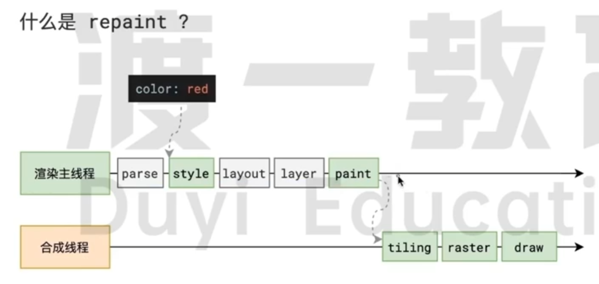


# `Web API`

和标准库不同，`WebAPI`是浏览器提供的一套API，用于操作浏览器窗口和界面


## `BOM`

是`Browser Object Model`的缩写，简称浏览器对象模型
主要处理浏览器窗口`window`和框架`iframe`，描述了与浏览器进行交互的方法和接口，提供和浏览器相关的操作

```js
// 在浏览器环境中，则有一个 window 的全局对象
window.open() // 打开一个新的浏览器窗口，返回新窗口的 window 全局对象
window.close() // 关闭由 open 方法打开的浏览器窗口
setTimeout(callback, time) // 设置一个延时定时器，time[ms]后执行callback，返回计时器的 id
clearTimeout() // 根据 id 清除延时定时器
setInterval(callback, time) // 设置一个循环定时器，每隔time[ms]执行一次callback，返回计时器的 id
clearInterval() // 根据 id 清除循环定时器
alert() // 弹出提示框
confirm() // 确认框
... ...

// window.location
// 提供和地址栏相关的操作
location.href = 'www.baidu.com' // 可以读取当前地址栏地址，也可以赋值，则本窗口跳转到新地址
location.protocol // 获取或设置地址栏中的协议部分，如`http`或`https`
location.host // 获取或设置地址中的主机及端口号，如`localhost:3000`
location.port // 获取或设置地址中的端口号，如 `3000`
location.pathname // 获取或设置地址中的路径部分，如`www.bilibili.com/history`中的`/history`部分
location.hash // 获取或设置地址中的hash部分，如`http://localhost:18090/#/home`中的`#/home`部分
location.reload() // 重载刷新页面
... ...

// window.history
// 提供当前窗口历史记录相关的操作
history.back() // 后退
history.forward() // 前进
history.go(offset_number) // 根据相对于当前页面的偏移量，进入历史记录中指定页面
history.pushState() // 在历史记录中添加一条记录，页面不刷新
history.replaceState() // 替换当前的记录，页面不刷新
```


## `DOM`

`Document Object Model`，文档模型，提供和页面相关的操作，标准化组织是W3C
它是一个对象，对应着 html 中的节点和标签

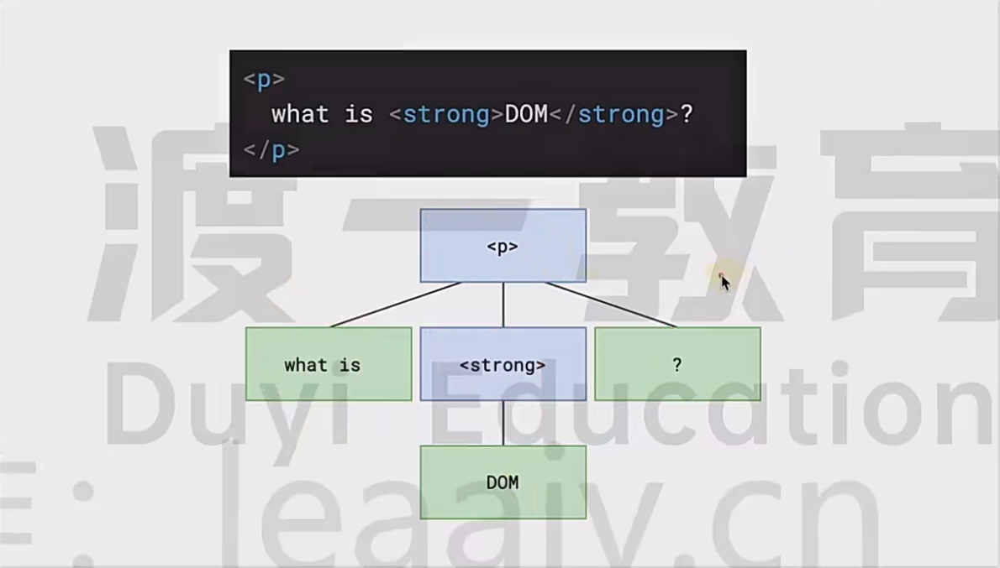

```js
[document | dom].querySelector('.container') // 通过css选择器获取一个匹配的dom对象
[document | dom].querySelectorAll('.div') // 得到所有匹配的dom伪数组

// 更改 dom 结构
dom.remove() // 从dom树种移除自身
dom.removeChild(node) // 删除dom的子节点
dom.insertBefore(node) // 在dom的子节点中，添加一个新的子节点到另一个子节点之前
dom.appendChild(node) // 添加一个新的子节点在dom的子节点末尾

// 监听 dom 的事件
dom.onclick = function() {} // 点击事件
dom.oncontextmenu // 右键菜单显示前触发回调
dom.onmouseenter // 鼠标进入元素时触发（不冒泡）
dom.onmouseleave // 鼠标离开元素时触发（不冒泡）
dom.onmouseover // 鼠标进入元素时触发（冒泡）
dom.onmouseout // 鼠标离开元素时触发（不冒泡）
window.onwheel // 鼠标滚轮滚动时触发

// 键盘事件
window.keydown // 键盘按下时触发
window.keyup // 键盘抬起时触发
```

事件传播机制

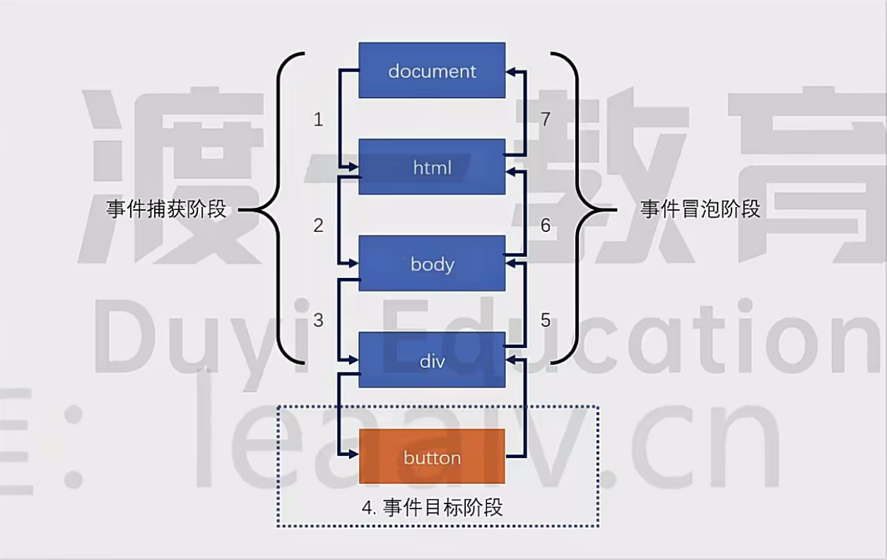

事件委托

```js
// 获取父元素
const container = document.querySelector('.container')
// 直接将事件注册在父元素上，通过冒泡机制
container.onclick = function(e) {
  if (e.target.tagName === 'BUTTON') {
    console.log('click')
  }
}
// 1. 避免有大量子元素时，需要依次在子元素上注册事件，提升效率和性能
// 2. 避免动态的子元素添加进来时，需要再次为新的子元素注册事件
```


# `DOM`事件传播机制

如果单击了某个按钮，事件不仅仅发生在按钮上，甚至也单击了整个页面
基于这种状况，`IE`和`Netscape（网景）`开发团队分别提出了差不多是完全相反的事件流概念：
`IE`的事件流是冒泡流，而`Netscape`的事件流是捕获流


## 事件冒泡

`IE`的事件流叫做事件冒泡`event bubbling`
即事件开始时由最具体的元素（文档中嵌套层次最深的那个节点）接收，然后逐级向上传播到较为不具体的节点（文档）


## 事件捕获

`Netscape`团队提出的事件流叫做事件捕获`event captruing`
思想是不太具体的节点应该更早接收到事件，而最具体的节点应该最后接收到事件，即不具体到具体的过程


## 标准`DOM`事件流

`DOM`标准采用的是[捕获+冒泡]的方式


事件捕获阶段：实际目标div在捕获阶段不会触发事件，捕获阶段从window开始,然后到document、html,最后到body意味着捕获阶段结束。

处于目标阶段：事件在div上发生并处理,但是本次事件处理会被看成是冒泡阶段的一部分

冒泡阶段:事件又传播回文档


## 事件委托

又被称之为事件代理，在`JavaScript`中，添加到页面上的事件处理程序数量将直接关系到页面整体的运行性能
首先，每个函数都是对象，都会占用内存，内存中的对象越多性能就越差
其次，必须事先指定所有事件处理序而导致的DOM访问次数也会延迟整个页面的交互就绪时间
对事件处理程序过多问题的解决方案就是事件委托，利用了事件冒泡机制

把点击事件绑定到每个`li`元素上，非委托做法就是给每个`li`元素都绑定事件，但是元素一多，性能消耗将会大幅增加

将事件直接绑定到父元素`ul`上，利用事件冒泡机制，同样可以出发点击事件
那如何确定我点击的目标元素是哪个呢？使用`event.target`获取当前点击的元素，而不是事件绑定的元素

```html
<ul id="ul"></ul>
<script>
  const dom = document.getElementBuId('ul')
  dom.onclick = function (event) {
    console.log(event.target) // 获取鼠标点击的dom元素
  }
  // 页面绑定事件更少，交互执行性能更好
</script>
```


## 阻止事件默认行为

像form表单的提交行为，a标签的链接跳转行为

```js
dom.onclick = function(event) {
  event.cancelable // 只读属性，表示当前事件是否可被取消
  event.preventDefault() // 阻止事件的默认行为
  event.returnValue = false // 将值设置为 false，也可以阻止默认行为
  console.log(event.defaultPrevented) // 只读，默认行为是否被阻止
}
```


# 面向对象

面向对象编程`Oriented Object Programing`，是一种编程思维思想，简称`OOP`
它提出**一切以对象分类为切入点思考问题**

其他编程思想：

- 面向过程：以功能流程为思考切入点，不太适合大型应用
- 函数式编程：以数学运算为思考切入点


# 计算机储存

**计算机底层只有0和1，所以所有的运算最后实际上都是二进制运算**

将浮点数转换为二进制，整数我们可以用除2取余的方式，小数我们则可以用乘2取整的方式

**计算机必须使用固定的位数来存储数字，无论存储的数字是大是小，在内存中占用的空间是固定的**
n位的无符号整数能表示的数字是2^n个，取值范围是：`0 ~ 2^n - 1`
n位的有符号整数能表示的数字是2^n个，取值范围是：`-2^(n - 1) ~ 2^(n - 1) - 1 `

浮点数表示法可以用于表示整数和小数，目前分为两种标准：

- 32位浮点数：又称为单精度浮点数，它用1位表示符号，8位表示阶码，23位表示尾数
- 64位浮点数：又称为双精度浮点数，它用1位表示符号，11位表示阶码，52位表示尾数

**有符号储存第一位为`1`表示负数，`0`表示正数**

**JS中的所有数字，均使用双精度浮点数保存，即64位浮点数**，使用`IEEE 754`标准
例如在JS中储存100个0，需要占用`64 * 100 = 6400 bit`，而`8bit = 1byte; 1024byte = 1kb; 1024kb = 1mb`

既然限定位数，必然有截断的可能，自然就会导致数据的不准确


## 类型化数组

用于优化储存大量数字，避免内存空间的浪费
**类型化数组不能增加和删除数据（操作无效），因为长度固定、占用内存空间固定**
其他用法和普通数组一致，也可以使用`.map`等方法

类型化数组中只能存储该类型取值范围内的数字
例如`Int8Array`的储存范围在`-128 ~ 127`，如果某个元素超过了127，则会导致实际储存数字不同

```js
/**
* Int8Array：8位有符号整数（-128 ~ 127）
* Uint8Array：8位无符号整数（0 ~ 255）
* Int16Array：16位有符号整数
* Uint16Array：16位无符号整数
* Int32Array：32位有符号整数
* Uint32Array：32位无符号整数
**/

// 创建有10个元素值默认都为0的类型化数组
const arr = new Int16Array(10) // [0, 0, 0, 0, 0, 0, 0, 0, 0, 0]
arr.length // 10，元素个数
arr.byteLength // 20，占用字节长度：10 * 16 / 8 = 20 byte

// 使用`.of`静态方法构建初始化元素
const initarr = Int8Array.of(3, 5, 6, 2, 0) // Int8Array(5) [3, 5, 6, 2, 0]

// 从一个普通数组得到一个类型化数组
const arr = new Uint16Array([0, 14, 435, 232, 32])
arr[2] = 64 // 修改下标为2的元素的值
```


## `ArrayBuffer`

**一个对象，用于储存一个固定大小的数据，用来表示通用的原始二进制数据缓冲区**，[MDN参考](https://developer.mozilla.org/zh-CN/docs/Web/JavaScript/Reference/Global_Objects/ArrayBuffer)
语法：`new ArrayBuffer(字节数)`
可以通过`byteLength`读取字节数，通过`slice`切割得到一个新的`ArrayBuffer`
**不能直接操作`ArrayBuffer` 中的内容，而是要通过类型化数组或`DataView`来操作**

```js
// 创建一个固定储存 10 个字节大小的数组，值都默认为 0
const arr = new ArrayBuffer(10)

// 使用 DateView 来操作数组
const dv = new DataView(arr, 0, 10) // 语法：new DataView(arraybuffer, offset, byteLength)

// 使用类型化数组
// 实际上，每一个类型化数组都对应一个ArrayBuffer，如果创建类型化数组时没有指定ArrayBuffer，则会新建一个
const bf = new ArrayBuffer(10)
const arr1 = new Int8Array(bf)
const arr2 = new Int16Array(bf)
arr1 === arr2 // false
arr1.buffer === arr2.buffer // true
arr1[0] = 10 // 因为两个类型化数组共用一个内存空间，所以更改arr1的数据后，arr2也会一起更新
```


# `HTML`补充😪


## 文档声明

`HTML`文档通常以文档声明开始，该声明的作用是帮助浏览器确定及尝试解析和显示`HTML`文档

文档声明并非一个`HTML`标签。它是一条"信息"，告知浏览器期望的文档类型
文档声明必须在`HTML`文档的第一行且顶格显示，对大小写不敏感

```html
<!-- HTML5 文档类型，告诉浏览器该文档使用 HTML5 标准进行解析 -->
<!DOCTYPE html>

<!-- 不同的版本的文档类型信息不一样 ->
```

任何放在`DOCTYPE`前面的内容（如批注或`XML`声明），都会令`IE9`或更早期的浏览器触发怪异模式`Quirks Mode`

`HTML5`是`HTML`的第五个修订版，该版本不再基于`SGML`了，所以也就不用再引入`DTD`声明了
`HTML5`的出现，其主要的目标是将互联网语义化，以便更好地被机器阅读，同时提供更好地支持各种媒体的嵌入


## 渲染模式

浏览器渲染模式分为3种：

- 怪异模式（混杂模式）`Quirks mode`，保持浏览器渲染的兼容性
- 严格模式（标准模式）`Standars mode`
- 几乎标准模式`Almost standards mode`

几个怪异模式中的怪异行为：

- 宽高的算法与W3C盒模型不同
- 在表格中的字体样式不会继承
- 可以设置行内元素宽高
- `white-space: pre`会失效


## `HTML`语义化

语义是指对一个词或者句子含义的正确解释，很多`HTML`标签也具有语义的意义
也就是说元素本身传达了关于标签所包含内容类型的一些信息
例如当浏览器解析到`<h1>`标签时，它将该标签解释为包含这一块内容的最重要的标题
即`<h1>`标签的语义就是用它来标识特定网页或部分最重要的标题

为什么需要语义话？

- 明确代码结构：使页面没有`CSS`的情况下，也能够呈现出很好的内容结构

- 有利于`SEO`优化：爬虫依赖标签来确定关键字的权重，因此可以和搜索引擎建立良好的沟通，帮助爬虫抓取更多的有效信息
- 提升用户体验：例如`title、alt`可以用于解释名称或者解释图片信息，以及`label`标签的灵活运用
- 便于团队开发和维护：语义化使得代码更具有可读性，让其他开开发人员更加理解你的`HTML`文档结构，减少差异化
- 方便其他设备解析：如屏幕阅读器、盲人阅读器、移动设备等，以有意义的方式来渲染网页

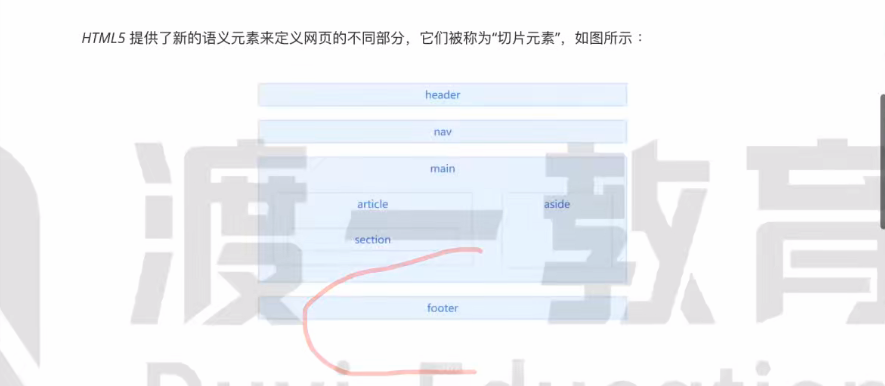


## `W3C`?

万维网联盟`World Wide Web Consortium`，创建于1994年10月，是一个会员组织
工作是对`Web`进行标准化，创建并维护`WWW`标准，`W3C标准`被称为`W3C规范`


## `SEO`?

SEO由英文`Search Engine Optimization`缩写而来，中文意译为"搜索引擎优化"
其实叫做“针对搜索引擎优化”更容易理解，它是指从自然搜索结果获得网站流量的技术和过程
是在了解搜索引擎自然排名机制的基础上，对网站进行内部及外部的调整优化
改进网站在搜索引擎中的关键词自然排名，获得更多流量，从而达成网站销售及品牌建设的目标

如何做`SEO`优化？

### 内部优化

- 合理的`title、description、keywords`，即所说的`TDK`

  ```html
  <head>
    <!--
  		description：简要概括网页的主要内容，搜索引擎通常会在搜索结果中展示这段文字
  		长度建议控制在 120-160 个字符
  	-->
    <meta name="description" content="页面描述内容">
    <!--
  		keywords：一般设置 3-5 个与页面内容高度相关的核心关键词，用逗号分隔
  	-->
    <meta name="keywords" content="关键词1,关键词2,关键词3,...">
    <!--
  		title：定义网页的标题，会显示在浏览器标签页上，也是搜索引擎结果页（SERP）中最显眼的内容之一
  		长度一般控制在 60 个字符以内，避免被搜索引擎截断；包含网页的核心关键词，且与页面内容高度相关
  	-->
    <title>页面标题内容</title>
  </head>
  ```

- 语义化的`HTML`代码，符合W3C规范，即使用`head、nav、footer`等语义化标签，非装饰性图片须加`alt`属性

- 对于不显示的对象谨慎使用`display: none`，搜索引擎会过滤掉其内容

- 重要内容`HTML`代码放在最前，因为所搜引擎抓取内容自上而下

- 少用`iframe`标签，其内容不会被抓取

  `iframe`称之为嵌入式框架，嵌入式框架可以把一个完整的网页内容嵌入到现有的网页中

  ```html
  <body>
    <p>iframe 示例</p>
    <iframe src="https://www.bilibili.com/" width="600" height="400"></iframe>
  </body>
  ```


### 外部优化

外部优化主要是指放友情链接和外链，好的友情链接可以快速的提高网站的权重
高质量的外链会给你的网站提供源源不断的权重提升，另外就是要向各大搜索引擎登陆入口提是交尚未收录站点（百度站点平台）


## 微格式

所谓微格式，是建立在已有的、被广泛采用的标准基础之上的一组简单的、开放的数据格式
具体表现是把语义嵌入到`HTML`中，以便有助于分离式开发，并通过制定一些简单的约定来兼顾`HTML`文档的人机可读性
相当于对`Web`网页进行了语义注解

```html
<a href="http://www.bbon.cn" rel="homepage">Web Design Blog</a>
```

增加了一个`rel`属性，这个`rel="homepage"`属性显示链接的目标页面是该网站的首页
通过为已有的链接元素添加语义化属性，就为这个链接添加了具体的约结构和意义

有何意义？

- 在爬取`Web`内容时，能够更为准确地识别内容块的语义

- 对内容进行操作，包括提供访问、校对，还可以将其转化成了其他的相关格式（JSON），提供给外部程序和`Web`服务使用
- 微格式可以对网站进行`SEO`优化，如果需要可以考虑


## 可替换元素

可替换元素`replaced element`，是指一些展现效果不由`CSS`来控制的元素，是一种外部对象，它们外观的渲染是独立于`CSS`的
简单来说，它们的内容不受当前文档的样式的影响，`CSS`可以影响可替换元素的位置，但不会影响到可替换元素自身的内容
例如某些可替换元素`iframe`元素，可能具有自己的样式表，但它们不会继承父文档的样式

常见的替换元素：

- 图片标签`img`
- 内联框架`iframe`
- 音频视频标签`video | studio`

与替换元素相对应的，就是非替换元素，顾名思义就是那些样式完全由`CSS`来控制的元素，例如`p、h1~h6`等


## 页面可见性

长期以来我们一直缺少一个判断用户是否正在浏览某个指定标签页的方法，用户是否去看别的网站了？他们切换回来了么？
现在，`HTML5`里页面可见性接口就提供给了程序员一个方法，常用的`API`如下：

- `document.hidden`：这个属性显示页面是否为用户当前观看的页面，值为`ture | false`
- `document.visibilityState`：值要么是`visible`，表明页面为浏览器当前激活标签页，而且窗口不是最小化状态
  要么是`hidden`，表示页面不是当前激活页面，或者窗口最小化了
  或者`prerender`，表示页面在重新生成，对用户不可见
- `visibilitychange`：触发事件，监听页面可见性变化事件

常见的用途就是，再页面可见或不可见之间发生变化时，做一些事情

- 轮播图片在页面可见时，才会自动播放下一张
- 网页不可见是，暂停播放一些媒体内容
- 一些需要轮询的数据在页面不可见时停止


## `lorem`

乱数假文，用于生成测试得乱序文本

```html
<!-- 语法：在模板中输入lorem，按回车键，自动生成 -->

<!-- 生成4个乱序文本词 -->
lorem4
Lorem ipsum dolor sit
<!-- 生成2行且每行5个乱序文本词 -->
lorem5*2
Lorem ipsum dolor sit amet.
Corrupti nobis animi doloribus eius.
```


## 文档片段

在需频繁地创建`DOM`元素添加到DOM树中情况下，使用`document.createDocumentFragment()`来避免多次操作`DOM`树

```js
function createLrcElements() {
  var frag = document.createDocumentFragment() // 创建文档片段
  for (vari = 0; i < Data.length; i++) {
    var li = document.createElement('li')
    li.textContent = Data[i].words
    frag.appendChild(li) // 此时文档片段还未挂载到DOM树上，不会影响DOM树
    // ul.appendChild(li) // 频繁地修改DOM树
  }
  ul.appendChild(frag)
}
```


## `DOM`尺寸和位置

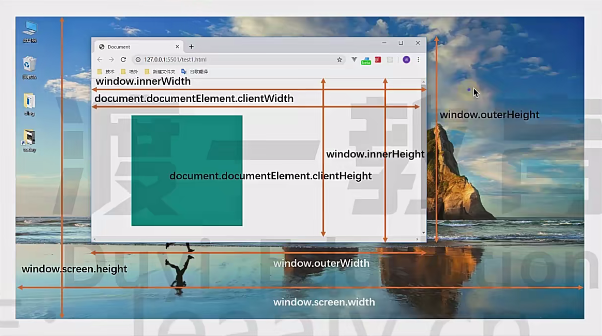

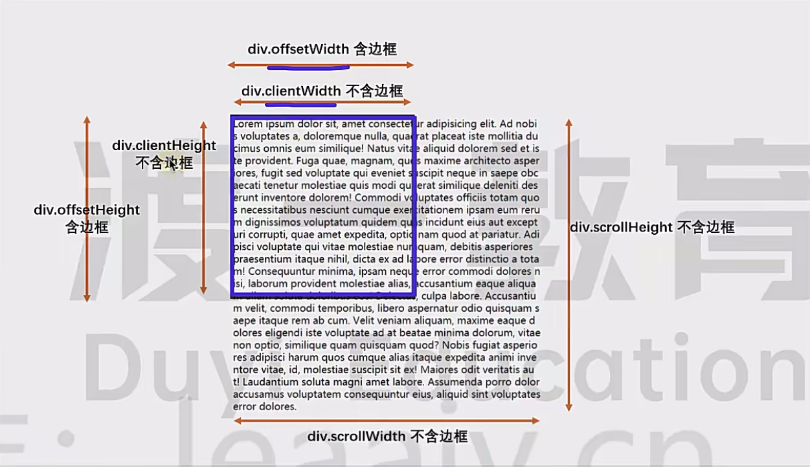


# `CSS`补充😪


## 媒体查询`Media Query`

根据不同的设备或不同的屏幕尺寸，使用不用的样式

- 使用`link`标签引入

  ```html
  <link rel="stylesheet" href="index.css" media="screen and (max-width:1280px)" />
  <link rel="stylesheet" href="print.css" media="print" />
  ```

- 使用`@import`导入

  ```css
  @import url('./index.css') screen;
  ```

  ```html
  <style>
    @import url('./print.css') print;
  </style>
  ```

- `@media`引入，语法：`@media 媒体类型 and (媒体特性) {}`

  ```css
  @media screen {
    /* 具体样式 */
  }
  @media screen and (max-width: 720px) {
    /* 具体样式 */
  }
  @media screen and (min-width: 720px) and (max-width: 1280px) {
    /* 具体样式 */
  }
  ```


## 过渡`transition`

```css
transition: property duration timing-function delay;
/*
- property：指定过渡的CSS属性 'none | all property'
- duration：指定过渡所需的完成时间，单位为s/ms
- timing-function：指定过渡的时间函数 'linear | ease | ease-in | ease-out ...'
- delay：过渡的延迟触发时间，正数 | 0 | 负数
*/
transition：width 1s ease-in 0s; /* 宽度变化过渡，时间1s */

/* 多个属性过渡 */
transition : width 1s, height 2s;
```

但并不是所有的属性都可以进行过渡，只有属性是具有一个中点值的属性才能够进行过渡效果
这样才能通过不停的修改中间值从而实现过渡效果，如`display: none | block`没有中间值所以无法应用过渡

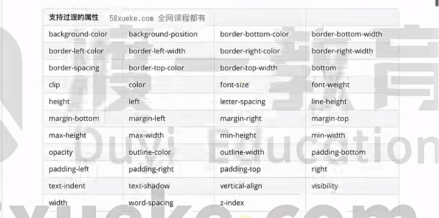

**过渡事件`transitionend`**

```js
div.onclick = () => {
  div.style.height = '400px'
}
div.ontransitionend = (event) => {
  console.log('动画过渡完成后触发执行')
}
```


## 动画`animation`

```css
animation: name duration timing-function delay iteration-count direction fill-mode play-state;
/*
- name：要绑定到选择器的动画名称
- duration：动画持续时间
- timing-function：时间函数
- delay：延迟触发时间

- iteration-count：定义动画播放的次数 '次数 | infinite'
- direction：是否轮流反方向地播放动画，正向或反向都算一次动画播放次数
- fill-mode：动画不播放时、完成时，要展示的样式，默认动画完成后回到起点状态
- play-state：指定动画是在运行或暂停 'paused | running'
*/

.ani {
  animation: Transit 4s;
}

/* 使用 @keyframes 关键字声明动画 */
@keyframes Transit {
  0% {
    left: 0;
    top: 0;
  }
  50% {
    left: 50%;
    top: 50%;
  }
  100% {
    left: 100%;
    top: 100%;
  }
}
/* 或则 */
@keyframes Transit {
  to {
    left: 0;
    top: 0;
  }
  from {
    left: 50%;
    top: 50%;
  }
}
```

动画相关事件

```js
animationstart: '动画开始后触发'
animationinteration: '动画重复播放时触发'
animationend: '动画结束后触发'
```


## 变形`transform`

`CSS3`变形是一些效果的集合，比如平移、旋转、缩放和倾斜效果，每个效果通过变形函数来实现

```css
transform: none | transform-function;
{
  transform: scale(1.5) rotate(45deg);
  
  /*
  	设置变换的中心点位置
  	transform-origin: xAxis yAxis zAxis;
  	xAxis: 'left | center | right | px | %'
  	yAxis: 'top | center | bottom | px | %'
  	zAxis: 'px'
  */
  transform-origin: left top;
  
  /*
  	3D空间一个重要属性，指定了嵌套元素如何在3D空间中呈现，设置在父元素中
  	transform-style: flat | preserve-3d;
  	- flat: 所有子元素在2D平面呈现
  	- preserve-3d: 所有子元素在3D空间中呈现
  */
  transform-style: preserve-3d;
  
  /*
  	就是视距，用来设置用户和元素3D空间Z平面之间的距离，同样也是写在父元素上
  */
  perspective: 500px;
  
  /*
  	设置观察点位置，，默认是center center，也写在父元素中
  */
  perspective-origin: center top; /* 从上方的视角看向元素 */
  
  /*
  	决定元素旋转背面是否可见，对于未旋转的元素，该元素的正面面向观看者
  	backface-visibility: hidden | visible;
  */
  backface-visibility: visible;
}

/*
- 平移函数
-- translateX(x), translateY(y), translate(x, y) 2D
-- translateZ(z), translate3d(x, y, z) 3D
*/

/*
- 旋转函数
-- rotate(角度-deg) 取值可正可负，正值代表顺时针旋转，负值代表逆时针 2D
-- rotateX(x-deg), rotateY(y-deg), rotateZ(z-deg), rotate3d(x, y, z) 3D
*/

/*
- 缩放函数
-- scaleX(x), scaleY(y), scale(x, y) 2D
-- scaleZ(z), scale3d(x, y, z) 3D
*/

/*
- 倾斜函数
-- skewX(x), skewY(y), skew(x, y)
*/

/*
- 2D矩阵
-- matrix(1, 0, 0, 1, x-offset, y-offset) 平移
-- matrix(x-scale, 0, 0, y-scale, 0, 0) 缩放
-- matrix(cos, sin, -sin, cos, 0, 0) 旋转
-- matrix(1, tan-Y, tan-X, 1, 0, 0) 倾斜
*/

/*
- 3D矩阵
-- matrix3d(4 * 4)
*/
```

3D的变化效果，需要在父元素中书写属性才能有效果

```css
.parent {
  transform-style: preserve-3d;
  perspective: 500px;
}
```


## 遮罩`mask`

通过图像或渐变来遮罩元素，只显示图像或渐变不透明的部分，透明区域会隐藏元素的对应部分

```css
div {
  mask-image: <mask-source>;
  /*
  	可以是 url() 引用的图像文件
  	可以是 CSS 渐变（linear-gradient、radial-gradient 等）
  	可以是 SVG 中的 <mask> 元素
  */
  
  /* 可选属性 */
  mask-mode: alpha | luminance | match-source;
  mask-repeat: repeat | no-repeat | repeat-x | repeat-y;
  mask-position: <position>;
  mask-size: <size>;
  mask-origin: <box>;
  mask-clip: <box>;
  mask-composite: <composite-mode>;
}
```


## 渐进式渲染

英文全称`progressive rendering`，也被称之为惰性渲染
**指的是为了提高用户所感知的加载速度，以尽快的速度来呈现页面的技术**
有一点需要弄明白的是，这不是指的某一项技术，而是各种技术的一种集合

- 骨架屏
- 图片懒加载，先加载部分图片，剩余的图片等到需要的时候再加载
- 图片占位符
- 拆分网页资源
- ...


## 堆叠上下文

层叠上下文`Stacking Context`，是`HTML`中的一个三维的概念
如果一个元素含有层叠上下文，我们可以理解为这个元素在`Z`轴上就“高人一等”，最终表现就是它离屏幕观察者更近

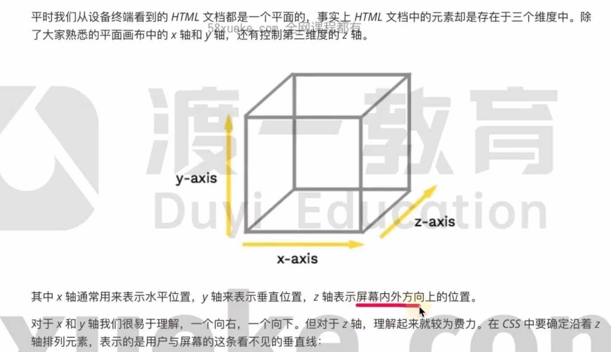


让一个元素具有层叠上下文，一般来讲有3种方法：

- `HTML`根元素本身就具有层叠上下文，称为"根层叠上下文"

- 元素设置`position`属性为非`static`并，设置`z-index`属性为具体数值，会产生层叠上下文

  ```css
  .css {
    position: absolute;
    z-index: 1;
  }
  ```

- `CSS3`中的新属性也可以产生层叠上下文

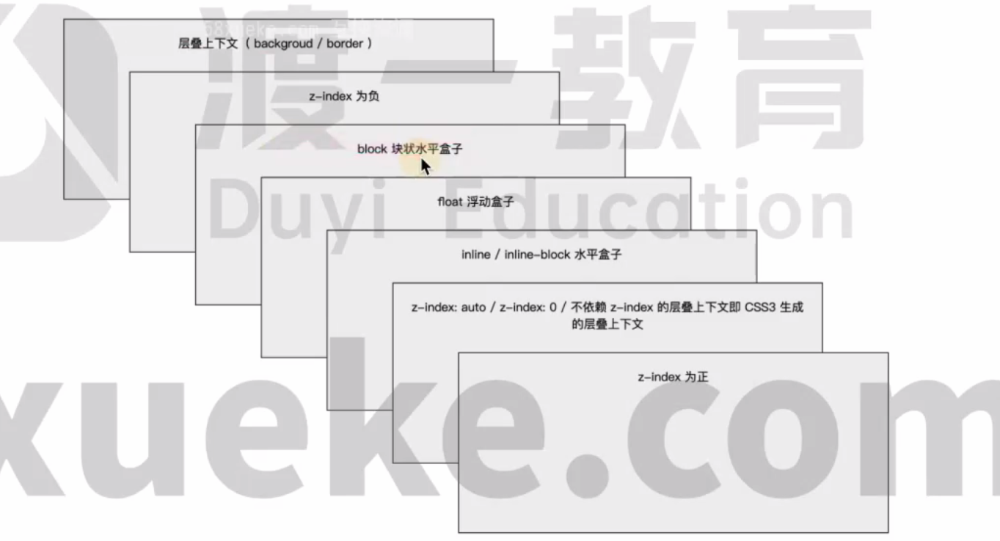

如何比较？

- 两个元素所处同一个层叠上下文，比较自身的层叠等级
- 不在同一个层叠上下文中，比较父级的层叠等级
- 当层叠上下文和层叠等级都一样，则后来居上


## `label`标签

```html
<div class="container">
  <!-- 通过 id 相关联 -->
  <input type="radio" name="gender" id="male" value="male" />
  <label for="male">Male</label>

  <!-- 直接用 label 元素包裹，里面的元素则会自动关联 -->
  <label>
    <input type="radio" name="gender" id="female" value="female" />
    <span>Female</span>
  </label>
</div>
```


## `vertical-align`

在相邻的两个元素（兄弟元素）的`display`属性值为`inline`或者`inline-block`的前提下
如存在元素上下不对齐的情况使用`vertical-align`属性来调整

```css
vertical-align: 4px;
```

也可以通过做元素的垂直居中

```css
vertical-align: middle;
```


## `BFC`

全称`Block formatting contexts`，块级格式化上下文
简单来说就是页面中的一块渲染区域，并且有一套属于自己的渲染染规则
它决定了元素如何对齐内容进行布局，以及与其他元素的关系和相互作用
当涉及到可视化布局的时候，`BFC`提供了一个环境，`HTML`元素在这个环境中按照一定规则进行布局

**`BFC`是一个独立的布局环境，`BFC`内部的元素布局与外部互不影响**
**`BFC`元素不会被浮动`float`元素给遮挡，有独立的渲染空间**


## 浮动`float`

浮动会脱离标准流
浮动的元素互相贴靠，如果有多个浮动的元素，那么会相互贴靠，如果宽度不够则会重启一行
宽度收缩，在没有设置宽度的情况下，块级元素在标准流时独占一行，宽度也会占满整个容器
但是一旦被设置为浮动后，宽度就会收缩到内容大小宽度

```html
<!-- 块级元素设置浮动后，在不明确宽度情况下，会自适应内容的宽度 -->
<p style="float: left">direuchrhcrcr</p>

<!-- 给图片增加浮动，可以实现文字环绕的效果 -->
<div>
  
  <p>direuchrhercrecrtcrtcvrvrtvcerecrcrcr</p>
</div>
```

怎么清除浮动带来的副作用？

- 加高法：父级元素明确声明`height`高度，但需要大于子元素的高度，否则会出问题

- `clear`属性，可选值`left | right | both | none | inherit`，但会导致该元素的`margin`属性失效

- 父元素添加`overflow: hidden`样式，父元素会形成一个`BFC`，一块独立显示的区域不受外界影响

- 伪类清除法，给父元素添加一个`::after`伪类，并书写样式

  ```css
  .father::after {
    content: '';
    display: block;
    height: 0;
    clear: both;
    visibility: hidden;
  }
  ```


## 定位`position`

**`static`静态定位**

就是标准流，块级元素独占一行，行元素共享一行
是`HTML`元素的默认值，静态定位的元素不会受到`top, bottom, left, right`的影响

**`relative`相对定位**

相对自己原来的位置进行定位，相对定位的最大特点就是不脱离标准流，相对于自己原来的位置上进行偏移
一般用于：微调元素的位置、做绝对定位的参考（子绝父相）

**`absolute`绝对定位**

相对于离自身最近的并且设置了定位属性的父元素进行偏移，沿父元素查找，直到整个屏幕视口
使用了绝对定位后的盒子会**脱离标准流**，设置的`margin`也会失效，且自动变成块盒`display: block`

**`fixed`固定定位**

可以看作是一种特殊的绝对定位，所以自然而然固定定位也是会脱离标准流
特点是相对于浏览器窗口进行定位的，无论页面如何滚动，这个盒子的显示位置都是不会变化的

**`sticky`粘性定位**

在`CSS3`中，新增了一种定位方式，让元素在相对定位`relative`和固定定位`fixed`之间混合

- 父元素设置`overflow: visible`，不能是`hidden | auto`，让父元素可以滚动
- 父元素的高度不能低于`sticky`元素的高度
- 如果父元素没有设置定位`position: relative | absolute | fixed`，则相对于`viewprot`视口进行定位
- 设置阀值：需要指定`top, right, bottom, left`四值其中之一，才可生效，否则其行为与相对定位相同
  优先级`top > bottom`，`left > right`


## `border`和`outline`

`outline`不占用元素的盒尺寸，只有显示效果，但`border`会参与到盒尺寸的计算中


## `calc`函数

用在任何长度、数值、时间、角度、频率等需要动态计算的地方，支持所有`css`长度单位

```css
width: calc(100% - 100px);
```

可以用常见的`+-*/`符号来进行运算，但需要注意的是`+ | -`必须用空格隔开
原因很简单，如果挨在一起，则浏览器在解析时会认为这可能是一个负值

```css
width: cacl(100% -8px); /* 会出错，结果为0 */
```


## `CSS`属性值计算过程

所有的HTML元素，任何一个元素必须要每一个CSS属性全部都要有值，浏览器才知道如何显示它
没有书写的属性值，并不代表这个元素没有这个CSS属性和值，浏览器有默认的值

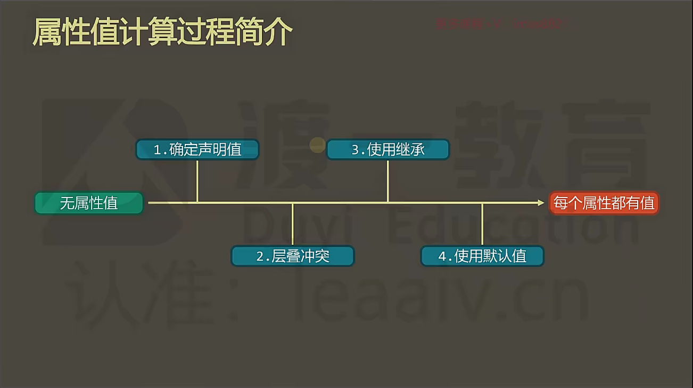

浏览器调试工具中的`Computed`可以看到选中元素的**最终计算样式**

1. 确定声明值

   参考样式表中没有冲突的声明，作为CSS属性值，这一步有冲突重复声明的属性不会处理确定最终值

2. 层叠冲突

   对样式表中有冲突的声明使用层叠规则，确定CSS属性值

   - 比较重要性，用户书写样式大于浏览器默认样式
   - 比较特殊性，权重比较
   - 比较次序性，后面的会覆盖前面的样式

3. 使用继承

   对仍然没有值的属性，若可以继承，则继承复元素的值

4. 使用默认值

   对仍然没有值的属性，使用浏览器的默认值


## 伪类选择器

```css
/* 没有访问过的超链接 */
a: link {}
/* 已访问过的超链接 */
a: visited {}
: hover {}
/* 鼠标按下 */
: active {}
/* 聚焦的表单元素 */
: focus {}
/* 禁用的表单元素 */
: disabled {}
/* xaun'zhong */
: checked {}
: first-child {}
: last-child {}
/* 选中 an+b 个子元素，a、b是常量，n 的值从 0 开始递增*/
: nth-child(an+b) {}
```


## 元素隐藏显示

```css
/* dom 元素盒子也会消失 */
display: none;

/* 不可见，有 dom 元素，但是不能触发事件 */
visibility: visible; 
visibility: hidden; 
/* 透明度为0，有 dom 元素，可被触发事件 */
opacity: 0;
/* 设置宽高为0 */
width: 0;
height: 0;
/* 裁剪元素 */
clip-path: polygon(0px 0px, 0px 0px, 0px 0px, 0px 0px);
```

`HTML5`中新增的`hidden`标签属性，相当于`display: none`，直接书写在标签中

```html
<div hidden>Content</div>
```


