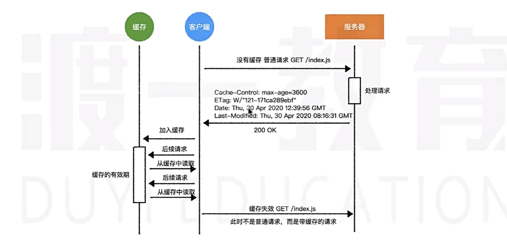

# 客户端&服务器

在大部分情况下，通信总是由一方发出一个消息开始，而另一方回复一个消息结束
发出消息的一方称之为**客户端**`Client`，发出消息的过程称之为请求`Request`
回复消息的一方称之为**服务器**`Server`，回复消息的过程称之为响应`Response`


> [!NOTE]
>
> **不管是客户端，还是服务器，它们都是一个应用程序，而不是一台计算机**
> **客户端和服务器可以分布在不同的计算机上，也可以在同一台计算机上**
> 例如`liveserver`插件和`http.createServer`，就是一个服务器，它运行在本地的计算机上
>
> 大部分后端开发的就是服务器程序，前端的`NodeJs`技术也能开发服务器程序
>
> 客户端和服务器的这种交互模式称之为「经典C/S结构」，如果客户端是浏览器则称之为「B/S结构」
>
> 服务器程序往往是为互联网产品提供服务，因此又称之为`web`服务器
>
> **一次完整的交互，总是从请求开始，响应结束**


# 地址`url`

在互联网中，我们可以通过一个叫`url`地址的东西找到我们想要的资源
`url`全称`uniform resource locator`，**统一资源定位符**
它是一个字符串，用于表达互联网中某个资源的位置


## 协议`protocol`

### `http`

通过url地址，能够在茫茫互联网中准确的找到自己想要的服务
但光找到服务还是不够，双方需要「用同一种语言」来对话，否则都听不懂对方在说什么
这个「语言」就是协议，而互联网中最常见的协议就是`http`协议
`http`是基于「请求-响应」的方式完成通信的，每一次通信都是由客户端向服务器发出请求，传递一些消息过去，然后经过服务器程序处理后，响应给客户端一些消息
协议规定：

- 每次「请求-响应」都是独立的，相互之间互不干扰，这种模式的协议我们称之为**无状态协议**
- **每次「请求-响应」传递的消息都是纯文本(字符串)**，而且且文本格式必须按照http协议规定的格式书写

### `https`

`https`是在`http`协议基础上发展起来的，它增加了安全性，都基于`TCP`协议
它保证了数据在传输过程中不被窃取和篡改，从而保证传输安全

服务器申请`SSL`加密协议证书，浏览器通过`https`协议访问服务，先会拿到证书签名再验证是否被篡改，验证无误则后则正常通信


## 主机`Host`

它表示客户端希望在哪台计算机上寻找资源，有两种写法：`IP`地址和域名

### `IP`地址

由四部分数字组成，每部分数字对应`8`位二进制数字，各部分之间用小数点分开，如：`211.152.65.112`
网络上的每台主机都分配了一个专门的地址，是唯一的

### 域名

域名类似`IP`地址的别名，把不容易记忆的数字变为容易记忆的单词，和`IP`地址是`多对一`的关系

当使用域名访问时，会先查找本机电脑中的`host`文件看有没有对应的`IP`地址
如果有，则直接使用对应的`IP`地址去访问
若没有，则请求`DNS`域名解析服务器，解析对应的`IP`地址，再去请求该`IP`地址的服务

 

## 端口`Port`

它表示客户端希望在哪个应用程序中寻找资源，所有网络通信的应用程序都必须要占有一个端口号
每个服务器程序，都会监听一个或多个端口，只有找到对应的端口，才能找到这个程序
端口号的范围在`0 ～ 65535`，端口号是可选的，若不填写，则：

- 如果使用的是`http`协议，默认端口号为`80`
- 如果使用的是`https`协议，默认端口号为`443`


## 路径`Path`

服务器上往往有许许多多的资源，每个资源都有自己的访问路径
路径是可选的，若不写，则为`/`


## 参数`Query/Params`

某些资源可以根据需要呈现不同的内容，比如一篇新闻列表的页面，可以指定它呈现第几页的新闻
而「第几页」就属于一些额外信息，这些额外信息可以通过参数传递

```js
// 查询参数(Query)：page=1&limit=10
const url = 'http://duyiedu.com/news?page=1&limit=10'

// 路径参数(Url Params)：34767253，服务器中路由匹配规则为：`/news/:id`
const url = 'http://duyiedu.com/news/34767253'
```


## `hash`

在网络通信中，`hash`没有什么用，它往往作为浏览器的锚链接出现


## 请求的消息格式

请求消息格式有三部分组成


### 请求行

高度概括了客户端想要干什么
请求行是整个http报文的第一行字符串，它包含三个部分：**请求方法、路径+参数+hash、协议和版本**

请求方法：是一个单词，它表达了客户端的「动作」，比如：`GET`获取、`POST`提交
**在http协议中，没有规定只能使用上面两种动作，甚至没有规定每种动作会带来怎样的变化，只有语义上的差别**
而在实际的应用中，我们逐渐有了一些约定俗成的规范：

1. 动作通常有：GET(获取资源)、POST(提交消息)、PUT(修改数据)、DELETE(删除数据)
2. **`GET`和`DELETE`请求体为空，而`POST`和`PUT`请求可以有请求体**

> [!IMPORTANT]
>
> 浏览器遵循了上面的规范，这带来了`GET`和`POST`的诸多区别
> 比如，**由于`GET`请求体一般为空，所以要传递数据只能把数据放到url的参数中**
> 例如`http://www.xxx.com/news?page=1&size=10`中，`page=1&size=10`就是查询字符串参数
>
> **`GET`请求体为空，但不能没有**
> 即请求头后必须要有两个换行，否侧请求是不完整的，再后面才是请求体，请求体为空可以不写
>
> ```js
> 请求行
> 请求头
> 
> 请求体
> ```

在浏览器中，获取数据一般使用的都是`GET`请求，比如：

- 在地址栏输入地址并按下回车
- 点击了某个a元素
- 获取图片、音频、视频
- 获取css、js、字体等文件

事实上，浏览器自动发出的请求基本都是`GET`请求
而`POST`请求需要开发者手动处理，比如在`form`表单中设置method为`POST`

### 请求头

描述了请求的一些额外信息
**请求头是一系列的键值对**，里面包含了诸多和业务无关的信息
浏览器每次请求服务器都会自动附带很多的请求头，其实这些请求头大部分服务器是不需要的

- `host`：url地址中的主机

- `User-Agent`：客户端的信息描述

- `Content-Type`：请求体的消息是什么格式，**如果没有请求体，这个字段无意义**
  该字段的常见取值为：

  1. `application/x-www-form-urlencoded`：表示请求体的数据格式和url地址中参数的格式类似
     
     ```js
     loginId=admin%loginPwd=123123
     ```
     
  2. `applocation/json`：标识请求体的数据格式是`json`格式
     
     ```json
     { "loginId": "admin", "loginPwd": "123123" }
     ```
     
  3. `multipart/form-data`：种特殊的请求体格式，上传文件一般选择该格式

### 请求体

包含了要给服务器传递的正文数据，请求体是可以省略的
理论上，请求体可以是任意格式的字符串，但习惯上，服务器普遍能识别以下几种格式：

```js
`application/x-www-form-urlencoded`
`applocation/json`
`multipart/form-data`
```

由于请求体格式的多样性，服务器在分析请求体时可能无法知晓具体的格式，从而不知道如何解析请求体
因此，**服务器往往要求在请求头中附带一个属性`Content-Type`来描述请求体使用的格式**

> [!IMPORTANT]
>
> **请求体中数据的格式，要与请求头中的`Content-Type`的格式保持一致**


## 响应的消息格式


### 响应行

响应行是整个响应字符串的第一行
响应行包含两个部分：

- **协议版本**：表示服务器打算和客户端用什么协议通信
- **状态码（状态消息）**：表示服务器对当前请求的表态

通常，状态码和状态消息是一一对应的，比如状态码200的消息就是OK
不同的请求可能会得到不同的状态码，至于到底会得到哪个状态码，由后端程序决定
状态码分为五类：

| 分类 | 分类描述                                       |
| ---- | ---------------------------------------------- |
| 1**  | 信息，服务器收到请求，需要请求者继续执行操作   |
| 2**  | 成功，操作被成功接收并处理                     |
| 3**  | 重定向，需要进一步的操作以完成请求             |
| 4**  | 客户端错误，请求包含语法错误或无法完成请求     |
| 5**  | 服务端错误，服务器在处理请求的过程中发生了错误 |

通常认为，0 ~ 399之间的状态码都是正常的，其他为不正常
常见的状态码有：

1. `200 OK`：一切正常
2. `301 Moved Permanently`：资源已被永久重定向
   请求已收到，但是需要的资源不在这个地址，被永远地移动到一个新的访问地址
   **需要去请求新的地址，新地址放到请求头的`Location`中**
3. `302 Found`：资源被暂时重定向
   请求已收到，但是需要的资源不在这个地址，被暂时地移动到了一个新的地址
   **需要去请求新的地址，新地址放到请求头的`Location`中**
4. `304 Not Modified`：文档内容未被修改（缓存）
   请求已收到，请求的资源内容和之前是一样的，用之前请求的结果
5. `400 Bad Resuest`：语义错误，当前请求服务端无法理解和处理
6. `403 Forbidden`：服务器拒绝执行，一般理解为没有权限
7. `404 Not Found`：请求的资源不存在，一般是请求路径错误
8. `500 Internal Server Error`：服务器内部错误

### 响应头

和请求头一样，响应头也是由很多个键值对组成的，具体有哪些键值对则完全取决于服务器程序
目前，对我们最重要的键值对是`Content-Type`，它有多种取值，表示响应体的数据类型
在「B/S」模式中，浏览器会自动根据响应头中`Content-Type`的取值，决定如何处理响应体：

1. `text/plain`：普通的纯文本，浏览器通常会将响应体原封不动的显示到页面上
2. `text/html`：html文档，浏览器通常会将响应体作为页面进行渲染
3. `text/javascript`或`application/javascript`：js代码，浏览器通常会使用JS执行引擎将它解析执行
4. `text/css`：css代码，浏览器会将它视为样式表
5. `image/图片格式[webp/jpeg/png/...]`：浏览器会将它视为jpg图片
6. `attachment `：附件，浏览器看到这个类型，通常会触发下载功能
7. 其他`MIME`类型

### 响应体

请求返回的数据及内容，格式和响应头中的`Content-Type`相对应


# `Cookie`

`cookie`是浏览器中特有的一个概念，它就像浏览器的专属卡包，管理着各个网站的身份信息

**`cookie`的特点**：保存在浏览器端的小型文本数据，请求自动携带，服务器可控
**`cookie`的缺点**：只能以字符串格式储存、存储量有限（单个请求限制在`4KB`左右）、数据容易被窃取篡改和丢失


## 为什么要有`cookie`？

本质是为无状态的`HTTP`协议 “增加记忆能力”，让服务器能够识别客户端、保留状态信息


## `cookie`信息

每个`cookie`就相当于是属于某个网站的一个卡片，记录了以下信息：

- `key`：键，比如「身份编号」

- `value`：值，比如身份编号「1456BC95」，这有点像卡片的条形码，当然它可以是任何信息

- `domain`：域，表达这个`cookie`是属于哪个网站的，匹配规则如下：

  ```js
  domain = `bilibili.com`
  // 可以匹配：'bilibili.com' 'www.bilibili.com' ...
  
  domain = `www.bilibili.com`
  // 就只能匹配 'www.bilibili.com'
  ```

- `path`：路径，表示`cookie`是属于该网站的哪个路径的，不满足该路径的请求不会携带该`cookie`

  ```js
  比如`cookie`中的`path`是`/news`
  则可以匹配的请求路径可以是`/news`、`/news/detail`、`/news/a/b/c`等,但不能匹配`/blogs`
  
  如果`path`是`/`，则该域名下所有路径都可以匹配
  ```

- `secure`：是否使用安全传输

  ```js
  `cookie`中有`secure`，则请求协议必须是`https`，否则不会发送该`cookie`
  `cookie`中没有该属性，则请求协议可以是`http`，也可以是`http`
  ```

- `expire`：过期时间，表示该`cookie`在什么时候过期

- `httpOnly`：禁止客户端通过`JavaScript document.cookie`访问该 `cookie`，防止`XSS`跨站脚本攻击窃取

- `sameSite`：限制第三方请求携带`cookie`，防止`CSRF`跨站请求伪造，取值：

  ```js
  `Strict`: 仅同站请求携带
  `Lax`: 部分跨站请求允许（GET请求链接）携带cookie，默认值
  `None`: 允许所有请求，但需配合`Secure`属性
  ```


## 携带`cookie`

当浏览器向服务器发送一个请求的时候，会检查`cookie`卡包，看看哪些适合附带发送给服务器
那么满足哪些条件下，浏览器的请求会附带这个`cookie`呢？

1. `cookie`没有过期
2. `cookie`中的域和这次请求的域是匹配的，`cookie`不在乎端口，只要域匹配即可
3. `cookie`中的`path`和这次请求的`path`是匹配的
4. 验证`cookie`的安全传输`secure`

如果一个`cookie`满足了上述的所有条件
**浏览器会将符合条件的`cookie`的键值按照`key=value`自动放置到这次请求的请求头中**
`cookie`中包含了重要的身份信息，所以不能泄露，否则可以通过`cookie`伪造身份信息


## 设置`cookie`

### 服务器响应

这种模式是非常普遍的，服务器会在响应的消息中包含`cookie`，浏览器会自动的把`cookie`保存到卡包中
如果已经存在`key、path、domain`属性都相同的`cookie`了，则自动覆盖之前的设置

```yaml
# 服务器可以通过设置响应头，来告诉浏览器应该如何设置`cookie`
Set-Cookie: cookie_1
Set-Cookie: cookie_2
...
```

通过这种方法，就可以在一次响应中设置多个`cookie`，每个`cookie`格式如下

```js
键=值; path=?; domain=?; expire=?; max-age=?; secure; httponly
```

**每个`cookie`中，除了`键=值`是必须要设置的，其他的属性都是可选的，且顺序不限**

- `path`：如果服务器不设置，浏览器会自动设置为当前请求的路径

- `domain`：如果服务器不设置，浏览器会自动设置为当前请求的域名

  > 如果设置了无效的域，浏览器是不认可的，即`domain`的值与请求的域名都不一样

- `expire`：设置`cookie`的过期时间，必须是一个有效的`GMT`时间，即格林威治标准时间字符串

  > 例如`Wed, 06 Aug 2025 08:53:34 GMT`，**客户端达到这个事件后自动销毁该`cookie`**

- `max-age`：设置`cookie`的有效时间，单位为秒，通常`expire`和`max-age`设置一个就行

  > 如果既不设置`expire`，也不设置`max-age`属性，则浏览器窗口关闭后就失效

- `secure`：是否是安全连接，如果设置了该值，则请求必须为`https`协议

- `httponly`：设置`cookie`是否仅能用于传输，不能客户端通过JS获取

  > 如果设置了该值，表示该`cookie`仅能用于传输，而不允许在客户端通过JS获取
  > 例如在`iframe`中获取父级域名的`cookie`，防止跨站脚本攻击`XSS`

于是，只要满足要求，这个`cookie`就会自动附加到请求头的`cookie`中

```yaml
Cookie: token=12345; key=value; 其他cookie ...
```

服务器如何删除浏览器的一个`cookie`？
**只需要让服务器响应一个`key、domain、path`相同，但是时间过期的`cookie`即可**
**所以，删除`cookie`其实就是修改`cookie`**

```yaml
# 原来的cookie
token=12345; domain=yuanjin.tech; path=/; max-age=3600
# 设置时间过期，浏览器自动销毁
Set-Cookie: token=; domain=yuanjin.tech; path=/; max-age=-1
```


### 客户端设置

因为`cookie`是存放在浏览器端的，所以浏览器向JS公开了接口让其可以设置

```js
document.cookie = '键=值; path=?; domain=?; expire=?; max-age=?; secure'
```

客户端设置`cookie`有几点不同：

- 没有`httponly`，因为`httponly`就是为了限制在客户端访问的，所以在客户端配置失去了限制的意义
- `path`在客户端设置时的默认值是当前网页的`path`
- `domain`的默认值是当前网页的`domain`域名

客户端删除`cookie`和服务器也一样，修改`cookie`的过期时间即可


# `Session`

与`Cookie`类似，同样可以解决`HTTP`请求无状态的问题

xxxxxxxxxx11 1// 根据 id 更新某条文档信息（表记录）的数据；2Data.findByIdAndUpdate('61a0d7f4dc575ee64b3e31c4', {3  password: '0929',4  username: 'MuYi'5}, function(error, result) {6  if (error) {7    console.log('update failure');8  } else {9    console.log('update success');10  }11})javascript

- 数据存储在服务端，通过`Session ID`查找数据，安全性和可控性高，数据难以被获取和篡改
- 数据存储没有大小限制，并且类型可以是任何格式
- 减少敏感数据传输，仅传输`Session ID`来标识用户或状态

**`Session`的缺点：**

- 占用服务器资源，增加存储成本
- 一般场景下，还是需要依赖`Cookie`来传输唯一性的`Session ID`
- 分布式集群服务器中难以保证`Session ID`一致性

在分布式系统中，通常需结合`Redis`等工具实现`Session`共享，以应对高并发场景和保持一致性

**`Session`核心是：服务器端存储状态数据 + 客户端传递唯一标识**
通过【创建→关联→维护→销毁】流程解决`HTTP`无状态问题


# `JWT`

全称`Json Web Token`，是一种用于在网络应用间安全传递信息的轻量级、紧凑的令牌格式

**目的就是为多种终端设备，提供统一的、安全的令牌格式**


## 储存&传输

因为`JWT`只是一种令牌格式，所以没有存储限制，可以是`Cookie`、`localStorage`、`文件`等等
对于传输，也可以使用任何方式：`Set-Cookie`、`	消息头字段`、`body`等，客户端和服务器自行约定即可

一般是服务端响应在响应头中：`Authorization: jwt令牌`发送给客户端
客户端会在请求头中设置`Authorization: Bearer jwt令牌`传递给服务器
**这是`OAuth2`附带token的一种规范格式**


## 组成部分

为了保证令牌的安全性，`JWT`由三部分组成，用`.`分隔，分别是：`header.payload.signature`

### `header`

令牌头部，记录了整个令牌的类型和签名算法

```js
{
  "alg": "HS256", // 加密算法
  "typ": "JWT" // 令牌类型，固定为`jwt`
}
```

头部会被`Base64URL`编码，作为`JWT`的第一部分

### `payload`

令牌载荷，记录了要传递的声明，例如要保存的非敏感用户信息就可以放到这里

```js
payload_pre_encode = {
  /**
  * 标准声明， `JWT`规范中定义的可选声明，用于提供常见的、跨系统的信息
  * 非强制，建议根据需求使用
  */
  `iss`：'签发者，标识生成 JWT 的实体',
  `sub`: '主题，通常是令牌所面向的用户唯一标识（如用户 ID）',
  `aud`: '受众，指定令牌的接收方（如特定的 API 服务），（验证时会检查接收方是否在受众列表中）',
  `exp`: '过期时间，以时间戳表示，令牌在此时间后失效（必须设置，且是核心安全机制）',
  `nbf`: 'Not Before，生效时间，以时间戳表示，令牌在此时间前无效',
  `iat`: '签发时间，以时间戳表示令牌的生成时间',
  `jti`: 'JWT ID， 令牌唯一标识，用于防止重放攻击',
  // 重放攻击：指在某些场景下，用户使用之前的令牌发送到服务器，被服务器正确的识别
  
  /**
  * 公共声明，由开发者自定义
  * 但需要避免与标准声明冲突，通常用于传递业务相关的非敏感信息，例如👇
  */
  role: 'admin',
  department: 'IT',
  
  /**
  * 私有声明，由通信双方约定的自定义声明，仅在特定场景下使用，不对外公开
  */
  tenantId: '2736763'
}
```

载荷也会被`Base64URL`编码，作为`JWT`的第二部分，**`Base64URL`编码是可逆的，不要在载荷中放敏感信息**

### `signature`

令牌签名，它保证整个`JWT`不被篡改的关键

**生成方式：用`header`中指定的算法，将`Base64URL`编码后的`Header、Payload`加上`密钥`组合计算而成**

```js
// 以`HS256`加密算法为例
signature = HMACSHA256(
  base64UrlEncode(header) + "." +
  base64UrlEncode(payload),
  secret
)
```

生成的`signature`签名，依旧会被`Base64URL`编码，作为`JWT`的第三部分

> [!NOTE]
>
> `Base64 URL`不是一个加密算法，而是一种编码方式
> 是在`base64`算法的基础上对手`、`、`=`、`/`三个字符做出特殊处理的算法
>
> 而`base64`是使用`64`个可打印字符来表示一个二进制数据


## 验证流程

1. 客户端请求登录，获取`JWT`
2. 服务器验证用户身份（用户名密码），并生成`JWT`相应给客户端
3. 客户端收到`JWT`后根据需求和场景自定义存储方案`Cookie | localStorage | file | state`
4. 下次请求客户端携带`JWT`发送给服务器
5. 服务器验证`JWT`的有效性
   - 分别提取`header/payload/signatuer`，再用服务器保存的`密钥`再次计算出`signature`，与之相比较
   - 验证`payload`中的`exp`过期时间和`aud`受众是否满足要求
   - ......
6. 根据验证结果是否通过，响应请求

> [!NOTE]
>
> 这些验证都需要服务器手动完成，没有哪个服务器会给你进行自动验证


# 跨站请求伪造`CSRF`

`Cross Site Request Forgery`，跨站请求伪造，一种常见的`Web`安全漏洞
本质是**恶意网站把正常用户作为媒介，通过模拟正常用户的操作，攻击其登录过的站点**

**攻击核心原理：利用用户的合法身份凭证和浏览器的自动`Cookie`携带机制**

- 用户访问正常站点，登录后获取到了正常站点的令牌，以`Cookie`的形式保存

  

- 用户访问恶意站点，恶意站点通过请求伪造去请求了正常站点，迫使正常用户把令牌传递到正常站点，完成攻击

  

**防御方案**：

- **验证请求的来源，`Referer/Origin`检查是否允许或有效**

  `HTTP`协议中，`Referer`字段会记录请求的来源页面，`Origin`记录请求的来源域名（不含路径）
  **允许`Referer/Origin`为自身域名或可信域名的请求，拒绝为空或非法的请求**、

- **设置`Cookie`信息中的`SameSite`字段，限制跨站请求携带`Cookie`**

  `Strict`：仅允许同源请求携带，`Lax`：允许部分跨站请求，如`GET`请求从链接跳转

- **使用`CSRF Token`令牌验证**

  服务器为每个用户生成一个随机且唯一的`CSRF Token`，并在用户请求时要求携带该令牌（例如请求头）
  安全性高，是目前最主流的防御方案

- **要求额外的身份二次验证**

  对于敏感操作（如转账、修改密码），要求用户提供额外的验证信息
  如密码、短信验证码、人脸识别，即使攻击者伪造了请求，也无法通过二次验证


# 跨站脚本攻击`XSS`

又叫`CSS`，全称`Cross Site Scripting`，：**窃取`Cookie`、篡改页面、监听输入、远程控制**等
**本质是 “输入未验证 + 输出未编码” 导致的脚本注入的“信任滥用”**

常见危害行为：

- **窃取`Cookie`**

  通过`document.cookie`获取用户会话`Cookie`，进而劫持用户登录状态
  如`<script>alert(document.cookie)</script>`

- **篡改页面**

  通过`document.body.innerHTML`修改网页内容，伪装成钓鱼页面（如替换登录按钮链接）

- **监听输入**

  通过`addEventListener`记录用户输入的账号密码（如信用卡信息）

- **远程控制**

  通过`fetch`或`img`标签将窃取的数据发送到攻击者的服务器
  如``

无论哪种类型的`XSS`，攻击流程都遵循以下逻辑：

- **注入恶意脚本**

  攻击者通过输入框、`URL`参数、评论区等途径，将恶意脚本（如`<script>stealCookie()</script>`）提交到网页

- **网页接收并 “信任” 输入**

  服务器 / 客户端未对输入进行过滤和编码，直接将恶意脚本包含在网页的`HTML/JavaScript`代码中

- **受害者执行脚本**

  其他用户访问包含恶意脚本的网页时，浏览器将其当作正常代码执行，导致攻击者预设的恶意行为被触发
  如窃取`Cookie`、跳转钓鱼网站

`XSS`跨站脚本攻击按“生命周期”分为三类：

| 类型   | 定义                                                         | 场景举例                                                     | 特点                                                         |
| ------ | ------------------------------------------------------------ | ------------------------------------------------------------ | ------------------------------------------------------------ |
| 反射型 | 恶意脚本通过`URL`参数等 “一次性” 传递，服务器将其 “反射” 到页面中执行 | 搜索框、`URL`跳转页如<br />`http://example.com/search?query=<script>...</script>` | 非持久化（仅当用户点击恶意`URL`时触发），攻击范围较窄（需诱导用户点击） |
| 存储型 | 恶意脚本被服务器 “存储”（如数据库），每次用户访问页面时从服务器加载执行 | 论坛评论区、用户资料页<br />如攻击者在评论中注入脚本，服务器保存后，所有查看该评论的用户都会触发 | 持久化（一旦注入，所有访问者都会受害），危害最大             |
| DOM 型 | 恶意脚本不经过服务器，仅在客户端（浏览器）通过`DOM`操作被执行 | 前端直接使用`location.hash`、`document.getElementById()`等处理用户输入<br />如`http://example.com/#<script>...</script>` | 漏洞在客户端代码（与服务器无关），仅依赖浏览器对 `DOM`的解析 |


**防御措施：核心是“切断恶意脚本的注入和执行链路”，让恶意脚本失效**
即通过严格验证用户输入、编码输出内容、限制脚本执行权限等方式，让恶意脚本无法被注入或执行

- **输入验证：过滤 “不可信” 内容**

  用户输入是`XSS`的源头，需通过 **“白名单验证”**（只允许预期的内容、限制输入格式）拒绝恶意输入

- **输出编码：让恶意脚本 “失效”**

  当需要将用户输入的内容输出到网页时，需根据输出位置如`HTML`、`JavaScript`、`URL `等进行**针对性编码**
  将危险字符转换为 “无害” 的实体形式，使其无法被浏览器解析为代码

- **使用`CSP`内容安全策略：限制脚本执行权限**

  `CSP(Content Security Policy)`是浏览器提供的安全机制
  通过消息头`Content-Security-Policy`字段限制网页中脚本、样式、图片等资源的加载和执行规则

  ```yaml
  Content-Security-Policy: 
    default-src 'self';  # 默认只允许加载本站资源
    script-src 'self' https://trusted-cdn.com;  # 仅允许从本站和信任的CDN加载脚本
    style-src 'self';  # 仅允许从本站加载样式
    img-src 'self' data:;  # 允许本站图片和data协议图片
    object-src 'none';  # 禁止加载插件（如Flash，减少攻击面）
    script-src 'unsafe-inline' 'unsafe-eval'  # 禁止inline脚本（<script>...</script>）和eval（避免动态执行代码）
  ```

  即使恶意脚本被注入，若不符合`CSP`规则，如来自非信任域名、是`inline`脚本，浏览器会直接阻止执行

- **保护敏感数据：限制`Cookie`访问**

  通过设置`Cookie`中的`HttpOnly | Secure`属性来限制


# 请求跨域`Cross-Domain`👀

指浏览器从一个域名的网页去请求另一个域名的资源时，由于浏览器的安全限制（同源策略）而产生的限制或错误
**因此，跨域只在浏览器环境中发生**

**同源策略`Same-Origin Policy`**
指的是两个`URL`地址的**协议、域名、端口**三者完全一致，只要有一个不同，就是不同源，则会产生跨域

跨域限制的核心就是浏览器的同源策略，这是一种安全机制，目的是**防止恶意网站窃取另一个网站的敏感数据**
一般情况下，跨域请求服务器收到并会正常响应，浏览器收到响应后会拒绝此次响应


## `JSONP`

利用`<script>`标签不受同源策略限制的特性，达到跨域获取数据，缺陷是仅支持`GET`请求

```js
function jsonp(url, callback) {
  const script = document.createElement('script')
  script.src = url
  document.body.appendChild(script)
  
  script.onload = () => {
    script.remove()
  }
  // 全局定义服务器返回的回调函数
  // 服务器返回的是一段JS代码：执行这个函数，函数的参数是服务器返回的数据
  window[callback] = function (data) {
    console.log(data)
    delete window[callback]
  }
}

const callbackName = 'handleResponse'
jsonp(`http://localhost:5000/api/jsonp?callback=${callbackName}`)
```

```js
// 服务器端代码 (Express)
app.get('/api/jsonp', (req, res) => {
  // 获取回调函数名
  const callback = req.query.callback
  // 要返回的数据
  const data = { message: '这是JSONP返回的数据' }
  // 构造JSONP响应
  const response = `${callback}(${JSON.stringify(data)})`
  // 设置Content-Type
  res.setHeader('Content-Type', 'application/javascript')
  // 返回数据
  res.send(response)
})
```


## 跨域资源共享`CORS`

跨域资源共享`Cross-Origin Resource Sharing`，是基于`HTTP1.1`的一种跨域解决方案
核心思路是**如果浏览器要跨域访问服务器的资源，需要获得服务器的允许**
**服务器在响应头中添加特定字段，声明允许哪些源、方法、头信息的跨域请求，浏览器验证通过后允许前端访问响应**

当浏览器端运行了一段`Ajax`代码，无论是使用`XHR`还是`Fetch`，浏览器会首先判断它属于哪一种请求模式
针对不同的请求，`CORS`规定了三种不同的交互模式，分别是：

- 简单请求
- 需要预检的请求
- 附带身份凭证的请求

这三种模式从上到下层层递进，请求可以做的事越来越多，要求也越来越严格


### 简单请求

当请求同时满足以下条件时，浏览器会认为它是一个简单请求：

- 请求方法为`GET | POST | HEAD`中的一种

- 请求头仅包含安全的字段，常见安全字段如下👇

  `Accept`、`Accept-Language`、`Content-Language`、`Content-Type`、`DPR`、`DownLink`、

  `Save-Data`、`Vieweport-Width`、`Width`

- 如果包含`Content-Type`字段，其值仅限以下3种：

  `text/plain`、`multipart/form-data`、`application/x-www-form-urlencoded`

```js
// 简单请求
fetch('http://cors_test.com/api')
// 请求方法不满足，不是简单请求
fetch('http://cors_test.com/api', { method: 'PUT' })
// 有额外非安全字段的请求头字段，不是
fecth('http://cors_test.com/api', { headers: { a: 1 } })
// 请求头中`content-type`字段的值不满足，不是
fetch('http://cors_test.com/api', {
  method: 'POST', headers: { 'content-type': 'application/json' }
})
```

当浏览器判定某个`Ajax`跨域请求为简单请求时👇

- 请求头中自动添加`Origin`字段，值为请求源地址，告诉服务器是哪个地址在跨域请求
- 服务器收到请求后，如果允许该请求跨域，响应头中应该包含`Accecc-Control-Allow-Origin`字段
  - `*`：表示允许任何请求跨域
  - `具体的源地址`：例如`http://my.com`，则表示只允许该地址的请求跨域

为了避免后续的麻烦，强烈推荐响应具体的源，而不是`*`


### 预检请求

如果浏览器不认为这是一种简单请求，就会按照下面面的流程进行👇

```js
// 这个请求就不是一个简单请求
fetch('http://cors_test.com/api', {
  method: 'POST',
  headers: { a: 1, b: 2, 'content-type': 'application/json' },
  body: JSON.stringify({ name: 'Kyle' })
})
```

1. 浏览器发送预检请求，询问服务器是否允许，有以下特征

   - 请求方法为`OPTIONS`，没有请求体、响应头
   - 请求头中包含：
     - `Origin`：跨域请求的源地址
     - `Access-Control-Request-Method`：后续真实请求将使用的请求方法
     - `Access-Control-Request-Headers`：后续真实请求会改动的请求头
   
   ```http
   OPTIONS /api HTTP1.1
   Origin: http://cors_test.com
   Access-Control-Request-Method: POST
   Access-Control-Request-Headers: a, b, content-type
   ```
   
2. 服务器收到预检请求后，如果允许，需要在响应头中添加

   ```js
   // 允许跨域的源
   res.header('access-control-allow-origin', req.headers.origin)
   // 允许后续真实请求的请求方法
   res.header('access-control-allow-methods', 'GET, POST, PUT, DELETE')
   // 允许改动的请求头
   res.header('access-control-allow-headers', 'Content-Type, a, b')
   // 告诉浏览器在多少秒内，对于同样的请求源、方法、请求头，都不需要再次发送预检请求
   res.header('access-control-max-age', 1000 * 60 * 60 * 24 * 7)
   ```

3. 预检请求被允许后，浏览器会发送真实请求

4. 服务器完成真实的响应，响应头中要包含`Access-Control-Allow-Origin`字段


### 凭证请求

默认情况下，`Ajax`的跨域请求并不会自动附带`cookie`，这样某些需要权限的操作就无法进行

```js
// xhr
const xhr = new XMLHttpRequest()
xhr.withCredentials = true

// fetch
fetch(url, {
  credentials: 'include'
})

// 两种api的简单配置，即可实现跨域请求附带cookie
```

服务器响应时，也需要在响应头中添加

```js
Access-Gontrol-Allow-Credentials: true
```

对于一个附带身份凭证的请求，若服务器没设置允许携带凭证，浏览器仍然视为跨域而被拒绝
另外要特别注意的是：对于附带身份凭证的请求，服务器不得设置`Access-Control-Allow-Origin: *`


### 封装允许跨域中间件

```js
const allowOrigin = [ 'http://127.0.0.1:5500' ]
module.exports = (req, res, next) => {
  const origin = req.headers.origin

  // 处理预检请求
  if (req.method === 'OPTIONS') {
    res.header('access-control-allow-methods', req.headers['access-control-request-method'])
    res.header('access-control-allow-headers', req.headers['access-control-request-headers'])
    res.header('access-control-max-age', 1000 * 60 * 60 * 24 * 7)
  }

  // 允许跨域请求携带凭证
  res.header('access-control-allow-credentials', true) 

  // 处理简单请求
  if (origin && allowOrigin.includes(origin)) {
    res.header('access-control-allow-origin', origin)
  }
  next()
}

// NodeJS中内置的`cors`模块也可以实现跨域解决问题
```


## 代理服务器

在开发环境中，可以使用代理服务器转发请求，避开浏览器的跨域限制
例如`vue-cli`、`react-cli`、`vite`都可以配置代理，仅在开发环境中可用

原理是使用`NodeJS`创建一个中间服务器，客户端请求中间服务器，请求被转发到目标服务器，解决开发时的跨域问题


## `iframe`

适用于两个不同域的页面之间进行通信

```html
<!-- 子页面 (http://localhost:4000) -->
<script>
  // 监听父页面发送的消息
  window.addEventListener('message', (event) => {
    // 验证消息来源
    if (event.origin === 'http://localhost:3000') {
      console.log('来自父页面的消息:', event.data)
      // 向父页面发送回复
      event.source.postMessage(
        { type: 'response', message: '你好，父页面！' },
        event.origin
      )
    }
  })
</script>
```

```html
<!-- 父页面 (http://localhost:3000) -->
<iframe id="iframe" src="http://localhost:4000/child.html"></iframe>

<script>
  // 获取iframe元素
  const iframe = document.getElementById('iframe')
  // 监听iframe加载完成
  iframe.onload = () => {
    // 向子页面发送消息
    iframe.contentWindow.postMessage(
      { type: 'greeting', message: '你好，子页面！' },
      'http://localhost:4000' // 指定目标域
    )
  }
  // 监听子页面发送的消息
  window.addEventListener('message', (event) => {
    // 验证消息来源
    if (event.origin === 'http://localhost:4000') {
      console.log('来自子页面的消息:', event.data)
    }
  })
</script>
```


# 请求缓存

请求缓存是网络通信中优化性能、减少资源消耗的重要机制
通过存储已请求过的数据，在后续相同请求时直接复用缓存结果，避免重复传输和处理

**服务端缓存**：

通过将频繁访问的数据（如数据库查询结果、计算结果）暂存在内存或独立缓存服务器（如 Redis）中
当后续请求到来时，先检查缓存是否存在所需数据，若存在则直接返回缓存内容，避免重复计算或数据库查询

核心是 **“先查缓存，缓存未命中再查源数据并更新缓存”**，同时需处理缓存更新、过期和一致性问题

**客户端缓存**：

将某一次的响应结果保存在客户端中，而后续的请求仅需要从缓存中读取即可，极大的降低了服务器的处理压力

以下讨论客户端缓存


## 服务器缓存指令

当客户端发出一个`GET`请求到服务器，如果请求的资源很少改动，服务器可能会在响应头加入以下内容：

```yaml
Cache-Control: max-age=3600 # 这个资源缓存可以起来，缓存时间是3600秒(1小时)
ETag: W/"121-171ca289ebf" # 资源的编号是：W/"121-171ca289ebf
Date: Thu, 30 Apr 2020 12:39:56 GMT # 服务器响应的格林威治时间
Last-Modified: Thu, 30 Apr 2020 08:16:31 GMT # 这个资源的上一次修改时间是格林威治时间
```

浏览器会把这次请求得到的响应体缓存到本地文件中，并标记这次请求的请求方法、请求路径、缓存时间、资源编号


**如果客户端是其他应用程序（非浏览器），可能并不会理会服务器的缓存指令**


## 客户端缓存指令

当浏览器再次发送相同的请求，会先在缓存中寻找是否有对应的资源

- 缓存中是否有匹配的请求方法和请求路径？
- 如果有，该缓存资源是否有效？



- **当浏览器发现缓存有效：**

  完全不会请求服务器，直接使用缓存即可得到结果，此时如果你断开网络，会发现资源仍然可用

- **当浏览器发现本地的缓存已经过期：**

  它并不会简单的把缓存删除，而是问服务器这个缓存是否还能继续使用

  于是，浏览器向服务器发出了一个**带缓存的请求**，加入了以下的请求头：

  ```yaml
  If-Modified-Since: Thu, 30 Apr 2020 08:16:31GMT # 让服务器判断这个时间点后这个资源有没有发生修改
  If-None-Match: W/"121-171ca289ebf" # 让服务器判断资源编号有没有发生改变
  ```
  
  此时，问题又抛给了服务器，可能会产生两个情况：
  
  - **缓存已经失效**
  
    服务器给予一个正常的响应（响应码`200`带响应体），同时可以附带上新的服务器缓存指令，客户端就会重新缓存新的内容
  
  - **缓存仍然有效**
  
    响应码为`304 Not Modified`，无响应体
  
    响应头带上新的服务器缓存指令，告诉客户端缓存资源仍然可用，更新缓存时间即可


## `Cache-Control`

服务器缓存指令中响应头的一个字段，它可以设置为多个值

- **`public`**：指示服务器资源是公开的，一个资源所有人看到的都是一样的

- **`private`**：指示服务器资源是私有的，比如一个页面资源不同用户看到的内容不一样

- **`no-cache`**：告知客户端可以缓存这个资源，但是不要直接使用它

  当浏览器缓存之后，后续的每一次请求都需要附带客户端缓存指令，让服务器告诉你这个资源有没有过期

- **`no-store`**：告知客户端不要对这个资源做任何的缓存，之后的每一次请求都按照正常的普通请求进行

  若设置了这个值，浏览器将不会对该资源做出任何的缓存处理

- **`max-age`**：后面跟缓存的期限时间

  `Cache-Control: public,max-age=3600`表示这是一个公开资源，请缓存1个小时，`max-age=0`时，缓存立即过期

  虽然立即过期，但缓存仍然被记录下来，后续的请求通过客户端缓存指令发送到服务器，来确认资源是否被更改

  **因此，`Cache-Control: max-age=0`类似于`Cache-Control: no-cache`的效果**

> [!NOTE]
>
> 在`http1.0`版本中，是通过`Expire`字段来指定过期时间点，例如：`Expire: Thu, 30 Apr 2020 23:38 GMT`
> 到了`http1.1`版本，更改为通过`Cache-Control=max-age`来记录


# `Socket`

`Socket`不是协议，而是**操作系统提供的用于网络编程的基础接口**，适用于所有网络应用

网络协议栈从下到上分为**物理层、数据链路层、网络层`IP`、传输层`TCP/UDP`、应用层`HTTP、FTP`等**
`Socket`是**传输层`TCP/UDP`与应用层之间的编程接口**，用于应用程序调用`TCP/UDP`协议

`Socket`允许应用程序通过`TCP/UDP`协议与其他设备进行网络通信
是所有网络通信的基础工具（如`HTTP`、`FTP`、`邮件`等协议都基于`Socket`实现）

`Socket`通信基于【客户端-服务器】的`C/S`模型，主要基于两种传输协议：

- `TCP(Transmission Control Protocol)`：面向连接、可靠、有序的字节流协议
- `UDP(User Datagram Protocol)`：无连接、不可靠、快速的数据报协议

核心特性：`Socket`是**全双工（Full-duplex）**的，即双方可同时发送和接收数据


# `WebSocket`

`Websocket`是`HTML5`规范中提出的一种**持久化、双向通信应用层协议**
允许客户端（如浏览器）和服务器在建立连接后，无需重复发起请求，即可实时互发数据
适合对实时性、效率和并发量要求高的场景

基于`TCP`协议实现，核心原理可总结为“**一次握手建立持久连接，分帧传输双向数据**”

```js
// 连接到WebSocket服务器
const ws = new WebSocket('ws://localhost:8080')
// 连接成功时触发
ws.onopen = () => {
  if (message && ws.readyState === WebSocket.OPEN) {
    // 向服务端发送消息
    ws.send(JSON.stringify({ name: 'Kyle' }))
  }
}
// 收到服务器消息时触发
ws.onmessage = (event) => {
  addMessage(`服务器: ${event.data}`, 'incoming')
}
// 连接关闭时触发
ws.onclose = () => {}
// 连接出错时触发
ws.onerror = (error) => {}
```

```js
// 使用NodeJS的ws模块创建WebSocket服务器
// 首先需要安装ws模块: npm install ws
const WebSocket = require('ws')

// 创建WebSocket服务器，监听8080端口
const wss = new WebSocket.Server({ port: 8080 })

// 当有客户端连接时
wss.on('connection', (ws) => {
  // 每一个客户端的连接都会产生一个 ws 对象
  console.log('新的客户端已连接')
  // 向客户端发送欢迎消息
  ws.send('欢迎连接到回声服务器！')
  
  // 当收到客户端消息时
  ws.on('message', (message) => {
    console.log(`收到消息: ${message}`)
  })
})
```


## 长轮询`Long Polling`

基于`HTTP`协议的 “模拟实时通信” 技术，本质是对传统轮询的优化

**核心原理**

客户端发起`HTTP`请求后，服务器不会立即响应，而是**挂起请求**（保持连接打开）直到有新数据或超时才返回响应
客户端收到响应后，立即再次发起请求，形成 “循环挂起” 的状态，模拟实时通信

**缺点**

- 实时性较差（依赖超时设置，延迟通常在秒级）
- 带宽浪费严重（每次请求携带完整`HTTP`头部）
- 服务器资源消耗高（挂起的请求占用连接池）


## 连接流程

`Websocket`连接建立需经历“**握手**”阶段，之后进入“**数据传输**”阶段，最终通过“**关闭**”阶段终止连接

- **握手阶段，从`HTTP`升级到`Websocket`协议**

  客户端与服务器通过`HTTP`报文协商，将连接协议从`HTTP`转换为`Websocket`的过程

  ```yaml
  GET /chat HTTP/1.1
  Host: http://localhost:8080
  Connection: Upgrade  # 表示要升级协议
  Upgrade: websocket   # 目标协议为 websocket
  Sec-WebSocket-Version: 13  # 支持的Websocket版本（必须为13，主流版本）
  Sec-WebSocket-Key: dGhlIHNhbXBsZSBub25jZQ==  # 随机字符串，用于服务器验证
  Sec-WebSocket-Extensions: permessage-deflate; client_max_window_bits  # 可选，扩展协议（如压缩）
  ```

  `Sec-WebSocket-Key`：客户端生成的16字节随机字符串（经 Base64 编码），用于确保服务器理解`Websocket`协议

- **服务器响应握手，响应`101`状态码**

  服务器验证请求合法性（如版本是否支持、Key是否有效），若通过则返回`HTTP 101（Switching Protocols）`响应

  ```yaml
  HTTP/1.1 101 Switching Protocols
  Connection: Upgrade
  Upgrade: websocket
  Sec-WebSocket-Accept: s3pPLMBiTxaQ9kYGzzhZRbK+xOo=  # 基于客户端Key计算的验证值
  Sec-WebSocket-Extensions: permessage-deflate; client_max_window_bits  # 确认支持的扩展
  ```

- **握手成功，连接建立**

  客户端验证`Sec-WebSocket-Accept`通过后，`HTTP`连接正式升级为`Websocket`连接
  后续数据传输不再使用`HTTP`协议，而是基于`Websocket`帧结构

- **连接已建立，客户端和服务器可通过帧结构双向发送数据，无需重复握手**

- **关闭连接**

  任意一方（客户端或服务器）都可主动发起关闭请求

  1. **发起方发送关闭帧**

     发起方向对方发送 “关闭帧”（Opcode=0x8），payload 可包含关闭原因（UTF-8 字符串）

  2. **接收方确认关闭**
     接收方收到关闭帧后，回复一个相同的关闭帧（表示 “已收到关闭请求”）

  3. **断开`TCP`连接**
     双方确认后，关闭`TCP`连接，释放资源


## 帧结构

数据传输的基本单位，`Websocket`数据以 “帧” 为单位传输，帧结构确保数据高效解析

| 字段                  | 说明                                                         |
| --------------------- | ------------------------------------------------------------ |
| `FIN`                 | 标记是否为消息的最后一帧（1 = 最后一帧，0 = 后续还有帧）     |
| `RSV1~RSV3`           | 保留位，用于扩展协议（默认 0）                               |
| 操作码`Opcode`        | 标记帧类型：<br />`0x1 = 文本帧，0x2 = 二进制帧，0x8 = 关闭连接帧，0x9=Ping 帧，0xA=Pong 帧 |
| 掩码`Mask`            | 标记数据是否被掩码处理<br />客户端发往服务器的帧必须掩码，服务器发往客户端的帧不掩码 |
| `payload`长度         | 数据载荷长度（根据长度值选择不同字节数表示）                 |
| 掩码密钥`Masking-Key` | 若 Mask=1，则包含 4 字节掩码密钥，用于解密数据               |
| `payload`数据         | **实际传输的内容，文本或二进制数据**                         |


# 浏览器页面处理流程

当在浏览器地址栏中输入一个url地址，并按下回车后，会发生什么？


# `AJAX`

浏览器本身就具备网络通信的能力，但在早期，浏览器并没有把这个能力开放给js
最早是微软在IE浏览器中把这一能力向js开放，让js可以在代码中实现发送请求
这项技术在2005年被正式命名为`AJAX (Asynchronous Javascript And XML)`

IE使用了一套API来完成请求的发送，要依靠一个构造函数完成，该构造函数的名称为`XMLHttpRequest`，简称为`XHR`
但由于`XHR API`有着诸多缺陷，在`HTML5`和`ES6`发布之后，产生了一套更完善的API来发送请求
这套API主要使用的是一个叫做`fetch`的函数，因此又称`Fetch API`

> [!NOTE]
>
> 无论是`XHR`还是`Fetch`，它们都是实现Ajax的技术手段，两者只是不同的`API`


## `XHR`

```js
// 创建发送请求的对象
const xhr = new XMLHttpRequest()
xhr.onreadystatechange = function () {
  // 当请求状态发生改变时运行的函数
  // xhr.readyState：一个数字，用于判断请求到了哪个阶个段
  // 1：open方法已被调用
  // 2：send方法已被调用
  // 3：正在接收服务器的响应消息体
  // 4：服务器响应的所有内容均已接收完毕
  // xhr.responseText：获取服务器响应的消息体文本
  // xhr.getResponseHeader("Content-Type") 获取响应头Content - Type

  xhr.open('GET', 'http://localhost:7001/api/herolisst') // 配置请求
  // xhr.setRequestHeader('Content-Type', 'application/json') 设置请求头
  xhr.send(null) // 构建请求体，发送到服务器，如果没有请求体，传递null
}
```


## `Fetch`

`XHR`的问题：

- 所有的功能全部集中在同一个对象上，容易书写出混乱不易维护的代码
- 采用传统的事件驱动模式，无法适配新的`Promise API`

`Fetch API`的特点

- 并非取代`AJAX`，而是对`AJAX`传统`XHR API`的改进
- 精细的功能分割：头部信息、请求信息、响应信息等均分布到不同的对象，更利于处理各种复杂的场景
- 使用`Promise API`，更利于异步代码的书写
- `Fetch API`并非`ES6`的内容，属于`HTML5`新增的`Web API`
- `fetch()`返回的是一个`Promise`对象，当收到服务器的响应头之后，`Promise`完成 

语法：`fetch(url, options)`，其中`options`可选

- `url`：想要获取的资源的地址
- `options`：请求配置对象，[完整配置文档](https://developer.mozilla.org/en-US/docs/Web/API/RequestInit)
  - `method`：请求方式，默认值`GET`
  - `headers`：请求头对象
  - `body`：请求体内容，格式必须和请求头中的`Content-Type`的值保持一致
  - `mode`：字符串，请求模式
    - `same-origin`：禁止跨源请求，表示请求必须在同源中发生，否则就会报错
    - `cors`：默认值，设置为该值，会在请求头中加入`origin`和`referer`
    - `no-cors`：设置为该值，不会在请求头中加入`origin`和`referer`，请求跨域时可能会出现问题
  - `credentials`：如何携带`cookie`凭证
    - `omit`：默认值，不携带
    - `same-origin`：请求同源地址时携带
    - `include`：任何请求地址都会携带
  - `cache`：配置请求缓存模式
    - `default`：表示`fetch`请求之前将检查一下`http`缓存
    - `no-store`：直接从远程服务器获取资源，不会先检查`http`缓存，并且拿到响应后也不会更新缓存
    - `reload`：直接从远程服务器获取资源，不会先检查`http`缓存，但是拿到响应后会更新缓存
    - `no-cache`：如果存在匹配的缓存？无论缓存是否过期，都会向远程服务器发出条件请求
      如果服务器表明资源没有变化：将从缓存中返回该资源，有变化：从服务器下载资源并更新缓存
      如果没有缓存？发出普通请求，并使用下载的资源更新缓存
    - `force-cache`：如果有匹配项缓存？无论是否过期都将从缓存中返回
      如果没有缓存？发出普通请求，并使用下载的资源更新缓存
    - `only-if-cached`：如果有匹配项缓存？无论是否过期都将从缓存中返回
      如果没有缓存？则返回网络错误

### `Request`对象

除了使用基本的`fetch`方法，还可以通过创建一个`Request`对象来完成请求
实际上，`fetch`的内部会帮你创建一个`Request`对象

```js
const url = 'http://xxx.com:1234/api'
/** 普通写法 **/
fetch(url, options)

/** Request 写法 **/
const req = new Request(url, options)
fetch(req)

// 注意：尽量保证每次请求都是一个新的`Request`对象
// 或者
// 使用 .clone() 获取一份克隆的`Request`对象
req.clone()
```

### `Response`对象

- `ok`：当响应消息码在`200~299`之间时为`true`，其他为`false`
- `status`：响应状态码
- `text()`：用于处理文本格式的响应
  从响应中获取文本流并将其读完，然后返一个被解决为`string`的`Promise`
- `blob()`：用于处理二进制文件格式（比如图片或者电子表格）的响应
  读取文件的原始数据，一旦读取完整个文件，返回一个被解决为`blob`对象的`Promise`
- `json()`：用于处理`JSON`格式的的响应
  它将`JSON`数据流转换为一个被解决为`Javascript`对象的`Promise`
- `redirect()`：可以用于重定向到另一个URL
  它会创建一个新的`Promise`，以解决来自重定向的URL的响应

```js
(() => {
  const response = await fetch('http://localhost:7001/api/herolist') // 等待 响应头 返回
  const result = await response.json() // 等待 响应体 完成返回
  console.log(result)
})()

// 也可以手动构建 Response 对象，用于模拟网络请求
const response = new Response(`
	{ "id": 1, "name": "北京" },
	{ "id": 2, "name": "上海" },
`, {
  ok: true,
  status: 200
})
```

### `Headers`对象

在`Request`和`Response`对象内部，会将传递的请求头对象，转换为`Headers`

```js
// 构建 headers
const headers = new Headers({
  'Content-Type': 'applocation/json',
  'custom-key': '123456'
})
const req = new Request(url, {
  headers
})
fetch(req)

// 获取 headers
// - .has(key) headers.has(key) 检查请求头中是否存在指定的key值
// - .get(key) 得到请求头中对应的key值
// - .set(key, value) 修改对应的键值对
// - .append(key, value) 添加对应的键值对
// - .keys() 得到所有的请求头键的集合
// - .values() 得到所有的请求头中的值的集合
// - .entries() 得到所有请求头中的键值对的集合
```

